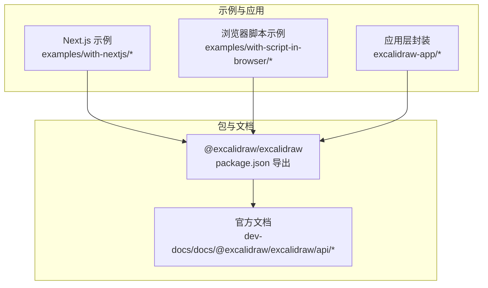
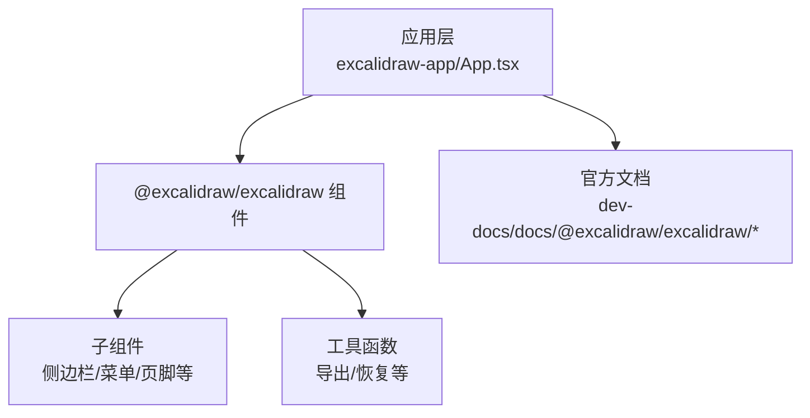
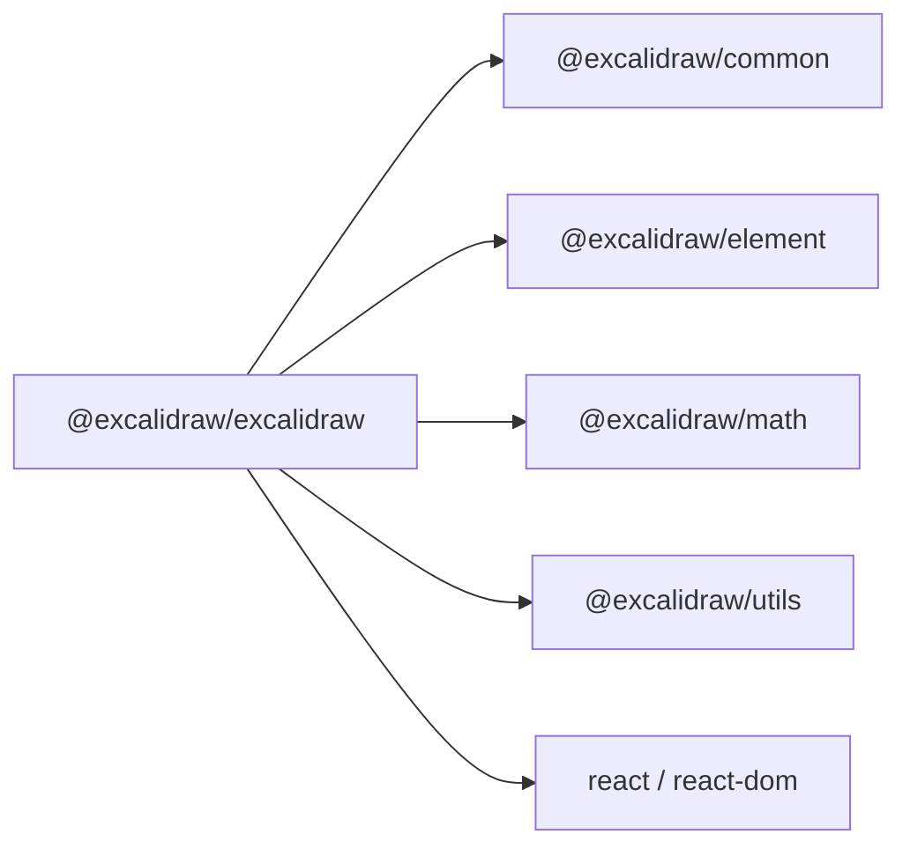

# API 参考

<cite>
**本文引用的文件**
- [packages/excalidraw/package.json](file://packages/excalidraw/package.json)
- [README.md](file://README.md)
- [dev-docs/docs/@excalidraw/excalidraw/api/api-intro.mdx](file://dev-docs/docs/@excalidraw/excalidraw/api/api-intro.mdx)
- [dev-docs/docs/@excalidraw/excalidraw/api/props/props.mdx](file://dev-docs/docs/@excalidraw/excalidraw/api/props/props.mdx)
- [dev-docs/docs/@excalidraw/excalidraw/api/props/excalidraw-api.mdx](file://dev-docs/docs/@excalidraw/excalidraw/api/props/excalidraw-api.mdx)
- [dev-docs/docs/@excalidraw/excalidraw/api/props/render-props.mdx](file://dev-docs/docs/@excalidraw/excalidraw/api/props/render-props.mdx)
- [dev-docs/docs/@excalidraw/excalidraw/api/props/ui-options.mdx](file://dev-docs/docs/@excalidraw/excalidraw/api/props/ui-options.mdx)
- [dev-docs/docs/@excalidraw/excalidraw/api/utils/utils-intro.md](file://dev-docs/docs/@excalidraw/excalidraw/api/utils/utils-intro.md)
- [dev-docs/docs/@excalidraw/excalidraw/api/utils/export.mdx](file://dev-docs/docs/@excalidraw/excalidraw/api/utils/export.mdx)
- [dev-docs/docs/@excalidraw/excalidraw/api/utils/restore.mdx](file://dev-docs/docs/@excalidraw/excalidraw/api/utils/restore.mdx)
- [dev-docs/docs/@excalidraw/excalidraw/api/constants.mdx](file://dev-docs/docs/@excalidraw/excalidraw/api/constants.mdx)
- [dev-docs/docs/@excalidraw/excalidraw/api/excalidraw-element-skeleton.mdx](file://dev-docs/docs/@excalidraw/excalidraw/api/excalidraw-element-skeleton.mdx)
- [dev-docs/docs/@excalidraw/excalidraw/api/children-components/children-components-intro.mdx](file://dev-docs/docs/@excalidraw/excalidraw/api/children-components/children-components-intro.mdx)
- [dev-docs/docs/@excalidraw/excalidraw/api/children-components/footer.mdx](file://dev-docs/docs/@excalidraw/excalidraw/api/children-components/footer.mdx)
- [dev-docs/docs/@excalidraw/excalidraw/api/children-components/main-menu.mdx](file://dev-docs/docs/@excalidraw/excalidraw/api/children-components/main-menu.mdx)
- [dev-docs/docs/@excalidraw/excalidraw/api/children-components/sidebar.mdx](file://dev-docs/docs/@excalidraw/excalidraw/api/children-components/sidebar.mdx)
- [dev-docs/docs/@excalidraw/excalidraw/api/children-components/welcome-screen.mdx](file://dev-docs/docs/@excalidraw/excalidraw/api/children-components/welcome-screen.mdx)
- [dev-docs/docs/@excalidraw/excalidraw/api/children-components/live-collaboration-trigger.mdx](file://dev-docs/docs/@excalidraw/excalidraw/api/children-components/live-collaboration-trigger.mdx)
- [dev-docs/docs/@excalidraw/excalidraw/customizing-styles.mdx](file://dev-docs/docs/@excalidraw/excalidraw/customizing-styles.mdx)
- [dev-docs/docs/@excalidraw/excalidraw/integration.mdx](file://dev-docs/docs/@excalidraw/excalidraw/integration.mdx)
- [dev-docs/docs/@excalidraw/excalidraw/installation.mdx](file://dev-docs/docs/@excalidraw/excalidraw/installation.mdx)
- [dev-docs/docs/@excalidraw/excalidraw/development.mdx](file://dev-docs/docs/@excalidraw/excalidraw/development.mdx)
- [dev-docs/docs/@excalidraw/excalidraw/faq.mdx](file://dev-docs/docs/@excalidraw/excalidraw/faq.mdx)
- [dev-docs/docs/@excalidraw/excalidraw/api/initialdata.mdx](file://dev-docs/docs/@excalidraw/excalidraw/api/initialdata.mdx)
- [dev-docs/docs/@excalidraw/excalidraw/api/excalidraw-element-skeleton.mdx](file://dev-docs/docs/@excalidraw/excalidraw/api/excalidraw-element-skeleton.mdx)
- [dev-docs/docs/@excalidraw/excalidraw/api/props/initialdata.mdx](file://dev-docs/docs/@excalidraw/excalidraw/api/props/initialdata.mdx)
- [dev-docs/docs/@excalidraw/excalidraw/api/props/props.mdx](file://dev-docs/docs/@excalidraw/excalidraw/api/props/props.mdx)
- [dev-docs/docs/@excalidraw/excalidraw/api/props/excalidraw-api.mdx](file://dev-docs/docs/@excalidraw/excalidraw/api/props/excalidraw-api.mdx)
- [dev-docs/docs/@excalidraw/excalidraw/api/props/render-props.mdx](file://dev-docs/docs/@excalidraw/excalidraw/api/props/render-props.mdx)
- [dev-docs/docs/@excalidraw/excalidraw/api/props/ui-options.mdx](file://dev-docs/docs/@excalidraw/excalidraw/api/props/ui-options.mdx)
- [dev-docs/docs/@excalidraw/excalidraw/api/utils/export.mdx](file://dev-docs/docs/@excalidraw/excalidraw/api/utils/export.mdx)
- [dev-docs/docs/@excalidraw/excalidraw/api/utils/restore.mdx](file://dev-docs/docs/@excalidraw/excalidraw/api/utils/restore.mdx)
- [dev-docs/docs/@excalidraw/excalidraw/api/utils/utils-intro.md](file://dev-docs/docs/@excalidraw/excalidraw/api/utils/utils-intro.md)
- [dev-docs/docs/@excalidraw/excalidraw/api/constants.mdx](file://dev-docs/docs/@excalidraw/excalidraw/api/constants.mdx)
- [dev-docs/docs/@excalidraw/excalidraw/api/api-intro.mdx](file://dev-docs/docs/@excalidraw/excalidraw/api/api-intro.mdx)
- [dev-docs/docs/@excalidraw/excalidraw/api/children-components/children-components-intro.mdx](file://dev-docs/docs/@excalidraw/excalidraw/api/children-components/children-components-intro.mdx)
- [dev-docs/docs/@excalidraw/excalidraw/api/children-components/footer.mdx](file://dev-docs/docs/@excalidraw/excalidraw/api/children-components/footer.mdx)
- [dev-docs/docs/@excalidraw/excalidraw/api/children-components/main-menu.mdx](file://dev-docs/docs/@excalidraw/excalidraw/api/children-components/main-menu.mdx)
- [dev-docs/docs/@excalidraw/excalidraw/api/children-components/sidebar.mdx](file://dev-docs/docs/@excalidraw/excalidraw/api/children-components/sidebar.mdx)
- [dev-docs/docs/@excalidraw/excalidraw/api/children-components/welcome-screen.mdx](file://dev-docs/docs/@excalidraw/excalidraw/api/children-components/welcome-screen.mdx)
- [dev-docs/docs/@excalidraw/excalidraw/api/children-components/live-collaboration-trigger.mdx](file://dev-docs/docs/@excalidraw/excalidraw/api/children-components/live-collaboration-trigger.mdx)
- [dev-docs/docs/@excalidraw/excalidraw/customizing-styles.mdx](file://dev-docs/docs/@excalidraw/excalidraw/customizing-styles.mdx)
- [dev-docs/docs/@excalidraw/excalidraw/integration.mdx](file://dev-docs/docs/@excalidraw/excalidraw/integration.mdx)
- [dev-docs/docs/@excalidraw/excalidraw/installation.mdx](file://dev-docs/docs/@excalidraw/excalidraw/installation.mdx)
- [dev-docs/docs/@excalidraw/excalidraw/development.mdx](file://dev-docs/docs/@excalidraw/excalidraw/development.mdx)
- [dev-docs/docs/@excalidraw/excalidraw/faq.mdx](file://dev-docs/docs/@excalidraw/excalidraw/faq.mdx)
</cite>

## 目录

1. [简介](#简介)
2. [项目结构](#项目结构)
3. [核心组件](#核心组件)
4. [架构总览](#架构总览)
5. [详细组件分析](#详细组件分析)
6. [依赖分析](#依赖分析)
7. [性能考虑](#性能考虑)
8. [故障排查指南](#故障排查指南)
9. [结论](#结论)
10. [附录](#附录)

## 简介

本参考文档面向使用 @excalidraw/excalidraw 的前端开发者，系统梳理公开 API（组件属性、方法签名、事件回调、类型定义）、使用示例、版本兼容性与迁移建议、TypeScript 类型约束与类型安全检查、最佳实践、性能考量与常见陷阱。内容基于仓库内官方文档与包元数据整理而成，确保与实现同步。

## 项目结构

- 包入口与导出：@excalidraw/excalidraw 通过 package.json 的 exports 字段声明了多模块导出，包含主入口、CSS 入口以及按子模块（common/element/math/utils）的类型导出，便于按需引入与类型推断。
- 文档来源：官方文档位于 dev-docs/docs/@excalidraw/excalidraw/api 下，涵盖 Props、Children 组件、Utils 工具、常量与元素骨架等主题。
- 示例与集成：examples 目录提供了 Next.js 与浏览器脚本两种集成方式，可作为 API 使用范式参考。

**章节来源**

- [packages/excalidraw/package.json:1-141](file://packages/excalidraw/package.json#L1-L141)
- [README.md:1-125](file://README.md#L1-L125)

## 核心组件

本节聚焦于对外公开的 React 组件与 API，结合官方文档进行分门别类说明。

- 主组件与属性（Props）

  - 组件属性：包含渲染选项、初始数据、UI 行为控制等，详见 Props 章节。
  - 初始数据（InitialData）：用于初始化画布状态，详见 InitialData 章节。
  - 渲染属性（Render Props）：允许自定义渲染逻辑，详见 Render Props 章节。
  - UI 选项（UI Options）：控制界面可见性与交互行为，详见 UI Options 章节。

- 子组件（Children Components）

  - 侧边栏、菜单、页脚、欢迎屏、实时协作触发器等，均可作为子组件注入以定制 UI。

- 工具函数（Utils）

  - 导出工具：支持导出 PNG/SVG/Clipboard 等格式。
  - 恢复工具：从序列化数据恢复画布状态。
  - 工具概览：工具函数集合与使用说明。

- 常量与元素骨架
  - 常量：如工具模式、状态枚举等。
  - 元素骨架：描述元素结构与字段，便于类型约束与校验。

**章节来源**

- [dev-docs/docs/@excalidraw/excalidraw/api/props/props.mdx](file://dev-docs/docs/@excalidraw/excalidraw/api/props/props.mdx)
- [dev-docs/docs/@excalidraw/excalidraw/api/props/initialdata.mdx](file://dev-docs/docs/@excalidraw/excalidraw/api/props/initialdata.mdx)
- [dev-docs/docs/@excalidraw/excalidraw/api/props/render-props.mdx](file://dev-docs/docs/@excalidraw/excalidraw/api/props/render-props.mdx)
- [dev-docs/docs/@excalidraw/excalidraw/api/props/ui-options.mdx](file://dev-docs/docs/@excalidraw/excalidraw/api/props/ui-options.mdx)
- [dev-docs/docs/@excalidraw/excalidraw/api/children-components/children-components-intro.mdx](file://dev-docs/docs/@excalidraw/excalidraw/api/children-components/children-components-intro.mdx)
- [dev-docs/docs/@excalidraw/excalidraw/api/utils/utils-intro.md](file://dev-docs/docs/@excalidraw/excalidraw/api/utils/utils-intro.md)
- [dev-docs/docs/@excalidraw/excalidraw/api/utils/export.mdx](file://dev-docs/docs/@excalidraw/excalidraw/api/utils/export.mdx)
- [dev-docs/docs/@excalidraw/excalidraw/api/utils/restore.mdx](file://dev-docs/docs/@excalidraw/excalidraw/api/utils/restore.mdx)
- [dev-docs/docs/@excalidraw/excalidraw/api/constants.mdx](file://dev-docs/docs/@excalidraw/excalidraw/api/constants.mdx)
- [dev-docs/docs/@excalidraw/excalidraw/api/excalidraw-element-skeleton.mdx](file://dev-docs/docs/@excalidraw/excalidraw/api/excalidraw-element-skeleton.mdx)

## 架构总览

下图展示了应用层如何通过 @excalidraw/excalidraw 组件与文档/示例进行集成，以及与工具函数、子组件的关系。

**图表来源**

- [dev-docs/docs/@excalidraw/excalidraw/api/children-components/children-components-intro.mdx](file://dev-docs/docs/@excalidraw/excalidraw/api/children-components/children-components-intro.mdx)
- [dev-docs/docs/@excalidraw/excalidraw/api/utils/utils-intro.md](file://dev-docs/docs/@excalidraw/excalidraw/api/utils/utils-intro.md)
- [dev-docs/docs/@excalidraw/excalidraw/api/api-intro.mdx](file://dev-docs/docs/@excalidraw/excalidraw/api/api-intro.mdx)

## 详细组件分析

### 组件属性（Props）

- 职责：定义主组件的输入配置，包括渲染行为、UI 控制、初始数据等。
- 关键点：
  - 属性拆分：Props、InitialData、Render Props、UI Options 各自独立文档，便于查阅。
  - 类型安全：通过 package.json 的 types 字段指向编译后的 .d.ts，确保 TS 用户获得准确类型。
- 使用建议：
  - 将 UI 选项与渲染属性分离，避免在单一对象中混杂过多职责。
  - 初始数据仅在首次挂载时生效，后续更新请使用工具函数或状态管理。

**章节来源**

- [dev-docs/docs/@excalidraw/excalidraw/api/props/props.mdx](file://dev-docs/docs/@excalidraw/excalidraw/api/props/props.mdx)
- [dev-docs/docs/@excalidraw/excalidraw/api/props/initialdata.mdx](file://dev-docs/docs/@excalidraw/excalidraw/api/props/initialdata.mdx)
- [dev-docs/docs/@excalidraw/excalidraw/api/props/render-props.mdx](file://dev-docs/docs/@excalidraw/excalidraw/api/props/render-props.mdx)
- [dev-docs/docs/@excalidraw/excalidraw/api/props/ui-options.mdx](file://dev-docs/docs/@excalidraw/excalidraw/api/props/ui-options.mdx)
- [packages/excalidraw/package.json:1-141](file://packages/excalidraw/package.json#L1-L141)

### 子组件（Children Components）

- 职责：作为插槽式子组件注入，扩展 UI 与交互。
- 支持的子组件：
  - 侧边栏、主菜单、页脚、欢迎屏、实时协作触发器等。
- 使用建议：
  - 通过子组件替换默认 UI，保持最小改动以降低升级成本。
  - 注意子组件的生命周期与状态同步，避免与主组件产生冲突。

**章节来源**

- [dev-docs/docs/@excalidraw/excalidraw/api/children-components/children-components-intro.mdx](file://dev-docs/docs/@excalidraw/excalidraw/api/children-components/children-components-intro.mdx)
- [dev-docs/docs/@excalidraw/excalidraw/api/children-components/sidebar.mdx](file://dev-docs/docs/@excalidraw/excalidraw/api/children-components/sidebar.mdx)
- [dev-docs/docs/@excalidraw/excalidraw/api/children-components/main-menu.mdx](file://dev-docs/docs/@excalidraw/excalidraw/api/children-components/main-menu.mdx)
- [dev-docs/docs/@excalidraw/excalidraw/api/children-components/footer.mdx](file://dev-docs/docs/@excalidraw/excalidraw/api/children-components/footer.mdx)
- [dev-docs/docs/@excalidraw/excalidraw/api/children-components/welcome-screen.mdx](file://dev-docs/docs/@excalidraw/excalidraw/api/children-components/welcome-screen.mdx)
- [dev-docs/docs/@excalidraw/excalidraw/api/children-components/live-collaboration-trigger.mdx](file://dev-docs/docs/@excalidraw/excalidraw/api/children-components/live-collaboration-trigger.mdx)

### 工具函数（Utils）

- 导出工具：支持导出 PNG/SVG/剪贴板等格式，便于集成到业务流程。
- 恢复工具：从序列化数据恢复画布状态，适合持久化与回放场景。
- 使用建议：
  - 导出前先冻结/锁定交互，避免并发写入导致的数据不一致。
  - 恢复时注意版本兼容性，必要时进行数据清洗与迁移。

**章节来源**

- [dev-docs/docs/@excalidraw/excalidraw/api/utils/utils-intro.md](file://dev-docs/docs/@excalidraw/excalidraw/api/utils/utils-intro.md)
- [dev-docs/docs/@excalidraw/excalidraw/api/utils/export.mdx](file://dev-docs/docs/@excalidraw/excalidraw/api/utils/export.mdx)
- [dev-docs/docs/@excalidraw/excalidraw/api/utils/restore.mdx](file://dev-docs/docs/@excalidraw/excalidraw/api/utils/restore.mdx)

### 常量与元素骨架

- 常量：提供工具模式、状态枚举等，统一行为约定。
- 元素骨架：描述元素结构字段，便于类型约束与校验。
- 使用建议：
  - 在业务层以常量驱动 UI 与交互，减少魔法字符串。
  - 对外部传入的元素数据进行骨架校验，保证类型安全。

**章节来源**

- [dev-docs/docs/@excalidraw/excalidraw/api/constants.mdx](file://dev-docs/docs/@excalidraw/excalidraw/api/constants.mdx)
- [dev-docs/docs/@excalidraw/excalidraw/api/excalidraw-element-skeleton.mdx](file://dev-docs/docs/@excalidraw/excalidraw/api/excalidraw-element-skeleton.mdx)

## 依赖分析

- 包导出与类型：
  - package.json 的 exports 字段声明了多入口与 types 映射，确保运行时与类型层解耦。
  - peerDependencies 指定 React 版本范围，避免重复打包与运行时冲突。
- 外部依赖：
  - 包含 @excalidraw/\* 子包（common/element/math/utils）与第三方 UI/编辑器/状态管理等依赖。
- 集成关系：
  - 应用层通过 Next.js 或浏览器脚本示例集成 @excalidraw/excalidraw，再调用子组件与工具函数。

**图表来源**

- [packages/excalidraw/package.json:1-141](file://packages/excalidraw/package.json#L1-L141)

**章节来源**

- [packages/excalidraw/package.json:1-141](file://packages/excalidraw/package.json#L1-L141)

## 性能考虑

- 按需加载与导出：优先使用子组件与工具函数的按需导入，减少包体与首屏负担。
- 导出优化：导出大图时建议在后台线程或服务端执行，避免阻塞主线程。
- 状态管理：对频繁变更的状态采用节流/防抖策略，降低重渲染频率。
- 样式与主题：通过 CSS 变量与主题切换，避免在运行时大量 DOM 修改。

## 故障排查指南

- 版本不匹配：若出现运行时错误，请核对 React 版本是否满足 peerDependencies 要求。
- 类型缺失：确认已安装 @excalidraw/excalidraw 并启用 TypeScript 类型检查，确保 types 字段正确指向 .d.ts。
- 子组件冲突：当自定义子组件与默认行为冲突时，优先检查注入顺序与状态同步。
- 导出失败：检查导出工具的权限与环境（浏览器/Node），并在失败时回退到轻量方案。

**章节来源**

- [packages/excalidraw/package.json:1-141](file://packages/excalidraw/package.json#L1-L141)
- [dev-docs/docs/@excalidraw/excalidraw/faq.mdx](file://dev-docs/docs/@excalidraw/excalidraw/faq.mdx)

## 结论

本参考文档基于官方文档与包元数据，系统梳理了 @excalidraw/excalidraw 的公开 API 与使用要点。建议在集成时遵循“属性分离、子组件插槽、工具函数按需”的原则，并结合类型定义与常量约定，确保类型安全与可维护性。

## 附录

- 快速开始与集成：参见安装与集成文档。
- 开发与贡献：参见开发与贡献文档。
- 自定义样式：参见样式定制文档。

**章节来源**

- [dev-docs/docs/@excalidraw/excalidraw/installation.mdx](file://dev-docs/docs/@excalidraw/excalidraw/installation.mdx)
- [dev-docs/docs/@excalidraw/excalidraw/integration.mdx](file://dev-docs/docs/@excalidraw/excalidraw/integration.mdx)
- [dev-docs/docs/@excalidraw/excalidraw/development.mdx](file://dev-docs/docs/@excalidraw/excalidraw/development.mdx)
- [dev-docs/docs/@excalidraw/excalidraw/customizing-styles.mdx](file://dev-docs/docs/@excalidraw/excalidraw/customizing-styles.mdx)
