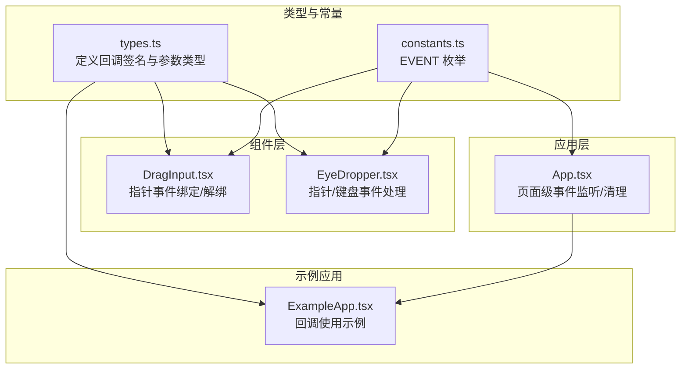
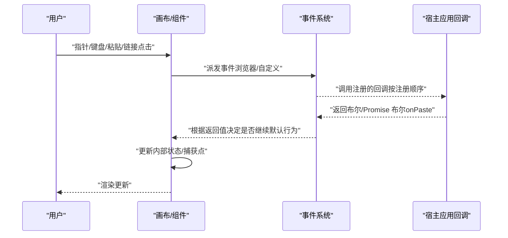
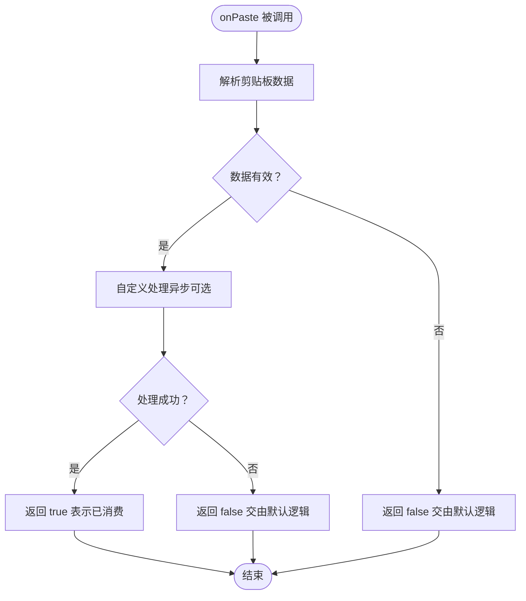
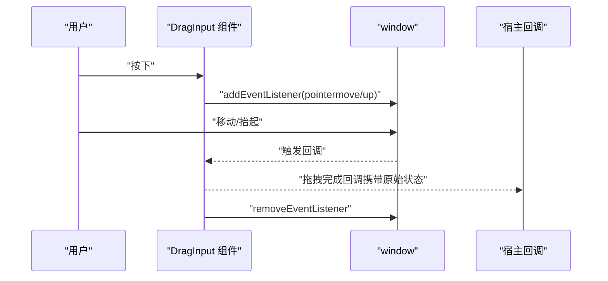
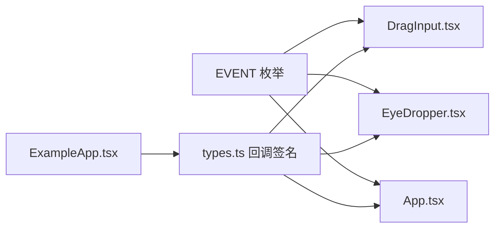

# 事件回调 API

<cite>
**本文引用的文件**
- [packages/excalidraw/types.ts](file://packages/excalidraw/types.ts)
- [packages/common/src/constants.ts](file://packages/common/src/constants.ts)
- [packages/excalidraw/components/Stats/DragInput.tsx](file://packages/excalidraw/components/Stats/DragInput.tsx)
- [packages/excalidraw/components/EyeDropper.tsx](file://packages/excalidraw/components/EyeDropper.tsx)
- [packages/excalidraw/actions/actionClipboard.tsx](file://packages/excalidraw/actions/actionClipboard.tsx)
- [excalidraw-app/App.tsx](file://excalidraw-app/App.tsx)
- [examples/with-script-in-browser/components/ExampleApp.tsx](file://examples/with-script-in-browser/components/ExampleApp.tsx)
</cite>

## 目录

1. [简介](#简介)
2. [项目结构](#项目结构)
3. [核心组件](#核心组件)
4. [架构总览](#架构总览)
5. [详细组件分析](#详细组件分析)
6. [依赖关系分析](#依赖关系分析)
7. [性能考量](#性能考量)
8. [故障排查指南](#故障排查指南)
9. [结论](#结论)
10. [附录](#附录)

## 简介

本文件为 Excalidraw 事件回调系统的完整 API 文档，聚焦于开发者可订阅的事件回调接口，包括但不限于 onChange、onPointerUpdate、onPaste、onDropImage（如适用）、onLinkOpen、onPointerDown/onPointerUp 等。文档将说明每个回调的触发时机、参数结构、返回值处理方式、事件生命周期与执行顺序、取消与清理机制、最佳实践、性能优化与内存管理策略，以及异步事件处理、错误捕获与重试建议。同时提供事件监听、移除与调试方法，并解释事件与组件状态之间的关系及数据流向。

## 项目结构

围绕事件回调相关的关键位置如下：

- 类型定义与回调签名：位于包内类型文件中，明确回调参数与返回值约束
- 常量与事件枚举：统一管理浏览器与自定义事件名称
- 具体组件中的事件绑定与触发：如拖拽输入、取色器等
- 应用层对页面级事件的监听与清理：如卸载、可见性变化等
- 示例应用中的回调使用：展示如何在宿主应用中订阅与处理回调

**图表来源**

- [packages/excalidraw/types.ts:584-728](file://packages/excalidraw/types.ts#L584-L728)
- [packages/common/src/constants.ts:52-84](file://packages/common/src/constants.ts#L52-L84)
- [packages/excalidraw/components/Stats/DragInput.tsx:284-330](file://packages/excalidraw/components/Stats/DragInput.tsx#L284-L330)
- [packages/excalidraw/components/EyeDropper.tsx:134-173](file://packages/excalidraw/components/EyeDropper.tsx#L134-L173)
- [excalidraw-app/App.tsx:619-651](file://excalidraw-app/App.tsx#L619-L651)
- [examples/with-script-in-browser/components/ExampleApp.tsx:345-470](file://examples/with-script-in-browser/components/ExampleApp.tsx#L345-L470)

**章节来源**

- [packages/excalidraw/types.ts:584-728](file://packages/excalidraw/types.ts#L584-L728)
- [packages/common/src/constants.ts:52-84](file://packages/common/src/constants.ts#L52-L84)
- [excalidraw-app/App.tsx:619-651](file://excalidraw-app/App.tsx#L619-L651)

## 核心组件

本节梳理与事件回调直接相关的核心类型与回调签名，帮助快速定位与理解各回调的职责与参数。

- onChange

  - 触发时机：场景元素、应用状态或文件发生变更时
  - 参数：元素数组、应用状态、二进制文件映射
  - 返回值：无
  - 用途：持久化、同步、统计上报等
  - 参考路径：[onChange 回调签名:584-589](file://packages/excalidraw/types.ts#L584-L589)

- onPointerUpdate

  - 触发时机：指针移动过程中的更新
  - 参数：包含指针坐标、工具类型、按钮状态、多指手势映射
  - 返回值：无
  - 用途：外部 UI 同步、激光笔轨迹、远程协作显示等
  - 参考路径：[onPointerUpdate 回调签名:615-619](file://packages/excalidraw/types.ts#L615-L619)

- onPaste

  - 触发时机：粘贴操作被触发
  - 参数：剪贴板数据、原生事件对象（可能为空）
  - 返回值：布尔或 Promise 布尔，用于指示是否已消费该粘贴事件
  - 用途：自定义解析、过滤、拦截与回退
  - 参考路径：[onPaste 回调签名:620-623](file://packages/excalidraw/types.ts#L620-L623)

- onLinkOpen

  - 触发时机：点击画布上的链接元素
  - 参数：元素对象、包含原生事件详情的自定义事件
  - 返回值：无
  - 用途：拦截内部链接跳转，交由路由系统处理
  - 参考路径：[onLinkOpen 回调签名:672-677](file://packages/excalidraw/types.ts#L672-L677)

- onPointerDown / onPointerUp

  - 触发时机：指针按下/抬起
  - 参数：当前活动工具、按下状态上下文
  - 返回值：无
  - 用途：自定义工具交互、批处理开始/结束
  - 参考路径：[onPointerDown/onPointerUp 回调签名:678-685](file://packages/excalidraw/types.ts#L678-L685)

- 页面级事件监听（示例）
  - 触发时机：页面可见性变化、窗口卸载、焦点变化、哈希变化
  - 参数：对应事件对象
  - 返回值：无
  - 用途：保存草稿、同步数据、资源清理
  - 参考路径：[页面事件监听与清理:619-651](file://excalidraw-app/App.tsx#L619-L651)

**章节来源**

- [packages/excalidraw/types.ts:584-728](file://packages/excalidraw/types.ts#L584-L728)
- [excalidraw-app/App.tsx:619-651](file://excalidraw-app/App.tsx#L619-L651)

## 架构总览

下图展示了从用户交互到回调触发再到状态更新的整体流程，强调事件生命周期、执行顺序与清理机制。

**图表来源**

- [packages/excalidraw/types.ts:584-728](file://packages/excalidraw/types.ts#L584-L728)
- [packages/common/src/constants.ts:52-84](file://packages/common/src/constants.ts#L52-L84)
- [packages/excalidraw/actions/actionClipboard.tsx:91-110](file://packages/excalidraw/actions/actionClipboard.tsx#L91-L110)

## 详细组件分析

### onChange 回调

- 触发时机
  - 场景元素集合发生变化（新增、删除、修改）
  - 应用状态变化（如缩放、滚动、选中元素等）
  - 文件资源变化（图片等二进制文件）
- 参数结构
  - elements: 只读有序元素列表
  - appState: 当前应用状态快照
  - files: 元素到二进制文件的映射
- 返回值处理
  - 无返回值；通常用于持久化或通知外部系统
- 生命周期与执行顺序
  - 在状态捕获点后触发，确保回调拿到最新状态
- 最佳实践
  - 避免在回调中进行重型计算；必要时使用节流/防抖
  - 对 files 进行去重与版本校验，避免重复上传
- 性能优化
  - 使用浅比较或选择性更新策略
  - 分批处理大量元素变更
- 内存管理
  - 不持有长生命周期引用；及时释放临时对象
- 异步与错误
  - 如需异步持久化，应在宿主侧自行处理错误并提示
- 调试
  - 记录变更前后的元素 ID 列表差异
  - 输出 appState 关键字段以辅助定位问题

**章节来源**

- [packages/excalidraw/types.ts:584-589](file://packages/excalidraw/types.ts#L584-L589)

### onPointerUpdate 回调

- 触发时机
  - 指针在画布上移动时周期性触发
- 参数结构
  - pointer: { x, y, tool }（工具类型为 pointer 或 laser）
  - button: "down" | "up"
  - pointersMap: 多指手势映射
- 返回值处理
  - 无返回值；用于外部 UI 同步
- 生命周期与执行顺序
  - 在指针事件处理链路中较早阶段触发
- 最佳实践
  - 对高频事件进行节流；仅在必要时更新外部 UI
  - 区分 tool 类型，分别处理鼠标与激光笔
- 性能优化
  - 使用 requestAnimationFrame 或节流函数
- 内存管理
  - 不缓存事件对象；复制必要字段
- 异步与错误
  - 回调内不进行异步 IO；如需，应委托给宿主应用
- 调试
  - 打印指针坐标与按钮状态，验证坐标系转换

**章节来源**

- [packages/excalidraw/types.ts:615-619](file://packages/excalidraw/types.ts#L615-L619)

### onPaste 回调

- 触发时机
  - 用户执行粘贴动作（键盘快捷键或右键菜单）
- 参数结构
  - data: 剪贴板数据
  - event: 原生 ClipboardEvent 或 null
- 返回值处理
  - 返回布尔或 Promise 布尔
    - true 表示已消费并处理了粘贴内容
    - false 表示未处理，交由默认粘贴逻辑
- 生命周期与执行顺序
  - 在默认粘贴逻辑之前被调用
- 最佳实践
  - 自定义解析优先于默认解析；失败时返回 false 交由默认处理
  - 支持多种格式（文本、HTML、图像等），并做降级处理
- 性能优化
  - 尽量避免阻塞主线程；异步解析与转换
- 内存管理
  - 解析完成后释放临时缓冲区
- 异步与错误
  - 若返回 Promise，请在回调内捕获异常并返回 false 或抛出错误
  - 可结合进度提示与取消信号
- 调试
  - 记录 data 的类型与内容摘要
  - 捕获并记录解析失败原因

**图表来源**

- [packages/excalidraw/types.ts:620-623](file://packages/excalidraw/types.ts#L620-L623)
- [packages/excalidraw/actions/actionClipboard.tsx:91-110](file://packages/excalidraw/actions/actionClipboard.tsx#L91-L110)

**章节来源**

- [packages/excalidraw/types.ts:620-623](file://packages/excalidraw/types.ts#L620-L623)
- [packages/excalidraw/actions/actionClipboard.tsx:91-110](file://packages/excalidraw/actions/actionClipboard.tsx#L91-L110)

### onLinkOpen 回调

- 触发时机
  - 点击画布上的链接元素
- 参数结构
  - element: 非删除元素对象（含 link 字段）
  - event: 自定义事件，detail 中包含原生事件
- 返回值处理
  - 无返回值；可通过 event.preventDefault() 拦截默认跳转
- 生命周期与执行顺序
  - 在默认链接打开逻辑之前触发
- 最佳实践
  - 对内部链接进行拦截，交由前端路由处理
  - 支持新标签页/窗口打开策略
- 性能优化
  - 快速判断与分流，避免复杂计算
- 内存管理
  - 不保留事件对象引用
- 异步与错误
  - 回调内不做异步 IO；如需，委托宿主应用
- 调试
  - 记录链接地址与按键组合（Ctrl/Cmd/Shift）

**章节来源**

- [packages/excalidraw/types.ts:672-677](file://packages/excalidraw/types.ts#L672-L677)

### onPointerDown / onPointerUp 回调

- 触发时机
  - 指针按下/抬起时触发
- 参数结构
  - activeTool: 当前活动工具
  - pointerDownState: 按下状态上下文（包含命中元素、偏移等）
- 返回值处理
  - 无返回值；用于自定义工具交互
- 生命周期与执行顺序
  - 在指针事件处理链路早期触发
- 最佳实践
  - 与 onPointerUpdate 配合，实现自定义拖拽/绘制工具
  - 在 onPointerUp 中清理事件监听与临时状态
- 性能优化
  - 避免在回调中进行重型计算
- 内存管理
  - 显式移除事件监听；释放闭包引用
- 异步与错误
  - 回调内不做异步 IO；如需，委托宿主应用
- 调试
  - 记录按下/抬起的坐标与命中元素 ID

**章节来源**

- [packages/excalidraw/types.ts:678-685](file://packages/excalidraw/types.ts#L678-L685)

### 页面级事件监听（示例）

- 触发时机
  - 页面可见性变化、窗口卸载、焦点变化、哈希变化
- 参数结构
  - 对应标准事件对象
- 返回值处理
  - 无返回值；用于保存与同步
- 生命周期与执行顺序
  - 在组件挂载时注册，在卸载时清理
- 最佳实践
  - 在卸载与 blur 时保存草稿
  - 在可见性变化与 focus 时同步数据
- 性能优化
  - 使用节流/防抖减少频繁写入
- 内存管理
  - 清理所有事件监听器
- 异步与错误
  - 异步保存需处理中断与失败
- 调试
  - 记录事件类型与时间戳

**章节来源**

- [excalidraw-app/App.tsx:619-651](file://excalidraw-app/App.tsx#L619-L651)

### 组件内事件绑定与清理（示例）

- DragInput 组件
  - 在按下时注册 pointermove/pointerup 监听
  - 在抬起时移除监听并触发拖拽完成回调
  - 参考路径：[指针事件绑定/解绑与回调触发:284-330](file://packages/excalidraw/components/Stats/DragInput.tsx#L284-L330)
- EyeDropper 组件
  - 捕获 pointerdown/pointerup 与 keydown 事件
  - 在抬起时阻止默认行为并触发选择回调
  - 参考路径：[指针/键盘事件处理:134-173](file://packages/excalidraw/components/EyeDropper.tsx#L134-L173)

**图表来源**

- [packages/excalidraw/components/Stats/DragInput.tsx:284-330](file://packages/excalidraw/components/Stats/DragInput.tsx#L284-L330)

**章节来源**

- [packages/excalidraw/components/Stats/DragInput.tsx:284-330](file://packages/excalidraw/components/Stats/DragInput.tsx#L284-L330)
- [packages/excalidraw/components/EyeDropper.tsx:134-173](file://packages/excalidraw/components/EyeDropper.tsx#L134-L173)

## 依赖关系分析

- 事件名称统一来源于常量枚举，保证跨模块一致性
- 组件通过全局 window/document 注册/移除事件监听
- 回调在事件处理链路中被调用，部分回调（如 onPaste）可影响默认行为
- 应用层负责页面级事件的注册与清理，避免内存泄漏

**图表来源**

- [packages/common/src/constants.ts:52-84](file://packages/common/src/constants.ts#L52-L84)
- [packages/excalidraw/types.ts:584-728](file://packages/excalidraw/types.ts#L584-L728)
- [excalidraw-app/App.tsx:619-651](file://excalidraw-app/App.tsx#L619-L651)

**章节来源**

- [packages/common/src/constants.ts:52-84](file://packages/common/src/constants.ts#L52-L84)
- [packages/excalidraw/types.ts:584-728](file://packages/excalidraw/types.ts#L584-L728)
- [excalidraw-app/App.tsx:619-651](file://excalidraw-app/App.tsx#L619-L651)

## 性能考量

- 高频事件节流/防抖
  - onPointerUpdate、指针移动类事件建议节流
  - onChange 可按批处理合并多次变更
- 异步处理
  - onPaste、导出等耗时操作应异步执行，并提供进度反馈
- 内存管理
  - 组件卸载时务必移除所有事件监听
  - 避免闭包持有大对象引用
- I/O 优化
  - 批量写入本地存储或服务端
  - 对文件资源进行去重与版本控制

## 故障排查指南

- 回调未触发
  - 检查是否正确传入回调 props
  - 确认事件监听是否在组件挂载后注册
- 回调被多次触发
  - 确保在卸载时移除事件监听
  - 避免重复注册同一监听器
- onPaste 无效
  - 确认返回值语义：true 表示已消费，false 交由默认逻辑
  - 捕获并记录解析异常
- 页面级事件失效
  - 检查注册/清理逻辑是否成对出现
  - 确认事件名与枚举一致

**章节来源**

- [packages/excalidraw/components/Stats/DragInput.tsx:284-330](file://packages/excalidraw/components/Stats/DragInput.tsx#L284-L330)
- [packages/excalidraw/actions/actionClipboard.tsx:91-110](file://packages/excalidraw/actions/actionClipboard.tsx#L91-L110)
- [excalidraw-app/App.tsx:619-651](file://excalidraw-app/App.tsx#L619-L651)

## 结论

Excalidraw 的事件回调体系以类型安全的回调签名为核心，配合统一的事件枚举与组件内的监听/清理机制，为宿主应用提供了灵活且可控的扩展点。遵循本文的最佳实践与性能建议，可在保证用户体验的同时，最大化事件处理的稳定性与效率。

## 附录

- 事件名称与枚举参考：[EVENT 枚举:52-84](file://packages/common/src/constants.ts#L52-L84)
- 回调签名与参数参考：[ExcalidrawProps 回调定义:584-728](file://packages/excalidraw/types.ts#L584-728)
- 示例应用中的回调使用参考：[ExampleApp 回调示例:345-470](file://examples/with-script-in-browser/components/ExampleApp.tsx#L345-L470)
