# 元素 API

<cite>
**本文引用的文件**
- [packages/element/src/types.ts](file://packages/element/src/types.ts)
- [packages/element/src/comparisons.ts](file://packages/element/src/comparisons.ts)
- [packages/element/src/distance.ts](file://packages/element/src/distance.ts)
- [packages/element/src/collision.ts](file://packages/element/src/collision.ts)
- [packages/element/src/utils.ts](file://packages/element/src/utils.ts)
- [packages/element/src/renderElement.ts](file://packages/element/src/renderElement.ts)
- [packages/element/src/transform.ts](file://packages/element/src/transform.ts)
- [packages/element/package.json](file://packages/element/package.json)
- [packages/math/src/types.ts](file://packages/math/src/types.ts)
- [packages/utils/src/shape.ts](file://packages/utils/src/shape.ts)
- [dev-docs/docs/@excalidraw/excalidraw/api/utils/utils-intro.md](file://dev-docs/docs/@excalidraw/excalidraw/api/utils/utils-intro.md)
- [examples/with-script-in-browser/initialData.tsx](file://examples/with-script-in-browser/initialData.tsx)
- [packages/excalidraw/clipboard.test.ts](file://packages/excalidraw/clipboard.test.ts)
- [packages/excalidraw/scene/export.ts](file://packages/excalidraw/scene/export.ts)
- [packages/excalidraw/actions/actionStyles.ts](file://packages/excalidraw/actions/actionStyles.ts)
- [packages/excalidraw/actions/actionProperties.tsx](file://packages/excalidraw/actions/actionProperties.tsx)
- [packages/element/tests/frame.test.tsx](file://packages/element/tests/frame.test.tsx)
- [packages/element/tests/binding.test.tsx](file://packages/element/tests/binding.test.tsx)
</cite>

## 目录
1. [简介](#简介)
2. [项目结构](#项目结构)
3. [核心组件](#核心组件)
4. [架构总览](#架构总览)
5. [详细组件分析](#详细组件分析)
6. [依赖分析](#依赖分析)
7. [性能考量](#性能考量)
8. [故障排查指南](#故障排查指南)
9. [结论](#结论)
10. [附录](#附录)

## 简介
本文件为 Excalidraw 元素系统的完整 API 文档，覆盖几何元素（矩形、椭圆、菱形）、线性元素（直线、箭头）、自由绘制、文本、图像、帧与 iframe/可嵌入元素等类型。文档从类型定义、属性与方法、坐标系统与变换、碰撞检测、序列化与反序列化、验证与约束、性能优化以及继承与扩展机制等方面进行系统阐述，并提供可视化图示帮助理解。

## 项目结构
元素系统主要位于 @excalidraw/element 包中，核心文件包括：
- 类型定义：定义所有元素类型及其属性、映射类型与工具类型
- 比较与判定：按类型判断是否具有背景、描边、圆角等特性
- 距离与碰撞：计算点到元素距离、旋转后边界点、碰撞检测
- 工具函数：元素形状分解、绑定与固定点、线性元素编辑器等
- 渲染：基于 roughjs 的渲染流程与图像裁剪
- 变换：将“骨架”元素转换为具体元素（如矩形、箭头）

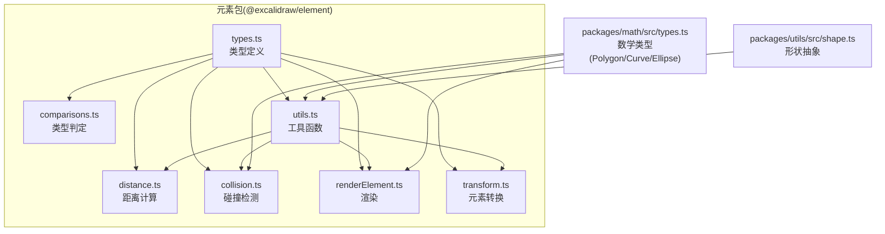

**图表来源**
- [packages/element/src/types.ts:40-238](file://packages/element/src/types.ts#L40-L238)
- [packages/element/src/comparisons.ts:1-54](file://packages/element/src/comparisons.ts#L1-L54)
- [packages/element/src/distance.ts:1-53](file://packages/element/src/distance.ts#L1-L53)
- [packages/element/src/collision.ts:806-840](file://packages/element/src/collision.ts#L806-L840)
- [packages/element/src/utils.ts:1-62](file://packages/element/src/utils.ts#L1-L62)
- [packages/element/src/renderElement.ts:442-489](file://packages/element/src/renderElement.ts#L442-L489)
- [packages/element/src/transform.ts:529-571](file://packages/element/src/transform.ts#L529-L571)
- [packages/math/src/types.ts:115-162](file://packages/math/src/types.ts#L115-L162)
- [packages/utils/src/shape.ts:37-77](file://packages/utils/src/shape.ts#L37-L77)

**章节来源**
- [packages/element/package.json:1-71](file://packages/element/package.json#L1-L71)

## 核心组件
- 元素基类与通用属性：包含位置、尺寸、角度、描边、填充、透明度、版本号、索引、锁定状态、链接、自定义数据等
- 元素类型族谱：通用几何元素、矩形/椭圆/菱形、文本、线性元素（线/箭头）、自由绘制、图像、帧/魔法帧、iframe/可嵌入
- 映射与集合：ElementsMap、SceneElementsMap、非删除元素映射等
- 绑定与固定点：支持在元素边界上绑定箭头起点/终点
- 帧系统：元素可归属到帧内，支持插入顺序与层级控制

**章节来源**
- [packages/element/src/types.ts:40-238](file://packages/element/src/types.ts#L40-L238)
- [packages/element/src/types.ts:286-324](file://packages/element/src/types.ts#L286-L324)

## 架构总览
元素系统围绕“类型安全 + 可序列化 + 可协作”的设计目标构建：
- 类型安全：通过联合类型与只读属性确保元素结构稳定
- 序列化：元素 JSON 可在网络间共享，包含版本与索引用于协作同步
- 协作：使用分数索引维护多端顺序一致性
- 渲染：统一生成形状并交由渲染层绘制
- 编辑：线性元素提供编辑器，支持点位更新、绑定与肘形箭头

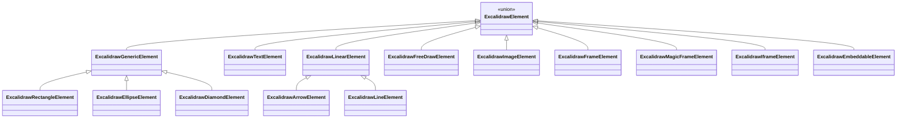

**图表来源**
- [packages/element/src/types.ts:190-233](file://packages/element/src/types.ts#L190-L233)

## 详细组件分析

### 几何元素（矩形/椭圆/菱形）
- 属性要点：位置、尺寸、角度、描边/填充、圆角、透明度、版本与索引
- 圆角与填充：支持多种填充样式与圆角类型；部分类型可调整圆角
- 绑定能力：可作为文本容器或被箭头绑定
- 帧归属：可加入帧，受帧层级影响

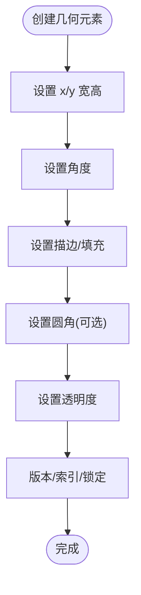

**图表来源**
- [packages/element/src/types.ts:40-82](file://packages/element/src/types.ts#L40-L82)
- [packages/element/src/comparisons.ts:44-50](file://packages/element/src/comparisons.ts#L44-L50)

**章节来源**
- [packages/element/src/types.ts:88-98](file://packages/element/src/types.ts#L88-L98)
- [packages/element/src/comparisons.ts:3-10](file://packages/element/src/comparisons.ts#L3-L10)

### 文本元素
- 属性要点：字体大小、字体族、对齐、垂直对齐、自动换行、容器 ID、原始文本、行高、富文本跨度
- 容器：可依附于矩形/椭圆/菱形/箭头等元素
- 尺寸：autoResize 控制宽度适配文本或强制换行

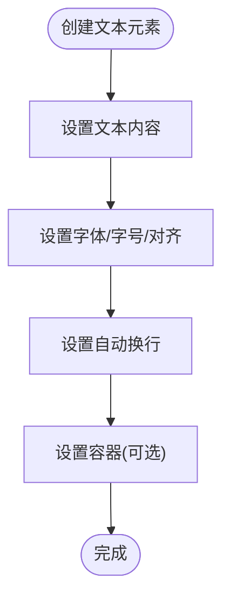

**图表来源**
- [packages/element/src/types.ts:257-284](file://packages/element/src/types.ts#L257-L284)

**章节来源**
- [packages/element/src/types.ts:297-301](file://packages/element/src/types.ts#L297-L301)
- [packages/excalidraw/actions/actionStyles.ts:117-145](file://packages/excalidraw/actions/actionStyles.ts#L117-L145)

### 图像元素
- 属性要点：文件 ID、状态（待处理/已保存/错误）、缩放（翻转）、裁剪区域、HSLA 颜色调节
- 渲染：根据裁剪区域与圆角进行裁剪与绘制；支持圆角矩形路径

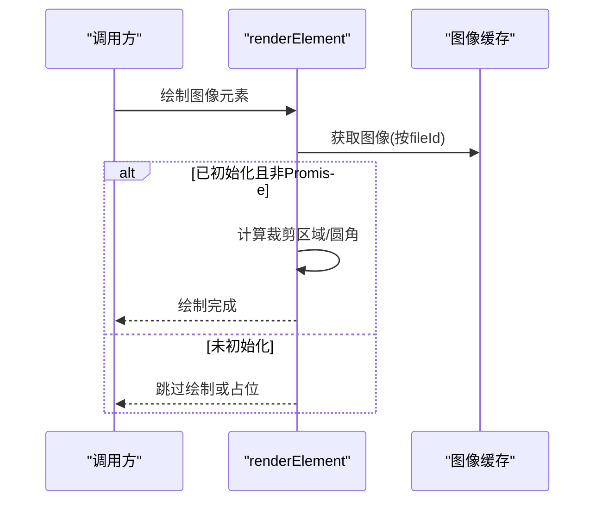

**图表来源**
- [packages/element/src/renderElement.ts:459-489](file://packages/element/src/renderElement.ts#L459-L489)
- [packages/element/src/types.ts:161-173](file://packages/element/src/types.ts#L161-L173)

**章节来源**
- [packages/element/src/types.ts:137-173](file://packages/element/src/types.ts#L137-L173)
- [examples/with-script-in-browser/initialData.tsx:34-40](file://examples/with-script-in-browser/initialData.tsx#L34-L40)

### 线性元素（直线/箭头/自由绘制）
- 直线/箭头：点序列、起止绑定、箭头样式
- 自由绘制：点序列与压力值
- 肘形箭头：固定段、特殊起终点标记，支持绑定模式

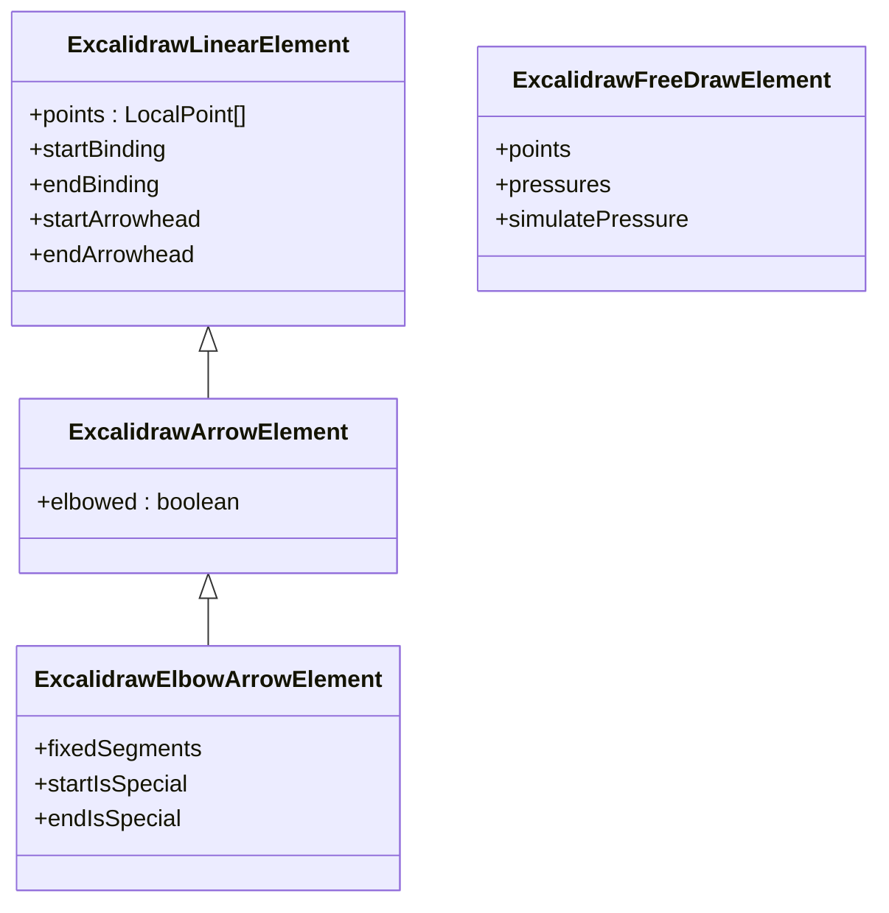

**图表来源**
- [packages/element/src/types.ts:360-420](file://packages/element/src/types.ts#L360-L420)

**章节来源**
- [packages/element/src/types.ts:360-420](file://packages/element/src/types.ts#L360-L420)
- [packages/excalidraw/actions/actionProperties.tsx:2020-2066](file://packages/excalidraw/actions/actionProperties.tsx#L2020-L2066)

### 帧与 iframe/可嵌入元素
- 帧：名称、子元素列表、锁定状态
- iframe/可嵌入：内嵌内容类型、固有尺寸、错误信息、沙箱策略等

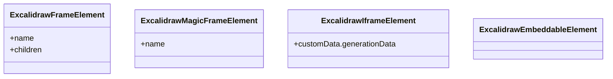

**图表来源**
- [packages/element/src/types.ts:180-121](file://packages/element/src/types.ts#L180-L121)

**章节来源**
- [packages/element/src/types.ts:180-135](file://packages/element/src/types.ts#L180-L135)
- [packages/element/tests/frame.test.tsx:157-335](file://packages/element/tests/frame.test.tsx#L157-L335)

### 坐标系统与变换
- 全局坐标：元素的 x/y 表示左上角在全局画布中的位置
- 角度：以弧度表示元素整体旋转
- 形状与边界：通过旋转中心与边界点计算旋转后的四个顶点，用于碰撞检测与选择框
- 变换流程：将“骨架”元素（如未指定宽高的标签）转换为具体元素（如矩形/箭头），并设置默认尺寸与点序列

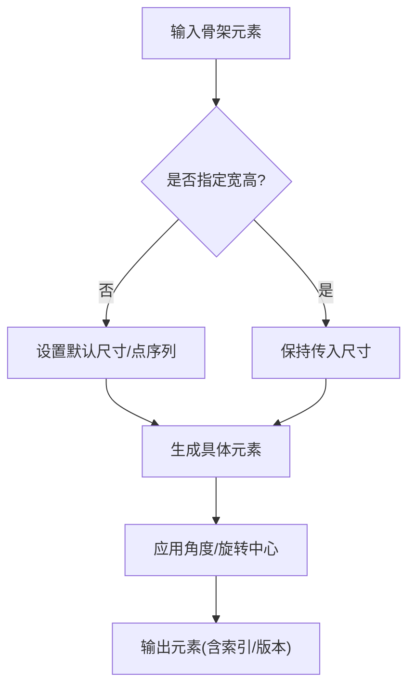

**图表来源**
- [packages/element/src/transform.ts:529-571](file://packages/element/src/transform.ts#L529-L571)
- [packages/element/src/collision.ts:806-840](file://packages/element/src/collision.ts#L806-L840)

**章节来源**
- [packages/element/src/transform.ts:529-571](file://packages/element/src/transform.ts#L529-L571)
- [packages/element/src/collision.ts:806-840](file://packages/element/src/collision.ts#L806-L840)

### 碰撞检测与距离计算
- 点到元素距离：针对矩形/菱形/椭圆/线性/自由绘制分别计算
- 旋转边界：对不同形状计算旋转后的四个角点，用于精确命中测试
- 线性元素：使用折线段与曲线段组合进行距离计算

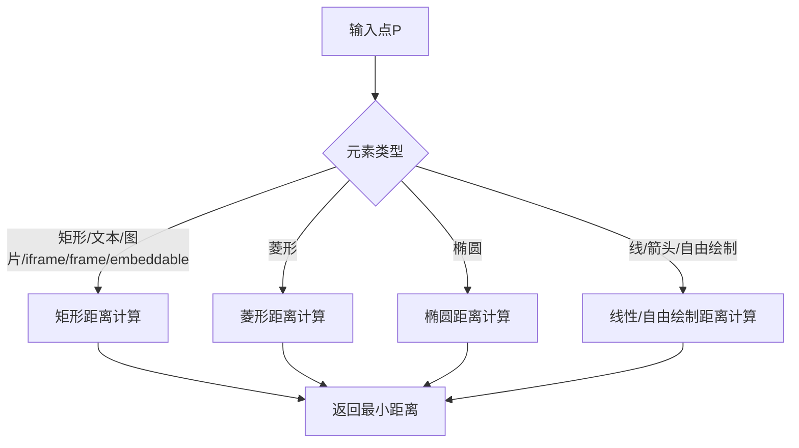

**图表来源**
- [packages/element/src/distance.ts:29-53](file://packages/element/src/distance.ts#L29-L53)
- [packages/element/src/utils.ts:414-463](file://packages/element/src/utils.ts#L414-L463)

**章节来源**
- [packages/element/src/distance.ts:1-53](file://packages/element/src/distance.ts#L1-L53)
- [packages/element/src/utils.ts:414-463](file://packages/element/src/utils.ts#L414-L463)

### 元素创建、修改、删除与查询
- 创建：通过骨架元素转换为具体元素，设置默认属性与尺寸
- 修改：通过样式复制、绑定更新、线性元素编辑器更新点位
- 删除：标记 isDeleted 并在渲染/碰撞时忽略
- 查询：通过 ElementsMap/SceneElementsMap 快速定位元素

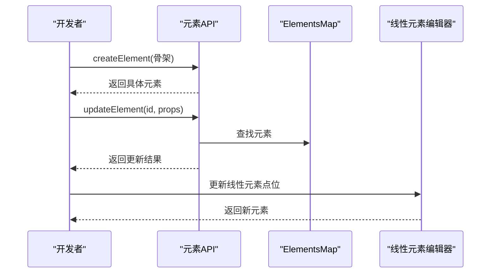

**图表来源**
- [packages/element/src/transform.ts:529-571](file://packages/element/src/transform.ts#L529-L571)
- [packages/excalidraw/actions/actionStyles.ts:117-173](file://packages/excalidraw/actions/actionStyles.ts#L117-L173)
- [packages/excalidraw/actions/actionProperties.tsx:2020-2066](file://packages/excalidraw/actions/actionProperties.tsx#L2020-L2066)

**章节来源**
- [packages/element/src/transform.ts:529-571](file://packages/element/src/transform.ts#L529-L571)
- [packages/excalidraw/actions/actionStyles.ts:117-173](file://packages/excalidraw/actions/actionStyles.ts#L117-L173)
- [packages/excalidraw/actions/actionProperties.tsx:2020-2066](file://packages/excalidraw/actions/actionProperties.tsx#L2020-L2066)

### 序列化与反序列化
- JSON 序列化：元素为 JSON 可序列化对象，包含版本与索引
- 剪贴板：支持将元素序列化为剪贴板 JSON，解析时优先识别特定格式
- 导出：导出场景时序列化元素与应用状态，必要时嵌入元数据

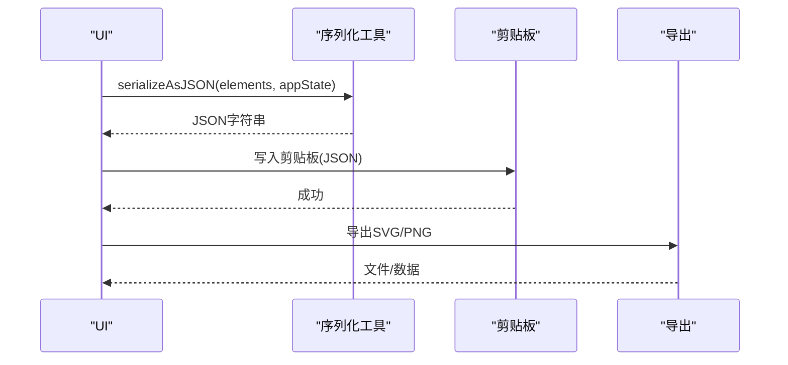

**图表来源**
- [dev-docs/docs/@excalidraw/excalidraw/api/utils/utils-intro.md:43-91](file://dev-docs/docs/@excalidraw/excalidraw/api/utils/utils-intro.md#L43-L91)
- [packages/excalidraw/clipboard.test.ts:1-90](file://packages/excalidraw/clipboard.test.ts#L1-L90)
- [packages/excalidraw/scene/export.ts:372-408](file://packages/excalidraw/scene/export.ts#L372-L408)

**章节来源**
- [dev-docs/docs/@excalidraw/excalidraw/api/utils/utils-intro.md:43-91](file://dev-docs/docs/@excalidraw/excalidraw/api/utils/utils-intro.md#L43-L91)
- [packages/excalidraw/clipboard.test.ts:1-90](file://packages/excalidraw/clipboard.test.ts#L1-L90)
- [packages/excalidraw/scene/export.ts:372-408](file://packages/excalidraw/scene/export.ts#L372-L408)

### 验证规则、约束与类型安全
- 类型守卫：hasStrokeColor/hasStrokeWidth/hasBackground/canChangeRoundness 等按类型判定属性可用性
- 绑定约束：固定点比例范围 0~1，绑定模式（内部/轨道/跳过）
- 帧约束：新元素插入帧时需遵循帧内顺序与层级，锁定帧不可被覆盖
- 文本容器：文本容器类型限定为矩形/椭圆/菱形/箭头

**章节来源**
- [packages/element/src/comparisons.ts:1-54](file://packages/element/src/comparisons.ts#L1-L54)
- [packages/element/src/types.ts:307-324](file://packages/element/src/types.ts#L307-L324)
- [packages/element/tests/frame.test.tsx:157-335](file://packages/element/tests/frame.test.tsx#L157-L335)
- [packages/element/tests/binding.test.tsx:575-622](file://packages/element/tests/binding.test.tsx#L575-L622)

### 性能考量与优化建议
- 形状缓存：元素形状分解结果可缓存，避免重复计算
- 碰撞与距离：优先按类型分发，减少不必要的复杂计算
- 渲染：仅在图像初始化后绘制，避免异步资源导致的闪烁
- 线性元素：批量更新点位时合并操作，减少重绘次数

**章节来源**
- [packages/element/src/utils.ts:414-463](file://packages/element/src/utils.ts#L414-L463)
- [packages/element/src/renderElement.ts:459-489](file://packages/element/src/renderElement.ts#L459-L489)

## 依赖分析
- 数学类型：Polygon/Curve/Ellipse 为形状建模提供基础
- 形状抽象：统一折线段、曲线段与椭圆描述
- 元素类型：依赖数学类型进行距离与碰撞计算

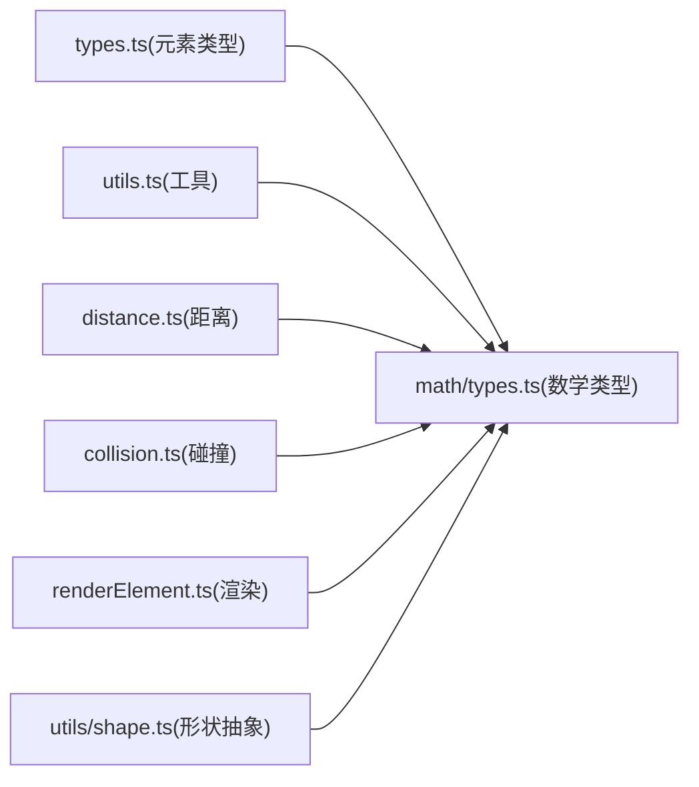

**图表来源**
- [packages/element/src/types.ts:1-33](file://packages/element/src/types.ts#L1-L33)
- [packages/math/src/types.ts:115-162](file://packages/math/src/types.ts#L115-L162)
- [packages/utils/src/shape.ts:37-77](file://packages/utils/src/shape.ts#L37-L77)

**章节来源**
- [packages/math/src/types.ts:115-162](file://packages/math/src/types.ts#L115-L162)
- [packages/utils/src/shape.ts:37-77](file://packages/utils/src/shape.ts#L37-L77)

## 性能考量
- 使用缓存：对 deconstruct*Element 结果进行缓存，避免重复分解
- 批处理：在批量更新元素属性时合并渲染请求
- 选择性渲染：图像元素仅在初始化完成后绘制，减少无效绘制
- 碰撞预判：先按类型快速判断，再进行精确计算

[本节为通用指导，无需特定文件来源]

## 故障排查指南
- 剪贴板解析失败：确认写入的 JSON 格式正确，或回退到纯文本解析
- 导出空场景：检查元素数组是否为空或仅包含删除元素
- 帧插入异常：确认帧未锁定，且插入顺序符合“在帧之后、在下一个非帧元素之前”
- 绑定失效：检查固定点比例是否在 0~1 范围内，绑定模式是否匹配

**章节来源**
- [packages/excalidraw/clipboard.test.ts:1-90](file://packages/excalidraw/clipboard.test.ts#L1-L90)
- [packages/element/tests/frame.test.tsx:157-335](file://packages/element/tests/frame.test.tsx#L157-L335)
- [packages/element/tests/binding.test.tsx:575-622](file://packages/element/tests/binding.test.tsx#L575-L622)

## 结论
元素系统通过严格的类型体系、可序列化结构与完善的协作支持，实现了跨平台、可扩展的图形编辑能力。围绕几何、文本、图像、线性与帧/iframe 的统一抽象，配合距离与碰撞算法、渲染管线与变换流程，既保证了易用性也兼顾了性能与可维护性。

[本节为总结，无需特定文件来源]

## 附录
- 示例骨架元素：包含矩形、菱形（带标签）、箭头（带起点/终点）、图像、帧等
- 关键类型参考：元素基类、映射类型、绑定类型、箭头样式枚举等

**章节来源**
- [examples/with-script-in-browser/initialData.tsx:4-46](file://examples/with-script-in-browser/initialData.tsx#L4-L46)
- [packages/element/src/types.ts:40-238](file://packages/element/src/types.ts#L40-L238)