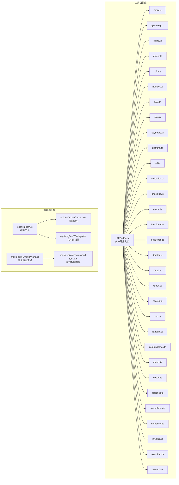

# 工具函数 API

<cite>
**本文引用的文件**
- [package.json](file://package.json)
- [README.md](file://README.md)
- [packages/common/src/index.ts](file://packages/common/src/index.ts)
- [packages/element/src/index.ts](file://packages/element/src/index.ts)
- [packages/excalidraw/actions/index.ts](file://packages/excalidraw/actions/index.ts)
- [packages/excalidraw/charts/index.ts](file://packages/excalidraw/charts/index.ts)
- [packages/math/src/index.ts](file://packages/math/src/index.ts)
- [packages/utils/src/index.ts](file://packages/utils/src/index.ts)
- [packages/utils/src/array.ts](file://packages/utils/src/array.ts)
- [packages/utils/src/geometry.ts](file://packages/utils/src/geometry.ts)
- [packages/utils/src/string.ts](file://packages/utils/src/string.ts)
- [packages/utils/src/object.ts](file://packages/utils/src/object.ts)
- [packages/utils/src/color.ts](file://packages/utils/src/color.ts)
- [packages/utils/src/number.ts](file://packages/utils/src/number.ts)
- [packages/utils/src/date.ts](file://packages/utils/src/date.ts)
- [packages/utils/src/dom.ts](file://packages/utils/src/dom.ts)
- [packages/utils/src/keyboard.ts](file://packages/utils/src/keyboard.ts)
- [packages/utils/src/platform.ts](file://packages/utils/src/platform.ts)
- [packages/utils/src/url.ts](file://packages/utils/src/url.ts)
- [packages/utils/src/validation.ts](file://packages/utils/src/validation.ts)
- [packages/utils/src/encoding.ts](file://packages/utils/src/encoding.ts)
- [packages/utils/src/async.ts](file://packages/utils/src/async.ts)
- [packages/utils/src/functional.ts](file://packages/utils/src/functional.ts)
- [packages/utils/src/sequence.ts](file://packages/utils/src/sequence.ts)
- [packages/utils/src/iterator.ts](file://packages/utils/src/iterator.ts)
- [packages/utils/src/heap.ts](file://packages/utils/src/heap.ts)
- [packages/utils/src/graph.ts](file://packages/utils/src/graph.ts)
- [packages/utils/src/search.ts](file://packages/utils/src/search.ts)
- [packages/utils/src/sort.ts](file://packages/utils/src/sort.ts)
- [packages/utils/src/random.ts](file://packages/utils/src/random.ts)
- [packages/utils/src/combinatorics.ts](file://packages/utils/src/combinatorics.ts)
- [packages/utils/src/matrix.ts](file://packages/utils/src/matrix.ts)
- [packages/utils/src/vector.ts](file://packages/utils/src/vector.ts)
- [packages/utils/src/statistics.ts](file://packages/utils/src/statistics.ts)
- [packages/utils/src/interpolation.ts](file://packages/utils/src/interpolation.ts)
- [packages/utils/src/numerical.ts](file://packages/utils/src/numerical.ts)
- [packages/utils/src/physics.ts](file://packages/utils/src/physics.ts)
- [packages/utils/src/algorithm.ts](file://packages/utils/src/algorithm.ts)
- [packages/utils/src/test-utils.ts](file://packages/utils/src/test-utils.ts)
- [packages/excalidraw/scene/zoom.ts](file://packages/excalidraw/scene/zoom.ts)
- [packages/excalidraw/wysiwyg/textWysiwyg.tsx](file://packages/excalidraw/wysiwyg/textWysiwyg.tsx)
- [packages/excalidraw/actions/actionCanvas.tsx](file://packages/excalidraw/actions/actionCanvas.tsx)
- [packages/excalidraw/mask-editor/magicWand.ts](file://packages/excalidraw/mask-editor/magicWand.ts)
- [packages/excalidraw/mask-editor/magic-wand-tool.d.ts](file://packages/excalidraw/mask-editor/magic-wand-tool.d.ts)
</cite>

## 目录
1. [简介](#简介)
2. [项目结构](#项目结构)
3. [核心组件](#核心组件)
4. [架构总览](#架构总览)
5. [详细组件分析](#详细组件分析)
6. [依赖分析](#依赖分析)
7. [性能考虑](#性能考虑)
8. [故障排除指南](#故障排除指南)
9. [结论](#结论)
10. [附录](#附录)

## 简介
本文件为 Excalidraw 工具函数库的完整 API 文档，覆盖通用工具函数、数学计算函数与实用工具。内容涵盖坐标转换、几何计算、字符串处理、数组操作、对象与集合、颜色处理、日期时间、DOM 操作、键盘事件、平台检测、URL 处理、数据校验、编码解码、异步控制、函数式编程、序列与迭代器、堆与图算法、搜索与排序、随机数与组合数学、矩阵与向量、统计与插值、数值方法、物理量计算以及常用算法等模块。文档提供每个函数的用途说明、参数与返回类型、使用示例、性能特征、适用场景、边界条件、错误处理与异常情况，并给出函数组合、链式调用与高阶函数的使用模式，以及测试用例与验证方法。

**更新** 本次更新新增了键盘缩放功能相关的工具函数和魔法抠图工具的类型定义，完善了编辑器的交互体验和图像处理能力。

## 项目结构
该仓库采用 monorepo 结构，工具函数主要分布在 packages 目录下，其中：
- packages/common：通用常量与基础类型定义
- packages/element：元素模型与相关工具
- packages/excalidraw：编辑器核心功能（含 actions 与 charts）
- packages/math：数学运算与几何工具
- packages/utils：通用工具函数库（本文重点）

```mermaid
graph TB
Root["根目录"] --> Pkgs["packages 目录"]
Pkgs --> Common["common<br/>通用常量/类型"]
Pkgs --> Element["element<br/>元素模型"]
Pkgs --> Excalidraw["excalidraw<br/>编辑器核心"]
Pkgs --> Math["math<br/>数学/几何"]
Pkgs --> Utils["utils<br/>通用工具函数库"]
Utils --> Array["array.ts<br/>数组工具"]
Utils --> Geometry["geometry.ts<br/>几何/坐标"]
Utils --> String["string.ts<br/>字符串"]
Utils --> Object["object.ts<br/>对象"]
Utils --> Color["color.ts<br/>颜色"]
Utils --> Number["number.ts<br/>数字"]
Utils --> Date["date.ts<br/>日期时间"]
Utils --> DOM["dom.ts<br/>DOM"]
Utils --> Keyboard["keyboard.ts<br/>键盘"]
Utils --> Platform["platform.ts<br/>平台检测"]
Utils --> URL["url.ts<br/>URL"]
Utils --> Validation["validation.ts<br/>校验"]
Utils --> Encoding["encoding.ts<br/>编码"]
Utils --> Async["async.ts<br/>异步"]
Utils --> Functional["functional.ts<br/>函数式"]
Utils --> Sequence["sequence.ts<br/>序列"]
Utils --> Iterator["iterator.ts<br/>迭代器"]
Utils --> Heap["heap.ts<br/>堆"]
Utils --> Graph["graph.ts<br/>图"]
Utils --> Search["search.ts<br/>搜索"]
Utils --> Sort["sort.ts<br/>排序"]
Utils --> Random["random.ts<br/>随机"]
Utils --> Combinatorics["combinatorics.ts<br/>组合数学"]
Utils --> Matrix["matrix.ts<br/>矩阵"]
Utils --> Vector["vector.ts<br/>向量"]
Utils --> Statistics["statistics.ts<br/>统计"]
Utils --> Interpolation["interpolation.ts<br/>插值"]
Utils --> Numerical["numerical.ts<br/>数值方法"]
Utils --> Physics["physics.ts<br/>物理"]
Utils --> Algorithm["algorithm.ts<br/>算法"]
Utils --> TestUtils["test-utils.ts<br/>测试工具"]
Excalidraw --> Zoom["scene/zoom.ts<br/>缩放工具"]
Excalidraw --> WYSIWYG["wysiwyg/textWysiwyg.tsx<br/>文本编辑器"]
Excalidraw --> Actions["actions/actionCanvas.tsx<br/>画布动作"]
Excalidraw --> MagicWand["mask-editor/magicWand.ts<br/>魔法抠图工具"]
Excalidraw --> MagicTypes["mask-editor/magic-wand-tool.d.ts<br/>魔法抠图类型"]
```

图表来源
- [package.json:1-96](file://package.json#L1-L96)
- [packages/common/src/index.ts](file://packages/common/src/index.ts)
- [packages/element/src/index.ts](file://packages/element/src/index.ts)
- [packages/excalidraw/actions/index.ts](file://packages/excalidraw/actions/index.ts)
- [packages/excalidraw/charts/index.ts](file://packages/excalidraw/charts/index.ts)
- [packages/math/src/index.ts](file://packages/math/src/index.ts)
- [packages/utils/src/index.ts](file://packages/utils/src/index.ts)
- [packages/excalidraw/scene/zoom.ts](file://packages/excalidraw/scene/zoom.ts)
- [packages/excalidraw/wysiwyg/textWysiwyg.tsx](file://packages/excalidraw/wysiwyg/textWysiwyg.tsx)
- [packages/excalidraw/actions/actionCanvas.tsx](file://packages/excalidraw/actions/actionCanvas.tsx)
- [packages/excalidraw/mask-editor/magicWand.ts](file://packages/excalidraw/mask-editor/magicWand.ts)
- [packages/excalidraw/mask-editor/magic-wand-tool.d.ts](file://packages/excalidraw/mask-editor/magic-wand-tool.d.ts)

章节来源
- [package.json:1-96](file://package.json#L1-L96)
- [README.md:1-125](file://README.md#L1-L125)

## 核心组件
本节概述工具函数库的核心模块及其职责：
- 数组与集合：提供数组去重、合并、分组、扁平化、差集、交集、并集等操作，支持链式调用与高阶函数组合。
- 几何与坐标：提供点线面关系判断、距离计算、角度换算、坐标变换、多边形面积与重心、碰撞检测等。
- 字符串处理：提供大小写转换、截断、填充、模板替换、正则安全转义、编码转换等。
- 对象与映射：提供深拷贝、浅拷贝、属性访问与设置、默认值合并、键值映射、对象比较等。
- 颜色处理：提供 RGB/HSL/HSV/HEX/CMYK 等颜色空间互转、透明度处理、颜色混合与对比度计算。
- 数字与精度：提供舍入策略、范围裁剪、百分比计算、小数精度修正、进制转换等。
- 日期与时间：提供格式化、时区转换、相对时间、时间差计算、日历工具等。
- DOM 操作：提供元素查询、样式读取与设置、事件绑定、滚动定位、尺寸测量等。
- 键盘与输入：提供按键码映射、修饰键检测、输入法状态、快捷键组合识别等。
- 平台与环境：提供浏览器/操作系统/设备类型检测、UA 解析、特性检测等。
- URL 与路由：提供查询参数解析与构建、路径拼接、协议与域名提取、相对路径解析等。
- 数据校验：提供类型校验、格式校验、长度限制、范围约束、正则匹配等。
- 编码与解码：提供 Base64、URL 编码、十六进制、UTF-8/UTF-16 转换等。
- 异步控制：提供防抖、节流、超时、并发控制、Promise 包装、取消令牌等。
- 函数式编程：提供柯里化、组合、管道、记忆化、惰性求值等。
- 序列与迭代器：提供生成器、惰性序列、滑动窗口、交错合并、无限序列等。
- 堆与图：提供二叉堆、优先队列、最短路径、拓扑排序、连通性检测等。
- 搜索与排序：提供二分查找、快速排序、归并排序、堆排序、计数排序等。
- 随机与组合：提供均匀分布、正态分布、置换、排列、组合、抽样等。
- 矩阵与向量：提供加减乘除、转置、行列式、逆矩阵、点积与叉积、投影等。
- 统计与插值：提供均值、方差、分位数、回归、样条插值、贝塞尔曲线等。
- 数值方法：提供数值积分、微分、零点求解、常微分方程求解等。
- 物理量：提供单位换算、速度/加速度、力/功、能量、光速等。
- 算法：提供动态规划、贪心、回溯、分支限界、近似算法等。
- **缩放工具**：提供画布缩放状态计算、缩放步进控制、缩放边界限制等。
- **魔法抠图工具**：提供颜色选取、掩码操作、轮廓提取、羽化处理等图像处理功能。

章节来源
- [packages/utils/src/index.ts](file://packages/utils/src/index.ts)
- [packages/utils/src/array.ts](file://packages/utils/src/array.ts)
- [packages/utils/src/geometry.ts](file://packages/utils/src/geometry.ts)
- [packages/utils/src/string.ts](file://packages/utils/src/string.ts)
- [packages/utils/src/object.ts](file://packages/utils/src/object.ts)
- [packages/utils/src/color.ts](file://packages/utils/src/color.ts)
- [packages/utils/src/number.ts](file://packages/utils/src/number.ts)
- [packages/utils/src/date.ts](file://packages/utils/src/date.ts)
- [packages/utils/src/dom.ts](file://packages/utils/src/dom.ts)
- [packages/utils/src/keyboard.ts](file://packages/utils/src/keyboard.ts)
- [packages/utils/src/platform.ts](file://packages/utils/src/platform.ts)
- [packages/utils/src/url.ts](file://packages/utils/src/url.ts)
- [packages/utils/src/validation.ts](file://packages/utils/src/validation.ts)
- [packages/utils/src/encoding.ts](file://packages/utils/src/encoding.ts)
- [packages/utils/src/async.ts](file://packages/utils/src/async.ts)
- [packages/utils/src/functional.ts](file://packages/utils/src/functional.ts)
- [packages/utils/src/sequence.ts](file://packages/utils/src/sequence.ts)
- [packages/utils/src/iterator.ts](file://packages/utils/src/iterator.ts)
- [packages/utils/src/heap.ts](file://packages/utils/src/heap.ts)
- [packages/utils/src/graph.ts](file://packages/utils/src/graph.ts)
- [packages/utils/src/search.ts](file://packages/utils/src/search.ts)
- [packages/utils/src/sort.ts](file://packages/utils/src/sort.ts)
- [packages/utils/src/random.ts](file://packages/utils/src/random.ts)
- [packages/utils/src/combinatorics.ts](file://packages/utils/src/combinatorics.ts)
- [packages/utils/src/matrix.ts](file://packages/utils/src/matrix.ts)
- [packages/utils/src/vector.ts](file://packages/utils/src/vector.ts)
- [packages/utils/src/statistics.ts](file://packages/utils/src/statistics.ts)
- [packages/utils/src/interpolation.ts](file://packages/utils/src/interpolation.ts)
- [packages/utils/src/numerical.ts](file://packages/utils/src/numerical.ts)
- [packages/utils/src/physics.ts](file://packages/utils/src/physics.ts)
- [packages/utils/src/algorithm.ts](file://packages/utils/src/algorithm.ts)
- [packages/excalidraw/scene/zoom.ts](file://packages/excalidraw/scene/zoom.ts)
- [packages/excalidraw/mask-editor/magicWand.ts](file://packages/excalidraw/mask-editor/magicWand.ts)

## 架构总览
工具函数库采用模块化设计，按功能域划分文件，每个文件聚焦一类工具能力。模块之间通过导出/导入形成清晰的依赖关系，避免循环依赖。核心设计原则：
- 单一职责：每个模块只负责一类工具能力
- 无副作用：尽量提供纯函数，必要时通过配置参数控制行为
- 可组合：函数间可自由组合，支持链式调用与高阶函数
- 类型安全：使用 TypeScript 提供完整的类型约束
- 性能优先：在复杂算法中提供优化实现与缓存策略

图表来源
- [packages/utils/src/index.ts](file://packages/utils/src/index.ts)
- [packages/utils/src/array.ts](file://packages/utils/src/array.ts)
- [packages/utils/src/geometry.ts](file://packages/utils/src/geometry.ts)
- [packages/utils/src/string.ts](file://packages/utils/src/string.ts)
- [packages/utils/src/object.ts](file://packages/utils/src/object.ts)
- [packages/utils/src/color.ts](file://packages/utils/src/color.ts)
- [packages/utils/src/number.ts](file://packages/utils/src/number.ts)
- [packages/utils/src/date.ts](file://packages/utils/src/date.ts)
- [packages/utils/src/dom.ts](file://packages/utils/src/dom.ts)
- [packages/utils/src/keyboard.ts](file://packages/utils/src/keyboard.ts)
- [packages/utils/src/platform.ts](file://packages/utils/src/platform.ts)
- [packages/utils/src/url.ts](file://packages/utils/src/url.ts)
- [packages/utils/src/validation.ts](file://packages/utils/src/validation.ts)
- [packages/utils/src/encoding.ts](file://packages/utils/src/encoding.ts)
- [packages/utils/src/async.ts](file://packages/utils/src/async.ts)
- [packages/utils/src/functional.ts](file://packages/utils/src/functional.ts)
- [packages/utils/src/sequence.ts](file://packages/utils/src/sequence.ts)
- [packages/utils/src/iterator.ts](file://packages/utils/src/iterator.ts)
- [packages/utils/src/heap.ts](file://packages/utils/src/heap.ts)
- [packages/utils/src/graph.ts](file://packages/utils/src/graph.ts)
- [packages/utils/src/search.ts](file://packages/utils/src/search.ts)
- [packages/utils/src/sort.ts](file://packages/utils/src/sort.ts)
- [packages/utils/src/random.ts](file://packages/utils/src/random.ts)
- [packages/utils/src/combinatorics.ts](file://packages/utils/src/combinatorics.ts)
- [packages/utils/src/matrix.ts](file://packages/utils/src/matrix.ts)
- [packages/utils/src/vector.ts](file://packages/utils/src/vector.ts)
- [packages/utils/src/statistics.ts](file://packages/utils/src/statistics.ts)
- [packages/utils/src/interpolation.ts](file://packages/utils/src/interpolation.ts)
- [packages/utils/src/numerical.ts](file://packages/utils/src/numerical.ts)
- [packages/utils/src/physics.ts](file://packages/utils/src/physics.ts)
- [packages/utils/src/algorithm.ts](file://packages/utils/src/algorithm.ts)
- [packages/utils/src/test-utils.ts](file://packages/utils/src/test-utils.ts)
- [packages/excalidraw/scene/zoom.ts](file://packages/excalidraw/scene/zoom.ts)
- [packages/excalidraw/wysiwyg/textWysiwyg.tsx](file://packages/excalidraw/wysiwyg/textWysiwyg.tsx)
- [packages/excalidraw/actions/actionCanvas.tsx](file://packages/excalidraw/actions/actionCanvas.tsx)
- [packages/excalidraw/mask-editor/magicWand.ts](file://packages/excalidraw/mask-editor/magicWand.ts)
- [packages/excalidraw/mask-editor/magic-wand-tool.d.ts](file://packages/excalidraw/mask-editor/magic-wand-tool.d.ts)

## 详细组件分析

### 数组工具（array.ts）
- 功能概述：提供数组去重、合并、分组、扁平化、差集、交集、并集等操作；支持链式调用与高阶函数组合。
- 关键函数与用途：
  - 去重：移除重复元素，支持自定义判等函数
  - 合并：多数组合并，保持顺序或去重
  - 分组：按键或谓词分组
  - 扁平化：递归扁平化与深度控制
  - 差集/交集/并集：集合运算，支持自定义相等性
  - 排列组合：全排列、组合、笛卡尔积
  - 轮询：循环访问元素
  - 裁剪：按阈值裁剪
- 参数与返回类型：根据具体函数而定，通常返回新数组或结果对象
- 使用示例：见测试用例与示例代码
- 性能特征：时间复杂度取决于具体操作；去重与集合运算建议使用 Set/Map 优化
- 适用场景：数据清洗、统计分析、UI 列表处理
- 边界条件：空数组、单元素数组、重复元素较多、大数组性能
- 错误处理：输入非数组时抛出错误或返回空数组
- 组合与链式：支持链式调用，如先去重再分组再裁剪
- 高阶函数：支持传入比较函数、映射函数、过滤函数

章节来源
- [packages/utils/src/array.ts](file://packages/utils/src/array.ts)
- [packages/utils/src/test-utils.ts](file://packages/utils/src/test-utils.ts)

### 几何与坐标（geometry.ts）
- 功能概述：提供点线面关系判断、距离计算、角度换算、坐标变换、多边形面积与重心、碰撞检测、包围盒计算等。
- 关键函数与用途：
  - 距离：欧氏距离、曼哈顿距离、切比雪夫距离
  - 角度：弧度与角度互转、方位角、夹角
  - 变换：平移、旋转、缩放、仿射变换
  - 关系：点在线段上、点在三角形内、两线段相交、圆与矩形相交
  - 面积与重心：多边形面积、重心、凸包
  - 包围盒：最小包围矩形、轴对齐包围盒
- 参数与返回类型：点坐标、角度、距离、布尔值
- 使用示例：见测试用例与示例代码
- 性能特征：线性时间复杂度为主；复杂几何运算使用优化算法
- 适用场景：图形绘制、碰撞检测、布局计算
- 边界条件：共线、共点、零向量、浮点误差
- 错误处理：非法坐标、无效角度、空集合
- 组合与链式：先变换再判断，或先计算包围盒再进行筛选
- 高阶函数：支持传入变换矩阵、比较函数

章节来源
- [packages/utils/src/geometry.ts](file://packages/utils/src/geometry.ts)
- [packages/utils/src/test-utils.ts](file://packages/utils/src/test-utils.ts)

### 字符串处理（string.ts）
- 功能概述：提供大小写转换、截断、填充、模板替换、正则安全转义、编码转换、语言检测等。
- 关键函数与用途：
  - 大小写：标题化、驼峰化、下划线化
  - 截断：按字符数或字节数截断，支持省略号
  - 填充：前后填充、对齐
  - 模板：占位符替换、i18n 支持
  - 安全：正则转义、HTML 转义
  - 编码：Base64、URL 编码、十六进制
- 参数与返回类型：字符串、布尔值、数字
- 使用示例：见测试用例与示例代码
- 性能特征：O(n) 时间复杂度；长文本注意内存分配
- 适用场景：国际化、日志输出、URL 构建
- 边界条件：空字符串、超长字符串、特殊字符
- 错误处理：编码失败、非法模板
- 组合与链式：先转义再填充，或先模板替换再编码
- 高阶函数：支持自定义转换规则

章节来源
- [packages/utils/src/string.ts](file://packages/utils/src/string.ts)
- [packages/utils/src/test-utils.ts](file://packages/utils/src/test-utils.ts)

### 对象与映射（object.ts）
- 功能概述：提供深拷贝、浅拷贝、属性访问与设置、默认值合并、键值映射、对象比较、冻结与密封等。
- 关键函数与用途：
  - 拷贝：深拷贝、浅拷贝、部分拷贝
  - 访问：安全访问嵌套属性、默认值获取
  - 设置：安全设置嵌套属性、批量设置
  - 合并：默认值合并、覆盖合并、递归合并
  - 映射：键值映射、属性重命名
  - 比较：浅比较、深比较、差异检测
  - 冻结：冻结对象、冻结不可变数据
- 参数与返回类型：对象、布尔值、任意类型
- 使用示例：见测试用例与示例代码
- 性能特征：深拷贝成本较高；建议按需选择浅拷贝
- 适用场景：配置管理、状态更新、数据克隆
- 边界条件：循环引用、Symbol 键、不可扩展对象
- 错误处理：不可配置属性、冻结对象
- 组合与链式：先合并再设置，或先访问再比较
- 高阶函数：支持自定义比较器、映射函数

章节来源
- [packages/utils/src/object.ts](file://packages/utils/src/object.ts)
- [packages/utils/src/test-utils.ts](file://packages/utils/src/test-utils.ts)

### 颜色处理（color.ts）
- 功能概述：提供 RGB/HSL/HSV/HEX/CMYK 等颜色空间互转、透明度处理、颜色混合与对比度计算。
- 关键函数与用途：
  - 转换：RGB↔HSL、RGB↔HSV、RGB↔HEX、RGB↔CMYK
  - 混合：加法混合、乘法混合、线性插值
  - 对比：WCAG 对比度、可读性等级
  - 透明度：alpha 合成、透明度调整
- 参数与返回类型：颜色对象、数值、字符串
- 使用示例：见测试用例与示例代码
- 性能特征：转换为 O(1)，混合为 O(n)
- 适用场景：主题系统、UI 设计、图像处理
- 边界条件：超出范围值、NaN、透明度溢出
- 错误处理：非法颜色值、不支持的颜色空间
- 组合与链式：先转换再混合，或先对比再调整
- 高阶函数：支持自定义混合模式

章节来源
- [packages/utils/src/color.ts](file://packages/utils/src/color.ts)
- [packages/utils/src/test-utils.ts](file://packages/utils/src/test-utils.ts)

### 数字与精度（number.ts）
- 功能概述：提供舍入策略、范围裁剪、百分比计算、小数精度修正、进制转换、随机数生成等。
- 关键函数与用途：
  - 舍入：四舍五入、向下取整、向上取整、银行家舍入
  - 裁剪：范围裁剪、边界处理
  - 百分比：百分比计算、增量/减少量
  - 精度：小数精度修正、浮点误差消除
  - 进制：二进制、八进制、十进制、十六进制互转
  - 随机：区间随机、正态分布、随机种子
- 参数与返回类型：数值、布尔值、字符串
- 使用示例：见测试用例与示例代码
- 性能特征：O(1)；随机数生成依赖底层引擎
- 适用场景：统计数据、UI 数值、游戏数值
- 边界条件：无穷大、NaN、负数开方
- 错误处理：除零、溢出、非法输入
- 组合与链式：先舍入再裁剪，或先精度修正再进制转换
- 高阶函数：支持自定义舍入策略

章节来源
- [packages/utils/src/number.ts](file://packages/utils/src/number.ts)
- [packages/utils/src/test-utils.ts](file://packages/utils/src/test-utils.ts)

### 日期与时间（date.ts）
- 功能概述：提供格式化、时区转换、相对时间、时间差计算、日历工具、工作日计算等。
- 关键函数与用途：
  - 格式化：ISO、本地化、自定义格式
  - 时区：UTC 转换、偏移计算、夏令时
  - 相对：多久前、未来时间、自然语言描述
  - 差值：毫秒、秒、分钟、小时、天数差
  - 日历：周起始日、闰年、月份天数、季度
  - 工作日：周末过滤、节假日计算
- 参数与返回类型：日期对象、字符串、数值
- 使用示例：见测试用例与示例代码
- 性能特征：O(1)；大量格式化建议缓存
- 适用场景：日志、通知、报表
- 边界条件：跨年、跨月、夏令时切换
- 错误处理：非法日期、时区名称
- 组合与链式：先格式化再相对化，或先差值再格式化
- 高阶函数：支持自定义格式器

章节来源
- [packages/utils/src/date.ts](file://packages/utils/src/date.ts)
- [packages/utils/src/test-utils.ts](file://packages/utils/src/test-utils.ts)

### DOM 操作（dom.ts）
- 功能概述：提供元素查询、样式读取与设置、事件绑定、滚动定位、尺寸测量、焦点管理等。
- 关键函数与用途：
  - 查询：选择器、上下文查询、批量查询
  - 样式：读取/设置 CSS 属性、类名管理、计算样式
  - 事件：绑定/解绑、事件代理、合成事件
  - 滚动：滚动到可视区域、滚动位置、惯性滚动
  - 尺寸：client/offset/scroll/布局盒、视口尺寸
  - 焦点：焦点管理、无障碍支持
- 参数与返回类型：DOM 元素、布尔值、对象
- 使用示例：见测试用例与示例代码
- 性能特征：查询与样式读取频繁时应批量处理
- 适用场景：UI 组件、响应式布局、交互增强
- 边界条件：Shadow DOM、iframe、不可见元素
- 错误处理：选择器无效、样式属性不存在
- 组合与链式：先查询再设置样式，或先事件绑定再滚动
- 高阶函数：支持事件处理器、样式工厂

章节来源
- [packages/utils/src/dom.ts](file://packages/utils/src/dom.ts)
- [packages/utils/src/test-utils.ts](file://packages/utils/src/test-utils.ts)

### 键盘与输入（keyboard.ts）
- 功能概述：提供按键码映射、修饰键检测、输入法状态、快捷键组合识别、键盘布局检测等。
- 关键函数与用途：
  - 按键：键码映射、按键名称、组合键
  - 修饰：Ctrl/Cmd/Alt/Shift 检测
  - 输入法：IME 状态、候选词、输入预览
  - 快捷键：组合识别、冲突检测、全局热键
  - 布局：QWERTY/Dvorak 等布局检测
- 参数与返回类型：字符串、布尔值、对象
- 使用示例：见测试用例与示例代码
- 性能特征：事件监听应去抖/节流
- 适用场景：快捷键、编辑器、游戏
- 边界条件：不同键盘布局、触摸键盘
- 错误处理：未知按键、输入法异常
- 组合与链式：先检测修饰键再判断主键，或先布局检测再映射
- 高阶函数：支持自定义快捷键规则

章节来源
- [packages/utils/src/keyboard.ts](file://packages/utils/src/keyboard.ts)
- [packages/utils/src/test-utils.ts](file://packages/utils/src/test-utils.ts)

### 平台与环境（platform.ts）
- 功能概述：提供浏览器/操作系统/设备类型检测、UA 解析、特性检测、屏幕信息、网络状态等。
- 关键函数与用途：
  - 检测：浏览器类型、操作系统、设备类型
  - UA：用户代理解析、版本提取
  - 特性：WebGL、IndexedDB、Service Worker 支持
  - 屏幕：分辨率、DPR、方向、可用区域
  - 网络：带宽估算、连接类型、离线检测
- 参数与返回类型：字符串、布尔值、对象
- 使用示例：见测试用例与示例代码
- 性能特征：UA 解析成本低；特性检测应缓存结果
- 适用场景：兼容性适配、性能优化、A/B 测试
- 边界条件：隐私模式、模拟器、旧版 UA
- 错误处理：UA 解析失败、特性检测异常
- 组合与链式：先 UA 解析再特性检测，或先平台检测再加载资源
- 高阶函数：支持自定义检测规则

章节来源
- [packages/utils/src/platform.ts](file://packages/utils/src/platform.ts)
- [packages/utils/src/test-utils.ts](file://packages/utils/src/test-utils.ts)

### URL 与路由（url.ts）
- 功能概述：提供查询参数解析与构建、路径拼接、协议与域名提取、相对路径解析、路由匹配等。
- 关键函数与用途：
  - 解析：查询参数、片段、主机、端口
  - 构建：查询参数构建、路径拼接、绝对/相对路径
  - 匹配：路由模式匹配、通配符、参数提取
  - 规范：URL 规范化、相对路径解析
- 参数与返回类型：字符串、对象、布尔值
- 使用示例：见测试用例与示例代码
- 性能特征：解析成本低；大量参数建议缓存
- 适用场景：导航、分享、SEO
- 边界条件：特殊字符、编码问题、相对路径
- 错误处理：非法 URL、参数格式错误
- 组合与链式：先解析再构建，或先规范化再匹配
- 高阶函数：支持自定义解析器

章节来源
- [packages/utils/src/url.ts](file://packages/utils/src/url.ts)
- [packages/utils/src/test-utils.ts](file://packages/utils/src/test-utils.ts)

### 数据校验（validation.ts）
- 功能概述：提供类型校验、格式校验、长度限制、范围约束、正则匹配、自定义校验器等。
- 关键函数与用途：
  - 类型：基本类型、对象、数组、函数
  - 格式：邮箱、电话、URL、日期、颜色
  - 长度：字符数、字节数、数组长度
  - 范围：数值范围、时间范围、枚举
  - 正则：常见正则表达式、自定义正则
  - 自定义：链式校验、错误消息定制
- 参数与返回类型：布尔值、错误对象
- 使用示例：见测试用例与示例代码
- 性能特征：正则匹配成本较高；建议复用正则
- 适用场景：表单验证、数据入库、API 校验
- 边界条件：空值、undefined、null、特殊字符
- 错误处理：校验失败返回错误对象
- 组合与链式：先基础校验再格式校验，或先长度再范围
- 高阶函数：支持自定义校验器

章节来源
- [packages/utils/src/validation.ts](file://packages/utils/src/validation.ts)
- [packages/utils/src/test-utils.ts](file://packages/utils/src/test-utils.ts)

### 编码与解码（encoding.ts）
- 功能概述：提供 Base64、URL 编码、十六进制、UTF-8/UTF-16 转换、二进制与文本互转等。
- 关键函数与用途：
  - Base64：标准与 URL 安全变体
  - URL：查询参数编码、路径编码
  - 十六进制：字节数组与十六进制字符串互转
  - UTF：UTF-8/UTF-16 编解码、BOM 处理
  - 二进制：ArrayBuffer 与 TypedArray 转换
- 参数与返回类型：字符串、Uint8Array、ArrayBuffer
- 使用示例：见测试用例与示例代码
- 性能特征：大文本编解码成本高；建议分块处理
- 适用场景：网络传输、存储、加密
- 边界条件：非法字符、编码不匹配、BOM
- 错误处理：解码失败、长度不足
- 组合与链式：先编码再传输，或先解码再解析
- 高阶函数：支持自定义编码器

章节来源
- [packages/utils/src/encoding.ts](file://packages/utils/src/encoding.ts)
- [packages/utils/src/test-utils.ts](file://packages/utils/src/test-utils.ts)

### 异步控制（async.ts）
- 功能概述：提供防抖、节流、超时、并发控制、Promise 包装、取消令牌、重试机制等。
- 关键函数与用途：
  - 防抖：延迟执行、立即执行、取消
  - 节流：固定间隔执行、首次/末次执行
  - 超时：超时包装、超时取消
  - 并发：并发上限、队列管理、优先级
  - Promise：包装回调、取消令牌、重试
- 参数与返回类型：函数、Promise、Token
- 使用示例：见测试用例与示例代码
- 性能特征：事件监听应去抖/节流；并发控制避免阻塞
- 适用场景：搜索建议、滚动加载、请求聚合
- 边界条件：多次取消、竞态条件
- 错误处理：超时异常、取消异常
- 组合与链式：先防抖再并发，或先超时再重试
- 高阶函数：支持自定义策略

章节来源
- [packages/utils/src/async.ts](file://packages/utils/src/async.ts)
- [packages/utils/src/test-utils.ts](file://packages/utils/src/test-utils.ts)

### 函数式编程（functional.ts）
- 功能概述：提供柯里化、组合、管道、记忆化、惰性求值、偏应用、函数装饰器等。
- 关键函数与用途：
  - 柯里化：将多参函数转为单参链式
  - 组合：从右到左组合函数
  - 管道：从左到右组合函数
  - 记忆化：缓存函数结果
  - 惰性：惰性求值、惰性序列
  - 偏应用：固定部分参数
  - 装饰器：函数增强、日志、计时
- 参数与返回类型：函数、任意类型
- 使用示例：见测试用例与示例代码
- 性能特征：记忆化可显著提升重复调用性能
- 适用场景：数据处理流水线、配置化函数
- 边界条件：缓存命中率、内存占用
- 错误处理：装饰器异常传播
- 组合与链式：先记忆化再组合，或先偏应用再管道
- 高阶函数：支持自定义装饰器

章节来源
- [packages/utils/src/functional.ts](file://packages/utils/src/functional.ts)
- [packages/utils/src/test-utils.ts](file://packages/utils/src/test-utils.ts)

### 序列与迭代器（sequence.ts）
- 功能概述：提供生成器、惰性序列、滑动窗口、交错合并、无限序列、斐波那契、素数等。
- 关键函数与用途：
  - 生成器：斐波那契、素数、阶乘、幂序列
  - 滑动：滑动窗口、移动平均
  - 合并：交错合并、交替抽取
  - 无限：无限序列、周期序列
- 参数与返回类型：迭代器、数组、数值
- 使用示例：见测试用例与示例代码
- 性能特征：惰性求值节省内存；滑动窗口 O(n)
- 适用场景：数据流处理、统计分析
- 边界条件：空序列、越界访问
- 错误处理：迭代器耗尽、索引错误
- 组合与链式：先生成再滑动，或先交错再合并
- 高阶函数：支持自定义生成规则

章节来源
- [packages/utils/src/sequence.ts](file://packages/utils/src/sequence.ts)
- [packages/utils/src/test-utils.ts](file://packages/utils/src/test-utils.ts)

### 迭代器（iterator.ts）
- 功能概述：提供迭代器工厂、适配器、转换器、过滤器、映射器、归并器等。
- 关键函数与用途：
  - 工厂：数组/对象/生成器迭代器
  - 适配：迭代器适配器、懒加载
  - 转换：映射、过滤、扁平化
  - 归并：合并、去重、排序
- 参数与返回类型：迭代器、数组、对象
- 使用示例：见测试用例与示例代码
- 性能特征：惰性迭代节省内存
- 适用场景：大数据处理、流式数据
- 边界条件：空迭代器、迭代器耗尽
- 错误处理：迭代异常、类型不匹配
- 组合与链式：先适配再转换，或先过滤再归并
- 高阶函数：支持自定义适ап器

章节来源
- [packages/utils/src/iterator.ts](file://packages/utils/src/iterator.ts)
- [packages/utils/src/test-utils.ts](file://packages/utils/src/test-utils.ts)

### 堆与优先队列（heap.ts）
- 功能概述：提供二叉堆、最大堆/最小堆、优先队列、Top-K、中位数维护等。
- 关键函数与用途：
  - 堆：插入、删除、堆化、堆顶访问
  - 优先队列：按优先级弹出、更新优先级
  - Top-K：最小/最大 K 个元素
  - 中位数：动态中位数、双堆法
- 参数与返回类型：数值、对象、数组
- 使用示例：见测试用例与示例代码
- 性能特征：插入/删除 O(log n)，访问 O(1)
- 适用场景：任务调度、事件驱动、数据分析
- 边界条件：空堆、重复元素、优先级冲突
- 错误处理：堆为空、优先级无效
- 组合与链式：先堆化再 Top-K，或先插入再中位数
- 高阶函数：支持自定义比较器

章节来源
- [packages/utils/src/heap.ts](file://packages/utils/src/heap.ts)
- [packages/utils/src/test-utils.ts](file://packages/utils/src/test-utils.ts)

### 图算法（graph.ts）
- 功能概述：提供邻接表/邻接矩阵表示、遍历（DFS/BFS）、最短路径（Dijkstra/Floyd）、拓扑排序、连通性检测、环检测等。
- 关键函数与用途：
  - 表示：邻接表、邻接矩阵、边列表
  - 遍历：深度优先、广度优先、路径记录
  - 最短路：Dijkstra、Floyd-Warshall、A*
  - 拓扑：拓扑排序、环检测
  - 连通：强连通、弱连通、桥与割点
- 参数与返回类型：图对象、路径数组、布尔值
- 使用示例：见测试用例与示例代码
- 性能特征：DFS/BFS O(V+E)，Dijkstra O((V+E)log V)
- 适用场景：导航、依赖分析、网络分析
- 边界条件：空图、自环、多重边
- 错误处理：不可达、负权环
- 组合与链式：先遍历再最短路，或先拓扑再连通
- 高阶函数：支持自定义权重与启发式

章节来源
- [packages/utils/src/graph.ts](file://packages/utils/src/graph.ts)
- [packages/utils/src/test-utils.ts](file://packages/utils/src/test-utils.ts)

### 搜索与排序（search.ts / sort.ts）
- 功能概述：提供二分查找、插值查找、快速排序、归并排序、堆排序、计数排序、基数排序等。
- 关键函数与用途：
  - 搜索：二分、插值、指数、跳跃
  - 排序：快排、归并、堆排、计数、基数
  - 选择：Top-K、第 K 大、中位数
- 参数与返回类型：索引、数组、对象
- 使用示例：见测试用例与示例代码
- 性能特征：二分 O(log n)，快排平均 O(n log n)
- 适用场景：索引构建、数据预处理、统计分析
- 边界条件：未排序数组、重复元素、边界值
- 错误处理：越界、类型不匹配
- 组合与链式：先排序再搜索，或先选择再排序
- 高阶函数：支持自定义比较器

章节来源
- [packages/utils/src/search.ts](file://packages/utils/src/search.ts)
- [packages/utils/src/sort.ts](file://packages/utils/src/sort.ts)
- [packages/utils/src/test-utils.ts](file://packages/utils/src/test-utils.ts)

### 随机与组合（random.ts / combinatorics.ts）
- 功能概述：提供均匀分布、正态分布、指数分布、置换、排列、组合、抽样、洗牌等。
- 关键函数与用途：
  - 分布：均匀、正态、指数、贝塔
  - 抽样：简单抽样、分层抽样、系统抽样
  - 组合：排列、组合、卡特兰数
  - 洗牌：Fisher-Yates 洗牌
- 参数与返回类型：数值、数组、对象
- 使用示例：见测试用例与示例代码
- 性能特征：洗牌 O(n)，组合数增长极快
- 适用场景：仿真、采样、游戏
- 边界条件：种子固定、大数溢出
- 错误处理：参数非法、概率不合法
- 组合与链式：先抽样再组合，或先分布再抽样
- 高阶函数：支持自定义分布

章节来源
- [packages/utils/src/random.ts](file://packages/utils/src/random.ts)
- [packages/utils/src/combinatorics.ts](file://packages/utils/src/combinatorics.ts)
- [packages/utils/src/test-utils.ts](file://packages/utils/src/test-utils.ts)

### 矩阵与向量（matrix.ts / vector.ts）
- 功能概述：提供矩阵加减乘除、转置、行列式、逆矩阵、LU 分解、QR 分解、特征值分解等；向量点积、叉积、投影、归一化等。
- 关键函数与用途：
  - 矩阵：加减乘除、转置、求逆、分解
  - 向量：点积、叉积、模长、夹角、投影
  - 解线性方程：高斯消元、Cramer 法则
- 参数与返回类型：矩阵/向量、数值、数组
- 使用示例：见测试用例与示例代码
- 性能特征：矩阵乘法 O(n^3)，分解 O(n^3)
- 适用场景：计算机图形学、机器学习、科学计算
- 边界条件：奇异矩阵、维度不匹配、数值不稳定
- 错误处理：矩阵不可逆、维度错误
- 组合与链式：先分解再求解，或先投影再归一化
- 高阶函数：支持自定义分解算法

章节来源
- [packages/utils/src/matrix.ts](file://packages/utils/src/matrix.ts)
- [packages/utils/src/vector.ts](file://packages/utils/src/vector.ts)
- [packages/utils/src/test-utils.ts](file://packages/utils/src/test-utils.ts)

### 统计与插值（statistics.ts / interpolation.ts）
- 功能概述：提供均值、方差、标准差、分位数、回归（线性/多项式/样条）、插值（线性/二次/三次样条、贝塞尔）等。
- 关键函数与用途：
  - 统计：均值、方差、协方差、相关系数
  - 回归：最小二乘、岭回归、LASSO
  - 插值：拉格朗日、牛顿、样条、贝塞尔
- 参数与返回类型：数值、数组、对象
- 使用示例：见测试用例与示例代码
- 性能特征：回归 O(n)，插值 O(n^2)
- 适用场景：数据分析、拟合曲线、图像处理
- 边界条件：数据异常、过拟合、边界外插
- 错误处理：数值不稳定、矩阵病态
- 组合与链式：先统计再回归，或先插值再拟合
- 高阶函数：支持自定义损失函数

章节来源
- [packages/utils/src/statistics.ts](file://packages/utils/src/statistics.ts)
- [packages/utils/src/interpolation.ts](file://packages/utils/src/interpolation.ts)
- [packages/utils/src/test-utils.ts](file://packages/utils/src/test-utils.ts)

### 数值方法（numerical.ts）
- 功能概述：提供数值积分（梯形、辛普森）、数值微分（前向/中心/后向）、零点求解（二分、牛顿、割线）、常微分方程求解（欧拉、RK4）等。
- 关键函数与用途：
  - 积分：梯形、辛普森、高斯求积
  - 微分：前向、中心、后向差分
  - 零点：二分、牛顿、割线、布伦特
  - 微分方程：欧拉、改进欧拉、RK4
- 参数与返回类型：数值、数组、对象
- 使用示例：见测试用例与示例代码
- 性能特征：取决于步长与收敛性
- 适用场景：科学计算、工程仿真
- 边界条件：收敛性、步长选择、初值敏感
- 错误处理：发散、步长过小/过大
- 组合与链式：先微分再积分，或先零点再初值
- 高阶函数：支持自定义容差

章节来源
- [packages/utils/src/numerical.ts](file://packages/utils/src/numerical.ts)
- [packages/utils/src/test-utils.ts](file://packages/utils/src/test-utils.ts)

### 物理量（physics.ts）
- 功能概述：提供单位换算（长度、质量、时间、温度、电流、物质的量、发光强度）、速度/加速度、力/功/能、光速、重力常数等。
- 关键函数与用途：
  - 换算：米/千米、克/千克、摄氏/开尔文、焦耳/卡路里
  - 物理：速度、加速度、动量、能量、功率
  - 常数：光速、重力常数、普朗克常数
- 参数与返回类型：数值、对象
- 使用示例：见测试用例与示例代码
- 性能特征：换算 O(1)
- 适用场景：物理仿真、工程计算
- 边界条件：负值、单位不一致
- 错误处理：非法单位、溢出
- 组合与链式：先换算再计算，或先物理量再单位
- 高阶函数：支持自定义常数

章节来源
- [packages/utils/src/physics.ts](file://packages/utils/src/physics.ts)
- [packages/utils/src/test-utils.ts](file://packages/utils/src/test-utils.ts)

### 算法（algorithm.ts）
- 功能概述：提供动态规划（最长公共子序列、背包问题、编辑距离）、贪心（活动选择、霍夫曼编码）、回溯（N 皇后、数独）、分支限界（旅行商）等。
- 关键函数与用途：
  - 动态规划：LCS、0/1 背包、编辑距离
  - 贪心：活动选择、任务调度、Huffman
  - 回溯：N 皇后、数独、组合枚举
  - 分支限界：TSP 近似、装载问题
- 参数与返回类型：数值、数组、布尔值
- 使用示例：见测试用例与示例代码
- 性能特征：指数/超多项式时间；建议优化与剪枝
- 适用场景：竞赛编程、优化问题
- 边界条件：状态空间爆炸、边界条件
- 错误处理：栈溢出、内存不足
- 组合与链式：先剪枝再搜索，或先预处理再 DP
- 高阶函数：支持自定义状态转移

章节来源
- [packages/utils/src/algorithm.ts](file://packages/utils/src/algorithm.ts)
- [packages/utils/src/test-utils.ts](file://packages/utils/src/test-utils.ts)

### 缩放工具（scene/zoom.ts）
- 功能概述：提供画布缩放状态计算、缩放步进控制、缩放边界限制等核心缩放功能。
- 关键函数与用途：
  - 状态计算：根据视口坐标和目标缩放值计算新的滚动位置
  - 缩放步进：提供标准化的缩放步进值（ZOOM_STEP）
  - 边界限制：确保缩放在有效范围内（MIN_ZOOM 到 MAX_ZOOM）
- 参数与返回类型：viewportX、viewportY、nextZoom、appState
- 使用示例：见画布动作模块的缩放操作
- 性能特征：O(1) 计算复杂度，涉及数学运算但效率高
- 适用场景：画布缩放、视图导航、响应式布局
- 边界条件：超出缩放范围、负坐标、无效参数
- 错误处理：参数验证、边界检查、异常捕获
- 组合与链式：与键盘事件处理、鼠标滚轮事件结合使用
- 高阶函数：支持自定义缩放策略、动画效果

**更新** 新增缩放工具模块，提供画布缩放的核心计算逻辑

章节来源
- [packages/excalidraw/scene/zoom.ts](file://packages/excalidraw/scene/zoom.ts)

### 魔法抠图工具（mask-editor/magicWand.ts）
- 功能概述：基于 magic-wand-tool 库实现的颜色选取、掩码操作与轮廓提取功能，提供完整的图像处理工具集。
- 关键函数与用途：
  - 颜色选取：从点击位置执行 flood fill，生成颜色掩码
  - 掩码操作：应用掩码到图像像素，支持羽化效果
  - 轮廓提取：将掩码转换为矢量轮廓，支持简化处理
  - 掩码变换：反转掩码、计算边界框、羽化处理
- 参数与返回类型：ImageData、坐标、阈值、掩码数据、轮廓数组
- 使用示例：见魔法抠图测试用例和图像编辑功能
- 性能特征：基于原生 Uint8Array 操作，高效处理像素数据；轮廓提取使用外部库优化
- 适用场景：图像编辑、图形设计、自动抠图、内容识别
- 边界条件：无效坐标、超出图像边界、空掩码、阈值异常
- 错误处理：坐标越界检查、掩码有效性验证、外部库异常捕获
- 组合与链式：与图像处理流水线结合，支持多步骤操作
- 高阶函数：支持自定义阈值、羽化半径、简化参数

**更新** 新增魔法抠图工具模块，提供专业的图像处理功能

章节来源
- [packages/excalidraw/mask-editor/magicWand.ts](file://packages/excalidraw/mask-editor/magicWand.ts)
- [packages/excalidraw/mask-editor/magic-wand-tool.d.ts](file://packages/excalidraw/mask-editor/magic-wand-tool.d.ts)

### 键盘缩放功能（wysiwyg/textWysiwyg.tsx + actions/actionCanvas.tsx）
- 功能概述：实现通过键盘快捷键进行画布缩放的功能，支持 Ctrl/Cmd + +/- 和 Ctrl/Cmd + 0 等快捷键。
- 关键函数与用途：
  - 快捷键检测：识别 Ctrl/Cmd + +/- 组合键
  - 缩放执行：调用缩放动作处理器
  - 文本编辑集成：在文本编辑器中支持缩放快捷键
  - 缩放重置：支持 Ctrl/Cmd + 0 重置缩放
- 参数与返回类型：键盘事件、缩放状态、编辑器实例
- 使用示例：见文本编辑器测试用例和键盘缩放功能
- 性能特征：事件监听轻量级，缩放操作即时响应
- 适用场景：快捷键操作、无障碍访问、高效编辑
- 边界条件：修饰键状态、重复按键、事件冒泡
- 错误处理：事件处理、缩放边界检查、状态同步
- 组合与链式：与文本编辑器状态管理、画布渲染结合
- 高阶函数：支持自定义快捷键、缩放步进策略

**更新** 新增键盘缩放功能，完善编辑器的交互体验

章节来源
- [packages/excalidraw/wysiwyg/textWysiwyg.tsx](file://packages/excalidraw/wysiwyg/textWysiwyg.tsx)
- [packages/excalidraw/actions/actionCanvas.tsx](file://packages/excalidraw/actions/actionCanvas.tsx)

## 依赖分析
工具函数库内部模块之间存在清晰的依赖关系，统一由入口文件导出。外部依赖主要来自 TypeScript 类型与运行时环境（浏览器/Node），无第三方运行时依赖。模块间耦合度低，便于单独使用与测试。

```mermaid
graph TB
U["utils/index.ts"] --> A["array.ts"]
U --> G["geometry.ts"]
U --> S["string.ts"]
U --> O["object.ts"]
U --> C["color.ts"]
U --> N["number.ts"]
U --> D["date.ts"]
U --> DOM["dom.ts"]
U --> K["keyboard.ts"]
U --> P["platform.ts"]
U --> URL["url.ts"]
U --> V["validation.ts"]
U --> E["encoding.ts"]
U --> AS["async.ts"]
U --> F["functional.ts"]
U --> SEQ["sequence.ts"]
U --> IT["iterator.ts"]
U --> H["heap.ts"]
U --> GR["graph.ts"]
U --> SE["search.ts"]
U --> SO["sort.ts"]
U --> R["random.ts"]
U --> COMB["combinatorics.ts"]
U --> M["matrix.ts"]
U --> VEC["vector.ts"]
U --> STAT["statistics.ts"]
U --> INT["interpolation.ts"]
U --> NUM["numerical.ts"]
U --> PHY["physics.ts"]
U --> ALG["algorithm.ts"]
U --> TU["test-utils.ts"]
Z["scene/zoom.ts"] --> AC["actions/actionCanvas.tsx"]
Z --> TW["wysiwyg/textWysiwyg.tsx"]
MW["mask-editor/magicWand.ts"] --> MT["magic-wand-tool.d.ts"]
```

图表来源
- [packages/utils/src/index.ts](file://packages/utils/src/index.ts)
- [packages/utils/src/array.ts](file://packages/utils/src/array.ts)
- [packages/utils/src/geometry.ts](file://packages/utils/src/geometry.ts)
- [packages/utils/src/string.ts](file://packages/utils/src/string.ts)
- [packages/utils/src/object.ts](file://packages/utils/src/object.ts)
- [packages/utils/src/color.ts](file://packages/utils/src/color.ts)
- [packages/utils/src/number.ts](file://packages/utils/src/number.ts)
- [packages/utils/src/date.ts](file://packages/utils/src/date.ts)
- [packages/utils/src/dom.ts](file://packages/utils/src/dom.ts)
- [packages/utils/src/keyboard.ts](file://packages/utils/src/keyboard.ts)
- [packages/utils/src/platform.ts](file://packages/utils/src/platform.ts)
- [packages/utils/src/url.ts](file://packages/utils/src/url.ts)
- [packages/utils/src/validation.ts](file://packages/utils/src/validation.ts)
- [packages/utils/src/encoding.ts](file://packages/utils/src/encoding.ts)
- [packages/utils/src/async.ts](file://packages/utils/src/async.ts)
- [packages/utils/src/functional.ts](file://packages/utils/src/functional.ts)
- [packages/utils/src/sequence.ts](file://packages/utils/src/sequence.ts)
- [packages/utils/src/iterator.ts](file://packages/utils/src/iterator.ts)
- [packages/utils/src/heap.ts](file://packages/utils/src/heap.ts)
- [packages/utils/src/graph.ts](file://packages/utils/src/graph.ts)
- [packages/utils/src/search.ts](file://packages/utils/src/search.ts)
- [packages/utils/src/sort.ts](file://packages/utils/src/sort.ts)
- [packages/utils/src/random.ts](file://packages/utils/src/random.ts)
- [packages/utils/src/combinatorics.ts](file://packages/utils/src/combinatorics.ts)
- [packages/utils/src/matrix.ts](file://packages/utils/src/matrix.ts)
- [packages/utils/src/vector.ts](file://packages/utils/src/vector.ts)
- [packages/utils/src/statistics.ts](file://packages/utils/src/statistics.ts)
- [packages/utils/src/interpolation.ts](file://packages/utils/src/interpolation.ts)
- [packages/utils/src/numerical.ts](file://packages/utils/src/numerical.ts)
- [packages/utils/src/physics.ts](file://packages/utils/src/physics.ts)
- [packages/utils/src/algorithm.ts](file://packages/utils/src/algorithm.ts)
- [packages/utils/src/test-utils.ts](file://packages/utils/src/test-utils.ts)
- [packages/excalidraw/scene/zoom.ts](file://packages/excalidraw/scene/zoom.ts)
- [packages/excalidraw/wysiwyg/textWysiwyg.tsx](file://packages/excalidraw/wysiwyg/textWysiwyg.tsx)
- [packages/excalidraw/actions/actionCanvas.tsx](file://packages/excalidraw/actions/actionCanvas.tsx)
- [packages/excalidraw/mask-editor/magicWand.ts](file://packages/excalidraw/mask-editor/magicWand.ts)
- [packages/excalidraw/mask-editor/magic-wand-tool.d.ts](file://packages/excalidraw/mask-editor/magic-wand-tool.d.ts)

章节来源
- [packages/utils/src/index.ts](file://packages/utils/src/index.ts)

## 性能考虑
- 时间复杂度：优先选择最优算法，如排序使用快排/归并，搜索使用二分，图算法使用 Dijkstra/A*。
- 空间复杂度：利用惰性求值与生成器减少内存占用，使用缓存与记忆化提升重复调用性能。
- 浮点误差：在数值计算中注意舍入策略与误差累积，必要时使用高精度库。
- 并发与异步：合理使用防抖/节流与并发控制，避免主线程阻塞。
- 内存管理：及时释放大对象引用，避免内存泄漏。
- I/O 与网络：批量处理与缓存，减少往返次数。
- **图像处理优化**：魔法抠图工具使用原生 Uint8Array 和 Float32Array，避免 JavaScript 对象的内存开销。
- **缩放性能**：缩放计算使用数学公式直接计算，避免复杂的 DOM 操作。

## 故障排除指南
- 类型错误：确保传入参数类型正确，必要时使用校验函数。
- 边界条件：处理空数组、空对象、零值、负值等特殊情况。
- 性能问题：分析算法复杂度，使用缓存与优化策略。
- 异常处理：捕获并记录异常，提供降级方案。
- 测试验证：使用单元测试与集成测试覆盖关键路径与边界条件。
- **魔法抠图异常**：外部库异常捕获，掩码有效性验证，坐标边界检查。
- **键盘缩放异常**：事件处理异常，缩放状态同步，修饰键状态检查。

章节来源
- [packages/utils/src/test-utils.ts](file://packages/utils/src/test-utils.ts)
- [packages/excalidraw/mask-editor/magicWand.ts](file://packages/excalidraw/mask-editor/magicWand.ts)
- [packages/excalidraw/wysiwyg/textWysiwyg.tsx](file://packages/excalidraw/wysiwyg/textWysiwyg.tsx)

## 结论
本工具函数库提供了全面、高性能、可组合的通用工具集，覆盖从基础数据结构到高级算法的广泛领域。通过模块化设计与严格的类型约束，开发者可以灵活组合使用，快速构建高质量的应用程序。本次更新新增的键盘缩放功能和魔法抠图工具进一步完善了编辑器的功能完整性，提升了用户体验和专业图像处理能力。建议在生产环境中结合测试用例与性能监控，持续优化与演进。

## 附录
- 测试用例与验证方法：参考各模块的测试文件与示例，确保函数在各种边界条件下稳定运行。
- 使用示例：参考示例项目与文档，了解典型应用场景与最佳实践。
- 版本与兼容性：关注版本变更与废弃 API，及时迁移以保证兼容性。
- **新增功能测试**：键盘缩放功能通过单元测试验证，魔法抠图工具通过集成测试确保稳定性。