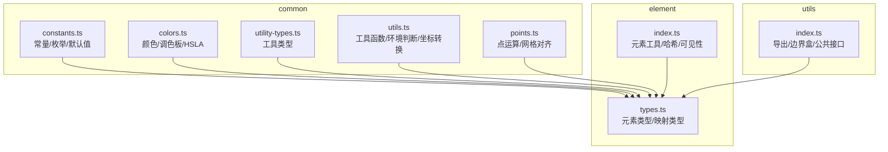
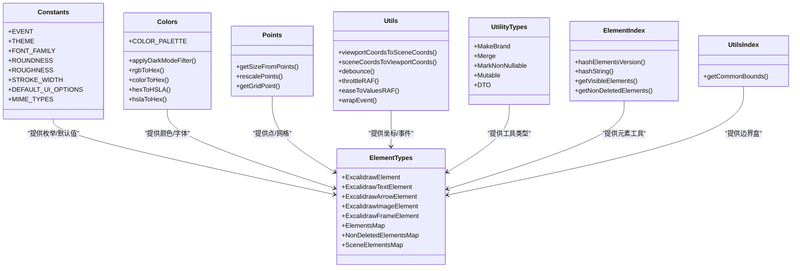
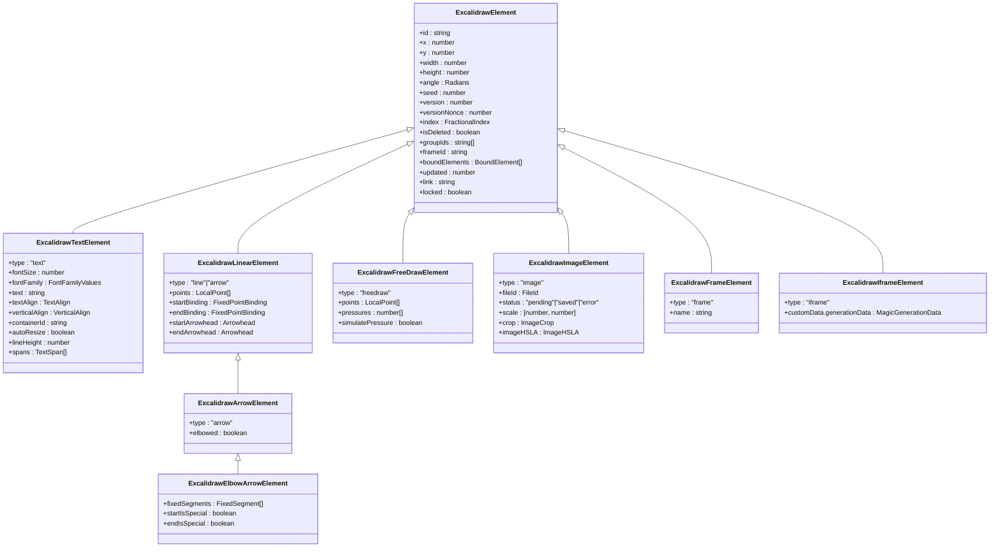
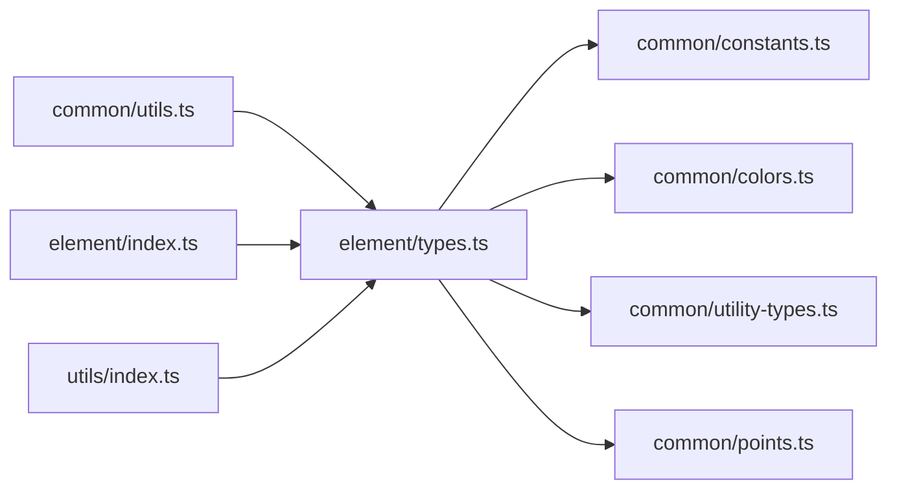

# 数据类型定义

<cite>
**本文档引用的文件**
- [packages/common/src/constants.ts](file://packages/common/src/constants.ts)
- [packages/common/src/colors.ts](file://packages/common/src/colors.ts)
- [packages/common/src/points.ts](file://packages/common/src/points.ts)
- [packages/common/src/utils.ts](file://packages/common/src/utils.ts)
- [packages/common/src/utility-types.ts](file://packages/common/src/utility-types.ts)
- [packages/element/src/index.ts](file://packages/element/src/index.ts)
- [packages/element/src/types.ts](file://packages/element/src/types.ts)
- [packages/utils/src/index.ts](file://packages/utils/src/index.ts)
</cite>

## 目录
1. [简介](#简介)
2. [项目结构](#项目结构)
3. [核心组件](#核心组件)
4. [架构总览](#架构总览)
5. [详细组件分析](#详细组件分析)
6. [依赖分析](#依赖分析)
7. [性能考虑](#性能考虑)
8. [故障排除指南](#故障排除指南)
9. [结论](#结论)
10. [附录](#附录)

## 简介
本文件系统性梳理 Excalidraw 代码库中的数据类型定义，覆盖 TypeScript 接口、类型别名与枚举，重点聚焦以下方面：
- 应用状态类型：如工具类型、主题、缩放、网格尺寸等
- 元素类型：几何图形、文本、箭头、自由绘制、图像、框架、嵌入式元素等
- 配置选项：导出、字体、颜色、UI 选项、网格等
- 事件类型：DOM 事件、自定义事件等
- 类型别名与工具类型：品牌类型、映射类型、合并类型、只读/可变类型等
- 安全性检查、验证规则与转换方法
- 版本兼容性与迁移指南

## 项目结构
本项目采用多包（monorepo）结构，数据类型相关的核心定义主要分布在以下模块：
- common：通用常量、颜色、点运算、工具函数与工具类型
- element：元素类型定义与元素级工具
- utils：导出、边界盒等工具
- excalidraw：应用层类型（通过导出暴露）

**图表来源**
- [packages/common/src/constants.ts:1-517](file://packages/common/src/constants.ts#L1-L517)
- [packages/common/src/colors.ts:1-379](file://packages/common/src/colors.ts#L1-L379)
- [packages/common/src/points.ts:1-81](file://packages/common/src/points.ts#L1-L81)
- [packages/common/src/utils.ts:1-800](file://packages/common/src/utils.ts#L1-L800)
- [packages/common/src/utility-types.ts:1-80](file://packages/common/src/utility-types.ts#L1-L80)
- [packages/element/src/types.ts:1-476](file://packages/element/src/types.ts#L1-L476)
- [packages/element/src/index.ts:1-103](file://packages/element/src/index.ts#L1-L103)
- [packages/utils/src/index.ts:1-5](file://packages/utils/src/index.ts#L1-L5)

**章节来源**
- [packages/common/src/constants.ts:1-517](file://packages/common/src/constants.ts#L1-L517)
- [packages/common/src/colors.ts:1-379](file://packages/common/src/colors.ts#L1-L379)
- [packages/common/src/points.ts:1-81](file://packages/common/src/points.ts#L1-L81)
- [packages/common/src/utils.ts:1-800](file://packages/common/src/utils.ts#L1-L800)
- [packages/common/src/utility-types.ts:1-80](file://packages/common/src/utility-types.ts#L1-L80)
- [packages/element/src/types.ts:1-476](file://packages/element/src/types.ts#L1-L476)
- [packages/element/src/index.ts:1-103](file://packages/element/src/index.ts#L1-L103)
- [packages/utils/src/index.ts:1-5](file://packages/utils/src/index.ts#L1-L5)

## 核心组件
本节概述数据类型定义的关键模块及其职责。

- 常量与默认值（common/constants.ts）
  - 定义事件枚举、主题、字体族、网格、导出、MIME 类型、UI 选项、轮次、圆角风格、线条宽度、颜色等
  - 提供默认 UI 选项与默认图像导出选项
- 颜色系统（common/colors.ts）
  - 定义颜色调色板、颜色工具（HSLA、RGB 转换、透明度、对比度）、深色模式滤镜
  - 提供颜色正则化与标准化
- 点与网格（common/points.ts）
  - 计算点集尺寸、按维度缩放、网格对齐
- 工具函数（common/utils.ts）
  - 环境检测、坐标转换、动画插值、防抖节流、选择器、字符串处理、对象更新、事件包装等
- 工具类型（common/utility-types.ts）
  - 只读/可变、合并、非空、品牌类型、DTO、集合类型等
- 元素类型（element/types.ts）
  - 元素基类、文本、线性元素、箭头、自由绘制、图像、框架、嵌入式元素、绑定关系、映射类型等
- 元素工具（element/index.ts）
  - 元素可见性、非删除过滤、版本哈希、字符串哈希、场景工具等

**章节来源**
- [packages/common/src/constants.ts:52-517](file://packages/common/src/constants.ts#L52-L517)
- [packages/common/src/colors.ts:143-379](file://packages/common/src/colors.ts#L143-L379)
- [packages/common/src/points.ts:9-81](file://packages/common/src/points.ts#L9-L81)
- [packages/common/src/utils.ts:1-800](file://packages/common/src/utils.ts#L1-L800)
- [packages/common/src/utility-types.ts:1-80](file://packages/common/src/utility-types.ts#L1-L80)
- [packages/element/src/types.ts:1-476](file://packages/element/src/types.ts#L1-L476)
- [packages/element/src/index.ts:1-103](file://packages/element/src/index.ts#L1-L103)

## 架构总览
下图展示数据类型在各模块间的依赖关系与交互：

**图表来源**
- [packages/common/src/constants.ts:52-517](file://packages/common/src/constants.ts#L52-L517)
- [packages/common/src/colors.ts:143-379](file://packages/common/src/colors.ts#L143-L379)
- [packages/common/src/points.ts:9-81](file://packages/common/src/points.ts#L9-L81)
- [packages/common/src/utils.ts:417-458](file://packages/common/src/utils.ts#L417-L458)
- [packages/common/src/utility-types.ts:61-80](file://packages/common/src/utility-types.ts#L61-L80)
- [packages/element/src/types.ts:1-476](file://packages/element/src/types.ts#L1-L476)
- [packages/element/src/index.ts:18-56](file://packages/element/src/index.ts#L18-L56)
- [packages/utils/src/index.ts:1-5](file://packages/utils/src/index.ts#L1-L5)

## 详细组件分析

### 应用状态类型与配置选项
- 工具类型与当前工具
  - 工具类型：用于区分选择、框选、矩形、菱形、椭圆、箭头、直线、自由绘制、文本、图片、橡皮擦、手型、框架、魔法框、嵌入式、激光等
  - 当前工具状态包含类型、是否锁定、是否来自选择、最后活动工具等
- 主题与缩放
  - 主题：浅色/深色
  - 缩放：最小/最大/步进值
- 网格与布局
  - 默认网格大小与步长
  - 网格对齐函数
- 导出与 MIME 类型
  - 支持的导出格式与 MIME 类型
  - 导出时的超时、边距、缩放比例
- UI 选项
  - 画布操作、工具显示控制等默认 UI 选项
- 字体与文本
  - 字体族映射、字体回退策略、文本对齐与垂直对齐
- 圆角与粗细
  - 圆角算法、粗糙度、线条宽度
- 颜色与透明度
  - 颜色调色板、透明度、对比度阈值

**章节来源**
- [packages/common/src/constants.ts:44-517](file://packages/common/src/constants.ts#L44-L517)
- [packages/common/src/points.ts:68-81](file://packages/common/src/points.ts#L68-L81)
- [packages/common/src/utils.ts:417-458](file://packages/common/src/utils.ts#L417-L458)

### 元素类型体系
- 元素基类与通用属性
  - 基类包含 id、位置、尺寸、颜色、填充样式、线宽、圆角、粗糙度、旋转角度、版本号、随机数、索引、分组、帧、绑定元素、链接、锁定、自定义数据等
- 元素类型
  - 几何元素：矩形、菱形、椭圆、选择框
  - 文本元素：包含字体大小、字体族、文本内容、对齐方式、垂直对齐、容器、自动换行、行高、富文本片段
  - 线性元素：折线、箭头（含肘形箭头、起止绑定、箭头样式）
  - 自由绘制：点序列、压力、模拟压力
  - 图像：文件标识、状态、缩放、裁剪、HSLA 调整
  - 框架：普通框架与魔法框架
  - 嵌入式与 iframe：支持生成状态与内联文档
- 映射类型
  - 元素映射、非删除映射、场景映射、有序映射等
- 组合与约束
  - 元素类型联合、非删除类型、有序类型、可绑定元素、文本容器等

**图表来源**
- [packages/element/src/types.ts:40-476](file://packages/element/src/types.ts#L40-L476)

**章节来源**
- [packages/element/src/types.ts:1-476](file://packages/element/src/types.ts#L1-L476)

### 颜色与字体类型
- 颜色
  - 调色板：键控数组、透明、黑、灰、红、粉、紫、蓝、青、绿、黄、橙、青铜等
  - 颜色工具：HSLA 结构、RGB/HEX 转换、透明度判断、深色模式滤镜、对比度阈值
- 字体
  - 字体族映射与回退策略
  - 字体字符串类型（品牌类型），用于 DOM 属性赋值

**章节来源**
- [packages/common/src/colors.ts:143-379](file://packages/common/src/colors.ts#L143-L379)
- [packages/common/src/constants.ts:130-187](file://packages/common/src/constants.ts#L130-L187)

### 事件类型与安全检查
- 事件枚举
  - 包含复制、粘贴、拖拽、滚动、全屏、指针事件、自定义事件等
- 事件包装
  - 将原生事件包装为自定义事件，便于跨组件传递
- 安全性检查
  - 颜色正则化与标准化，避免无效颜色导致渲染异常
  - 透明度与对比度阈值，确保可读性

**章节来源**
- [packages/common/src/constants.ts:52-84](file://packages/common/src/constants.ts#L52-L84)
- [packages/common/src/utils.ts:748-755](file://packages/common/src/utils.ts#L748-L755)
- [packages/common/src/colors.ts:285-355](file://packages/common/src/colors.ts#L285-L355)

### 类型别名与工具类型
- 品牌类型
  - 用于区分不同语义的字符串/数字，如 FileId、FractionalIndex、FontString
- 映射类型
  - 元素映射、非删除映射、场景映射、有序映射等
- 合并与修饰
  - 合并类型、非空修饰、只读/可变、DTO 过滤函数属性
- 集合类型
  - Set/数组泛型、Map 条目类型

**章节来源**
- [packages/element/src/types.ts:23-476](file://packages/element/src/types.ts#L23-L476)
- [packages/common/src/utility-types.ts:1-80](file://packages/common/src/utility-types.ts#L1-L80)

### 版本兼容性与迁移指南
- 版本常量
  - 定义场景与库版本号，用于序列化/反序列化兼容性校验
- 元素版本哈希
  - 使用 djb2 算法对元素 versionNonce 进行哈希，保证顺序敏感的版本一致性
- 字符串哈希
  - 对字符串进行哈希，用于非加密场景的快速校验
- 迁移建议
  - 升级时优先比较版本常量，若不一致，触发重载或降级处理
  - 对新增字段使用可选属性，并在读取时提供默认值
  - 对品牌类型字段保持向后兼容，避免直接比较底层值

**章节来源**
- [packages/common/src/constants.ts:352-356](file://packages/common/src/constants.ts#L352-L356)
- [packages/element/src/index.ts:21-41](file://packages/element/src/index.ts#L21-L41)

## 依赖分析
- 模块耦合
  - element/types.ts 依赖 common 的常量、颜色、工具类型
  - common/utils.ts 依赖 math 类型（全局/本地坐标、弧度），用于坐标转换
  - element/index.ts 依赖 common/utils.ts 的迭代器工具
- 外部依赖
  - tinycolor2 用于颜色解析与转换
  - math 包提供坐标与角度类型

**图表来源**
- [packages/element/src/types.ts:1-16](file://packages/element/src/types.ts#L1-L16)
- [packages/common/src/constants.ts:1-10](file://packages/common/src/constants.ts#L1-L10)
- [packages/common/src/colors.ts:1-7](file://packages/common/src/colors.ts#L1-L7)
- [packages/common/src/points.ts:1-8](file://packages/common/src/points.ts#L1-L8)
- [packages/common/src/utils.ts:1-25](file://packages/common/src/utils.ts#L1-L25)
- [packages/element/src/index.ts:1-10](file://packages/element/src/index.ts#L1-L10)
- [packages/utils/src/index.ts:1-5](file://packages/utils/src/index.ts#L1-L5)

**章节来源**
- [packages/element/src/types.ts:1-16](file://packages/element/src/types.ts#L1-L16)
- [packages/common/src/utils.ts:1-25](file://packages/common/src/utils.ts#L1-L25)

## 性能考虑
- 动画与节流
  - 使用 requestAnimationFrame 实现平滑动画与节流，减少主线程阻塞
- 坐标转换
  - 视口坐标与场景坐标的双向转换，避免重复计算
- 网格对齐
  - 网格对齐仅在需要时启用，避免不必要的浮点运算
- 元素哈希
  - 使用 djb2 算法进行轻量级哈希，提升协作与持久化的效率

**章节来源**
- [packages/common/src/utils.ts:125-195](file://packages/common/src/utils.ts#L125-L195)
- [packages/common/src/utils.ts:417-458](file://packages/common/src/utils.ts#L417-L458)
- [packages/common/src/points.ts:68-81](file://packages/common/src/points.ts#L68-L81)
- [packages/element/src/index.ts:21-41](file://packages/element/src/index.ts#L21-L41)

## 故障排除指南
- 颜色无效
  - 现象：颜色无法正确渲染或对比度异常
  - 处理：使用颜色正则化函数，确保输入为有效颜色；检查透明度与对比度阈值
- 坐标错位
  - 现象：点击/拖拽与元素位置不匹配
  - 处理：确认视口坐标与场景坐标的转换参数（缩放、偏移、滚动）一致
- 导出失败
  - 现象：导出图片或数据为空
  - 处理：检查 MIME 类型与导出选项；确认超时与尺寸限制未触发
- 元素排序异常
  - 现象：协作或撤销重做后元素顺序错乱
  - 处理：核对版本号与哈希；确保 fractional index 同步

**章节来源**
- [packages/common/src/colors.ts:285-355](file://packages/common/src/colors.ts#L285-L355)
- [packages/common/src/utils.ts:417-458](file://packages/common/src/utils.ts#L417-L458)
- [packages/common/src/constants.ts:262-290](file://packages/common/src/constants.ts#L262-L290)
- [packages/element/src/index.ts:21-27](file://packages/element/src/index.ts#L21-L27)

## 结论
本文件系统性梳理了 Excalidraw 的数据类型定义，涵盖应用状态、元素类型、配置选项、事件类型以及工具类型。通过品牌类型、映射类型与工具函数，项目实现了强类型约束与良好的扩展性。建议在升级与迁移时遵循版本常量与哈希策略，确保兼容性与稳定性。

## 附录
- 最佳实践
  - 使用品牌类型隔离语义（如 FileId、FractionalIndex）
  - 对新增字段采用可选属性并提供默认值
  - 在协作场景中，优先使用版本号与哈希进行一致性校验
  - 对颜色与字体等外部资源进行正则化与回退策略
- 常用工具函数路径
  - 坐标转换：[packages/common/src/utils.ts:417-458](file://packages/common/src/utils.ts#L417-L458)
  - 防抖/节流：[packages/common/src/utils.ts:125-195](file://packages/common/src/utils.ts#L125-L195)
  - 颜色转换：[packages/common/src/colors.ts:263-292](file://packages/common/src/colors.ts#L263-L292)
  - 元素哈希：[packages/element/src/index.ts:21-41](file://packages/element/src/index.ts#L21-L41)