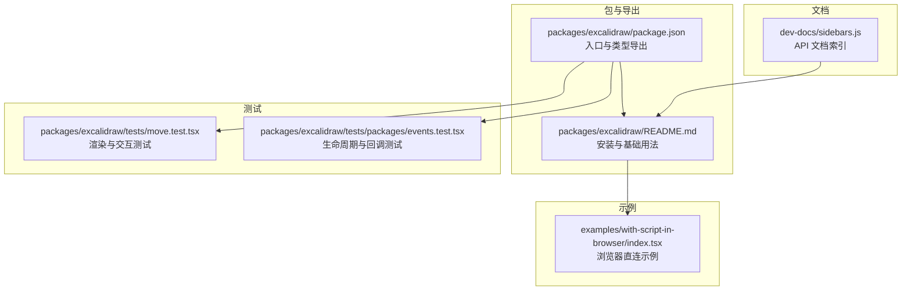
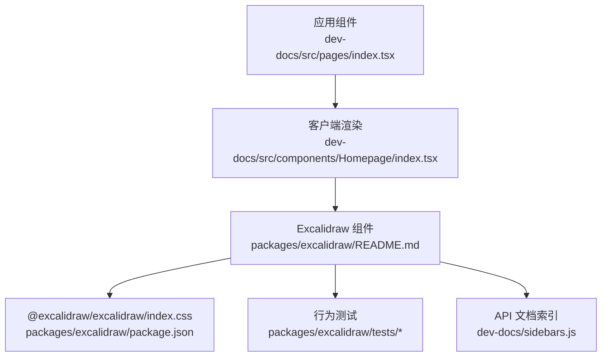
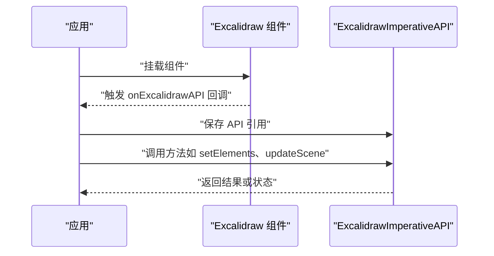
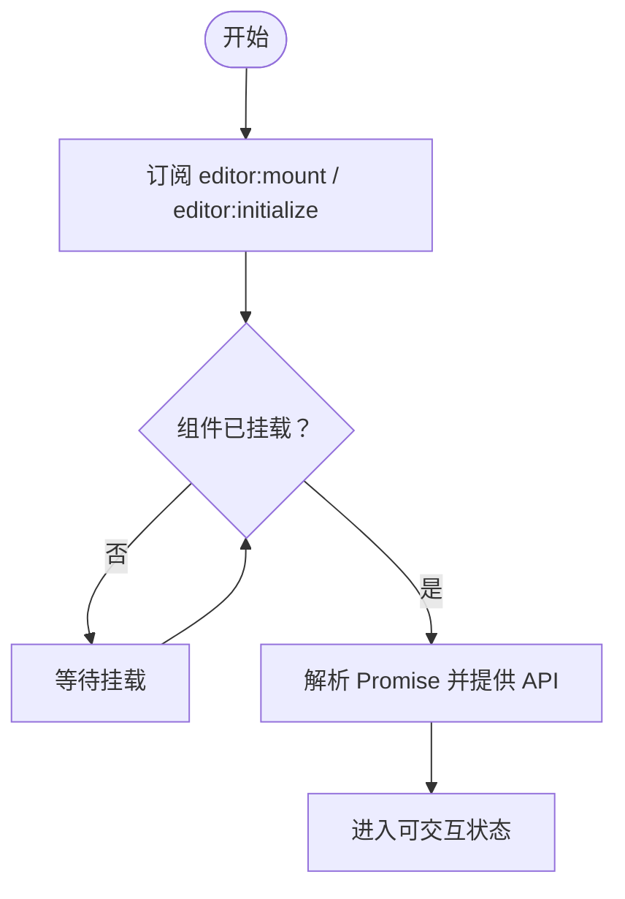
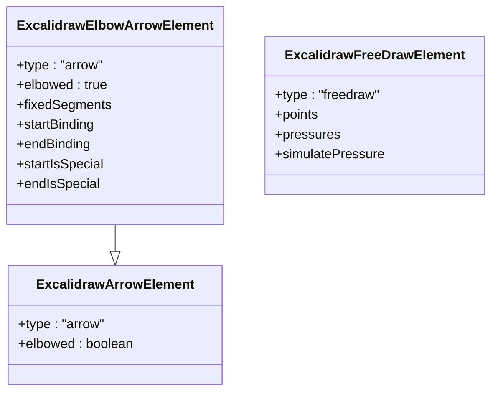
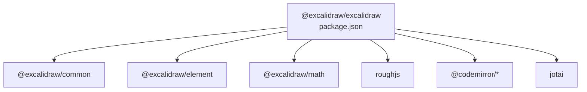

# 组件 API

<cite>
**本文引用的文件**
- [packages/excalidraw/package.json](file://packages/excalidraw/package.json)
- [packages/excalidraw/README.md](file://packages/excalidraw/README.md)
- [packages/excalidraw/tests/move.test.tsx](file://packages/excalidraw/tests/move.test.tsx)
- [packages/excalidraw/tests/packages/events.test.tsx](file://packages/excalidraw/tests/packages/events.test.tsx)
- [dev-docs/src/pages/index.tsx](file://dev-docs/src/pages/index.tsx)
- [dev-docs/src/components/Homepage/index.tsx](file://dev-docs/src/components/Homepage/index.tsx)
- [dev-docs/sidebars.js](file://dev-docs/sidebars.js)
- [examples/with-script-in-browser/index.tsx](file://examples/with-script-in-browser/index.tsx)
- [packages/element/src/types.ts](file://packages/element/src/types.ts)
</cite>

## 目录
1. [简介](#简介)
2. [项目结构](#项目结构)
3. [核心组件](#核心组件)
4. [架构总览](#架构总览)
5. [详细组件分析](#详细组件分析)
6. [依赖分析](#依赖分析)
7. [性能考虑](#性能考虑)
8. [故障排查指南](#故障排查指南)
9. [结论](#结论)
10. [附录](#附录)

## 简介
本文件为 Excalidraw React 组件的完整 API 文档，面向集成开发者与贡献者，系统性梳理组件的属性（props）、方法（methods）、事件回调（callbacks）与类型定义，并结合仓库内的文档与测试用例说明组件的生命周期、状态管理、性能优化、错误处理与最佳实践。文档同时给出基于源码的架构图与流程图，帮助读者快速理解组件在应用中的定位与交互方式。

## 项目结构
围绕 Excalidraw React 组件，仓库中与 API 文档直接相关的关键位置如下：
- 包与导出：packages/excalidraw 提供 React 组件与类型声明，包含入口、CSS 导出与构建产物路径。
- 示例与用法：examples 下的 with-script-in-browser 展示了浏览器直连方式的集成；packages/excalidraw/README.md 提供最小可用示例与注意事项。
- 测试与行为验证：packages/excalidraw/tests 中包含对组件生命周期与事件回调的行为测试。
- 文档索引：dev-docs 的 sidebars.js 指向 API 文档分类，便于导航到 props、UI 选项、工具函数等页面。

**图表来源**
- [packages/excalidraw/package.json:1-141](file://packages/excalidraw/package.json#L1-L141)
- [packages/excalidraw/README.md:1-143](file://packages/excalidraw/README.md#L1-L143)
- [examples/with-script-in-browser/index.tsx:1-29](file://examples/with-script-in-browser/index.tsx#L1-L29)
- [packages/excalidraw/tests/move.test.tsx:1-47](file://packages/excalidraw/tests/move.test.tsx#L1-L47)
- [packages/excalidraw/tests/packages/events.test.tsx:1-40](file://packages/excalidraw/tests/packages/events.test.tsx#L1-L40)
- [dev-docs/sidebars.js:57-92](file://dev-docs/sidebars.js#L57-L92)

**章节来源**
- [packages/excalidraw/package.json:1-141](file://packages/excalidraw/package.json#L1-L141)
- [packages/excalidraw/README.md:1-143](file://packages/excalidraw/README.md#L1-L143)
- [dev-docs/sidebars.js:57-92](file://dev-docs/sidebars.js#L57-L92)

## 核心组件
- 组件名称：Excalidraw
- 包名与版本：@excalidraw/excalidraw（版本号见 package.json）
- 入口与导出：通过 package.json 的 exports 字段导出 types、开发/生产入口与 CSS 资源。
- 基础用法要点：
  - 必须导入包内 CSS。
  - 渲染容器需具有非零高度，否则画布不可见。
  - 在 SSR 框架（如 Next.js）中应以客户端组件动态加载。

上述信息来自 README 与示例文件，确保首次集成时遵循这些前提条件。

**章节来源**
- [packages/excalidraw/README.md:17-42](file://packages/excalidraw/README.md#L17-L42)
- [examples/with-script-in-browser/index.tsx:1-29](file://examples/with-script-in-browser/index.tsx#L1-L29)

## 架构总览
下图展示 Excalidraw 组件在应用中的典型集成路径与关键交互点：

**图表来源**
- [dev-docs/src/pages/index.tsx:1-37](file://dev-docs/src/pages/index.tsx#L1-L37)
- [dev-docs/src/components/Homepage/index.tsx:1-72](file://dev-docs/src/components/Homepage/index.tsx#L1-L72)
- [packages/excalidraw/README.md:17-42](file://packages/excalidraw/README.md#L17-L42)
- [packages/excalidraw/package.json:24-33](file://packages/excalidraw/package.json#L24-L33)
- [dev-docs/sidebars.js:57-92](file://dev-docs/sidebars.js#L57-L92)

## 详细组件分析

### 属性（Props）与回调（Callbacks）
根据测试与 README 可知，组件支持以下关键属性与回调（按实际出现与测试覆盖整理）：
- onExcalidrawAPI：组件初始化后异步提供 imperative API 引用，用于后续方法调用与状态查询。
- 初始数据与 UI 选项：README 与文档索引指向“initialdata”“ui-options”“render-props”等文档页面，表明组件支持丰富的初始数据与 UI 定制能力。
- 事件回调：测试覆盖了 editor:mount、editor:initialize 等生命周期事件的订阅与解析时机。

建议在集成时：
- 使用 onExcalidrawAPI 获取 API 后再进行方法调用，避免竞态。
- 将初始数据与 UI 选项通过对应 props 注入，确保首次渲染符合预期。

**章节来源**
- [packages/excalidraw/tests/packages/events.test.tsx:13-40](file://packages/excalidraw/tests/packages/events.test.tsx#L13-L40)
- [packages/excalidraw/README.md:17-42](file://packages/excalidraw/README.md#L17-L42)
- [dev-docs/sidebars.js:57-92](file://dev-docs/sidebars.js#L57-L92)

### 方法（Methods）与 Imperative API
- 获取方式：通过 onExcalidrawAPI 回调获得 ExcalidrawImperativeAPI 实例。
- 调用时机：应在 editor:mount 或 editor:initialize 解析后再调用，保证 DOM 与内部状态已就绪。
- 返回值：具体方法签名与返回值由类型定义决定，集成时应参考类型声明与文档页面。

**图表来源**
- [packages/excalidraw/tests/packages/events.test.tsx:20-28](file://packages/excalidraw/tests/packages/events.test.tsx#L20-L28)

**章节来源**
- [packages/excalidraw/tests/packages/events.test.tsx:13-40](file://packages/excalidraw/tests/packages/events.test.tsx#L13-L40)

### 事件回调（Lifecycle & Callbacks）
- editor:mount：组件完成挂载，提供容器与 API。
- editor:initialize：编辑器初始化完成，可安全进行后续操作。
- 订阅时机：测试显示可在挂载前订阅，随后由组件解析对应的 Promise。

**图表来源**
- [packages/excalidraw/tests/packages/events.test.tsx:30-40](file://packages/excalidraw/tests/packages/events.test.tsx#L30-L40)

**章节来源**
- [packages/excalidraw/tests/packages/events.test.tsx:13-40](file://packages/excalidraw/tests/packages/events.test.tsx#L13-L40)

### 类型定义与数据模型
- 元素类型：packages/element/src/types.ts 中定义了多种元素类型（如箭头、自由绘制等），这些类型是组件渲染与交互的基础。
- 集成建议：在 TypeScript 项目中，优先使用官方导出的类型，确保与组件内部数据结构保持一致。

**图表来源**
- [packages/element/src/types.ts:382-422](file://packages/element/src/types.ts#L382-L422)

**章节来源**
- [packages/element/src/types.ts:382-422](file://packages/element/src/types.ts#L382-L422)

### 基本用法与高级配置
- 基本用法：导入 CSS、提供非零高度容器、渲染组件。
- 高级配置：README 与文档索引指向“initialdata”“ui-options”“render-props”，表明可通过 props 注入初始场景数据、UI 主题与自定义渲染逻辑。
- 响应式行为：README 明确组件会填充父容器的 100% 宽高，因此父容器的尺寸变化会影响画布大小。

**章节来源**
- [packages/excalidraw/README.md:17-42](file://packages/excalidraw/README.md#L17-L42)
- [dev-docs/sidebars.js:57-92](file://dev-docs/sidebars.js#L57-L92)

### 生命周期与状态管理
- 生命周期：组件在挂载后通过回调提供 API，并在初始化完成后允许进行方法调用。
- 状态管理：组件内部使用原子化状态管理（参见依赖分析），外部通过 imperative API 读取与更新状态。

**章节来源**
- [packages/excalidraw/tests/packages/events.test.tsx:13-40](file://packages/excalidraw/tests/packages/events.test.tsx#L13-L40)

### 性能优化
- 渲染策略：测试中可见交互与静态场景的渲染被分别监控，表明组件在交互与静态渲染上可能采用不同策略以提升性能。
- 建议：避免频繁重渲染场景数据；在批量更新时合并多次调用，减少不必要的重绘。

**章节来源**
- [packages/excalidraw/tests/move.test.tsx:21-25](file://packages/excalidraw/tests/move.test.tsx#L21-L25)

## 依赖分析
- 包导出与类型：package.json 的 exports 字段定义了 types、开发/生产入口与 CSS 资源路径。
- 运行时依赖：组件依赖多个子包（common、element、math 等）与第三方库（Codemirror、roughjs 等）。
- 浏览器兼容：browserslist 指定了生产与开发环境的最低浏览器版本要求。

**图表来源**
- [packages/excalidraw/package.json:76-117](file://packages/excalidraw/package.json#L76-L117)

**章节来源**
- [packages/excalidraw/package.json:76-117](file://packages/excalidraw/package.json#L76-L117)

## 性能考虑
- 减少不必要的重渲染：将初始数据与 UI 选项一次性注入，避免在渲染过程中反复变更。
- 批量更新：通过 imperative API 的批量更新方法减少多次调用带来的开销。
- 渲染监控：利用测试中对交互与静态场景渲染的监控思路，在应用层对关键操作进行性能观测。

[本节为通用指导，无需列出章节来源]

## 故障排查指南
- 画布不可见：确认父容器具有非零高度，组件会填充父容器的 100% 宽高。
- SSR 报错：在 Next.js 等 SSR 框架中，确保组件仅在客户端渲染。
- API 未就绪：onExcalidrawAPI 回调尚未解析时调用方法会导致失败，应等待 editor:mount 或 editor:initialize 解析。
- 类型不匹配：在 TypeScript 项目中使用官方导出的类型，避免与内部数据结构不一致导致的编译或运行时错误。

**章节来源**
- [packages/excalidraw/README.md:17-42](file://packages/excalidraw/README.md#L17-L42)
- [packages/excalidraw/tests/packages/events.test.tsx:30-40](file://packages/excalidraw/tests/packages/events.test.tsx#L30-L40)

## 结论
Excalidraw React 组件提供了简洁的嵌入方式与强大的可配置性。通过 onExcalidrawAPI 获取 imperative API，结合 README 与文档索引中的 props、UI 选项与工具函数，开发者可以实现从基础绘图到复杂协作的多种场景。集成时应关注生命周期回调、容器尺寸与 SSR 渲染限制，并在 TypeScript 项目中使用官方类型以确保一致性与稳定性。

[本节为总结性内容，无需列出章节来源]

## 附录
- 安装与快速开始：参见 README 的安装与最小可用示例。
- API 文档导航：参见 dev-docs/sidebars.js 中的 API 分类索引。
- 浏览器直连示例：参见 examples/with-script-in-browser/index.tsx。

**章节来源**
- [packages/excalidraw/README.md:17-42](file://packages/excalidraw/README.md#L17-L42)
- [dev-docs/sidebars.js:57-92](file://dev-docs/sidebars.js#L57-L92)
- [examples/with-script-in-browser/index.tsx:1-29](file://examples/with-script-in-browser/index.tsx#L1-L29)