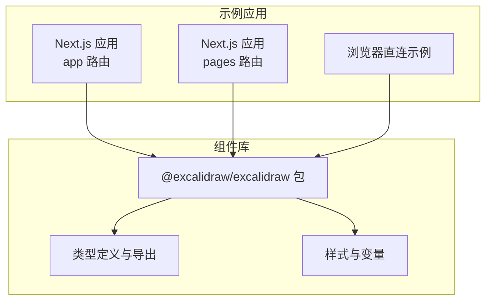
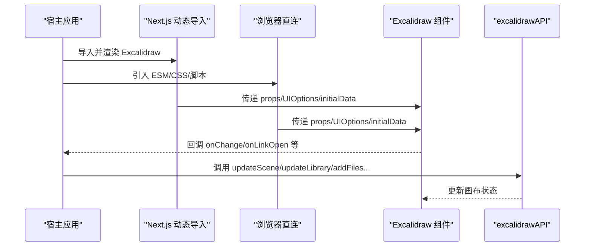
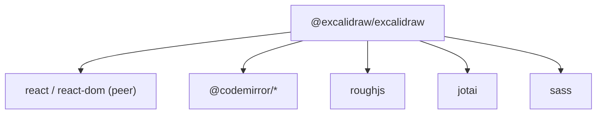

# React 组件库

<cite>
**本文引用的文件**
- [packages/excalidraw/package.json](file://packages/excalidraw/package.json)
- [dev-docs/docs/@excalidraw/excalidraw/installation.mdx](file://dev-docs/docs/@excalidraw/excalidraw/installation.mdx)
- [dev-docs/docs/@excalidraw/excalidraw/integration.mdx](file://dev-docs/docs/@excalidraw/excalidraw/integration.mdx)
- [dev-docs/docs/@excalidraw/excalidraw/api/api-intro.mdx](file://dev-docs/docs/@excalidraw/excalidraw/api/api-intro.mdx)
- [dev-docs/docs/@excalidraw/excalidraw/api/props/props.mdx](file://dev-docs/docs/@excalidraw/excalidraw/api/props/props.mdx)
- [dev-docs/docs/@excalidraw/excalidraw/api/props/ui-options.mdx](file://dev-docs/docs/@excalidraw/excalidraw/api/props/ui-options.mdx)
- [dev-docs/docs/@excalidraw/excalidraw/api/props/excalidraw-api.mdx](file://dev-docs/docs/@excalidraw/excalidraw/api/props/excalidraw-api.mdx)
- [dev-docs/docs/@excalidraw/excalidraw/api/children-components/children-components-intro.mdx](file://dev-docs/docs/@excalidraw/excalidraw/api/children-components/children-components-intro.mdx)
- [dev-docs/docs/@excalidraw/excalidraw/api/utils/utils-intro.md](file://dev-docs/docs/@excalidraw/excalidraw/api/utils/utils-intro.md)
- [dev-docs/docs/@excalidraw/excalidraw/customizing-styles.mdx](file://dev-docs/docs/@excalidraw/excalidraw/customizing-styles.mdx)
- [dev-docs/docs/@excalidraw/excalidraw/faq.mdx](file://dev-docs/docs/@excalidraw/excalidraw/faq.mdx)
- [dev-docs/docs/@excalidraw/excalidraw/development.mdx](file://dev-docs/docs/@excalidraw/excalidraw/development.mdx)
- [examples/with-nextjs/src/app/page.tsx](file://examples/with-nextjs/src/app/page.tsx)
- [examples/with-nextjs/src/pages/excalidraw-in-pages.tsx](file://examples/with-nextjs/src/pages/excalidraw-in-pages.tsx)
- [examples/with-nextjs/src/excalidrawWrapper.tsx](file://examples/with-nextjs/src/excalidrawWrapper.tsx)
- [examples/with-script-in-browser/index.tsx](file://examples/with-script-in-browser/index.tsx)
- [examples/with-script-in-browser/components/ExampleApp.tsx](file://examples/with-script-in-browser/components/ExampleApp.tsx)
- [examples/with-script-in-browser/components/sidebar/ExampleSidebar.tsx](file://examples/with-script-in-browser/components/sidebar/ExampleSidebar.tsx)
- [excalidraw-app/App.tsx](file://excalidraw-app/App.tsx)
</cite>

## 目录
1. [简介](#简介)
2. [项目结构](#项目结构)
3. [核心组件](#核心组件)
4. [架构总览](#架构总览)
5. [详细组件分析](#详细组件分析)
6. [依赖分析](#依赖分析)
7. [性能考虑](#性能考虑)
8. [故障排查指南](#故障排查指南)
9. [结论](#结论)
10. [附录](#附录)

## 简介
本文件面向使用 @excalidraw/excalidraw 的开发者，系统化梳理其 React 组件的 API、生命周期与状态管理、性能优化、主题与样式定制、TypeScript 类型、可访问性与响应式设计、以及常见问题与调试技巧。文档以循序渐进的方式组织：先从安装与集成开始，再深入到 Props、API、子组件、工具函数与样式定制，最后给出性能与故障排查建议。

## 项目结构
该仓库包含多个包与示例应用，其中与 React 组件库直接相关的是 packages/excalidraw 与 examples 中的集成示例。下图展示了与文档目标最相关的模块关系：

图表来源
- [packages/excalidraw/package.json:1-141](file://packages/excalidraw/package.json#L1-L141)
- [dev-docs/docs/@excalidraw/excalidraw/integration.mdx:1-241](file://dev-docs/docs/@excalidraw/excalidraw/integration.mdx#L1-L241)

章节来源
- [packages/excalidraw/package.json:1-141](file://packages/excalidraw/package.json#L1-L141)
- [dev-docs/docs/@excalidraw/excalidraw/integration.mdx:1-241](file://dev-docs/docs/@excalidraw/excalidraw/integration.mdx#L1-L241)

## 核心组件
- 组件名称：Excalidraw
- 角色定位：作为 React 组件嵌入宿主应用，提供画布编辑能力与可扩展的 UI 定制点。
- 主要职责：
  - 渲染画布与工具栏、侧边栏、菜单等 UI。
  - 暴露 props 配置（如初始数据、主题、UI 选项、语言、协作模式等）。
  - 提供 excalidrawAPI 以动态更新场景、库、文件、滚动、光标、历史等。
  - 支持子组件（MainMenu、Sidebar、Footer、WelcomeScreen、LiveCollaborationTrigger）进行 UI 定制。
  - 提供工具函数用于序列化/反序列化、坐标转换、边界计算等。

章节来源
- [dev-docs/docs/@excalidraw/excalidraw/api/api-intro.mdx:1-12](file://dev-docs/docs/@excalidraw/excalidraw/api/api-intro.mdx#L1-L12)
- [dev-docs/docs/@excalidraw/excalidraw/api/children-components/children-components-intro.mdx:1-23](file://dev-docs/docs/@excalidraw/excalidraw/api/children-components/children-components-intro.mdx#L1-L23)

## 架构总览
下图展示了 Excalidraw 在不同运行环境中的集成方式与交互路径：

图表来源
- [dev-docs/docs/@excalidraw/excalidraw/integration.mdx:33-131](file://dev-docs/docs/@excalidraw/excalidraw/integration.mdx#L33-L131)
- [dev-docs/docs/@excalidraw/excalidraw/api/props/excalidraw-api.mdx:1-450](file://dev-docs/docs/@excalidraw/excalidraw/api/props/excalidraw-api.mdx#L1-L450)

章节来源
- [dev-docs/docs/@excalidraw/excalidraw/integration.mdx:1-241](file://dev-docs/docs/@excalidraw/excalidraw/integration.mdx#L1-L241)

## 详细组件分析

### Props API 详解
- 所有 props 均为可选；通过 props 控制行为、UI 与交互。
- 关键 props 分类与要点：
  - 数据与回调：initialData、onChange、onPointerUpdate、onPointerDown、onScrollChange、onPaste、onLibraryChange、onLinkOpen、generateLinkForSelection。
  - 模式控制：isCollaborating、viewModeEnabled、zenModeEnabled、gridModeEnabled、detectScroll、handleKeyboardGlobally、autoFocus。
  - 名称与主题：name、theme、langCode。
  - UI 定制：UIOptions（canvasActions、dockedSidebarBreakpoint、tools）、renderTopRightUI、renderCustomStats、renderEmbeddable。
  - 文件与校验：generateIdForFile、validateEmbeddable、renderScrollbars。
  - 自定义数据：元素支持自定义字段 customData，便于业务扩展。

章节来源
- [dev-docs/docs/@excalidraw/excalidraw/api/props/props.mdx:1-262](file://dev-docs/docs/@excalidraw/excalidraw/api/props/props.mdx#L1-L262)

### UIOptions 与 UI 定制
- canvasActions：控制菜单内画布操作按钮可见性（背景色、清空、加载、保存、导出、切换主题、保存为图片等），支持 exportOpts 自定义导出对话框。
- dockedSidebarBreakpoint：容器宽度超过阈值时启用停靠侧边栏。
- tools：控制特定工具可见性（如 image 工具）。
- renderTopRightUI/renderCustomStats：在右上角或统计面板插入自定义 UI。

章节来源
- [dev-docs/docs/@excalidraw/excalidraw/api/props/ui-options.mdx:1-82](file://dev-docs/docs/@excalidraw/excalidraw/api/props/ui-options.mdx#L1-L82)

### 子组件（Children Components）
- 支持的子组件：MainMenu、WelcomeScreen、Sidebar、Footer、LiveCollaborationTrigger。
- 使用方式：将对应子组件作为 Excalidraw 的子节点渲染，实现菜单、侧边栏、页脚、协作触发器等 UI 定制。
- 注意：部分 UI 组件仍在迁移中，部分定制能力尚未完全开放。

章节来源
- [dev-docs/docs/@excalidraw/excalidraw/api/children-components/children-components-intro.mdx:1-23](file://dev-docs/docs/@excalidraw/excalidraw/api/children-components/children-components-intro.mdx#L1-L23)

### Excalidraw API（excalidrawAPI）
- 生命周期与状态管理：
  - 通过 excalidrawAPI 订阅/取消订阅变更与指针事件。
  - 通过 API 获取/设置 appState、元素集合、文件、滚动、光标、历史等。
  - 通过 updateScene/updateLibrary/addFiles/resetScene/refresh/setToast/toggleSidebar 等方法驱动状态变化。
- 方法清单与用途（节选）：
  - updateScene：更新场景数据（元素、appState、协作者、捕获策略）。
  - updateLibrary：更新库（合并/提示/打开菜单/默认状态）。
  - addFiles/getFiles：缓存文件数据。
  - getAppState/getSceneElements/getSceneElementsIncludingDeleted：读取当前状态与元素。
  - scrollToContent/refresh：滚动聚焦与坐标刷新。
  - setActiveTool/setCursor/resetCursor：工具与光标控制。
  - history.clear：清空历史。
  - onChange/onPointerDown/onPointerUp：事件订阅与取消。
- 重要变更：Ref 支持已移除；ready/readyPromise 已废弃。

章节来源
- [dev-docs/docs/@excalidraw/excalidraw/api/props/excalidraw-api.mdx:1-450](file://dev-docs/docs/@excalidraw/excalidraw/api/props/excalidraw-api.mdx#L1-L450)

### 工具函数（Utils）
- 场景与库序列化：serializeAsJSON、serializeLibraryAsJSON。
- 数据加载：loadFromBlob/loadLibraryFromBlob/loadSceneOrLibraryFromBlob。
- 元素与库处理：isLinearElement/isInvisiblySmallElement/getNonDeletedElements/mergeLibraryItems。
- 库处理钩子：useHandleLibrary。
- 坐标与边界：sceneCoordsToViewportCoords/viewportCoordsToSceneCoords/getCommonBounds/elementsOverlappingBBox/isElementInsideBBox/elementPartiallyOverlapsWithOrContainsBBox。
- 国际化：defaultLang、languages、useI18n。
- 设备检测：useEditorInterface。

章节来源
- [dev-docs/docs/@excalidraw/excalidraw/api/utils/utils-intro.md:1-488](file://dev-docs/docs/@excalidraw/excalidraw/api/utils/utils-intro.md#L1-L488)

### 主题与样式定制
- CSS 变量：通过 .excalidraw 与 .excalidraw.theme--dark 选择器覆盖变量，如 --color-primary 及其变体。
- 自定义样式：建议使用更高优先级的选择器前缀，避免与内置样式冲突。
- 示例：在容器上添加自定义类名，覆盖主色调变量以适配品牌色。

章节来源
- [dev-docs/docs/@excalidraw/excalidraw/customizing-styles.mdx:1-50](file://dev-docs/docs/@excalidraw/excalidraw/customizing-styles.mdx#L1-L50)

### TypeScript 类型与类型安全
- 类型导出：包声明了 types 字段指向生成的 d.ts，涵盖组件、元素、工具等类型。
- 建议实践：
  - 明确 props 类型（如 UIOptions、ExcalidrawAPI）。
  - 使用工具函数返回值类型（如 loadFromBlob 返回 RestoredDataState）。
  - 对自定义数据（如 customData）使用 Record<string, any> 或自定义接口约束。
  - 通过泛型与只读数组类型保证不可变性与安全性。

章节来源
- [packages/excalidraw/package.json:1-141](file://packages/excalidraw/package.json#L1-L141)

### 集成与运行环境
- 模块打包器：ESM 导入方式，按需引入组件。
- Next.js：推荐使用动态导入禁用 SSR，避免服务端渲染问题；app/pages 路由均支持，注意客户端指令与动态导入配置。
- 浏览器直连：通过 import map 与 ESM 引入，设置 EXCALIDRAW_ASSET_PATH 以加载字体与资源。
- Preact：通过设置环境变量启用 Preact 构建，Vite 需要在配置中暴露 process.env.IS_PREACT。

章节来源
- [dev-docs/docs/@excalidraw/excalidraw/integration.mdx:1-241](file://dev-docs/docs/@excalidraw/excalidraw/integration.mdx#L1-L241)
- [dev-docs/docs/@excalidraw/excalidraw/installation.mdx:1-56](file://dev-docs/docs/@excalidraw/excalidraw/installation.mdx#L1-L56)

### 示例与最佳实践
- Next.js 示例：
  - app 路由与 pages 路由分别演示动态导入与客户端组件写法。
  - 包含 CSS 导入与工具函数使用示例。
- 浏览器直连示例：
  - 展示 import map、CSS、脚本引入与容器尺寸要求。
  - 提供侧边栏与自定义页脚组件示例。

章节来源
- [examples/with-nextjs/src/app/page.tsx](file://examples/with-nextjs/src/app/page.tsx)
- [examples/with-nextjs/src/pages/excalidraw-in-pages.tsx](file://examples/with-nextjs/src/pages/excalidraw-in-pages.tsx)
- [examples/with-nextjs/src/excalidrawWrapper.tsx](file://examples/with-nextjs/src/excalidrawWrapper.tsx)
- [examples/with-script-in-browser/index.tsx](file://examples/with-script-in-browser/index.tsx)
- [examples/with-script-in-browser/components/ExampleApp.tsx](file://examples/with-script-in-browser/components/ExampleApp.tsx)
- [examples/with-script-in-browser/components/sidebar/ExampleSidebar.tsx](file://examples/with-script-in-browser/components/sidebar/ExampleSidebar.tsx)

## 依赖分析
- 外部依赖：React 与 React-DOM（peerDependencies），Codemirror、roughjs、jotai、sass 等内部功能依赖。
- 浏览器兼容：browserslist 指定生产与开发环境目标，排除老旧浏览器与特定平台限制。
- 构建与发布：通过脚本生成类型与构建产物，支持多包统一版本与变更日志维护。

图表来源
- [packages/excalidraw/package.json:76-117](file://packages/excalidraw/package.json#L76-L117)

章节来源
- [packages/excalidraw/package.json:1-141](file://packages/excalidraw/package.json#L1-L141)

## 性能考虑
- 事件绑定范围：handleKeyboardGlobally 默认关闭，避免与宿主应用键盘事件冲突；仅在需要全局监听时开启。
- 滚动检测：detectScroll 控制是否监听父容器滚动以刷新偏移；在复杂布局中可按需关闭以减少重算。
- 历史与撤销：合理使用 updateScene 的 captureUpdate 参数，区分立即、最终与永不进入撤销栈的更新，减少冗余历史。
- 画布尺寸：确保容器非零尺寸，避免 100% 尺寸导致的重排抖动。
- 图像与字体：自托管字体时设置 EXCALIDRAW_ASSET_PATH，减少网络请求波动对首屏的影响。
- 多实例场景：使用 excalidrawAPI.id 区分多个实例，避免互相干扰。

## 故障排查指南
- 文本显示异常（Brave 防指纹）：关闭“激进阻止指纹识别”，否则 measureText API 可能失效导致文本元素异常。
- Vite 环境变量：若使用 Preact 构建，需在 Vite 配置中暴露 process.env.IS_PREACT。
- Next.js SSR：确保 Excalidraw 仅在客户端渲染，app/pages 路由均需动态导入并禁用 SSR。
- 进度发布：开发阶段可使用 @excalidraw/excalidraw@next 体验最新特性。
- 参考错误：出现 ReferenceError: process is not defined 时，检查构建配置是否注入环境变量。

章节来源
- [dev-docs/docs/@excalidraw/excalidraw/faq.mdx:1-47](file://dev-docs/docs/@excalidraw/excalidraw/faq.mdx#L1-L47)

## 结论
@excalidraw/excalidraw 提供了完善的 React 组件化能力与高度可定制的 UI 扩展点。通过 Props、excalidrawAPI、子组件与工具函数，开发者可以在保持简洁的同时实现从基础绘制到高级协作、导出、国际化与主题定制的全链路需求。配合合理的性能策略与故障排查手段，可在多框架与多运行环境中稳定落地。

## 附录
- 开发与示例：启动示例应用、发布流程与版本管理参考开发文档。
- 示例入口：
  - Next.js app 路由页面
  - Next.js pages 路由页面
  - Next.js 包装器组件
  - 浏览器直连示例与组件示例

章节来源
- [dev-docs/docs/@excalidraw/excalidraw/development.mdx:1-40](file://dev-docs/docs/@excalidraw/excalidraw/development.mdx#L1-L40)
- [examples/with-nextjs/src/app/page.tsx](file://examples/with-nextjs/src/app/page.tsx)
- [examples/with-nextjs/src/pages/excalidraw-in-pages.tsx](file://examples/with-nextjs/src/pages/excalidraw-in-pages.tsx)
- [examples/with-nextjs/src/excalidrawWrapper.tsx](file://examples/with-nextjs/src/excalidrawWrapper.tsx)
- [examples/with-script-in-browser/index.tsx](file://examples/with-script-in-browser/index.tsx)
- [examples/with-script-in-browser/components/ExampleApp.tsx](file://examples/with-script-in-browser/components/ExampleApp.tsx)
- [examples/with-script-in-browser/components/sidebar/ExampleSidebar.tsx](file://examples/with-script-in-browser/components/sidebar/ExampleSidebar.tsx)