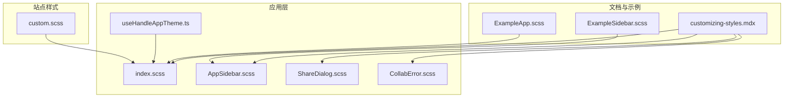
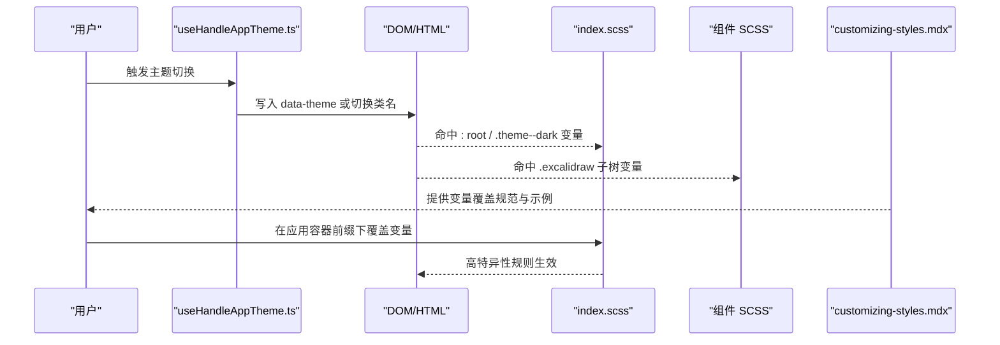
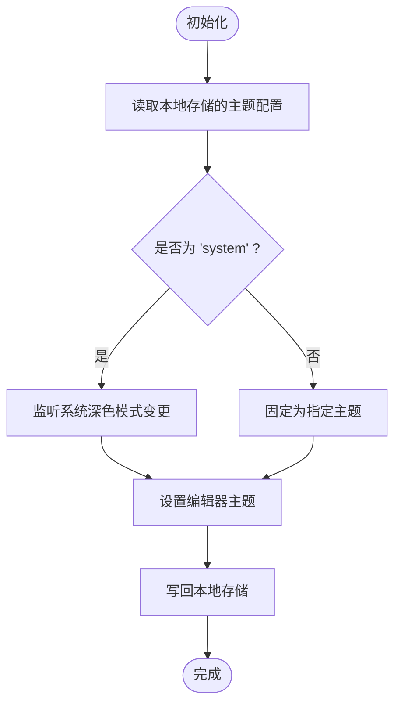
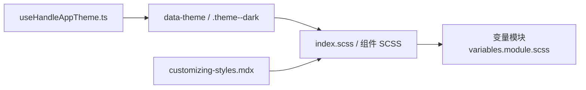

# CSS 样式定制

<cite>
**本文引用的文件**
- [dev-docs/src/css/custom.scss](file://dev-docs/src/css/custom.scss)
- [excalidraw-app/index.scss](file://excalidraw-app/index.scss)
- [excalidraw-app/components/AppSidebar.scss](file://excalidraw-app/components/AppSidebar.scss)
- [excalidraw-app/share/ShareDialog.scss](file://excalidraw-app/share/ShareDialog.scss)
- [excalidraw-app/collab/CollabError.scss](file://excalidraw-app/collab/CollabError.scss)
- [examples/with-script-in-browser/components/ExampleApp.scss](file://examples/with-script-in-browser/components/ExampleApp.scss)
- [examples/with-script-in-browser/components/sidebar/ExampleSidebar.scss](file://examples/with-script-in-browser/components/sidebar/ExampleSidebar.scss)
- [dev-docs/docs/@excalidraw/excalidraw/customizing-styles.mdx](file://dev-docs/docs/@excalidraw/excalidraw/customizing-styles.mdx)
- [excalidraw-app/useHandleAppTheme.ts](file://excalidraw-app/useHandleAppTheme.ts)
</cite>

## 目录

1. [简介](#简介)
2. [项目结构](#项目结构)
3. [核心组件](#核心组件)
4. [架构总览](#架构总览)
5. [详细组件分析](#详细组件分析)
6. [依赖关系分析](#依赖关系分析)
7. [性能考量](#性能考量)
8. [故障排查指南](#故障排查指南)
9. [结论](#结论)
10. [附录](#附录)

## 简介

本指南围绕 Excalidraw 的 CSS 样式定制展开，重点讲解 CSS 变量系统的设计与使用、组件样式定制方法（含 CSS-in-JS 思路）、样式优先级与隔离策略、冲突解决、动态主题切换、调试技巧、性能优化与打包策略，并结合仓库中的实际样式文件给出可操作的实践路径。

## 项目结构

本项目中与样式定制直接相关的内容主要分布在以下位置：

- 应用层样式：应用入口与页面容器的全局与局部样式
- 组件层样式：各功能模块（侧边栏、分享对话框、协作错误提示等）的 SCSS 文件
- 文档与示例：官方文档对样式定制的说明以及示例工程中的覆盖实践
- 主题逻辑：通过 React Hook 实现的主题状态管理与持久化

**图表来源**

- [dev-docs/docs/@excalidraw/excalidraw/customizing-styles.mdx:1-50](file://dev-docs/docs/@excalidraw/excalidraw/customizing-styles.mdx#L1-L50)
- [excalidraw-app/index.scss:1-131](file://excalidraw-app/index.scss#L1-L131)
- [excalidraw-app/components/AppSidebar.scss:1-37](file://excalidraw-app/components/AppSidebar.scss#L1-L37)
- [excalidraw-app/share/ShareDialog.scss:1-192](file://excalidraw-app/share/ShareDialog.scss#L1-L192)
- [excalidraw-app/collab/CollabError.scss:1-36](file://excalidraw-app/collab/CollabError.scss#L1-L36)
- [examples/with-script-in-browser/components/ExampleApp.scss:1-93](file://examples/with-script-in-browser/components/ExampleApp.scss#L1-L93)
- [examples/with-script-in-browser/components/sidebar/ExampleSidebar.scss:1-67](file://examples/with-script-in-browser/components/sidebar/ExampleSidebar.scss#L1-L67)
- [excalidraw-app/useHandleAppTheme.ts:1-71](file://excalidraw-app/useHandleAppTheme.ts#L1-L71)
- [dev-docs/src/css/custom.scss:1-102](file://dev-docs/src/css/custom.scss#L1-L102)

**章节来源**

- [dev-docs/docs/@excalidraw/excalidraw/customizing-styles.mdx:1-50](file://dev-docs/docs/@excalidraw/excalidraw/customizing-styles.mdx#L1-L50)
- [excalidraw-app/index.scss:1-131](file://excalidraw-app/index.scss#L1-L131)
- [excalidraw-app/components/AppSidebar.scss:1-37](file://excalidraw-app/components/AppSidebar.scss#L1-L37)
- [excalidraw-app/share/ShareDialog.scss:1-192](file://excalidraw-app/share/ShareDialog.scss#L1-L192)
- [excalidraw-app/collab/CollabError.scss:1-36](file://excalidraw-app/collab/CollabError.scss#L1-L36)
- [examples/with-script-in-browser/components/ExampleApp.scss:1-93](file://examples/with-script-in-browser/components/ExampleApp.scss#L1-L93)
- [examples/with-script-in-browser/components/sidebar/ExampleSidebar.scss:1-67](file://examples/with-script-in-browser/components/sidebar/ExampleSidebar.scss#L1-L67)
- [dev-docs/src/css/custom.scss:1-102](file://dev-docs/src/css/custom.scss#L1-L102)
- [excalidraw-app/useHandleAppTheme.ts:1-71](file://excalidraw-app/useHandleAppTheme.ts#L1-L71)

## 核心组件

- CSS 变量系统与作用域
  - Excalidraw 使用以 .excalidraw 为根的选择器包裹变量，确保变量在组件树内生效且具备明确作用域边界。
  - 官方文档强调应通过更高选择器特异性（如在应用容器上加前缀）来覆盖默认变量。
- 主题与暗色模式
  - 通过 data-theme 属性与 .theme--dark 类名配合，实现明/暗两套变量体系。
  - 应用层提供主题 Hook，支持系统跟随、本地存储持久化与快捷键切换。
- 组件样式定制
  - 侧边栏、分享对话框、协作错误提示等模块均采用 SCSS 并通过变量驱动视觉一致性。
  - 示例工程展示了如何在应用容器下覆盖主色调变量，从而影响内部 Excalidraw 组件。

**章节来源**

- [dev-docs/docs/@excalidraw/excalidraw/customizing-styles.mdx:1-50](file://dev-docs/docs/@excalidraw/excalidraw/customizing-styles.mdx#L1-L50)
- [excalidraw-app/index.scss:1-131](file://excalidraw-app/index.scss#L1-L131)
- [excalidraw-app/useHandleAppTheme.ts:1-71](file://excalidraw-app/useHandleAppTheme.ts#L1-L71)
- [examples/with-script-in-browser/components/ExampleApp.scss:69-93](file://examples/with-script-in-browser/components/ExampleApp.scss#L69-L93)

## 架构总览

下图展示从“主题状态”到“组件变量应用”的端到端流程，以及“应用层覆盖”与“站点层覆盖”的两条样式注入路径。

**图表来源**

- [excalidraw-app/useHandleAppTheme.ts:1-71](file://excalidraw-app/useHandleAppTheme.ts#L1-L71)
- [excalidraw-app/index.scss:1-131](file://excalidraw-app/index.scss#L1-L131)
- [excalidraw-app/components/AppSidebar.scss:1-37](file://excalidraw-app/components/AppSidebar.scss#L1-L37)
- [excalidraw-app/share/ShareDialog.scss:1-192](file://excalidraw-app/share/ShareDialog.scss#L1-L192)
- [excalidraw-app/collab/CollabError.scss:1-36](file://excalidraw-app/collab/CollabError.scss#L1-L36)
- [dev-docs/docs/@excalidraw/excalidraw/customizing-styles.mdx:1-50](file://dev-docs/docs/@excalidraw/excalidraw/customizing-styles.mdx#L1-L50)

## 详细组件分析

### CSS 变量系统与命名规范

- 命名与分组
  - 主色调系列：--color-primary、--color-primary-darker、--color-primary-darkest、--color-primary-light
  - 对比度修正：--color-primary-contrast-offset（明/暗模式下行为不同）
  - 其他语义变量：--color-success、--color-warning、--color-danger、--text-primary-color、--dialog-border-color、--island-bg-color 等
- 作用域与继承
  - 变量在 .excalidraw 根节点下生效；子组件通过 var(--var-name) 继承
  - 暗色模式通过 .theme--dark 或 [data-theme="dark"] 切换对应变量值
- 覆盖策略
  - 必须保证选择器特异性高于默认，推荐在应用容器上加前缀（例如 .your-app .excalidraw）

**章节来源**

- [dev-docs/docs/@excalidraw/excalidraw/customizing-styles.mdx:16-40](file://dev-docs/docs/@excalidraw/excalidraw/customizing-styles.mdx#L16-L40)
- [excalidraw-app/index.scss:3-81](file://excalidraw-app/index.scss#L3-L81)
- [excalidraw-app/share/ShareDialog.scss:13-28](file://excalidraw-app/share/ShareDialog.scss#L13-L28)
- [excalidraw-app/collab/CollabError.scss:3-12](file://excalidraw-app/collab/CollabError.scss#L3-L12)

### 主题与动态切换

- 系统与用户偏好
  - 通过媒体查询监听系统深色模式变化
  - 支持“跟随系统”、“浅色”、“深色”三种状态
- 本地持久化
  - 将用户选择的主题写入本地存储，刷新后仍保持
- 快捷键切换
  - 提供组合键快速在明/暗之间切换
- DOM 表达
  - 通过 data-theme 属性或 .theme--dark 类名驱动变量

**图表来源**

- [excalidraw-app/useHandleAppTheme.ts:12-71](file://excalidraw-app/useHandleAppTheme.ts#L12-L71)

**章节来源**

- [excalidraw-app/useHandleAppTheme.ts:1-71](file://excalidraw-app/useHandleAppTheme.ts#L1-L71)

### 组件样式定制方法

- SCSS 变量与混入
  - 多处 SCSS 文件通过变量统一控制尺寸、颜色、阴影等
  - 使用 @include isMobile 等混入实现响应式
- 选择器特异性与隔离
  - 在应用容器下覆盖 .excalidraw 变量，避免污染全局
  - 组件内部通过 .excalidraw 子选择器限定作用域
- 动画与过渡
  - 协作错误按钮使用 shake 动画，分享对话框使用 scaleIn 动画
- 示例工程实践
  - 在应用容器上设置主色调变量，即可影响内部 Excalidraw 组件

**章节来源**

- [excalidraw-app/index.scss:1-131](file://excalidraw-app/index.scss#L1-L131)
- [excalidraw-app/components/AppSidebar.scss:1-37](file://excalidraw-app/components/AppSidebar.scss#L1-L37)
- [excalidraw-app/share/ShareDialog.scss:1-192](file://excalidraw-app/share/ShareDialog.scss#L1-L192)
- [excalidraw-app/collab/CollabError.scss:1-36](file://excalidraw-app/collab/CollabError.scss#L1-L36)
- [examples/with-script-in-browser/components/ExampleApp.scss:69-93](file://examples/with-script-in-browser/components/ExampleApp.scss#L69-L93)

### 样式优先级、隔离与冲突解决

- 优先级
  - 应用容器前缀（如 .your-app .excalidraw）优于默认选择器
  - 暗色模式选择器（.theme--dark 或 [data-theme="dark"]）与明/暗变量叠加
- 隔离策略
  - 所有变量置于 .excalidraw 下，组件内部仅通过 var() 继承
  - 组件 SCSS 也以 .excalidraw 为父选择器，避免跨组件污染
- 冲突解决
  - 若站点全局样式与 Excalidraw 内部样式冲突，可在应用层通过更具体的选择器重置（如覆盖表格、菜单项等）
  - 示例中对 Stats、上下文菜单等进行了针对性覆盖

**章节来源**

- [dev-docs/src/css/custom.scss:80-102](file://dev-docs/src/css/custom.scss#L80-L102)
- [dev-docs/docs/@excalidraw/excalidraw/customizing-styles.mdx:3-14](file://dev-docs/docs/@excalidraw/excalidraw/customizing-styles.mdx#L3-L14)
- [excalidraw-app/index.scss:1-131](file://excalidraw-app/index.scss#L1-L131)

### 样式注入与主题覆盖技术

- CSS-in-JS 思路
  - 通过在应用容器上设置 CSS 变量，达到“伪 CSS-in-JS”的效果：运行时根据状态切换变量值，无需重新编译样式
- 样式注入
  - 应用层 SCSS 导入变量模块，组件层 SCSS 通过变量驱动
  - 文档层提供覆盖示例，指导用户在应用容器下注入变量
- 主题覆盖
  - 明/暗两套变量分别在 :root 与 .theme--dark 下声明
  - 示例工程展示了如何在应用容器下覆盖主色调变量

**章节来源**

- [dev-docs/docs/@excalidraw/excalidraw/customizing-styles.mdx:1-50](file://dev-docs/docs/@excalidraw/excalidraw/customizing-styles.mdx#L1-L50)
- [excalidraw-app/index.scss:1-131](file://excalidraw-app/index.scss#L1-L131)
- [examples/with-script-in-browser/components/ExampleApp.scss:69-93](file://examples/with-script-in-browser/components/ExampleApp.scss#L69-L93)

## 依赖关系分析

- 主题状态依赖
  - useHandleAppTheme.ts 依赖 THEME 常量与本地存储键，负责状态同步与持久化
- 样式依赖
  - 各组件 SCSS 依赖变量模块（variables.module.scss），并在 .excalidraw 下消费变量
  - 文档 customizing-styles.mdx 作为覆盖规范，指导应用层 SCSS 的编写

**图表来源**

- [excalidraw-app/useHandleAppTheme.ts:1-71](file://excalidraw-app/useHandleAppTheme.ts#L1-L71)
- [excalidraw-app/index.scss:1-131](file://excalidraw-app/index.scss#L1-L131)
- [dev-docs/docs/@excalidraw/excalidraw/customizing-styles.mdx:1-50](file://dev-docs/docs/@excalidraw/excalidraw/customizing-styles.mdx#L1-L50)

**章节来源**

- [excalidraw-app/useHandleAppTheme.ts:1-71](file://excalidraw-app/useHandleAppTheme.ts#L1-L71)
- [excalidraw-app/index.scss:1-131](file://excalidraw-app/index.scss#L1-L131)
- [dev-docs/docs/@excalidraw/excalidraw/customizing-styles.mdx:1-50](file://dev-docs/docs/@excalidraw/excalidraw/customizing-styles.mdx#L1-L50)

## 性能考量

- 变量复用与减少重绘
  - 将颜色、尺寸、阴影等抽象为变量，避免重复计算与多处修改带来的维护成本
- 选择器特异性控制
  - 通过应用容器前缀提升特异性，避免深层选择器导致的匹配开销
- 动画与过渡
  - 合理使用 transform 与 opacity 动画，减少布局抖动
- 打包与按需加载
  - 将组件 SCSS 按需引入，避免全局样式膨胀
  - 对于文档与示例的额外样式，仅在相应页面/场景启用

[本节为通用建议，不直接分析具体文件]

## 故障排查指南

- 变量未生效
  - 检查是否在应用容器前缀下覆盖（例如 .your-app .excalidraw）
  - 确认选择器特异性高于默认规则
- 暗色模式不生效
  - 检查 data-theme 属性或 .theme--dark 类名是否正确挂载
  - 确认 :root 与 .theme--dark 下的变量均已定义
- 样式冲突
  - 对冲突元素进行针对性覆盖（如 Stats、上下文菜单项）
  - 使用更具体的选择器或 !important 临时定位问题（不建议长期使用）
- 主题切换无反应
  - 检查 useHandleAppTheme.ts 的事件绑定与本地存储写入
  - 确认键盘快捷键未被其他组件拦截

**章节来源**

- [dev-docs/src/css/custom.scss:80-102](file://dev-docs/src/css/custom.scss#L80-L102)
- [excalidraw-app/useHandleAppTheme.ts:1-71](file://excalidraw-app/useHandleAppTheme.ts#L1-L71)

## 结论

Excalidraw 的样式定制以 CSS 变量为核心，通过 .excalidraw 作用域与明/暗两套变量体系实现一致的视觉语言。应用层可通过主题 Hook 与容器前缀变量实现动态主题与高特异性覆盖。组件层 SCSS 以变量驱动，配合文档规范与示例工程，形成可扩展、可维护的样式体系。遵循本文的优先级、隔离与冲突解决策略，可高效完成默认样式的覆盖、自定义主题的创建与动态切换。

[本节为总结性内容，不直接分析具体文件]

## 附录

### 定制实践清单

- 覆盖默认样式
  - 在应用容器前缀下设置 .excalidraw 变量，确保特异性高于默认
  - 针对 Stats、上下文菜单等冲突区域进行局部覆盖
- 创建自定义主题
  - 在 :root 与 .theme--dark 下分别定义主色调系列变量
  - 使用 --color-primary-contrast-offset 适配明/暗对比度
- 实现动态样式切换
  - 使用 useHandleAppTheme.ts 管理主题状态与持久化
  - 通过 data-theme 或 .theme--dark 切换变量
- 调试技巧
  - 使用浏览器开发者工具检查 .excalidraw 根节点下的变量值
  - 逐步缩小选择器范围，确认特异性与覆盖顺序
- 性能优化
  - 复用变量，减少重复定义
  - 控制动画属性，避免强制同步布局
- 第三方集成与打包
  - 仅在需要的页面/场景引入额外样式
  - 对组件 SCSS 进行按需加载，避免全局样式膨胀

**章节来源**

- [dev-docs/docs/@excalidraw/excalidraw/customizing-styles.mdx:1-50](file://dev-docs/docs/@excalidraw/excalidraw/customizing-styles.mdx#L1-L50)
- [excalidraw-app/index.scss:1-131](file://excalidraw-app/index.scss#L1-L131)
- [excalidraw-app/useHandleAppTheme.ts:1-71](file://excalidraw-app/useHandleAppTheme.ts#L1-L71)
- [dev-docs/src/css/custom.scss:1-102](file://dev-docs/src/css/custom.scss#L1-L102)
- [examples/with-script-in-browser/components/ExampleApp.scss:69-93](file://examples/with-script-in-browser/components/ExampleApp.scss#L69-L93)
