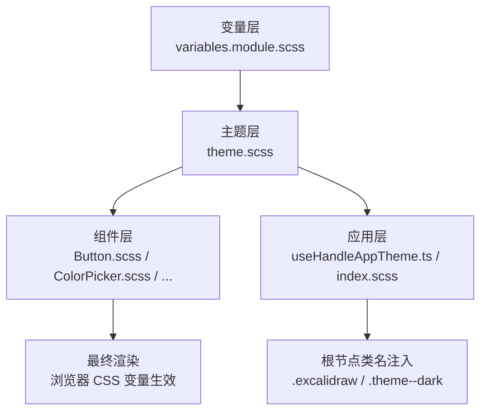
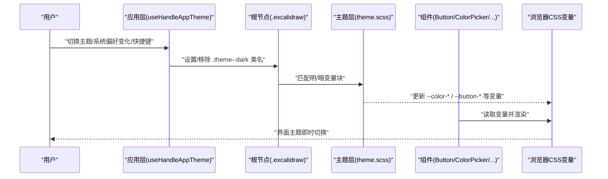
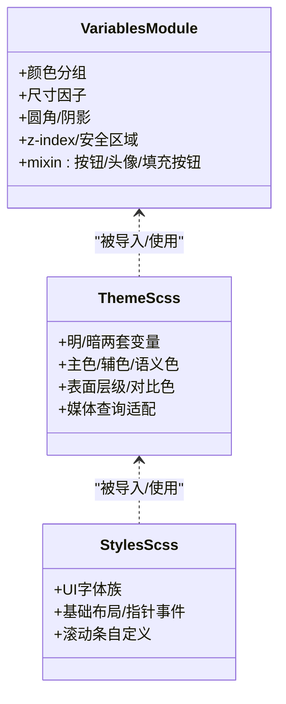
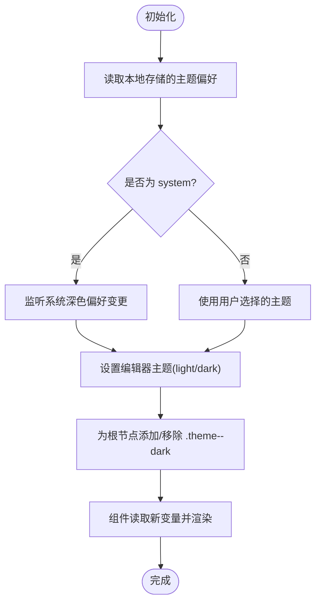
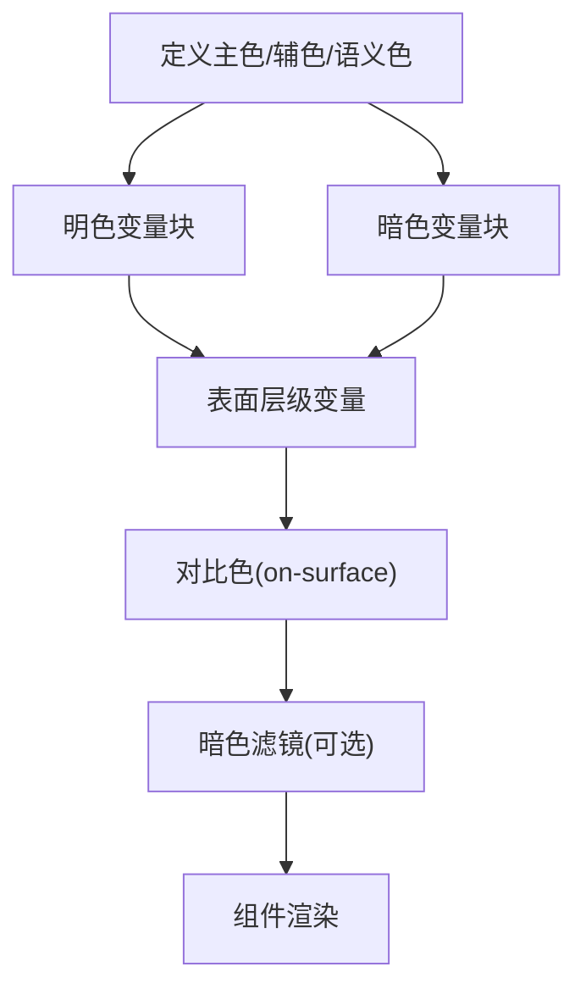
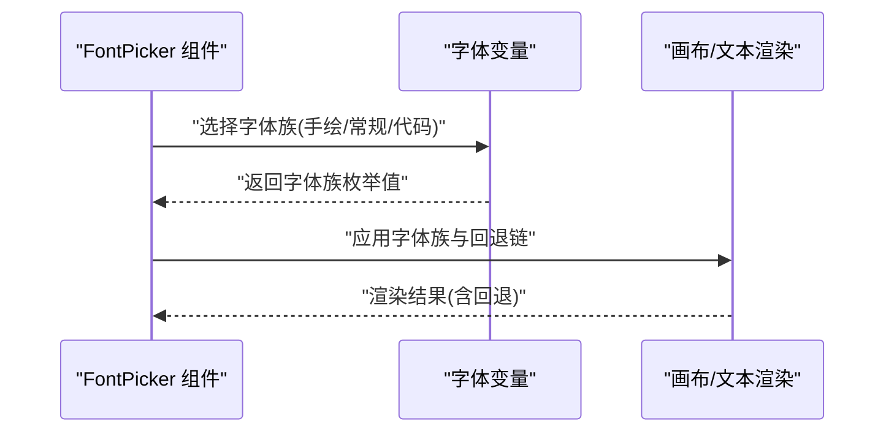
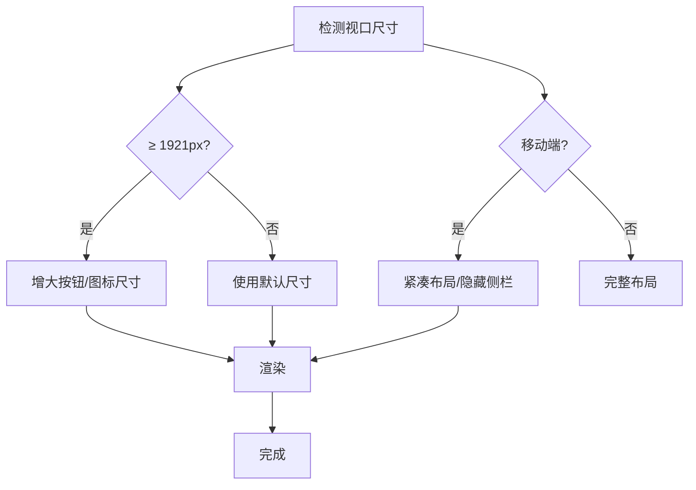
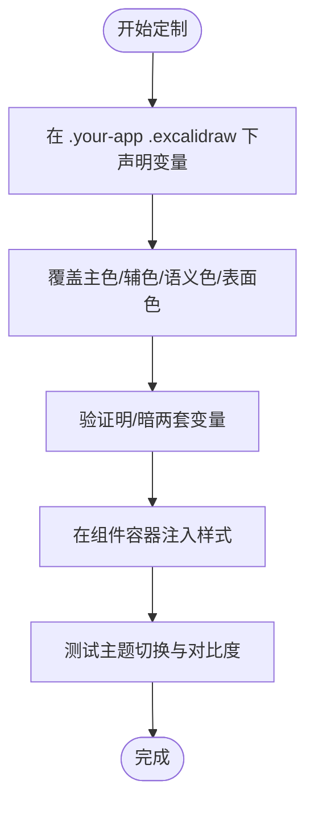
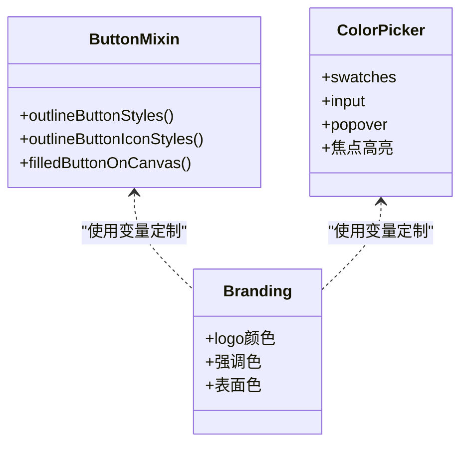
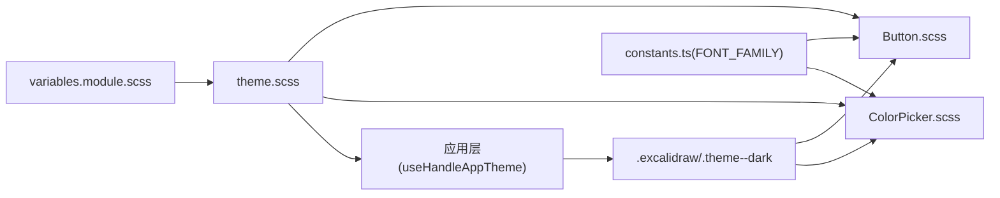

# 主题与样式

<cite>
**本文引用的文件**
- [packages/excalidraw/css/styles.scss](file://packages/excalidraw/css/styles.scss)
- [packages/excalidraw/css/theme.scss](file://packages/excalidraw/css/theme.scss)
- [packages/excalidraw/css/variables.module.scss](file://packages/excalidraw/css/variables.module.scss)
- [packages/excalidraw/components/Button.scss](file://packages/excalidraw/components/Button.scss)
- [packages/excalidraw/components/ColorPicker/ColorPicker.scss](file://packages/excalidraw/components/ColorPicker/ColorPicker.scss)
- [packages/common/src/constants.ts](file://packages/common/src/constants.ts)
- [packages/excalidraw/components/FontPicker/FontPicker.tsx](file://packages/excalidraw/components/FontPicker/FontPicker.tsx)
- [excalidraw-app/index.scss](file://excalidraw-app/index.scss)
- [excalidraw-app/useHandleAppTheme.ts](file://excalidraw-app/useHandleAppTheme.ts)
- [dev-docs/docs/@excalidraw/excalidraw/customizing-styles.mdx](file://dev-docs/docs/@excalidraw/excalidraw/customizing-styles.mdx)
- [excalidraw-app/components/AppSidebar.scss](file://excalidraw-app/components/AppSidebar.scss)
</cite>

## 目录
1. [简介](#简介)
2. [项目结构](#项目结构)
3. [核心组件](#核心组件)
4. [架构总览](#架构总览)
5. [详细组件分析](#详细组件分析)
6. [依赖关系分析](#依赖关系分析)
7. [性能考量](#性能考量)
8. [故障排查指南](#故障排查指南)
9. [结论](#结论)
10. [附录](#附录)

## 简介
本文件系统性梳理 Excalidraw 的主题与样式体系，涵盖 CSS 变量体系、主题切换机制、动态样式加载、颜色系统（主色/辅色/语义色/暗色模式）、字体管理（字体选择/加载/回退/渲染优化）、响应式设计策略（断点/布局/移动端优化）、样式定制指南（CSS 变量覆盖/组件样式注入/全局配置）以及可访问性与品牌定制建议。目标是帮助开发者在不破坏现有设计语言的前提下，安全、高效地进行主题定制与扩展。

## 项目结构
Excalidraw 的样式与主题由“变量层 → 主题层 → 组件层 → 应用层”四层构成：
- 变量层：集中定义颜色、尺寸、阴影、字体族等基础变量，供主题层与组件层复用。
- 主题层：基于变量层生成明/暗两套主题变量，并通过媒体查询与应用状态驱动切换。
- 组件层：以 mixin 与通用样式模块化按钮、颜色选择器、上下文菜单等 UI 组件。
- 应用层：负责主题状态持久化、系统偏好监听、快捷键切换与根节点类名注入。

**图表来源**
- [packages/excalidraw/css/variables.module.scss:1-233](file://packages/excalidraw/css/variables.module.scss#L1-L233)
- [packages/excalidraw/css/theme.scss:1-282](file://packages/excalidraw/css/theme.scss#L1-L282)
- [packages/excalidraw/components/Button.scss:1-8](file://packages/excalidraw/components/Button.scss#L1-L8)
- [packages/excalidraw/components/ColorPicker/ColorPicker.scss:1-497](file://packages/excalidraw/components/ColorPicker/ColorPicker.scss#L1-L497)
- [excalidraw-app/useHandleAppTheme.ts:1-71](file://excalidraw-app/useHandleAppTheme.ts#L1-L71)
- [excalidraw-app/index.scss:1-131](file://excalidraw-app/index.scss#L1-L131)

**章节来源**
- [packages/excalidraw/css/styles.scss:1-842](file://packages/excalidraw/css/styles.scss#L1-L842)
- [packages/excalidraw/css/theme.scss:1-282](file://packages/excalidraw/css/theme.scss#L1-L282)
- [packages/excalidraw/css/variables.module.scss:1-233](file://packages/excalidraw/css/variables.module.scss#L1-L233)
- [excalidraw-app/useHandleAppTheme.ts:1-71](file://excalidraw-app/useHandleAppTheme.ts#L1-L71)

## 核心组件
- CSS 变量体系
  - 变量层集中定义颜色、尺寸、边框半径、阴影、滚动条、z-index、安全区域等基础变量，供主题层与组件层使用。
  - 主题层在明/暗模式下重定义关键变量，如表面色、文本色、边框色、强调色等，形成统一的视觉语义。
- 主题切换机制
  - 应用层通过 Hook 监听系统偏好与键盘快捷键，维护当前主题状态并持久化到本地存储；同时根据状态为根节点添加或移除主题类名，驱动 CSS 变量切换。
- 动态样式加载
  - 根节点类名与 CSS 变量联动，无需重新打包即可实现主题切换；组件层通过 mixin 与变量引用，按需消费主题变量。
- 颜色系统
  - 明/暗两套主题变量覆盖主色、辅色、语义色（成功/警告/危险/提示）、表面层级（high/mid/low/lowest）与对比色（on-surface）。
- 字体管理
  - UI 字体族通过变量统一声明；组件层提供字体选择器，支持手绘/常规/代码三种默认字体族，并提供回退链与跨平台回退策略。
- 响应式设计
  - 使用媒体查询与变量调整按钮尺寸、图标尺寸、容器内边距等；移动端通过 mixin 与断点适配工具栏、侧栏与交互元素。
- 样式定制
  - 提供覆盖指南与示例，强调选择器优先级与变量覆盖范围；组件层提供可注入的样式入口与容器类名。

**章节来源**
- [packages/excalidraw/css/theme.scss:1-282](file://packages/excalidraw/css/theme.scss#L1-L282)
- [packages/excalidraw/css/variables.module.scss:1-233](file://packages/excalidraw/css/variables.module.scss#L1-L233)
- [excalidraw-app/useHandleAppTheme.ts:1-71](file://excalidraw-app/useHandleAppTheme.ts#L1-L71)
- [packages/excalidraw/components/FontPicker/FontPicker.tsx:1-130](file://packages/excalidraw/components/FontPicker/FontPicker.tsx#L1-L130)
- [packages/common/src/constants.ts:130-194](file://packages/common/src/constants.ts#L130-L194)

## 架构总览
下图展示从主题状态到最终渲染的关键路径：应用层状态 → 根节点类名 → 主题变量 → 组件样式。

**图表来源**
- [excalidraw-app/useHandleAppTheme.ts:1-71](file://excalidraw-app/useHandleAppTheme.ts#L1-L71)
- [packages/excalidraw/css/theme.scss:179-281](file://packages/excalidraw/css/theme.scss#L179-L281)
- [packages/excalidraw/components/Button.scss:1-8](file://packages/excalidraw/components/Button.scss#L1-L8)
- [packages/excalidraw/components/ColorPicker/ColorPicker.scss:1-497](file://packages/excalidraw/components/ColorPicker/ColorPicker.scss#L1-L497)

## 详细组件分析

### CSS 变量体系与主题层
- 变量层
  - 定义颜色分组（红/灰/绿/蓝）、尺寸因子、圆角、阴影、滚动条、z-index、安全区域等。
  - 提供 mixin（如按钮、头像、填充按钮等），组件层通过 include 复用，确保风格一致。
- 主题层
  - 在明/暗两套变量中分别定义主色、辅色、语义色、表面层级、对比色、链接色、输入框色等。
  - 支持高对比度修正变量（如主色对比偏移），用于补偿视觉错觉。
  - 提供媒体查询适配大屏按钮与图标尺寸。
- 应用层样式
  - 根节点声明 UI 字体族变量与基础布局；子组件通过变量引用实现一致性。

**图表来源**
- [packages/excalidraw/css/variables.module.scss:1-233](file://packages/excalidraw/css/variables.module.scss#L1-L233)
- [packages/excalidraw/css/theme.scss:1-282](file://packages/excalidraw/css/theme.scss#L1-L282)
- [packages/excalidraw/css/styles.scss:1-80](file://packages/excalidraw/css/styles.scss#L1-L80)

**章节来源**
- [packages/excalidraw/css/variables.module.scss:1-233](file://packages/excalidraw/css/variables.module.scss#L1-L233)
- [packages/excalidraw/css/theme.scss:1-282](file://packages/excalidraw/css/theme.scss#L1-L282)
- [packages/excalidraw/css/styles.scss:1-80](file://packages/excalidraw/css/styles.scss#L1-L80)

### 主题切换机制与动态样式加载
- 状态来源
  - 本地存储保存用户选择的主题（light/dark/system）；系统偏好通过媒体查询监听；支持快捷键切换。
- 状态同步
  - 当主题为 system 时，监听系统偏好变化并动态更新编辑器主题；否则使用用户选择值。
- 根节点类名
  - 将当前主题映射为根节点类名（如 .theme--dark），驱动 CSS 变量切换。
- 动态加载
  - 无需重新编译，仅通过类名与变量切换实现主题即时生效。

**图表来源**
- [excalidraw-app/useHandleAppTheme.ts:1-71](file://excalidraw-app/useHandleAppTheme.ts#L1-L71)
- [packages/common/src/constants.ts:189-194](file://packages/common/src/constants.ts#L189-L194)

**章节来源**
- [excalidraw-app/useHandleAppTheme.ts:1-71](file://excalidraw-app/useHandleAppTheme.ts#L1-L71)
- [packages/common/src/constants.ts:189-194](file://packages/common/src/constants.ts#L189-L194)

### 颜色系统与语义化颜色
- 主色与辅色
  - 明/暗两套主色、加深/最深、浅色、悬停/激活等变量，保证在不同背景下具备足够对比度。
- 语义化颜色
  - 成功/警告/危险/提示等语义色在明/暗模式下分别定义背景、图标与文本色，确保可读性与一致性。
- 表面层级
  - surface-high/mid/low/lowest 与 on-surface 对比色组合，支撑卡片、弹窗、侧栏等层级的视觉区分。
- 暗色模式滤镜
  - 通过 CSS 变量对交互画布应用反相与色相旋转滤镜，减少暗色模式下的视觉疲劳。

**图表来源**
- [packages/excalidraw/css/theme.scss:87-163](file://packages/excalidraw/css/theme.scss#L87-L163)
- [packages/excalidraw/css/theme.scss:233-279](file://packages/excalidraw/css/theme.scss#L233-L279)

**章节来源**
- [packages/excalidraw/css/theme.scss:87-163](file://packages/excalidraw/css/theme.scss#L87-L163)
- [packages/excalidraw/css/theme.scss:233-279](file://packages/excalidraw/css/theme.scss#L233-L279)

### 字体管理与文本渲染优化
- 字体族
  - UI 字体族通过变量统一声明，组件层提供字体选择器，支持手绘/常规/代码三种默认字体族。
- 回退链
  - 跨平台与字符集回退策略明确，包含无衬线/等宽通用族与 Windows Emoji 回退。
- 文本渲染优化
  - 画布元素采用像素化渲染与锐利边缘策略，提升低分辨率设备上的清晰度。

**图表来源**
- [packages/excalidraw/components/FontPicker/FontPicker.tsx:1-130](file://packages/excalidraw/components/FontPicker/FontPicker.tsx#L1-L130)
- [packages/common/src/constants.ts:130-194](file://packages/common/src/constants.ts#L130-L194)
- [packages/excalidraw/css/styles.scss:38-41](file://packages/excalidraw/css/styles.scss#L38-L41)

**章节来源**
- [packages/excalidraw/components/FontPicker/FontPicker.tsx:1-130](file://packages/excalidraw/components/FontPicker/FontPicker.tsx#L1-L130)
- [packages/common/src/constants.ts:130-194](file://packages/common/src/constants.ts#L130-L194)
- [packages/excalidraw/css/styles.scss:38-41](file://packages/excalidraw/css/styles.scss#L38-L41)

### 响应式设计策略
- 断点与布局
  - 使用媒体查询在超大屏上放大按钮与图标尺寸；在移动端通过 mixin 与断点隐藏侧栏、调整交互元素尺寸与间距。
- 移动端优化
  - 工具栏、底部栏与菜单在小屏上进行紧凑布局与交互优化；安全区域变量用于适配刘海屏/圆角屏。
- 组件适配
  - 组件层通过 mixin 与变量在移动设备上自动调整尺寸与间距，保持可用性与一致性。

**图表来源**
- [packages/excalidraw/css/theme.scss:172-177](file://packages/excalidraw/css/theme.scss#L172-L177)
- [packages/excalidraw/css/styles.scss:558-566](file://packages/excalidraw/css/styles.scss#L558-L566)
- [packages/excalidraw/css/variables.module.scss:26-30](file://packages/excalidraw/css/variables.module.scss#L26-L30)

**章节来源**
- [packages/excalidraw/css/theme.scss:172-177](file://packages/excalidraw/css/theme.scss#L172-L177)
- [packages/excalidraw/css/styles.scss:558-566](file://packages/excalidraw/css/styles.scss#L558-L566)
- [packages/excalidraw/css/variables.module.scss:26-30](file://packages/excalidraw/css/variables.module.scss#L26-L30)

### 样式定制指南
- CSS 变量覆盖
  - 在 .excalidraw 与 .excalidraw.theme--dark 选择器下覆盖关键变量（如主色、对比偏移、表面色等），确保选择器优先级足够高。
- 组件样式注入
  - 通过组件容器类名与变量引用，将自定义样式注入到对应组件区域；避免直接修改源码，便于升级。
- 全局样式配置
  - 在应用入口处引入样式文件，确保变量与主题层正确加载；必要时在应用容器上增加前缀选择器以隔离作用域。

**图表来源**
- [dev-docs/docs/@excalidraw/excalidraw/customizing-styles.mdx:1-50](file://dev-docs/docs/@excalidraw/excalidraw/customizing-styles.mdx#L1-L50)
- [excalidraw-app/index.scss:1-131](file://excalidraw-app/index.scss#L1-L131)

**章节来源**
- [dev-docs/docs/@excalidraw/excalidraw/customizing-styles.mdx:1-50](file://dev-docs/docs/@excalidraw/excalidraw/customizing-styles.mdx#L1-L50)
- [excalidraw-app/index.scss:1-131](file://excalidraw-app/index.scss#L1-L131)

### 组件样式与品牌定制
- 按钮与图标
  - 通过 mixin 定义统一的按钮与图标样式，支持悬停/激活/禁用状态；品牌色通过主色变量统一。
- 颜色选择器
  - 支持透明色、热键标签、焦点高亮等细节，满足专业绘图场景的色彩需求。
- 品牌定制
  - 通过覆盖 logo 颜色、强调色与表面色，实现品牌一致性；注意在暗色模式下保持对比度与可读性。

**图表来源**
- [packages/excalidraw/css/variables.module.scss:88-232](file://packages/excalidraw/css/variables.module.scss#L88-L232)
- [packages/excalidraw/components/ColorPicker/ColorPicker.scss:1-497](file://packages/excalidraw/components/ColorPicker/ColorPicker.scss#L1-L497)
- [packages/excalidraw/components/Button.scss:1-8](file://packages/excalidraw/components/Button.scss#L1-L8)

**章节来源**
- [packages/excalidraw/css/variables.module.scss:88-232](file://packages/excalidraw/css/variables.module.scss#L88-L232)
- [packages/excalidraw/components/ColorPicker/ColorPicker.scss:1-497](file://packages/excalidraw/components/ColorPicker/ColorPicker.scss#L1-L497)
- [packages/excalidraw/components/Button.scss:1-8](file://packages/excalidraw/components/Button.scss#L1-L8)

## 依赖关系分析
- 变量层与主题层
  - 主题层 forward 并导出变量模块，组件层通过 @use 引入变量与 mixin，形成稳定的依赖闭环。
- 组件层与应用层
  - 组件层依赖主题变量；应用层通过状态驱动根节点类名，间接影响组件渲染。
- 常量与字体
  - 字体族常量与回退策略在公共包中定义，组件层与样式层共同消费。

**图表来源**
- [packages/excalidraw/css/variables.module.scss:1-4](file://packages/excalidraw/css/variables.module.scss#L1-L4)
- [packages/excalidraw/css/theme.scss:1-3](file://packages/excalidraw/css/theme.scss#L1-L3)
- [packages/excalidraw/components/Button.scss:1-2](file://packages/excalidraw/components/Button.scss#L1-L2)
- [packages/excalidraw/components/ColorPicker/ColorPicker.scss:1-2](file://packages/excalidraw/components/ColorPicker/ColorPicker.scss#L1-L2)
- [excalidraw-app/useHandleAppTheme.ts:1-3](file://excalidraw-app/useHandleAppTheme.ts#L1-L3)
- [packages/common/src/constants.ts:130-140](file://packages/common/src/constants.ts#L130-L140)

**章节来源**
- [packages/excalidraw/css/variables.module.scss:1-4](file://packages/excalidraw/css/variables.module.scss#L1-L4)
- [packages/excalidraw/css/theme.scss:1-3](file://packages/excalidraw/css/theme.scss#L1-L3)
- [packages/excalidraw/components/Button.scss:1-2](file://packages/excalidraw/components/Button.scss#L1-L2)
- [packages/excalidraw/components/ColorPicker/ColorPicker.scss:1-2](file://packages/excalidraw/components/ColorPicker/ColorPicker.scss#L1-L2)
- [excalidraw-app/useHandleAppTheme.ts:1-3](file://excalidraw-app/useHandleAppTheme.ts#L1-L3)
- [packages/common/src/constants.ts:130-140](file://packages/common/src/constants.ts#L130-L140)

## 性能考量
- 变量驱动渲染
  - 通过 CSS 变量切换主题，避免重排与重绘，性能开销极低。
- 滤镜使用
  - 暗色模式滤镜仅应用于交互画布，避免对全页面应用造成额外负担。
- 渲染优化
  - 画布采用像素化与锐利边缘策略，兼顾清晰度与性能；滚动条自定义减少第三方库依赖。
- 响应式策略
  - 媒体查询与变量适配，避免重复计算与条件分支，降低运行时成本。

[本节为通用指导，无需特定文件来源]

## 故障排查指南
- 主题未切换
  - 检查应用层是否正确写入本地存储与根节点类名；确认选择器优先级足够高以覆盖默认变量。
- 对比度不足
  - 在暗色模式下检查对比色变量与语义色变量；必要时调整主色对比偏移。
- 字体显示异常
  - 校验字体族枚举与回退链；确保字体资源可访问且跨平台回退策略生效。
- 移动端布局错乱
  - 检查媒体查询与断点变量；确认工具栏与侧栏的移动端 mixin 是否生效。
- 颜色选择器焦点可见性
  - 确认焦点高亮变量与按钮状态 mixin 正确应用。

**章节来源**
- [excalidraw-app/useHandleAppTheme.ts:1-71](file://excalidraw-app/useHandleAppTheme.ts#L1-L71)
- [packages/excalidraw/css/theme.scss:179-281](file://packages/excalidraw/css/theme.scss#L179-L281)
- [packages/common/src/constants.ts:130-194](file://packages/common/src/constants.ts#L130-L194)
- [packages/excalidraw/components/ColorPicker/ColorPicker.scss:1-497](file://packages/excalidraw/components/ColorPicker/ColorPicker.scss#L1-L497)

## 结论
Excalidraw 的主题与样式体系以 CSS 变量为核心，结合明/暗两套主题变量与组件层 mixin，实现了高可定制、低耦合、高性能的主题系统。通过应用层的状态驱动与根节点类名注入，主题切换无需重新编译即可即时生效。开发者可在不破坏设计语言的前提下，通过变量覆盖与组件注入实现品牌定制与功能扩展。

[本节为总结，无需特定文件来源]

## 附录
- 最佳实践
  - 优先通过变量覆盖实现定制，避免直接修改组件源码。
  - 在 .your-app 前缀下声明变量，确保选择器优先级高于默认样式。
  - 在暗色模式下重点校验对比度与可读性，必要时调整主色对比偏移。
  - 使用组件容器类名进行局部样式注入，避免全局污染。
  - 在移动端与超大屏场景下分别测试断点与尺寸变量，确保一致性。

**章节来源**
- [dev-docs/docs/@excalidraw/excalidraw/customizing-styles.mdx:1-50](file://dev-docs/docs/@excalidraw/excalidraw/customizing-styles.mdx#L1-L50)
- [excalidraw-app/index.scss:1-131](file://excalidraw-app/index.scss#L1-L131)