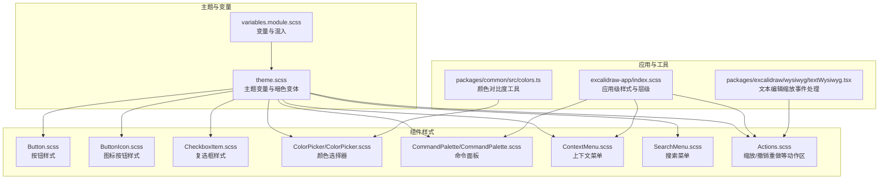
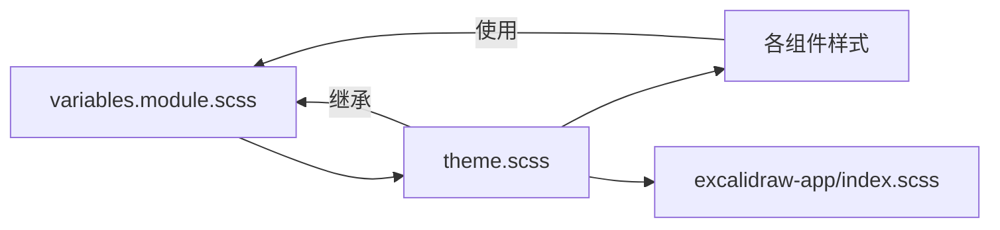
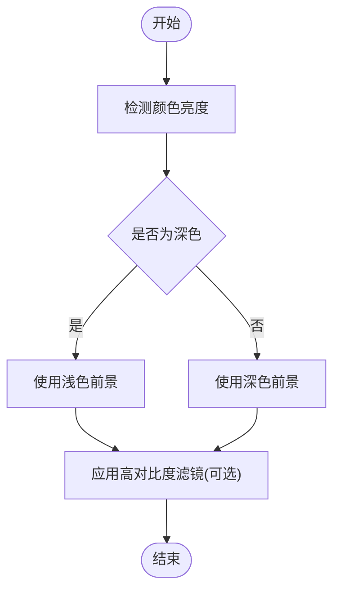
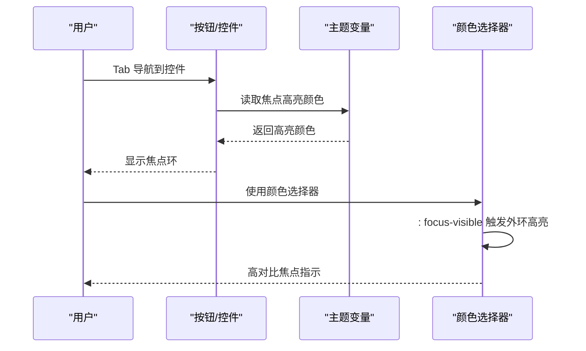
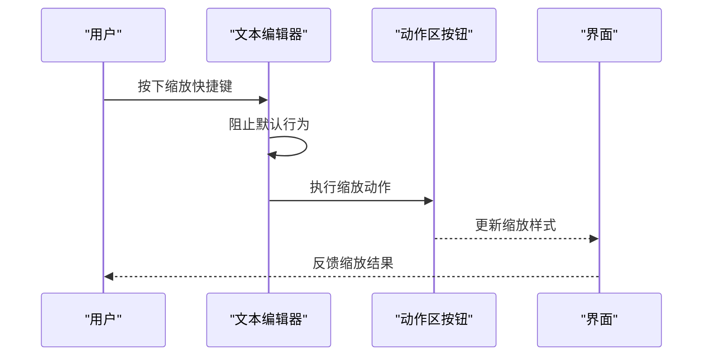
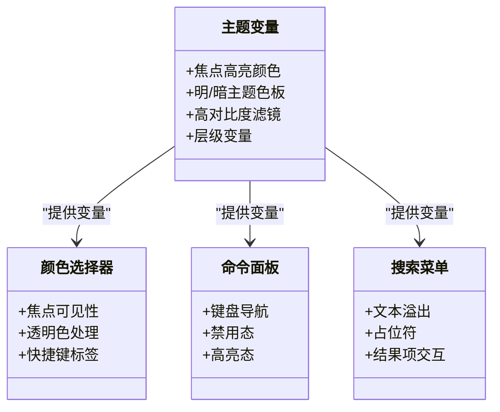
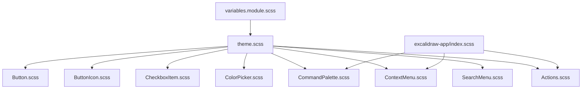

# 可访问性样式

<cite>
**本文引用的文件**
- [packages/excalidraw/css/variables.module.scss](file://packages/excalidraw/css/variables.module.scss)
- [packages/excalidraw/css/theme.scss](file://packages/excalidraw/css/theme.scss)
- [packages/excalidraw/components/Button.scss](file://packages/excalidraw/components/Button.scss)
- [packages/excalidraw/components/ButtonIcon.scss](file://packages/excalidraw/components/ButtonIcon.scss)
- [packages/excalidraw/components/CheckboxItem.scss](file://packages/excalidraw/components/CheckboxItem.scss)
- [packages/excalidraw/components/Actions.scss](file://packages/excalidraw/components/Actions.scss)
- [packages/excalidraw/components/ColorPicker/ColorPicker.scss](file://packages/excalidraw/components/ColorPicker/ColorPicker.scss)
- [packages/excalidraw/components/CommandPalette/CommandPalette.scss](file://packages/excalidraw/components/CommandPalette/CommandPalette.scss)
- [packages/excalidraw/components/ContextMenu.scss](file://packages/excalidraw/components/ContextMenu.scss)
- [packages/excalidraw/components/SearchMenu.scss](file://packages/excalidraw/components/SearchMenu.scss)
- [excalidraw-app/index.scss](file://excalidraw-app/index.scss)
- [packages/common/src/colors.ts](file://packages/common/src/colors.ts)
- [packages/excalidraw/wysiwyg/textWysiwyg.tsx](file://packages/excalidraw/wysiwyg/textWysiwyg.tsx)
</cite>

## 目录

1. [引言](#引言)
2. [项目结构](#项目结构)
3. [核心组件](#核心组件)
4. [架构总览](#架构总览)
5. [详细组件分析](#详细组件分析)
6. [依赖关系分析](#依赖关系分析)
7. [性能考量](#性能考量)
8. [故障排查指南](#故障排查指南)
9. [结论](#结论)
10. [附录](#附录)

## 引言

本文件聚焦于 Excalidraw 中的可访问性样式实现与最佳实践，系统阐述视觉可访问性的三大支柱：颜色对比度、焦点可见性与缩放支持；并覆盖高对比度模式、键盘导航样式、屏幕阅读器友好设计等主题。文档同时给出 WCAG 合规检查要点、可访问性审计流程与持续改进机制，并结合仓库中实际样式与变量定义进行说明。

## 项目结构

Excalidraw 的可访问性样式主要分布在以下位置：

- 主题与变量层：统一的颜色、尺寸、阴影、焦点高亮等变量定义
- 组件样式层：按钮、复选框、颜色选择器、命令面板、上下文菜单、搜索菜单等
- 应用级样式：页面容器、弹层、警示等通用布局与层级控制
- 工具与逻辑：颜色对比度计算辅助函数、文本编辑器缩放快捷键处理

**图表来源**

- [packages/excalidraw/css/variables.module.scss:1-233](file://packages/excalidraw/css/variables.module.scss#L1-L233)
- [packages/excalidraw/css/theme.scss:1-282](file://packages/excalidraw/css/theme.scss#L1-L282)
- [packages/excalidraw/components/Button.scss:1-8](file://packages/excalidraw/components/Button.scss#L1-L8)
- [packages/excalidraw/components/ButtonIcon.scss:1-13](file://packages/excalidraw/components/ButtonIcon.scss#L1-L13)
- [packages/excalidraw/components/CheckboxItem.scss:1-93](file://packages/excalidraw/components/CheckboxItem.scss#L1-L93)
- [packages/excalidraw/components/ColorPicker/ColorPicker.scss:1-497](file://packages/excalidraw/components/ColorPicker/ColorPicker.scss#L1-L497)
- [packages/excalidraw/components/CommandPalette/CommandPalette.scss:1-160](file://packages/excalidraw/components/CommandPalette/CommandPalette.scss#L1-L160)
- [packages/excalidraw/components/ContextMenu.scss:1-104](file://packages/excalidraw/components/ContextMenu.scss#L1-L104)
- [packages/excalidraw/components/SearchMenu.scss:1-141](file://packages/excalidraw/components/SearchMenu.scss#L1-L141)
- [excalidraw-app/index.scss:1-69](file://excalidraw-app/index.scss#L1-L69)
- [packages/common/src/colors.ts:304-355](file://packages/common/src/colors.ts#L304-L355)
- [packages/excalidraw/wysiwyg/textWysiwyg.tsx:777-810](file://packages/excalidraw/wysiwyg/textWysiwyg.tsx#L777-L810)

**章节来源**

- [packages/excalidraw/css/variables.module.scss:1-233](file://packages/excalidraw/css/variables.module.scss#L1-L233)
- [packages/excalidraw/css/theme.scss:1-282](file://packages/excalidraw/css/theme.scss#L1-L282)
- [packages/excalidraw/components/Button.scss:1-8](file://packages/excalidraw/components/Button.scss#L1-L8)
- [packages/excalidraw/components/ButtonIcon.scss:1-13](file://packages/excalidraw/components/ButtonIcon.scss#L1-L13)
- [packages/excalidraw/components/CheckboxItem.scss:1-93](file://packages/excalidraw/components/CheckboxItem.scss#L1-L93)
- [packages/excalidraw/components/ColorPicker/ColorPicker.scss:1-497](file://packages/excalidraw/components/ColorPicker/ColorPicker.scss#L1-L497)
- [packages/excalidraw/components/CommandPalette/CommandPalette.scss:1-160](file://packages/excalidraw/components/CommandPalette/CommandPalette.scss#L1-L160)
- [packages/excalidraw/components/ContextMenu.scss:1-104](file://packages/excalidraw/components/ContextMenu.scss#L1-L104)
- [packages/excalidraw/components/SearchMenu.scss:1-141](file://packages/excalidraw/components/SearchMenu.scss#L1-L141)
- [excalidraw-app/index.scss:1-69](file://excalidraw-app/index.scss#L1-L69)
- [packages/common/src/colors.ts:304-355](file://packages/common/src/colors.ts#L304-L355)
- [packages/excalidraw/wysiwyg/textWysiwyg.tsx:777-810](file://packages/excalidraw/wysiwyg/textWysiwyg.tsx#L777-L810)

## 核心组件

- 主题与变量：通过 CSS 自定义属性集中管理颜色、尺寸、阴影、焦点高亮等，支持明/暗主题切换与高对比度滤镜
- 按钮与图标按钮：统一的悬停/激活/选中/禁用状态样式，确保键盘可达与触控可达
- 复选框：明确的焦点环、悬停与选中态视觉反馈
- 颜色选择器：焦点可见性、主题滤镜适配、透明色与快捷键标签
- 命令面板与上下文菜单：键盘导航、高亮与禁用态、暗色模式文本对比
- 搜索菜单：结果项的焦点与交互态、占位符与文本溢出处理
- 应用级样式：层级控制、弹层定位、警示层样式
- 缩放与键盘：文本编辑器中的缩放快捷键处理，配合动作区按钮

**章节来源**

- [packages/excalidraw/css/theme.scss:17-17](file://packages/excalidraw/css/theme.scss#L17-L17)
- [packages/excalidraw/components/Button.scss:4-6](file://packages/excalidraw/components/Button.scss#L4-L6)
- [packages/excalidraw/components/CheckboxItem.scss:70-72](file://packages/excalidraw/components/CheckboxItem.scss#L70-L72)
- [packages/excalidraw/components/ColorPicker/ColorPicker.scss:121-140](file://packages/excalidraw/components/ColorPicker/ColorPicker.scss#L121-L140)
- [packages/excalidraw/components/CommandPalette/CommandPalette.scss:128-130](file://packages/excalidraw/components/CommandPalette/CommandPalette.scss#L128-L130)
- [packages/excalidraw/components/ContextMenu.scss:81-83](file://packages/excalidraw/components/ContextMenu.scss#L81-L83)
- [packages/excalidraw/components/SearchMenu.scss:101-139](file://packages/excalidraw/components/SearchMenu.scss#L101-L139)
- [excalidraw-app/index.scss:57-69](file://excalidraw-app/index.scss#L57-L69)
- [packages/excalidraw/wysiwyg/textWysiwyg.tsx:777-810](file://packages/excalidraw/wysiwyg/textWysiwyg.tsx#L777-L810)

## 架构总览

可访问性样式遵循“变量—主题—组件—应用”的分层架构：

- 变量层：定义颜色、尺寸、阴影、焦点高亮、主题滤镜等
- 主题层：在明/暗主题下重写关键变量，提供高对比度与反相滤镜支持
- 组件层：基于变量与混入实现一致的交互反馈（悬停、激活、选中、禁用）
- 应用层：控制层级、弹层与警示等全局样式

**图表来源**

- [packages/excalidraw/css/variables.module.scss:1-233](file://packages/excalidraw/css/variables.module.scss#L1-L233)
- [packages/excalidraw/css/theme.scss:1-282](file://packages/excalidraw/css/theme.scss#L1-L282)
- [excalidraw-app/index.scss:1-69](file://excalidraw-app/index.scss#L1-L69)

## 详细组件分析

### 颜色对比度与高对比度支持

- 对比度工具：提供颜色亮度判断与输入归一化，用于辅助对比度决策
- 主题变量：明/暗主题下分别设置前景/背景/强调色，保证文本与控件在不同背景下具备可读性
- 高对比度滤镜：通过主题变量启用反相与色相旋转，满足高对比度模式需求
- 透明色与边框：颜色选择器对透明色与边框采用特殊处理，避免视觉信息丢失

**图表来源**

- [packages/common/src/colors.ts:304-355](file://packages/common/src/colors.ts#L304-L355)
- [packages/excalidraw/css/theme.scss:186-280](file://packages/excalidraw/css/theme.scss#L186-L280)
- [packages/excalidraw/components/ColorPicker/ColorPicker.scss:148-176](file://packages/excalidraw/components/ColorPicker/ColorPicker.scss#L148-L176)

**章节来源**

- [packages/common/src/colors.ts:304-355](file://packages/common/src/colors.ts#L304-L355)
- [packages/excalidraw/css/theme.scss:179-280](file://packages/excalidraw/css/theme.scss#L179-L280)
- [packages/excalidraw/components/ColorPicker/ColorPicker.scss:148-176](file://packages/excalidraw/components/ColorPicker/ColorPicker.scss#L148-L176)

### 焦点可见性设计

- 统一焦点高亮：通过主题变量集中定义焦点高亮颜色，组件在`:focus-visible`或混入中使用
- 复选框焦点环：明确的焦点环与悬停态区分
- 颜色选择器焦点：在`:focus-visible`时绘制外环高亮，避免仅依赖颜色变化
- 上下文菜单与命令面板：键盘导航时的高亮与禁用态，确保键盘可达性

**图表来源**

- [packages/excalidraw/css/theme.scss:17-17](file://packages/excalidraw/css/theme.scss#L17-L17)
- [packages/excalidraw/components/CheckboxItem.scss:70-72](file://packages/excalidraw/components/CheckboxItem.scss#L70-L72)
- [packages/excalidraw/components/ColorPicker/ColorPicker.scss:121-140](file://packages/excalidraw/components/ColorPicker/ColorPicker.scss#L121-L140)
- [packages/excalidraw/components/ContextMenu.scss:81-83](file://packages/excalidraw/components/ContextMenu.scss#L81-L83)
- [packages/excalidraw/components/CommandPalette/CommandPalette.scss:128-130](file://packages/excalidraw/components/CommandPalette/CommandPalette.scss#L128-L130)

**章节来源**

- [packages/excalidraw/components/CheckboxItem.scss:70-72](file://packages/excalidraw/components/CheckboxItem.scss#L70-L72)
- [packages/excalidraw/components/ColorPicker/ColorPicker.scss:121-140](file://packages/excalidraw/components/ColorPicker/ColorPicker.scss#L121-L140)
- [packages/excalidraw/components/ContextMenu.scss:81-83](file://packages/excalidraw/components/ContextMenu.scss#L81-L83)
- [packages/excalidraw/components/CommandPalette/CommandPalette.scss:128-130](file://packages/excalidraw/components/CommandPalette/CommandPalette.scss#L128-L130)

### 缩放支持与键盘导航

- 文本编辑缩放：在文本编辑器中监听缩放快捷键，执行缩放动作并更新样式
- 动作区按钮：缩放/撤销重做等按钮采用统一尺寸与圆角，确保触控可达
- 键盘导航：命令面板与上下文菜单支持键盘选择、禁用态与高亮态

**图表来源**

- [packages/excalidraw/wysiwyg/textWysiwyg.tsx:777-810](file://packages/excalidraw/wysiwyg/textWysiwyg.tsx#L777-L810)
- [packages/excalidraw/components/Actions.scss:8-25](file://packages/excalidraw/components/Actions.scss#L8-L25)

**章节来源**

- [packages/excalidraw/wysiwyg/textWysiwyg.tsx:777-810](file://packages/excalidraw/wysiwyg/textWysiwyg.tsx#L777-L810)
- [packages/excalidraw/components/Actions.scss:8-25](file://packages/excalidraw/components/Actions.scss#L8-L25)

### 高对比度模式与屏幕阅读器友好设计

- 高对比度滤镜：主题变量中提供反相与色相旋转，满足高对比度模式
- 层级与弹层：应用级样式控制 z-index 与定位，避免遮挡焦点元素
- 文本溢出与占位符：搜索菜单对长文本进行省略与换行处理，提升可读性
- ARIA 状态与错误/成功反馈：组件通过类名与变量映射状态样式，便于扩展 ARIA 状态样式

**图表来源**

- [packages/excalidraw/css/theme.scss:17-17](file://packages/excalidraw/css/theme.scss#L17-L17)
- [packages/excalidraw/components/ColorPicker/ColorPicker.scss:1-497](file://packages/excalidraw/components/ColorPicker/ColorPicker.scss#L1-L497)
- [packages/excalidraw/components/CommandPalette/CommandPalette.scss:1-160](file://packages/excalidraw/components/CommandPalette/CommandPalette.scss#L1-L160)
- [packages/excalidraw/components/SearchMenu.scss:1-141](file://packages/excalidraw/components/SearchMenu.scss#L1-L141)
- [excalidraw-app/index.scss:1-69](file://excalidraw-app/index.scss#L1-L69)

**章节来源**

- [packages/excalidraw/css/theme.scss:179-280](file://packages/excalidraw/css/theme.scss#L179-L280)
- [excalidraw-app/index.scss:1-69](file://excalidraw-app/index.scss#L1-L69)
- [packages/excalidraw/components/SearchMenu.scss:120-127](file://packages/excalidraw/components/SearchMenu.scss#L120-L127)

## 依赖关系分析

- 变量与主题：所有组件样式依赖主题变量，确保一致性
- 暗色主题：通过`:root.theme--dark`重写关键变量，避免重复定义
- 组件混入：按钮与图标按钮复用统一的混入，减少重复样式
- 应用级样式：与组件样式共同作用于弹层、警示与层级控制

**图表来源**

- [packages/excalidraw/css/variables.module.scss:1-233](file://packages/excalidraw/css/variables.module.scss#L1-L233)
- [packages/excalidraw/css/theme.scss:1-282](file://packages/excalidraw/css/theme.scss#L1-L282)
- [packages/excalidraw/components/Button.scss:1-8](file://packages/excalidraw/components/Button.scss#L1-L8)
- [packages/excalidraw/components/ButtonIcon.scss:1-13](file://packages/excalidraw/components/ButtonIcon.scss#L1-L13)
- [packages/excalidraw/components/CheckboxItem.scss:1-93](file://packages/excalidraw/components/CheckboxItem.scss#L1-L93)
- [packages/excalidraw/components/ColorPicker/ColorPicker.scss:1-497](file://packages/excalidraw/components/ColorPicker/ColorPicker.scss#L1-L497)
- [packages/excalidraw/components/CommandPalette/CommandPalette.scss:1-160](file://packages/excalidraw/components/CommandPalette/CommandPalette.scss#L1-L160)
- [packages/excalidraw/components/ContextMenu.scss:1-104](file://packages/excalidraw/components/ContextMenu.scss#L1-L104)
- [packages/excalidraw/components/SearchMenu.scss:1-141](file://packages/excalidraw/components/SearchMenu.scss#L1-L141)
- [excalidraw-app/index.scss:1-69](file://excalidraw-app/index.scss#L1-L69)

**章节来源**

- [packages/excalidraw/css/theme.scss:179-280](file://packages/excalidraw/css/theme.scss#L179-L280)
- [packages/excalidraw/components/Button.scss:4-6](file://packages/excalidraw/components/Button.scss#L4-L6)
- [packages/excalidraw/components/ButtonIcon.scss:4-5](file://packages/excalidraw/components/ButtonIcon.scss#L4-L5)
- [excalidraw-app/index.scss:1-69](file://excalidraw-app/index.scss#L1-L69)

## 性能考量

- 变量集中：通过 CSS 自定义属性减少重复计算与重绘
- 滤镜与阴影：合理使用主题滤镜与阴影，避免过度渲染导致卡顿
- 选择器复杂度：保持选择器简洁，避免深层嵌套导致的匹配开销
- 动画与过渡：按钮与菜单的过渡应适度，避免影响键盘导航流畅性

## 故障排查指南

- 焦点可见性问题
  - 现象：键盘导航时无焦点环或高亮不明显
  - 排查：确认`:focus-visible`与主题变量是否正确应用；检查是否有覆盖样式
  - 参考路径：[packages/excalidraw/components/ColorPicker/ColorPicker.scss:121-140](file://packages/excalidraw/components/ColorPicker/ColorPicker.scss#L121-L140)，[packages/excalidraw/css/theme.scss:17-17](file://packages/excalidraw/css/theme.scss#L17-L17)
- 对比度不足
  - 现象：文本或控件在特定主题下难以辨识
  - 排查：核对明/暗主题下的颜色变量；必要时启用高对比度滤镜
  - 参考路径：[packages/excalidraw/css/theme.scss:179-280](file://packages/excalidraw/css/theme.scss#L179-L280)，[packages/common/src/colors.ts:304-355](file://packages/common/src/colors.ts#L304-L355)
- 缩放快捷键无效
  - 现象：按下缩放快捷键无响应
  - 排查：确认事件处理是否阻止默认行为并执行动作；检查动作区按钮样式是否影响点击区域
  - 参考路径：[packages/excalidraw/wysiwyg/textWysiwyg.tsx:777-810](file://packages/excalidraw/wysiwyg/textWysiwyg.tsx#L777-L810)，[packages/excalidraw/components/Actions.scss:8-25](file://packages/excalidraw/components/Actions.scss#L8-L25)
- 弹层遮挡焦点
  - 现象：弹层或警示遮挡当前焦点元素
  - 排查：检查 z-index 层级与定位；确保焦点元素在可视区域内
  - 参考路径：[excalidraw-app/index.scss:57-69](file://excalidraw-app/index.scss#L57-L69)

**章节来源**

- [packages/excalidraw/components/ColorPicker/ColorPicker.scss:121-140](file://packages/excalidraw/components/ColorPicker/ColorPicker.scss#L121-L140)
- [packages/excalidraw/css/theme.scss:17-17](file://packages/excalidraw/css/theme.scss#L17-L17)
- [packages/common/src/colors.ts:304-355](file://packages/common/src/colors.ts#L304-L355)
- [packages/excalidraw/wysiwyg/textWysiwyg.tsx:777-810](file://packages/excalidraw/wysiwyg/textWysiwyg.tsx#L777-L810)
- [packages/excalidraw/components/Actions.scss:8-25](file://packages/excalidraw/components/Actions.scss#L8-L25)
- [excalidraw-app/index.scss:57-69](file://excalidraw-app/index.scss#L57-L69)

## 结论

Excalidraw 的可访问性样式以变量与主题为核心，贯穿组件与应用层，形成统一且可维护的视觉体系。通过焦点高亮、对比度保障、高对比度滤镜与键盘导航支持，有效提升了各类用户的使用体验。建议在后续迭代中持续进行 WCAG 合规检查与可访问性审计，确保新功能与变更符合无障碍标准。

## 附录

- WCAG 合规性检查要点
  - 对比度：文本与背景对比度至少满足 AA 级别；图标与非文本元素满足 AA
  - 焦点可见性：键盘可达元素必须有清晰可见的焦点环
  - 高对比度模式：支持系统高对比度与 CSS 滤镜
  - 键盘导航：所有功能可通过键盘完成，支持 Tab 顺序与快捷键
  - 屏幕阅读器友好：语义化标签与 ARIA 属性（如需要）配合样式保持可读性
- 可访问性审计与持续改进
  - 自动化测试：使用可访问性扫描工具定期扫描关键页面与组件
  - 手动测试：模拟键盘与屏幕阅读器操作，验证焦点流与语义
  - 团队规范：建立变更审查清单，包含可访问性检查项
  - 用户反馈：收集残障用户反馈，持续优化交互与视觉设计
