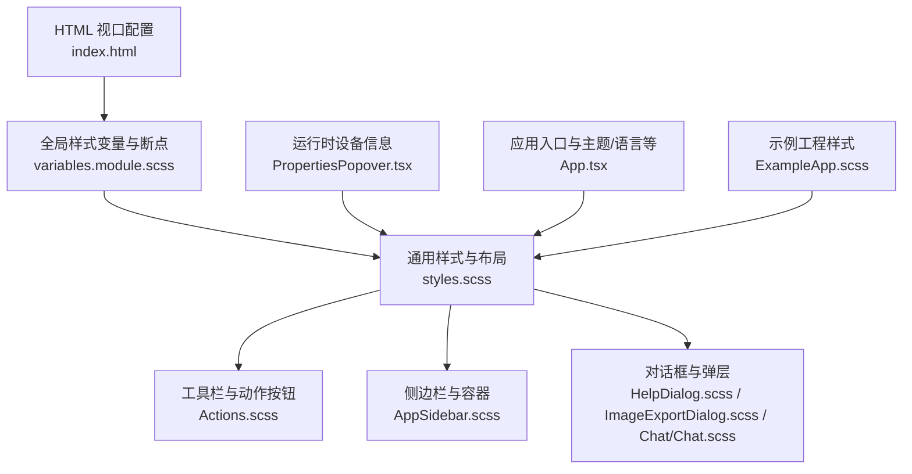
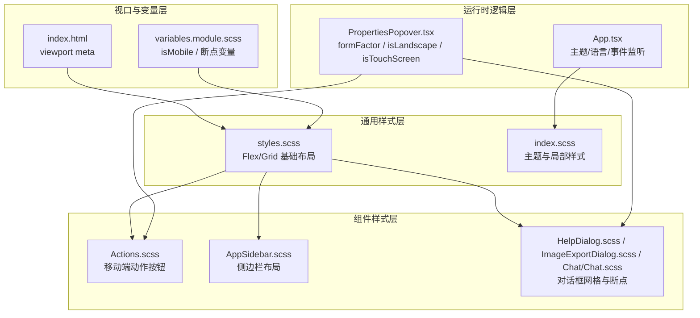
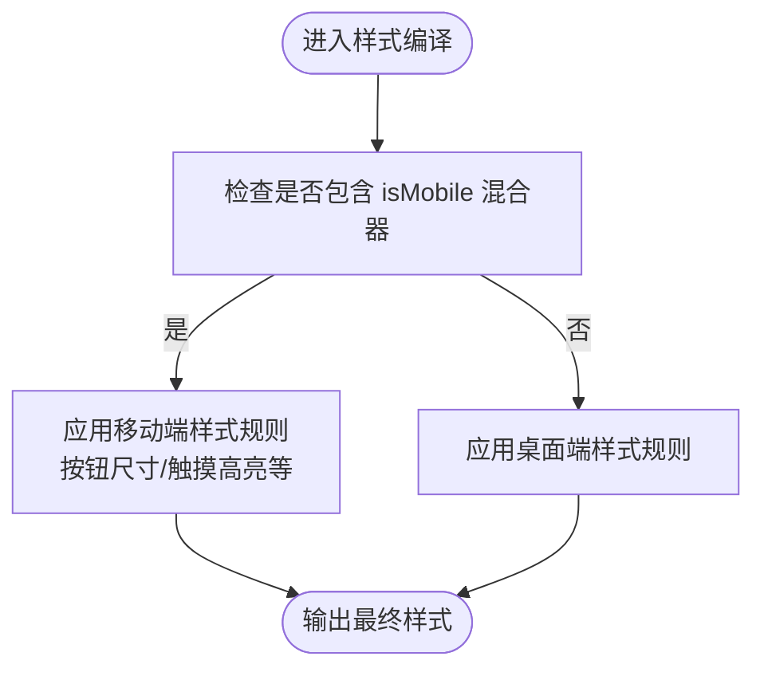
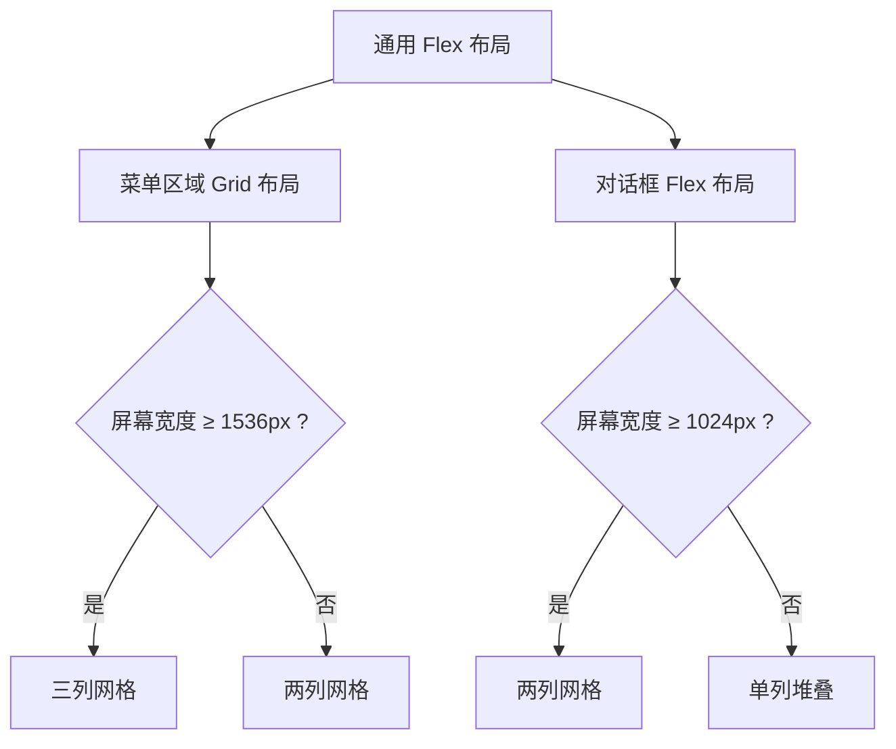
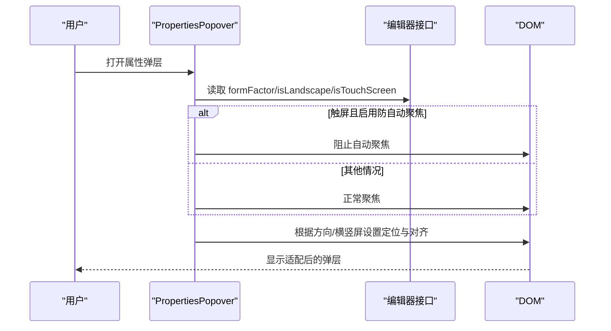
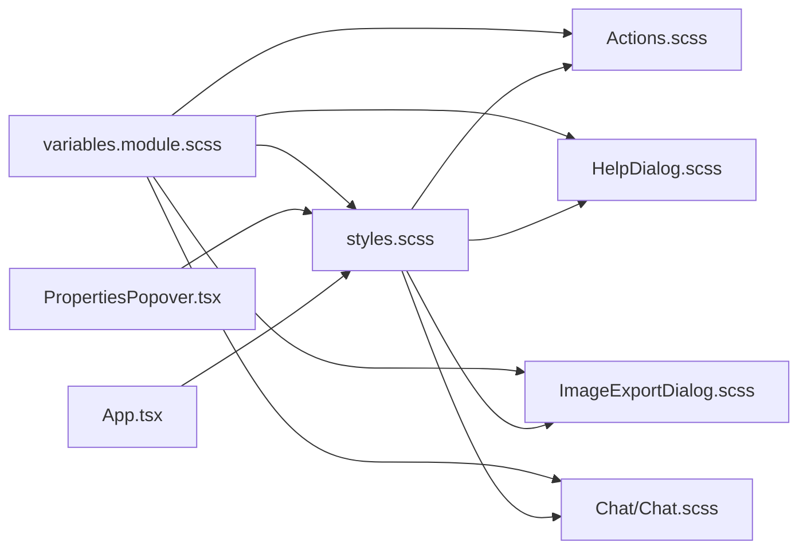

# 响应式设计

<cite>
**本文引用的文件**
- [excalidraw-app/index.html](file://excalidraw-app/index.html)
- [excalidraw-app/index.scss](file://excalidraw-app/index.scss)
- [excalidraw-app/App.tsx](file://excalidraw-app/App.tsx)
- [excalidraw-app/components/AppSidebar.scss](file://excalidraw-app/components/AppSidebar.scss)
- [packages/excalidraw/css/variables.module.scss](file://packages/excalidraw/css/variables.module.scss)
- [packages/excalidraw/css/styles.scss](file://packages/excalidraw/css/styles.scss)
- [packages/excalidraw/components/Actions.scss](file://packages/excalidraw/components/Actions.scss)
- [packages/excalidraw/components/PropertiesPopover.tsx](file://packages/excalidraw/components/PropertiesPopover.tsx)
- [packages/excalidraw/components/HelpDialog.scss](file://packages/excalidraw/components/HelpDialog.scss)
- [packages/excalidraw/components/ImageExportDialog.scss](file://packages/excalidraw/components/ImageExportDialog.scss)
- [packages/excalidraw/components/TTDDialog/Chat/Chat.scss](file://packages/excalidraw/components/TTDDialog/Chat/Chat.scss)
- [examples/with-script-in-browser/components/ExampleApp.scss](file://examples/with-script-in-browser/components/ExampleApp.scss)
</cite>

## 目录

1. [简介](#简介)
2. [项目结构](#项目结构)
3. [核心组件](#核心组件)
4. [架构总览](#架构总览)
5. [详细组件分析](#详细组件分析)
6. [依赖关系分析](#依赖关系分析)
7. [性能考量](#性能考量)
8. [故障排查指南](#故障排查指南)
9. [结论](#结论)
10. [附录](#附录)

## 简介

本技术文档聚焦于 Excalidraw 的响应式设计体系，系统阐述其断点与布局适配策略、移动端优化方案、CSS 媒体查询模式、弹性布局与网格系统适配、触摸交互与手势支持、以及可定制化指南（断点调整、移动端体验优化、平板适配）。同时覆盖性能优化、渲染一致性与无障碍响应式设计及渐进增强策略。

## 项目结构

Excalidraw 的响应式实现主要分布在以下层次：

- 视口与基础样式：通过 HTML meta viewport 与全局 SCSS 变量定义统一的断点与布局基线。
- 组件级样式：在各功能模块的 SCSS 中使用媒体查询与变量，实现细粒度的响应式行为。
- 运行时逻辑：通过编辑器接口提供的设备形态信息（如 formFactor、isLandscape、isTouchScreen）进行条件渲染与交互优化。
- 示例与集成：示例工程展示了如何在宿主页面中嵌入与适配。

图表来源

- [excalidraw-app/index.html:6-8](file://excalidraw-app/index.html#L6-L8)
- [packages/excalidraw/css/variables.module.scss:26-30](file://packages/excalidraw/css/variables.module.scss#L26-L30)
- [packages/excalidraw/css/styles.scss:38-146](file://packages/excalidraw/css/styles.scss#L38-L146)
- [packages/excalidraw/components/Actions.scss:111-178](file://packages/excalidraw/components/Actions.scss#L111-L178)
- [excalidraw-app/components/AppSidebar.scss:1-37](file://excalidraw-app/components/AppSidebar.scss#L1-L37)
- [packages/excalidraw/components/HelpDialog.scss:62-81](file://packages/excalidraw/components/HelpDialog.scss#L62-L81)
- [packages/excalidraw/components/ImageExportDialog.scss:167-172](file://packages/excalidraw/components/ImageExportDialog.scss#L167-L172)
- [packages/excalidraw/components/TTDDialog/Chat/Chat.scss:74-114](file://packages/excalidraw/components/TTDDialog/Chat/Chat.scss#L74-L114)
- [packages/excalidraw/components/PropertiesPopover.tsx:42-61](file://packages/excalidraw/components/PropertiesPopover.tsx#L42-L61)
- [examples/with-script-in-browser/components/ExampleApp.scss:41-92](file://examples/with-script-in-browser/components/ExampleApp.scss#L41-L92)

章节来源

- [excalidraw-app/index.html:6-8](file://excalidraw-app/index.html#L6-L8)
- [packages/excalidraw/css/variables.module.scss:26-30](file://packages/excalidraw/css/variables.module.scss#L26-L30)
- [packages/excalidraw/css/styles.scss:38-146](file://packages/excalidraw/css/styles.scss#L38-L146)

## 核心组件

- 视口与安全区域：通过 meta viewport 控制初始缩放与最大缩放，并利用 CSS env(safe-area-inset-\*) 处理刘海屏与圆角。
- 断点与混合器：在变量模块中定义 isMobile 混合器与垂直断点变量，供各组件按需使用。
- 弹性布局与网格：在通用样式中采用 Flex/Grid 实现自适应布局，并在特定组件中使用媒体查询细化行为。
- 移动端交互：通过编辑器接口的 formFactor、isLandscape、isTouchScreen 等状态控制弹层定位、自动聚焦与 UI 布局。

章节来源

- [excalidraw-app/index.html:6-8](file://excalidraw-app/index.html#L6-L8)
- [packages/excalidraw/css/variables.module.scss:26-30](file://packages/excalidraw/css/variables.module.scss#L26-L30)
- [packages/excalidraw/css/styles.scss:38-146](file://packages/excalidraw/css/styles.scss#L38-L146)
- [packages/excalidraw/components/PropertiesPopover.tsx:42-61](file://packages/excalidraw/components/PropertiesPopover.tsx#L42-L61)

## 架构总览

Excalidraw 的响应式架构由“视口与变量层”“通用样式层”“组件样式层”“运行时逻辑层”四部分协同构成。变量层提供断点与移动端混合器；通用样式层定义基础布局与栅格；组件样式层细化到对话框、工具栏、侧边栏等；运行时逻辑层根据设备形态动态调整 UI 行为。

图表来源

- [excalidraw-app/index.html:6-8](file://excalidraw-app/index.html#L6-L8)
- [packages/excalidraw/css/variables.module.scss:26-30](file://packages/excalidraw/css/variables.module.scss#L26-L30)
- [packages/excalidraw/css/styles.scss:38-146](file://packages/excalidraw/css/styles.scss#L38-L146)
- [excalidraw-app/index.scss:1-131](file://excalidraw-app/index.scss#L1-L131)
- [packages/excalidraw/components/Actions.scss:111-178](file://packages/excalidraw/components/Actions.scss#L111-L178)
- [excalidraw-app/components/AppSidebar.scss:1-37](file://excalidraw-app/components/AppSidebar.scss#L1-L37)
- [packages/excalidraw/components/HelpDialog.scss:62-81](file://packages/excalidraw/components/HelpDialog.scss#L62-L81)
- [packages/excalidraw/components/ImageExportDialog.scss:167-172](file://packages/excalidraw/components/ImageExportDialog.scss#L167-L172)
- [packages/excalidraw/components/TTDDialog/Chat/Chat.scss:74-114](file://packages/excalidraw/components/TTDDialog/Chat/Chat.scss#L74-L114)
- [packages/excalidraw/components/PropertiesPopover.tsx:42-61](file://packages/excalidraw/components/PropertiesPopover.tsx#L42-L61)
- [excalidraw-app/App.tsx:1-120](file://excalidraw-app/App.tsx#L1-L120)

## 详细组件分析

### 视口与安全区域（viewport 与 safe-area）

- 视口控制：通过 meta viewport 设置 width=device-width、initial-scale=1、maximum-scale=1、user-scalable=no、viewport-fit=cover、shrink-to-fit=no，确保在移动设备上以设备宽度为基准，避免双指缩放带来的布局抖动。
- 安全区域：在根节点声明 env(safe-area-inset-\*) 变量，组件通过 .FixedSideContainer 使用这些变量处理刘海与圆角区域的内边距。

章节来源

- [excalidraw-app/index.html:6-8](file://excalidraw-app/index.html#L6-L8)
- [packages/excalidraw/css/styles.scss:26-30](file://packages/excalidraw/css/styles.scss#L26-L30)
- [packages/excalidraw/css/styles.scss:141-146](file://packages/excalidraw/css/styles.scss#L141-L146)

### 断点与移动端混合器

- isMobile 混合器：在变量模块中定义 @mixin isMobile()，用于在移动端场景下对按钮尺寸、触摸高亮等进行统一适配。
- 垂直断点：在聊天对话框等组件中使用 $verticalBreakpoint 变量配合 @media screen and (max-width: $verticalBreakpoint)，实现窄屏下的最小高度与内边距调整。
- 移动端按钮尺寸：在 Actions.scss 中针对移动端动作按钮使用 --mobile-action-button-size 变量，确保触摸目标尺寸充足。

图表来源

- [packages/excalidraw/css/variables.module.scss:26-30](file://packages/excalidraw/css/variables.module.scss#L26-L30)
- [packages/excalidraw/components/Actions.scss:111-178](file://packages/excalidraw/components/Actions.scss#L111-L178)
- [packages/excalidraw/components/TTDDialog/Chat/Chat.scss:74-114](file://packages/excalidraw/components/TTDDialog/Chat/Chat.scss#L74-L114)

章节来源

- [packages/excalidraw/css/variables.module.scss:26-30](file://packages/excalidraw/css/variables.module.scss#L26-L30)
- [packages/excalidraw/components/TTDDialog/Chat/Chat.scss:74-114](file://packages/excalidraw/components/TTDDialog/Chat/Chat.scss#L74-L114)
- [packages/excalidraw/components/Actions.scss:111-178](file://packages/excalidraw/components/Actions.scss#L111-L178)

### 弹性布局与网格系统适配

- Flex 布局：在 styles.scss 中大量使用 display: flex、flex-direction、justify-content、align-items 等属性构建自适应面板与工具条。
- Grid 布局：在 styles.scss 的菜单区域使用 CSS Grid（grid-template-columns、grid-gap），并在大屏（≥1536px）时扩展为三列布局。
- 对话框网格：HelpDialog.scss 在 ≥1024px 时使用两列网格布局，提升信息密度与可读性。

图表来源

- [packages/excalidraw/css/styles.scss:352-367](file://packages/excalidraw/css/styles.scss#L352-L367)
- [packages/excalidraw/css/styles.scss:385-413](file://packages/excalidraw/css/styles.scss#L385-L413)
- [packages/excalidraw/components/HelpDialog.scss:62-81](file://packages/excalidraw/components/HelpDialog.scss#L62-L81)

章节来源

- [packages/excalidraw/css/styles.scss:352-367](file://packages/excalidraw/css/styles.scss#L352-L367)
- [packages/excalidraw/css/styles.scss:385-413](file://packages/excalidraw/css/styles.scss#L385-L413)
- [packages/excalidraw/components/HelpDialog.scss:62-81](file://packages/excalidraw/components/HelpDialog.scss#L62-L81)

### 移动端优化与交互策略

- 自动聚焦控制：在 PropertiesPopover.tsx 中，当检测到 isTouchScreen 且启用 preventAutoFocusOnTouch 时，阻止打开弹层时的自动聚焦，避免键盘弹出导致的布局抖动。
- 弹层定位：根据 formFactor 与 isLandscape 决定弹层方向与对齐方式（竖屏用底部弹层，横屏用右侧弹层），并设置边距与偏移以适配小屏。
- 触摸高亮与选择禁用：通过变量模块中的 buttonNoHighlight 混合器禁用触摸高亮与文本选择，提升触控体验。
- Canvas 触控：在 styles.scss 中为 canvas 设置 touch-action: none，并通过 image-rendering 优化像素画质清晰度。

图表来源

- [packages/excalidraw/components/PropertiesPopover.tsx:42-85](file://packages/excalidraw/components/PropertiesPopover.tsx#L42-L85)
- [packages/excalidraw/css/variables.module.scss:155-159](file://packages/excalidraw/css/variables.module.scss#L155-L159)
- [packages/excalidraw/css/styles.scss:96-117](file://packages/excalidraw/css/styles.scss#L96-L117)

章节来源

- [packages/excalidraw/components/PropertiesPopover.tsx:42-85](file://packages/excalidraw/components/PropertiesPopover.tsx#L42-L85)
- [packages/excalidraw/css/variables.module.scss:155-159](file://packages/excalidraw/css/variables.module.scss#L155-L159)
- [packages/excalidraw/css/styles.scss:96-117](file://packages/excalidraw/css/styles.scss#L96-L117)

### 不同设备尺寸下的 UI 适配

- 小屏（手机竖屏）：通过 isMobile 混合器与 --mobile-action-button-size 调整按钮尺寸；弹层使用底部定位；对话框内输入区在窄屏下减少内边距。
- 中屏（平板）：根据 formFactor 与 canFitSidebar 条件调整主内容区宽度，避免侧边栏遮挡；在横屏时优先使用右侧工具栏。
- 大屏（桌面）：菜单区域扩展为三列网格，对话框采用两列布局，提升信息密度。

章节来源

- [packages/excalidraw/css/variables.module.scss:26-30](file://packages/excalidraw/css/variables.module.scss#L26-L30)
- [packages/excalidraw/components/Actions.scss:111-178](file://packages/excalidraw/components/Actions.scss#L111-L178)
- [packages/excalidraw/css/styles.scss:352-367](file://packages/excalidraw/css/styles.scss#L352-L367)
- [packages/excalidraw/components/HelpDialog.scss:62-81](file://packages/excalidraw/components/HelpDialog.scss#L62-L81)
- [packages/excalidraw/components/PropertiesPopover.tsx:42-61](file://packages/excalidraw/components/PropertiesPopover.tsx#L42-L61)

### 媒体查询使用模式与网格适配

- 垂直断点：在 Chat/Chat.scss 中使用 $verticalBreakpoint 限制窄屏下的最小高度与内边距，保证输入区可用性。
- 宽度断点：在 HelpDialog.scss 中使用 ≥1024px 的断点切换两列网格；在 styles.scss 中使用 ≥1536px 的断点扩展菜单网格为三列。
- 组件内断点：ImageExportDialog.scss 在移动端使用 @include isMobile 为按钮区添加顶部内边距与居中对齐，提升触摸可达性。

章节来源

- [packages/excalidraw/components/TTDDialog/Chat/Chat.scss:74-114](file://packages/excalidraw/components/TTDDialog/Chat/Chat.scss#L74-L114)
- [packages/excalidraw/components/HelpDialog.scss:62-81](file://packages/excalidraw/components/HelpDialog.scss#L62-L81)
- [packages/excalidraw/css/styles.scss:352-367](file://packages/excalidraw/css/styles.scss#L352-L367)
- [packages/excalidraw/components/ImageExportDialog.scss:167-172](file://packages/excalidraw/components/ImageExportDialog.scss#L167-L172)

### 响应式定制指南

- 调整断点：在 variables.module.scss 中修改 $verticalBreakpoint 或新增自定义断点变量，并在相关组件中引入使用。
- 优化移动端体验：通过 isMobile 混合器统一移动端按钮尺寸与触摸高亮；在弹层组件中结合 isTouchScreen 与 formFactor 控制自动聚焦与定位。
- 平板适配：在运行时逻辑中根据 editorInterface.formFactor 与 editorInterface.canFitSidebar 动态计算主内容区宽度，避免侧边栏遮挡。
- 保持一致性：统一使用 SCSS 变量（如 --mobile-action-button-size、env(safe-area-inset-\*)）与混合器（isMobile），确保多组件间风格一致。

章节来源

- [packages/excalidraw/css/variables.module.scss:26-30](file://packages/excalidraw/css/variables.module.scss#L26-L30)
- [packages/excalidraw/components/Actions.scss:111-178](file://packages/excalidraw/components/Actions.scss#L111-L178)
- [packages/excalidraw/components/PropertiesPopover.tsx:42-61](file://packages/excalidraw/components/PropertiesPopover.tsx#L42-L61)
- [packages/excalidraw/css/styles.scss:26-30](file://packages/excalidraw/css/styles.scss#L26-L30)

## 依赖关系分析

- 变量模块被所有组件样式依赖，提供断点与混合器能力。
- 通用样式依赖变量模块，为组件样式提供基础布局与栅格。
- 组件样式在各自文件内使用媒体查询细化行为，同时共享变量模块中的断点与混合器。
- 运行时逻辑通过编辑器接口读取设备形态信息，驱动 UI 的条件渲染与交互优化。

图表来源

- [packages/excalidraw/css/variables.module.scss:26-30](file://packages/excalidraw/css/variables.module.scss#L26-L30)
- [packages/excalidraw/css/styles.scss:38-146](file://packages/excalidraw/css/styles.scss#L38-L146)
- [packages/excalidraw/components/Actions.scss:111-178](file://packages/excalidraw/components/Actions.scss#L111-L178)
- [packages/excalidraw/components/HelpDialog.scss:62-81](file://packages/excalidraw/components/HelpDialog.scss#L62-L81)
- [packages/excalidraw/components/ImageExportDialog.scss:167-172](file://packages/excalidraw/components/ImageExportDialog.scss#L167-L172)
- [packages/excalidraw/components/TTDDialog/Chat/Chat.scss:74-114](file://packages/excalidraw/components/TTDDialog/Chat/Chat.scss#L74-L114)
- [packages/excalidraw/components/PropertiesPopover.tsx:42-61](file://packages/excalidraw/components/PropertiesPopover.tsx#L42-L61)
- [excalidraw-app/App.tsx:1-120](file://excalidraw-app/App.tsx#L1-L120)

章节来源

- [packages/excalidraw/css/variables.module.scss:26-30](file://packages/excalidraw/css/variables.module.scss#L26-L30)
- [packages/excalidraw/css/styles.scss:38-146](file://packages/excalidraw/css/styles.scss#L38-L146)
- [packages/excalidraw/components/PropertiesPopover.tsx:42-61](file://packages/excalidraw/components/PropertiesPopover.tsx#L42-L61)

## 性能考量

- 渲染节流：在 App.tsx 中设置 EXCALIDRAW_THROTTLE_RENDER = true，降低渲染频率，提升低端设备性能。
- 设备像素比优化：在 styles.scss 中为 canvas 设置 image-rendering 以改善像素画质清晰度，避免过度模糊或锐利导致的视觉疲劳。
- 事件与存储同步：在 App.tsx 中对可见性变化、焦点变化与卸载事件进行去抖与及时保存，减少不必要的重绘与回流。
- 触控优化：通过 touch-action: none 与禁用触摸高亮，减少触控过程中的额外绘制与闪烁。

章节来源

- [excalidraw-app/App.tsx:155-155](file://excalidraw-app/App.tsx#L155-L155)
- [packages/excalidraw/css/styles.scss:96-117](file://packages/excalidraw/css/styles.scss#L96-L117)
- [excalidraw-app/App.tsx:560-617](file://excalidraw-app/App.tsx#L560-L617)
- [packages/excalidraw/css/variables.module.scss:155-159](file://packages/excalidraw/css/variables.module.scss#L155-L159)

## 故障排查指南

- 键盘弹出导致布局异常：检查 PropertiesPopover.tsx 中的 preventAutoFocusOnTouch 逻辑，确认在触屏设备上已阻止自动聚焦。
- 窄屏下按钮不可点：确认是否正确引入 isMobile 混合器与 --mobile-action-button-size 变量，确保移动端按钮尺寸符合触摸目标要求。
- 对话框在小屏下显示不完整：检查 Chat/Chat.scss 与 ImageExportDialog.scss 中的 $verticalBreakpoint 与 @include isMobile 使用，确保内边距与最小高度适配。
- 安全区域遮挡内容：确认 styles.scss 中 env(safe-area-inset-\*) 的使用与 .FixedSideContainer 的内边距设置。

章节来源

- [packages/excalidraw/components/PropertiesPopover.tsx:42-85](file://packages/excalidraw/components/PropertiesPopover.tsx#L42-L85)
- [packages/excalidraw/components/Actions.scss:111-178](file://packages/excalidraw/components/Actions.scss#L111-L178)
- [packages/excalidraw/components/TTDDialog/Chat/Chat.scss:74-114](file://packages/excalidraw/components/TTDDialog/Chat/Chat.scss#L74-L114)
- [packages/excalidraw/components/ImageExportDialog.scss:167-172](file://packages/excalidraw/components/ImageExportDialog.scss#L167-L172)
- [packages/excalidraw/css/styles.scss:26-30](file://packages/excalidraw/css/styles.scss#L26-L30)

## 结论

Excalidraw 的响应式设计以“变量断点 + 通用布局 + 组件细化 + 运行时适配”为核心路径，通过视口与安全区域、SCSS 混合器与媒体查询、运行时设备形态判断，实现了从手机到桌面的全链路适配。配合渲染节流与触控优化，既保证了性能，也提升了跨设备的一致性与可用性。建议在定制时遵循统一变量与混合器规范，确保样式一致性与可维护性。

## 附录

- 示例工程样式：示例工程中的 ExampleApp.scss 展示了如何在宿主页面中嵌入 Excalidraw 并进行基础样式覆盖，便于理解外部集成的响应式适配思路。

章节来源

- [examples/with-script-in-browser/components/ExampleApp.scss:41-92](file://examples/with-script-in-browser/components/ExampleApp.scss#L41-L92)
