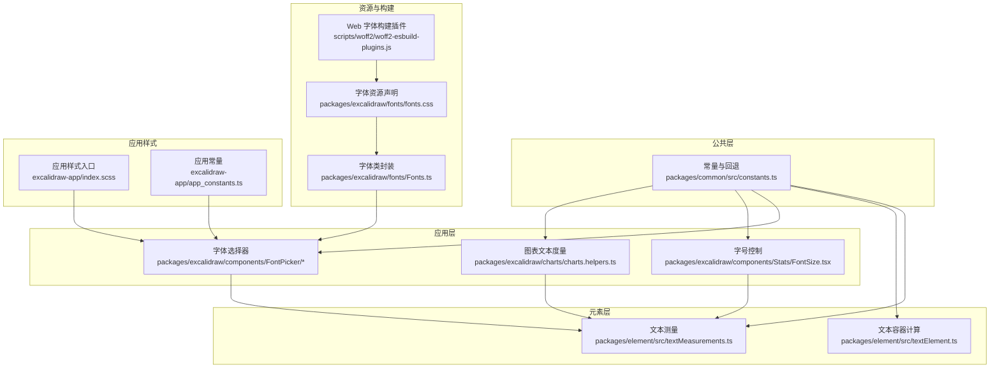
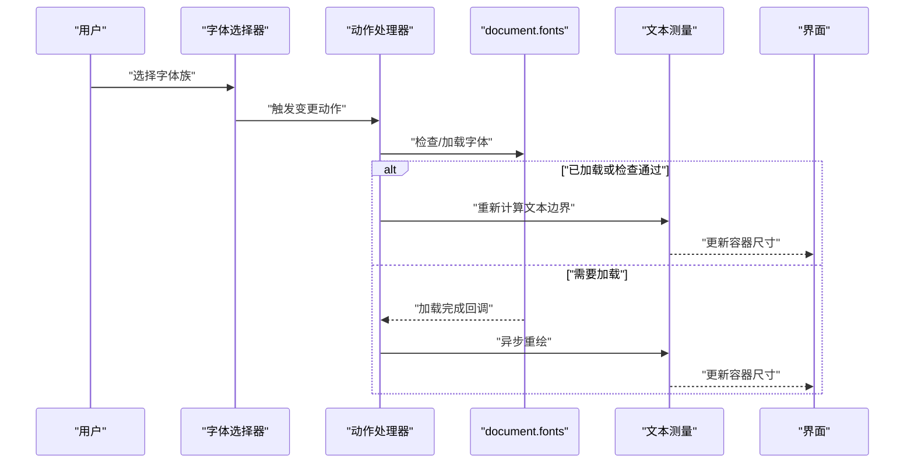
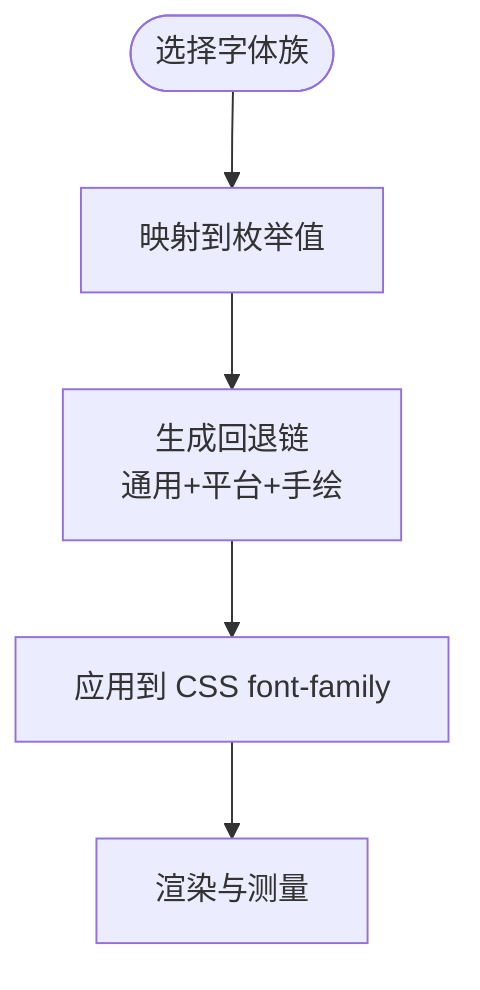
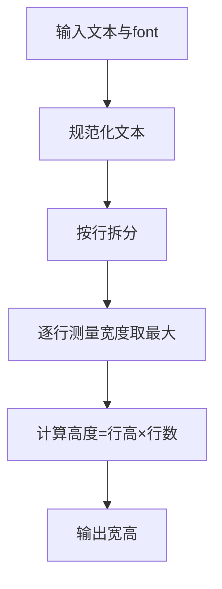
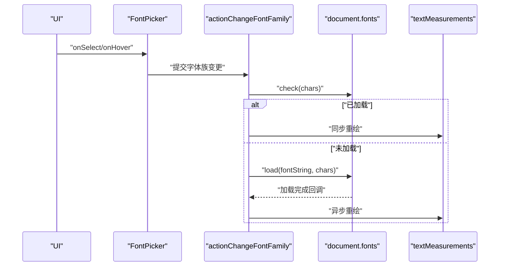
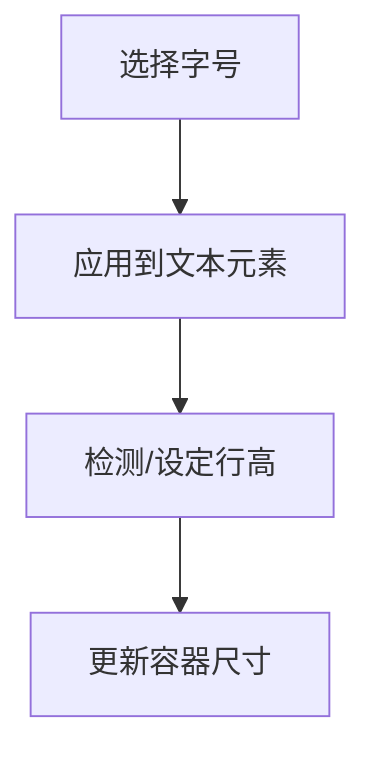
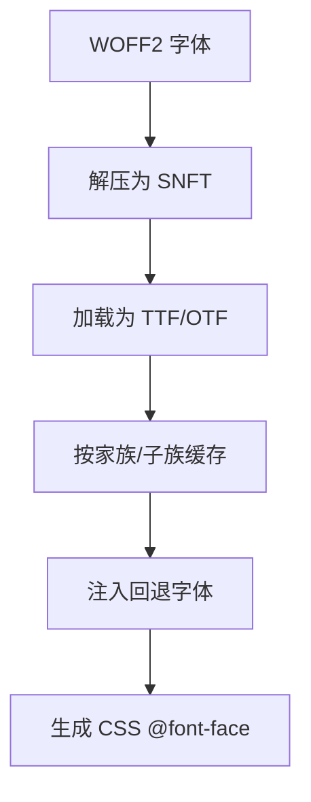
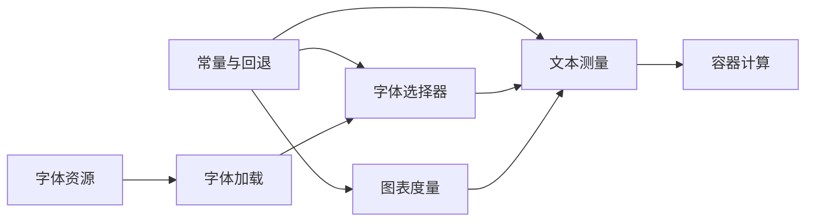

# 字体管理

<cite>
**本文引用的文件**
- [packages/common/src/constants.ts](file://packages/common/src/constants.ts)
- [packages/element/src/textMeasurements.ts](file://packages/element/src/textMeasurements.ts)
- [packages/element/src/textElement.ts](file://packages/element/src/textElement.ts)
- [packages/element/tests/textElement.test.ts](file://packages/element/tests/textElement.test.ts)
- [packages/element/tests/textWrapping.test.ts](file://packages/element/tests/textWrapping.test.ts)
- [packages/excalidraw/actions/actionProperties.tsx](file://packages/excalidraw/actions/actionProperties.tsx)
- [packages/excalidraw/components/FontPicker/FontPicker.tsx](file://packages/excalidraw/components/FontPicker/FontPicker.tsx)
- [packages/excalidraw/components/FontPicker/FontPicker.scss](file://packages/excalidraw/components/FontPicker/FontPicker.scss)
- [packages/excalidraw/components/Stats/FontSize.tsx](file://packages/excalidraw/components/Stats/FontSize.tsx)
- [packages/excalidraw/charts/charts.helpers.ts](file://packages/excalidraw/charts/charts.helpers.ts)
- [packages/excalidraw/data/restore.ts](file://packages/excalidraw/data/restore.ts)
- [packages/excalidraw/fonts/fonts.css](file://packages/excalidraw/fonts/fonts.css)
- [packages/excalidraw/fonts/Fonts.ts](file://packages/excalidraw/fonts/Fonts.ts)
- [scripts/woff2/woff2-esbuild-plugins.js](file://scripts/woff2/woff2-esbuild-plugins.js)
- [excalidraw-app/index.scss](file://excalidraw-app/index.scss)
- [excalidraw-app/app_constants.ts](file://excalidraw-app/app_constants.ts)
</cite>

## 目录

1. [简介](#简介)
2. [项目结构](#项目结构)
3. [核心组件](#核心组件)
4. [架构总览](#架构总览)
5. [详细组件分析](#详细组件分析)
6. [依赖关系分析](#依赖关系分析)
7. [性能考量](#性能考量)
8. [故障排查指南](#故障排查指南)
9. [结论](#结论)
10. [附录](#附录)

## 简介

本文件系统化梳理 Excalidraw 的字体管理与排版体系，覆盖以下关键主题：

- 字体系统设计：字体变量定义、字体族选择、字体加载策略
- 排版系统：字号层级、行高设置、字重变化、字体间距规则
- 字体回退与跨平台兼容：通用字体族回退、Emoji 回退、平台差异处理
- 字体定制：替换默认字体、添加自定义字体、主题切换
- 性能优化：字体加载、测量与渲染优化
- 移动端适配、可读性设计与国际化支持

## 项目结构

围绕字体与排版的关键目录与文件：

- 字体常量与回退：packages/common/src/constants.ts
- 文本测量与容器计算：packages/element/src/textMeasurements.ts、textElement.ts
- 字体选择器与样式：packages/excalidraw/components/FontPicker/\*
- 字号控制与统计面板：packages/excalidraw/components/Stats/FontSize.tsx
- 图表文本度量：packages/excalidraw/charts/charts.helpers.ts
- 字体资源与加载：packages/excalidraw/fonts/\*
- Web 字体构建与回退：scripts/woff2/woff2-esbuild-plugins.js
- 应用级样式与常量：excalidraw-app/index.scss、app_constants.ts

**图示来源**

- [packages/common/src/constants.ts:112-187](file://packages/common/src/constants.ts#L112-L187)
- [packages/element/src/textMeasurements.ts:12-208](file://packages/element/src/textMeasurements.ts#L12-L208)
- [packages/excalidraw/components/FontPicker/FontPicker.tsx:23-52](file://packages/excalidraw/components/FontPicker/FontPicker.tsx#L23-L52)
- [packages/excalidraw/components/Stats/FontSize.tsx:80-105](file://packages/excalidraw/components/Stats/FontSize.tsx#L80-L105)
- [packages/excalidraw/charts/charts.helpers.ts:378-413](file://packages/excalidraw/charts/charts.helpers.ts#L378-L413)
- [packages/excalidraw/fonts/fonts.css:1-36](file://packages/excalidraw/fonts/fonts.css#L1-L36)
- [packages/excalidraw/fonts/Fonts.ts](file://packages/excalidraw/fonts/Fonts.ts)
- [scripts/woff2/woff2-esbuild-plugins.js:35-120](file://scripts/woff2/woff2-esbuild-plugins.js#L35-L120)
- [excalidraw-app/index.scss](file://excalidraw-app/index.scss)
- [excalidraw-app/app_constants.ts](file://excalidraw-app/app_constants.ts)

**章节来源**

- [packages/common/src/constants.ts:112-187](file://packages/common/src/constants.ts#L112-L187)
- [packages/element/src/textMeasurements.ts:12-208](file://packages/element/src/textMeasurements.ts#L12-L208)
- [packages/excalidraw/components/FontPicker/FontPicker.tsx:23-52](file://packages/excalidraw/components/FontPicker/FontPicker.tsx#L23-L52)
- [packages/excalidraw/components/Stats/FontSize.tsx:80-105](file://packages/excalidraw/components/Stats/FontSize.tsx#L80-L105)
- [packages/excalidraw/charts/charts.helpers.ts:378-413](file://packages/excalidraw/charts/charts.helpers.ts#L378-L413)
- [packages/excalidraw/fonts/fonts.css:1-36](file://packages/excalidraw/fonts/fonts.css#L1-L36)
- [packages/excalidraw/fonts/Fonts.ts](file://packages/excalidraw/fonts/Fonts.ts)
- [scripts/woff2/woff2-esbuild-plugins.js:35-120](file://scripts/woff2/woff2-esbuild-plugins.js#L35-L120)
- [excalidraw-app/index.scss](file://excalidraw-app/index.scss)
- [excalidraw-app/app_constants.ts](file://excalidraw-app/app_constants.ts)

## 核心组件

- 字体常量与回退
  - 定义字号层级、字体族枚举、通用字体族回退与平台特定回退（如 Windows Emoji）
  - 提供获取通用回退与具体字体族回退的函数
- 文本测量与容器
  - 文本宽度/高度测量、行高换算、最小容器尺寸估算、字符宽度缓存
  - 行高检测与容器尺寸计算
- 字体选择器
  - 默认字体族列表（手绘、常规、代码），交互式选择与悬停预览
- 字号控制
  - 统计面板中的字号拖拽输入与步进调整
- 图表文本度量
  - 基于字体族与字号生成 fontString，进行文本度量与布局计算
- 字体资源与加载
  - UI 初始化前必需的字体声明（Assistant），字体类封装与加载状态管理
  - Web 字体构建插件：WOFF2 解压、TTF 合成、Emoji/Liberation 回退注入
- 应用样式与常量
  - 应用入口样式与常量，确保字体回退链在全局生效

**章节来源**

- [packages/common/src/constants.ts:112-187](file://packages/common/src/constants.ts#L112-L187)
- [packages/element/src/textMeasurements.ts:12-208](file://packages/element/src/textMeasurements.ts#L12-L208)
- [packages/excalidraw/components/FontPicker/FontPicker.tsx:23-52](file://packages/excalidraw/components/FontPicker/FontPicker.tsx#L23-L52)
- [packages/excalidraw/components/Stats/FontSize.tsx:80-105](file://packages/excalidraw/components/Stats/FontSize.tsx#L80-L105)
- [packages/excalidraw/charts/charts.helpers.ts:378-413](file://packages/excalidraw/charts/charts.helpers.ts#L378-L413)
- [packages/excalidraw/fonts/fonts.css:1-36](file://packages/excalidraw/fonts/fonts.css#L1-L36)
- [packages/excalidraw/fonts/Fonts.ts](file://packages/excalidraw/fonts/Fonts.ts)
- [scripts/woff2/woff2-esbuild-plugins.js:35-120](file://scripts/woff2/woff2-esbuild-plugins.js#L35-L120)
- [excalidraw-app/index.scss](file://excalidraw-app/index.scss)
- [excalidraw-app/app_constants.ts](file://excalidraw-app/app_constants.ts)

## 架构总览

字体与排版系统围绕“常量—测量—选择—渲染”的闭环工作：

- 常量层提供字体族、字号、回退链
- 测量层负责文本度量与容器尺寸计算
- 选择层提供 UI 交互与批量更新
- 渲染层通过浏览器字体 API 与 CSS 资源完成加载与回退

**图示来源**

- [packages/excalidraw/actions/actionProperties.tsx:1051-1210](file://packages/excalidraw/actions/actionProperties.tsx#L1051-L1210)
- [packages/element/src/textMeasurements.ts:12-208](file://packages/element/src/textMeasurements.ts#L12-L208)

**章节来源**

- [packages/excalidraw/actions/actionProperties.tsx:1051-1210](file://packages/excalidraw/actions/actionProperties.tsx#L1051-L1210)
- [packages/element/src/textMeasurements.ts:12-208](file://packages/element/src/textMeasurements.ts#L12-L208)

## 详细组件分析

### 字体变量与回退机制

- 字体族枚举与默认值
  - 使用数值型枚举标识字体族，便于序列化与跨版本兼容
  - 默认字体族为手绘风格，确保在无网络字体时仍具可读性
- 字号层级
  - 定义小、中、大、超大四档字号，用于 UI 控件与文本元素
- 通用与平台回退
  - 通用回退：sans-serif、monospace
  - 平台回退：Windows Emoji 字体，以及针对手绘字体的 Xiaolai 回退
- 获取回退链
  - 针对不同字体族返回优先级排序的回退列表，保证字符可用性

**图示来源**

- [packages/common/src/constants.ts:130-187](file://packages/common/src/constants.ts#L130-L187)

**章节来源**

- [packages/common/src/constants.ts:112-187](file://packages/common/src/constants.ts#L112-L187)

### 文本测量与容器计算

- 文本测量
  - 支持按行拆分、空行占位、制表符替换，避免测量偏差
  - 提供字符宽度缓存，减少重复测量开销
- 行高与容器
  - 行高检测：从元素高度/行数/字号反推单位行高
  - 行高换算：fontSize × lineHeight → 像素行高
  - 最小容器尺寸：基于最大字符宽度与内边距估算
- 备注
  - 测试覆盖了换行、Emoji 等场景，确保测量在无 FontFace API 的环境下稳定运行

**图示来源**

- [packages/element/src/textMeasurements.ts:12-208](file://packages/element/src/textMeasurements.ts#L12-L208)

**章节来源**

- [packages/element/src/textMeasurements.ts:12-208](file://packages/element/src/textMeasurements.ts#L12-L208)
- [packages/element/tests/textElement.test.ts:182-210](file://packages/element/tests/textElement.test.ts#L182-L210)
- [packages/element/tests/textWrapping.test.ts:13-34](file://packages/element/tests/textWrapping.test.ts#L13-L34)

### 字体选择器与字体加载策略

- 字体选择器
  - 默认字体族列表包含手绘、常规、代码三类，便于快速切换
  - 支持紧凑模式与弹窗交互，悬停预览与批量更新
- 字体加载与回退
  - 通过 document.fonts.check/load 检测与异步加载，避免闪烁与布局抖动
  - 对大量文本或长文本场景进行渲染跳过策略，提升交互流畅度

**图示来源**

- [packages/excalidraw/components/FontPicker/FontPicker.tsx:23-52](file://packages/excalidraw/components/FontPicker/FontPicker.tsx#L23-L52)
- [packages/excalidraw/actions/actionProperties.tsx:1051-1210](file://packages/excalidraw/actions/actionProperties.tsx#L1051-L1210)
- [packages/element/src/textMeasurements.ts:12-208](file://packages/element/src/textMeasurements.ts#L12-L208)

**章节来源**

- [packages/excalidraw/components/FontPicker/FontPicker.tsx:23-52](file://packages/excalidraw/components/FontPicker/FontPicker.tsx#L23-L52)
- [packages/excalidraw/actions/actionProperties.tsx:1051-1210](file://packages/excalidraw/actions/actionProperties.tsx#L1051-L1210)
- [packages/element/src/textMeasurements.ts:12-208](file://packages/element/src/textMeasurements.ts#L12-L208)

### 字号层级与排版规则

- 字号层级
  - sm/md/lg/xl 四档，用于 UI 与文本元素的统一字号体系
- 行高设置
  - 默认行高由字体族决定；导入旧数据时可自动检测行高以保持兼容
- 字重与间距
  - 字重在按钮等控件中体现；字母间距在部分控件中使用，提升可读性与辨识度

**图示来源**

- [packages/common/src/constants.ts:112-117](file://packages/common/src/constants.ts#L112-L117)
- [packages/excalidraw/data/restore.ts:443-466](file://packages/excalidraw/data/restore.ts#L443-L466)
- [packages/excalidraw/components/Stats/FontSize.tsx:80-105](file://packages/excalidraw/components/Stats/FontSize.tsx#L80-L105)

**章节来源**

- [packages/common/src/constants.ts:112-117](file://packages/common/src/constants.ts#L112-L117)
- [packages/excalidraw/data/restore.ts:443-466](file://packages/excalidraw/data/restore.ts#L443-L466)
- [packages/excalidraw/components/Stats/FontSize.tsx:80-105](file://packages/excalidraw/components/Stats/FontSize.tsx#L80-L105)

### 字体资源与构建

- 字体资源声明
  - UI 初始化前必需的 Assistant 字体以 WOFF2 形式声明，display: swap 降低阻塞
- 字体类封装
  - 封装字体加载状态与缓存，配合 UI 选择器使用
- Web 字体构建
  - 插件负责 WOFF2 解压、TTF 合成、回退字体注入（Xiaolai、Emoji、Liberation）

**图示来源**

- [packages/excalidraw/fonts/fonts.css:1-36](file://packages/excalidraw/fonts/fonts.css#L1-L36)
- [packages/excalidraw/fonts/Fonts.ts](file://packages/excalidraw/fonts/Fonts.ts)
- [scripts/woff2/woff2-esbuild-plugins.js:35-120](file://scripts/woff2/woff2-esbuild-plugins.js#L35-L120)

**章节来源**

- [packages/excalidraw/fonts/fonts.css:1-36](file://packages/excalidraw/fonts/fonts.css#L1-L36)
- [packages/excalidraw/fonts/Fonts.ts](file://packages/excalidraw/fonts/Fonts.ts)
- [scripts/woff2/woff2-esbuild-plugins.js:35-120](file://scripts/woff2/woff2-esbuild-plugins.js#L35-L120)

### 图表文本度量与布局

- 图表中根据字体族与字号生成 fontString，进行文本度量与图例布局
- 通过测量结果动态计算图例尺寸与位置，保证在不同字体下的稳定性

**章节来源**

- [packages/excalidraw/charts/charts.helpers.ts:378-413](file://packages/excalidraw/charts/charts.helpers.ts#L378-L413)

## 依赖关系分析

- 常量层依赖
  - 字体族、字号、回退链由公共常量提供，被测量与选择器广泛使用
- 测量层依赖
  - 文本测量依赖常量中的默认值与回退链，容器计算依赖测量结果
- 选择层依赖
  - 字体选择器依赖常量中的默认字体族列表与 UI 样式
- 加载层依赖
  - 字体资源与构建插件为 UI 与图表提供字体基础

**图示来源**

- [packages/common/src/constants.ts:112-187](file://packages/common/src/constants.ts#L112-L187)
- [packages/element/src/textMeasurements.ts:12-208](file://packages/element/src/textMeasurements.ts#L12-L208)
- [packages/excalidraw/components/FontPicker/FontPicker.tsx:23-52](file://packages/excalidraw/components/FontPicker/FontPicker.tsx#L23-L52)
- [packages/excalidraw/charts/charts.helpers.ts:378-413](file://packages/excalidraw/charts/charts.helpers.ts#L378-L413)

**章节来源**

- [packages/common/src/constants.ts:112-187](file://packages/common/src/constants.ts#L112-L187)
- [packages/element/src/textMeasurements.ts:12-208](file://packages/element/src/textMeasurements.ts#L12-L208)
- [packages/excalidraw/components/FontPicker/FontPicker.tsx:23-52](file://packages/excalidraw/components/FontPicker/FontPicker.tsx#L23-L52)
- [packages/excalidraw/charts/charts.helpers.ts:378-413](file://packages/excalidraw/charts/charts.helpers.ts#L378-L413)

## 性能考量

- 字体加载
  - 使用 display: swap 与 document.fonts API，避免阻塞主线程
  - 对悬停预览与批量操作进行渲染跳过策略，限制长文本与大量元素的重绘
- 文本测量
  - 字符宽度缓存与最小容器估算减少重复计算
  - 在测试环境模拟测量，保证无 FontFace API 时的稳定性
- 导出与回退
  - 构建阶段注入 Emoji 与 Liberation 回退，确保导出一致性

**章节来源**

- [packages/excalidraw/actions/actionProperties.tsx:1051-1210](file://packages/excalidraw/actions/actionProperties.tsx#L1051-L1210)
- [packages/element/src/textMeasurements.ts:12-208](file://packages/element/src/textMeasurements.ts#L12-L208)
- [scripts/woff2/woff2-esbuild-plugins.js:103-190](file://scripts/woff2/woff2-esbuild-plugins.js#L103-L190)

## 故障排查指南

- 字体不显示或闪烁
  - 检查 UI 初始化前的字体声明是否正确加载
  - 确认 display: swap 与 document.fonts.check/load 是否生效
- 文本边界异常
  - 核对行高设置与容器尺寸计算逻辑
  - 导入旧数据时确认行高检测是否正确
- 字体回退不生效
  - 检查通用回退与平台回退链顺序
  - 确认构建阶段回退字体是否注入成功

**章节来源**

- [packages/excalidraw/fonts/fonts.css:1-36](file://packages/excalidraw/fonts/fonts.css#L1-L36)
- [packages/excalidraw/actions/actionProperties.tsx:1051-1210](file://packages/excalidraw/actions/actionProperties.tsx#L1051-L1210)
- [packages/excalidraw/data/restore.ts:443-466](file://packages/excalidraw/data/restore.ts#L443-L466)
- [scripts/woff2/woff2-esbuild-plugins.js:103-190](file://scripts/woff2/woff2-esbuild-plugins.js#L103-L190)

## 结论

Excalidraw 的字体与排版体系通过“常量—测量—选择—渲染”的清晰分层，结合浏览器字体 API 与构建期回退注入，实现了高性能、可定制且跨平台稳定的文本体验。建议在扩展字体时遵循现有命名与回退规范，确保测量与渲染路径的一致性。

## 附录

### 字体定制指南

- 替换默认字体
  - 更新默认字体族枚举与 UI 默认列表
  - 确保新字体的 WOFF2 资源与 @font-face 声明
- 添加自定义字体
  - 在构建插件中注册字体家族与子族，注入回退字体
  - 在 UI 中暴露选择器选项
- 主题切换
  - 通过 CSS 变量或主题类名切换字体族与字号层级
  - 注意字体回退链在深色/浅色主题下的一致性

**章节来源**

- [packages/common/src/constants.ts:130-187](file://packages/common/src/constants.ts#L130-L187)
- [packages/excalidraw/components/FontPicker/FontPicker.tsx:23-52](file://packages/excalidraw/components/FontPicker/FontPicker.tsx#L23-L52)
- [packages/excalidraw/fonts/fonts.css:1-36](file://packages/excalidraw/fonts/fonts.css#L1-L36)
- [scripts/woff2/woff2-esbuild-plugins.js:35-120](file://scripts/woff2/woff2-esbuild-plugins.js#L35-L120)

### 移动端适配与国际化

- 移动端适配
  - 紧凑模式字体选择器，合理控制按钮尺寸与间距
  - 依据设备像素比与系统字体缩放策略调整字号
- 可读性设计
  - 保持合理的行高与字间距，避免在小屏上拥挤
- 国际化支持
  - 通过平台回退链（如 Windows Emoji）保障多语言字符显示
  - 构建阶段注入 Emoji 与手绘回退字体，提升跨语言一致性

**章节来源**

- [packages/excalidraw/components/FontPicker/FontPicker.scss:1-21](file://packages/excalidraw/components/FontPicker/FontPicker.scss#L1-L21)
- [packages/common/src/constants.ts:143-187](file://packages/common/src/constants.ts#L143-L187)
- [scripts/woff2/woff2-esbuild-plugins.js:103-190](file://scripts/woff2/woff2-esbuild-plugins.js#L103-L190)
