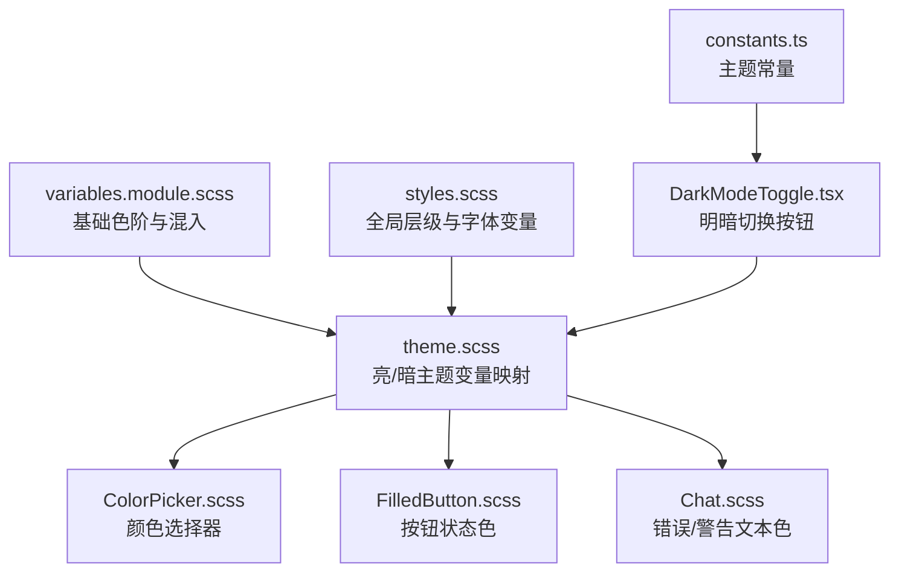
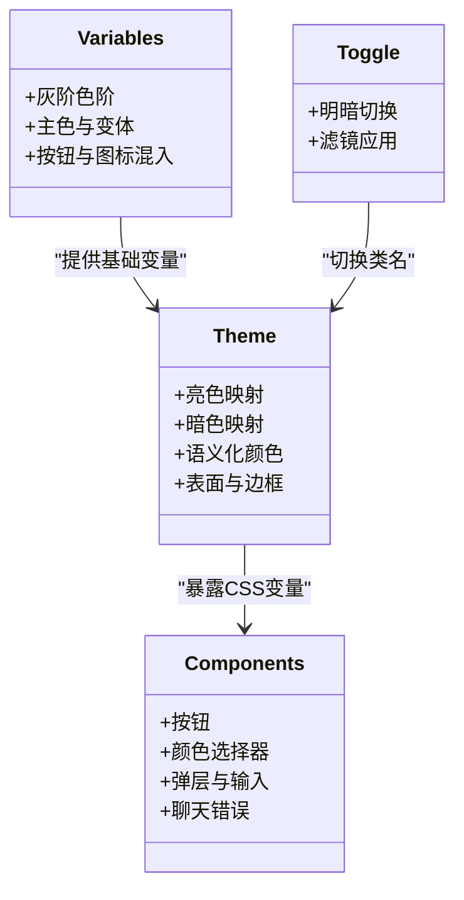
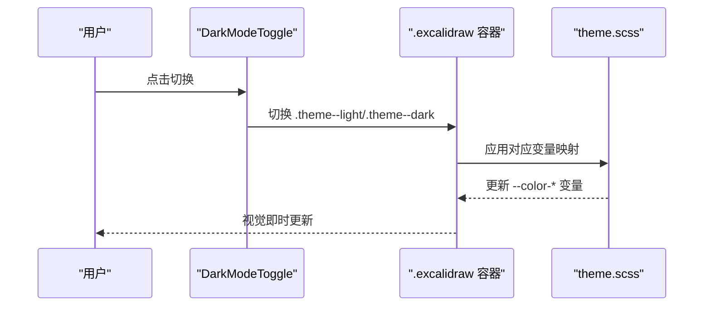
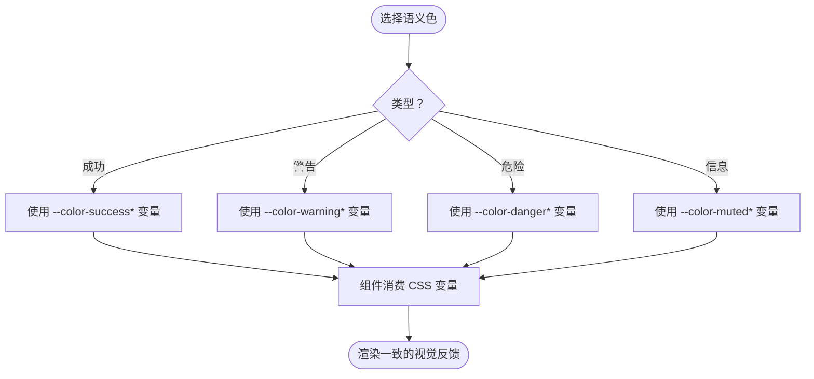
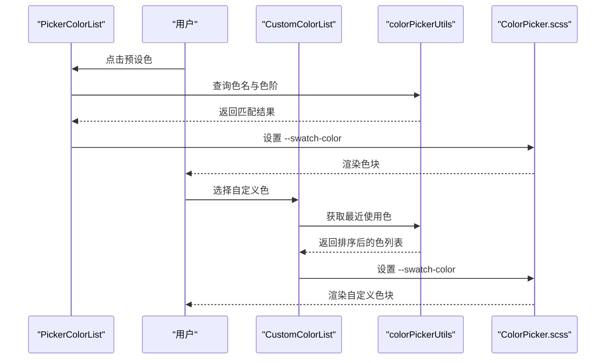
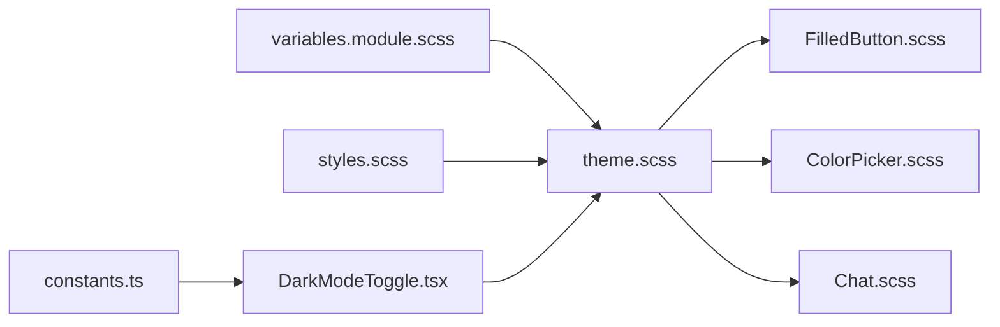

# 颜色系统

<cite>
**本文档引用的文件**
- [variables.module.scss](file://packages/excalidraw/css/variables.module.scss)
- [theme.scss](file://packages/excalidraw/css/theme.scss)
- [styles.scss](file://packages/excalidraw/css/styles.scss)
- [FilledButton.scss](file://packages/excalidraw/components/FilledButton.scss)
- [ColorPicker.scss](file://packages/excalidraw/components/ColorPicker/ColorPicker.scss)
- [PickerColorList.tsx](file://packages/excalidraw/components/ColorPicker/PickerColorList.tsx)
- [CustomColorList.tsx](file://packages/excalidraw/components/ColorPicker/CustomColorList.tsx)
- [colorPickerUtils.ts](file://packages/excalidraw/components/ColorPicker/colorPickerUtils.ts)
- [DarkModeToggle.tsx](file://packages/excalidraw/components/DarkModeToggle.tsx)
- [constants.ts](file://packages/common/src/constants.ts)
- [Chat.scss](file://packages/excalidraw/components/TTDDialog/Chat/Chat.scss)
</cite>

## 目录
1. [简介](#简介)
2. [项目结构](#项目结构)
3. [核心组件](#核心组件)
4. [架构总览](#架构总览)
5. [详细组件分析](#详细组件分析)
6. [依赖关系分析](#依赖关系分析)
7. [性能考量](#性能考量)
8. [故障排除指南](#故障排除指南)
9. [结论](#结论)
10. [附录](#附录)

## 简介
本文件系统性梳理 Excalidraw 的颜色设计体系与实现机制，覆盖主色调与辅助色、语义化颜色（成功、警告、危险、信息）、颜色变量命名规范、颜色值计算规则、对比度标准、亮/暗两套主题的颜色适配与动态切换、以及可访问性与跨平台一致性策略。同时提供颜色定制指南，帮助在不破坏设计一致性的前提下进行品牌化与扩展。

## 项目结构
颜色系统由“变量层 → 主题层 → 组件层”三层构成：
- 变量层：定义基础色阶与通用尺寸、圆角等变量，供主题层统一引用。
- 主题层：在亮/暗两种模式下声明颜色变量映射与差异化值，确保视觉一致性与可读性。
- 组件层：按钮、输入框、弹层、颜色选择器等 UI 组件通过 CSS 变量消费主题层变量，实现自动适配。

图表来源
- [variables.module.scss:1-233](file://packages/excalidraw/css/variables.module.scss#L1-L233)
- [theme.scss:1-282](file://packages/excalidraw/css/theme.scss#L1-L282)
- [styles.scss:1-71](file://packages/excalidraw/css/styles.scss#L1-L71)
- [ColorPicker.scss:1-497](file://packages/excalidraw/components/ColorPicker/ColorPicker.scss#L1-L497)
- [FilledButton.scss:1-236](file://packages/excalidraw/components/FilledButton.scss#L1-L236)
- [Chat.scss:320-403](file://packages/excalidraw/components/TTDDialog/Chat/Chat.scss#L320-L403)
- [DarkModeToggle.tsx:1-36](file://packages/excalidraw/components/DarkModeToggle.tsx#L1-L36)
- [constants.ts:189-194](file://packages/common/src/constants.ts#L189-L194)

章节来源
- [variables.module.scss:1-233](file://packages/excalidraw/css/variables.module.scss#L1-L233)
- [theme.scss:1-282](file://packages/excalidraw/css/theme.scss#L1-L282)
- [styles.scss:1-71](file://packages/excalidraw/css/styles.scss#L1-L71)

## 核心组件
- 基础色阶与混入：定义灰阶、红、绿、蓝等色阶，以及按钮、头像、填充按钮等混入样式，统一交互态与禁用态。
- 主题变量：在亮/暗模式下分别声明颜色变量映射，包含主色、表面色、边框、链接、滚动条、弹层背景等。
- 语义化颜色：成功（绿色系）、警告（黄色系）、危险（红色系）、信息（中性灰）四类语义色，配套文本与图标色。
- 组件消费：按钮、颜色选择器、聊天错误提示等组件通过 CSS 变量消费主题色，自动随主题切换。

章节来源
- [variables.module.scss:1-233](file://packages/excalidraw/css/variables.module.scss#L1-L233)
- [theme.scss:87-167](file://packages/excalidraw/css/theme.scss#L87-L167)
- [FilledButton.scss:170-208](file://packages/excalidraw/components/FilledButton.scss#L170-L208)
- [ColorPicker.scss:188-189](file://packages/excalidraw/components/ColorPicker/ColorPicker.scss#L188-L189)
- [Chat.scss:332-350](file://packages/excalidraw/components/TTDDialog/Chat/Chat.scss#L332-L350)

## 架构总览
颜色系统采用“CSS 变量 + 模块化 SCSS”的架构，通过主题容器类控制亮/暗模式，组件仅依赖变量名，无需感知具体值。

图表来源
- [variables.module.scss:32-153](file://packages/excalidraw/css/variables.module.scss#L32-L153)
- [theme.scss:5-281](file://packages/excalidraw/css/theme.scss#L5-L281)
- [DarkModeToggle.tsx:13-36](file://packages/excalidraw/components/DarkModeToggle.tsx#L13-L36)

## 详细组件分析

### 基础变量与命名规范
- 色阶命名：以 $color-{hue}-{level} 形式组织，如 $color-red-1、$color-gray-7、$color-green-9 等，便于按语义与深浅程度检索。
- 表面色与文字色：通过 --color-on-* 与 --color-surface-* 组合，确保在不同背景上具备可读性。
- 混入复用：按钮、头像、填充按钮等混入统一了悬停、激活、禁用等状态的变量消费方式，降低重复与不一致风险。

章节来源
- [variables.module.scss:1-153](file://packages/excalidraw/css/variables.module.scss#L1-L153)

### 亮/暗主题映射与动态切换
- 类名驱动：.excalidraw 容器在亮/暗模式下分别附加 .theme--light 与 .theme--dark 类，主题层据此重写变量。
- 滤镜策略：暗模式启用 invert + hue-rotate 滤镜，配合变量重映射，使图标与元素整体反相后仍保持可读性。
- 关键变量：默认背景、输入背景、边框、链接、弹层背景、滚动条、选择高亮、图标填充色等均在两套主题下独立声明。

图表来源
- [DarkModeToggle.tsx:13-36](file://packages/excalidraw/components/DarkModeToggle.tsx#L13-L36)
- [theme.scss:179-281](file://packages/excalidraw/css/theme.scss#L179-L281)
- [constants.ts:189-194](file://packages/common/src/constants.ts#L189-L194)

章节来源
- [DarkModeToggle.tsx:1-36](file://packages/excalidraw/components/DarkModeToggle.tsx#L1-L36)
- [theme.scss:179-281](file://packages/excalidraw/css/theme.scss#L179-L281)
- [constants.ts:189-194](file://packages/common/src/constants.ts#L189-L194)

### 语义化颜色体系
- 成功：绿色系，包含基础色、加深、最深、文本色与对比色（悬停/激活），用于成功状态反馈。
- 警告：黄色系，包含基础色与加深，文本色在亮/暗模式下分别适配。
- 危险：红色系，包含基础色与加深，文本色在亮/暗模式下分别适配。
- 信息：中性灰，用于弱信息或占位，强调可读性与低干扰。

图表来源
- [theme.scss:108-144](file://packages/excalidraw/css/theme.scss#L108-L144)
- [FilledButton.scss:170-208](file://packages/excalidraw/components/FilledButton.scss#L170-L208)
- [Chat.scss:332-350](file://packages/excalidraw/components/TTDDialog/Chat/Chat.scss#L332-L350)

章节来源
- [theme.scss:108-144](file://packages/excalidraw/css/theme.scss#L108-L144)
- [FilledButton.scss:170-208](file://packages/excalidraw/components/FilledButton.scss#L170-L208)
- [Chat.scss:332-350](file://packages/excalidraw/components/TTDDialog/Chat/Chat.scss#L332-L350)

### 颜色选择器与自定义色
- 预设色板：PickerColorList.tsx 从预设色板遍历渲染，支持热键绑定与焦点管理。
- 自定义色：CustomColorList.tsx 展示最近使用的自定义色；colorPickerUtils.ts 提供颜色匹配、去重与排序逻辑。
- 渲染细节：ColorPicker.scss 使用 --swatch-color 注入色块颜色，结合 --theme-filter 实现明暗模式下的视觉一致性。

图表来源
- [PickerColorList.tsx:26-96](file://packages/excalidraw/components/ColorPicker/PickerColorList.tsx#L26-L96)
- [CustomColorList.tsx:16-65](file://packages/excalidraw/components/ColorPicker/CustomColorList.tsx#L16-L65)
- [colorPickerUtils.ts:9-104](file://packages/excalidraw/components/ColorPicker/colorPickerUtils.ts#L9-L104)
- [ColorPicker.scss:46-176](file://packages/excalidraw/components/ColorPicker/ColorPicker.scss#L46-L176)

章节来源
- [PickerColorList.tsx:1-96](file://packages/excalidraw/components/ColorPicker/PickerColorList.tsx#L1-L96)
- [CustomColorList.tsx:1-65](file://packages/excalidraw/components/ColorPicker/CustomColorList.tsx#L1-L65)
- [colorPickerUtils.ts:1-104](file://packages/excalidraw/components/ColorPicker/colorPickerUtils.ts#L1-L104)
- [ColorPicker.scss:1-497](file://packages/excalidraw/components/ColorPicker/ColorPicker.scss#L1-L497)

### 按钮组件的颜色消费
- 主色按钮：填充态使用 --color-primary，描边态使用 --color-primary 作为边框与文字色。
- 成功/危险按钮：填充态使用 --color-success/--color-danger，描边态使用对应加深/最深变量。
- 禁用态：使用 --color-surface-low 与 --color-on-surface-variant，确保低对比度与不可点击感。

章节来源
- [FilledButton.scss:90-208](file://packages/excalidraw/components/FilledButton.scss#L90-L208)

## 依赖关系分析
- 变量层对混入的依赖：variables.module.scss 中的混入被大量组件样式复用，形成“变量 → 混入 → 组件”的单向依赖链。
- 主题层对变量层的依赖：theme.scss 通过 @forward 与 @use 引用 variables.module.scss 的变量与混入，再输出 CSS 变量。
- 组件层对主题层的依赖：各组件样式直接消费 CSS 变量，不直接依赖 SCSS 变量，降低耦合。
- 明暗切换对主题层的依赖：DarkModeToggle.tsx 通过切换容器类名驱动 theme.scss 的变量重映射。

图表来源
- [variables.module.scss:1-233](file://packages/excalidraw/css/variables.module.scss#L1-L233)
- [theme.scss:1-282](file://packages/excalidraw/css/theme.scss#L1-L282)
- [styles.scss:1-71](file://packages/excalidraw/css/styles.scss#L1-L71)
- [FilledButton.scss:1-236](file://packages/excalidraw/components/FilledButton.scss#L1-L236)
- [ColorPicker.scss:1-497](file://packages/excalidraw/components/ColorPicker/ColorPicker.scss#L1-L497)
- [Chat.scss:320-403](file://packages/excalidraw/components/TTDDialog/Chat/Chat.scss#L320-L403)
- [DarkModeToggle.tsx:1-36](file://packages/excalidraw/components/DarkModeToggle.tsx#L1-L36)
- [constants.ts:189-194](file://packages/common/src/constants.ts#L189-L194)

章节来源
- [variables.module.scss:1-233](file://packages/excalidraw/css/variables.module.scss#L1-L233)
- [theme.scss:1-282](file://packages/excalidraw/css/theme.scss#L1-L282)
- [styles.scss:1-71](file://packages/excalidraw/css/styles.scss#L1-L71)
- [DarkModeToggle.tsx:1-36](file://packages/excalidraw/components/DarkModeToggle.tsx#L1-L36)

## 性能考量
- CSS 变量优先：组件仅消费 CSS 变量，避免 JS 动态注入样式带来的回流与重绘。
- 滤镜开销：暗模式滤镜为一次性计算，建议避免在高频动画中叠加复杂滤镜组合。
- 颜色选择器渲染：预设色板与自定义色列表按需渲染，减少不必要的 DOM 节点数量。

## 故障排除指南
- 暗模式颜色异常
  - 检查容器类名是否正确切换（.theme--light/.theme--dark）。
  - 确认 --theme-filter 是否生效，必要时检查父级容器的 filter 继承。
- 文本可读性差
  - 检查 --color-on-surface 与背景色对比度是否满足可读性要求。
  - 对于高亮/强调文本，优先使用 --color-primary 或语义色对应的文本变量。
- 颜色选择器无法聚焦
  - 确保 activeColorPickerSection 正确设置，按钮 ref 在选中时获得焦点。
- 自定义色未显示
  - 检查 colorPickerUtils 的 isCustomColor 与 getMostUsedCustomColors 逻辑，确认颜色不在预设色板内且数量未超限。

章节来源
- [theme.scss:179-281](file://packages/excalidraw/css/theme.scss#L179-L281)
- [DarkModeToggle.tsx:13-36](file://packages/excalidraw/components/DarkModeToggle.tsx#L13-L36)
- [colorPickerUtils.ts:41-88](file://packages/excalidraw/components/ColorPicker/colorPickerUtils.ts#L41-L88)
- [ColorPicker.scss:188-189](file://packages/excalidraw/components/ColorPicker/ColorPicker.scss#L188-L189)

## 结论
Excalidraw 的颜色系统以 CSS 变量为核心，通过模块化 SCSS 将基础色阶与混入抽象为可复用能力，再由主题层在亮/暗模式下提供一致的变量映射。组件层仅消费变量，实现零样板代码的颜色一致性与动态切换。语义化颜色体系清晰，覆盖常用交互状态；明暗模式通过滤镜与变量重映射保障可读性与体验。该架构易于扩展与定制，适合在不破坏设计一致性的前提下进行品牌化改造。

## 附录

### 颜色变量命名规范
- 基础色阶：$color-{hue}-{level}
- 主题变量：--color-{surface|on|primary|warning|danger|success|muted|...}
- 混入：以 mixin 开头的命名空间（如 @mixin outlineButtonStyles）

章节来源
- [variables.module.scss:1-153](file://packages/excalidraw/css/variables.module.scss#L1-L153)
- [theme.scss:87-167](file://packages/excalidraw/css/theme.scss#L87-L167)

### 颜色值计算规则与对比度标准
- 计算规则：主题层通过 @use "sass:color" 进行透明度调整与颜色合成，确保弹层与覆盖层的视觉层次。
- 对比度标准：建议文本与背景对比度至少达到 AA 级别（4.5:1），强调文本与背景至少达到 AAA 级别（7:1）。可通过 --color-on-* 与 --color-surface-* 的组合满足可读性需求。

章节来源
- [theme.scss:31-32](file://packages/excalidraw/css/theme.scss#L31-L32)
- [theme.scss:152-163](file://packages/excalidraw/css/theme.scss#L152-L163)

### 暗色模式与亮色模式适配机制
- 类名切换：DarkModeToggle.tsx 切换 .theme--light 与 .theme--dark，驱动 theme.scss 的变量重映射。
- 滤镜策略：暗模式启用 invert 与 hue-rotate，配合变量重映射，确保图标与元素在反相后仍具可读性。
- 视觉一致性：默认背景、输入背景、边框、链接、滚动条、选择高亮等关键变量在两套主题下均有明确值。

章节来源
- [DarkModeToggle.tsx:13-36](file://packages/excalidraw/components/DarkModeToggle.tsx#L13-L36)
- [theme.scss:179-281](file://packages/excalidraw/css/theme.scss#L179-L281)
- [constants.ts:189-194](file://packages/common/src/constants.ts#L189-L194)

### 颜色定制指南
- 修改主题色
  - 在 theme.scss 中调整 --color-primary 及其变体（hover/active/light/darker），确保与 --color-on-primary-container、--color-surface-primary-container 协调。
- 添加新的语义化颜色
  - 在 theme.scss 中新增 --color-{name} 与 --color-{name}-text 等变量，并在组件层（如按钮、弹层）中消费。
- 实现品牌色彩定制
  - 通过覆盖 variables.module.scss 中的基础色阶或在主题层重映射关键变量，确保与现有混入（按钮、头像等）兼容。
- 保持一致性
  - 使用混入（outlineButtonStyles、avatarStyles 等）统一交互态，避免手写重复样式导致的不一致。

章节来源
- [theme.scss:87-167](file://packages/excalidraw/css/theme.scss#L87-L167)
- [variables.module.scss:32-153](file://packages/excalidraw/css/variables.module.scss#L32-L153)
- [FilledButton.scss:1-236](file://packages/excalidraw/components/FilledButton.scss#L1-L236)

### 可访问性与跨平台一致性策略
- 可访问性
  - 使用 --color-on-* 与 --color-surface-* 组合，确保文本与背景对比度满足 WCAG AA/AAA。
  - 为交互元素提供可见焦点环（--focus-highlight-color），提升键盘导航体验。
- 跨平台一致性
  - 通过 CSS 变量与 SCSS 混入，确保 Web、移动端与桌面端的视觉与交互一致。
  - 颜色选择器与按钮等关键组件在明暗模式下均提供清晰的视觉反馈与可读性。

章节来源
- [theme.scss:152-163](file://packages/excalidraw/css/theme.scss#L152-L163)
- [ColorPicker.scss:121-140](file://packages/excalidraw/components/ColorPicker/ColorPicker.scss#L121-L140)
- [FilledButton.scss:19-20](file://packages/excalidraw/components/FilledButton.scss#L19-L20)