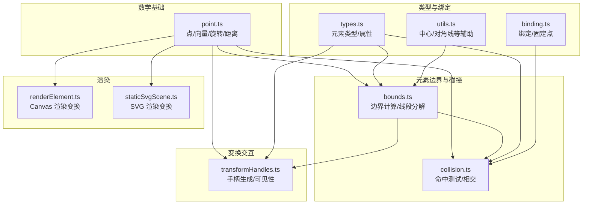
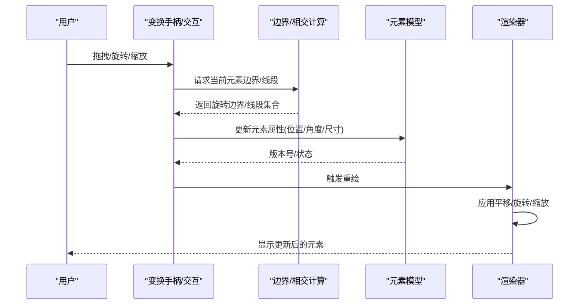
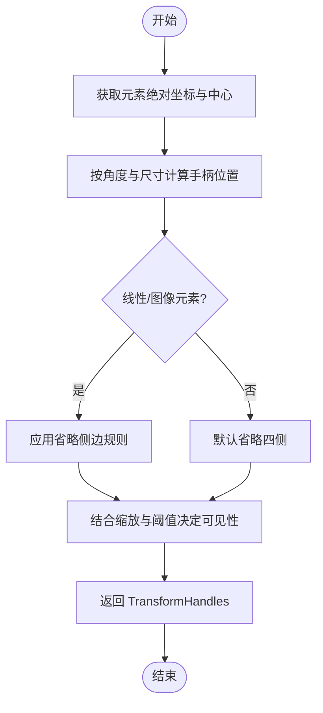
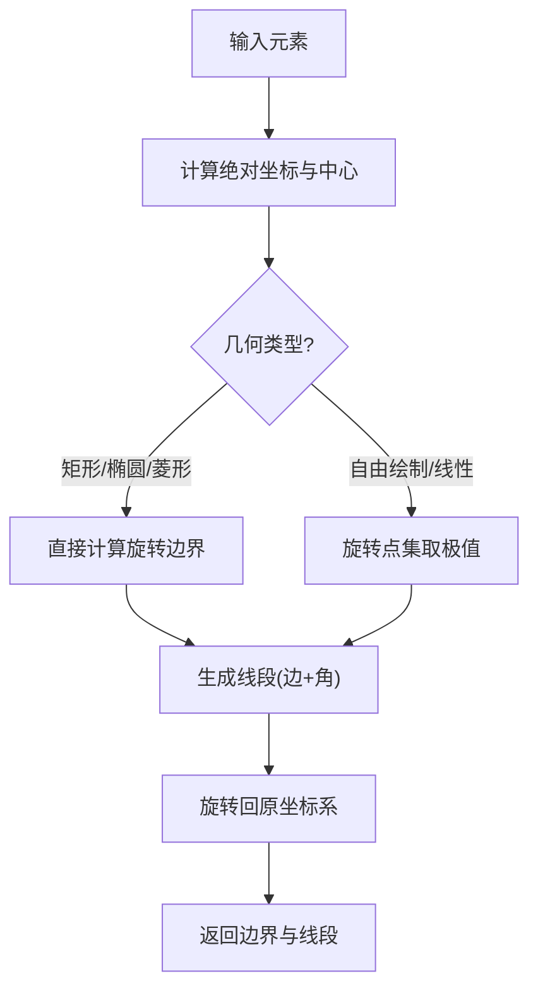
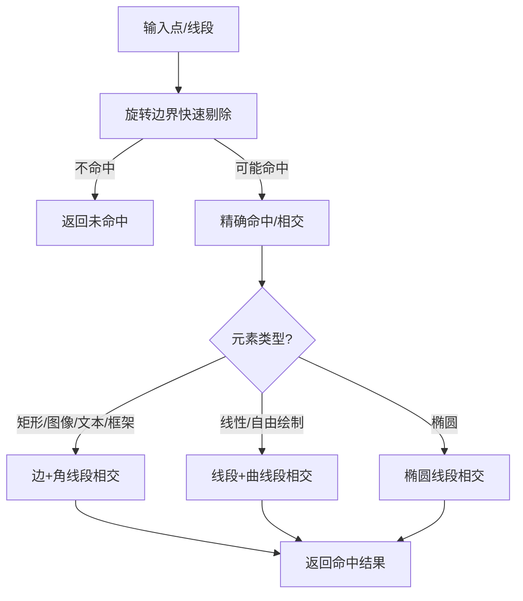
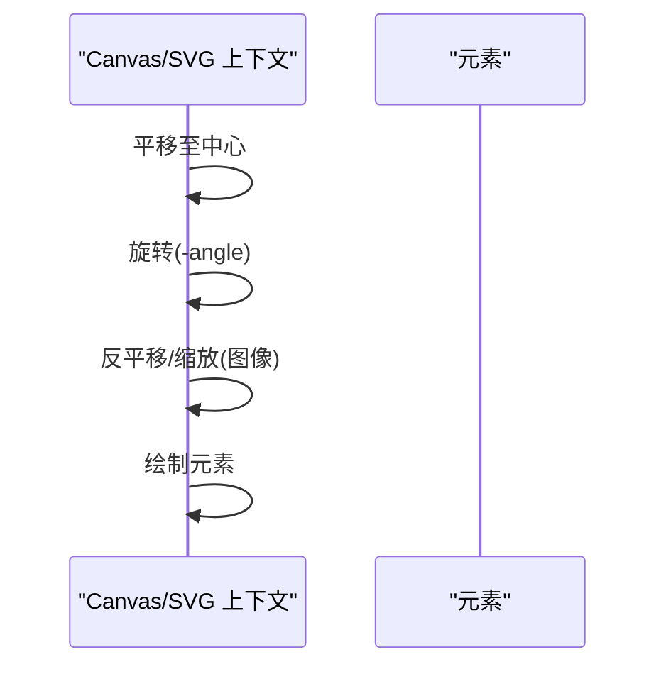
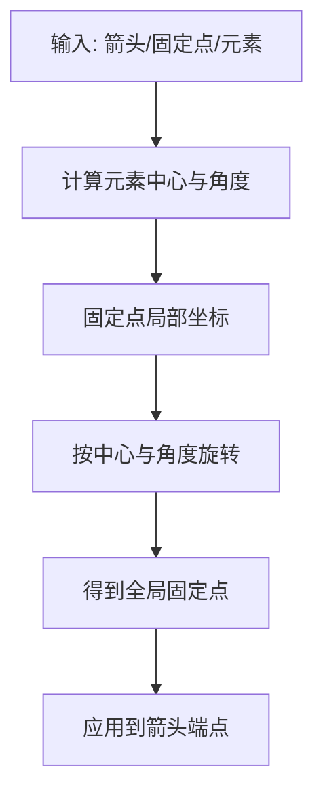
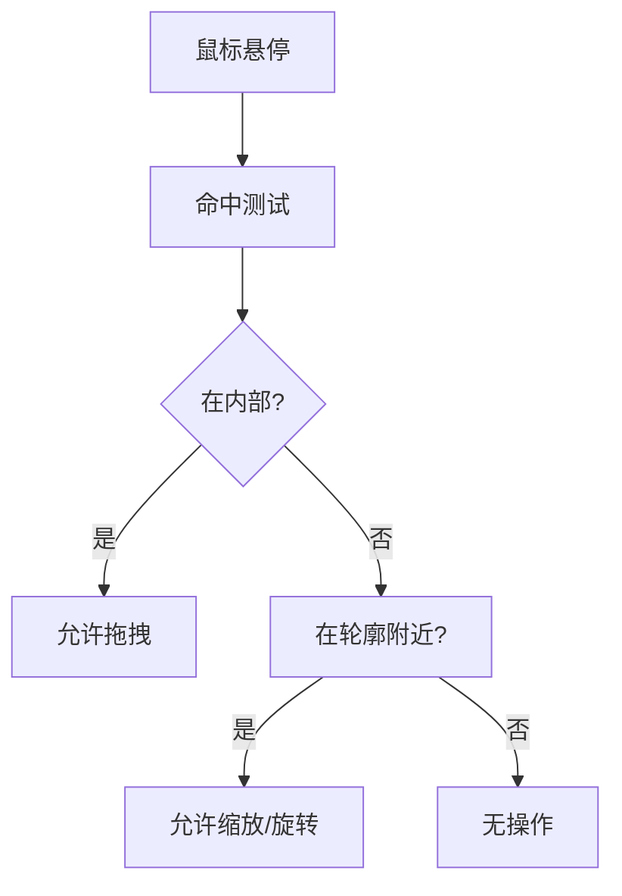
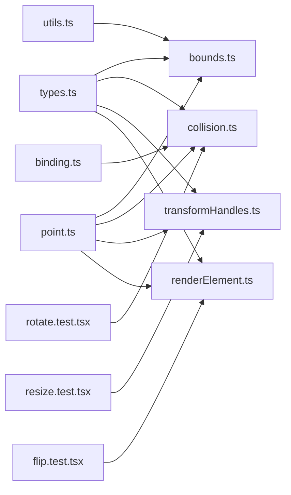

# 元素变换系统

<cite>
**本文档引用的文件**
- [transformHandles.ts](file://packages/element/src/transformHandles.ts)
- [bounds.ts](file://packages/element/src/bounds.ts)
- [collision.ts](file://packages/element/src/collision.ts)
- [point.ts](file://packages/math/src/point.ts)
- [types.ts](file://packages/element/src/types.ts)
- [renderElement.ts](file://packages/element/src/renderElement.ts)
- [staticSvgScene.ts](file://packages/excalidraw/renderer/staticSvgScene.ts)
- [flip.test.tsx](file://packages/excalidraw/tests/flip.test.tsx)
- [rotate.test.tsx](file://packages/excalidraw/tests/rotate.test.tsx)
- [resize.test.tsx](file://packages/element/tests/resize.test.tsx)
- [binding.ts](file://packages/element/src/binding.ts)
- [utils.ts](file://packages/element/src/utils.ts)
</cite>

## 目录
1. [引言](#引言)
2. [项目结构](#项目结构)
3. [核心组件](#核心组件)
4. [架构总览](#架构总览)
5. [详细组件分析](#详细组件分析)
6. [依赖关系分析](#依赖关系分析)
7. [性能考量](#性能考量)
8. [故障排查指南](#故障排查指南)
9. [结论](#结论)
10. [附录](#附录)

## 引言
本文件面向开发者与高级用户，系统化阐述 Excalidraw 中“元素变换系统”的设计与实现，涵盖几何变换（缩放、旋转、平移、倾斜）、变换矩阵与坐标系转换、边界与碰撞检测、交互机制（拖拽、缩放手柄、旋转控制）、复合变换与顺序影响、性能优化与扩展机制。文档以代码级分析为基础，辅以图示帮助理解。

## 项目结构
围绕元素变换的关键模块分布如下：
- 几何与变换基础：数学工具（点、向量、角度、旋转）
- 元素边界与碰撞：边界计算、线段分解、相交测试
- 变换交互：变换手柄生成、交互约束与可见性
- 渲染管线：Canvas/SVG 渲染时的变换应用
- 测试用例：覆盖翻转、旋转、缩放等行为验证

**图表来源**
- [point.ts:125-139](file://packages/math/src/point.ts#L125-L139)
- [bounds.ts:250-291](file://packages/element/src/bounds.ts#L250-L291)
- [collision.ts:428-491](file://packages/element/src/collision.ts#L428-L491)
- [transformHandles.ts:133-326](file://packages/element/src/transformHandles.ts#L133-L326)
- [renderElement.ts:1043-1081](file://packages/element/src/renderElement.ts#L1043-L1081)
- [staticSvgScene.ts:524-557](file://packages/excalidraw/renderer/staticSvgScene.ts#L524-L557)
- [types.ts:40-82](file://packages/element/src/types.ts#L40-L82)
- [binding.ts:1519-1741](file://packages/element/src/binding.ts#L1519-L1741)
- [utils.ts:522-566](file://packages/element/src/utils.ts#L522-L566)

**章节来源**
- [point.ts:125-139](file://packages/math/src/point.ts#L125-L139)
- [bounds.ts:250-291](file://packages/element/src/bounds.ts#L250-L291)
- [collision.ts:428-491](file://packages/element/src/collision.ts#L428-L491)
- [transformHandles.ts:133-326](file://packages/element/src/transformHandles.ts#L133-L326)
- [renderElement.ts:1043-1081](file://packages/element/src/renderElement.ts#L1043-L1081)
- [staticSvgScene.ts:524-557](file://packages/excalidraw/renderer/staticSvgScene.ts#L524-L557)
- [types.ts:40-82](file://packages/element/src/types.ts#L40-L82)
- [binding.ts:1519-1741](file://packages/element/src/binding.ts#L1519-L1741)
- [utils.ts:522-566](file://packages/element/src/utils.ts#L522-L566)

## 核心组件
- 变换手柄系统：根据元素绝对坐标、角度与缩放动态生成旋转与缩放手柄，支持不同指针类型与设备形态。
- 边界与线段：提供元素的轴对齐与旋转边界、线段分解（边与角），用于精确命中与相交测试。
- 命中与相交：基于旋转边界快速剔除、再进行精确点到形状/轮廓的判定与线段相交。
- 渲染变换：在 Canvas/SVG 渲染阶段应用平移、旋转、缩放，确保视觉一致与性能。
- 绑定与固定点：支持箭头与可绑定元素之间的固定点绑定，旋转/缩放时保持相对位置。

**章节来源**
- [transformHandles.ts:133-326](file://packages/element/src/transformHandles.ts#L133-L326)
- [bounds.ts:298-419](file://packages/element/src/bounds.ts#L298-L419)
- [collision.ts:119-192](file://packages/element/src/collision.ts#L119-L192)
- [renderElement.ts:1043-1081](file://packages/element/src/renderElement.ts#L1043-L1081)
- [binding.ts:1519-1741](file://packages/element/src/binding.ts#L1519-L1741)

## 架构总览
元素变换系统由“输入交互 → 计算边界/相交 → 应用变换 → 渲染输出”构成闭环。交互层通过变换手柄触发，边界层负责几何计算，渲染层负责最终呈现。

**图表来源**
- [transformHandles.ts:272-326](file://packages/element/src/transformHandles.ts#L272-L326)
- [bounds.ts:151-243](file://packages/element/src/bounds.ts#L151-L243)
- [collision.ts:428-491](file://packages/element/src/collision.ts#L428-L491)
- [renderElement.ts:1043-1081](file://packages/element/src/renderElement.ts#L1043-L1081)

## 详细组件分析

### 变换手柄系统
- 功能要点
  - 基于元素绝对坐标与角度生成旋转与缩放手柄位置，考虑缩放与指针类型调整手柄尺寸。
  - 针对线性元素与图像元素设置不同的可见性与省略侧边规则，避免过密或不可用的手柄。
  - 支持多选场景与框架类元素的特殊处理（如禁用旋转）。
- 关键流程
  - 获取元素绝对坐标与中心点
  - 根据角度与手柄尺寸计算各方向手柄位置
  - 结合缩放与阈值决定是否显示八向手柄
  - 返回 TransformHandles 映射

**图表来源**
- [transformHandles.ts:133-270](file://packages/element/src/transformHandles.ts#L133-L270)
- [transformHandles.ts:272-326](file://packages/element/src/transformHandles.ts#L272-L326)

**章节来源**
- [transformHandles.ts:1-355](file://packages/element/src/transformHandles.ts#L1-L355)

### 边界与线段计算
- 轴对齐与旋转边界
  - 对矩形、椭圆、菱形等几何体分别计算旋转后边界；自由绘制与线性元素采用点集旋转后取极值。
  - 提供非旋转边界缓存，减少重复计算。
- 线段分解
  - 将元素形状分解为边（线段）与角（曲线段），用于精确相交与命中测试。
  - 支持多段贝塞尔曲线采样与旋转组合。
- 旋转边界快速剔除
  - 在命中测试前先将点旋转至非旋转坐标系，再进行轴对齐边界判断，显著降低复杂度。

**图表来源**
- [bounds.ts:151-243](file://packages/element/src/bounds.ts#L151-L243)
- [bounds.ts:298-419](file://packages/element/src/bounds.ts#L298-L419)

**章节来源**
- [bounds.ts:89-243](file://packages/element/src/bounds.ts#L89-L243)
- [bounds.ts:298-507](file://packages/element/src/bounds.ts#L298-L507)

### 命中与相交测试
- 命中测试
  - 先进行旋转边界快速剔除，再进行精确点到形状内部或轮廓的判定。
  - 支持帧名称区域命中与文本绑定区域命中。
- 线段相交
  - 对矩形/图像/文本/框架等使用边与角的线段相交；对线性/自由绘制元素分解为线段与曲线段。
  - 对椭圆使用专用相交函数，对贝塞尔曲线采用采样与迭代求解。

**图表来源**
- [collision.ts:119-192](file://packages/element/src/collision.ts#L119-L192)
- [collision.ts:428-491](file://packages/element/src/collision.ts#L428-L491)
- [collision.ts:608-658](file://packages/element/src/collision.ts#L608-L658)

**章节来源**
- [collision.ts:119-192](file://packages/element/src/collision.ts#L119-L192)
- [collision.ts:428-732](file://packages/element/src/collision.ts#L428-L732)

### 渲染阶段的变换应用
- Canvas 渲染
  - 先平移至元素中心，再旋转，最后反平移，保证旋转中心正确。
  - 图像元素在旋转后应用水平/垂直缩放（翻转）。
- SVG 渲染
  - 使用 <use> 元素先应用 scale（镜像），再在外层 <g> 上应用平移与旋转，确保 transform-origin 正确合成。

**图表来源**
- [renderElement.ts:1043-1081](file://packages/element/src/renderElement.ts#L1043-L1081)
- [staticSvgScene.ts:524-557](file://packages/excalidraw/renderer/staticSvgScene.ts#L524-L557)

**章节来源**
- [renderElement.ts:1043-1081](file://packages/element/src/renderElement.ts#L1043-L1081)
- [staticSvgScene.ts:524-557](file://packages/excalidraw/renderer/staticSvgScene.ts#L524-L557)

### 绑定与固定点
- 固定点计算
  - 根据元素类型与角度，将固定点从局部坐标映射到全局坐标，并考虑旋转。
  - 支持多种方向吸附（上下左右与角落）与阈值判断。
- 箭头绑定解除
  - 当目标元素旋转时，自动解除箭头绑定，防止错误连接。

**图表来源**
- [binding.ts:1519-1741](file://packages/element/src/binding.ts#L1519-L1741)

**章节来源**
- [binding.ts:1519-1741](file://packages/element/src/binding.ts#L1519-L1741)

### 交互机制：拖拽、缩放手柄与旋转控制
- 拖拽
  - 通过命中测试确定是否在元素内部或轮廓附近，支持帧名区域命中。
- 缩放手柄
  - 根据缩放与指针类型动态调整手柄大小与间距，仅在满足尺寸阈值时显示八向手柄。
- 旋转控制
  - 旋转手柄位于元素上部，绕中心旋转；框架类元素禁用旋转。

**图表来源**
- [collision.ts:212-220](file://packages/element/src/collision.ts#L212-L220)
- [transformHandles.ts:133-270](file://packages/element/src/transformHandles.ts#L133-L270)

**章节来源**
- [collision.ts:212-220](file://packages/element/src/collision.ts#L212-L220)
- [transformHandles.ts:133-270](file://packages/element/src/transformHandles.ts#L133-L270)

### 复合变换与变换顺序
- 顺序影响
  - 平移 → 旋转 → 缩放 的顺序会影响最终效果；渲染阶段严格遵循该顺序以保证一致性。
  - 翻转（缩放因子为负）与旋转组合时，需注意旋转中心与坐标系。
- 测试验证
  - 单元测试覆盖了翻转前后边界框一致性、旋转后箭头绑定解除等行为。

**章节来源**
- [flip.test.tsx:217-340](file://packages/excalidraw/tests/flip.test.tsx#L217-L340)
- [rotate.test.tsx:18-40](file://packages/excalidraw/tests/rotate.test.tsx#L18-L40)

### 性能考量
- 缓存与快速剔除
  - 边界计算使用版本号缓存，避免重复计算；命中测试先做旋转边界快速剔除。
- 线段分解与采样
  - 曲线段采用采样点近似，减少高阶曲线相交成本。
- 手柄数量控制
  - 仅在满足尺寸阈值时显示八向手柄，避免过多 DOM/绘制节点。

**章节来源**
- [bounds.ts:89-149](file://packages/element/src/bounds.ts#L89-L149)
- [collision.ts:157-171](file://packages/element/src/collision.ts#L157-L171)
- [transformHandles.ts:216-269](file://packages/element/src/transformHandles.ts#L216-L269)

### 故障排查指南
- 旋转后箭头未绑定
  - 检查旋转是否导致绑定阈值超出，必要时重新吸附或手动调整。
- 手柄不可见
  - 检查缩放与尺寸阈值，确认是否满足显示条件。
- 翻转后边界异常
  - 确认翻转逻辑与边界缓存是否生效，参考单元测试断言。

**章节来源**
- [binding.ts:1618-1708](file://packages/element/src/binding.ts#L1618-L1708)
- [transformHandles.ts:216-269](file://packages/element/src/transformHandles.ts#L216-L269)
- [flip.test.tsx:217-340](file://packages/excalidraw/tests/flip.test.tsx#L217-L340)

## 依赖关系分析

**图表来源**
- [types.ts:40-82](file://packages/element/src/types.ts#L40-L82)
- [bounds.ts:1-50](file://packages/element/src/bounds.ts#L1-L50)
- [collision.ts:1-50](file://packages/element/src/collision.ts#L1-L50)
- [transformHandles.ts:1-30](file://packages/element/src/transformHandles.ts#L1-L30)
- [renderElement.ts:1043-1081](file://packages/element/src/renderElement.ts#L1043-L1081)
- [point.ts:125-139](file://packages/math/src/point.ts#L125-L139)
- [utils.ts:522-566](file://packages/element/src/utils.ts#L522-L566)
- [binding.ts:1519-1741](file://packages/element/src/binding.ts#L1519-L1741)
- [resize.test.tsx:72-93](file://packages/element/tests/resize.test.tsx#L72-L93)
- [flip.test.tsx:217-340](file://packages/excalidraw/tests/flip.test.tsx#L217-L340)
- [rotate.test.tsx:18-40](file://packages/excalidraw/tests/rotate.test.tsx#L18-L40)

**章节来源**
- [types.ts:40-82](file://packages/element/src/types.ts#L40-L82)
- [bounds.ts:1-50](file://packages/element/src/bounds.ts#L1-L50)
- [collision.ts:1-50](file://packages/element/src/collision.ts#L1-L50)
- [transformHandles.ts:1-30](file://packages/element/src/transformHandles.ts#L1-L30)
- [renderElement.ts:1043-1081](file://packages/element/src/renderElement.ts#L1043-L1081)
- [point.ts:125-139](file://packages/math/src/point.ts#L125-L139)
- [utils.ts:522-566](file://packages/element/src/utils.ts#L522-L566)
- [binding.ts:1519-1741](file://packages/element/src/binding.ts#L1519-L1741)
- [resize.test.tsx:72-93](file://packages/element/tests/resize.test.tsx#L72-L93)
- [flip.test.tsx:217-340](file://packages/excalidraw/tests/flip.test.tsx#L217-L340)
- [rotate.test.tsx:18-40](file://packages/excalidraw/tests/rotate.test.tsx#L18-L40)

## 性能考量
- 使用版本号缓存边界计算结果，避免重复计算。
- 命中测试优先进行旋转边界快速剔除，大幅降低后续昂贵的相交测试概率。
- 控制手柄数量与尺寸，避免在小尺寸元素上显示过多手柄造成渲染压力。
- 曲线相交采用采样与迭代限制，平衡精度与性能。

[本节为通用指导，无需特定文件来源]

## 故障排查指南
- 旋转后箭头绑定丢失
  - 检查旋转是否超过绑定阈值，必要时重新吸附或手动调整。
- 手柄不可见
  - 检查缩放与尺寸阈值，确认是否满足显示条件。
- 翻转后边界异常
  - 确认翻转逻辑与边界缓存是否生效，参考单元测试断言。

**章节来源**
- [binding.ts:1618-1708](file://packages/element/src/binding.ts#L1618-L1708)
- [transformHandles.ts:216-269](file://packages/element/src/transformHandles.ts#L216-L269)
- [flip.test.tsx:217-340](file://packages/excalidraw/tests/flip.test.tsx#L217-L340)

## 结论
元素变换系统通过“几何基础 → 边界与相交 → 交互手柄 → 渲染应用”的分层设计，实现了高效、准确且可扩展的变换能力。系统在性能与精度之间取得平衡，同时提供了完善的测试保障与交互体验。开发者可在现有框架上扩展自定义变换类型与交互模式。

[本节为总结性内容，无需特定文件来源]

## 附录
- 变换矩阵与坐标系
  - 局部坐标 → 全局坐标：通过中心点与角度旋转，再平移。
  - 全局坐标 → 局部坐标：逆旋转与逆平移。
- 常用工具函数
  - 点旋转：pointRotateRads
  - 点平移：pointTranslate
  - 点距离：pointDistance
  - 点缩放：pointScaleFromOrigin

**章节来源**
- [point.ts:125-139](file://packages/math/src/point.ts#L125-L139)
- [point.ts:170-175](file://packages/math/src/point.ts#L170-L175)
- [point.ts:195-200](file://packages/math/src/point.ts#L195-L200)
- [point.ts:229-233](file://packages/math/src/point.ts#L229-L233)