# 元素工具函数

<cite>
**本文档引用的文件**
- [sizeHelpers.ts](file://packages/element/src/sizeHelpers.ts)
- [bounds.ts](file://packages/element/src/bounds.ts)
- [align.ts](file://packages/element/src/align.ts)
- [distribute.ts](file://packages/element/src/distribute.ts)
- [zindex.ts](file://packages/element/src/zindex.ts)
- [positionElementsOnGrid.ts](file://packages/element/src/positionElementsOnGrid.ts)
- [index.ts](file://packages/element/src/index.ts)
- [sortElements.ts](file://packages/element/src/sortElements.ts)
- [textElement.ts](file://packages/element/src/textElement.ts)
- [textEditorState.ts](file://packages/excalidraw/wysiwyg/textEditorState.ts)
- [renderElement.ts](file://packages/element/src/renderElement.ts)
- [staticSvgScene.ts](file://packages/excalidraw/renderer/staticSvgScene.ts)
- [actionGroup.tsx](file://packages/excalidraw/actions/actionGroup.tsx)
- [LibraryMenuItems.tsx](file://packages/excalidraw/components/LibraryMenuItems.tsx)
- [selection.test.tsx](file://packages/excalidraw/tests/selection.test.tsx)
- [snapping.ts](file://packages/excalidraw/snapping.ts)
- [collision.test.tsx](file://packages/element/tests/collision.test.tsx)
- [textWysiwyg.tsx](file://packages/excalidraw/wysiwyg/textWysiwyg.tsx)
- [colorInput.test.ts](file://packages/excalidraw/tests/colorInput.test.ts)
- [faq.mdx](file://dev-docs/docs/@excalidraw/excalidraw/faq.mdx)
</cite>

## 更新摘要
**已做更改**
- 更新文本处理章节，明确说明文本输入颜色设置功能已被移除
- 添加文本颜色功能移除的说明和替代方案
- 更新故障排查指南，包含文本颜色相关的问题解决方案

## 目录
1. [简介](#简介)
2. [项目结构](#项目结构)
3. [核心组件](#核心组件)
4. [架构总览](#架构总览)
5. [详细组件分析](#详细组件分析)
6. [依赖关系分析](#依赖关系分析)
7. [性能考量](#性能考量)
8. [故障排查指南](#故障排查指南)
9. [结论](#结论)
10. [附录](#附录)

## 简介
本文件系统性梳理 Excalidraw 中"元素工具函数"的设计与实现，覆盖以下主题：
- 元素尺寸辅助：最小可见尺寸检测、尺寸验证与完美形状锁定
- 元素选择机制：单选、多选与范围选择
- 元素排序与层级：层级排序、绘制顺序管理与 z-index 计算
- 元素对齐与分布：对齐与均匀分布算法
- 网格对齐与智能吸附：网格布局与吸附对齐
- 分组与解组：元素分组与解组的 API 与行为
- 文本处理工具：文本换行分割、多色文本渲染与文本测量
- 缓存与性能：几何边界缓存、命中检测缓存与渲染缓存
- 实用工具与扩展建议：常见问题、最佳实践与扩展方向

## 项目结构
围绕元素工具函数的关键模块组织如下：
- 尺寸与边界：sizeHelpers.ts、bounds.ts
- 对齐与分布：align.ts、distribute.ts
- 层级与排序：zindex.ts、sortElements.ts
- 布局与网格：positionElementsOnGrid.ts
- 文本处理：textElement.ts、textEditorState.ts
- 选择与范围：LibraryMenuItems.tsx、selection.test.tsx
- 分组与解组：actionGroup.tsx
- 性能与缓存：renderElement.ts、collision.test.tsx（命中检测缓存）
- 工具入口：index.ts（导出常用工具）

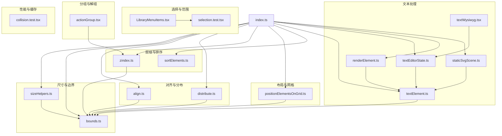

**图表来源**
- [sizeHelpers.ts:1-254](file://packages/element/src/sizeHelpers.ts#L1-L254)
- [bounds.ts:89-244](file://packages/element/src/bounds.ts#L89-L244)
- [align.ts:1-81](file://packages/element/src/align.ts#L1-L81)
- [distribute.ts:1-112](file://packages/element/src/distribute.ts#L1-L112)
- [zindex.ts:1-605](file://packages/element/src/zindex.ts#L1-L605)
- [positionElementsOnGrid.ts:1-113](file://packages/element/src/positionElementsOnGrid.ts#L1-L113)
- [textElement.ts:47-65](file://packages/element/src/textElement.ts#L47-L65)
- [textEditorState.ts:53-91](file://packages/excalidraw/wysiwyg/textEditorState.ts#L53-L91)
- [renderElement.ts:618](file://packages/element/src/renderElement.ts#L618)
- [staticSvgScene.ts:702](file://packages/excalidraw/renderer/staticSvgScene.ts#L702)
- [LibraryMenuItems.tsx:135-181](file://packages/excalidraw/components/LibraryMenuItems.tsx#L135-L181)
- [selection.test.tsx:707-760](file://packages/excalidraw/tests/selection.test.tsx#L707-L760)
- [actionGroup.tsx:151-229](file://packages/excalidraw/actions/actionGroup.tsx#L151-L229)
- [collision.test.tsx:98-162](file://packages/element/tests/collision.test.tsx#L98-L162)
- [index.ts:93](file://packages/element/src/index.ts#L93)

**章节来源**
- [index.ts:1-103](file://packages/element/src/index.ts#L1-L103)

## 核心组件
- 尺寸与可见性检测：最小不可见尺寸判定、完美形状锁定、标准化尺寸
- 边界与碰撞：元素绝对坐标、包围盒、线段化、缓存策略
- 对齐与分布：按选区边界对齐、沿轴向均匀分布
- 层级与排序：移动到最前/最后、逐个移动、考虑绑定与容器的层级调整
- 网格与吸附：网格布局排列、智能吸附与间隙对齐
- 文本处理：文本换行分割、多色文本渲染、文本测量与容器绑定
- 选择机制：单选、多选、Shift 范围选择
- 分组与解组：成组与解组的 API 行为
- 缓存与性能：边界缓存、命中检测缓存、元素画布缓存

**章节来源**
- [sizeHelpers.ts:25-254](file://packages/element/src/sizeHelpers.ts#L25-L254)
- [bounds.ts:89-244](file://packages/element/src/bounds.ts#L89-L244)
- [align.ts:17-81](file://packages/element/src/align.ts#L17-L81)
- [distribute.ts:17-112](file://packages/element/src/distribute.ts#L17-L112)
- [zindex.ts:566-605](file://packages/element/src/zindex.ts#L566-L605)
- [positionElementsOnGrid.ts:7-113](file://packages/element/src/positionElementsOnGrid.ts#L7-L113)
- [textElement.ts:47-65](file://packages/element/src/textElement.ts#L47-L65)
- [textEditorState.ts:53-91](file://packages/excalidraw/wysiwyg/textEditorState.ts#L53-L91)
- [LibraryMenuItems.tsx:135-181](file://packages/excalidraw/components/LibraryMenuItems.tsx#L135-L181)
- [actionGroup.tsx:151-229](file://packages/excalidraw/actions/actionGroup.tsx#L151-L229)
- [renderElement.ts:618](file://packages/element/src/renderElement.ts#L618)
- [staticSvgScene.ts:702](file://packages/excalidraw/renderer/staticSvgScene.ts#L702)
- [collision.test.tsx:98-162](file://packages/element/tests/collision.test.tsx#L98-L162)

## 架构总览
元素工具函数围绕"几何—层级—交互—文本"四层协作：
- 几何层：边界计算、线段化、缓存；用于尺寸验证、吸附、对齐、分布
- 层级层：z-index 计算、同步索引、移动与重排；保证绘制顺序正确
- 交互层：选择、分组、吸附、网格布局；提供用户操作体验
- 文本层：文本换行、多色渲染、容器绑定；处理富文本显示

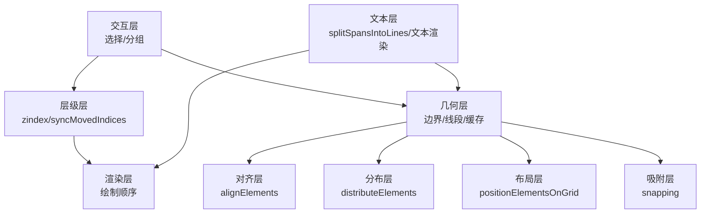

**图表来源**
- [bounds.ts:89-244](file://packages/element/src/bounds.ts#L89-L244)
- [align.ts:17-81](file://packages/element/src/align.ts#L17-L81)
- [distribute.ts:17-112](file://packages/element/src/distribute.ts#L17-L112)
- [positionElementsOnGrid.ts:7-113](file://packages/element/src/positionElementsOnGrid.ts#L7-L113)
- [snapping.ts:692-1316](file://packages/excalidraw/snapping.ts#L692-L1316)
- [zindex.ts:566-605](file://packages/element/src/zindex.ts#L566-L605)
- [renderElement.ts:618](file://packages/element/src/renderElement.ts#L618)
- [staticSvgScene.ts:702](file://packages/excalidraw/renderer/staticSvgScene.ts#L702)
- [textElement.ts:47-65](file://packages/element/src/textElement.ts#L47-L65)

## 详细组件分析

### 尺寸辅助与最小可见尺寸检测
- 最小不可见尺寸检测：针对线性/自由绘制元素，判断点数与端点距离；矩形类则以宽高为零判定
- 完美形状锁定：根据当前拖拽角度，将线/箭头/自由绘制约束到水平/垂直/对角线
- 标准化尺寸：统一负宽高的表示，确保 x/y 与宽高一致

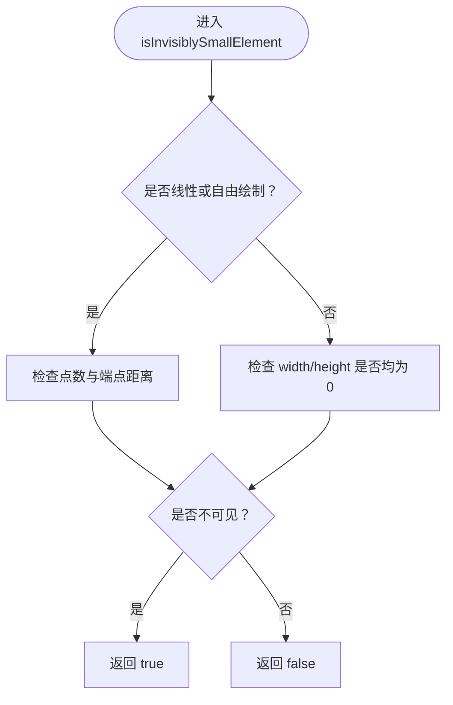

**图表来源**
- [sizeHelpers.ts:30-47](file://packages/element/src/sizeHelpers.ts#L30-L47)

**章节来源**
- [sizeHelpers.ts:25-254](file://packages/element/src/sizeHelpers.ts#L25-L254)

### 尺寸验证与完美形状锁定
- 角度锁定：基于固定步长对角度取整，生成水平/垂直/对角线方向
- 垂直/水平锁定：当角度接近时直接置零对应边长
- 斜线锁定：通过两条直线求交点，得到精确的宽度/高度增量

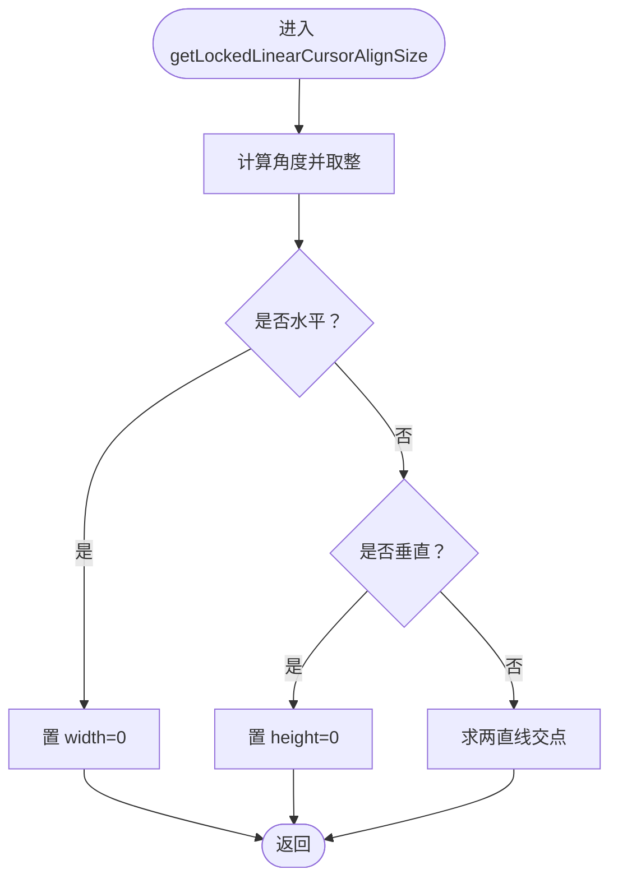

**图表来源**
- [sizeHelpers.ts:156-223](file://packages/element/src/sizeHelpers.ts#L156-L223)

**章节来源**
- [sizeHelpers.ts:127-223](file://packages/element/src/sizeHelpers.ts#L127-L223)

### 边界与线段化
- 边界缓存：弱映射缓存元素版本与边界，避免重复计算
- 线段化：将曲线/多段线/椭圆等转为线段集合，支持帧/碰撞等场景
- 绝对坐标：考虑旋转与平移，返回四个角点与中心点

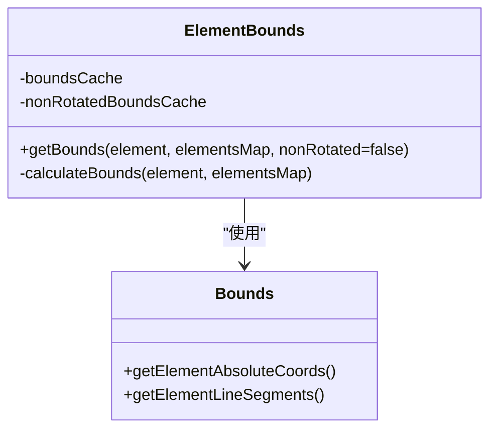

**图表来源**
- [bounds.ts:89-244](file://packages/element/src/bounds.ts#L89-L244)
- [bounds.ts:250-291](file://packages/element/src/bounds.ts#L250-L291)
- [bounds.ts:303-419](file://packages/element/src/bounds.ts#L303-L419)

**章节来源**
- [bounds.ts:89-244](file://packages/element/src/bounds.ts#L89-L244)

### 对齐与分布
- 对齐：按选区边界在 x/y 轴上进行起点/终点/居中对齐，同时更新绑定文本
- 分布：沿 x/y 轴在组内均匀分布，处理重叠导致的负步长情形

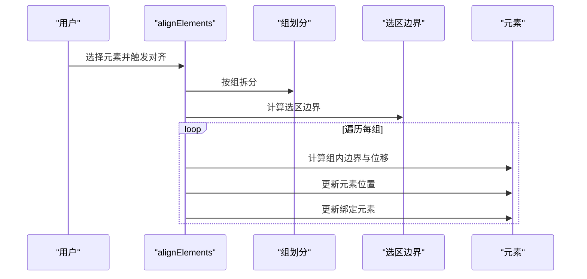

**图表来源**
- [align.ts:17-81](file://packages/element/src/align.ts#L17-L81)

**章节来源**
- [align.ts:17-81](file://packages/element/src/align.ts#L17-L81)
- [distribute.ts:17-112](file://packages/element/src/distribute.ts#L17-L112)

### 层级管理与 z-index 计算
- 移动到最前/最后：支持逐个移动与整体移动，考虑帧/组/绑定元素
- 同步索引：移动后通过分数索引同步，保证绘制顺序稳定
- 箭头层级提升：当与可绑定元素相交时，将箭头置于其上方

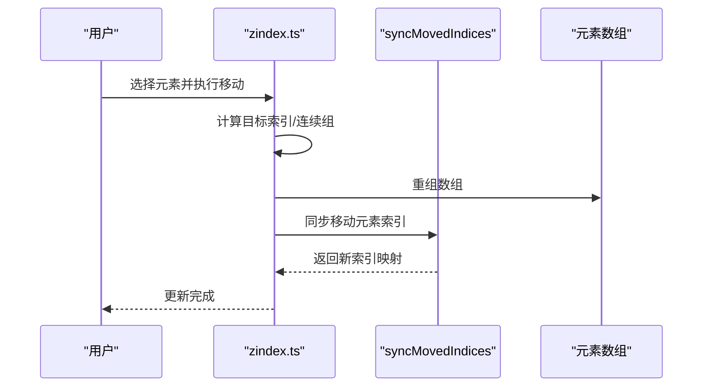

**图表来源**
- [zindex.ts:316-395](file://packages/element/src/zindex.ts#L316-L395)
- [zindex.ts:397-481](file://packages/element/src/zindex.ts#L397-L481)
- [zindex.ts:566-605](file://packages/element/src/zindex.ts#L566-L605)

**章节来源**
- [zindex.ts:1-605](file://packages/element/src/zindex.ts#L1-L605)

### 元素排序与绘制顺序
- 分组碎片化与展开：按组层级从外到内展开，保持首次出现顺序
- 文本与容器顺序规范化：确保容器与其绑定文本的相对顺序

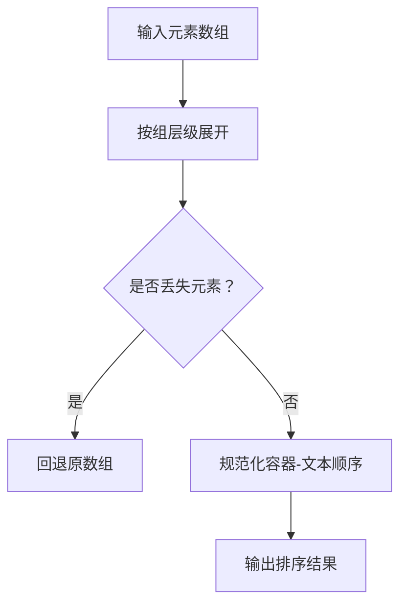

**图表来源**
- [sortElements.ts:5-54](file://packages/element/src/sortElements.ts#L5-L54)
- [sortElements.ts:65-120](file://packages/element/src/sortElements.ts#L65-L120)

**章节来源**
- [sortElements.ts:1-120](file://packages/element/src/sortElements.ts#L1-L120)

### 文本处理与换行分割
- 文本换行分割：将包含换行符的 TextSpan 数组拆分为多行，每行是一个 TextSpan 数组
- 多色文本渲染：支持不同颜色的文本片段在同一行内渲染
- 文本测量：计算文本宽度和高度，支持容器绑定和自动调整大小

**重要更新**：文本输入颜色设置功能已被移除
- 颜色设置功能不再支持：文本编辑器不再提供颜色选择器
- 替代方案：使用元素颜色设置功能（strokeColor 和 backgroundColor）
- 兼容性：现有 TextSpan 的 color 字段仍然存在但不会影响文本颜色显示

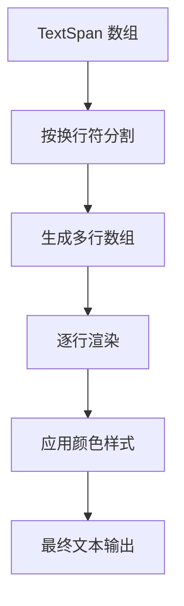

**图表来源**
- [textElement.ts:47-65](file://packages/element/src/textElement.ts#L47-L65)

**章节来源**
- [textElement.ts:47-65](file://packages/element/src/textElement.ts#L47-L65)
- [textEditorState.ts:53-91](file://packages/excalidraw/wysiwyg/textEditorState.ts#L53-L91)

### 元素网格对齐与智能吸附
- 网格布局：按平方根估算列数，行列内等距排列，支持单位间与行间间距
- 智能吸附：基于参考元素角点与间隙，计算最近吸附偏移与吸附线

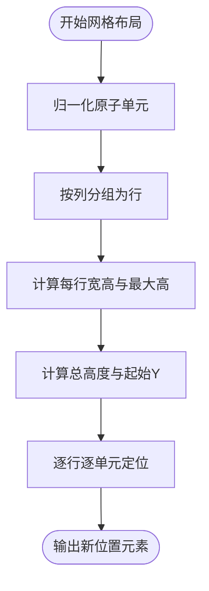

**图表来源**
- [positionElementsOnGrid.ts:7-113](file://packages/element/src/positionElementsOnGrid.ts#L7-L113)

**章节来源**
- [positionElementsOnGrid.ts:1-113](file://packages/element/src/positionElementsOnGrid.ts#L1-L113)

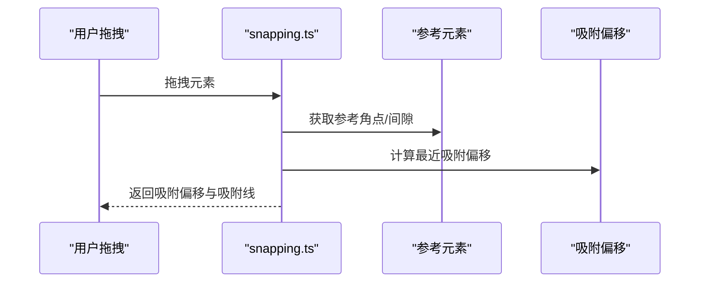

**图表来源**
- [snapping.ts:692-801](file://packages/excalidraw/snapping.ts#L692-L801)
- [snapping.ts:1318-1316](file://packages/excalidraw/snapping.ts#L1318-L1316)

**章节来源**
- [snapping.ts:459-1339](file://packages/excalidraw/snapping.ts#L459-L1339)

### 元素选择机制（单选/多选/范围选择）
- 单选：点击未选中元素切换为该元素
- 多选：按住 Ctrl/Cmd 点击添加到选区
- 范围选择：Shift 点击在上次选中项与当前项之间全选

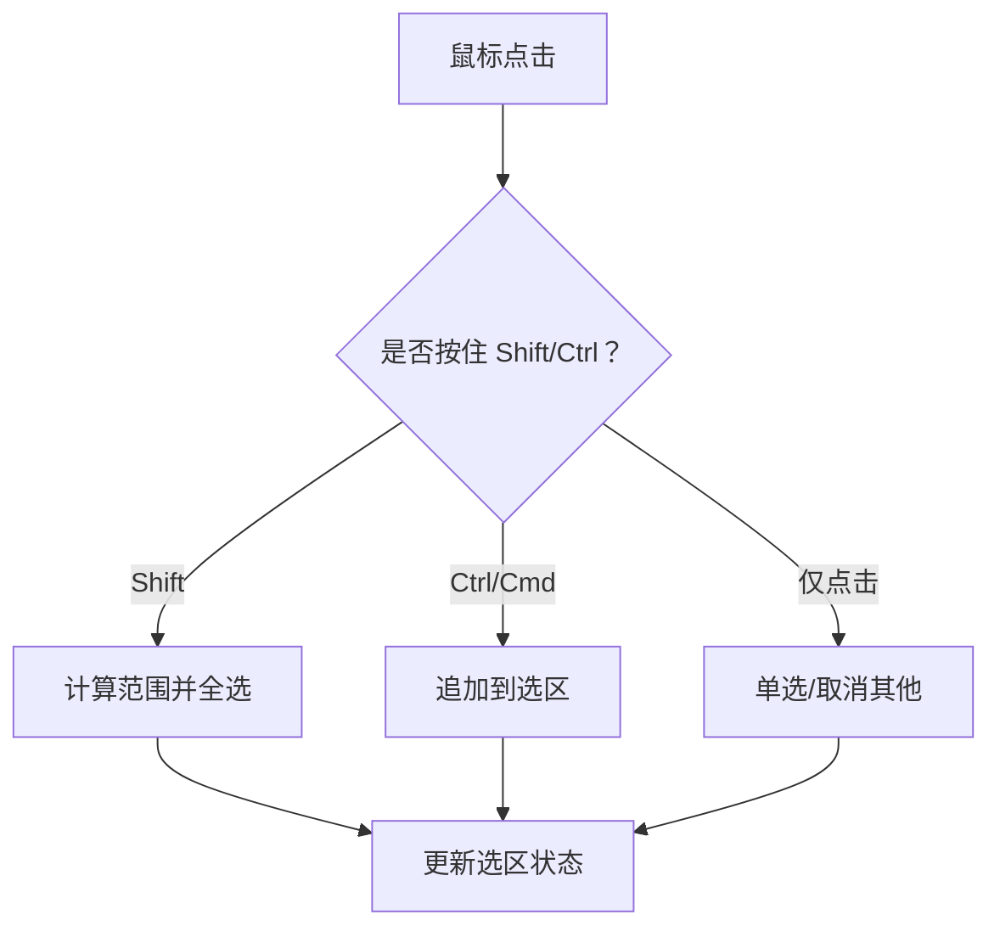

**图表来源**
- [LibraryMenuItems.tsx:135-181](file://packages/excalidraw/components/LibraryMenuItems.tsx#L135-L181)

**章节来源**
- [LibraryMenuItems.tsx:135-181](file://packages/excalidraw/components/LibraryMenuItems.tsx#L135-L181)
- [selection.test.tsx:707-760](file://packages/excalidraw/tests/selection.test.tsx#L707-L760)

### 元素分组与解组
- 成组：为选中元素分配同一组 ID，并移动到当前层级末尾
- 解组：移除所选组 ID 并恢复层级

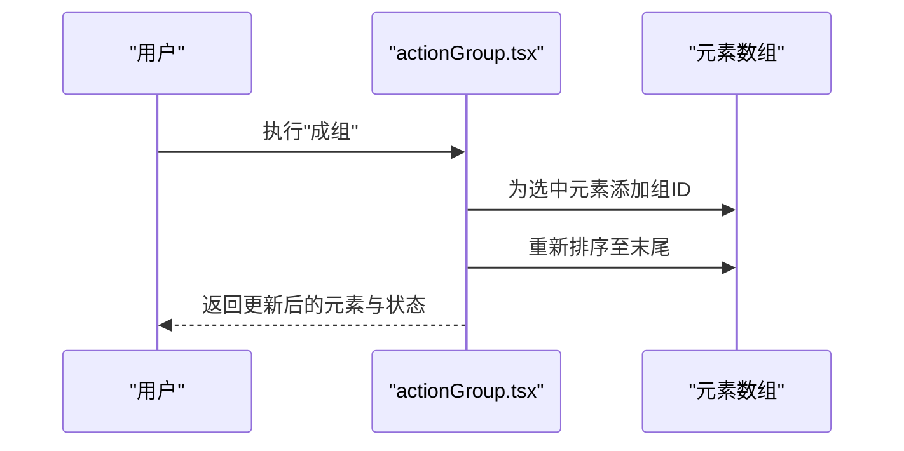

**图表来源**
- [actionGroup.tsx:151-196](file://packages/excalidraw/actions/actionGroup.tsx#L151-L196)

**章节来源**
- [actionGroup.tsx:151-229](file://packages/excalidraw/actions/actionGroup.tsx#L151-L229)

### 缓存与性能优化
- 边界缓存：弱映射缓存元素版本与边界，避免重复计算
- 命中检测缓存：阈值变化或版本变化时失效
- 渲染缓存：元素画布缓存按主题、标签等条件决定是否重建

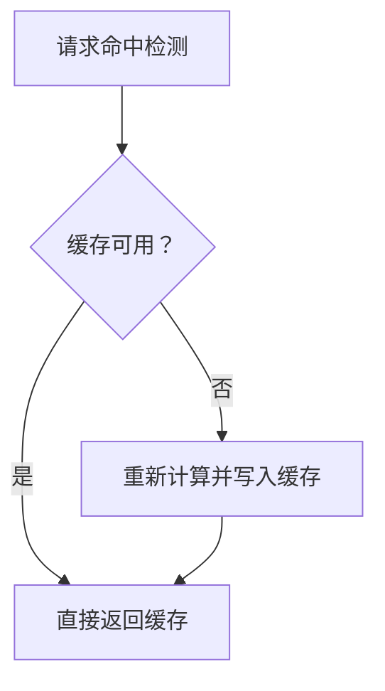

**图表来源**
- [bounds.ts:89-149](file://packages/element/src/bounds.ts#L89-L149)
- [collision.test.tsx:98-162](file://packages/element/tests/collision.test.tsx#L98-L162)
- [renderElement.ts:702-738](file://packages/element/src/renderElement.ts#L702-L738)

**章节来源**
- [bounds.ts:89-149](file://packages/element/src/bounds.ts#L89-L149)
- [collision.test.tsx:98-162](file://packages/element/tests/collision.test.tsx#L98-L162)
- [renderElement.ts:702-738](file://packages/element/src/renderElement.ts#L702-L738)

## 依赖关系分析
- 工具入口 index.ts 导出尺寸、边界、对齐、分布、层级、排序、网格、文本处理等工具
- zindex.ts 依赖分数索引同步工具与组管理
- align/distribute 依赖边界工具与组划分
- textElement.ts 提供文本换行分割功能，被渲染器广泛使用
- snapping 依赖参考元素与角点/间隙计算
- 选择与分组由 UI 层触发，调用相应工具函数

```mermaid
graph LR
IN["index.ts"] --> SH["sizeHelpers.ts"]
IN --> BD["bounds.ts"]
IN --> AL["align.ts"]
IN --> DR["distribute.ts"]
IN --> ZI["zindex.ts"]
IN --> SO["sortElements.ts"]
IN --> PG["positionElementsOnGrid.ts"]
IN --> TE["textElement.ts"]
IN --> TES["textEditorState.ts"]
IN --> RE["renderElement.ts"]
IN --> SS["staticSvgScene.ts"]
ZI --> SO
AL --> BD
DR --> BD
PG --> BD
TE --> BD
RE --> TE
SS --> TE
```

**图表来源**
- [index.ts:57-103](file://packages/element/src/index.ts#L57-L103)
- [zindex.ts:1-605](file://packages/element/src/zindex.ts#L1-L605)
- [align.ts:1-81](file://packages/element/src/align.ts#L1-L81)
- [distribute.ts:1-112](file://packages/element/src/distribute.ts#L1-L112)
- [positionElementsOnGrid.ts:1-113](file://packages/element/src/positionElementsOnGrid.ts#L1-L113)
- [textElement.ts:47-65](file://packages/element/src/textElement.ts#L47-L65)
- [textEditorState.ts:53-91](file://packages/excalidraw/wysiwyg/textEditorState.ts#L53-L91)
- [renderElement.ts:618](file://packages/element/src/renderElement.ts#L618)
- [staticSvgScene.ts:702](file://packages/excalidraw/renderer/staticSvgScene.ts#L702)

**章节来源**
- [index.ts:57-103](file://packages/element/src/index.ts#L57-L103)

## 性能考量
- 使用边界缓存与命中检测缓存减少重复计算
- 在层级移动时批量同步索引，避免多次重排
- 对齐/分布按组处理，减少对未受影响元素的影响
- 网格布局采用行优先与等距策略，复杂度与元素数量线性相关
- 文本换行分割采用一次遍历算法，时间复杂度为 O(n)，其中 n 为文本长度

## 故障排查指南
- 无法选中透明/裁剪元素：检查选择区域是否落在元素实际边界内
- 对齐/分布无效：确认元素是否被分组，必要时按组分别处理
- 层级错乱：检查是否存在绑定/容器影响，使用层级规范化工具
- 吸附不生效：确认缩放级别与吸附阈值，检查参考元素是否可见
- 文本换行异常：检查 TextSpan 数组中换行符的处理，确认颜色属性正确传递
- 多色文本渲染错误：验证 TextSpan 数组的结构和颜色属性设置
- **文本颜色设置问题**：文本输入颜色设置功能已被移除，请使用元素颜色设置功能替代

**章节来源**
- [selection.test.tsx:707-760](file://packages/excalidraw/tests/selection.test.tsx#L707-L760)
- [collision.test.tsx:98-162](file://packages/element/tests/collision.test.tsx#L98-L162)
- [textElement.ts:47-65](file://packages/element/src/textElement.ts#L47-L65)
- [faq.mdx:25-46](file://dev-docs/docs/@excalidraw/excalidraw/faq.mdx#L25-L46)

## 结论
本文档梳理了 Excalidraw 元素工具函数的核心能力与实现要点，涵盖尺寸验证、边界计算、对齐分布、层级管理、网格吸附、文本处理与缓存优化。新增的文本换行分割功能为富文本渲染提供了基础支持，使文本处理更加灵活和高效。这些工具共同保障了元素操作的准确性与性能，为扩展与二次开发提供了清晰的接口与路径。

**重要更新**：文本输入颜色设置功能已被移除，开发者应使用元素级别的颜色设置功能（strokeColor 和 backgroundColor）来控制文本颜色。现有 TextSpan 的 color 字段将继续存在但不会影响文本颜色显示。

## 附录
- 常用工具导出入口：参见工具入口文件的导出列表
- 关键 API 参考：
  - 尺寸与边界：最小不可见尺寸检测、完美形状锁定、标准化尺寸、边界缓存
  - 对齐与分布：对齐到选区边界、沿轴向均匀分布
  - 层级与排序：移动到最前/最后、逐个移动、层级规范化
  - 网格与吸附：网格布局排列、智能吸附与间隙对齐
  - 文本处理：文本换行分割、多色文本渲染、文本测量与容器绑定
  - 选择与分组：单选/多选/范围选择、成组与解组
  - 缓存与性能：边界缓存、命中检测缓存、元素画布缓存

**章节来源**
- [index.ts:57-103](file://packages/element/src/index.ts#L57-L103)