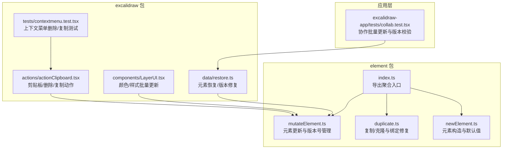
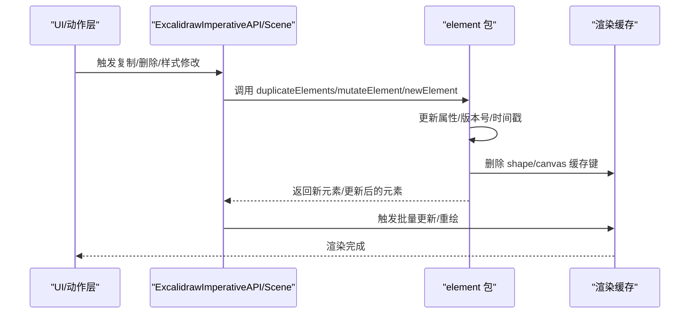
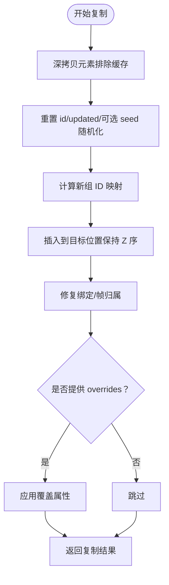
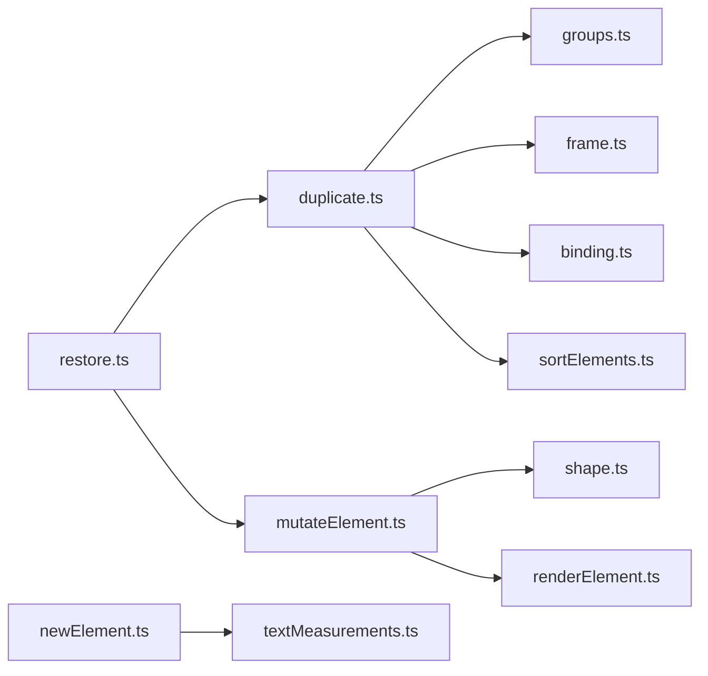

# 元素操作 API

<cite>
**本文引用的文件**
- [packages/element/src/mutateElement.ts](file://packages/element/src/mutateElement.ts)
- [packages/element/src/duplicate.ts](file://packages/element/src/duplicate.ts)
- [packages/element/src/newElement.ts](file://packages/element/src/newElement.ts)
- [packages/element/src/index.ts](file://packages/element/src/index.ts)
- [packages/excalidraw/actions/actionClipboard.tsx](file://packages/excalidraw/actions/actionClipboard.tsx)
- [packages/excalidraw/components/LayerUI.tsx](file://packages/excalidraw/components/LayerUI.tsx)
- [packages/excalidraw/tests/contextmenu.test.tsx](file://packages/excalidraw/tests/contextmenu.test.tsx)
- [packages/excalidraw/data/restore.ts](file://packages/excalidraw/data/restore.ts)
- [excalidraw-app/tests/collab.test.tsx](file://excalidraw-app/tests/collab.test.tsx)
</cite>

## 目录

1. [简介](#简介)
2. [项目结构](#项目结构)
3. [核心组件](#核心组件)
4. [架构总览](#架构总览)
5. [详细组件分析](#详细组件分析)
6. [依赖关系分析](#依赖关系分析)
7. [性能考量](#性能考量)
8. [故障排查指南](#故障排查指南)
9. [结论](#结论)
10. [附录：API 参考与最佳实践](#附录api-参考与最佳实践)

## 简介

本文件面向开发者，系统化梳理 Excalidraw 中“元素操作 API”的设计与实现，覆盖以下主题：

- 元素创建、修改、删除、复制的 API 与流程
- mutateElement 的参数、行为与事务性版本号管理
- 批量更新与协作场景下的事务性保障
- 元素克隆与复制机制（深拷贝、组/容器/帧绑定的处理）
- 元素状态变更的监听与回调机制
- 错误处理与异常边界
- 性能优化策略与批量更新技巧

## 项目结构

围绕元素操作的关键模块与文件如下：

- element 包：元素创建、更新、复制、排序、缓存等核心逻辑
- excalidraw 包：UI 与动作层对元素操作的调用与集成
- 数据恢复与协作测试：验证版本号、批量更新与回放一致性

图表来源

- [packages/element/src/mutateElement.ts:1-199](file://packages/element/src/mutateElement.ts#L1-L199)
- [packages/element/src/duplicate.ts:1-508](file://packages/element/src/duplicate.ts#L1-L508)
- [packages/element/src/newElement.ts:1-547](file://packages/element/src/newElement.ts#L1-L547)
- [packages/element/src/index.ts:1-103](file://packages/element/src/index.ts#L1-L103)
- [packages/excalidraw/actions/actionClipboard.tsx:91-140](file://packages/excalidraw/actions/actionClipboard.tsx#L91-L140)
- [packages/excalidraw/components/LayerUI.tsx:506-543](file://packages/excalidraw/components/LayerUI.tsx#L506-L543)
- [packages/excalidraw/tests/contextmenu.test.tsx:387-425](file://packages/excalidraw/tests/contextmenu.test.tsx#L387-L425)
- [packages/excalidraw/data/restore.ts:413-781](file://packages/excalidraw/data/restore.ts#L413-L781)
- [excalidraw-app/tests/collab.test.tsx:91-175](file://excalidraw-app/tests/collab.test.tsx#L91-L175)

章节来源

- [packages/element/src/index.ts:1-103](file://packages/element/src/index.ts#L1-L103)

## 核心组件

- mutateElement：对单个元素进行属性更新，维护版本号与时间戳，并清理相关渲染缓存
- newElement 系列：按类型创建元素，设置默认属性与初始尺寸
- duplicateElements/duplicateElement：复制元素并处理组、帧、绑定关系；支持随机化种子与版本提升
- restoreElements：从外部数据恢复元素，修复绑定与可见性

章节来源

- [packages/element/src/mutateElement.ts:30-149](file://packages/element/src/mutateElement.ts#L30-L149)
- [packages/element/src/newElement.ts:159-547](file://packages/element/src/newElement.ts#L159-L547)
- [packages/element/src/duplicate.ts:61-91](file://packages/element/src/duplicate.ts#L61-L91)
- [packages/element/src/duplicate.ts:93-422](file://packages/element/src/duplicate.ts#L93-L422)
- [packages/excalidraw/data/restore.ts:413-781](file://packages/excalidraw/data/restore.ts#L413-L781)

## 架构总览

元素操作贯穿三层：

- 应用层（UI/动作）：触发元素操作（复制、删除、样式批量修改）
- 元素层（element 包）：执行具体操作（创建、更新、复制、恢复）
- 渲染层（缓存与重绘）：根据版本号与缓存失效策略触发更新

图表来源

- [packages/element/src/mutateElement.ts:38-149](file://packages/element/src/mutateElement.ts#L38-L149)
- [packages/element/src/duplicate.ts:93-422](file://packages/element/src/duplicate.ts#L93-L422)
- [packages/element/src/newElement.ts:159-547](file://packages/element/src/newElement.ts#L159-L547)

## 详细组件分析

### mutateElement：元素更新与事务性版本号

- 功能要点
  - 接收目标元素、元素映射、待更新字段与可选选项
  - 对特定类型（如肘形箭头）自动计算点列或角度以保持几何一致
  - 智能比较：跳过未变化的属性，避免不必要的重绘
  - 维护版本号与随机 nonce，记录更新时间戳
  - 根据更新字段删除相关渲染缓存键（形状/画布）
- 参数与返回
  - 参数：element、elementsMap、updates、options
  - 返回：原地更新后的元素（若无变化则返回原对象）
- 事务性与协作
  - 版本号递增与随机 nonce 用于协作冲突检测与合并
  - 文档注释明确：不触发组件更新，需由上层场景 API 或 imperative API 触发

```mermaid
flowchart TD
Start(["进入 mutateElement"]) --> Normalize["处理特殊类型更新如肘形箭头/线段"]
Normalize --> Loop["遍历 updates 字段"]
Loop --> Compare{"属性是否变化？"}
Compare --> |否| Next["跳过该字段"]
Compare --> |是| Assign["写入元素属性"]
Assign --> Mark["标记已变更"]
Next --> Loop
Loop --> Done{"是否有变更？"}
Done --> |否| ReturnSame["返回原对象"]
Done --> |是| Invalidate["删除相关缓存键"]
Invalidate --> Version["更新版本号/nonce/updated"]
Version --> ReturnNew["返回更新后对象"]
```

图表来源

- [packages/element/src/mutateElement.ts:38-149](file://packages/element/src/mutateElement.ts#L38-L149)

章节来源

- [packages/element/src/mutateElement.ts:30-149](file://packages/element/src/mutateElement.ts#L30-L149)

### 新元素创建：newElement 系列

- 能力范围
  - 支持矩形、文本、自由绘制、线段、箭头、图像、帧、iframe、可嵌入等类型
  - 设置默认属性（颜色、透明度、描边、圆角、锁定、索引等）
  - 文本元素自动测量尺寸与位置偏移，支持自动换行与容器约束
- 关键点
  - 使用 newElementWith 进行轻量级属性合并与版本号生成
  - 图像元素默认状态与裁剪、缩放字段初始化

章节来源

- [packages/element/src/newElement.ts:159-547](file://packages/element/src/newElement.ts#L159-L547)

### 复制与克隆：duplicateElements/duplicateElement

- 机制概述
  - duplicateElement：深拷贝元素（排除不可序列化缓存），重置 id 与 updated，可随机化 seed 并提升版本
  - duplicateElements：批量复制，考虑组、帧、绑定关系，维持 Z 序与父子/容器关系
  - 深拷贝策略：仅克隆普通对象与数组，跳过缓存字段，避免跨实例共享引用
- 关键流程
  - 计算新组 ID 映射，确保复制后组层级正确
  - 修复复制后的绑定关系与帧归属
  - 可通过 overrides 在复制后进一步调整属性

图表来源

- [packages/element/src/duplicate.ts:61-91](file://packages/element/src/duplicate.ts#L61-L91)
- [packages/element/src/duplicate.ts:93-422](file://packages/element/src/duplicate.ts#L93-L422)
- [packages/element/src/duplicate.ts:424-508](file://packages/element/src/duplicate.ts#L424-L508)

章节来源

- [packages/element/src/duplicate.ts:61-91](file://packages/element/src/duplicate.ts#L61-L91)
- [packages/element/src/duplicate.ts:93-422](file://packages/element/src/duplicate.ts#L93-L422)
- [packages/element/src/duplicate.ts:424-508](file://packages/element/src/duplicate.ts#L424-L508)

### 删除与上下文菜单集成

- 上下文菜单“删除”会将元素标记为删除状态
- 剪贴板动作在粘贴失败时记录错误消息并返回最终态

章节来源

- [packages/excalidraw/tests/contextmenu.test.tsx:387-425](file://packages/excalidraw/tests/contextmenu.test.tsx#L387-L425)
- [packages/excalidraw/actions/actionClipboard.tsx:91-140](file://packages/excalidraw/actions/actionClipboard.tsx#L91-L140)

### 元素状态变更监听与回调

- 样式面板在字体加载完成后触发一次批量更新，结合状态批处理减少重绘
- 颜色拾取器在批量修改多个元素颜色时，先清理缓存再统一触发场景更新

章节来源

- [packages/excalidraw/components/LayerUI.tsx:506-543](file://packages/excalidraw/components/LayerUI.tsx#L506-L543)

### 协作与批量更新的事务性保障

- 测试验证：连续两次远程更新会被批处理为一次组件更新，且每次微动作都会产生临时增量
- 版本号与 nonce：每次更新递增版本并生成新的随机 nonce，确保并发冲突可识别

章节来源

- [excalidraw-app/tests/collab.test.tsx:91-175](file://excalidraw-app/tests/collab.test.tsx#L91-L175)

## 依赖关系分析

- mutateElement 依赖 shape 与渲染缓存模块，确保尺寸/点列变化时及时失效缓存
- duplicateElements 依赖分组、帧、绑定修复工具，确保复制后拓扑关系正确
- newElement 系列依赖默认属性与文本测量工具，确保创建即合理
- 恢复流程依赖版本修复与绑定修复，保证跨版本/跨设备一致性

图表来源

- [packages/element/src/mutateElement.ts:1-28](file://packages/element/src/mutateElement.ts#L1-L28)
- [packages/element/src/duplicate.ts:16-46](file://packages/element/src/duplicate.ts#L16-L46)
- [packages/element/src/newElement.ts:20-26](file://packages/element/src/newElement.ts#L20-L26)
- [packages/excalidraw/data/restore.ts:413-781](file://packages/excalidraw/data/restore.ts#L413-L781)

章节来源

- [packages/element/src/mutateElement.ts:1-28](file://packages/element/src/mutateElement.ts#L1-L28)
- [packages/element/src/duplicate.ts:16-46](file://packages/element/src/duplicate.ts#L16-L46)
- [packages/element/src/newElement.ts:20-26](file://packages/element/src/newElement.ts#L20-L26)
- [packages/excalidraw/data/restore.ts:413-781](file://packages/excalidraw/data/restore.ts#L413-L781)

## 性能考量

- 智能更新与缓存失效
  - mutateElement 仅在属性实际变化时写入并更新版本号
  - 根据更新字段删除 shape/canvas 缓存键，避免陈旧渲染
- 批处理与状态合并
  - UI 层对多次样式修改进行状态批处理，减少重绘次数
  - 协作场景中微动作被批处理为一次组件更新，降低抖动
- 深拷贝与不可变性
  - duplicateElements 使用深拷贝断绝引用，避免意外共享状态
  - 仅克隆必要字段，跳过缓存字段，兼顾性能与安全

章节来源

- [packages/element/src/mutateElement.ts:78-149](file://packages/element/src/mutateElement.ts#L78-L149)
- [packages/element/src/duplicate.ts:424-508](file://packages/element/src/duplicate.ts#L424-L508)
- [packages/excalidraw/components/LayerUI.tsx:1214-1216](file://packages/excalidraw/components/LayerUI.tsx#L1214-L1216)
- [excalidraw-app/tests/collab.test.tsx:112-142](file://excalidraw-app/tests/collab.test.tsx#L112-L142)

## 故障排查指南

- 更新无效或未触发重绘
  - mutateElement 不会自动触发组件更新，请使用场景 API 或 imperative API 触发更新
  - 确认是否传入了有效的 elementsMap 与更新字段
- 复制后绑定/帧关系异常
  - 使用 duplicateElements 并确保传入正确的 appState（编辑组、选中组）与映射表
  - 如需自定义复制后属性，使用 overrides 回调
- 文本/图像尺寸异常
  - 文本元素尺寸依赖测量与换行，确认字体、容器宽度与自动换行设置
  - 图像元素裁剪与缩放需同步更新
- 协作冲突与版本错乱
  - 检查版本号与 nonce 是否正确递增
  - 批处理场景下确认微动作是否被合并为一次更新

章节来源

- [packages/element/src/mutateElement.ts:30-37](file://packages/element/src/mutateElement.ts#L30-L37)
- [packages/element/src/duplicate.ts:93-422](file://packages/element/src/duplicate.ts#L93-L422)
- [packages/element/src/newElement.ts:240-292](file://packages/element/src/newElement.ts#L240-L292)
- [packages/excalidraw/data/restore.ts:413-781](file://packages/excalidraw/data/restore.ts#L413-L781)
- [excalidraw-app/tests/collab.test.tsx:112-142](file://excalidraw-app/tests/collab.test.tsx#L112-L142)

## 结论

- mutateElement 提供细粒度、可事务化的元素更新能力，配合版本号与缓存失效策略，既能满足交互流畅性，又能保证协作一致性
- duplicateElements 将复制、组/帧/绑定修复与 Z 序插入整合为统一流程，适合用户 Alt-Drag 与程序化复制
- newElement 系列确保元素创建的一致性与合理性，文本/图像等复杂类型具备完善的默认值与尺寸推导
- UI 层通过状态批处理与协作批处理，显著降低重绘成本并提升用户体验

## 附录：API 参考与最佳实践

### API 参考

- mutateElement(element, elementsMap, updates, options?)
  - 作用：对单个元素进行属性更新，维护版本号与时间戳，清理相关缓存
  - 注意：不会触发组件更新，需由上层场景 API 触发
  - 适用场景：拖拽、吸附、样式修改等
- newElement / newElementWith / 各类型构造函数
  - 作用：创建元素并设置默认属性与初始尺寸
  - 适用场景：工具栏创建、程序化生成
- duplicateElement / duplicateElements
  - 作用：复制元素并修复组/帧/绑定关系，支持 overrides 自定义
  - 适用场景：Alt-Drag 复制、批量复制
- restoreElements / bumpVersion
  - 作用：从外部数据恢复元素，修复绑定与可见性，必要时提升版本号
  - 适用场景：导入、回放、协作同步

章节来源

- [packages/element/src/mutateElement.ts:38-149](file://packages/element/src/mutateElement.ts#L38-L149)
- [packages/element/src/newElement.ts:159-547](file://packages/element/src/newElement.ts#L159-L547)
- [packages/element/src/duplicate.ts:61-91](file://packages/element/src/duplicate.ts#L61-L91)
- [packages/element/src/duplicate.ts:93-422](file://packages/element/src/duplicate.ts#L93-L422)
- [packages/excalidraw/data/restore.ts:413-781](file://packages/excalidraw/data/restore.ts#L413-L781)

### 最佳实践

- 批量更新
  - UI 层对多次样式修改进行状态批处理，减少重绘
  - 协作场景中利用微动作批处理，避免频繁提交
- 缓存管理
  - 更新尺寸/点列/裁剪等字段后，确保相关缓存键被删除
  - 复制元素时依赖深拷贝，避免跨实例共享引用
- 版本控制
  - 依赖版本号与随机 nonce 进行协作冲突检测
  - 必要时显式调用 bumpVersion 提升版本
- 绑定与帧
  - 复制后优先修复绑定与帧归属，再进行 overrides
  - 文本容器与绑定元素应成组处理，保证 Z 序正确

章节来源

- [packages/element/src/mutateElement.ts:131-149](file://packages/element/src/mutateElement.ts#L131-L149)
- [packages/element/src/duplicate.ts:388-422](file://packages/element/src/duplicate.ts#L388-L422)
- [packages/excalidraw/components/LayerUI.tsx:506-543](file://packages/excalidraw/components/LayerUI.tsx#L506-L543)
- [excalidraw-app/tests/collab.test.tsx:112-142](file://excalidraw-app/tests/collab.test.tsx#L112-L142)
