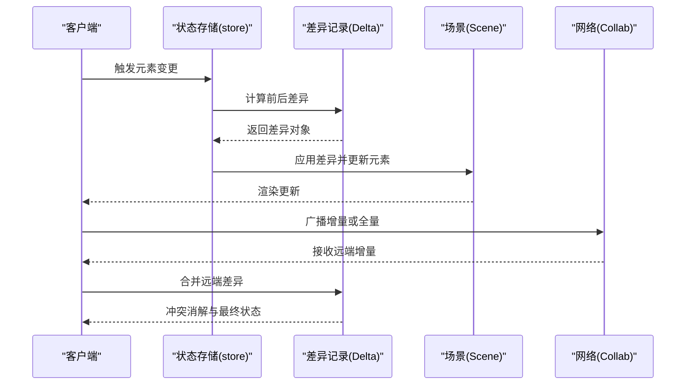
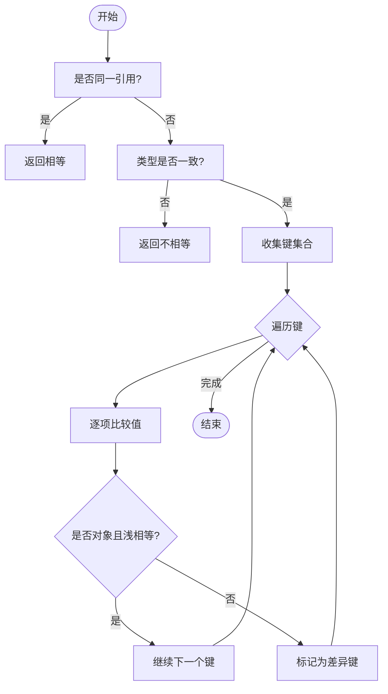
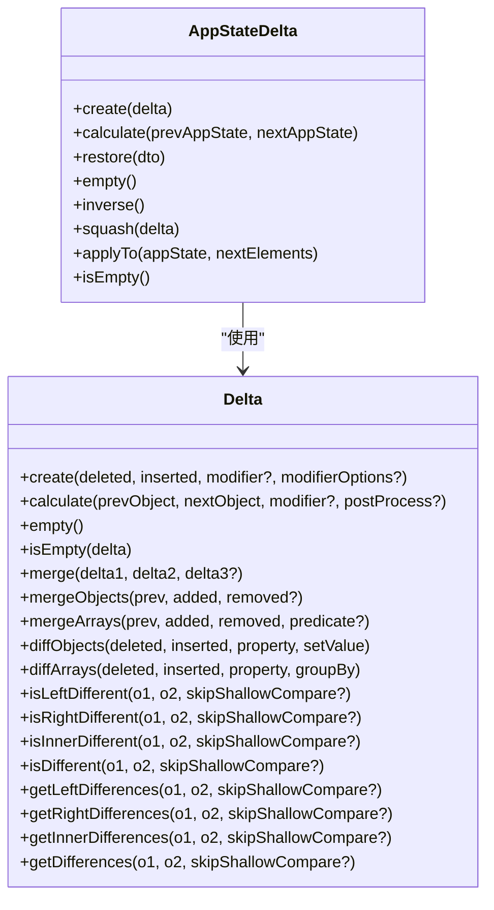
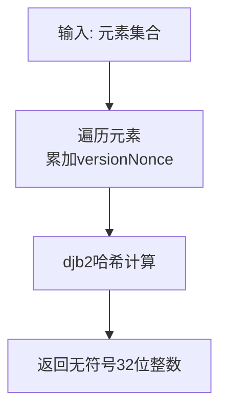
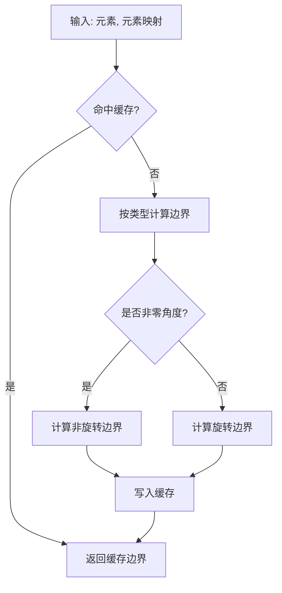
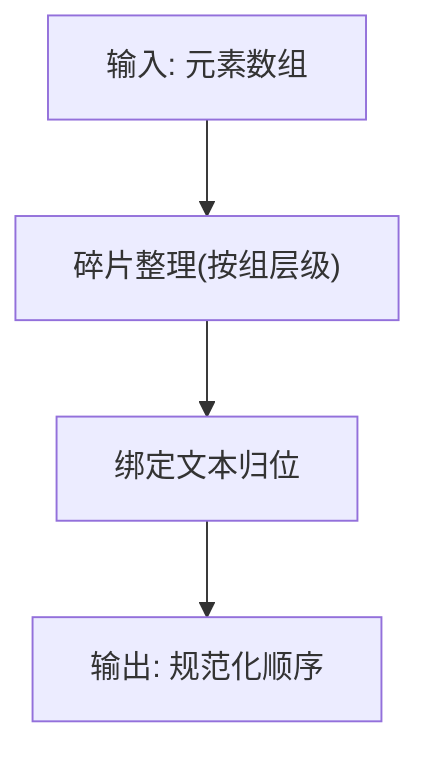
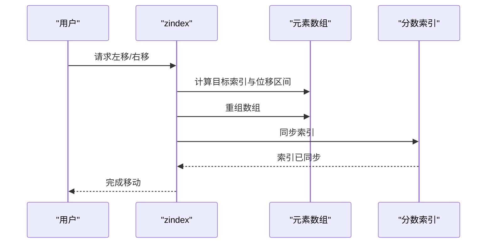
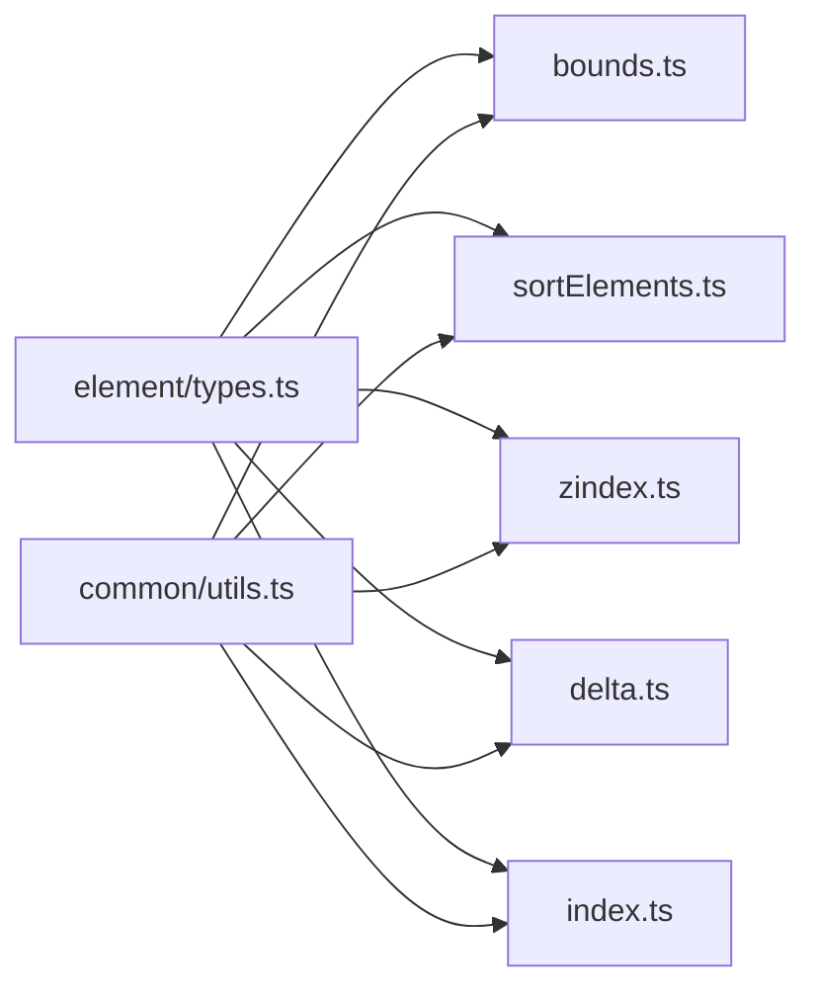

# 元素比较与序列化

<cite>
**本文引用的文件**
- [packages/element/src/index.ts](file://packages/element/src/index.ts)
- [packages/element/src/types.ts](file://packages/element/src/types.ts)
- [packages/common/src/utils.ts](file://packages/common/src/utils.ts)
- [packages/element/src/delta.ts](file://packages/element/src/delta.ts)
- [packages/element/src/bounds.ts](file://packages/element/src/bounds.ts)
- [packages/element/src/sortElements.ts](file://packages/element/src/sortElements.ts)
- [packages/element/src/zindex.ts](file://packages/element/src/zindex.ts)
- [packages/element/src/comparisons.ts](file://packages/element/src/comparisons.ts)
- [packages/element/src/fractionalIndex.ts](file://packages/element/src/fractionalIndex.ts)
- [packages/element/src/store.ts](file://packages/element/src/store.ts)
- [packages/element/src/mutateElement.ts](file://packages/element/src/mutateElement.ts)
- [packages/element/src/textElement.ts](file://packages/element/src/textElement.ts)
- [packages/element/src/linearElementEditor.ts](file://packages/element/src/linearElementEditor.ts)
- [packages/element/src/shape.ts](file://packages/element/src/shape.ts)
- [packages/element/src/utils.ts](file://packages/element/src/utils.ts)
- [packages/element/src/sizeHelpers.ts](file://packages/element/src/sizeHelpers.ts)
- [packages/element/src/renderElement.ts](file://packages/element/src/renderElement.ts)
- [packages/element/src/Scene.ts](file://packages/element/src/Scene.ts)
- [packages/element/src/selection.ts](file://packages/element/src/selection.ts)
- [packages/element/src/group.ts](file://packages/element/src/group.ts)
- [packages/element/src/frame.ts](file://packages/element/src/frame.ts)
- [packages/element/src/binding.ts](file://packages/element/src/binding.ts)
- [packages/element/src/duplicate.ts](file://packages/element/src/duplicate.ts)
- [packages/element/src/resizeElements.ts](file://packages/element/src/resizeElements.ts)
- [packages/element/src/transform.ts](file://packages/element/src/transform.ts)
- [packages/element/src/linearElementEditor.ts](file://packages/element/src/linearElementEditor.ts)
- [packages/element/src/arrowheads.ts](file://packages/element/src/arrowheads.ts)
- [packages/element/src/arrows/helpers.ts](file://packages/element/src/arrows/helpers.ts)
- [packages/element/src/resizeTest.ts](file://packages/element/src/resizeTest.ts)
- [packages/element/src/distance.ts](file://packages/element/src/distance.ts)
- [packages/element/src/collision.ts](file://packages/element/src/collision.ts)
- [packages/element/src/transformHandles.ts](file://packages/element/src/transformHandles.ts)
- [packages/element/src/showSelectedShapeActions.ts](file://packages/element/src/showSelectedShapeActions.ts)
- [packages/element/src/flowchart.ts](file://packages/element/src/flowchart.ts)
- [packages/element/src/heading.ts](file://packages/element/src/heading.ts)
- [packages/element/src/textMeasurements.ts](file://packages/element/src/textMeasurements.ts)
- [packages/element/src/textWrapping.ts](file://packages/element/src/textWrapping.ts)
- [packages/element/src/elementLink.ts](file://packages/element/src/elementLink.ts)
- [packages/element/src/embeddable.ts](file://packages/element/src/embeddable.ts)
- [packages/element/src/image.ts](file://packages/element/src/image.ts)
- [packages/element/src/newElement.ts](file://packages/element/src/newElement.ts)
- [packages/element/src/typeChecks.ts](file://packages/element/src/typeChecks.ts)
- [packages/element/src/utils.ts](file://packages/element/src/utils.ts)
- [packages/element/src/containerCache.ts](file://packages/element/src/containerCache.ts)
- [packages/element/src/cropElement.ts](file://packages/element/src/cropElement.ts)
- [packages/element/src/align.ts](file://packages/element/src/align.ts)
- [packages/element/src/distribute.ts](file://packages/element/src/distribute.ts)
- [packages/element/src/positionElementsOnGrid.ts](file://packages/element/src/positionElementsOnGrid.ts)
- [packages/element/src/dragElements.ts](file://packages/element/src/dragElements.ts)
- [packages/element/src/elbowArrow.ts](file://packages/element/src/elbowArrow.ts)
- [packages/element/src/flowchart.ts](file://packages/element/src/flowchart.ts)
- [packages/element/src/heading.ts](file://packages/element/src/heading.ts)
- [packages/element/src/textMeasurements.ts](file://packages/element/src/textMeasurements.ts)
- [packages/element/src/textWrapping.ts](file://packages/element/src/textWrapping.ts)
- [packages/element/src/elementLink.ts](file://packages/element/src/elementLink.ts)
- [packages/element/src/embeddable.ts](file://packages/element/src/embeddable.ts)
- [packages/element/src/image.ts](file://packages/element/src/image.ts)
- [packages/element/src/newElement.ts](file://packages/element/src/newElement.ts)
- [packages/element/src/typeChecks.ts](file://packages/element/src/typeChecks.ts)
- [packages/element/src/utils.ts](file://packages/element/src/utils.ts)
- [packages/element/src/containerCache.ts](file://packages/element/src/containerCache.ts)
- [packages/element/src/cropElement.ts](file://packages/element/src/cropElement.ts)
- [packages/element/src/align.ts](file://packages/element/src/align.ts)
- [packages/element/src/distribute.ts](file://packages/element/src/distribute.ts)
- [packages/element/src/positionElementsOnGrid.ts](file://packages/element/src/positionElementsOnGrid.ts)
- [packages/element/src/dragElements.ts](file://packages/element/src/dragElements.ts)
- [packages/element/src/elbowArrow.ts](file://packages/element/src/elbowArrow.ts)
- [packages/element/src/flowchart.ts](file://packages/element/src/flowchart.ts)
- [packages/element/src/heading.ts](file://packages/element/src/heading.ts)
- [packages/element/src/textMeasurements.ts](file://packages/element/src/textMeasurements.ts)
- [packages/element/src/textWrapping.ts](file://packages/element/src/textWrapping.ts)
- [packages/element/src/elementLink.ts](file://packages/element/src/elementLink.ts)
- [packages/element/src/embeddable.ts](file://packages/element/src/embeddable.ts)
- [packages/element/src/image.ts](file://packages/element/src/image.ts)
- [packages/element/src/newElement.ts](file://packages/element/src/newElement.ts)
- [packages/element/src/typeChecks.ts](file://packages/element/src/typeChecks.ts)
- [packages/element/src/utils.ts](file://packages/element/src/utils.ts)
- [packages/element/src/containerCache.ts](file://packages/element/src/containerCache.ts)
- [packages/element/src/cropElement.ts](file://packages/element/src/cropElement.ts)
- [packages/element/src/align.ts](file://packages/element/src/align.ts)
- [packages/element/src/distribute.ts](file://packages/element/src/distribute.ts)
- [packages/element/src/positionElementsOnGrid.ts](file://packages/element/src/positionElementsOnGrid.ts)
- [packages/element/src/dragElements.ts](file://packages/element/src/dragElements.ts)
- [packages/element/src/elbowArrow.ts](file://packages/element/src/elbowArrow.ts)
- [packages/element/src/flowchart.ts](file://packages/element/src/flowchart.ts)
- [packages/element/src/heading.ts](file://packages/element/src/heading.ts)
- [packages/element/src/textMeasurements.ts](file://packages/element/src/textMeasurements.ts)
- [packages/element/src/textWrapping.ts](file://packages/element/src/textWrapping.ts)
- [packages/element/src/elementLink.ts](file://packages/element/src/elementLink.ts)
- [packages/element/src/embeddable.ts](file://packages/element/src/embeddable.ts)
- [packages/element/src/image.ts](file://packages/element/src/image.ts)
- [packages/element/src/newElement.ts](file://packages/element/src/newElement.ts)
- [packages/element/src/typeChecks.ts](file://packages/element/src/typeChecks.ts)
- [packages/element/src/utils.ts](file://packages/element/src/utils.ts)
- [packages/element/src/containerCache.ts](file://packages/element/src/containerCache.ts)
- [packages/element/src/cropElement.ts](file://packages/element/src/cropElement.ts)
- [packages/element/src/align.ts](file://packages/element/src/align.ts)
- [packages/element/src/distribute.ts](file://packages/element/src/distribute.ts)
- [packages/element/src/positionElementsOnGrid.ts](file://packages/element/src/positionElementsOnGrid.ts)
- [packages/element/src/dragElements.ts](file://packages/element/src/dragElements.ts)
- [packages/element/src/elbowArrow.ts](file://packages/element/src/elbowArrow.ts)
- [packages/element/src/flowchart.ts](file://packages/element/src/flowchart.ts)
- [packages/element/src/heading.ts](file://packages/element/src/heading.ts)
- [packages/element/src/textMeasurements.ts](file://packages/element/src/textMeasurements.ts)
- [packages/element/src/textWrapping.ts](file://packages/element/src/textWrapping.ts)
- [packages/element/src/elementLink.ts](file://packages/element/src/elementLink.ts)
- [packages/element/src/embeddable.ts](file://packages/element/src/embeddable.ts)
- [packages/element/src/image.ts](file://packages/element/src/image.ts)
- [packages/element/src/newElement.ts](file://packages/element/src/newElement.ts)
- [packages/element/src/typeChecks.ts](file://packages/element/src/typeChecks.ts)
- [packages/element/src/utils.ts](file://packages/element/src/utils.ts)
- [packages/element/src/containerCache.ts](file://packages/element/src/containerCache.ts)
- [packages/element/src/cropElement.ts](file://packages/element/src/cropElement.ts)
- [packages/element/src/align.ts](file://packages/element/src/align.ts)
- [packages/element/src/distribute.ts](file://packages/element/src/distribute.ts)
- [packages/element/src/positionElementsOnGrid.ts](file://packages/element/src/positionElementsOnGrid.ts)
- [packages/element/src/dragElements.ts](file://packages/element/src/dragElements.ts)
- [packages/element/src/elbowArrow.ts](file://packages/element/src/elbowArrow.ts)
- [packages/element/src/flowchart.ts](file://packages/element/src/flowchart.ts)
- [packages/element/src/heading.ts](file://packages/element/src/heading.ts)
- [packages/element/src/textMeasurements.ts](file://packages/element/src/textMeasurements.ts)
- [packages/element/src/textWrapping.ts](file://packages/element/src/textWrapping.ts)
- [packages/element/src/elementLink.ts](file://packages/element/src/elementLink.ts)
- [packages/element/src/embeddable.ts](file://packages/element/src/embeddable.ts)
- [packages/element/src/image.ts](file://packages/element/src/image.ts)
- [packages/element/src/newElement.ts](file://packages/element/src/newElement.ts)
- [packages/element/src/typeChecks.ts](file://packages/element/src/typeChecks.ts)
- [packages/element/src/utils.ts](file://packages/element/src/utils.ts)
- [packages/element/src/containerCache.ts](file://packages/element/src/containerCache.ts)
- [packages/element/src/cropElement.ts](file://packages/element/src/cropElement.ts)
- [packages/element/src/align.ts](file://packages/element/src/align.ts)
- [packages/element/src/distribute.ts](file://packages/element/src/distribute.ts)
- [packages/element/src/positionElementsOnGrid.ts](file://packages/element/src/positionElementsOnGrid.ts)
- [packages/element/src/dragElements.ts](file://packages/element/src/dragElements.ts)
- [packages/element/src/elbowArrow.ts](file://packages/element/src/elbowArrow.ts)
- [packages/element/src/flowchart.ts](file://packages/element/src/flowchart.ts)
- [packages/element/src/heading.ts](file://packages/element/src/heading.ts)
-......
</cite>

## 目录
1. [引言](#引言)
2. [项目结构](#项目结构)
3. [核心组件](#核心组件)
4. [架构总览](#架构总览)
5. [详细组件分析](#详细组件分析)
6. [依赖关系分析](#依赖关系分析)
7. [性能考量](#性能考量)
8. [故障排查指南](#故障排查指南)
9. [结论](#结论)
10. [附录](#附录)

## 引言
本文件聚焦于Excalidraw中“元素比较与序列化”的专业技术主题，系统阐述以下方面：
- 元素相等性判断：深度比较与浅比较的差异、适用场景与性能权衡
- 差异检测机制：面向协作编辑的增量同步与冲突消解
- 元素哈希算法：版本哈希、字符串哈希及在一致性校验中的应用
- 序列化与反序列化：JSON结构规范、版本兼容策略与迁移路径
- 边界计算与包围盒：几何边界、线段分解与旋转处理
- 排序与层级管理：分组、绑定文本、容器顺序与z-index规则
- 压缩与优化策略：缓存、增量记录与传输优化
- 开发者实践：最佳实践、常见问题与性能优化建议

## 项目结构
Excalidraw将“元素”能力拆分为独立的packages/element包，围绕ExcalidrawElement类型及其子类型构建比较、差异、边界、排序、层级、序列化等能力，并通过common包提供通用工具（如浅比较、迭代器、映射转换等）。

```mermaid
graph TB
subgraph "element 包"
Types["types.ts<br/>元素类型定义"]
Comparisons["comparisons.ts<br/>类型判定工具"]
Bounds["bounds.ts<br/>边界与包围盒"]
Sort["sortElements.ts<br/>排序与层级"]
ZIndex["zindex.ts<br/>层级移动与索引"]
Delta["delta.ts<br/>差异检测与合并"]
Index["index.ts<br/>哈希与可见元素"]
Fractional["fractionalIndex.ts<br/>分数索引"]
Store["store.ts<br/>状态快照"]
Mutate["mutateElement.ts<br/>变更应用"]
Text["textElement.ts<br/>文本与容器"]
Linear["linearElementEditor.ts<br/>线性元素编辑"]
Shape["shape.ts<br/>形状生成"]
Utils["utils.ts<br/>通用工具"]
Size["sizeHelpers.ts<br/>尺寸辅助"]
Render["renderElement.ts<br/>渲染"]
Scene["Scene.ts<br/>场景管理"]
Selection["selection.ts<br/>选择"]
Group["groups.ts<br/>分组"]
Frame["frame.ts<br/>框架"]
Binding["binding.ts<br/>绑定"]
Duplicate["duplicate.ts<br/>复制"]
Resize["resizeElements.ts<br/>调整大小"]
Transform["transform.ts<br/>变换"]
Arrowheads["arrowheads.ts<br/>箭头样式"]
Helpers["arrows/helpers.ts<br/>箭头辅助"]
ResizeTest["resizeTest.ts<br/>尺寸测试"]
Distance["distance.ts<br/>距离"]
Collision["collision.ts<br/>碰撞"]
Handles["transformHandles.ts<br/>变换手柄"]
Actions["showSelectedShapeActions.ts<br/>操作显示"]
Flowchart["flowchart.ts<br/>流程图"]
Heading["heading.ts<br/>标题"]
TextMeas["textMeasurements.ts<br/>文本测量"]
TextWrap["textWrapping.ts<br/>文本换行"]
Link["elementLink.ts<br/>元素链接"]
Embed["embeddable.ts<br/>嵌入"]
Image["image.ts<br/>图像"]
NewEl["newElement.ts<br/>新建元素"]
TypeChecks["typeChecks.ts<br/>类型检查"]
end
subgraph "common 包"
CommonUtils["utils.ts<br/>浅比较、迭代、映射等"]
end
Types --> Bounds
Types --> Sort
Types --> ZIndex
Types --> Delta
Types --> Index
Types --> Fractional
Types --> Store
Types --> Mutate
Types --> Text
Types --> Linear
Types --> Shape
Types --> Utils
Types --> Size
Types --> Render
Types --> Scene
Types --> Selection
Types --> Group
Types --> Frame
Types --> Binding
Types --> Duplicate
Types --> Resize
Types --> Transform
Types --> Arrowheads
Types --> Helpers
Types --> ResizeTest
Types --> Distance
Types --> Collision
Types --> Handles
Types --> Actions
Types --> Flowchart
Types --> Heading
Types --> TextMeas
Types --> TextWrap
Types --> Link
Types --> Embed
Types --> Image
Types --> NewEl
Types --> TypeChecks
CommonUtils --> Bounds
CommonUtils --> Sort
CommonUtils --> ZIndex
CommonUtils --> Delta
CommonUtils --> Index
CommonUtils --> Store
CommonUtils --> Mutate
CommonUtils --> Text
CommonUtils --> Linear
CommonUtils --> Shape
CommonUtils --> Utils
CommonUtils --> Size
CommonUtils --> Render
CommonUtils --> Scene
CommonUtils --> Selection
CommonUtils --> Group
CommonUtils --> Frame
CommonUtils --> Binding
CommonUtils --> Duplicate
CommonUtils --> Resize
CommonUtils --> Transform
CommonUtils --> Arrowheads
CommonUtils --> Helpers
CommonUtils --> ResizeTest
CommonUtils --> Distance
CommonUtils --> Collision
CommonUtils --> Handles
CommonUtils --> Actions
CommonUtils --> Flowchart
CommonUtils --> Heading
CommonUtils --> TextMeas
CommonUtils --> TextWrap
CommonUtils --> Link
CommonUtils --> Embed
CommonUtils --> Image
CommonUtils --> NewEl
CommonUtils --> TypeChecks
```

图表来源
- [packages/element/src/types.ts:223-233](file://packages/element/src/types.ts#L223-L233)
- [packages/element/src/bounds.ts:1-100](file://packages/element/src/bounds.ts#L1-L100)
- [packages/element/src/sortElements.ts:1-120](file://packages/element/src/sortElements.ts#L1-L120)
- [packages/element/src/zindex.ts:1-120](file://packages/element/src/zindex.ts#L1-L120)
- [packages/element/src/delta.ts:1-120](file://packages/element/src/delta.ts#L1-L120)
- [packages/element/src/index.ts:1-103](file://packages/element/src/index.ts#L1-L103)
- [packages/common/src/utils.ts:840-895](file://packages/common/src/utils.ts#L840-L895)

章节来源
- [packages/element/src/types.ts:223-233](file://packages/element/src/types.ts#L223-L233)
- [packages/common/src/utils.ts:840-895](file://packages/common/src/utils.ts#L840-L895)

## 核心组件
- 元素类型与版本字段：ExcalidrawElement包含id、x/y、width/height、angle、seed、version、versionNonce、index、isDeleted、groupIds、frameId、boundElements、updated、link、locked、customData等，其中version与versionNonce用于协作与保存时的去重与确定性合并。
- 比较与差异：使用浅比较（isShallowEqual）进行快速属性对比；Delta类提供对象差异检测、左右/内/全连接差异键集提取、差异合并与应用。
- 边界与包围盒：ElementBounds根据元素类型与角度计算边界，支持缓存以提升性能；getElementLineSegments将元素形状分解为线段，便于精确碰撞检测。
- 排序与层级：normalizeElementOrder结合分组碎片整理与绑定文本归位，确保容器与绑定文本的相对顺序稳定；zindex模块负责上下移动、移至端点与帧内移动，配合分数索引保持顺序一致性。
- 哈希与可见性：hashElementsVersion基于versionNonce的djb2哈希，保证顺序敏感；hashString提供字符串哈希；getVisibleElements过滤不可见元素。
- 变更与应用：DeltaContainer接口与AppStateDelta实现，支持逆向、合并、应用到前一状态并过滤不可见变化。

章节来源
- [packages/element/src/types.ts:40-82](file://packages/element/src/types.ts#L40-L82)
- [packages/common/src/utils.ts:840-895](file://packages/common/src/utils.ts#L840-L895)
- [packages/element/src/delta.ts:75-141](file://packages/element/src/delta.ts#L75-L141)
- [packages/element/src/bounds.ts:89-149](file://packages/element/src/bounds.ts#L89-L149)
- [packages/element/src/sortElements.ts:115-120](file://packages/element/src/sortElements.ts#L115-L120)
- [packages/element/src/zindex.ts:566-605](file://packages/element/src/zindex.ts#L566-L605)
- [packages/element/src/index.ts:18-41](file://packages/element/src/index.ts#L18-L41)

## 架构总览
协作与本地更新的典型流程如下：

图表来源
- [packages/element/src/store.ts](file://packages/element/src/store.ts)
- [packages/element/src/delta.ts:524-710](file://packages/element/src/delta.ts#L524-L710)
- [packages/element/src/Scene.ts](file://packages/element/src/Scene.ts)

## 详细组件分析

### 组件A：元素相等性判断（深度 vs 浅比较）
- 浅比较（isShallowEqual）：对对象第一层属性逐一比较，若为对象且非null，可选择跳过深比较直接视为相等，适合频繁调用的快速路径。
- 深度比较（deepEqual）：递归比较所有层级，适用于需要严格等价性的场景（调试、断言）。
- 在差异检测中，Delta的distinctKeysIterator默认采用浅比较策略，仅当属性为对象且浅相等时才跳过，避免误判。

图表来源
- [packages/common/src/utils.ts:840-895](file://packages/common/src/utils.ts#L840-L895)
- [packages/element/src/delta.ts:445-494](file://packages/element/src/delta.ts#L445-L494)

章节来源
- [packages/common/src/utils.ts:840-895](file://packages/common/src/utils.ts#L840-L895)
- [packages/element/src/delta.ts:445-494](file://packages/element/src/delta.ts#L445-L494)

### 组件B：差异检测与增量同步
- Delta类提供calculate、isLeftDifferent、isRightDifferent、isInnerDifferent、isDifferent、getDifferences等方法，支持不同连接策略下的差异键提取。
- 支持对对象与数组属性进行差分，通过postProcess钩子进一步细化差异范围（例如仅保留有变化的子属性）。
- AppStateDelta封装应用状态差异，提供逆向、合并、应用到前一状态的能力，并过滤不可见变化（如删除元素导致的状态变化）。

图表来源
- [packages/element/src/delta.ts:75-141](file://packages/element/src/delta.ts#L75-L141)
- [packages/element/src/delta.ts:524-710](file://packages/element/src/delta.ts#L524-L710)

章节来源
- [packages/element/src/delta.ts:75-141](file://packages/element/src/delta.ts#L75-L141)
- [packages/element/src/delta.ts:524-710](file://packages/element/src/delta.ts#L524-L710)

### 组件C：元素哈希算法与应用场景
- hashElementsVersion：对元素数组/映射的versionNonce进行djb2哈希，顺序敏感，适合协作场景下快速判断场景版本变化。
- hashString：对字符串进行djb2哈希，非加密用途，适合版本号、标识等场景。
- 场景应用：在协作广播中，通过getSceneVersion或hashElementsVersion快速决定是否需要全量同步；在冲突消解中，versionNonce作为次级区分依据。

图表来源
- [packages/element/src/index.ts:18-27](file://packages/element/src/index.ts#L18-L27)
- [packages/element/src/index.ts:29-41](file://packages/element/src/index.ts#L29-L41)

章节来源
- [packages/element/src/index.ts:18-41](file://packages/element/src/index.ts#L18-L41)

### 组件D：序列化与反序列化（JSON结构与版本兼容）
- 元素JSON可序列化：ExcalidrawElement注释明确要求JSON可序列化且不含本地状态，便于跨节点共享。
- 版本兼容：通过version与versionNonce控制合并与回放；在反序列化后需验证字段完整性与类型正确性。
- 迁移策略：新增字段建议提供默认值；对废弃字段保留读取但不再写入，避免破坏历史数据。

章节来源
- [packages/element/src/types.ts:218-222](file://packages/element/src/types.ts#L218-L222)

### 组件E：边界计算与包围盒算法
- ElementBounds：缓存版本与非旋转边界，按元素类型与角度计算最小外接矩形；对自由绘制、线性元素、菱形、椭圆分别处理。
- getElementLineSegments：将形状分解为线段，支持多边形、曲线、椭圆等，便于精确碰撞检测与视觉边界识别。
- 旋转处理：对非零角度元素提供非旋转边界缓存，避免重复计算。

图表来源
- [packages/element/src/bounds.ts:89-149](file://packages/element/src/bounds.ts#L89-L149)
- [packages/element/src/bounds.ts:151-244](file://packages/element/src/bounds.ts#L151-L244)

章节来源
- [packages/element/src/bounds.ts:89-149](file://packages/element/src/bounds.ts#L89-L149)
- [packages/element/src/bounds.ts:151-244](file://packages/element/src/bounds.ts#L151-L244)

### 组件F：排序与层级管理
- 分组碎片整理：defragmentGroups按组层级从外到内展开，保持首次出现顺序。
- 绑定文本归位：normalizeBoundElementsOrder优先容器原始z-index，将绑定文本置于容器之后。
- 最终顺序：normalizeElementOrder = normalizeBoundElementsOrder(defragmentGroups(elements))。

图表来源
- [packages/element/src/sortElements.ts:5-54](file://packages/element/src/sortElements.ts#L5-L54)
- [packages/element/src/sortElements.ts:65-113](file://packages/element/src/sortElements.ts#L65-L113)
- [packages/element/src/sortElements.ts:115-120](file://packages/element/src/sortElements.ts#L115-L120)

章节来源
- [packages/element/src/sortElements.ts:5-54](file://packages/element/src/sortElements.ts#L5-L54)
- [packages/element/src/sortElements.ts:65-113](file://packages/element/src/sortElements.ts#L65-L113)
- [packages/element/src/sortElements.ts:115-120](file://packages/element/src/sortElements.ts#L115-L120)

### 组件G：层级移动与分数索引
- moveOneLeft/moveOneRight：单步移动，考虑连续选中块、删除元素、帧与分组边界。
- moveAllLeft/moveAllRight：整体移动，支持帧内移动与分组边界处理。
- syncMovedIndices：与分数索引同步，确保index与数组顺序一致。

图表来源
- [packages/element/src/zindex.ts:316-395](file://packages/element/src/zindex.ts#L316-L395)
- [packages/element/src/zindex.ts:397-481](file://packages/element/src/zindex.ts#L397-L481)
- [packages/element/src/zindex.ts:566-605](file://packages/element/src/zindex.ts#L566-L605)

章节来源
- [packages/element/src/zindex.ts:316-395](file://packages/element/src/zindex.ts#L316-L395)
- [packages/element/src/zindex.ts:397-481](file://packages/element/src/zindex.ts#L397-L481)
- [packages/element/src/zindex.ts:566-605](file://packages/element/src/zindex.ts#L566-L605)

### 组件H：类型判定与渲染特性
- comparisons工具：根据元素类型判定是否具有背景、描边颜色、宽度、样式、圆角等渲染特性，辅助UI与渲染逻辑分支。

章节来源
- [packages/element/src/comparisons.ts:1-55](file://packages/element/src/comparisons.ts#L1-L55)

## 依赖关系分析
- element/types为所有功能模块的契约基础，定义了ExcalidrawElement及其子类型、索引类型、映射类型等。
- common/utils提供浅比较、迭代、映射转换等通用工具，被bounds、delta、sortElements、zindex等广泛使用。
- delta依赖common的浅比较与映射工具，结合element/types进行差异计算与应用。
- bounds依赖math与utils/shape，结合元素类型与角度进行边界计算。
- zindex依赖selection、groups、frame、textElement等模块，协调层级移动与索引同步。

图表来源
- [packages/element/src/types.ts:223-233](file://packages/element/src/types.ts#L223-L233)
- [packages/common/src/utils.ts:840-895](file://packages/common/src/utils.ts#L840-L895)
- [packages/element/src/bounds.ts:1-100](file://packages/element/src/bounds.ts#L1-L100)
- [packages/element/src/sortElements.ts:1-120](file://packages/element/src/sortElements.ts#L1-L120)
- [packages/element/src/zindex.ts:1-120](file://packages/element/src/zindex.ts#L1-L120)
- [packages/element/src/delta.ts:1-120](file://packages/element/src/delta.ts#L1-L120)
- [packages/element/src/index.ts:1-103](file://packages/element/src/index.ts#L1-L103)

章节来源
- [packages/element/src/types.ts:223-233](file://packages/element/src/types.ts#L223-L233)
- [packages/common/src/utils.ts:840-895](file://packages/common/src/utils.ts#L840-L895)

## 性能考量
- 缓存策略：ElementBounds对边界结果进行弱引用缓存，版本一致且非容器标签时复用，显著降低重复计算成本。
- 浅比较优先：Delta在差异检测中默认采用浅比较，减少深层递归开销；仅在必要时进入深比较。
- 数组与映射转换：toIterable/toArray避免不必要的分配，提高迭代效率。
- 增量记录：仅记录差异而非全量状态，降低网络与存储压力。
- 顺序敏感哈希：hashElementsVersion对versionNonce进行累积哈希，顺序敏感，适合协作场景的快速版本比对。

章节来源
- [packages/element/src/bounds.ts:89-149](file://packages/element/src/bounds.ts#L89-L149)
- [packages/element/src/delta.ts:118-141](file://packages/element/src/delta.ts#L118-L141)
- [packages/common/src/utils.ts:724-737](file://packages/common/src/utils.ts#L724-L737)
- [packages/element/src/index.ts:18-27](file://packages/element/src/index.ts#L18-L27)

## 故障排查指南
- 协作冲突：若出现重复元素或顺序异常，检查syncMovedIndices与分数索引同步是否生效；确认version与versionNonce是否正确更新。
- 差异误报：若浅比较导致误判，可在Delta计算时传入postProcess钩子，精细化差异范围。
- 边界异常：自由绘制或线性元素边界异常时，检查角度与点集；必要时禁用非旋转缓存或强制重新计算。
- 排序丢失：若分组或绑定文本顺序异常，检查defragmentGroups与normalizeBoundElementsOrder的执行顺序与输入完整性。

章节来源
- [packages/element/src/zindex.ts:392-395](file://packages/element/src/zindex.ts#L392-L395)
- [packages/element/src/delta.ts:136-141](file://packages/element/src/delta.ts#L136-L141)
- [packages/element/src/bounds.ts:115-123](file://packages/element/src/bounds.ts#L115-L123)
- [packages/element/src/sortElements.ts:46-53](file://packages/element/src/sortElements.ts#L46-L53)

## 结论
本文系统梳理了Excalidraw中元素比较与序列化的关键机制：以浅比较为基础的高效差异检测、以版本与nonce为核心的协作一致性、以边界与线段分解支撑的精确渲染与交互、以分组与绑定文本归位保障的层级稳定性，以及以哈希与缓存驱动的性能优化。这些能力共同构成了协作编辑与高性能渲染的基石。

## 附录
- 关键API与文件路径
  - 元素类型与版本字段：[packages/element/src/types.ts:40-82](file://packages/element/src/types.ts#L40-L82)
  - 浅比较与工具：[packages/common/src/utils.ts:840-895](file://packages/common/src/utils.ts#L840-L895)
  - 差异检测与应用：[packages/element/src/delta.ts:75-141](file://packages/element/src/delta.ts#L75-L141), [packages/element/src/delta.ts:524-710](file://packages/element/src/delta.ts#L524-L710)
  - 边界与线段：[packages/element/src/bounds.ts:89-149](file://packages/element/src/bounds.ts#L89-L149), [packages/element/src/bounds.ts:303-419](file://packages/element/src/bounds.ts#L303-L419)
  - 排序与层级：[packages/element/src/sortElements.ts:115-120](file://packages/element/src/sortElements.ts#L115-L120), [packages/element/src/zindex.ts:566-605](file://packages/element/src/zindex.ts#L566-L605)
  - 哈希与可见性：[packages/element/src/index.ts:18-41](file://packages/element/src/index.ts#L18-L41)
  - JSON可序列化约定：[packages/element/src/types.ts:218-222](file://packages/element/src/types.ts#L218-L222)