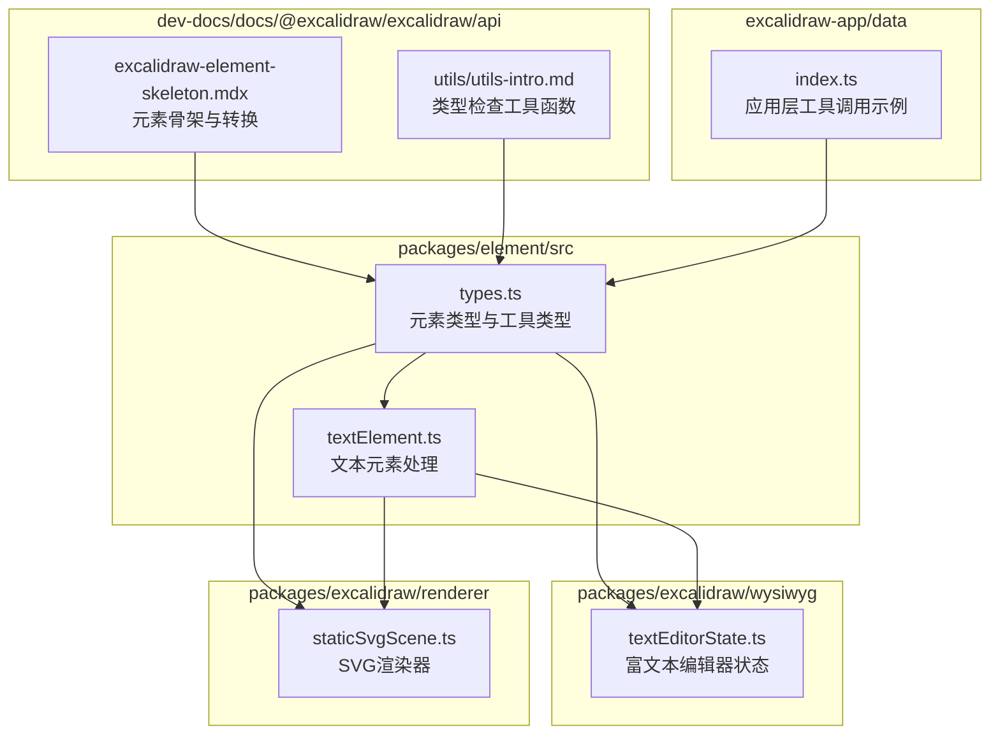
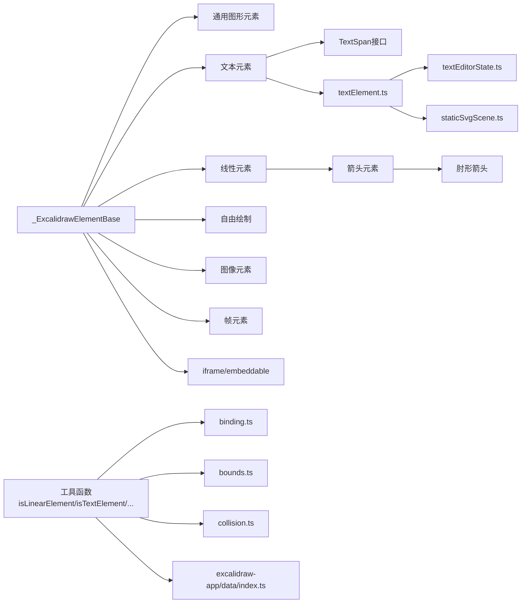

# 元素类型定义

<cite>
**本文引用的文件**
- [packages/element/src/types.ts](file://packages/element/src/types.ts)
- [packages/element/src/textElement.ts](file://packages/element/src/textElement.ts)
- [packages/excalidraw/wysiwyg/textEditorState.ts](file://packages/excalidraw/wysiwyg/textEditorState.ts)
- [packages/excalidraw/renderer/staticSvgScene.ts](file://packages/excalidraw/renderer/staticSvgScene.ts)
- [dev-docs/docs/@excalidraw/excalidraw/api/excalidraw-element-skeleton.mdx](file://dev-docs/docs/@excalidraw/excalidraw/api/excalidraw-element-skeleton.mdx)
- [dev-docs/docs/@excalidraw/excalidraw/api/utils/utils-intro.md](file://dev-docs/docs/@excalidraw/excalidraw/api/utils/utils-intro.md)
- [packages/element/src/binding.ts](file://packages/element/src/binding.ts)
- [packages/element/src/bounds.ts](file://packages/element/src/bounds.ts)
- [packages/element/src/collision.ts](file://packages/element/src/collision.ts)
- [excalidraw-app/data/index.ts](file://excalidraw-app/data/index.ts)
</cite>

## 更新摘要
**所做更改**
- 新增 TextSpan 接口定义和 spans 属性支持说明
- 更新文本元素类型定义，包含富文本格式化功能
- 增加文本跨度渲染和编辑器状态管理相关内容
- 完善文本元素的富文本特性说明

## 目录
1. [简介](#简介)
2. [项目结构](#项目结构)
3. [核心组件](#核心组件)
4. [架构总览](#架构总览)
5. [详细组件分析](#详细组件分析)
6. [依赖分析](#依赖分析)
7. [性能考虑](#性能考虑)
8. [故障排查指南](#故障排查指南)
9. [结论](#结论)
10. [附录](#附录)

## 简介
本文件系统性梳理 Excalidraw 的元素类型定义与扩展机制，围绕基础类型 ExcalidrawElement 及其派生类型（矩形、圆形、椭圆、线条、箭头、文本、自由绘制、图像、帧等）展开，解释属性结构、必填/可选字段、版本控制与唯一标识、状态管理、类型检查工具函数，并给出扩展与自定义元素类型的开发指南。

**更新重点**：本次更新重点关注文本元素类型的富文本支持，新增 TextSpan 接口和 spans 属性，实现内联颜色等格式化功能。

## 项目结构
- 元素类型定义集中在 packages/element/src/types.ts，涵盖通用基类、具体元素类型、映射类型、集合类型以及可转换类型等。
- 文本元素专门处理模块位于 packages/element/src/textElement.ts，包含文本测量、换行、容器绑定等功能。
- 富文本编辑器状态管理位于 packages/excalidraw/wysiwyg/textEditorState.ts，提供文本跨度的颜色应用和格式化功能。
- SVG 渲染器在 packages/excalidraw/renderer/staticSvgScene.ts 中处理 TextSpan 的渲染，支持多颜色文本显示。
- 开发文档中提供了元素骨架（ExcalidrawElementSkeleton）与转换工具 convertToExcalidrawElements 的说明，便于程序化创建元素。
- 工具函数与类型检查在 packages/element 下的 binding.ts、bounds.ts、collision.ts 中被广泛使用；应用层在 excalidraw-app/data/index.ts 中也调用 isInvisiblySmallElement 等工具进行元素过滤或校验。



**图表来源**
- [packages/element/src/types.ts:1-476](file://packages/element/src/types.ts#L1-L476)
- [packages/element/src/textElement.ts:1-554](file://packages/element/src/textElement.ts#L1-L554)
- [packages/excalidraw/wysiwyg/textEditorState.ts:1-211](file://packages/excalidraw/wysiwyg/textEditorState.ts#L1-L211)
- [packages/excalidraw/renderer/staticSvgScene.ts:710-848](file://packages/excalidraw/renderer/staticSvgScene.ts#L710-L848)
- [dev-docs/docs/@excalidraw/excalidraw/api/excalidraw-element-skeleton.mdx:1-460](file://dev-docs/docs/@excalidraw/excalidraw/api/excalidraw-element-skeleton.mdx#L1-L460)
- [dev-docs/docs/@excalidraw/excalidraw/api/utils/utils-intro.md:1-500](file://dev-docs/docs/@excalidraw/excalidraw/api/utils/utils-intro.md#L1-L500)
- [excalidraw-app/data/index.ts:1-120](file://excalidraw-app/data/index.ts#L1-L120)

## 核心组件
- 基础类型与通用属性
  - _ExcalidrawElementBase：所有元素共享的基础属性集合，包含位置、尺寸、样式、外观、几何、索引与状态等。
  - ExcalidrawElement：联合类型，聚合所有元素类型（通用图形、线性元素、自由绘制、文本、图像、帧、iframe/embeddable 等）。
- 文本跨度系统
  - TextSpan：富文本跨度接口，包含文本内容和可选颜色属性。
  - spans：文本元素的富文本格式化属性，支持内联颜色等格式。
- 具体元素类型
  - 通用图形：ExcalidrawSelectionElement、ExcalidrawRectangleElement、ExcalidrawDiamondElement、ExcalidrawEllipseElement
  - 文本：ExcalidrawTextElement（新增 spans 属性支持）
  - 线性元素：ExcalidrawLinearElement（type 为 "line" 或 "arrow"），进一步细分为 ExcalidrawLineElement、ExcalidrawArrowElement、ExcalidrawElbowArrowElement
  - 自由绘制：ExcalidrawFreeDrawElement
  - 图像：ExcalidrawImageElement（含 fileId、status、scale、crop、imageHSLA 等）
  - 帧：ExcalidrawFrameElement、ExcalidrawMagicFrameElement
  - iframe/embeddable：ExcalidrawIframeElement、ExcalidrawEmbeddableElement
- 工具类型与集合
  - Ordered、NonDeleted、ElementsMap、NonDeletedElementsMap、SceneElementsMap、ElementsMapOrArray 等
  - 可转换类型：ConvertibleGenericTypes、ConvertibleLinearTypes、ConvertibleTypes
- 版本控制与唯一标识
  - version、versionNonce、index（分数索引）、updated、isDeleted、locked 等字段用于协作、排序、状态管理与持久化

**章节来源**
- [packages/element/src/types.ts:40-476](file://packages/element/src/types.ts#L40-L476)
- [packages/element/src/types.ts:252-284](file://packages/element/src/types.ts#L252-L284)

## 架构总览
下图展示 ExcalidrawElement 的继承与组合关系，以及关键工具类型的作用范围，特别标注了文本跨度系统的集成。

```mermaid
classDiagram
class _ExcalidrawElementBase {
+id : string
+x : number
+y : number
+width : number
+height : number
+angle : Radians
+seed : number
+version : number
+versionNonce : number
+index : FractionalIndex | null
+opacity : number
+strokeColor : string
+backgroundColor : string
+fillStyle : FillStyle
+strokeWidth : number
+strokeStyle : StrokeStyle
+roundness : null | {type : RoundnessType, value? : number}
+roughness : number
+groupIds : readonly GroupId[]
+frameId : string | null
+boundElements : readonly BoundElement[] | null
+updated : number
+link : string | null
+locked : boolean
+customData? : Record<string, any>
}
class ExcalidrawGenericElement {
}
ExcalidrawGenericElement <|-- ExcalidrawSelectionElement
ExcalidrawGenericElement <|-- ExcalidrawRectangleElement
ExcalidrawGenericElement <|-- ExcalidrawDiamondElement
ExcalidrawGenericElement <|-- ExcalidrawEllipseElement
class TextSpan {
+text : string
+color? : string
}
class ExcalidrawTextElement {
+type : "text"
+fontSize : number
+fontFamily : FontFamilyValues
+text : string
+textAlign : TextAlign
+verticalAlign : VerticalAlign
+containerId : ExcalidrawGenericElement["id"] | null
+originalText : string
+autoResize : boolean
+lineHeight : number & { _brand : "unitlessLineHeight" }
+spans? : readonly TextSpan[]
}
ExcalidrawTextElement --> TextSpan : contains
class ExcalidrawLinearElement {
+type : "line" | "arrow"
+points : readonly LocalPoint[]
+startBinding : FixedPointBinding | null
+endBinding : FixedPointBinding | null
+startArrowhead : Arrowhead | null
+endArrowhead : Arrowhead | null
}
ExcalidrawLinearElement <|-- ExcalidrawLineElement
ExcalidrawLinearElement <|-- ExcalidrawArrowElement
ExcalidrawArrowElement <|-- ExcalidrawElbowArrowElement
class ExcalidrawFreeDrawElement {
+type : "freedraw"
+points : readonly LocalPoint[]
+pressures : readonly number[]
+simulatePressure : boolean
}
class ExcalidrawImageElement {
+type : "image"
+fileId : FileId | null
+status : "pending" | "saved" | "error"
+scale : [number, number]
+crop : ImageCrop | null
+imageHSLA? : ImageHSLA
}
class ExcalidrawFrameElement {
+type : "frame"
+name : string | null
}
class ExcalidrawMagicFrameElement {
+type : "magicframe"
+name : string | null
}
class ExcalidrawIframeElement {
+type : "iframe"
+customData? : { generationData? : MagicGenerationData }
}
class ExcalidrawEmbeddableElement {
+type : "embeddable"
}
class ExcalidrawElement {
}
ExcalidrawElement <|-- ExcalidrawGenericElement
ExcalidrawElement <|-- ExcalidrawTextElement
ExcalidrawElement <|-- ExcalidrawLinearElement
ExcalidrawElement <|-- ExcalidrawFreeDrawElement
ExcalidrawElement <|-- ExcalidrawImageElement
ExcalidrawElement <|-- ExcalidrawFrameElement
ExcalidrawElement <|-- ExcalidrawMagicFrameElement
ExcalidrawElement <|-- ExcalidrawIframeElement
ExcalidrawElement <|-- ExcalidrawEmbeddableElement
```

**图表来源**
- [packages/element/src/types.ts:40-476](file://packages/element/src/types.ts#L40-L476)
- [packages/element/src/types.ts:252-284](file://packages/element/src/types.ts#L252-L284)

## 详细组件分析

### 基础类型与版本控制
- 基类 _ExcalidrawElementBase 聚合了所有元素共有的属性：
  - 几何与变换：id、x/y、width/height、angle
  - 视觉样式：strokeColor、backgroundColor、fillStyle、strokeWidth、strokeStyle、roundness、roughness、opacity
  - 状态与索引：version、versionNonce、index（分数索引）、updated、isDeleted、locked、groupIds、frameId、boundElements、link、customData
- 协作与一致性
  - version 与 versionNonce 用于冲突解决与确定性重排
  - index 使用分数索引策略，保证多端顺序一致
  - updated 记录最后更新时间戳，辅助增量同步

**章节来源**
- [packages/element/src/types.ts:40-82](file://packages/element/src/types.ts#L40-L82)

### 文本跨度系统
- TextSpan 接口定义
  - text：字符串内容，必填字段
  - color：可选颜色值，支持内联颜色格式化
- spans 属性支持
  - ExcalidrawTextElement 新增 spans 可选属性
  - 支持富文本格式化，每个 TextSpan 定义一段具有特定颜色的文本
  - 当 spans 为空或未定义时，使用统一的 strokeColor 渲染
- 富文本渲染机制
  - SVG 渲染器通过 tspan 元素逐个渲染不同颜色的文本片段
  - 支持多行文本和复杂的颜色组合
  - 颜色优先级：span.color > element.strokeColor

**章节来源**
- [packages/element/src/types.ts:252-284](file://packages/element/src/types.ts#L252-L284)
- [packages/excalidraw/renderer/staticSvgScene.ts:715-726](file://packages/excalidraw/renderer/staticSvgScene.ts#L715-L726)

### 通用图形元素
- 选择框：ExcalidrawSelectionElement
- 矩形：ExcalidrawRectangleElement
- 菱形：ExcalidrawDiamondElement
- 椭圆：ExcalidrawEllipseElement
- 属性：均由 _ExcalidrawElementBase 提供，无额外字段

**章节来源**
- [packages/element/src/types.ts:84-98](file://packages/element/src/types.ts#L84-L98)

### 文本元素
- ExcalidrawTextElement
  - 必填字段：type、fontSize、fontFamily、text、textAlign、verticalAlign、originalText、lineHeight
  - 可选字段：containerId、autoResize、spans
  - 容器绑定：可绑定到 ExcalidrawTextContainer（矩形、菱形、椭圆、箭头）
  - 富文本：spans 支持内联颜色等格式
  - 文本处理：splitSpansIntoLines 函数将 TextSpan 数组按换行符拆分为多行

**章节来源**
- [packages/element/src/types.ts:257-284](file://packages/element/src/types.ts#L257-L284)
- [packages/element/src/textElement.ts:51-65](file://packages/element/src/textElement.ts#L51-L65)

### 线性元素与箭头
- ExcalidrawLinearElement
  - 必填：points（LocalPoint 数组）、startBinding、endBinding、startArrowhead、endArrowhead
  - 子类型：
    - ExcalidrawLineElement：type 为 "line"，并可标记 polygon
    - ExcalidrawArrowElement：type 为 "arrow"，支持 elbowed
    - ExcalidrawElbowArrowElement：带固定段 fixedSegments、起终点特殊标记 startIsSpecial/endIsSpecial，支持绑定与路径优化

**章节来源**
- [packages/element/src/types.ts:360-412](file://packages/element/src/types.ts#L360-L412)

### 自由绘制元素
- ExcalidrawFreeDrawElement
  - 必填：points、pressures、simulatePressure
  - 适用于手绘笔触模拟

**章节来源**
- [packages/element/src/types.ts:414-420](file://packages/element/src/types.ts#L414-L420)

### 图像元素
- ExcalidrawImageElement
  - 必填：type、fileId、status、scale、crop
  - 可选：imageHSLA（颜色调节）
  - 状态：pending/saved/error

**章节来源**
- [packages/element/src/types.ts:161-173](file://packages/element/src/types.ts#L161-L173)

### 帧元素
- ExcalidrawFrameElement、ExcalidrawMagicFrameElement
  - 必填：type、name
  - 作用：对元素进行分组与布局约束

**章节来源**
- [packages/element/src/types.ts:180-188](file://packages/element/src/types.ts#L180-L188)

### iframe 与 embeddable
- ExcalidrawIframeElement：type 为 "iframe"，可携带生成数据 customData
- ExcalidrawEmbeddableElement：type 为 "embeddable"

**章节来源**
- [packages/element/src/types.ts:100-121](file://packages/element/src/types.ts#L100-L121)

### 元素骨架与转换
- ExcalidrawElementSkeleton：简化版元素类型，便于程序化创建（如绑定箭头、文本容器）
- convertToExcalidrawElements：将骨架转换为完整元素，需在传入初始数据或更新场景前调用

**章节来源**
- [dev-docs/docs/@excalidraw/excalidraw/api/excalidraw-element-skeleton.mdx:1-460](file://dev-docs/docs/@excalidraw/excalidraw/api/excalidraw-element-skeleton.mdx#L1-L460)

### 类型检查工具函数
- isInvisiblySmallElement：判断元素是否过小（常用于过滤不可见元素）
- isLinearElement：判断是否为线性元素（line/arrow）
- isElementInsideBBox：判断元素是否位于指定包围盒内
- 其他工具函数：如 isTextElement 等在 binding.ts、bounds.ts、collision.ts 中广泛使用

**章节来源**
- [dev-docs/docs/@excalidraw/excalidraw/api/utils/utils-intro.md:1-500](file://dev-docs/docs/@excalidraw/excalidraw/api/utils/utils-intro.md#L1-L500)
- [packages/element/src/binding.ts:1-2400](file://packages/element/src/binding.ts#L1-L2400)
- [packages/element/src/bounds.ts:1-1350](file://packages/element/src/bounds.ts#L1-L1350)
- [packages/element/src/collision.ts:1-800](file://packages/element/src/collision.ts#L1-L800)
- [excalidraw-app/data/index.ts:1-120](file://excalidraw-app/data/index.ts#L1-L120)

### 扩展机制与自定义元素类型开发指南
- 扩展步骤
  - 定义新类型：在 types.ts 中新增类型别名，继承 _ExcalidrawElementBase 并声明 type 字段
  - 注册到联合类型：将新类型加入 ExcalidrawElement 联合类型
  - 补充工具类型：根据需要添加 Ordered、NonDeleted 等包装类型
  - 实现渲染与交互：在 binding.ts、bounds.ts、collision.ts 中补充对应逻辑分支
  - 集成骨架转换：如需通过 ExcalidrawElementSkeleton 创建，扩展骨架与转换流程
- 注意事项
  - 保持 JSON 可序列化与无本地状态
  - 维护 version/versionNonce/index 的一致性，确保协作与排序稳定
  - 明确必填/可选字段，避免运行时错误
  - 为新类型提供合理的默认值与边界处理

**章节来源**
- [packages/element/src/types.ts:40-476](file://packages/element/src/types.ts#L40-L476)
- [dev-docs/docs/@excalidraw/excalidraw/api/excalidraw-element-skeleton.mdx:1-460](file://dev-docs/docs/@excalidraw/excalidraw/api/excalidraw-element-skeleton.mdx#L1-L460)

## 依赖分析
- 类型耦合
  - 所有元素类型均依赖 _ExcalidrawElementBase，降低重复代码
  - 线性元素与箭头共享 startBinding/endBinding、startArrowhead/endArrowhead 等字段
  - 文本元素与容器元素通过 containerId 建立绑定关系
  - TextSpan 接口被文本元素、编辑器状态管理和渲染器共同依赖
- 工具函数依赖
  - binding.ts、bounds.ts、collision.ts 依赖 isLinearElement、isTextElement 等工具函数
  - 应用层在 excalidraw-app/data/index.ts 中调用 isInvisiblySmallElement 过滤元素
  - 文本处理函数依赖 splitSpansIntoLines 和各种文本测量工具



**图表来源**
- [packages/element/src/types.ts:40-476](file://packages/element/src/types.ts#L40-L476)
- [packages/element/src/textElement.ts:1-554](file://packages/element/src/textElement.ts#L1-L554)
- [packages/excalidraw/wysiwyg/textEditorState.ts:1-211](file://packages/excalidraw/wysiwyg/textEditorState.ts#L1-L211)
- [packages/excalidraw/renderer/staticSvgScene.ts:710-848](file://packages/excalidraw/renderer/staticSvgScene.ts#L710-L848)
- [packages/element/src/binding.ts:1-2400](file://packages/element/src/binding.ts#L1-L2400)
- [packages/element/src/bounds.ts:1-1350](file://packages/element/src/bounds.ts#L1-L1350)
- [packages/element/src/collision.ts:1-800](file://packages/element/src/collision.ts#L1-L800)
- [excalidraw-app/data/index.ts:1-120](file://excalidraw-app/data/index.ts#L1-L120)

## 性能考虑
- 分数索引（index）用于高效排序与协作，避免全量重排
- version/versionNonce 用于最小化差异同步，减少网络传输
- 线性元素与自由绘制元素的点集（points/pressures）应按需压缩或采样，避免超大 JSON
- 文本元素的 spans 与容器绑定需谨慎处理，避免频繁重算边界
- 图像元素的 crop 与 HSLA 调节建议延迟应用，减少渲染开销
- **新增**：富文本跨度的合并和优化，避免过多的 tspan 元素创建
- **新增**：文本跨度的颜色应用采用批量处理，减少 DOM 操作次数

## 故障排查指南
- 元素过小导致不可见
  - 使用 isInvisiblySmallElement 判断并过滤
  - 在应用层统一调用该工具，避免误判
- 线性元素/箭头绑定异常
  - 检查 startBinding/endBinding 的 fixedPoint 与 mode 设置
  - 对肘形箭头，确认 fixedSegments 与 startIsSpecial/endIsSpecial 的配合
- 文本容器不生效
  - 确认 containerId 指向有效容器且容器类型在 ExcalidrawTextContainer 中
  - 检查文本 autoResize 与容器尺寸匹配
- **新增**：富文本跨度问题
  - 检查 spans 数组的结构完整性，确保每个 TextSpan 都有 text 字段
  - 验证颜色值的有效性，避免无效的颜色格式
  - 确认文本内容与 spans 的长度匹配，避免渲染错误
- 协作冲突与顺序错乱
  - 核对 version 与 versionNonce 是否正确递增
  - 确保 index 与数组顺序同步更新

**章节来源**
- [dev-docs/docs/@excalidraw/excalidraw/api/utils/utils-intro.md:1-500](file://dev-docs/docs/@excalidraw/excalidraw/api/utils/utils-intro.md#L1-L500)
- [packages/element/src/binding.ts:1-2400](file://packages/element/src/binding.ts#L1-L2400)
- [packages/element/src/bounds.ts:1-1350](file://packages/element/src/bounds.ts#L1-L1350)
- [packages/element/src/collision.ts:1-800](file://packages/element/src/collision.ts#L1-L800)
- [excalidraw-app/data/index.ts:1-120](file://excalidraw-app/data/index.ts#L1-L120)

## 结论
Excalidraw 的元素类型体系以 _ExcalidrawElementBase 为核心，通过联合类型与工具类型实现强类型约束与灵活扩展。版本控制、分数索引与状态字段共同保障协作与渲染的一致性。**本次更新**增强了文本元素的富文本支持，通过 TextSpan 接口和 spans 属性实现了内联颜色等格式化功能，配合编辑器状态管理和 SVG 渲染器，为用户提供了完整的富文本编辑体验。借助工具函数与骨架转换，开发者可以安全地扩展自定义元素类型，并将其无缝集成到现有工作流中。

## 附录
- 关键类型速览
  - 基类：_ExcalidrawElementBase
  - 元素联合：ExcalidrawElement
  - 通用图形：ExcalidrawGenericElement
  - 文本：ExcalidrawTextElement（含 spans 属性）
  - 文本跨度：TextSpan
  - 线性元素：ExcalidrawLinearElement、ExcalidrawLineElement、ExcalidrawArrowElement、ExcalidrawElbowArrowElement
  - 自由绘制：ExcalidrawFreeDrawElement
  - 图像：ExcalidrawImageElement
  - 帧：ExcalidrawFrameElement、ExcalidrawMagicFrameElement
  - iframe/embeddable：ExcalidrawIframeElement、ExcalidrawEmbeddableElement
- 工具类型
  - Ordered、NonDeleted、ElementsMap、NonDeletedElementsMap、SceneElementsMap、ElementsMapOrArray
  - 可转换类型：ConvertibleGenericTypes、ConvertibleLinearTypes、ConvertibleTypes
- **新增**：富文本相关工具函数
  - splitSpansIntoLines：将 TextSpan 数组按换行符拆分为多行
  - applyColorToSpans：对指定范围内的 span 应用颜色
  - updateSpansOnTextChange：文本内容变化时更新 span 数组
  - mergeAdjacentSpans：合并相邻且颜色相同的 span