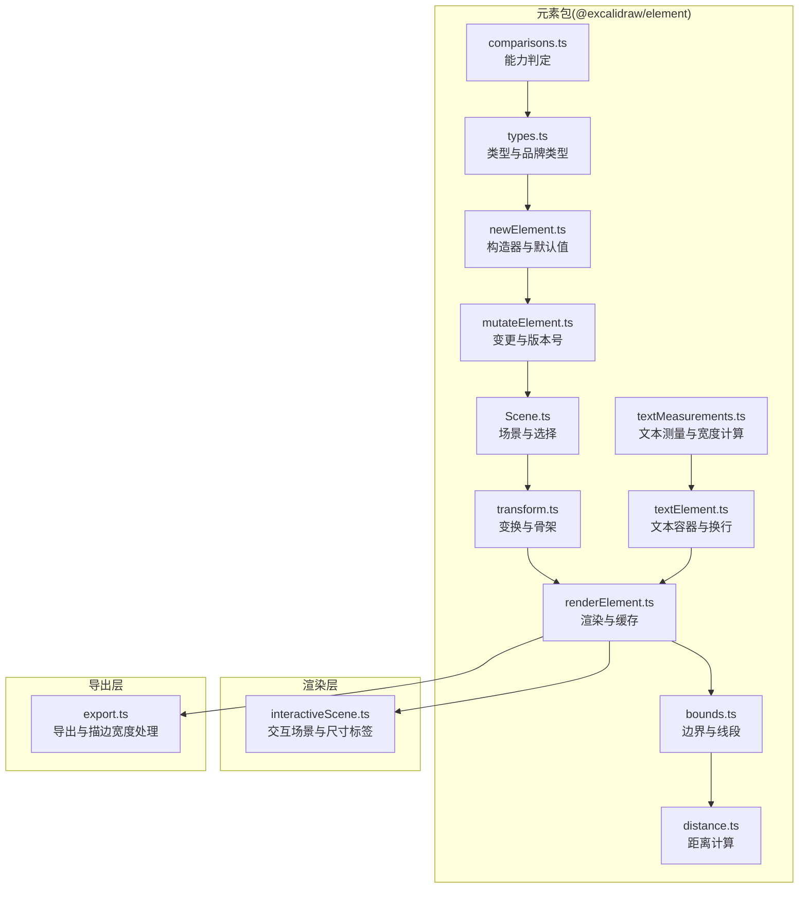
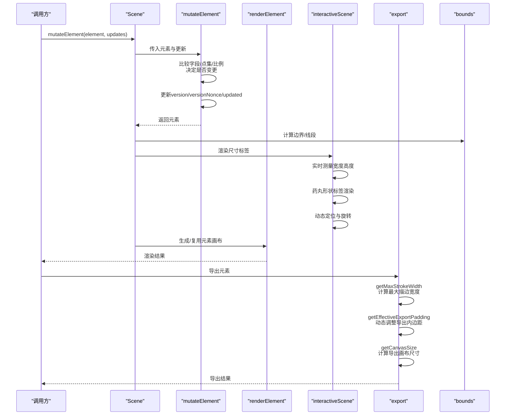
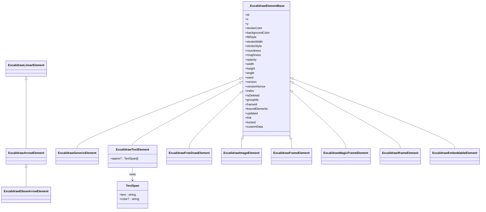
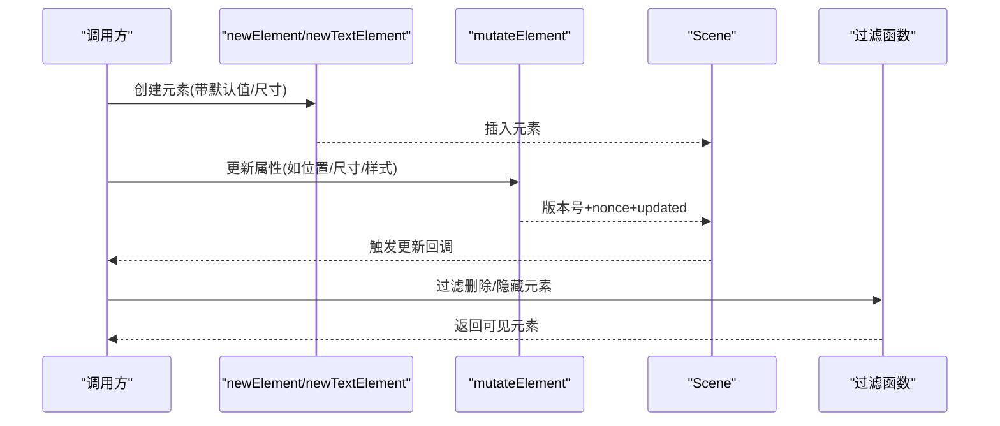
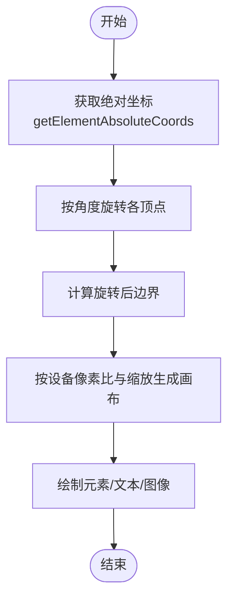
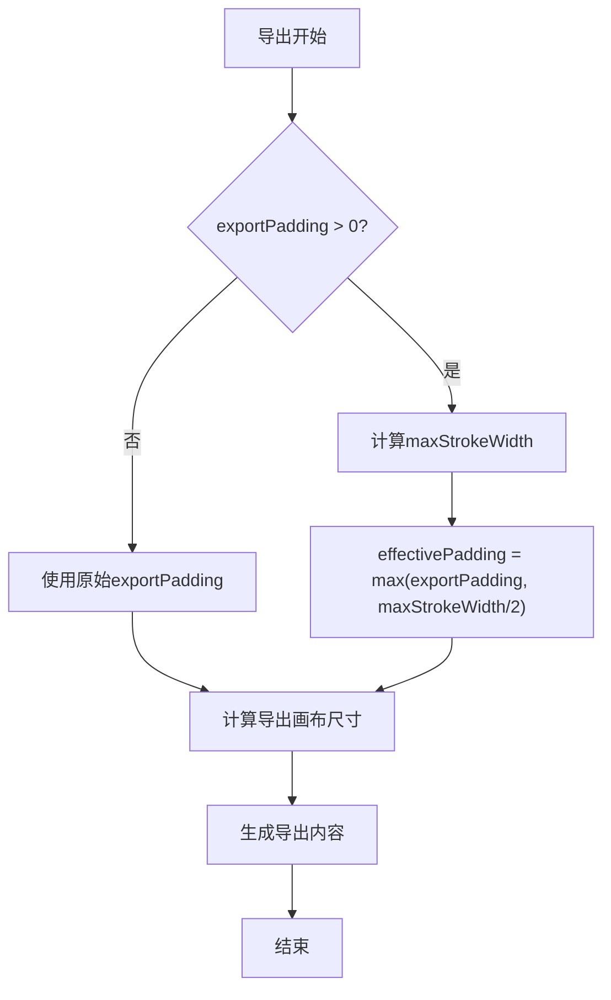
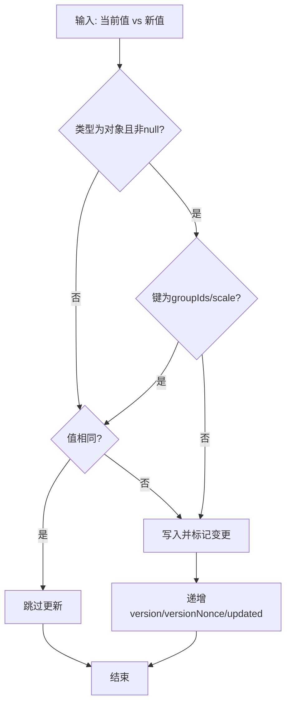
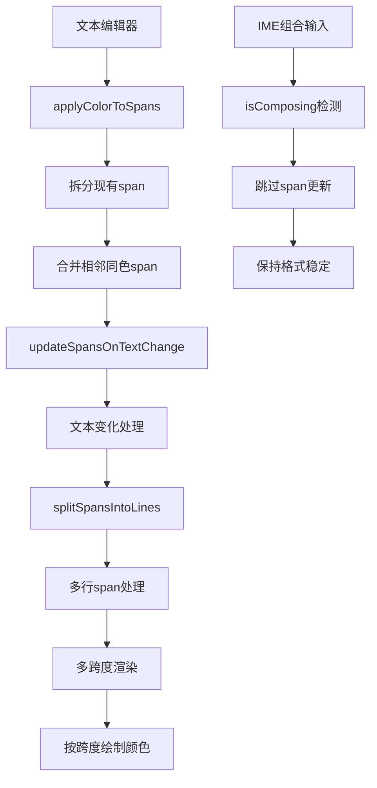
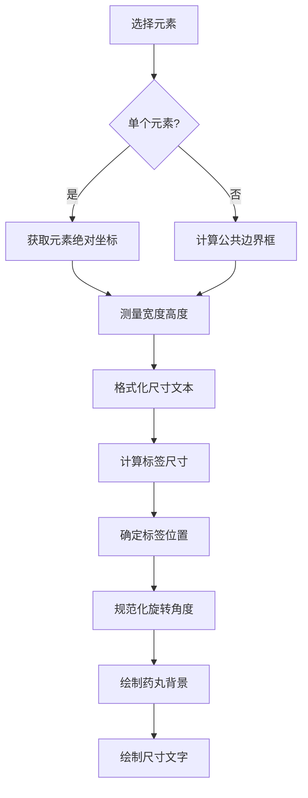
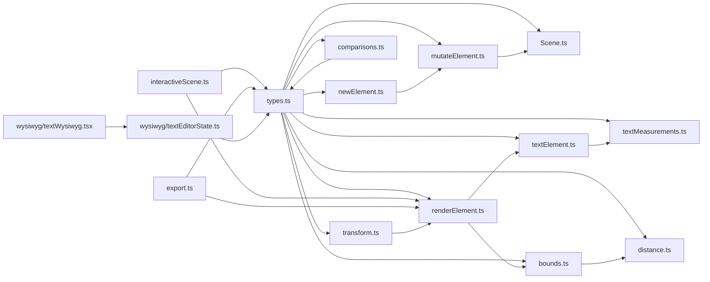

# 元素系统

<cite>
**本文引用的文件**
- [packages/element/src/index.ts](file://packages/element/src/index.ts)
- [packages/element/src/types.ts](file://packages/element/src/types.ts)
- [packages/element/src/newElement.ts](file://packages/element/src/newElement.ts)
- [packages/element/src/mutateElement.ts](file://packages/element/src/mutateElement.ts)
- [packages/element/src/transform.ts](file://packages/element/src/transform.ts)
- [packages/element/src/renderElement.ts](file://packages/element/src/renderElement.ts)
- [packages/element/src/bounds.ts](file://packages/element/src/bounds.ts)
- [packages/element/src/comparisons.ts](file://packages/element/src/comparisons.ts)
- [packages/element/src/distance.ts](file://packages/element/src/distance.ts)
- [packages/element/src/Scene.ts](file://packages/element/src/Scene.ts)
- [packages/element/src/textElement.ts](file://packages/element/src/textElement.ts)
- [packages/element/src/textMeasurements.ts](file://packages/element/src/textMeasurements.ts)
- [packages/excalidraw/wysiwyg/textEditorState.ts](file://packages/excalidraw/wysiwyg/textEditorState.ts)
- [packages/excalidraw/wysiwyg/textWysiwyg.tsx](file://packages/excalidraw/wysiwyg/textWysiwyg.tsx)
- [packages/excalidraw/renderer/interactiveScene.ts](file://packages/excalidraw/renderer/interactiveScene.ts)
- [packages/excalidraw/scene/export.ts](file://packages/excalidraw/scene/export.ts)
- [packages/element/package.json](file://packages/element/package.json)
</cite>

## 更新摘要

**所做更改**

- 新增元素尺寸标签显示功能章节，涵盖实时宽度高度测量、药丸形状标签渲染、动态定位系统等新特性
- 更新渲染管道章节，增加元素尺寸标签的集成与配置说明
- 完善 UI 配置与状态管理章节，说明尺寸标签的显示控制逻辑
- 增强性能考量章节，包含尺寸标签渲染的优化策略
- **更新描边宽度处理章节，反映 getCanvasPadding 函数的重大改进：现在根据 strokeWidth 动态调整内边距，解决了粗描边在导出时被截断的问题**

## 目录

1. [简介](#简介)
2. [项目结构](#项目结构)
3. [核心组件](#核心组件)
4. [架构总览](#架构总览)
5. [详细组件分析](#详细组件分析)
6. [依赖分析](#依赖分析)
7. [性能考量](#性能考量)
8. [故障排查指南](#故障排查指南)
9. [结论](#结论)
10. [附录](#附录)

## 简介

本文件面向开发者与高级用户，系统化梳理 Excalidraw 的元素系统：从类型体系、创建/修改/删除/查询 API，到变换（缩放、旋转、平移）、比较与差异检测、序列化与反序列化、层级与选择机制、批量操作，以及扩展新元素类型的开发指南。目标是帮助你在不深入源码的前提下，快速掌握元素系统的设计思想与使用方式。

## 项目结构

元素系统主要位于 @excalidraw/element 包中，核心模块包括：

- 类型与基础结构：types.ts
- 创建与初始化：newElement.ts
- 修改与版本控制：mutateElement.ts
- 场景与选择：Scene.ts
- 变换与骨架生成：transform.ts
- 渲染与缓存：renderElement.ts
- 边界与距离：bounds.ts、distance.ts
- 比较与工具：comparisons.ts
- 文本处理与测量：textElement.ts、textMeasurements.ts
- 富文本编辑器状态管理：wysiwyg/textEditorState.ts、wysiwyg/textWysiwyg.tsx
- **元素尺寸标签渲染**：renderer/interactiveScene.ts
- **导出与描边宽度处理**：scene/export.ts

**图表来源**

- [packages/element/src/types.ts](file://packages/element/src/types.ts)
- [packages/element/src/newElement.ts](file://packages/element/src/newElement.ts)
- [packages/element/src/mutateElement.ts](file://packages/element/src/mutateElement.ts)
- [packages/element/src/Scene.ts](file://packages/element/src/Scene.ts)
- [packages/element/src/transform.ts](file://packages/element/src/transform.ts)
- [packages/element/src/renderElement.ts](file://packages/element/src/renderElement.ts)
- [packages/element/src/bounds.ts](file://packages/element/src/bounds.ts)
- [packages/element/src/distance.ts](file://packages/element/src/distance.ts)
- [packages/element/src/comparisons.ts](file://packages/element/src/comparisons.ts)
- [packages/element/src/textElement.ts](file://packages/element/src/textElement.ts)
- [packages/element/src/textMeasurements.ts](file://packages/element/src/textMeasurements.ts)
- [packages/excalidraw/renderer/interactiveScene.ts](file://packages/excalidraw/renderer/interactiveScene.ts)
- [packages/excalidraw/scene/export.ts](file://packages/excalidraw/scene/export.ts)

**章节来源**

- [packages/element/src/index.ts](file://packages/element/src/index.ts)
- [packages/element/package.json](file://packages/element/package.json)

## 核心组件

- 元素类型体系：统一的只读基础结构 \_ExcalidrawElementBase，派生出通用形状、文本、线性元素、箭头、自由绘制、图像、帧等类型；通过联合类型 ExcalidrawElement 聚合。
- 创建器：newElement、newTextElement、newLinearElement、newArrowElement、newImageElement、newFrameElement、newMagicFrameElement 等，负责默认值注入与初始尺寸计算。
- 变更器：mutateElement/newElementWith/bumpVersion，负责字段变更、版本号与时间戳更新、缓存失效与校验。
- 场景：Scene 提供元素集合、索引、选择缓存、插入/替换、回调通知等。
- 变换：transform.ts 提供骨架转换、绑定、容器标签、帧布局等。
- 渲染：renderElement.ts 提供画布生成、缓存、主题与滤镜、文本换行与跨度渲染、图像裁剪与 HSLA 调节。
- **尺寸标签渲染**：interactiveScene.ts 提供元素尺寸标签的实时测量、药丸形状渲染和动态定位系统。
- **描边宽度处理**：export.ts 提供导出时的描边宽度处理，通过 getMaxStrokeWidth 和 getEffectiveExportPadding 函数动态调整导出内边距，解决粗描边被截断问题。
- 边界与距离：bounds.ts 计算旋转/非旋转边界、线段、椭圆近似；distance.ts 计算点到元素距离。
- 比较与能力：comparisons.ts 提供"是否有背景/描边/圆角"等类型能力判定。
- 文本处理：textElement.ts 提供文本容器、换行符处理、边界重新计算等功能；textMeasurements.ts 提供文本测量与宽度计算。
- 富文本编辑器状态管理：wysiwyg/textEditorState.ts 提供文本编辑器实例注册、选区管理、颜色应用与跨度更新；wysiwyg/textWysiwyg.tsx 提供 IME 组合输入支持。

**章节来源**

- [packages/element/src/types.ts](file://packages/element/src/types.ts)
- [packages/element/src/newElement.ts](file://packages/element/src/newElement.ts)
- [packages/element/src/mutateElement.ts](file://packages/element/src/mutateElement.ts)
- [packages/element/src/Scene.ts](file://packages/element/src/Scene.ts)
- [packages/element/src/transform.ts](file://packages/element/src/transform.ts)
- [packages/element/src/renderElement.ts](file://packages/element/src/renderElement.ts)
- [packages/excalidraw/renderer/interactiveScene.ts](file://packages/excalidraw/renderer/interactiveScene.ts)
- [packages/excalidraw/scene/export.ts](file://packages/excalidraw/scene/export.ts)
- [packages/element/src/bounds.ts](file://packages/element/src/bounds.ts)
- [packages/element/src/distance.ts](file://packages/element/src/distance.ts)
- [packages/element/src/comparisons.ts](file://packages/element/src/comparisons.ts)
- [packages/element/src/textElement.ts](file://packages/element/src/textElement.ts)
- [packages/element/src/textMeasurements.ts](file://packages/element/src/textMeasurements.ts)
- [packages/excalidraw/wysiwyg/textEditorState.ts](file://packages/excalidraw/wysiwyg/textEditorState.ts)
- [packages/excalidraw/wysiwyg/textWysiwyg.tsx](file://packages/excalidraw/wysiwyg/textWysiwyg.tsx)

## 架构总览

元素系统围绕"不可变更新 + 版本号 + 缓存 + 场景索引"的设计展开：

- 不可变更新：通过 newElementWith 返回新对象，避免直接修改原对象。
- 版本号：每个元素维护 version/versionNonce/updated，用于协作同步与冲突解决。
- 缓存：ShapeCache、elementWithCanvasCache、bounds 缓存提升渲染与几何计算性能。
- 场景索引：Scene 维护有序元素数组、映射、帧集合、选择缓存与回调通知。
- **尺寸标签**：在交互渲染阶段统一处理元素尺寸标签的显示与更新。
- **描边宽度处理**：在导出阶段动态计算最大描边宽度并调整导出内边距，确保粗描边不会被截断。

**图表来源**

- [packages/element/src/Scene.ts](file://packages/element/src/Scene.ts)
- [packages/element/src/mutateElement.ts](file://packages/element/src/mutateElement.ts)
- [packages/element/src/renderElement.ts](file://packages/element/src/renderElement.ts)
- [packages/element/src/bounds.ts](file://packages/element/src/bounds.ts)
- [packages/excalidraw/renderer/interactiveScene.ts](file://packages/excalidraw/renderer/interactiveScene.ts)
- [packages/excalidraw/scene/export.ts](file://packages/excalidraw/scene/export.ts)

## 详细组件分析

### 类型体系与继承关系

- 基础只读结构：\_ExcalidrawElementBase 定义 id/x/y/strokeColor/backgroundColor/fillStyle/strokeWidth/strokeStyle/roundness/roughness/opacity/width/height/angle/seed/version/versionNonce/updated/link/locked/customData 等。
- 具体元素类型：
  - 通用形状：rectangle、diamond、ellipse、selection
  - 文本：text（含容器、自动换行、行高、内联样式）
  - 线性元素：line（可多段/折线）与 arrow（含 elbowArrow）
  - 自由绘制：freedraw（points/pressures/simulatePressure）
  - 图像：image（fileId/status/scale/crop/imageHSLA）
  - 帧：frame 与 magicframe（name）
  - iframe/embeddable：嵌入内容
- 联合类型：ExcalidrawElement 聚合上述类型；ExcalidrawNonSelectionElement 排除 selection。
- 品牌与映射：ElementsMap/NonDeletedSceneElementsMap 等品牌类型确保类型安全。
- **富文本跨度**：TextSpan 接口定义文本跨度，包含 text 和可选 color 字段，用于内联样式支持。

**图表来源**

- [packages/element/src/types.ts](file://packages/element/src/types.ts)

**章节来源**

- [packages/element/src/types.ts](file://packages/element/src/types.ts)

### 创建、修改、删除与查询 API

- 创建
  - newElement：通用形状构造器，注入默认值与随机种子。
  - newTextElement：根据字体、行高、文本测量自动计算尺寸与位置偏移。
  - newLinearElement/newArrowElement：线性元素与箭头，支持 start/endBinding、start/endArrowhead、points。
  - newImageElement：图像元素，包含状态、缩放、裁剪与 HSLA。
  - newFrameElement/newMagicFrameElement：帧容器，name 可选。
- 修改
  - mutateElement：在元素上应用更新，智能跳过未变化字段，更新版本号与时间戳，必要时清理缓存。
  - newElementWith：返回新对象，用于不可变更新链路。
  - bumpVersion：仅递增版本号与重置 nonce。
- 删除
  - 将元素的 isDeleted 设为 true 并触发场景更新（通常通过 mutateElement 完成）。
- 查询
  - Scene.getElement/getNonDeletedElement：按 id 获取元素或非删除元素。
  - Scene.getSelectedElements：基于选择集与选项（是否包含绑定文本、帧内元素）进行缓存式选择。
  - getNonDeletedElements/getVisibleElements：过滤删除与"不可见小元素"。

**图表来源**

- [packages/element/src/newElement.ts](file://packages/element/src/newElement.ts)
- [packages/element/src/mutateElement.ts](file://packages/element/src/mutateElement.ts)
- [packages/element/src/Scene.ts](file://packages/element/src/Scene.ts)
- [packages/element/src/index.ts](file://packages/element/src/index.ts)

**章节来源**

- [packages/element/src/newElement.ts](file://packages/element/src/newElement.ts)
- [packages/element/src/mutateElement.ts](file://packages/element/src/mutateElement.ts)
- [packages/element/src/Scene.ts](file://packages/element/src/Scene.ts)
- [packages/element/src/index.ts](file://packages/element/src/index.ts)

### 元素变换系统（缩放、旋转、平移、复合变换）

- 旋转：元素 angle 字段以弧度表示，渲染时通过上下文旋转实现。
- 缩放：图像元素支持 scale[horizontal, vertical]，渲染时应用缩放与滤镜（HSLA/DarkMode）。
- 平移：元素 x/y 表示左上角坐标，自由绘制与线性元素通过 points/绝对坐标参与变换。
- 复合变换：bounds.ts 提供旋转后的边界计算；renderElement.ts 在生成画布时结合 devicePixelRatio、缩放与偏移；transform.ts 支持骨架转换与绑定。

**图表来源**

- [packages/element/src/bounds.ts](file://packages/element/src/bounds.ts)
- [packages/element/src/renderElement.ts](file://packages/element/src/renderElement.ts)
- [packages/element/src/transform.ts](file://packages/element/src/transform.ts)

**章节来源**

- [packages/element/src/bounds.ts](file://packages/element/src/bounds.ts)
- [packages/element/src/renderElement.ts](file://packages/element/src/renderElement.ts)
- [packages/element/src/transform.ts](file://packages/element/src/transform.ts)

### 描边宽度处理与导出优化

**更新** 本节详细介绍描边宽度处理的重大改进，包括动态内边距计算、粗描边截断问题的解决方案以及导出流程的优化。

#### 动态内边距计算

- **getCanvasPadding 函数**：根据元素类型和 strokeWidth 动态计算画布内边距
  - freedraw：返回 element.strokeWidth \* 12，为自由绘制提供充足的描边空间
  - text：返回 element.fontSize / 2，确保文本渲染的完整性
  - arrow：根据是否有箭头头动态计算，有箭头时返回 Math.max(40, element.strokeWidth / 2)，无箭头时返回 Math.max(20, element.strokeWidth / 2)
  - 默认：返回 Math.max(20, (element.strokeWidth ?? 0) / 2)，确保最小内边距为 20px
- **cappedElementCanvasSize 函数**：在生成元素画布时应用动态内边距计算，确保粗描边不会被裁剪

#### 导出时的描边宽度处理

- **getMaxStrokeWidth 函数**：遍历元素集合，计算最大描边宽度，为导出内边距调整提供依据
- **getEffectiveExportPadding 函数**：核心改进函数，根据以下规则动态调整导出内边距
  - 如果 exportPadding <= 0：直接返回原始导出内边距（尊重用户显式设置）
  - 如果 exportPadding > 0：返回 Math.max(exportPadding, maxStrokeWidth / 2)
  - 这种设计确保粗描边在导出时不会被截断，同时尊重用户的显式内边距设置
- **getCanvasSize 函数**：在导出时应用有效的内边距计算，确保描边从元素边界向外扩展 strokeWidth/2 时有足够的空间

#### 粗描边截断问题的解决方案

- **问题背景**：在导出过程中，粗描边可能因为内边距不足而被截断
- **解决方案**：通过 getEffectiveExportPadding 函数动态计算内边距，确保内边距至少为 maxStrokeWidth / 2
- **兼容性考虑**：仅当用户设置了正数的 exportPadding 时才应用此改进，exportPadding=0 时保持原有行为

**图表来源**

- [packages/excalidraw/scene/export.ts](file://packages/excalidraw/scene/export.ts)
- [packages/element/src/renderElement.ts](file://packages/element/src/renderElement.ts)

**章节来源**

- [packages/excalidraw/scene/export.ts](file://packages/excalidraw/scene/export.ts)
- [packages/element/src/renderElement.ts](file://packages/element/src/renderElement.ts)

### 元素比较、相等性判断与差异检测

- 相等性：通过比较字段与对象属性（如 groupIds/scale）避免误判未变更；点集长度与逐点比较优化线性/自由绘制元素。
- 差异检测：mutateElement 内部对每个更新键进行严格比较，仅当值真正变化时才写入并递增版本号。
- 能力判定：comparisons.ts 提供 hasBackground/hasStrokeColor/hasStrokeWidth/hasStrokeStyle/canChangeRoundness/toolIsArrow/canHaveArrowheads 等类型能力，辅助 UI 与交互逻辑。

**图表来源**

- [packages/element/src/mutateElement.ts](file://packages/element/src/mutateElement.ts)
- [packages/element/src/comparisons.ts](file://packages/element/src/comparisons.ts)

**章节来源**

- [packages/element/src/mutateElement.ts](file://packages/element/src/mutateElement.ts)
- [packages/element/src/comparisons.ts](file://packages/element/src/comparisons.ts)

### 自定义元素类型的开发指南

- 注册与类型声明
  - 在 types.ts 中扩展 \_ExcalidrawElementBase 的派生类型（如 MyCustomElement），并在 ExcalidrawElement 联合类型中加入。
  - 导出类型别名与工厂函数（参考 newElement/newTextElement/newLinearElement 等模式）。
- 渲染
  - 在 renderElement.ts 的 drawElementOnCanvas 分支中添加自定义类型分支，使用 ShapeCache/generateRoughOptions 或 Canvas API 绘制。
  - 如需画布缓存，使用 elementWithCanvasCache 存储与复用。
  - **注意**：如果自定义元素使用描边宽度，请在 getCanvasPadding 函数中为其添加适当的内边距计算逻辑。
- 交互与变换
  - 在 transform.ts 中扩展转换逻辑（如骨架生成、绑定、标签）。
  - 若涉及点集/尺寸，参考 bounds.ts 的边界计算与 distance.ts 的距离计算。
- 版本与缓存
  - 使用 mutateElement/newElementWith/bumpVersion 确保版本号正确递增与缓存失效。
- 序列化
  - 保持元素为 JSON 可序列化（已由只读结构与内置字段满足），遵循 types.ts 的字段约定。

**章节来源**

- [packages/element/src/types.ts](file://packages/element/src/types.ts)
- [packages/element/src/renderElement.ts](file://packages/element/src/renderElement.ts)
- [packages/element/src/transform.ts](file://packages/element/src/transform.ts)
- [packages/element/src/bounds.ts](file://packages/element/src/bounds.ts)
- [packages/element/src/distance.ts](file://packages/element/src/distance.ts)
- [packages/element/src/mutateElement.ts](file://packages/element/src/mutateElement.ts)

### 序列化、反序列化与数据格式规范

- 序列化
  - 元素为只读结构，字段均为基本类型或简单对象，天然 JSON 可序列化。
  - Scene 与元素集合通过 fractional indexing 维护顺序，保证多端一致性。
- 反序列化
  - 通过 Scene.replaceElements 或 transform.ts 的 convertToExcalidrawElements 将骨架转换为实际元素，自动处理绑定、标签与帧布局。
- 数据格式要点
  - id 必须唯一；version/versionNonce 用于冲突解决；index 用于多端排序；isDeleted 标记删除；boundElements 记录绑定关系；frameId 指向容器帧。
  - 文本元素包含 spans 时，按行拆分渲染；图像元素支持 crop 与 HSLA 调节。

**章节来源**

- [packages/element/src/types.ts](file://packages/element/src/types.ts)
- [packages/element/src/Scene.ts](file://packages/element/src/Scene.ts)
- [packages/element/src/transform.ts](file://packages/element/src/transform.ts)

### 层级管理、选择机制与批量操作

- 层级
  - fractional index 保证元素顺序与多端一致；Scene.insertElementsAtIndex/insertElement 与 syncMovedIndices/syncInvalidIndices 维护索引。
  - 帧容器 frame/magicframe 管理子元素，子元素 frameId 指向容器，boundElements 记录绑定文本。
- 选择
  - Scene.getSelectedElements 基于 selectedElementIds 与选项（包含绑定文本/帧内元素）进行缓存式选择。
  - getNonDeletedElements/getVisibleElements 过滤删除与"不可见小元素"。
- 批量操作
  - Scene.mapElements 对全量元素映射，若发生变更则整体替换，避免不必要的重绘。
  - mutateElement 支持批量微更新（如拖拽过程中的多次更新），最终触发一次渲染。

**章节来源**

- [packages/element/src/Scene.ts](file://packages/element/src/Scene.ts)
- [packages/element/src/index.ts](file://packages/element/src/index.ts)
- [packages/element/src/transform.ts](file://packages/element/src/transform.ts)

### 多跨度文本渲染功能

**新增** 本节详细介绍新增的多跨度文本渲染功能，包括 TextSpan 接口定义、文本编辑器状态管理和渲染管道增强。

#### TextSpan 接口定义

- TextSpan 接口提供富文本内联样式支持，包含：
  - text：字符串内容
  - color：可选颜色属性，用于内联颜色样式
- ExcalidrawTextElement 类型扩展了 spans 字段，支持 TextSpan 数组存储

#### 文本编辑器状态管理

- 文本编辑器实例注册与注销
  - registerTextEditor：注册文本编辑器实例，通过元素 ID 映射
  - unregisterTextEditor：注销文本编辑器实例
- 选区管理
  - getTextSelection：获取当前文本选区位置
  - applyColorToTextSelection：对当前选中的文本应用颜色
- 跨度操作
  - applyColorToSpans：对指定范围内的 span 应用颜色，自动拆分现有 span 并合并相邻同色 span
  - updateSpansOnTextChange：文本内容变化时更新 span 数组，通过比较新旧文本的差异保留未受影响部分的格式
- **IME 组合输入支持**
  - 在 IME 组合输入期间跳过 span 更新，避免破坏格式追踪
  - 使用 isComposing 状态检测组合输入，确保格式稳定性

#### 渲染管道增强

- 文本换行符处理
  - splitSpansIntoLines：根据 span 文本中的换行符将 TextSpan 数组拆分为多行，每行是一个 TextSpan 数组
- 多跨度渲染
  - renderElement.ts 中的文本渲染逻辑支持多跨度渲染
  - 按行渲染时计算正确的起始 x 坐标，支持居中和右对齐
  - 每个跨度使用独立的颜色设置进行绘制
- 性能优化
  - 合并相邻且颜色相同的 span，减少冗余绘制调用
  - elementWithCanvasCache 包含 spans 条件，确保跨度变化时正确重建缓存

**图表来源**

- [packages/excalidraw/wysiwyg/textEditorState.ts](file://packages/excalidraw/wysiwyg/textEditorState.ts)
- [packages/excalidraw/wysiwyg/textWysiwyg.tsx](file://packages/excalidraw/wysiwyg/textWysiwyg.tsx)
- [packages/element/src/textElement.ts](file://packages/element/src/textElement.ts)
- [packages/element/src/renderElement.ts](file://packages/element/src/renderElement.ts)

**章节来源**

- [packages/element/src/types.ts](file://packages/element/src/types.ts)
- [packages/element/src/textElement.ts](file://packages/element/src/textElement.ts)
- [packages/element/src/renderElement.ts](file://packages/element/src/renderElement.ts)
- [packages/excalidraw/wysiwyg/textEditorState.ts](file://packages/excalidraw/wysiwyg/textEditorState.ts)
- [packages/excalidraw/wysiwyg/textWysiwyg.tsx](file://packages/excalidraw/wysiwyg/textWysiwyg.tsx)

### 元素尺寸标签显示功能

**新增** 本节详细介绍新增的元素尺寸标签显示功能，包括实时宽度高度测量、药丸形状标签渲染、动态定位系统等新特性。

#### 实时宽度高度测量

- **测量函数**：measureSizeLabelText 使用离屏 Canvas 上下文测量文本宽度，支持浏览器环境和 Node.js 环境
- **格式化函数**：formatDimensionValue 将数值格式化为两位小数，自动去除末尾的 .00 和末尾的 0
- **精度处理**：处理无穷大、负数和极小数值，确保显示的准确性

#### 药丸形状标签渲染

- **样式配置**：包含字体大小、权重、族、内边距、偏移量等常量定义
- **背景绘制**：使用 roundRect API 绘制药丸形状背景，不支持时回退到矩形绘制
- **文字渲染**：白色文字居中显示，使用固定字体配置确保一致性

#### 动态定位系统

- **单元素定位**：基于元素绝对坐标和旋转角度，计算底部中心点的偏移位置
- **多元素定位**：基于公共边界框计算中心点，角度设为 0
- **旋转规范化**：将标签角度规范化到 [-π/2, π/2] 范围，超出时翻转 180° 保持可读性
- **缩放适配**：使用 1/zoom 缩放确保标签在不同缩放下保持恒定的屏幕空间大小

#### 渲染集成与控制

- **显示条件**：通过 hasBoundingBox 函数控制尺寸标签的显示，考虑编辑状态、移动设备等因素
- **渲染时机**：在交互渲染循环中统一处理，与选择框、变换手柄等其他 UI 元素协调
- **性能优化**：跳过极小尺寸元素的标签渲染，避免不必要的绘制开销

**图表来源**

- [packages/excalidraw/renderer/interactiveScene.ts](file://packages/excalidraw/renderer/interactiveScene.ts)

**章节来源**

- [packages/excalidraw/renderer/interactiveScene.ts](file://packages/excalidraw/renderer/interactiveScene.ts)

## 依赖分析

- 内部依赖
  - types.ts 为所有模块提供类型基础；newElement/mutateElement/Scene/transform/renderElement/bounds/distance/comparisons 依次依赖类型与彼此的工具函数。
  - textElement.ts 依赖 textMeasurements.ts 进行文本测量。
  - renderElement.ts 依赖 textElement.ts 进行多跨度文本渲染。
  - **interactiveScene.ts 依赖 renderElement.ts 进行尺寸标签渲染**。
  - **export.ts 依赖 renderElement.ts 的 getCanvasPadding 函数进行导出时的描边宽度处理**。
  - wysiwyg/textEditorState.ts 依赖 types.ts 中的 TextSpan 接口。
  - wysiwyg/textWysiwyg.tsx 依赖 textEditorState.ts 进行 IME 组合输入处理。
- 外部依赖
  - roughjs 用于形状生成与绘制；lodash.throttle 用于索引验证节流；@excalidraw/math/@excalidraw/common 提供数学与通用工具。

**图表来源**

- [packages/element/src/types.ts](file://packages/element/src/types.ts)
- [packages/element/src/newElement.ts](file://packages/element/src/newElement.ts)
- [packages/element/src/mutateElement.ts](file://packages/element/src/mutateElement.ts)
- [packages/element/src/Scene.ts](file://packages/element/src/Scene.ts)
- [packages/element/src/transform.ts](file://packages/element/src/transform.ts)
- [packages/element/src/renderElement.ts](file://packages/element/src/renderElement.ts)
- [packages/element/src/bounds.ts](file://packages/element/src/bounds.ts)
- [packages/element/src/distance.ts](file://packages/element/src/distance.ts)
- [packages/element/src/comparisons.ts](file://packages/element/src/comparisons.ts)
- [packages/element/src/textElement.ts](file://packages/element/src/textElement.ts)
- [packages/element/src/textMeasurements.ts](file://packages/element/src/textMeasurements.ts)
- [packages/excalidraw/renderer/interactiveScene.ts](file://packages/excalidraw/renderer/interactiveScene.ts)
- [packages/excalidraw/scene/export.ts](file://packages/excalidraw/scene/export.ts)
- [packages/excalidraw/wysiwyg/textEditorState.ts](file://packages/excalidraw/wysiwyg/textEditorState.ts)
- [packages/excalidraw/wysiwyg/textWysiwyg.tsx](file://packages/excalidraw/wysiwyg/textWysiwyg.tsx)

**章节来源**

- [packages/element/src/index.ts](file://packages/element/src/index.ts)
- [packages/element/package.json](file://packages/element/package.json)

## 性能考量

- 缓存策略
  - ShapeCache：缓存元素形状，避免重复生成。
  - elementWithCanvasCache：缓存元素画布，按 zoom/theme/spans/crop/HSLA/帧透明度等条件复用。
  - bounds 缓存：按 version 缓存边界，减少旋转/线性元素计算。
- 跳过更新
  - mutateElement 对未变化字段与点集进行短路判断，避免无意义的版本号递增与渲染。
- 索引与批量
  - fractional index 与批量插入/映射减少重排成本；throttle 验证索引，降低开销。
- 渲染限制
  - 画布尺寸与面积上限保护，避免超大画布导致内存问题。
- **富文本性能优化**
  - TextSpan 合并相邻同色跨度，减少绘制调用次数
  - splitSpansIntoLines 预处理换行符，避免重复计算
  - elementWithCanvasCache 包含 spans 条件，确保跨度变化时正确重建缓存
  - IME 组合输入期间跳过 span 更新，避免不必要的格式重算
- **尺寸标签性能优化**
  - measureSizeLabelText 使用离屏 Canvas 上下文缓存，避免重复创建
  - formatDimensionValue 预计算格式化结果，减少重复计算
  - 跳过 width < 0.01 && height < 0.01 的极小元素渲染
  - 1/zoom 缩放确保标签在不同缩放下性能一致
- **描边宽度处理性能优化**
  - getMaxStrokeWidth 函数使用单次遍历计算最大描边宽度，时间复杂度 O(n)
  - getEffectiveExportPadding 函数进行简单的数学运算，开销极小
  - 仅在导出时应用动态内边距计算，不影响实时渲染性能

**章节来源**

- [packages/element/src/renderElement.ts](file://packages/element/src/renderElement.ts)
- [packages/element/src/bounds.ts](file://packages/element/src/bounds.ts)
- [packages/element/src/mutateElement.ts](file://packages/element/src/mutateElement.ts)
- [packages/element/src/Scene.ts](file://packages/element/src/Scene.ts)
- [packages/excalidraw/wysiwyg/textEditorState.ts](file://packages/excalidraw/wysiwyg/textEditorState.ts)
- [packages/excalidraw/wysiwyg/textWysiwyg.tsx](file://packages/excalidraw/wysiwyg/textWysiwyg.tsx)
- [packages/excalidraw/renderer/interactiveScene.ts](file://packages/excalidraw/renderer/interactiveScene.ts)
- [packages/excalidraw/scene/export.ts](file://packages/excalidraw/scene/export.ts)

## 故障排查指南

- 协作同步异常
  - 检查 version 与 versionNonce 是否正确递增；确认 fractional index 是否有效。
  - 参考 bumpElementVersions 与 restore.ts 的修复逻辑。
- 渲染异常
  - 确认 devicePixelRatio、缩放与画布尺寸限制；检查 imageCache 是否存在对应 fileId。
  - 检查 elementWithCanvasCache 的命中条件（zoom/theme/spans/crop/HSLA/帧透明度/角度）。
  - **富文本渲染问题**：检查 TextSpan 数组是否正确更新，确认 splitSpansIntoLines 是否正确处理换行符。
  - **尺寸标签渲染问题**：检查 hasBoundingBox 返回值，确认元素尺寸是否大于阈值，验证标签定位计算。
  - **描边宽度处理问题**：检查 getCanvasPadding 函数的返回值是否符合预期，确认 getMaxStrokeWidth 是否正确计算最大描边宽度。
- 几何计算异常
  - 旋转后边界与线段计算依赖 angle；确认 bounds 缓存版本是否匹配。
  - 点到元素距离计算依赖具体类型分支，确认类型分支覆盖完整。
- 选择与层级问题
  - 选择缓存依赖 selectedElementIds 与选项哈希；清空缓存或更换元素集可避免命中旧缓存。
  - 帧内元素与绑定文本的选择需开启相应选项。
- **文本编辑器状态问题**
  - 确认文本编辑器实例是否正确注册和注销
  - 检查 applyColorToSpans 的选区边界处理逻辑
  - 验证 updateSpansOnTextChange 的新旧文本比较是否正确
  - **IME 组合输入问题**：确认 isComposing 状态检测正常，组合输入期间跳过 span 更新
- **尺寸标签显示问题**
  - 检查 appState.zoom.value 是否正确传递给渲染函数
  - 验证 SIZE_LABEL_OFFSET_PX 和 SIZE_LABEL_PADDING_X 常量设置
  - 确认 pointRotateRads 函数的旋转计算是否正确
  - 检查 roundRect API 兼容性，确保回退到矩形绘制的逻辑
- **导出时描边宽度问题**
  - 确认 exportPadding 参数设置是否正确
  - 检查 getMaxStrokeWidth 函数是否正确计算元素集合的最大描边宽度
  - 验证 getEffectiveExportPadding 函数的逻辑，确保在 exportPadding > 0 时正确应用动态内边距
  - 确认 getCanvasSize 函数正确使用有效的内边距进行画布尺寸计算

**章节来源**

- [packages/element/src/Scene.ts](file://packages/element/src/Scene.ts)
- [packages/element/src/renderElement.ts](file://packages/element/src/renderElement.ts)
- [packages/element/src/bounds.ts](file://packages/element/src/bounds.ts)
- [packages/element/src/distance.ts](file://packages/element/src/distance.ts)
- [packages/element/src/transform.ts](file://packages/element/src/transform.ts)
- [packages/excalidraw/wysiwyg/textEditorState.ts](file://packages/excalidraw/wysiwyg/textEditorState.ts)
- [packages/excalidraw/wysiwyg/textWysiwyg.tsx](file://packages/excalidraw/wysiwyg/textWysiwyg.tsx)
- [packages/excalidraw/renderer/interactiveScene.ts](file://packages/excalidraw/renderer/interactiveScene.ts)
- [packages/excalidraw/scene/export.ts](file://packages/excalidraw/scene/export.ts)

## 结论

Excalidraw 元素系统以类型安全为核心，通过不可变更新、版本号与缓存机制保障协作与性能；以 Scene 为中心组织元素生命周期，配合 transform/render/bounds 等模块完成从创建到渲染的完整链路。新增的多跨度文本渲染功能进一步增强了富文本支持，通过 TextSpan 接口、文本编辑器状态管理和增强的渲染管道，实现了灵活的内联样式和高效的文本处理。特别地，IMI 组合输入支持确保了在复杂输入法环境下的格式稳定性。**新增的元素尺寸标签显示功能提供了实时的宽度高度测量、药丸形状标签渲染和动态定位系统，显著提升了用户体验和设计精度。** **最新的描边宽度处理改进通过动态内边距计算，有效解决了粗描边在导出时被截断的问题，同时保持了与用户显式设置的良好兼容性。** 开发者可按本文指南扩展新元素类型，并遵循版本与缓存策略，确保行为一致与性能稳定。

## 附录

- 关键导出与入口
  - packages/element/src/index.ts 汇总导出各类工具与模块，便于上层应用按需引入。
- 开发建议
  - 新元素类型应尽量复用现有工厂函数与渲染路径。
  - 优先使用 newElementWith 进行不可变更新，避免直接修改元素。
  - 在复杂变换场景下，先计算边界与骨架，再生成画布，以获得最佳性能。
  - **富文本开发建议**：合理使用 TextSpan 进行内联样式，利用 applyColorToSpans 和 updateSpansOnTextChange 进行高效的文本格式化操作。
  - **IME 输入建议**：在组合输入期间保持格式稳定，避免频繁的跨度更新操作。
  - **尺寸标签开发建议**：充分利用离屏 Canvas 测量缓存，优化标签渲染性能；确保在不同缩放下的一致性表现。
  - **描边宽度处理建议**：在自定义元素中正确处理描边宽度，确保导出时的视觉一致性；利用动态内边距计算提升导出质量。

**章节来源**

- [packages/element/src/index.ts](file://packages/element/src/index.ts)
- [packages/element/package.json](file://packages/element/package.json)
