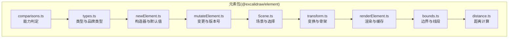
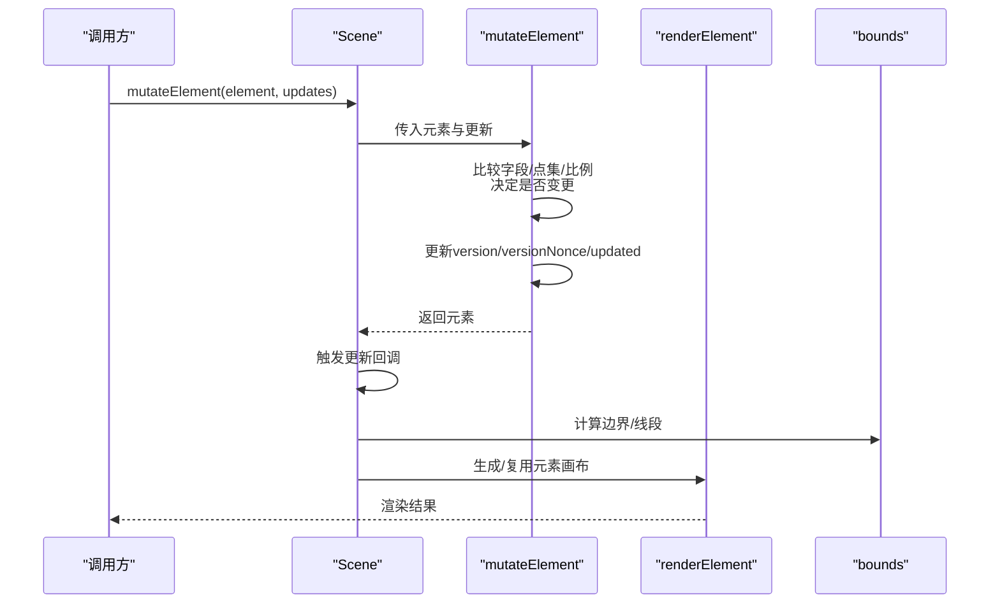
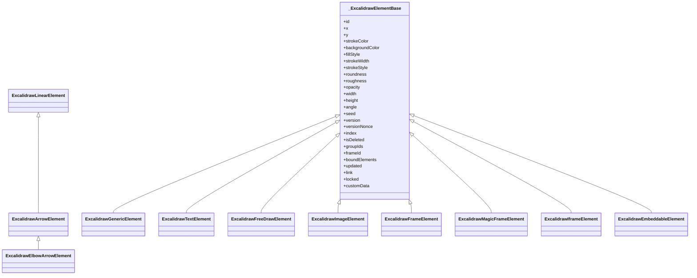
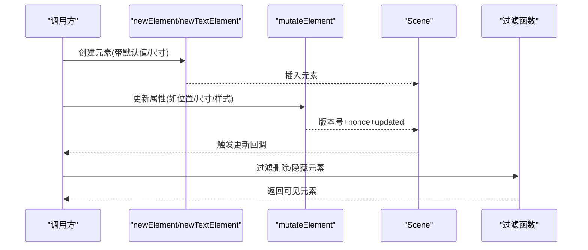
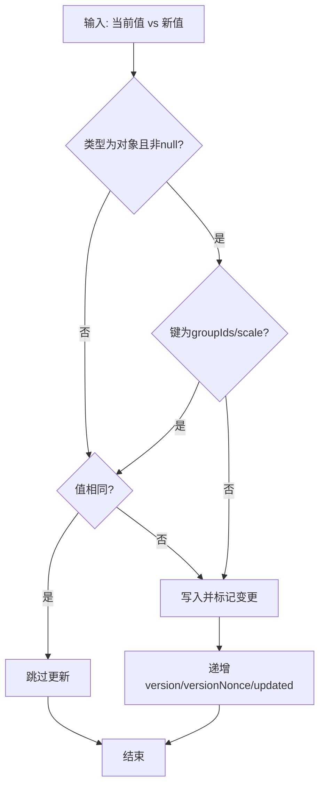
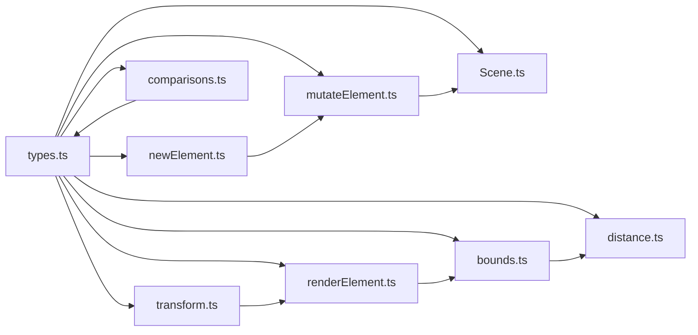

# 元素系统

<cite>
**本文引用的文件**
- [packages/element/src/index.ts](file://packages/element/src/index.ts)
- [packages/element/src/types.ts](file://packages/element/src/types.ts)
- [packages/element/src/newElement.ts](file://packages/element/src/newElement.ts)
- [packages/element/src/mutateElement.ts](file://packages/element/src/mutateElement.ts)
- [packages/element/src/transform.ts](file://packages/element/src/transform.ts)
- [packages/element/src/renderElement.ts](file://packages/element/src/renderElement.ts)
- [packages/element/src/bounds.ts](file://packages/element/src/bounds.ts)
- [packages/element/src/comparisons.ts](file://packages/element/src/comparisons.ts)
- [packages/element/src/distance.ts](file://packages/element/src/distance.ts)
- [packages/element/src/Scene.ts](file://packages/element/src/Scene.ts)
- [packages/element/package.json](file://packages/element/package.json)
</cite>

## 目录
1. [简介](#简介)
2. [项目结构](#项目结构)
3. [核心组件](#核心组件)
4. [架构总览](#架构总览)
5. [详细组件分析](#详细组件分析)
6. [依赖分析](#依赖分析)
7. [性能考量](#性能考量)
8. [故障排查指南](#故障排查指南)
9. [结论](#结论)
10. [附录](#附录)

## 简介
本文件面向开发者与高级用户，系统化梳理 Excalidraw 的元素系统：从类型体系、创建/修改/删除/查询 API，到变换（缩放、旋转、平移）、比较与差异检测、序列化与反序列化、层级与选择机制、批量操作，以及扩展新元素类型的开发指南。目标是帮助你在不深入源码的前提下，快速掌握元素系统的设计思想与使用方式。

## 项目结构
元素系统主要位于 @excalidraw/element 包中，核心模块包括：
- 类型与基础结构：types.ts
- 创建与初始化：newElement.ts
- 修改与版本控制：mutateElement.ts
- 场景与选择：Scene.ts
- 变换与骨架生成：transform.ts
- 渲染与缓存：renderElement.ts
- 边界与距离：bounds.ts、distance.ts
- 比较与工具：comparisons.ts

图表来源
- [packages/element/src/types.ts](file://packages/element/src/types.ts)
- [packages/element/src/newElement.ts](file://packages/element/src/newElement.ts)
- [packages/element/src/mutateElement.ts](file://packages/element/src/mutateElement.ts)
- [packages/element/src/Scene.ts](file://packages/element/src/Scene.ts)
- [packages/element/src/transform.ts](file://packages/element/src/transform.ts)
- [packages/element/src/renderElement.ts](file://packages/element/src/renderElement.ts)
- [packages/element/src/bounds.ts](file://packages/element/src/bounds.ts)
- [packages/element/src/distance.ts](file://packages/element/src/distance.ts)
- [packages/element/src/comparisons.ts](file://packages/element/src/comparisons.ts)

章节来源
- [packages/element/src/index.ts](file://packages/element/src/index.ts)
- [packages/element/package.json](file://packages/element/package.json)

## 核心组件
- 元素类型体系：统一的只读基础结构 _ExcalidrawElementBase，派生出通用形状、文本、线性元素、箭头、自由绘制、图像、帧等类型；通过联合类型 ExcalidrawElement 聚合。
- 创建器：newElement、newTextElement、newLinearElement、newArrowElement、newImageElement、newFrameElement、newMagicFrameElement 等，负责默认值注入与初始尺寸计算。
- 变更器：mutateElement/newElementWith/bumpVersion，负责字段变更、版本号与时间戳更新、缓存失效与校验。
- 场景：Scene 提供元素集合、索引、选择缓存、插入/替换、回调通知等。
- 变换：transform.ts 提供骨架转换、绑定、容器标签、帧布局等。
- 渲染：renderElement.ts 提供画布生成、缓存、主题与滤镜、文本换行与跨度渲染、图像裁剪与 HSLA 调节。
- 边界与距离：bounds.ts 计算旋转/非旋转边界、线段、椭圆近似；distance.ts 计算点到元素距离。
- 比较与能力：comparisons.ts 提供“是否有背景/描边/圆角”等类型能力判定。

章节来源
- [packages/element/src/types.ts](file://packages/element/src/types.ts)
- [packages/element/src/newElement.ts](file://packages/element/src/newElement.ts)
- [packages/element/src/mutateElement.ts](file://packages/element/src/mutateElement.ts)
- [packages/element/src/Scene.ts](file://packages/element/src/Scene.ts)
- [packages/element/src/transform.ts](file://packages/element/src/transform.ts)
- [packages/element/src/renderElement.ts](file://packages/element/src/renderElement.ts)
- [packages/element/src/bounds.ts](file://packages/element/src/bounds.ts)
- [packages/element/src/distance.ts](file://packages/element/src/distance.ts)
- [packages/element/src/comparisons.ts](file://packages/element/src/comparisons.ts)

## 架构总览
元素系统围绕“不可变更新 + 版本号 + 缓存 + 场景索引”的设计展开：
- 不可变更新：通过 newElementWith 返回新对象，避免直接修改原对象。
- 版本号：每个元素维护 version/versionNonce/updated，用于协作同步与冲突解决。
- 缓存：ShapeCache、elementWithCanvasCache、bounds 缓存提升渲染与几何计算性能。
- 场景索引：Scene 维护有序元素数组、映射、帧集合、选择缓存与回调通知。

图表来源
- [packages/element/src/Scene.ts](file://packages/element/src/Scene.ts)
- [packages/element/src/mutateElement.ts](file://packages/element/src/mutateElement.ts)
- [packages/element/src/renderElement.ts](file://packages/element/src/renderElement.ts)
- [packages/element/src/bounds.ts](file://packages/element/src/bounds.ts)

## 详细组件分析

### 类型体系与继承关系
- 基础只读结构：_ExcalidrawElementBase 定义 id/x/y/strokeColor/backgroundColor/fillStyle/strokeWidth/strokeStyle/roundness/roughness/opacity/width/height/angle/seed/version/versionNonce/index/isDeleted/groupIds/frameId/boundElements/updated/link/locked/customData 等。
- 具体元素类型：
  - 通用形状：rectangle、diamond、ellipse、selection
  - 文本：text（含容器、自动换行、行高、内联样式）
  - 线性元素：line（可多段/折线）与 arrow（含 elbowArrow）
  - 自由绘制：freedraw（points/pressures/simulatePressure）
  - 图像：image（fileId/status/scale/crop/imageHSLA）
  - 帧：frame 与 magicframe（name）
  - iframe/embeddable：嵌入内容
- 联合类型：ExcalidrawElement 聚合上述类型；ExcalidrawNonSelectionElement 排除 selection。
- 品牌与映射：ElementsMap/NonDeletedSceneElementsMap 等品牌类型确保类型安全。

图表来源
- [packages/element/src/types.ts](file://packages/element/src/types.ts)

章节来源
- [packages/element/src/types.ts](file://packages/element/src/types.ts)

### 创建、修改、删除与查询 API
- 创建
  - newElement：通用形状构造器，注入默认值与随机种子。
  - newTextElement：根据字体、行高、文本测量自动计算尺寸与位置偏移。
  - newLinearElement/newArrowElement：线性元素与箭头，支持 start/endBinding、start/endArrowhead、points。
  - newImageElement：图像元素，包含状态、缩放、裁剪与 HSLA。
  - newFrameElement/newMagicFrameElement：帧容器，name 可选。
- 修改
  - mutateElement：在元素上应用更新，智能跳过未变化字段，更新版本号与时间戳，必要时清理缓存。
  - newElementWith：返回新对象，用于不可变更新链路。
  - bumpVersion：仅递增版本号与重置 nonce。
- 删除
  - 将元素的 isDeleted 设为 true 并触发场景更新（通常通过 mutateElement 完成）。
- 查询
  - Scene.getElement/getNonDeletedElement：按 id 获取元素或非删除元素。
  - Scene.getSelectedElements：基于选择集与选项（是否包含绑定文本、帧内元素）进行缓存式选择。
  - getNonDeletedElements/getVisibleElements：过滤删除与“不可见小元素”。

图表来源
- [packages/element/src/newElement.ts](file://packages/element/src/newElement.ts)
- [packages/element/src/mutateElement.ts](file://packages/element/src/mutateElement.ts)
- [packages/element/src/Scene.ts](file://packages/element/src/Scene.ts)
- [packages/element/src/index.ts](file://packages/element/src/index.ts)

章节来源
- [packages/element/src/newElement.ts](file://packages/element/src/newElement.ts)
- [packages/element/src/mutateElement.ts](file://packages/element/src/mutateElement.ts)
- [packages/element/src/Scene.ts](file://packages/element/src/Scene.ts)
- [packages/element/src/index.ts](file://packages/element/src/index.ts)

### 元素变换系统（缩放、旋转、平移、复合变换）
- 旋转：元素 angle 字段以弧度表示，渲染时通过上下文旋转实现。
- 缩放：图像元素支持 scale[horizontal, vertical]，渲染时应用缩放与滤镜（HSLA/DarkMode）。
- 平移：元素 x/y 表示左上角坐标，自由绘制与线性元素通过 points/绝对坐标参与变换。
- 复合变换：bounds.ts 提供旋转后的边界计算；renderElement.ts 在生成画布时结合 devicePixelRatio、缩放与偏移；transform.ts 支持骨架转换与绑定。

图表来源
- [packages/element/src/bounds.ts](file://packages/element/src/bounds.ts)
- [packages/element/src/renderElement.ts](file://packages/element/src/renderElement.ts)
- [packages/element/src/transform.ts](file://packages/element/src/transform.ts)

章节来源
- [packages/element/src/bounds.ts](file://packages/element/src/bounds.ts)
- [packages/element/src/renderElement.ts](file://packages/element/src/renderElement.ts)
- [packages/element/src/transform.ts](file://packages/element/src/transform.ts)

### 元素比较、相等性判断与差异检测
- 相等性：通过比较字段与对象属性（如 groupIds/scale）避免误判未变更；点集长度与逐点比较优化线性/自由绘制元素。
- 差异检测：mutateElement 内部对每个更新键进行严格比较，仅当值真正变化时才写入并递增版本号。
- 能力判定：comparisons.ts 提供 hasBackground/hasStrokeColor/hasStrokeWidth/hasStrokeStyle/canChangeRoundness/toolIsArrow/canHaveArrowheads 等类型能力，辅助 UI 与交互逻辑。

图表来源
- [packages/element/src/mutateElement.ts](file://packages/element/src/mutateElement.ts)
- [packages/element/src/comparisons.ts](file://packages/element/src/comparisons.ts)

章节来源
- [packages/element/src/mutateElement.ts](file://packages/element/src/mutateElement.ts)
- [packages/element/src/comparisons.ts](file://packages/element/src/comparisons.ts)

### 自定义元素类型的开发指南
- 注册与类型声明
  - 在 types.ts 中扩展 _ExcalidrawElementBase 的派生类型（如 MyCustomElement），并在 ExcalidrawElement 联合类型中加入。
  - 导出类型别名与工厂函数（参考 newElement/newTextElement/newLinearElement 等模式）。
- 渲染
  - 在 renderElement.ts 的 drawElementOnCanvas 分支中添加自定义类型分支，使用 ShapeCache/generateRoughOptions 或 Canvas API 绘制。
  - 如需画布缓存，使用 elementWithCanvasCache 存储与复用。
- 交互与变换
  - 在 transform.ts 中扩展转换逻辑（如骨架生成、绑定、标签）。
  - 若涉及点集/尺寸，参考 bounds.ts 的边界计算与 distance.ts 的距离计算。
- 版本与缓存
  - 使用 mutateElement/newElementWith/bumpVersion 确保版本号正确递增与缓存失效。
- 序列化
  - 保持元素为 JSON 可序列化（已由只读结构与内置字段满足），遵循 types.ts 的字段约定。

章节来源
- [packages/element/src/types.ts](file://packages/element/src/types.ts)
- [packages/element/src/renderElement.ts](file://packages/element/src/renderElement.ts)
- [packages/element/src/transform.ts](file://packages/element/src/transform.ts)
- [packages/element/src/bounds.ts](file://packages/element/src/bounds.ts)
- [packages/element/src/distance.ts](file://packages/element/src/distance.ts)
- [packages/element/src/mutateElement.ts](file://packages/element/src/mutateElement.ts)

### 序列化、反序列化与数据格式规范
- 序列化
  - 元素为只读结构，字段均为基本类型或简单对象，天然 JSON 可序列化。
  - Scene 与元素集合通过 fractional indexing 维护顺序，保证多端一致性。
- 反序列化
  - 通过 Scene.replaceElements 或 transform.ts 的 convertToExcalidrawElements 将骨架转换为实际元素，自动处理绑定、标签与帧布局。
- 数据格式要点
  - id 必须唯一；version/versionNonce 用于冲突解决；index 用于多端排序；isDeleted 标记删除；boundElements 记录绑定关系；frameId 指向容器帧。
  - 文本元素包含 spans 时，按行拆分渲染；图像元素支持 crop 与 HSLA 调节。

章节来源
- [packages/element/src/types.ts](file://packages/element/src/types.ts)
- [packages/element/src/Scene.ts](file://packages/element/src/Scene.ts)
- [packages/element/src/transform.ts](file://packages/element/src/transform.ts)

### 层级管理、选择机制与批量操作
- 层级
  - fractional index 保证元素顺序与多端一致；Scene.insertElementsAtIndex/insertElement 与 syncMovedIndices/syncInvalidIndices 维护索引。
  - 帧容器 frame/magicframe 管理子元素，子元素 frameId 指向容器，boundElements 记录绑定文本。
- 选择
  - Scene.getSelectedElements 基于 selectedElementIds 与选项（包含绑定文本/帧内元素）进行缓存式选择。
  - getNonDeletedElements/getVisibleElements 过滤删除与“不可见小元素”。
- 批量操作
  - Scene.mapElements 对全量元素映射，若发生变更则整体替换，避免不必要的重绘。
  - mutateElement 支持批量微更新（如拖拽过程中的多次更新），最终触发一次渲染。

章节来源
- [packages/element/src/Scene.ts](file://packages/element/src/Scene.ts)
- [packages/element/src/index.ts](file://packages/element/src/index.ts)
- [packages/element/src/transform.ts](file://packages/element/src/transform.ts)

## 依赖分析
- 内部依赖
  - types.ts 为所有模块提供类型基础；newElement/mutateElement/Scene/transform/renderElement/bounds/distance/comparisons 依次依赖类型与彼此的工具函数。
- 外部依赖
  - roughjs 用于形状生成与绘制；lodash.throttle 用于索引验证节流；@excalidraw/math/@excalidraw/common 提供数学与通用工具。

图表来源
- [packages/element/src/types.ts](file://packages/element/src/types.ts)
- [packages/element/src/newElement.ts](file://packages/element/src/newElement.ts)
- [packages/element/src/mutateElement.ts](file://packages/element/src/mutateElement.ts)
- [packages/element/src/Scene.ts](file://packages/element/src/Scene.ts)
- [packages/element/src/transform.ts](file://packages/element/src/transform.ts)
- [packages/element/src/renderElement.ts](file://packages/element/src/renderElement.ts)
- [packages/element/src/bounds.ts](file://packages/element/src/bounds.ts)
- [packages/element/src/distance.ts](file://packages/element/src/distance.ts)
- [packages/element/src/comparisons.ts](file://packages/element/src/comparisons.ts)

章节来源
- [packages/element/src/index.ts](file://packages/element/src/index.ts)
- [packages/element/package.json](file://packages/element/package.json)

## 性能考量
- 缓存策略
  - ShapeCache：缓存元素形状，避免重复生成。
  - elementWithCanvasCache：缓存元素画布，按 zoom/theme/spans/crop/HSLA/帧透明度等条件复用。
  - bounds 缓存：按 version 缓存边界，减少旋转/线性元素计算。
- 跳过更新
  - mutateElement 对未变化字段与点集进行短路判断，避免无意义的版本号递增与渲染。
- 索引与批量
  - fractional index 与批量插入/映射减少重排成本；throttle 验证索引，降低开销。
- 渲染限制
  - 画布尺寸与面积上限保护，避免超大画布导致内存问题。

章节来源
- [packages/element/src/renderElement.ts](file://packages/element/src/renderElement.ts)
- [packages/element/src/bounds.ts](file://packages/element/src/bounds.ts)
- [packages/element/src/mutateElement.ts](file://packages/element/src/mutateElement.ts)
- [packages/element/src/Scene.ts](file://packages/element/src/Scene.ts)

## 故障排查指南
- 协作同步异常
  - 检查 version 与 versionNonce 是否正确递增；确认 fractional index 是否有效。
  - 参考 bumpElementVersions 与 restore.ts 的修复逻辑。
- 渲染异常
  - 确认 devicePixelRatio、缩放与画布尺寸限制；检查 imageCache 是否存在对应 fileId。
  - 检查 elementWithCanvasCache 的命中条件（zoom/theme/spans/crop/HSLA/帧透明度/角度）。
- 几何计算异常
  - 旋转后边界与线段计算依赖 angle；确认 bounds 缓存版本是否匹配。
  - 点到元素距离计算依赖具体类型分支，确认类型分支覆盖完整。
- 选择与层级问题
  - 选择缓存依赖 selectedElementIds 与选项哈希；清空缓存或更换元素集可避免命中旧缓存。
  - 帧内元素与绑定文本的选择需开启相应选项。

章节来源
- [packages/element/src/Scene.ts](file://packages/element/src/Scene.ts)
- [packages/element/src/renderElement.ts](file://packages/element/src/renderElement.ts)
- [packages/element/src/bounds.ts](file://packages/element/src/bounds.ts)
- [packages/element/src/distance.ts](file://packages/element/src/distance.ts)
- [packages/element/src/transform.ts](file://packages/element/src/transform.ts)
- [packages/excalidraw/data/restore.ts](file://packages/excalidraw/data/restore.ts)

## 结论
Excalidraw 元素系统以类型安全为核心，通过不可变更新、版本号与缓存机制保障协作与性能；以 Scene 为中心组织元素生命周期，配合 transform/render/bounds 等模块完成从创建到渲染的完整链路。开发者可按本文指南扩展新元素类型，并遵循版本与缓存策略，确保行为一致与性能稳定。

## 附录
- 关键导出与入口
  - packages/element/src/index.ts 汇总导出各类工具与模块，便于上层应用按需引入。
- 开发建议
  - 新元素类型应尽量复用现有工厂函数与渲染路径。
  - 优先使用 newElementWith 进行不可变更新，避免直接修改元素。
  - 在复杂变换场景下，先计算边界与骨架，再生成画布，以获得最佳性能。

章节来源
- [packages/element/src/index.ts](file://packages/element/src/index.ts)
- [packages/element/package.json](file://packages/element/package.json)