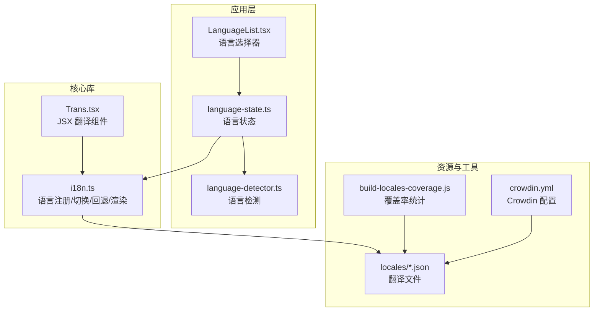
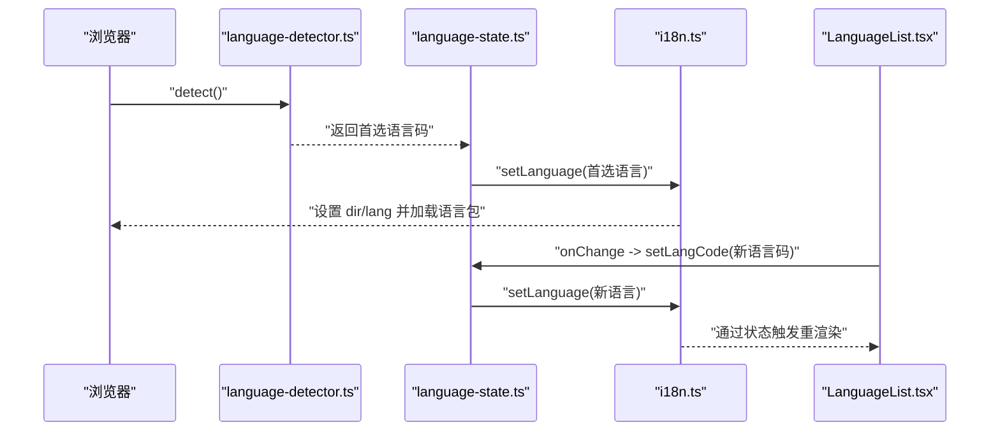
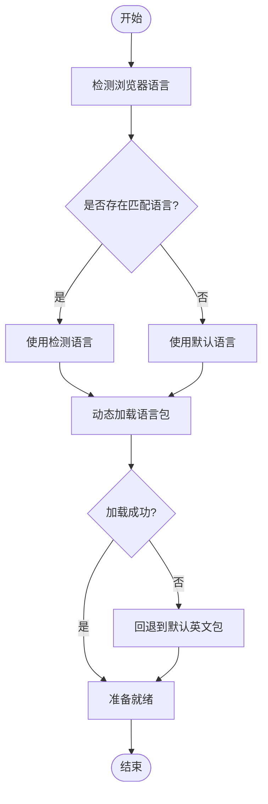
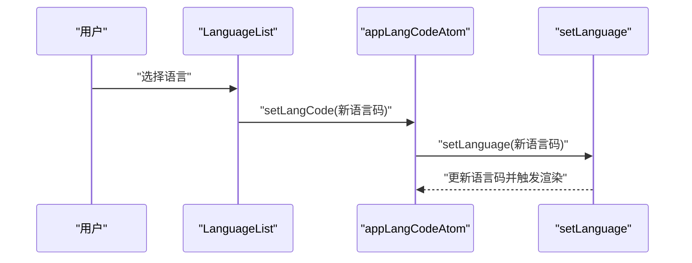
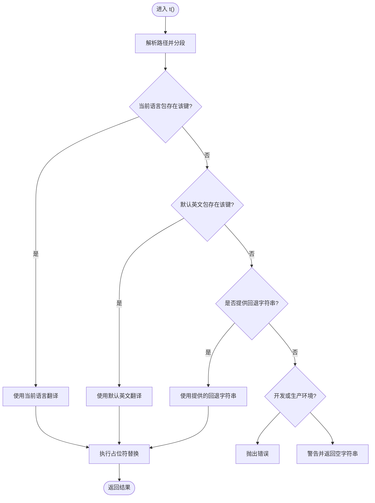
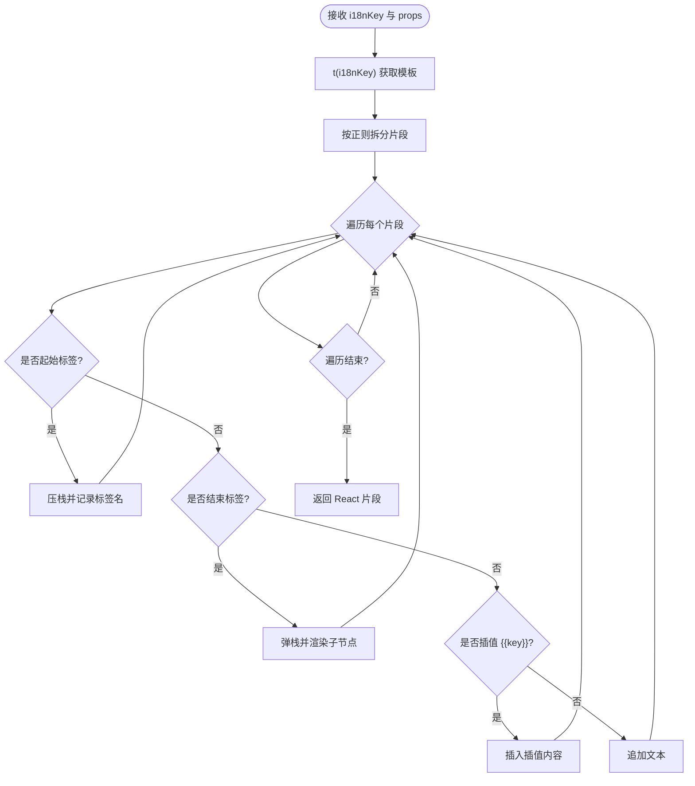
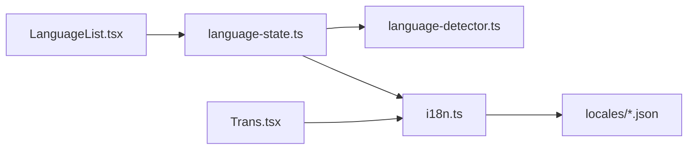

# 国际化支持

<cite>
**本文引用的文件**
- [packages/excalidraw/i18n.ts](file://packages/excalidraw/i18n.ts)
- [excalidraw-app/app-language/LanguageList.tsx](file://excalidraw-app/app-language/LanguageList.tsx)
- [excalidraw-app/app-language/language-detector.ts](file://excalidraw-app/app-language/language-detector.ts)
- [excalidraw-app/app-language/language-state.ts](file://excalidraw-app/app-language/language-state.ts)
- [packages/excalidraw/components/Trans.tsx](file://packages/excalidraw/components/Trans.tsx)
- [crowdin.yml](file://crowdin.yml)
- [scripts/build-locales-coverage.js](file://scripts/build-locales-coverage.js)
- [packages/excalidraw/package.json](file://packages/excalidraw/package.json)
</cite>

## 目录
1. [简介](#简介)
2. [项目结构](#项目结构)
3. [核心组件](#核心组件)
4. [架构总览](#架构总览)
5. [详细组件分析](#详细组件分析)
6. [依赖关系分析](#依赖关系分析)
7. [性能考量](#性能考量)
8. [故障排查指南](#故障排查指南)
9. [结论](#结论)
10. [附录](#附录)

## 简介
本文件系统性阐述 Excalidraw 的国际化（i18n）架构与实现，覆盖语言检测、语言状态管理、动态切换、翻译键值与本地化流程、语言回退与默认语言处理、语言包加载策略、RTL 文本方向、数字与日期时间本地化建议、翻译贡献流程与质量保障，以及字体与文化适配的最佳实践。目标是帮助开发者快速理解并正确集成国际化能力。

## 项目结构
国际化相关代码主要分布在以下位置：
- 核心 i18n 能力与翻译键值：packages/excalidraw/i18n.ts
- 翻译渲染组件：packages/excalidraw/components/Trans.tsx
- 应用层语言选择器与状态：excalidraw-app/app-language/*
- 翻译文件与覆盖率统计：packages/excalidraw/locales/* 与 scripts/build-locales-coverage.js
- 翻译平台配置：crowdin.yml

图表来源
- [packages/excalidraw/i18n.ts:1-173](file://packages/excalidraw/i18n.ts#L1-L173)
- [packages/excalidraw/components/Trans.tsx:1-172](file://packages/excalidraw/components/Trans.tsx#L1-L172)
- [excalidraw-app/app-language/LanguageList.tsx:1-28](file://excalidraw-app/app-language/LanguageList.tsx#L1-L28)
- [excalidraw-app/app-language/language-detector.ts:1-26](file://excalidraw-app/app-language/language-detector.ts#L1-L26)
- [excalidraw-app/app-language/language-state.ts:1-18](file://excalidraw-app/app-language/language-state.ts#L1-L18)
- [scripts/build-locales-coverage.js:1-38](file://scripts/build-locales-coverage.js#L1-L38)
- [crowdin.yml:1-4](file://crowdin.yml#L1-L4)

章节来源
- [packages/excalidraw/i18n.ts:1-173](file://packages/excalidraw/i18n.ts#L1-L173)
- [packages/excalidraw/components/Trans.tsx:1-172](file://packages/excalidraw/components/Trans.tsx#L1-L172)
- [excalidraw-app/app-language/LanguageList.tsx:1-28](file://excalidraw-app/app-language/LanguageList.tsx#L1-L28)
- [excalidraw-app/app-language/language-detector.ts:1-26](file://excalidraw-app/app-language/language-detector.ts#L1-L26)
- [excalidraw-app/app-language/language-state.ts:1-18](file://excalidraw-app/app-language/language-state.ts#L1-L18)
- [scripts/build-locales-coverage.js:1-38](file://scripts/build-locales-coverage.js#L1-L38)
- [crowdin.yml:1-4](file://crowdin.yml#L1-L4)

## 核心组件
- 语言注册与回退
  - 默认语言与可用语言列表、RTL 标记、完成度阈值过滤、开发测试语言注入等逻辑集中在 i18n.ts 中。
- 语言切换与 DOM 属性设置
  - setLanguage 负责设置 documentElement 的 dir/lang，并通过状态存储触发渲染更新。
- 翻译函数与键值类型
  - t(path, replacements?, fallback?) 提供键值解析、回退与占位符替换；TranslationKeys 基于默认英文键树生成。
- JSX 翻译组件
  - Trans 将带标签与插值的模板字符串拆解并渲染为 React 结构，支持自定义标签渲染器。
- 应用层语言选择器
  - LanguageList 提供下拉选择，联动语言状态进行切换。
- 语言检测与缓存
  - 使用 i18next-browser-languagedetector 进行浏览器语言检测，结合语言前缀匹配与默认语言兜底。
- 语言状态管理
  - Jotai atom 维护当前语言码，变更时调用缓存接口持久化用户偏好。

章节来源
- [packages/excalidraw/i18n.ts:11-173](file://packages/excalidraw/i18n.ts#L11-L173)
- [packages/excalidraw/components/Trans.tsx:153-172](file://packages/excalidraw/components/Trans.tsx#L153-L172)
- [excalidraw-app/app-language/LanguageList.tsx:8-27](file://excalidraw-app/app-language/LanguageList.tsx#L8-L27)
- [excalidraw-app/app-language/language-detector.ts:10-25](file://excalidraw-app/app-language/language-detector.ts#L10-L25)
- [excalidraw-app/app-language/language-state.ts:7-17](file://excalidraw-app/app-language/language-state.ts#L7-L17)

## 架构总览
整体流程：应用启动时通过语言检测确定初始语言；用户在界面中选择语言后，状态写入并触发语言切换；渲染层通过 useI18n 获取翻译函数与当前语言码，JSX 场景使用 Trans 渲染。

图表来源
- [excalidraw-app/app-language/language-detector.ts:10-25](file://excalidraw-app/app-language/language-detector.ts#L10-L25)
- [excalidraw-app/app-language/language-state.ts:7-17](file://excalidraw-app/app-language/language-state.ts#L7-L17)
- [packages/excalidraw/i18n.ts:92-109](file://packages/excalidraw/i18n.ts#L92-L109)
- [excalidraw-app/app-language/LanguageList.tsx:12-26](file://excalidraw-app/app-language/LanguageList.tsx#L12-L26)

## 详细组件分析

### 语言检测与回退机制
- 检测策略
  - 使用 i18next-browser-languagedetector 获取浏览器首选语言列表。
  - 若检测到的语言存在对应可用语言（按前缀匹配），则采用该语言；否则回退到默认语言。
- 回退链路
  - 当前语言包加载失败时，回退到默认英文包；若仍找不到键值，则在生产环境返回空字符串并在控制台警告，开发环境抛出错误以便定位缺失键。

图表来源
- [excalidraw-app/app-language/language-detector.ts:10-25](file://excalidraw-app/app-language/language-detector.ts#L10-L25)
- [packages/excalidraw/i18n.ts:92-109](file://packages/excalidraw/i18n.ts#L92-L109)
- [packages/excalidraw/i18n.ts:144-152](file://packages/excalidraw/i18n.ts#L144-L152)

章节来源
- [excalidraw-app/app-language/language-detector.ts:1-26](file://excalidraw-app/app-language/language-detector.ts#L1-L26)
- [packages/excalidraw/i18n.ts:92-109](file://packages/excalidraw/i18n.ts#L92-L109)
- [packages/excalidraw/i18n.ts:144-152](file://packages/excalidraw/i18n.ts#L144-L152)

### 语言状态管理与动态切换
- 状态原子
  - appLangCodeAtom 初始值来自语言检测；变更时调用缓存接口持久化用户语言偏好。
- 切换流程
  - 用户在 LanguageList 中选择语言，写入状态；setLanguage 更新 DOM 属性与语言数据源，触发渲染。

图表来源
- [excalidraw-app/app-language/LanguageList.tsx:12-26](file://excalidraw-app/app-language/LanguageList.tsx#L12-L26)
- [excalidraw-app/app-language/language-state.ts:7-17](file://excalidraw-app/app-language/language-state.ts#L7-L17)
- [packages/excalidraw/i18n.ts:92-109](file://packages/excalidraw/i18n.ts#L92-L109)

章节来源
- [excalidraw-app/app-language/LanguageList.tsx:1-28](file://excalidraw-app/app-language/LanguageList.tsx#L1-L28)
- [excalidraw-app/app-language/language-state.ts:1-18](file://excalidraw-app/app-language/language-state.ts#L1-L18)
- [packages/excalidraw/i18n.ts:92-109](file://packages/excalidraw/i18n.ts#L92-L109)

### 翻译键值与本地化流程
- 键值类型
  - TranslationKeys 基于默认英文键树生成，确保编译期对键名进行约束。
- 查找与回退
  - 先查当前语言包，再查默认英文包，最后使用传入的回退字符串；开发环境缺失键会抛错，生产环境仅警告并返回空字符串。
- 插值与占位符
  - 支持 {{key}} 占位符替换；Trans 组件支持在模板中嵌入标签与多层插值。

图表来源
- [packages/excalidraw/i18n.ts:127-160](file://packages/excalidraw/i18n.ts#L127-L160)

章节来源
- [packages/excalidraw/i18n.ts:17-173](file://packages/excalidraw/i18n.ts#L17-L173)
- [packages/excalidraw/i18n.ts:127-160](file://packages/excalidraw/i18n.ts#L127-L160)

### JSX 翻译组件 Trans
- 功能特性
  - 将包含插值与标签的模板字符串拆分为片段，按需渲染自定义标签与插值内容。
  - 对未匹配的标签或缺失的插值键发出警告，便于调试。
- 使用场景
  - 在需要保留 HTML 结构或进行复杂文案渲染的场景中使用，避免手动拼接字符串带来的可维护性问题。

图表来源
- [packages/excalidraw/components/Trans.tsx:20-108](file://packages/excalidraw/components/Trans.tsx#L20-L108)

章节来源
- [packages/excalidraw/components/Trans.tsx:1-172](file://packages/excalidraw/components/Trans.tsx#L1-L172)

### 翻译文件组织与覆盖率
- 文件组织
  - 翻译文件位于 packages/excalidraw/locales/*.json，以语言代码命名；默认英文文件作为回退基准。
- 覆盖率统计
  - build-locales-coverage.js 扁平化各语言文件，计算每个键的翻译百分比，输出 percentages.json 用于筛选高完成度语言。
- Crowdin 集成
  - crowdin.yml 指定源文件与翻译文件映射规则，便于云端翻译平台同步。

章节来源
- [scripts/build-locales-coverage.js:1-38](file://scripts/build-locales-coverage.js#L1-L38)
- [crowdin.yml:1-4](file://crowdin.yml#L1-L4)

### 文本方向（RTL）、数字与日期时间本地化
- RTL 支持
  - i18n.ts 在切换语言时设置 documentElement.dir 为 "rtl" 或 "ltr"，并标记 lang，确保样式与布局适配。
- 数字与日期时间
  - 当前实现未内置 ICU/Intl 格式化；如需数字、货币、日期时间的本地化，请在业务层使用 Intl API（例如 DateTimeFormat、NumberFormat）进行格式化，保持与当前语言一致。

章节来源
- [packages/excalidraw/i18n.ts:92-96](file://packages/excalidraw/i18n.ts#L92-L96)

### 字体适配与文化适应性
- 字体加载
  - packages/excalidraw/package.json 中包含字体相关依赖与构建配置，可在主题层引入针对特定语言的字体族，确保非拉丁文字体显示正确。
- 文化适配建议
  - 不同语言的排版、间距与字符宽度差异较大，建议在 UI 主题中为关键区域提供语言级样式变量，并在 RTL 语言下调整边距与对齐方式。

章节来源
- [packages/excalidraw/package.json:80-117](file://packages/excalidraw/package.json#L80-L117)

## 依赖关系分析
- 组件耦合
  - LanguageList 依赖语言状态与 i18n.useI18n；language-state 依赖 language-detector 与 Jotai；i18n.ts 依赖动态导入的语言包与编辑器状态存储。
- 外部依赖
  - i18next-browser-languagedetector 用于浏览器语言检测；Jotai 用于轻量状态管理；React 用于渲染。

图表来源
- [excalidraw-app/app-language/LanguageList.tsx:1-28](file://excalidraw-app/app-language/LanguageList.tsx#L1-L28)
- [excalidraw-app/app-language/language-state.ts:1-18](file://excalidraw-app/app-language/language-state.ts#L1-L18)
- [excalidraw-app/app-language/language-detector.ts:1-26](file://excalidraw-app/app-language/language-detector.ts#L1-L26)
- [packages/excalidraw/i18n.ts:1-173](file://packages/excalidraw/i18n.ts#L1-L173)
- [packages/excalidraw/components/Trans.tsx:1-172](file://packages/excalidraw/components/Trans.tsx#L1-L172)

章节来源
- [excalidraw-app/app-language/LanguageList.tsx:1-28](file://excalidraw-app/app-language/LanguageList.tsx#L1-L28)
- [excalidraw-app/app-language/language-state.ts:1-18](file://excalidraw-app/app-language/language-state.ts#L1-L18)
- [excalidraw-app/app-language/language-detector.ts:1-26](file://excalidraw-app/app-language/language-detector.ts#L1-L26)
- [packages/excalidraw/i18n.ts:1-173](file://packages/excalidraw/i18n.ts#L1-L173)
- [packages/excalidraw/components/Trans.tsx:1-172](file://packages/excalidraw/components/Trans.tsx#L1-L172)

## 性能考量
- 动态导入语言包
  - 通过异步 import 加载语言包，避免首屏体积膨胀；建议仅在语言切换时触发加载。
- 渲染触发
  - 使用 Jotai 原子仅在语言变化时触发相关组件重渲染，降低不必要开销。
- 键值查找
  - 采用路径分段与线性查找，键层级较深时可考虑预构建索引以优化性能（视需求而定）。

## 故障排查指南
- 缺失翻译键
  - 开发环境会抛错，便于快速定位；生产环境仅警告并返回空字符串，避免影响用户体验。
- Trans 渲染异常
  - 检查模板中的标签是否闭合、插值键是否传入；组件会在控制台输出警告信息。
- 语言切换无效
  - 确认状态写入是否生效、DOM dir/lang 是否更新、语言包是否成功加载。

章节来源
- [packages/excalidraw/i18n.ts:144-152](file://packages/excalidraw/i18n.ts#L144-L152)
- [packages/excalidraw/components/Trans.tsx:53-108](file://packages/excalidraw/components/Trans.tsx#L53-L108)
- [excalidraw-app/app-language/language-state.ts:12-14](file://excalidraw-app/app-language/language-state.ts#L12-L14)

## 结论
Excalidraw 的国际化体系以清晰的职责分离为基础：i18n.ts 负责语言注册、切换与回退，Trans 提供 JSX 级别的翻译能力，应用层通过 LanguageList 与状态管理实现用户可控的语言切换。配合 Crowdin 与覆盖率统计，项目实现了从源文件到云端翻译再到本地加载的完整闭环。对于更复杂的本地化需求（如数字/日期格式化），建议在业务层扩展使用 Intl API，并在主题层完善字体与布局适配。

## 附录

### 翻译贡献指南（基于现有工具链）
- 源文件与映射
  - 源文件：packages/excalidraw/locales/en.json
  - 翻译文件：packages/excalidraw/locales/{locale}.json
- 覆盖率统计
  - 运行脚本生成 percentages.json，筛选高完成度语言参与发布。
- 工作流建议
  - 在 Crowdin 上同步 en.json；翻译完成后下载对应语言包并校验键值一致性；运行覆盖率脚本更新统计数据；提交 PR 并通过测试。

章节来源
- [crowdin.yml:1-4](file://crowdin.yml#L1-L4)
- [scripts/build-locales-coverage.js:1-38](file://scripts/build-locales-coverage.js#L1-L38)