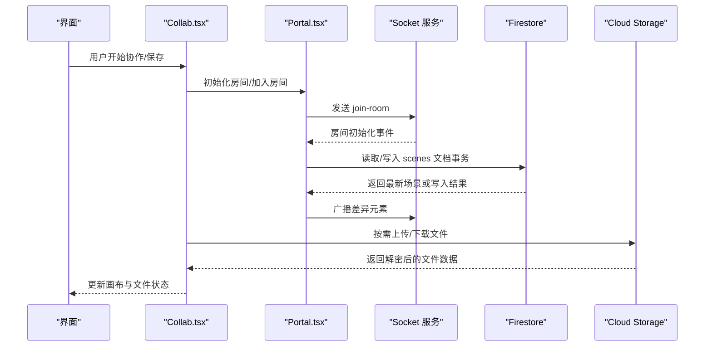
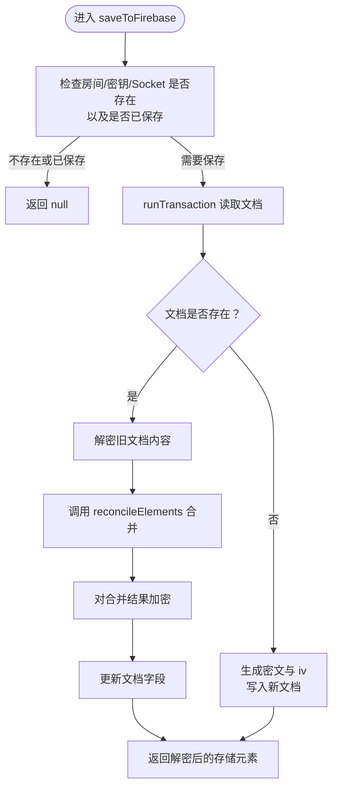
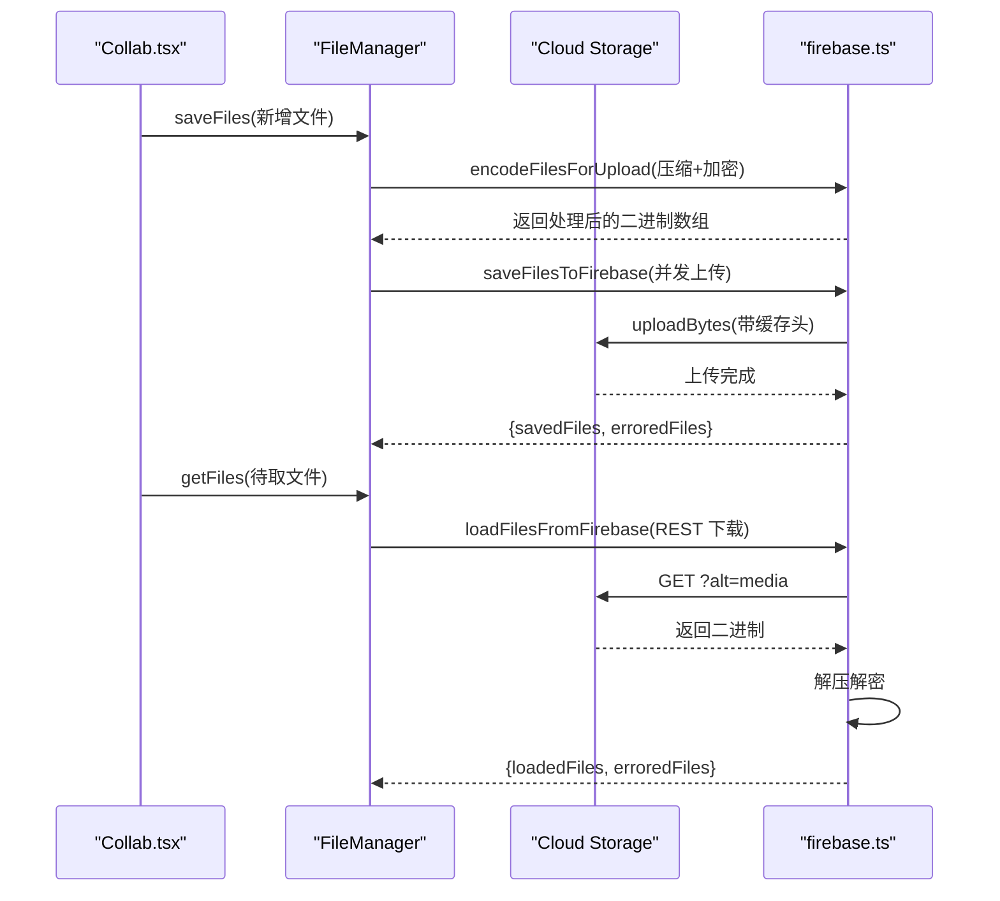
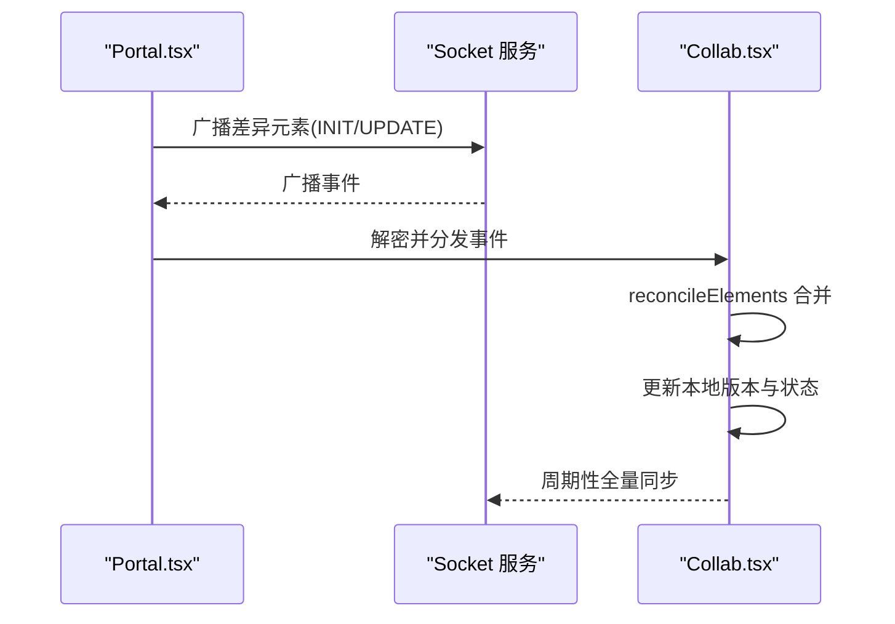
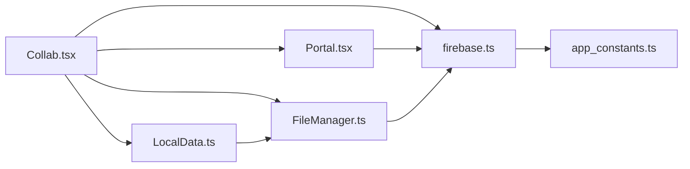

# Firebase 集成

<cite>
**本文引用的文件**
- [excalidraw-app/data/firebase.ts](file://excalidraw-app/data/firebase.ts)
- [excalidraw-app/collab/Collab.tsx](file://excalidraw-app/collab/Collab.tsx)
- [excalidraw-app/collab/Portal.tsx](file://excalidraw-app/collab/Portal.tsx)
- [excalidraw-app/data/index.ts](file://excalidraw-app/data/index.ts)
- [excalidraw-app/data/FileManager.ts](file://excalidraw-app/data/FileManager.ts)
- [excalidraw-app/data/LocalData.ts](file://excalidraw-app/data/LocalData.ts)
- [excalidraw-app/app_constants.ts](file://excalidraw-app/app_constants.ts)
- [excalidraw-app/data/fileStatusStore.ts](file://excalidraw-app/data/fileStatusStore.ts)
- [firebase-project/firestore.rules](file://firebase-project/firestore.rules)
- [firebase-project/storage.rules](file://firebase-project/storage.rules)
- [firebase-project/firestore.indexes.json](file://firebase-project/firestore.indexes.json)
</cite>

## 目录
1. [简介](#简介)
2. [项目结构](#项目结构)
3. [核心组件](#核心组件)
4. [架构总览](#架构总览)
5. [详细组件分析](#详细组件分析)
6. [依赖关系分析](#依赖关系分析)
7. [性能考量](#性能考量)
8. [故障排查指南](#故障排查指南)
9. [结论](#结论)
10. [附录](#附录)

## 简介
本文件面向开发者，系统化梳理本仓库中基于 Firebase 的集成实现，覆盖以下主题：
- Firestore 使用模式：文档结构、事务写入、版本缓存与冲突合并
- Cloud Storage 文件管理：加密压缩后的二进制文件上传、下载与权限控制
- 实时数据库监听与数据同步：Socket.IO 广播、元素差异广播、全量周期同步
- 认证与访问控制：安全规则现状与建议
- 迁移、备份与恢复：本地存储与云端存储的协同策略
- 错误处理、重试与监控：统一的错误提示、状态更新与日志记录

## 项目结构
围绕 Firebase 的核心文件分布如下：
- 数据层与存储：excalidraw-app/data/firebase.ts（Firestore/Storage 封装）
- 协作与同步：excalidraw-app/collab/Collab.tsx（协作主控）、excalidraw-app/collab/Portal.tsx（Socket 会话封装）
- 文件管理：excalidraw-app/data/FileManager.ts（文件状态机与批量操作）、excalidraw-app/data/LocalData.ts（本地 IndexedDB 存储）
- 常量与链接生成：excalidraw-app/app_constants.ts、excalidraw-app/data/index.ts
- 安全规则与索引：firebase-project/firestore.rules、firebase-project/storage.rules、firebase-project/firestore.indexes.json

```mermaid
graph TB
subgraph "前端应用"
A["Collab.tsx<br/>协作主控"]
B["Portal.tsx<br/>Socket 会话封装"]
C["FileManager.ts<br/>文件状态机"]
D["LocalData.ts<br/>本地存储适配器"]
E["firebase.ts<br/>Firestore/Storage 封装"]
F["app_constants.ts<br/>常量与前缀"]
G["fileStatusStore.ts<br/>文件状态快照"]
end
subgraph "Firebase 后端"
FS["Cloud Firestore<br/>集合 scenes"]
ST["Cloud Storage<br/>桶 /files/*"]
RU["Firestore 规则"]
SU["Storage 规则"]
end
A --> B
A --> C
A --> D
A --> E
B --> E
C --> E
D --> C
E --> FS
E --> ST
FS <-- RU
ST <-- SU
```

图表来源
- [excalidraw-app/collab/Collab.tsx:132-706](file://excalidraw-app/collab/Collab.tsx#L132-L706)
- [excalidraw-app/collab/Portal.tsx:25-258](file://excalidraw-app/collab/Portal.tsx#L25-L258)
- [excalidraw-app/data/firebase.ts:104-320](file://excalidraw-app/data/firebase.ts#L104-L320)
- [excalidraw-app/data/FileManager.ts:22-297](file://excalidraw-app/data/FileManager.ts#L22-L297)
- [excalidraw-app/data/LocalData.ts:117-228](file://excalidraw-app/data/LocalData.ts#L117-L228)
- [excalidraw-app/app_constants.ts:32-35](file://excalidraw-app/app_constants.ts#L32-L35)
- [firebase-project/firestore.rules:1-11](file://firebase-project/firestore.rules#L1-L11)
- [firebase-project/storage.rules:1-12](file://firebase-project/storage.rules#L1-L12)

章节来源
- [excalidraw-app/data/firebase.ts:104-320](file://excalidraw-app/data/firebase.ts#L104-L320)
- [excalidraw-app/collab/Collab.tsx:132-706](file://excalidraw-app/collab/Collab.tsx#L132-L706)
- [excalidraw-app/collab/Portal.tsx:25-258](file://excalidraw-app/collab/Portal.tsx#L25-L258)
- [excalidraw-app/data/FileManager.ts:22-297](file://excalidraw-app/data/FileManager.ts#L22-L297)
- [excalidraw-app/data/LocalData.ts:117-228](file://excalidraw-app/data/LocalData.ts#L117-L228)
- [excalidraw-app/app_constants.ts:32-35](file://excalidraw-app/app_constants.ts#L32-L35)
- [firebase-project/firestore.rules:1-11](file://firebase-project/firestore.rules#L1-L11)
- [firebase-project/storage.rules:1-12](file://firebase-project/storage.rules#L1-L12)
- [firebase-project/firestore.indexes.json:1-5](file://firebase-project/firestore.indexes.json#L1-L5)

## 核心组件
- Firebase 封装（Firestore/Storage）：负责初始化、文档读写、事务、加解密、文件上传下载与缓存控制
- 协作主控（Collab）：负责房间生命周期、场景初始化、元素合并、错误提示、离线状态
- Socket 会话（Portal）：负责与后端 Socket 通信、消息广播、差异元素追踪、节流保存
- 文件管理（FileManager）：文件状态机、去重并发、错误回退、批量保存与拉取
- 本地存储（LocalData）：IndexedDB 文件存储、本地状态持久化、清理过期文件
- 常量与工具（app_constants、data/index）：房间与密钥生成、分享链接构造、导出/导入流程

章节来源
- [excalidraw-app/data/firebase.ts:104-320](file://excalidraw-app/data/firebase.ts#L104-L320)
- [excalidraw-app/collab/Collab.tsx:132-706](file://excalidraw-app/collab/Collab.tsx#L132-L706)
- [excalidraw-app/collab/Portal.tsx:25-258](file://excalidraw-app/collab/Portal.tsx#L25-L258)
- [excalidraw-app/data/FileManager.ts:22-297](file://excalidraw-app/data/FileManager.ts#L22-L297)
- [excalidraw-app/data/LocalData.ts:117-228](file://excalidraw-app/data/LocalData.ts#L117-L228)
- [excalidraw-app/app_constants.ts:32-35](file://excalidraw-app/app_constants.ts#L32-L35)
- [excalidraw-app/data/index.ts:138-165](file://excalidraw-app/data/index.ts#L138-L165)

## 架构总览
整体采用“Socket 实时广播 + Firestore 场景快照 + Cloud Storage 文件存储”的混合架构：
- Socket 负责高频、低延迟的元素增量广播与用户状态同步
- Firestore 作为最终一致的场景快照存储，配合事务保证一致性
- Cloud Storage 存储加密压缩后的二进制文件，按房间/分享链接前缀隔离
- 本地 IndexedDB 作为文件缓存与状态持久化补充



图表来源
- [excalidraw-app/collab/Collab.tsx:471-706](file://excalidraw-app/collab/Collab.tsx#L471-L706)
- [excalidraw-app/collab/Portal.tsx:37-183](file://excalidraw-app/collab/Portal.tsx#L37-L183)
- [excalidraw-app/data/firebase.ts:187-247](file://excalidraw-app/data/firebase.ts#L187-L247)
- [excalidraw-app/data/firebase.ts:274-319](file://excalidraw-app/data/firebase.ts#L274-L319)

## 详细组件分析

### Firestore 场景存储与事务写入
- 文档结构：每个房间一个文档，包含场景版本号、初始化向量与密文
- 写入策略：使用事务读取 -> 合并 -> 写入，避免并发覆盖
- 版本缓存：弱引用缓存当前 Socket 的场景版本，用于判断是否已保存



图表来源
- [excalidraw-app/data/firebase.ts:187-247](file://excalidraw-app/data/firebase.ts#L187-L247)
- [excalidraw-app/data/firebase.ts:118-129](file://excalidraw-app/data/firebase.ts#L118-L129)

章节来源
- [excalidraw-app/data/firebase.ts:187-247](file://excalidraw-app/data/firebase.ts#L187-L247)
- [excalidraw-app/data/firebase.ts:118-129](file://excalidraw-app/data/firebase.ts#L118-L129)

### Cloud Storage 文件管理
- 加密压缩：文件在上传前进行压缩与加密，元信息包含 MIME 类型、创建时间等
- 批量上传：并发上传多个文件，分别记录成功/失败列表
- 下载与解密：通过 REST API 获取文件，解压解密后注入画布
- 缓存控制：设置较长 max-age，减少重复下载



图表来源
- [excalidraw-app/data/FileManager.ts:92-137](file://excalidraw-app/data/FileManager.ts#L92-L137)
- [excalidraw-app/data/FileManager.ts:139-180](file://excalidraw-app/data/FileManager.ts#L139-L180)
- [excalidraw-app/data/firebase.ts:145-172](file://excalidraw-app/data/firebase.ts#L145-L172)
- [excalidraw-app/data/firebase.ts:274-319](file://excalidraw-app/data/firebase.ts#L274-L319)

章节来源
- [excalidraw-app/data/FileManager.ts:92-137](file://excalidraw-app/data/FileManager.ts#L92-L137)
- [excalidraw-app/data/FileManager.ts:139-180](file://excalidraw-app/data/FileManager.ts#L139-L180)
- [excalidraw-app/data/firebase.ts:145-172](file://excalidraw-app/data/firebase.ts#L145-L172)
- [excalidraw-app/data/firebase.ts:274-319](file://excalidraw-app/data/firebase.ts#L274-L319)

### 实时数据库监听与数据同步
- 差异广播：Portal 维护每个元素的广播版本，仅发送变更元素
- 全量同步：周期性触发全量同步，确保消息丢失后的收敛
- Socket 事件：INIT/UPDATE/MOUSE_LOCATION/IDLE_STATUS/USER_VISIBLE_SCENE_BOUNDS 等
- 本地状态：Collab 在收到远程更新后进行元素合并与版本更新



图表来源
- [excalidraw-app/collab/Portal.tsx:142-183](file://excalidraw-app/collab/Portal.tsx#L142-L183)
- [excalidraw-app/collab/Collab.tsx:581-676](file://excalidraw-app/collab/Collab.tsx#L581-L676)
- [excalidraw-app/app_constants.ts:6, 23-30](file://excalidraw-app/app_constants.ts#L6,L23-L30)

章节来源
- [excalidraw-app/collab/Portal.tsx:142-183](file://excalidraw-app/collab/Portal.tsx#L142-L183)
- [excalidraw-app/collab/Collab.tsx:581-676](file://excalidraw-app/collab/Collab.tsx#L581-L676)
- [excalidraw-app/app_constants.ts:6, 23-30](file://excalidraw-app/app_constants.ts#L6,L23-L30)

### 认证流程、安全规则与访问控制
- 当前规则：Firestore/Storage 均允许 get/write；Storage 对 rooms/shareLinks 前缀开放
- 建议：生产环境应限制访问，结合身份认证与自定义声明实现按房间/分享链接的细粒度授权
- 本仓库未见前端认证逻辑，建议在应用入口接入 Firebase Auth，并在规则中校验 auth.uid 或自定义字段

章节来源
- [firebase-project/firestore.rules:1-11](file://firebase-project/firestore.rules#L1-L11)
- [firebase-project/storage.rules:1-12](file://firebase-project/storage.rules#L1-L12)

### 数据迁移、备份与恢复
- 本地备份：LocalData 使用 IndexedDB 存储文件与状态，支持清理过期文件
- 云端备份：Collab 导出分享链接时，将压缩加密后的数据上传至 /files/shareLinks，并在 URL 中携带密钥
- 恢复策略：从 Firestore 读取场景快照并解密；从 Cloud Storage 拉取文件并解密

章节来源
- [excalidraw-app/data/LocalData.ts:54-71](file://excalidraw-app/data/LocalData.ts#L54-L71)
- [excalidraw-app/data/index.ts:248-307](file://excalidraw-app/data/index.ts#L248-L307)
- [excalidraw-app/data/firebase.ts:249-272](file://excalidraw-app/data/firebase.ts#L249-L272)

### 错误处理、重试机制与监控
- 错误提示：保存失败根据错误类型提示尺寸超限或通用失败
- 状态更新：文件下载失败时更新元素状态为 error，便于 UI 反馈
- 日志记录：关键路径打印错误信息，便于定位问题
- 重试建议：可在外层包装重试逻辑（如指数退避），但当前实现未内置自动重试

章节来源
- [excalidraw-app/collab/Collab.tsx:331-355](file://excalidraw-app/collab/Collab.tsx#L331-L355)
- [excalidraw-app/data/FileManager.ts:139-180](file://excalidraw-app/data/FileManager.ts#L139-L180)
- [excalidraw-app/data/FileManager.ts:272-297](file://excalidraw-app/data/FileManager.ts#L272-L297)

## 依赖关系分析
- Collab 依赖 Portal、FileManager、Firebase 封装与 LocalData
- Portal 依赖 Socket 与加密工具，负责广播与节流保存
- FileManager 依赖 Firebase 封装进行文件的上传/下载
- Firebase 封装依赖 Firestore/Storage SDK 与加密库
- app_constants 提供房间/密钥生成、前缀与事件常量



图表来源
- [excalidraw-app/collab/Collab.tsx:132-706](file://excalidraw-app/collab/Collab.tsx#L132-L706)
- [excalidraw-app/collab/Portal.tsx:25-258](file://excalidraw-app/collab/Portal.tsx#L25-L258)
- [excalidraw-app/data/FileManager.ts:22-297](file://excalidraw-app/data/FileManager.ts#L22-L297)
- [excalidraw-app/data/LocalData.ts:117-228](file://excalidraw-app/data/LocalData.ts#L117-L228)
- [excalidraw-app/data/firebase.ts:104-320](file://excalidraw-app/data/firebase.ts#L104-L320)
- [excalidraw-app/app_constants.ts:32-35](file://excalidraw-app/app_constants.ts#L32-L35)

章节来源
- [excalidraw-app/collab/Collab.tsx:132-706](file://excalidraw-app/collab/Collab.tsx#L132-L706)
- [excalidraw-app/collab/Portal.tsx:25-258](file://excalidraw-app/collab/Portal.tsx#L25-L258)
- [excalidraw-app/data/FileManager.ts:22-297](file://excalidraw-app/data/FileManager.ts#L22-L297)
- [excalidraw-app/data/LocalData.ts:117-228](file://excalidraw-app/data/LocalData.ts#L117-L228)
- [excalidraw-app/data/firebase.ts:104-320](file://excalidraw-app/data/firebase.ts#L104-L320)
- [excalidraw-app/app_constants.ts:32-35](file://excalidraw-app/app_constants.ts#L32-L35)

## 性能考量
- 广播节流：Socket 广播与文件上传均使用节流，降低网络与 CPU 压力
- 差异广播：仅发送变更元素，减少带宽占用
- 文件缓存：Cloud Storage 设置长 max-age，减少重复下载
- 事务写入：Firestore 事务避免并发写入导致的覆盖
- 本地缓存：IndexedDB 存储文件，提升二次打开速度

章节来源
- [excalidraw-app/collab/Portal.tsx:104-140](file://excalidraw-app/collab/Portal.tsx#L104-L140)
- [excalidraw-app/data/firebase.ts:157-172](file://excalidraw-app/data/firebase.ts#L157-L172)
- [excalidraw-app/app_constants.ts:6, 12, 14](file://excalidraw-app/app_constants.ts#L6,L12,L14)

## 故障排查指南
- 无法连接 Socket：检查 WS 服务器地址与网络连通性；Fallback 初始化会在超时后尝试从 Firestore 拉取场景
- 保存失败：若提示尺寸超限，调整元素大小或拆分场景；否则查看错误提示并重试
- 文件下载失败：确认房间/分享链接密钥正确，检查 Cloud Storage 权限与文件是否存在
- 场景不同步：等待周期性全量同步；检查本地版本缓存是否被重置
- 离线状态：页面在线/离线事件会更新全局离线标记，影响保存策略

章节来源
- [excalidraw-app/collab/Collab.tsx:256-258](file://excalidraw-app/collab/Collab.tsx#L256-L258)
- [excalidraw-app/collab/Collab.tsx:331-355](file://excalidraw-app/collab/Collab.tsx#L331-L355)
- [excalidraw-app/data/firebase.ts:274-319](file://excalidraw-app/data/firebase.ts#L274-L319)

## 结论
本项目以 Socket 实时广播为核心，结合 Firestore 场景快照与 Cloud Storage 文件存储，构建了高可用的协作与文件管理方案。通过事务写入、差异广播、文件缓存与本地存储，实现了较好的性能与可靠性。建议在生产环境中完善认证与安全规则，以满足更严格的访问控制需求。

## 附录
- 环境变量与前缀
  - VITE_APP_FIREBASE_CONFIG：Firebase 配置字符串
  - VITE_APP_BACKEND_V2_GET_URL/VITE_APP_BACKEND_V2_POST_URL：后端导入/导出接口
  - FIREBASE_STORAGE_PREFIXES：文件存储前缀（rooms、shareLinks）

章节来源
- [excalidraw-app/data/firebase.ts:45-54](file://excalidraw-app/data/firebase.ts#L45-L54)
- [excalidraw-app/data/index.ts:65-66](file://excalidraw-app/data/index.ts#L65-L66)
- [excalidraw-app/app_constants.ts:32-35](file://excalidraw-app/app_constants.ts#L32-L35)