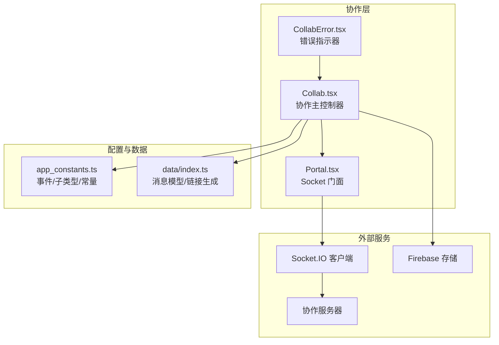
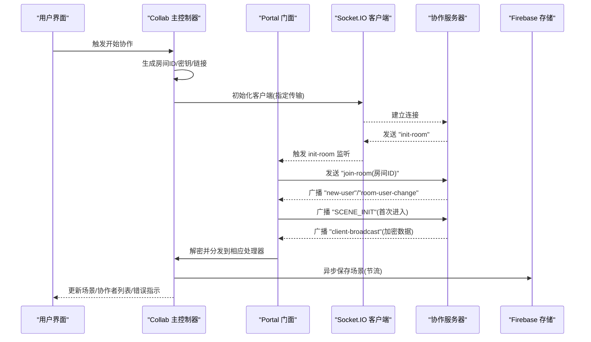
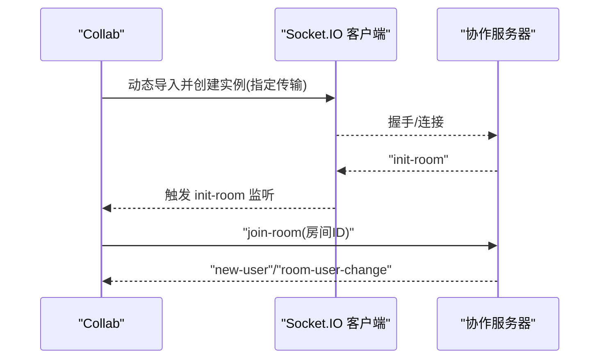
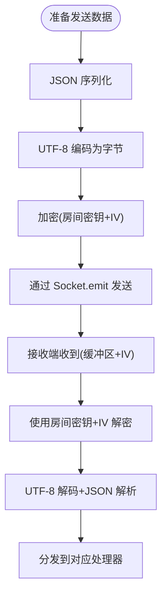
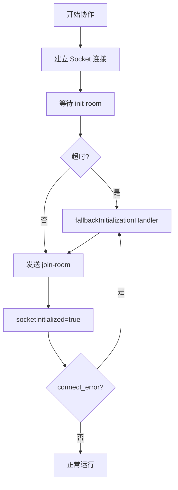
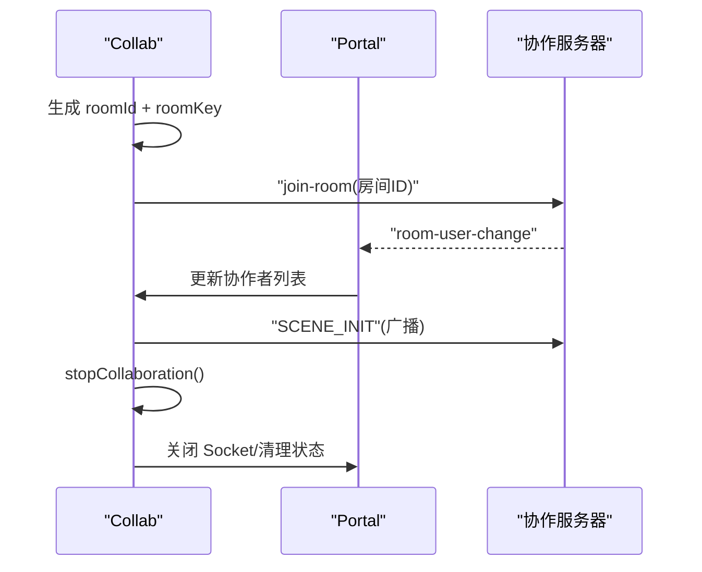
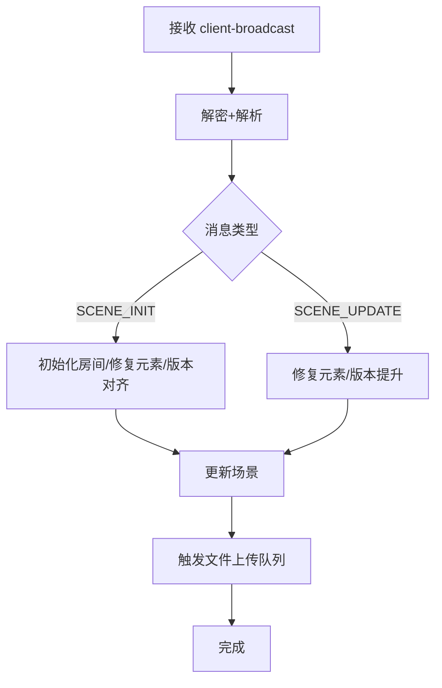
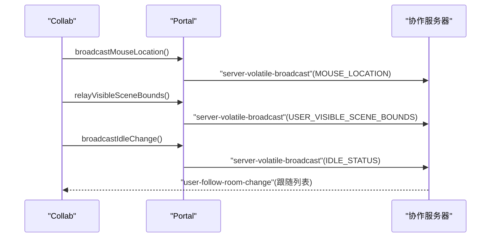
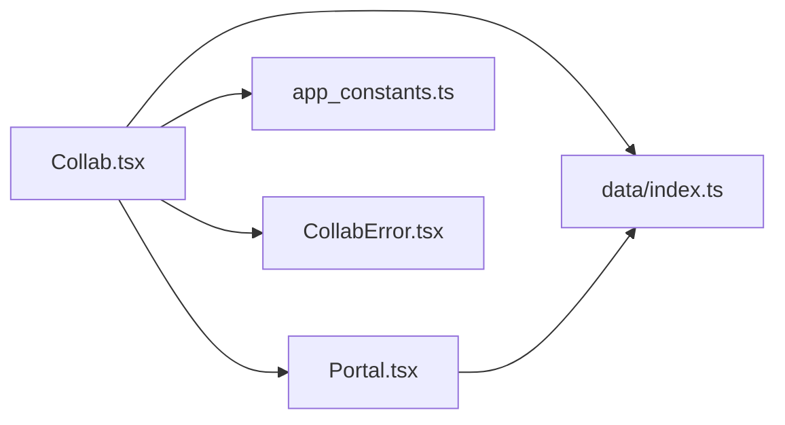

# WebSocket 通信机制

<cite>
**本文档引用的文件**
- [Collab.tsx](file://excalidraw-app/collab/Collab.tsx)
- [Portal.tsx](file://excalidraw-app/collab/Portal.tsx)
- [app_constants.ts](file://excalidraw-app/app_constants.ts)
- [index.ts](file://excalidraw-app/data/index.ts)
- [CollabError.tsx](file://excalidraw-app/collab/CollabError.tsx)
</cite>

## 目录
1. [简介](#简介)
2. [项目结构](#项目结构)
3. [核心组件](#核心组件)
4. [架构总览](#架构总览)
5. [详细组件分析](#详细组件分析)
6. [依赖关系分析](#依赖关系分析)
7. [性能考虑](#性能考虑)
8. [故障排除指南](#故障排除指南)
9. [结论](#结论)
10. [附录](#附录)

## 简介
本文件系统性阐述 Excalidraw 协作功能中的 WebSocket 通信机制，重点覆盖以下方面：
- Socket.IO 客户端初始化、连接建立与维护策略
- 消息传输协议：加密机制、消息格式与数据序列化
- 连接状态管理、重连机制与超时处理
- 房间管理：创建、加入与退出流程
- 错误处理、异常恢复与性能优化
- 调试工具、日志记录与监控指标
- 开发者集成最佳实践与故障排除

## 项目结构
协作 WebSocket 通信由三个主要模块协同完成：
- Collab：协作主控制器，负责生命周期、事件监听、场景同步与错误处理
- Portal：Socket 会话门面，封装 Socket 连接、房间上下文与消息广播
- app_constants：统一的事件名、子类型与时间常量配置
- data/index：消息数据模型、链接生成与序列化/反序列化工具
- CollabError：协作错误指示器 UI 组件

**图表来源**
- [Collab.tsx:132-706](file://excalidraw-app/collab/Collab.tsx#L132-L706)
- [Portal.tsx:25-255](file://excalidraw-app/collab/Portal.tsx#L25-L255)
- [app_constants.ts:16-35](file://excalidraw-app/app_constants.ts#L16-L35)
- [index.ts:79-129](file://excalidraw-app/data/index.ts#L79-L129)

**章节来源**
- [Collab.tsx:132-706](file://excalidraw-app/collab/Collab.tsx#L132-L706)
- [Portal.tsx:25-255](file://excalidraw-app/collab/Portal.tsx#L25-L255)
- [app_constants.ts:1-62](file://excalidraw-app/app_constants.ts#L1-L62)
- [index.ts:1-308](file://excalidraw-app/data/index.ts#L1-L308)

## 核心组件
- Collab（协作主控制器）
  - 负责启动/停止协作、初始化房间、监听 Socket 事件、处理远程更新、空闲检测与用户跟随
  - 提供对外 API（开始协作、停止协作、同步元素等）并通过 Jotai 状态暴露
- Portal（Socket 门面）
  - 封装 Socket 连接与房间上下文，负责消息广播、文件上传队列与房间状态维护
  - 对外提供鼠标位置、可见场景边界、空闲状态等广播方法
- app_constants（常量与事件）
  - 定义 WS_SUBTYPES（消息子类型）、WS_EVENTS（Socket 事件名）、时间阈值与存储前缀
- data/index（消息模型与工具）
  - 定义 SocketUpdateDataSource（消息数据源）、SocketUpdateData（带品牌标识的数据）
  - 提供房间链接生成、密钥生成、序列化/压缩/解压工具
- CollabError（错误指示器）
  - 基于 Jotai 状态显示协作错误提示，支持动画反馈

**章节来源**
- [Collab.tsx:114-126](file://excalidraw-app/collab/Collab.tsx#L114-L126)
- [Portal.tsx:25-83](file://excalidraw-app/collab/Portal.tsx#L25-L83)
- [app_constants.ts:16-35](file://excalidraw-app/app_constants.ts#L16-L35)
- [index.ts:79-129](file://excalidraw-app/data/index.ts#L79-L129)
- [CollabError.tsx:16-19](file://excalidraw-app/collab/CollabError.tsx#L16-L19)

## 架构总览
协作通信采用“主控制器 + 门面 + 外部服务”的分层设计：
- Collab 作为应用层协调者，负责业务逻辑与状态管理
- Portal 作为 Socket 层抽象，屏蔽底层细节，提供统一广播接口
- Socket.IO 客户端通过指定传输方式（websocket/polling）与服务器建立连接
- Firebase 用于文件上传/下载与场景持久化备份

**图表来源**
- [Collab.tsx:471-706](file://excalidraw-app/collab/Collab.tsx#L471-L706)
- [Portal.tsx:37-61](file://excalidraw-app/collab/Portal.tsx#L37-L61)
- [index.ts:148-164](file://excalidraw-app/data/index.ts#L148-L164)

**章节来源**
- [Collab.tsx:471-706](file://excalidraw-app/collab/Collab.tsx#L471-L706)
- [Portal.tsx:37-61](file://excalidraw-app/collab/Portal.tsx#L37-L61)
- [index.ts:148-164](file://excalidraw-app/data/index.ts#L148-L164)

## 详细组件分析

### Socket.IO 客户端初始化与连接建立
- 动态导入 socket.io-client，避免打包体积膨胀
- 使用环境变量配置服务器地址
- 指定传输方式为 websocket 优先，回退到 polling
- 监听 connect_error 以触发降级初始化流程
- 初始化后等待服务器 "init-room" 事件，再发送 "join-room" 加入房间

**图表来源**
- [Collab.tsx:508-531](file://excalidraw-app/collab/Collab.tsx#L508-L531)
- [Portal.tsx:43-48](file://excalidraw-app/collab/Portal.tsx#L43-L48)

**章节来源**
- [Collab.tsx:508-531](file://excalidraw-app/collab/Collab.tsx#L508-L531)
- [Portal.tsx:37-61](file://excalidraw-app/collab/Portal.tsx#L37-L61)

### 消息传输协议与数据序列化
- 消息子类型（WS_SUBTYPES）：SCENE_INIT、SCENE_UPDATE、MOUSE_LOCATION、IDLE_STATUS、USER_VISIBLE_SCENE_BOUNDS、INVALID_RESPONSE
- 事件名（WS_EVENTS）：server-broadcast、server-volatile-broadcast、user-follow、user-follow-room-change
- 数据模型（SocketUpdateDataSource）：定义每种消息的结构与载荷
- 序列化：使用 JSON.stringify 将数据对象转为字符串
- 加密：对序列化后的字节进行加密，返回加密缓冲区与初始化向量（IV），通过 Socket 发送
- 解密：接收端使用房间密钥与 IV 解密，再反序列化为数据对象

**图表来源**
- [Portal.tsx:85-102](file://excalidraw-app/collab/Portal.tsx#L85-L102)
- [Collab.tsx:448-467](file://excalidraw-app/collab/Collab.tsx#L448-L467)
- [index.ts:79-129](file://excalidraw-app/data/index.ts#L79-L129)

**章节来源**
- [Portal.tsx:85-102](file://excalidraw-app/collab/Portal.tsx#L85-L102)
- [Collab.tsx:448-467](file://excalidraw-app/collab/Collab.tsx#L448-L467)
- [index.ts:79-129](file://excalidraw-app/data/index.ts#L79-L129)

### 连接状态管理、重连机制与超时处理
- 连接状态：通过 Portal.isOpen 判断是否已初始化并处于有效连接
- 重连与降级：监听 connect_error，触发 fallbackInitializationHandler，尝试从 Firebase 获取场景或重新初始化
- 初始化超时：设置定时器，在超时后执行降级初始化，确保即使无初始消息也能进入房间
- 断线清理：stopCollaboration 中取消所有节流任务、清理历史状态、可选择保留/清除远端状态

**图表来源**
- [Collab.tsx:562-565](file://excalidraw-app/collab/Collab.tsx#L562-L565)
- [Collab.tsx:512-520](file://excalidraw-app/collab/Collab.tsx#L512-L520)
- [Portal.tsx:63-74](file://excalidraw-app/collab/Portal.tsx#L63-L74)

**章节来源**
- [Collab.tsx:512-565](file://excalidraw-app/collab/Collab.tsx#L512-L565)
- [Portal.tsx:63-74](file://excalidraw-app/collab/Portal.tsx#L63-L74)

### 房间管理机制（创建、加入、退出）
- 房间创建：生成随机房间ID与加密密钥，拼接房间链接并写入浏览器历史
- 房间加入：收到 "init-room" 后立即发送 "join-room"；新用户加入时广播 SCENE_INIT
- 房间退出：stopCollaboration 支持两种模式：仅断开不清理、或强制重置本地状态并清理文件缓存
- 用户变更：监听 "room-user-change" 更新协作者列表

**图表来源**
- [index.ts:148-164](file://excalidraw-app/data/index.ts#L148-L164)
- [Portal.tsx:43-58](file://excalidraw-app/collab/Portal.tsx#L43-L58)
- [Collab.tsx:357-403](file://excalidraw-app/collab/Collab.tsx#L357-L403)

**章节来源**
- [index.ts:148-164](file://excalidraw-app/data/index.ts#L148-L164)
- [Portal.tsx:43-58](file://excalidraw-app/collab/Portal.tsx#L43-L58)
- [Collab.tsx:357-403](file://excalidraw-app/collab/Collab.tsx#L357-L403)

### 消息处理与场景同步
- 场景初始化：收到 SCENE_INIT 后进行版本对齐与元素修复，然后更新 UI
- 场景增量更新：收到 SCENE_UPDATE 后进行元素修复与版本提升，避免重复广播
- 元素广播策略：仅广播自上次广播以来有版本变化或未广播过的可同步元素，定期全量同步防止漂移
- 文件上传：通过队列节流异步上传图片文件，成功后更新元素状态

**图表来源**
- [Collab.tsx:575-677](file://excalidraw-app/collab/Collab.tsx#L575-L677)
- [Portal.tsx:142-183](file://excalidraw-app/collab/Portal.tsx#L142-L183)

**章节来源**
- [Collab.tsx:575-677](file://excalidraw-app/collab/Collab.tsx#L575-L677)
- [Portal.tsx:142-183](file://excalidraw-app/collab/Portal.tsx#L142-L183)

### 用户交互与跟随机制
- 鼠标位置：节流上报用户指针与按钮状态
- 可见场景边界：在跟随或强制情况下广播当前可视区域
- 空闲状态：根据用户活跃/空闲/离开状态广播
- 用户跟随变更：监听房间内跟随列表变化并联动 UI

**图表来源**
- [Collab.tsx:914-942](file://excalidraw-app/collab/Collab.tsx#L914-L942)
- [Portal.tsx:202-248](file://excalidraw-app/collab/Portal.tsx#L202-L248)
- [Portal.tsx:250-254](file://excalidraw-app/collab/Portal.tsx#L250-L254)

**章节来源**
- [Collab.tsx:914-942](file://excalidraw-app/collab/Collab.tsx#L914-L942)
- [Portal.tsx:202-248](file://excalidraw-app/collab/Portal.tsx#L202-L248)
- [Portal.tsx:250-254](file://excalidraw-app/collab/Portal.tsx#L250-L254)

## 依赖关系分析
- Collab 依赖 Portal 提供的 Socket 会话与广播能力
- Portal 依赖 data/index 的消息模型与链接生成工具
- Collab 依赖 app_constants 的事件名与子类型常量
- 错误指示器通过 Jotai 状态与 Collab 共享

**图表来源**
- [Collab.tsx:132-135](file://excalidraw-app/collab/Collab.tsx#L132-L135)
- [Portal.tsx:25-35](file://excalidraw-app/collab/Portal.tsx#L25-L35)
- [index.ts:79-129](file://excalidraw-app/data/index.ts#L79-L129)

**章节来源**
- [Collab.tsx:132-135](file://excalidraw-app/collab/Collab.tsx#L132-L135)
- [Portal.tsx:25-35](file://excalidraw-app/collab/Portal.tsx#L25-L35)
- [index.ts:79-129](file://excalidraw-app/data/index.ts#L79-L129)

## 性能考虑
- 广播节流：元素广播、全量同步、文件上传均使用节流，降低网络与 CPU 压力
- 按需同步：仅广播版本变化或未广播过的元素，减少冗余传输
- 定期全量同步：周期性全量广播，保证一致性与容错
- 轻量事件：volatile 广播用于高频但非关键事件（如鼠标位置、空闲状态）
- 图片文件异步上传：避免阻塞主线程，失败时通过 UI 提示

**章节来源**
- [Portal.tsx:142-183](file://excalidraw-app/collab/Portal.tsx#L142-L183)
- [Portal.tsx:104-140](file://excalidraw-app/collab/Portal.tsx#L104-L140)
- [Collab.tsx:960-986](file://excalidraw-app/collab/Collab.tsx#L960-L986)

## 故障排除指南
- 连接失败
  - 现象：无法建立 Socket 连接或频繁断开
  - 排查：检查服务器地址配置、网络连通性、传输方式（websocket/polling）
  - 处理：利用 connect_error 降级初始化，必要时切换到 polling
- 解密失败
  - 现象：收到加密数据但无法解密
  - 排查：确认房间密钥正确、IV 与密钥匹配
  - 处理：返回 INVALID_RESPONSE，避免 UI 异常
- 场景不同步
  - 现象：多人协作时元素不一致
  - 排查：检查版本号对齐、全量同步是否生效
  - 处理：触发全量同步，确认元素可同步性
- 文件上传失败
  - 现象：图片无法加载或上传报错
  - 排查：检查文件大小限制、网络状况
  - 处理：通过错误指示器提示，重试上传
- 用户跟随异常
  - 现象：跟随他人视角无效或越权
  - 排查：确认跟随列表与房间变更事件
  - 处理：重新订阅跟随事件，避免交叉跟随

**章节来源**
- [Collab.tsx:461-467](file://excalidraw-app/collab/Collab.tsx#L461-L467)
- [Collab.tsx:331-354](file://excalidraw-app/collab/Collab.tsx#L331-L354)
- [Portal.tsx:104-140](file://excalidraw-app/collab/Portal.tsx#L104-L140)
- [Portal.tsx:250-254](file://excalidraw-app/collab/Portal.tsx#L250-L254)

## 结论
该 WebSocket 通信机制通过清晰的分层设计与严格的协议约束，实现了高效、安全且可扩展的实时协作。其关键优势包括：
- 明确的消息模型与加密流程，保障数据安全与一致性
- 基于版本的增量同步与定期全量同步，兼顾性能与可靠性
- 完善的错误处理与降级策略，提升鲁棒性
- 丰富的用户交互与跟随机制，增强协作体验

## 附录

### 最佳实践
- 在生产环境固定服务器地址，避免动态切换
- 严格管理房间密钥与 IV，避免泄露
- 合理设置节流参数，平衡实时性与性能
- 对大文件采用异步上传与状态提示
- 使用错误指示器与日志记录辅助排障

### 监控与日志
- 记录连接状态、初始化耗时、广播频率与解密成功率
- 监控文件上传失败率与重试次数
- 跟踪协作者数量与活跃度分布