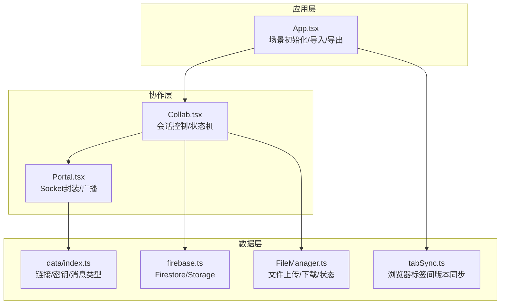
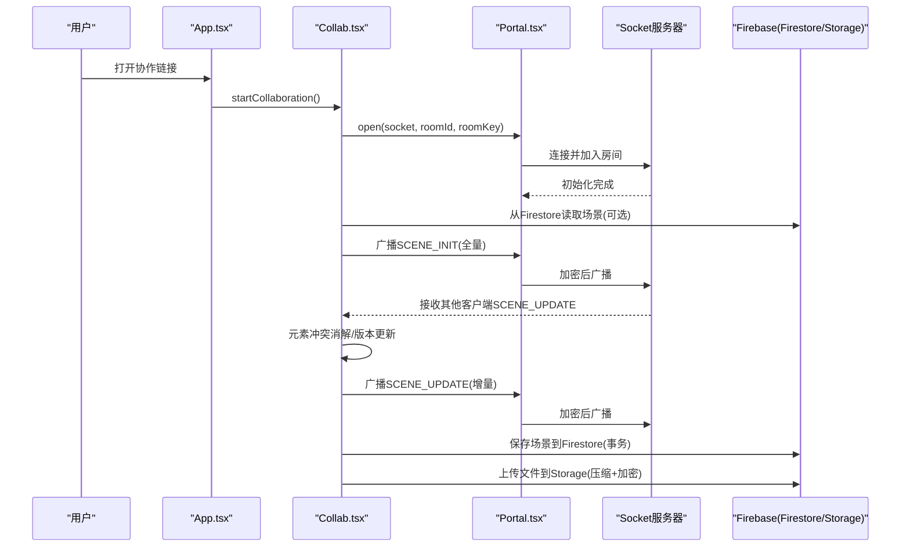
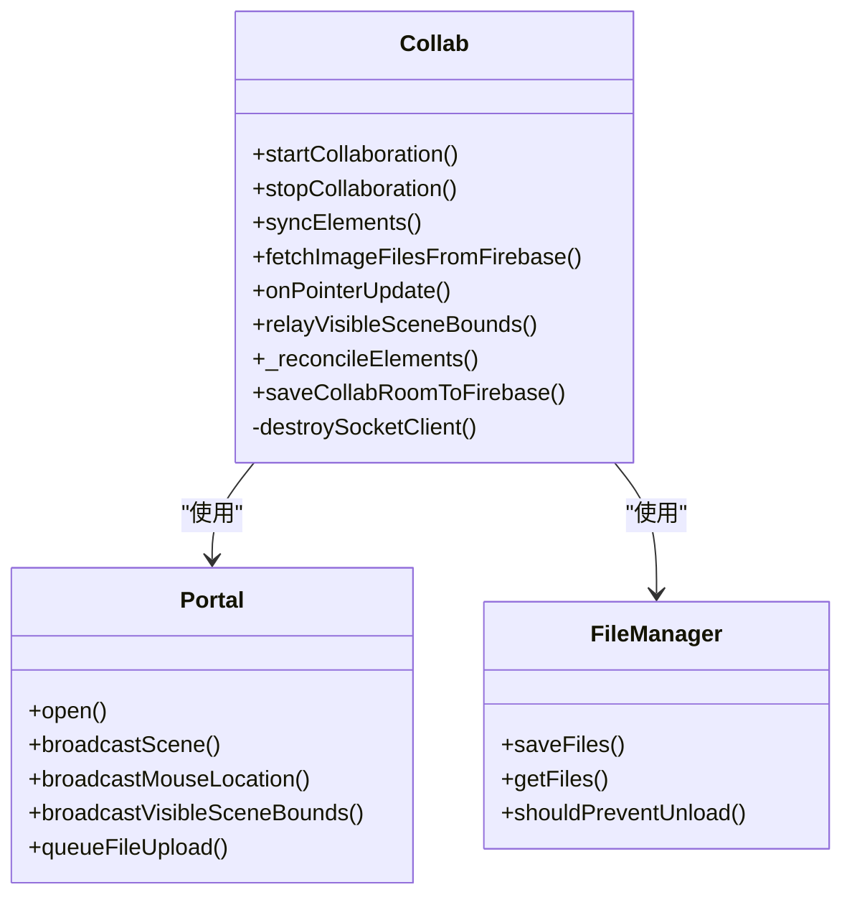
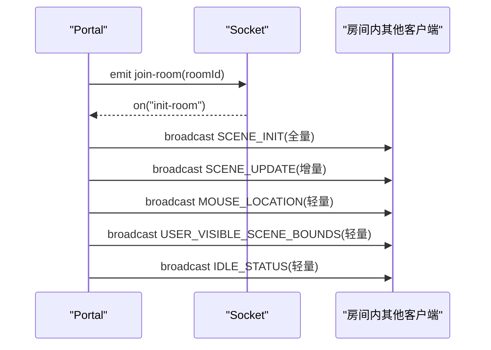
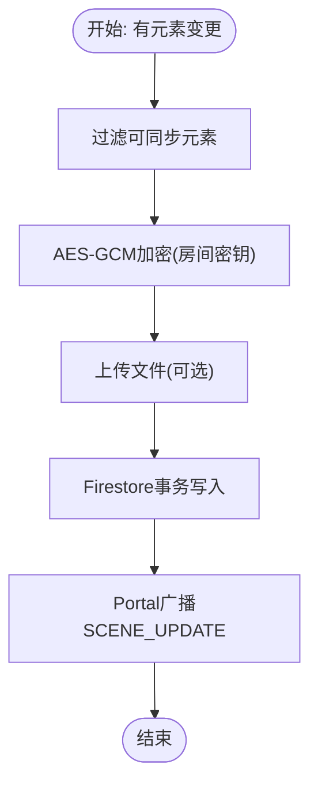
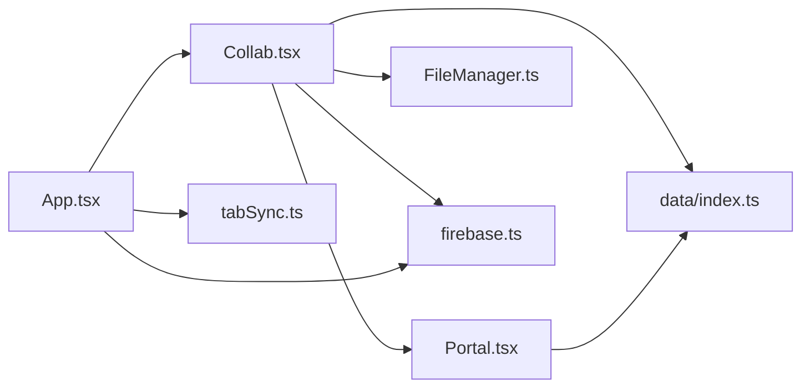
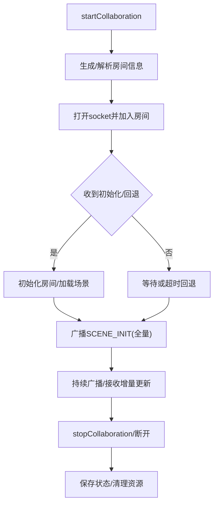

# 实时协作系统

<cite>
**本文档引用的文件**
- [excalidraw-app/collab/Collab.tsx](file://excalidraw-app/collab/Collab.tsx)
- [excalidraw-app/collab/Portal.tsx](file://excalidraw-app/collab/Portal.tsx)
- [excalidraw-app/data/index.ts](file://excalidraw-app/data/index.ts)
- [excalidraw-app/data/firebase.ts](file://excalidraw-app/data/firebase.ts)
- [excalidraw-app/data/FileManager.ts](file://excalidraw-app/data/FileManager.ts)
- [excalidraw-app/data/tabSync.ts](file://excalidraw-app/data/tabSync.ts)
- [excalidraw-app/app_constants.ts](file://excalidraw-app/app_constants.ts)
- [excalidraw-app/App.tsx](file://excalidraw-app/App.tsx)
- [packages/excalidraw/data/encryption.ts](file://packages/excalidraw/data/encryption.ts)
- [README.md](file://README.md)
</cite>

## 目录

1. [简介](#简介)
2. [项目结构](#项目结构)
3. [核心组件](#核心组件)
4. [架构总览](#架构总览)
5. [详细组件分析](#详细组件分析)
6. [依赖关系分析](#依赖关系分析)
7. [性能考量](#性能考量)
8. [故障排除指南](#故障排除指南)
9. [结论](#结论)
10. [附录](#附录)

## 简介

本技术文档面向开发者与集成者，系统性解析 Excalidraw 实时协作系统的架构与实现细节。重点覆盖以下方面：

- WebSocket 通信机制：消息类型、事件流、端到端加密与传输
- Firebase 集成：场景持久化、文件存储、事务一致性
- 实时同步策略：增量广播、全量重同步、版本控制与冲突消解
- 用户光标与在线管理：鼠标位置、可见区域边界、空闲状态广播
- 权限与安全：房间密钥生成、AES-GCM 加密、前端本地存储隔离
- 协作会话生命周期：建立、维护、断开与回退策略
- 性能优化与错误处理：节流、批量、缓存与降级
- 调试与监控：可视化调试、错误指示器、日志与告警

## 项目结构

协作系统主要由三层构成：

- 应用层（App.tsx）：初始化场景、挂载协作 API、处理导入导出与图片加载
- 协作层（Collab.tsx、Portal.tsx）：WebSocket 会话管理、消息广播与接收、用户状态更新
- 数据层（data/\*、firebase.ts、FileManager.ts）：元素与文件的加解密、压缩、持久化与版本控制

**图表来源**

- [excalidraw-app/App.tsx:1-800](file://excalidraw-app/App.tsx#L1-L800)
- [excalidraw-app/collab/Collab.tsx:1-1052](file://excalidraw-app/collab/Collab.tsx#L1-L1052)
- [excalidraw-app/collab/Portal.tsx:1-258](file://excalidraw-app/collab/Portal.tsx#L1-L258)
- [excalidraw-app/data/index.ts:1-308](file://excalidraw-app/data/index.ts#L1-L308)
- [excalidraw-app/data/firebase.ts:1-320](file://excalidraw-app/data/firebase.ts#L1-L320)
- [excalidraw-app/data/FileManager.ts:1-297](file://excalidraw-app/data/FileManager.ts#L1-L297)
- [excalidraw-app/data/tabSync.ts:1-40](file://excalidraw-app/data/tabSync.ts#L1-L40)

**章节来源**

- [excalidraw-app/App.tsx:1-800](file://excalidraw-app/App.tsx#L1-L800)
- [excalidraw-app/collab/Collab.tsx:1-1052](file://excalidraw-app/collab/Collab.tsx#L1-L1052)
- [excalidraw-app/collab/Portal.tsx:1-258](file://excalidraw-app/collab/Portal.tsx#L1-L258)
- [excalidraw-app/data/index.ts:1-308](file://excalidraw-app/data/index.ts#L1-L308)
- [excalidraw-app/data/firebase.ts:1-320](file://excalidraw-app/data/firebase.ts#L1-L320)
- [excalidraw-app/data/FileManager.ts:1-297](file://excalidraw-app/data/FileManager.ts#L1-L297)
- [excalidraw-app/data/tabSync.ts:1-40](file://excalidraw-app/data/tabSync.ts#L1-L40)

## 核心组件

- 协作主类（Collab）：负责会话生命周期、元素同步、文件管理、错误处理与卸载保护
- Socket 门户（Portal）：封装 socket.io 客户端，统一广播与事件监听，执行端到端加密
- 数据与文件（data/\*、firebase.ts、FileManager.ts）：定义消息类型、生成房间密钥、进行 AES-GCM 加解密、通过 Firestore/Storage 持久化场景与文件
- 应用入口（App.tsx）：根据 URL 参数决定是否进入协作模式，协调图片加载与本地存储同步

关键职责与交互在后续章节中详述。

**章节来源**

- [excalidraw-app/collab/Collab.tsx:132-418](file://excalidraw-app/collab/Collab.tsx#L132-L418)
- [excalidraw-app/collab/Portal.tsx:25-255](file://excalidraw-app/collab/Portal.tsx#L25-L255)
- [excalidraw-app/data/index.ts:79-164](file://excalidraw-app/data/index.ts#L79-L164)
- [excalidraw-app/data/firebase.ts:83-320](file://excalidraw-app/data/firebase.ts#L83-L320)
- [excalidraw-app/data/FileManager.ts:22-297](file://excalidraw-app/data/FileManager.ts#L22-L297)
- [excalidraw-app/App.tsx:216-372](file://excalidraw-app/App.tsx#L216-L372)

## 架构总览

协作系统采用“前端端到端加密 + 后端无内容可见”的设计：

- 元素与文件均使用房间密钥（AES-GCM）加密后存储于 Firestore/Storage
- WebSocket 使用 socket.io-client，消息体经 Portal 加密后发送
- 增量广播 + 定期全量重同步保障一致性；版本号避免重复广播与乱序问题
- 文件上传采用压缩+加密+分块策略，结合状态机避免并发冲突

**图表来源**

- [excalidraw-app/collab/Collab.tsx:471-706](file://excalidraw-app/collab/Collab.tsx#L471-L706)
- [excalidraw-app/collab/Portal.tsx:37-183](file://excalidraw-app/collab/Portal.tsx#L37-L183)
- [excalidraw-app/data/firebase.ts:187-247](file://excalidraw-app/data/firebase.ts#L187-L247)
- [excalidraw-app/data/FileManager.ts:92-137](file://excalidraw-app/data/FileManager.ts#L92-L137)

## 详细组件分析

### 协作主类（Collab）

- 会话生命周期
  - startCollaboration：生成或复用房间 ID 与密钥，打开 socket，初始化房间，必要时重置场景并保存初始状态
  - stopCollaboration：取消定时器与监听，保存当前状态至 Firebase，可选择保留/清空远端状态
  - destroySocketClient：清理状态、重置协同用户列表、恢复本地保存
- 元素同步
  - \_reconcileElements：先 restore 再 reconcile，并提升版本号，设置最后广播/接收版本以避免回环
  - broadcastScene：按版本与可见性筛选增量元素，定期全量重同步
- 文件管理
  - FileManager：跟踪上传/下载/错误状态，去重与幂等，批量节流上传
  - saveCollabRoomToFirebase：事务写入 Firestore，返回最新元素并触发本地更新
- 用户交互
  - onPointerUpdate：节流上报鼠标位置与按钮状态
  - relayVisibleSceneBounds：跟随用户视角时上报可见区域边界
  - initializeIdleDetector：空闲状态广播
- 错误处理
  - setErrorDialog/setErrorIndicator：统一错误提示与指示器
  - beforeUnload：防止未保存文件离开页面

**图表来源**

- [excalidraw-app/collab/Collab.tsx:132-418](file://excalidraw-app/collab/Collab.tsx#L132-L418)
- [excalidraw-app/collab/Portal.tsx:25-255](file://excalidraw-app/collab/Portal.tsx#L25-L255)
- [excalidraw-app/data/FileManager.ts:22-297](file://excalidraw-app/data/FileManager.ts#L22-L297)

**章节来源**

- [excalidraw-app/collab/Collab.tsx:132-418](file://excalidraw-app/collab/Collab.tsx#L132-L418)
- [excalidraw-app/collab/Collab.tsx:471-706](file://excalidraw-app/collab/Collab.tsx#L471-L706)
- [excalidraw-app/collab/Collab.tsx:755-787](file://excalidraw-app/collab/Collab.tsx#L755-L787)
- [excalidraw-app/collab/Collab.tsx:315-355](file://excalidraw-app/collab/Collab.tsx#L315-L355)

### Socket 门户（Portal）

- 事件绑定
  - init-room：加入房间
  - new-user：新用户加入时广播全量场景
  - room-user-change：更新在线用户列表
- 广播策略
  - \_broadcastSocketData：JSON -> 加密 -> 发送
  - broadcastScene：按版本与可见性过滤增量，定期全量重同步
  - broadcastMouseLocation / broadcastVisibleSceneBounds / broadcastIdleChange：轻量事件（volatile）
- 文件上传
  - queueFileUpload：节流批量上传，完成后更新元素状态

**图表来源**

- [excalidraw-app/collab/Portal.tsx:37-183](file://excalidraw-app/collab/Portal.tsx#L37-L183)
- [excalidraw-app/collab/Portal.tsx:202-248](file://excalidraw-app/collab/Portal.tsx#L202-L248)

**章节来源**

- [excalidraw-app/collab/Portal.tsx:25-255](file://excalidraw-app/collab/Portal.tsx#L25-L255)

### 数据与文件（data/\*、firebase.ts、FileManager.ts）

- 消息类型与链接
  - WS_SUBTYPES：定义 SCENE_INIT、SCENE_UPDATE、MOUSE_LOCATION、IDLE_STATUS、USER_VISIBLE_SCENE_BOUNDS
  - generateCollaborationLinkData：生成 roomId 与 roomKey
  - getCollaborationLink/getCollaborationLinkData：生成/解析协作链接
- Firebase 场景持久化
  - saveToFirebase：事务写入 Firestore，返回最新元素并缓存版本
  - loadFromFirebase：读取并解密，设置版本缓存
  - isSavedToFirebase：基于版本判断是否已保存
- 文件管理
  - encodeFilesForUpload：压缩+加密文件元数据，按最大字节限制切分
  - saveFilesToFirebase：批量上传至 Storage，带缓存控制
  - loadFilesFromFirebase：拉取并解压解密，更新状态
- 版本与可见性
  - getSyncableElements：过滤不可见/删除过期元素，减少广播体积

**图表来源**

- [excalidraw-app/data/index.ts:58-164](file://excalidraw-app/data/index.ts#L58-L164)
- [excalidraw-app/data/firebase.ts:187-247](file://excalidraw-app/data/firebase.ts#L187-L247)
- [excalidraw-app/data/FileManager.ts:228-270](file://excalidraw-app/data/FileManager.ts#L228-L270)

**章节来源**

- [excalidraw-app/data/index.ts:79-164](file://excalidraw-app/data/index.ts#L79-L164)
- [excalidraw-app/data/firebase.ts:187-247](file://excalidraw-app/data/firebase.ts#L187-L247)
- [excalidraw-app/data/FileManager.ts:92-137](file://excalidraw-app/data/FileManager.ts#L92-L137)

### 应用入口（App.tsx）

- 初始化流程
  - initializeScene：解析 URL 参数，支持外部场景导入、分享链接、协作房间
  - 协作模式下调用 CollabAPI.startCollaboration，随后进行元素与应用状态的最终协调
- 图片加载
  - 协作场景优先从 Firebase 拉取图片，非协作场景从本地 IndexedDB 或直接拉取
- 浏览器标签同步
  - tabSync：基于 localStorage 时间戳判断本地状态是否较新，必要时回填

**章节来源**

- [excalidraw-app/App.tsx:216-372](file://excalidraw-app/App.tsx#L216-L372)
- [excalidraw-app/App.tsx:441-521](file://excalidraw-app/App.tsx#L441-L521)
- [excalidraw-app/data/tabSync.ts:12-39](file://excalidraw-app/data/tabSync.ts#L12-L39)

## 依赖关系分析

- 组件耦合
  - Collab 依赖 Portal（socket 封装）、FileManager（文件）、Firebase（持久化）、data 工具（链接/密钥/消息类型）
  - Portal 仅依赖 data 中的消息类型常量与加密工具
  - App.tsx 作为门面协调 Collab 与数据层
- 外部依赖
  - socket.io-client：WebSocket 客户端
  - Firebase SDK：Firestore/Storage
  - Web Crypto API：AES-GCM 加密

**图表来源**

- [excalidraw-app/collab/Collab.tsx:132-418](file://excalidraw-app/collab/Collab.tsx#L132-L418)
- [excalidraw-app/collab/Portal.tsx:25-255](file://excalidraw-app/collab/Portal.tsx#L25-L255)
- [excalidraw-app/data/index.ts:79-164](file://excalidraw-app/data/index.ts#L79-L164)
- [excalidraw-app/data/firebase.ts:83-320](file://excalidraw-app/data/firebase.ts#L83-L320)
- [excalidraw-app/data/FileManager.ts:22-297](file://excalidraw-app/data/FileManager.ts#L22-L297)
- [excalidraw-app/App.tsx:216-372](file://excalidraw-app/App.tsx#L216-L372)
- [excalidraw-app/data/tabSync.ts:12-39](file://excalidraw-app/data/tabSync.ts#L12-L39)

**章节来源**

- [excalidraw-app/collab/Collab.tsx:132-418](file://excalidraw-app/collab/Collab.tsx#L132-L418)
- [excalidraw-app/collab/Portal.tsx:25-255](file://excalidraw-app/collab/Portal.tsx#L25-L255)
- [excalidraw-app/data/index.ts:79-164](file://excalidraw-app/data/index.ts#L79-L164)
- [excalidraw-app/data/firebase.ts:83-320](file://excalidraw-app/data/firebase.ts#L83-L320)
- [excalidraw-app/data/FileManager.ts:22-297](file://excalidraw-app/data/FileManager.ts#L22-L297)
- [excalidraw-app/App.tsx:216-372](file://excalidraw-app/App.tsx#L216-L372)
- [excalidraw-app/data/tabSync.ts:12-39](file://excalidraw-app/data/tabSync.ts#L12-L39)

## 性能考量

- 增量广播与全量重同步
  - broadcastScene 仅广播版本变化或新增元素，定期全量重同步确保收敛
  - 参考常量：SYNC_FULL_SCENE_INTERVAL_MS、INITIAL_SCENE_UPDATE_TIMEOUT
- 节流与批量
  - CURSOR_SYNC_TIMEOUT：约 30fps 的鼠标位置节流
  - FILE_UPLOAD_TIMEOUT：文件上传批量节流
  - LOAD_IMAGES_TIMEOUT：图片加载节流
- 存储与网络
  - FILE_UPLOAD_MAX_BYTES：单文件上限 4MiB
  - FILE_CACHE_MAX_AGE_SEC：文件缓存一年
- 本地存储版本
  - tabSync：避免不必要的本地回填与重复保存

**章节来源**

- [excalidraw-app/app_constants.ts:1-62](file://excalidraw-app/app_constants.ts#L1-L62)
- [excalidraw-app/collab/Portal.tsx:104-140](file://excalidraw-app/collab/Portal.tsx#L104-L140)
- [excalidraw-app/data/FileManager.ts:92-137](file://excalidraw-app/data/FileManager.ts#L92-L137)
- [excalidraw-app/data/tabSync.ts:12-39](file://excalidraw-app/data/tabSync.ts#L12-L39)

## 故障排除指南

- 无法建立协作会话
  - 检查 VITE_APP_WS_SERVER_URL 是否可达
  - 观察 connect_error 回退逻辑是否触发（fallbackInitializationHandler）
- 场景不同步或闪烁
  - 确认版本缓存是否正确更新（FirebaseSceneVersionCache）
  - 检查 INITIAL_SCENE_UPDATE_TIMEOUT 是否过短导致提前回退
- 文件加载失败
  - 查看 loadFilesFromFirebase 返回的 erroredFiles
  - 确认 Firebase Storage 访问权限与缓存头设置
- 卸载前阻塞
  - beforeUnload 逻辑会阻止离开，除非禁用 VITE_APP_DISABLE_PREVENT_UNLOAD
- 错误提示
  - setErrorDialog 与 collabErrorIndicatorAtom 提供统一错误展示

**章节来源**

- [excalidraw-app/collab/Collab.tsx:512-536](file://excalidraw-app/collab/Collab.tsx#L512-L536)
- [excalidraw-app/collab/Collab.tsx:331-355](file://excalidraw-app/collab/Collab.tsx#L331-L355)
- [excalidraw-app/data/firebase.ts:274-319](file://excalidraw-app/data/firebase.ts#L274-L319)
- [excalidraw-app/App.tsx:654-676](file://excalidraw-app/App.tsx#L654-L676)

## 结论

该协作系统通过“前端端到端加密 + 后端无内容可见”的架构，在保障隐私的同时实现了高效、稳定的多人实时协作。其核心优势在于：

- 明确的增量广播与全量重同步策略，降低带宽与收敛风险
- 基于版本号的冲突消解与事务写入，确保一致性
- 文件上传的状态机与节流策略，兼顾可靠性与性能
- 清晰的会话生命周期与错误处理，便于调试与运维

## 附录

### WebSocket 通信与消息类型

- 事件名：SERVER、SERVER_VOLATILE、USER_FOLLOW_CHANGE、USER_FOLLOW_ROOM_CHANGE
- 消息子类型：SCENE_INIT、SCENE_UPDATE、MOUSE_LOCATION、IDLE_STATUS、USER_VISIBLE_SCENE_BOUNDS

**章节来源**

- [excalidraw-app/app_constants.ts:16-31](file://excalidraw-app/app_constants.ts#L16-L31)
- [excalidraw-app/data/index.ts:79-121](file://excalidraw-app/data/index.ts#L79-L121)

### 加密与安全

- 房间密钥生成：AES-GCM，密钥长度与 IV 长度由 Web Crypto API 管理
- 端到端加密：所有消息与文件均使用房间密钥加密
- 前端本地存储隔离：房间密钥不落盘，仅在内存中传递

**章节来源**

- [packages/excalidraw/data/encryption.ts:1-95](file://packages/excalidraw/data/encryption.ts#L1-L95)
- [excalidraw-app/data/firebase.ts:93-116](file://excalidraw-app/data/firebase.ts#L93-L116)
- [excalidraw-app/data/FileManager.ts:228-270](file://excalidraw-app/data/FileManager.ts#L228-L270)

### 协作会话建立与断开流程

**图表来源**

- [excalidraw-app/collab/Collab.tsx:471-706](file://excalidraw-app/collab/Collab.tsx#L471-L706)
- [excalidraw-app/collab/Portal.tsx:37-83](file://excalidraw-app/collab/Portal.tsx#L37-L83)

### 配置选项与环境变量

- VITE_APP_WS_SERVER_URL：WebSocket 服务地址
- VITE_APP_FIREBASE_CONFIG：Firebase 配置（JSON 字符串）
- VITE_APP_DISABLE_PREVENT_UNLOAD：是否禁用卸载前阻塞（开发调试）

**章节来源**

- [excalidraw-app/collab/Collab.tsx:524-536](file://excalidraw-app/collab/Collab.tsx#L524-L536)
- [excalidraw-app/data/firebase.ts:44-54](file://excalidraw-app/data/firebase.ts#L44-L54)
- [excalidraw-app/App.tsx:654-676](file://excalidraw-app/App.tsx#L654-L676)

### 开发者集成路线图

- 步骤一：引入 @excalidraw/excalidraw 与 socket.io-client
- 步骤二：在应用入口调用 initializeScene，检测协作链接
- 步骤三：通过 CollabAPI.startCollaboration 启动会话
- 步骤四：订阅 onChange，调用 CollabAPI.syncElements 上报变更
- 步骤五：接入 FileManager 与 Firebase 存储，处理图片加载与上传
- 步骤六：配置环境变量与安全策略（密钥管理、CORS、防火墙）

**章节来源**

- [excalidraw-app/App.tsx:216-372](file://excalidraw-app/App.tsx#L216-L372)
- [excalidraw-app/collab/Collab.tsx:687-717](file://excalidraw-app/collab/Collab.tsx#L687-L717)
- [excalidraw-app/data/index.ts:148-164](file://excalidraw-app/data/index.ts#L148-L164)
