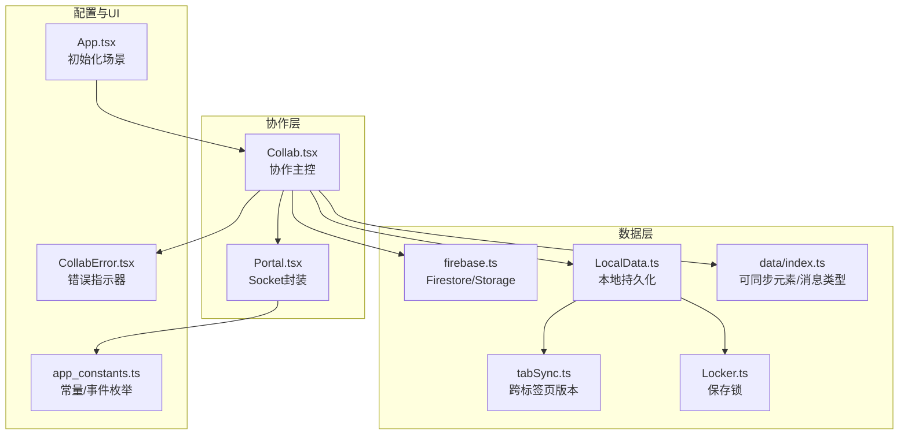
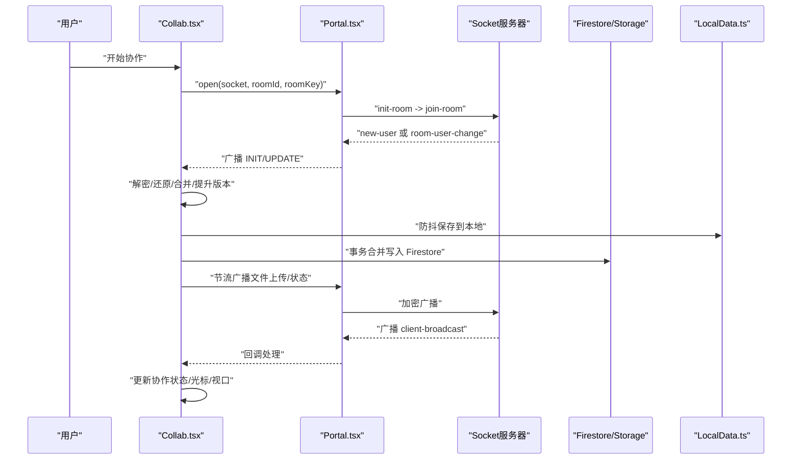
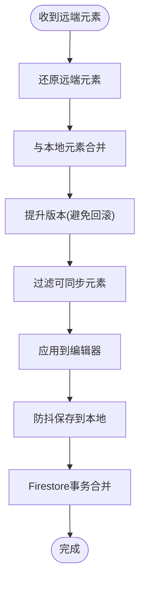
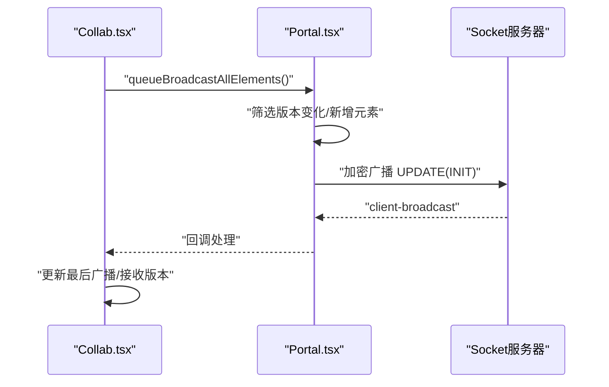
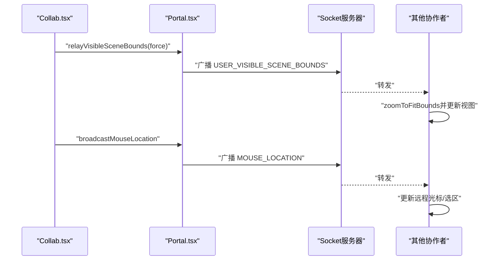
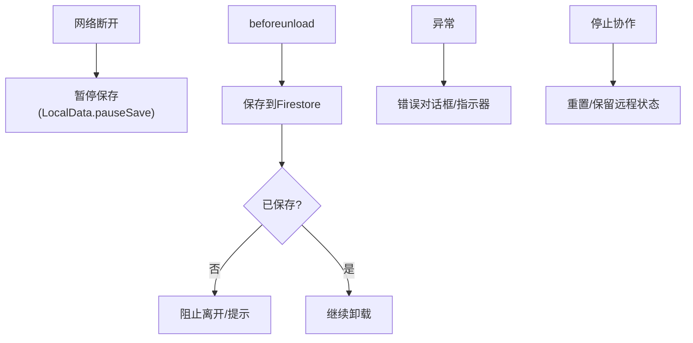
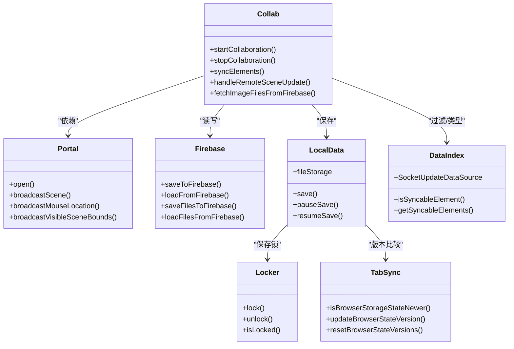

# 实时同步机制

<cite>
**本文引用的文件**
- [Collab.tsx](file://excalidraw-app/collab/Collab.tsx)
- [Portal.tsx](file://excalidraw-app/collab/Portal.tsx)
- [firebase.ts](file://excalidraw-app/data/firebase.ts)
- [LocalData.ts](file://excalidraw-app/data/LocalData.ts)
- [tabSync.ts](file://excalidraw-app/data/tabSync.ts)
- [Locker.ts](file://excalidraw-app/data/Locker.ts)
- [index.ts](file://excalidraw-app/data/index.ts)
- [app_constants.ts](file://excalidraw-app/app_constants.ts)
- [CollabError.tsx](file://excalidraw-app/collab/CollabError.tsx)
- [App.tsx](file://excalidraw-app/App.tsx)
</cite>

## 目录

1. [简介](#简介)
2. [项目结构](#项目结构)
3. [核心组件](#核心组件)
4. [架构总览](#架构总览)
5. [详细组件分析](#详细组件分析)
6. [依赖关系分析](#依赖关系分析)
7. [性能考量](#性能考量)
8. [故障排查指南](#故障排查指南)
9. [结论](#结论)
10. [附录](#附录)

## 简介

本文件系统性阐述 Excalidraw 的实时同步机制，覆盖元素状态同步算法（冲突检测、版本管理与合并策略）、增量更新机制、全量同步触发条件、协作状态管理（用户状态、光标位置、视口同步）、数据一致性保障（最终一致性和一致性模型）、延迟优化与带宽节省策略、离线处理与错误恢复、以及面向开发者的实现指南与性能调优建议。内容基于仓库源码进行深入分析，并通过图示展示关键流程与组件关系。

## 项目结构

实时同步相关代码主要分布在以下模块：

- 协作层：Collab.tsx 负责协作生命周期、事件监听、冲突合并、广播与保存；Portal.tsx 负责 Socket 通信封装与增量广播。
- 数据层：firebase.ts 提供 Firestore/Storage 的加密存取与事务合并；LocalData.ts/LocalData.ts 提供本地持久化与锁控制；tabSync.ts 提供跨标签页版本比较；Locker.ts 提供保存锁。
- 配置与类型：app_constants.ts 定义时间常量与事件枚举；data/index.ts 定义可同步元素过滤、Socket 消息类型等。
- 错误与 UI：CollabError.tsx 提供错误指示器；App.tsx 负责初始化场景与协作入口。

图表来源

- [Collab.tsx:132-706](file://excalidraw-app/collab/Collab.tsx#L132-L706)
- [Portal.tsx:25-258](file://excalidraw-app/collab/Portal.tsx#L25-L258)
- [firebase.ts:1-320](file://excalidraw-app/data/firebase.ts#L1-L320)
- [LocalData.ts:117-228](file://excalidraw-app/data/LocalData.ts#L117-L228)
- [tabSync.ts:1-40](file://excalidraw-app/data/tabSync.ts#L1-L40)
- [Locker.ts:1-19](file://excalidraw-app/data/Locker.ts#L1-L19)
- [index.ts:43-130](file://excalidraw-app/data/index.ts#L43-L130)
- [app_constants.ts:16-53](file://excalidraw-app/app_constants.ts#L16-L53)
- [CollabError.tsx:16-56](file://excalidraw-app/collab/CollabError.tsx#L16-L56)
- [App.tsx:216-372](file://excalidraw-app/App.tsx#L216-L372)

章节来源

- [Collab.tsx:132-706](file://excalidraw-app/collab/Collab.tsx#L132-L706)
- [Portal.tsx:25-258](file://excalidraw-app/collab/Portal.tsx#L25-L258)
- [firebase.ts:1-320](file://excalidraw-app/data/firebase.ts#L1-L320)
- [LocalData.ts:117-228](file://excalidraw-app/data/LocalData.ts#L117-L228)
- [tabSync.ts:1-40](file://excalidraw-app/data/tabSync.ts#L1-L40)
- [Locker.ts:1-19](file://excalidraw-app/data/Locker.ts#L1-L19)
- [index.ts:43-130](file://excalidraw-app/data/index.ts#L43-L130)
- [app_constants.ts:16-53](file://excalidraw-app/app_constants.ts#L16-L53)
- [CollabError.tsx:16-56](file://excalidraw-app/collab/CollabError.tsx#L16-L56)
- [App.tsx:216-372](file://excalidraw-app/App.tsx#L216-L372)

## 核心组件

- 协作主控（Collab）：负责协作生命周期、Socket 初始化、冲突合并、全量/增量广播、离线保存、错误处理与 UI 同步。
- Socket 封装（Portal）：封装 Socket 事件、加密广播、增量元素选择、文件上传队列与节流。
- Firestore/Storage（firebase.ts）：提供加密存取、事务合并、版本缓存、文件下载。
- 本地持久化（LocalData/LocalData）：提供防抖保存、保存锁、IndexedDB 文件存储、跨标签页版本比较。
- 可同步元素与消息类型（data/index.ts）：定义可同步元素过滤规则与 Socket 消息结构。
- 常量与事件（app_constants.ts）：定义时间阈值、事件名、子类型、存储键等。
- 错误指示器（CollabError.tsx）：协作错误可视化提示。
- 场景初始化（App.tsx）：根据 URL 参数决定是否进入协作模式并初始化场景。

章节来源

- [Collab.tsx:132-706](file://excalidraw-app/collab/Collab.tsx#L132-L706)
- [Portal.tsx:25-258](file://excalidraw-app/collab/Portal.tsx#L25-L258)
- [firebase.ts:187-247](file://excalidraw-app/data/firebase.ts#L187-L247)
- [LocalData.ts:117-228](file://excalidraw-app/data/LocalData.ts#L117-L228)
- [index.ts:43-130](file://excalidraw-app/data/index.ts#L43-L130)
- [app_constants.ts:16-53](file://excalidraw-app/app_constants.ts#L16-L53)
- [CollabError.tsx:16-56](file://excalidraw-app/collab/CollabError.tsx#L16-L56)
- [App.tsx:216-372](file://excalidraw-app/App.tsx#L216-L372)

## 架构总览

协作流程概览：客户端启动协作后，建立 Socket 连接，接收/发送加密消息；本地元素与远端元素通过冲突合并算法统一；定期进行全量同步以修复消息丢失；图片文件通过 Firebase Storage 异步拉取；本地状态通过 IndexedDB 与 localStorage 持久化并受保存锁保护。

图表来源

- [Collab.tsx:471-706](file://excalidraw-app/collab/Collab.tsx#L471-L706)
- [Portal.tsx:37-103](file://excalidraw-app/collab/Portal.tsx#L37-L103)
- [firebase.ts:187-247](file://excalidraw-app/data/firebase.ts#L187-L247)
- [LocalData.ts:117-147](file://excalidraw-app/data/LocalData.ts#L117-L147)

## 详细组件分析

### 元素状态同步与冲突合并

- 冲突检测与版本管理
  - 使用元素版本号与版本随机数区分不同编辑者在同一版本上的修改，避免误判。
  - 在导入或协作边界使用版本提升，确保后续合并正确。
- 合并策略
  - 先还原（restore）远端元素，再用本地与远端元素进行合并（reconcile），最后提升版本，避免广播回滚。
  - Firestore 事务中对远端已存元素与当前元素进行合并，生成新快照并返回最新可同步元素集合。
- 可同步元素过滤
  - 删除元素仅在一定时间内视为可同步；不可见小元素不参与同步，减少带宽。

图表来源

- [Collab.tsx:755-787](file://excalidraw-app/collab/Collab.tsx#L755-L787)
- [firebase.ts:206-247](file://excalidraw-app/data/firebase.ts#L206-L247)
- [index.ts:46-63](file://excalidraw-app/data/index.ts#L46-L63)

章节来源

- [Collab.tsx:755-787](file://excalidraw-app/collab/Collab.tsx#L755-L787)
- [firebase.ts:206-247](file://excalidraw-app/data/firebase.ts#L206-L247)
- [index.ts:46-63](file://excalidraw-app/data/index.ts#L46-L63)

### 增量更新与全量同步

- 增量更新
  - Portal 根据元素版本与已广播版本映射，仅广播版本变化或新增元素，减少带宽。
  - 广播前记录已广播版本，避免重复发送。
- 全量同步触发条件
  - 定时器周期性触发全量广播，确保消息丢失后的收敛。
  - 初始加入房间或首次进入房间时广播 INIT（全量）。
  - 加载场景失败时回退到从 Firestore 获取全量场景。
- 版本一致性
  - 收到/发出场景后更新“最后广播/接收版本”，防止重复广播刚收到的场景。

图表来源

- [Portal.tsx:142-183](file://excalidraw-app/collab/Portal.tsx#L142-L183)
- [Collab.tsx:960-972](file://excalidraw-app/collab/Collab.tsx#L960-L972)
- [Collab.tsx:568-569](file://excalidraw-app/collab/Collab.tsx#L568-L569)

章节来源

- [Portal.tsx:142-183](file://excalidraw-app/collab/Portal.tsx#L142-L183)
- [Collab.tsx:960-972](file://excalidraw-app/collab/Collab.tsx#L960-L972)
- [Collab.tsx:568-569](file://excalidraw-app/collab/Collab.tsx#L568-L569)

### 协作状态管理（用户状态、光标位置、视口）

- 用户状态与光标
  - 通过 Portal 广播鼠标位置与按钮状态，携带选中元素 ID 与用户名，作为 volatile 广播。
- 视口同步
  - 当跟随某用户时，接收其可见场景边界并自动缩放至其视口，避免交叉跟随导致的干扰。
- 空闲状态
  - 通过空闲检测定时器上报用户空闲状态，便于其他协作者了解在线活跃度。

图表来源

- [Collab.tsx:629-661](file://excalidraw-app/collab/Collab.tsx#L629-L661)
- [Portal.tsx:202-248](file://excalidraw-app/collab/Portal.tsx#L202-L248)

章节来源

- [Collab.tsx:629-661](file://excalidraw-app/collab/Collab.tsx#L629-L661)
- [Portal.tsx:202-248](file://excalidraw-app/collab/Portal.tsx#L202-L248)

### 数据一致性与最终一致性模型

- 最终一致性
  - 增量广播 + 定时全量同步 + Firestore 事务合并，确保在网络分区或消息丢失后收敛。
- 一致性模型
  - 元素层面采用“版本+随机数”判定冲突，合并采用双方可见的最新状态，避免回滚。
  - 图片文件通过独立存储与异步拉取，保证场景一致性与性能平衡。

章节来源

- [Collab.tsx:755-787](file://excalidraw-app/collab/Collab.tsx#L755-L787)
- [firebase.ts:187-247](file://excalidraw-app/data/firebase.ts#L187-L247)

### 离线处理与错误恢复

- 离线检测与保存暂停
  - 监听 online/offline 事件，设置离线状态；保存被保存锁暂停，避免冲突。
- 退出前保存
  - beforeunload 中尝试保存到 Firestore，若未保存则阻止离开并提示。
- 错误处理与指示
  - 统一错误对话框与错误指示器，记录已通知错误避免重复弹窗。
- 恢复策略
  - 停止协作时可选择保留/重置远程状态；重置浏览器状态版本，避免其他标签页覆盖。

图表来源

- [Collab.tsx:256-313](file://excalidraw-app/collab/Collab.tsx#L256-L313)
- [Collab.tsx:357-403](file://excalidraw-app/collab/Collab.tsx#L357-L403)
- [LocalData.ts:153-165](file://excalidraw-app/data/LocalData.ts#L153-L165)
- [CollabError.tsx:16-56](file://excalidraw-app/collab/CollabError.tsx#L16-L56)

章节来源

- [Collab.tsx:256-313](file://excalidraw-app/collab/Collab.tsx#L256-L313)
- [Collab.tsx:357-403](file://excalidraw-app/collab/Collab.tsx#L357-L403)
- [LocalData.ts:153-165](file://excalidraw-app/data/LocalData.ts#L153-L165)
- [CollabError.tsx:16-56](file://excalidraw-app/collab/CollabError.tsx#L16-L56)

### 性能优化与带宽节省

- 增量广播
  - 仅广播版本变化或新增元素，结合版本映射避免重复发送。
- 节流与防抖
  - 文件上传、全量广播、图片加载均使用节流/防抖，降低频繁 IO。
- 可同步元素过滤
  - 删除元素超时后不再同步；不可见小元素过滤。
- 图片异步拉取
  - 图片文件单独上传/下载，场景只同步引用，减少主消息体积。
- 本地持久化
  - IndexedDB 存储文件，localStorage 存储非敏感状态，防抖保存减少写入。

章节来源

- [Portal.tsx:142-183](file://excalidraw-app/collab/Portal.tsx#L142-L183)
- [LocalData.ts:117-147](file://excalidraw-app/data/LocalData.ts#L117-L147)
- [index.ts:46-63](file://excalidraw-app/data/index.ts#L46-L63)
- [firebase.ts:145-172](file://excalidraw-app/data/firebase.ts#L145-L172)

### 开发者实现指南与调优建议

- 启动协作
  - 通过 CollabAPI.startCollaboration 创建/加入房间，初始化 Socket 并处理回退逻辑。
- 元素同步
  - 使用 CollabAPI.syncElements 触发广播；确保在编辑器边界（如导入）使用版本提升。
- 错误处理
  - 使用 setErrorDialog/setErrorIndicator 设置错误；注意区分大小限制与通用保存失败。
- 性能调优
  - 调整全量同步间隔、节流阈值与图片加载阈值；合理设置文件最大字节数。
- 离线策略
  - 在 beforeunload 中主动保存；在网络恢复后重试保存；必要时回退到 Firestore 获取场景。

章节来源

- [Collab.tsx:471-706](file://excalidraw-app/collab/Collab.tsx#L471-L706)
- [Collab.tsx:955-986](file://excalidraw-app/collab/Collab.tsx#L955-L986)
- [App.tsx:328-360](file://excalidraw-app/App.tsx#L328-L360)

## 依赖关系分析

图表来源

- [Collab.tsx:132-706](file://excalidraw-app/collab/Collab.tsx#L132-L706)
- [Portal.tsx:25-258](file://excalidraw-app/collab/Portal.tsx#L25-L258)
- [firebase.ts:187-247](file://excalidraw-app/data/firebase.ts#L187-L247)
- [LocalData.ts:117-228](file://excalidraw-app/data/LocalData.ts#L117-L228)
- [tabSync.ts:12-39](file://excalidraw-app/data/tabSync.ts#L12-L39)
- [Locker.ts:1-19](file://excalidraw-app/data/Locker.ts#L1-L19)
- [index.ts:43-130](file://excalidraw-app/data/index.ts#L43-L130)

章节来源

- [Collab.tsx:132-706](file://excalidraw-app/collab/Collab.tsx#L132-L706)
- [Portal.tsx:25-258](file://excalidraw-app/collab/Portal.tsx#L25-L258)
- [firebase.ts:187-247](file://excalidraw-app/data/firebase.ts#L187-L247)
- [LocalData.ts:117-228](file://excalidraw-app/data/LocalData.ts#L117-L228)
- [tabSync.ts:12-39](file://excalidraw-app/data/tabSync.ts#L12-L39)
- [Locker.ts:1-19](file://excalidraw-app/data/Locker.ts#L1-L19)
- [index.ts:43-130](file://excalidraw-app/data/index.ts#L43-L130)

## 性能考量

- 增量优先：仅传输变化，结合版本映射避免重复。
- 节流/防抖：文件上传、全量广播、图片加载均有限频。
- 可同步元素过滤：删除元素与不可见元素不参与同步。
- 本地持久化：IndexedDB 与 localStorage 分层存储，防抖写入。
- Firestore 事务：合并写入，减少并发冲突。

[本节为通用性能讨论，无需列出具体文件来源]

## 故障排查指南

- 无法连接/初始化
  - 检查 WebSocket 服务器地址与权限；确认 connect_error 回退逻辑是否触发。
- 保存失败
  - 检查 Firestore 权限与配额；关注大小限制错误提示；查看错误指示器。
- 同步不一致
  - 查看全量同步间隔是否过长；检查版本映射是否正确更新；确认合并流程是否执行。
- 图片加载异常
  - 检查 Firebase Storage 访问权限与缓存控制；确认解压/解密流程。
- 离线问题
  - 确认保存锁是否正确暂停/恢复；beforeunload 是否成功保存。

章节来源

- [Collab.tsx:256-313](file://excalidraw-app/collab/Collab.tsx#L256-L313)
- [Collab.tsx:315-355](file://excalidraw-app/collab/Collab.tsx#L315-L355)
- [firebase.ts:145-172](file://excalidraw-app/data/firebase.ts#L145-L172)
- [CollabError.tsx:16-56](file://excalidraw-app/collab/CollabError.tsx#L16-L56)

## 结论

Excalidraw 的实时同步以“增量优先 + 定时全量 + 事务合并”为核心，结合版本与随机数的冲突检测、可同步元素过滤、文件异步拉取与本地持久化，实现了在弱网与多端协作下的高可用与高性能。通过合理的节流/防抖与错误恢复机制，系统在用户体验与一致性之间取得良好平衡。开发者可据此实现自定义协作扩展，并按需调整阈值与策略以适配特定场景。

[本节为总结性内容，无需列出具体文件来源]

## 附录

- 关键常量与事件
  - 时间阈值：保存、初始场景、文件上传、图片加载、全量同步、光标同步等。
  - 事件枚举：服务器广播、用户跟随变更、子类型（INIT/UPDATE/鼠标/空闲/视口）。
- 场景初始化与协作入口
  - 根据 URL 参数判断是否进入协作模式；协作场景下先初始化远端场景再与本地合并。

章节来源

- [app_constants.ts:16-53](file://excalidraw-app/app_constants.ts#L16-L53)
- [App.tsx:216-372](file://excalidraw-app/App.tsx#L216-L372)
