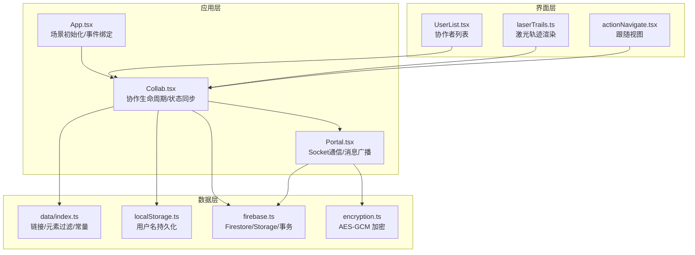
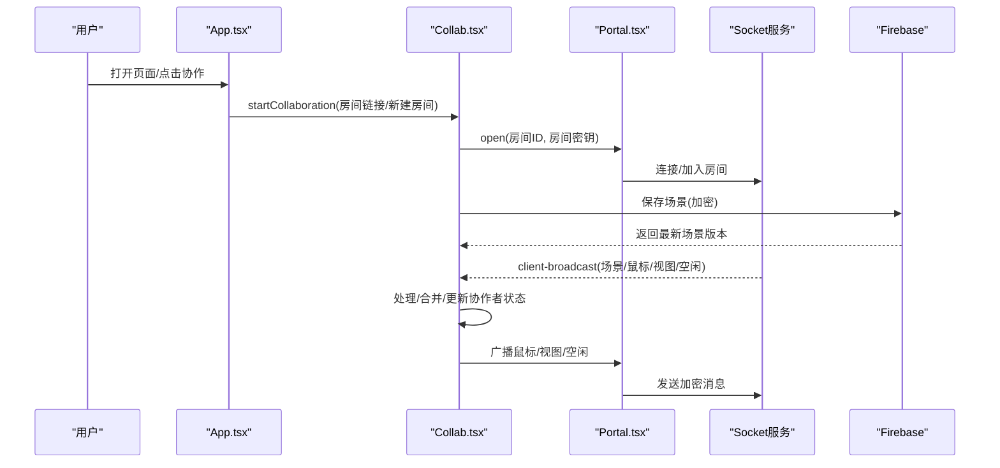
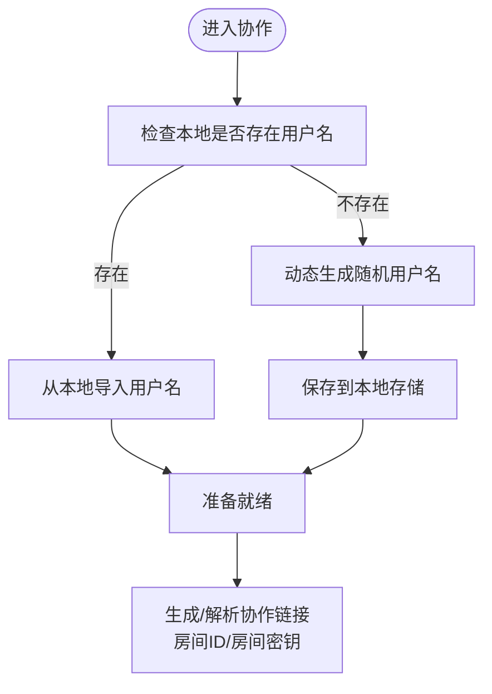
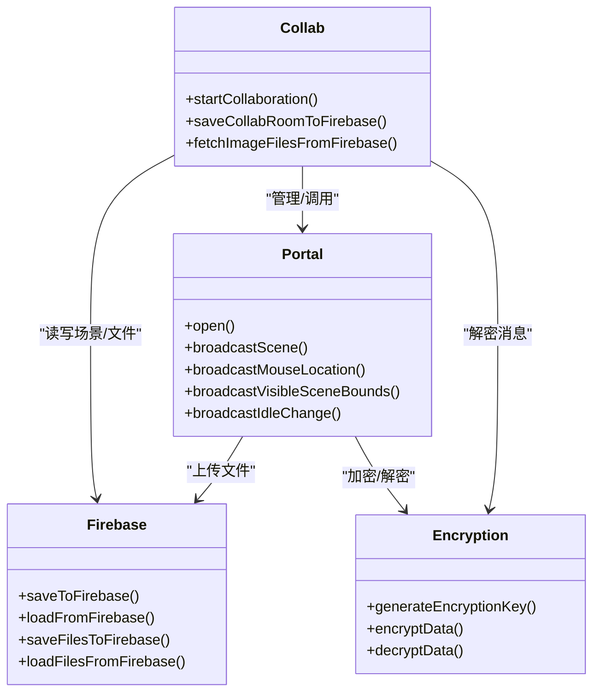
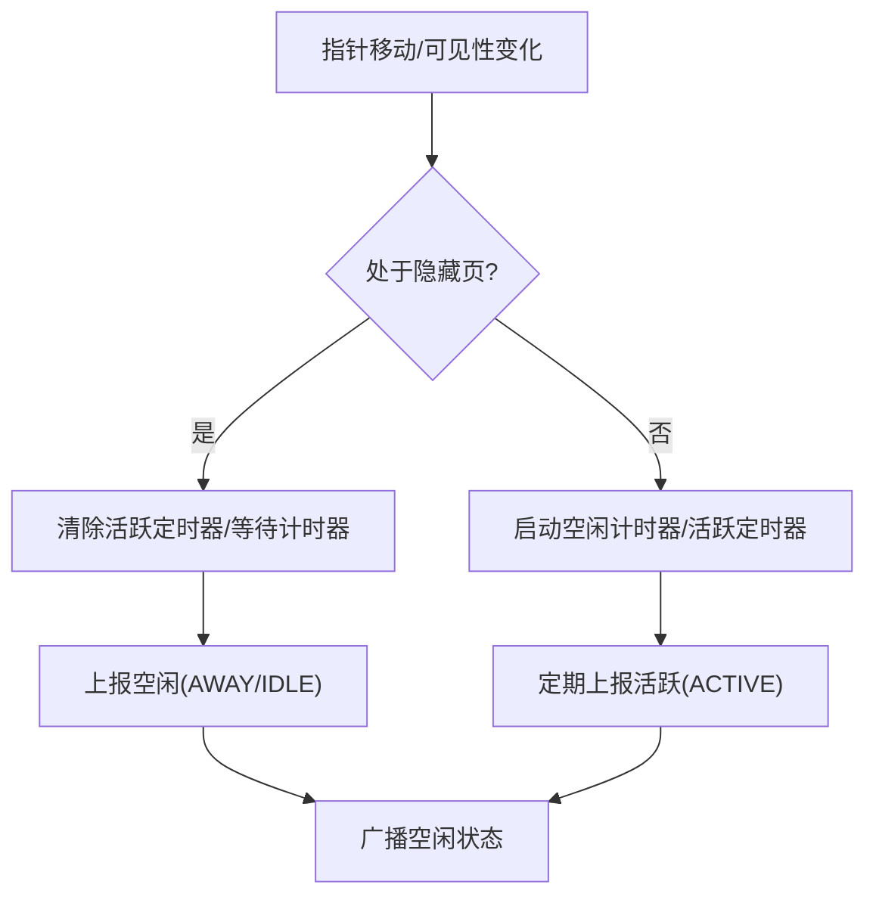
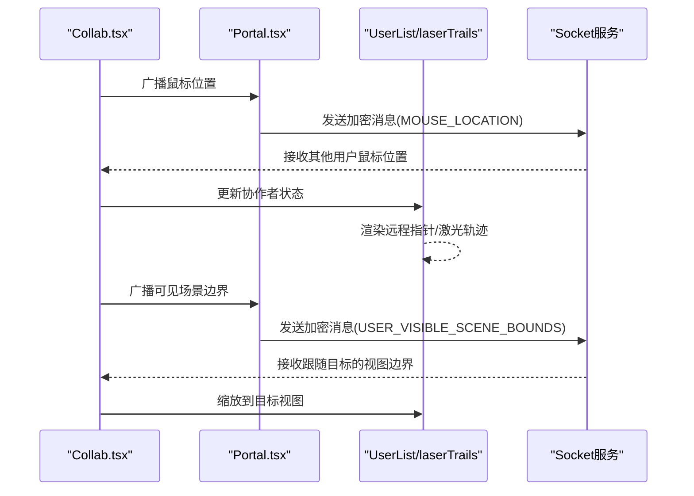
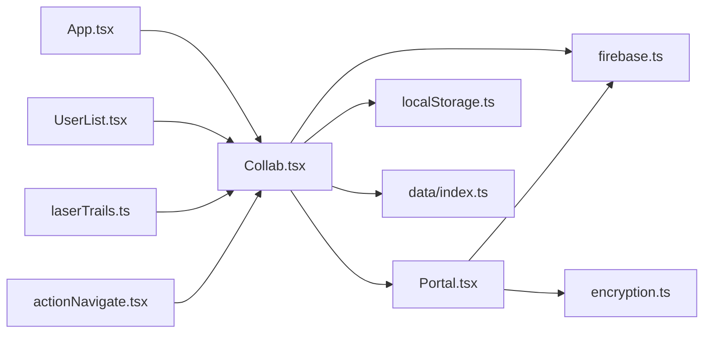

# 用户管理与权限

<cite>
**本文档引用的文件**
- [excalidraw-app/collab/Collab.tsx](file://excalidraw-app/collab/Collab.tsx)
- [excalidraw-app/collab/Portal.tsx](file://excalidraw-app/collab/Portal.tsx)
- [excalidraw-app/App.tsx](file://excalidraw-app/App.tsx)
- [excalidraw-app/data/index.ts](file://excalidraw-app/data/index.ts)
- [excalidraw-app/data/localStorage.ts](file://excalidraw-app/data/localStorage.ts)
- [excalidraw-app/data/firebase.ts](file://excalidraw-app/data/firebase.ts)
- [excalidraw-app/app_constants.ts](file://excalidraw-app/app_constants.ts)
- [packages/common/src/constants.ts](file://packages/common/src/constants.ts)
- [packages/excalidraw/data/encryption.ts](file://packages/excalidraw/data/encryption.ts)
- [packages/excalidraw/laserTrails.ts](file://packages/excalidraw/laserTrails.ts)
- [packages/excalidraw/actions/actionNavigate.tsx](file://packages/excalidraw/actions/actionNavigate.tsx)
- [packages/excalidraw/components/UserList.tsx](file://packages/excalidraw/components/UserList.tsx)
</cite>

## 目录

1. [简介](#简介)
2. [项目结构](#项目结构)
3. [核心组件](#核心组件)
4. [架构总览](#架构总览)
5. [详细组件分析](#详细组件分析)
6. [依赖关系分析](#依赖关系分析)
7. [性能考量](#性能考量)
8. [故障排查指南](#故障排查指南)
9. [结论](#结论)
10. [附录](#附录)

## 简介

本文件面向开发者，系统性阐述 Excalidraw 协作场景下的用户管理与权限体系，涵盖以下主题：

- 用户身份：用户名生成、本地存储与导入
- 权限模型：房间密钥、加密通信、协作可见性
- 用户状态：在线/离线、活跃度检测、空闲状态广播
- 协作交互：鼠标位置共享、光标与激光轨迹、跟随视图
- 数据安全：端到端加密、Firebase 存储与事务一致性
- 界面反馈：错误提示、离线状态、保存进度
- 错误处理与边界条件：异常解密、网络中断、资源加载失败

## 项目结构

围绕用户管理与权限的关键模块如下：

- 应用入口与初始化：App.tsx 负责场景初始化、协作入口与事件绑定
- 协作核心：Collab.tsx 管理协作生命周期、状态同步、错误处理
- 通信桥接：Portal.tsx 封装 Socket 通信、消息广播、文件上传
- 数据与存储：data/index.ts 提供链接生成、元素过滤；localStorage.ts 管理用户名持久化；firebase.ts 实现 Firestore/Storage 的读写与加密
- 常量与类型：app_constants.ts 定义事件、子类型、阈值；common/constants.ts 定义空闲阈值与枚举；encryption.ts 提供对称加解密
- 用户界面：UserList.tsx 展示协作者列表；laserTrails.ts 渲染激光轨迹；actionNavigate.tsx 支持跟随协作者视图

**图表来源**

- [excalidraw-app/App.tsx:216-372](file://excalidraw-app/App.tsx#L216-L372)
- [excalidraw-app/collab/Collab.tsx:132-281](file://excalidraw-app/collab/Collab.tsx#L132-L281)
- [excalidraw-app/collab/Portal.tsx:25-83](file://excalidraw-app/collab/Portal.tsx#L25-L83)
- [excalidraw-app/data/index.ts:68-164](file://excalidraw-app/data/index.ts#L68-L164)
- [excalidraw-app/data/localStorage.ts:11-35](file://excalidraw-app/data/localStorage.ts#L11-L35)
- [excalidraw-app/data/firebase.ts:187-247](file://excalidraw-app/data/firebase.ts#L187-L247)
- [packages/excalidraw/data/encryption.ts:50-94](file://packages/excalidraw/data/encryption.ts#L50-L94)
- [packages/excalidraw/components/UserList.tsx:237-274](file://packages/excalidraw/components/UserList.tsx#L237-L274)
- [packages/excalidraw/laserTrails.ts:92-135](file://packages/excalidraw/laserTrails.ts#L92-L135)
- [packages/excalidraw/actions/actionNavigate.tsx:46-144](file://packages/excalidraw/actions/actionNavigate.tsx#L46-L144)

**章节来源**

- [excalidraw-app/App.tsx:216-372](file://excalidraw-app/App.tsx#L216-L372)
- [excalidraw-app/collab/Collab.tsx:132-281](file://excalidraw-app/collab/Collab.tsx#L132-L281)
- [excalidraw-app/collab/Portal.tsx:25-83](file://excalidraw-app/collab/Portal.tsx#L25-L83)
- [excalidraw-app/data/index.ts:68-164](file://excalidraw-app/data/index.ts#L68-L164)
- [excalidraw-app/data/localStorage.ts:11-35](file://excalidraw-app/data/localStorage.ts#L11-L35)
- [excalidraw-app/data/firebase.ts:187-247](file://excalidraw-app/data/firebase.ts#L187-L247)
- [packages/excalidraw/data/encryption.ts:50-94](file://packages/excalidraw/data/encryption.ts#L50-L94)
- [packages/excalidraw/components/UserList.tsx:237-274](file://packages/excalidraw/components/UserList.tsx#L237-L274)
- [packages/excalidraw/laserTrails.ts:92-135](file://packages/excalidraw/laserTrails.ts#L92-L135)
- [packages/excalidraw/actions/actionNavigate.tsx:46-144](file://packages/excalidraw/actions/actionNavigate.tsx#L46-L144)

## 核心组件

- 协作控制器（Collab）
  - 生命周期：启动/停止协作、场景初始化、错误提示与重置
  - 状态：在线/离线、是否正在协作、活动房间链接
  - 用户：设置/获取用户名、更新协作者列表、广播鼠标/视图/空闲状态
  - 文件：通过 FileManager 统一上传/拉取图片文件
- 通信桥（Portal）
  - Socket 事件：加入房间、新用户、房间用户变更
  - 广播：场景初始化/更新、鼠标位置、可见场景边界、空闲状态
  - 文件：节流上传、状态回写
- 应用入口（App）
  - 初始化：根据 URL 决定是否进入协作模式
  - 同步：浏览器标签间同步、本地存储与 Firebase 的数据同步
  - 导出：分享链接导出、后端存取
- 数据与存储（data/index、localStorage、firebase）
  - 链接生成：随机房间 ID 与密钥，生成/解析协作链接
  - 元素过滤：仅同步“可同步”元素（排除过小或已删除但未超时）
  - 持久化：用户名本地存储；场景与文件通过 Firebase 存储
- 界面与交互（UserList、laserTrails、actionNavigate）
  - 列表：展示协作者头像、名称、跟随状态、语音通话状态
  - 跟随：导航到指定协作者可视区域
  - 轨迹：激光工具下绘制协作者的轨迹

**章节来源**

- [excalidraw-app/collab/Collab.tsx:132-281](file://excalidraw-app/collab/Collab.tsx#L132-L281)
- [excalidraw-app/collab/Portal.tsx:25-83](file://excalidraw-app/collab/Portal.tsx#L25-L83)
- [excalidraw-app/App.tsx:216-372](file://excalidraw-app/App.tsx#L216-L372)
- [excalidraw-app/data/index.ts:68-164](file://excalidraw-app/data/index.ts#L68-L164)
- [excalidraw-app/data/localStorage.ts:11-35](file://excalidraw-app/data/localStorage.ts#L11-L35)
- [excalidraw-app/data/firebase.ts:187-247](file://excalidraw-app/data/firebase.ts#L187-L247)
- [packages/excalidraw/components/UserList.tsx:237-274](file://packages/excalidraw/components/UserList.tsx#L237-L274)
- [packages/excalidraw/laserTrails.ts:92-135](file://packages/excalidraw/laserTrails.ts#L92-L135)
- [packages/excalidraw/actions/actionNavigate.tsx:46-144](file://packages/excalidraw/actions/actionNavigate.tsx#L46-L144)

## 架构总览

协作流程从 App 初始化开始，依据 URL 是否包含协作链接决定进入协作模式。Collab 负责建立 Socket 连接、初始化房间、拉取/保存场景与文件，并在生命周期内维护用户状态与错误指示。

**图表来源**

- [excalidraw-app/App.tsx:328-372](file://excalidraw-app/App.tsx#L328-L372)
- [excalidraw-app/collab/Collab.tsx:471-706](file://excalidraw-app/collab/Collab.tsx#L471-L706)
- [excalidraw-app/collab/Portal.tsx:37-61](file://excalidraw-app/collab/Portal.tsx#L37-L61)
- [excalidraw-app/data/firebase.ts:187-247](file://excalidraw-app/data/firebase.ts#L187-L247)

**章节来源**

- [excalidraw-app/App.tsx:328-372](file://excalidraw-app/App.tsx#L328-L372)
- [excalidraw-app/collab/Collab.tsx:471-706](file://excalidraw-app/collab/Collab.tsx#L471-L706)
- [excalidraw-app/collab/Portal.tsx:37-61](file://excalidraw-app/collab/Portal.tsx#L37-L61)
- [excalidraw-app/data/firebase.ts:187-247](file://excalidraw-app/data/firebase.ts#L187-L247)

## 详细组件分析

### 用户身份与存储

- 用户名生成与导入
  - 若本地无用户名，首次进入协作时动态加载随机用户名并保存至本地存储
  - 页面加载时从本地存储导入用户名，用于后续广播
- 本地存储键
  - 使用统一的存储键管理“协作相关数据”，避免与其他应用状态混淆
- 链接与密钥
  - 房间 ID 与房间密钥分别生成，房间密钥用于端到端加密
  - 协作链接以哈希形式携带房间 ID 与密钥，不暴露给服务器

**图表来源**

- [excalidraw-app/collab/Collab.tsx:471-497](file://excalidraw-app/collab/Collab.tsx#L471-L497)
- [excalidraw-app/data/localStorage.ts:11-35](file://excalidraw-app/data/localStorage.ts#L11-L35)
- [excalidraw-app/data/index.ts:148-164](file://excalidraw-app/data/index.ts#L148-L164)

**章节来源**

- [excalidraw-app/collab/Collab.tsx:471-497](file://excalidraw-app/collab/Collab.tsx#L471-L497)
- [excalidraw-app/data/localStorage.ts:11-35](file://excalidraw-app/data/localStorage.ts#L11-L35)
- [excalidraw-app/data/index.ts:148-164](file://excalidraw-app/data/index.ts#L148-L164)

### 协作权限模型与房间密钥

- 房间密钥
  - 由客户端生成并仅在内存中使用，不上传至服务器
  - 场景与文件均采用对称加密（AES-GCM），确保端到端安全
- 房间访问
  - 仅持有正确房间 ID 与房间密钥的用户可加入房间并解密内容
- 文件访问
  - 图片文件上传前按最大字节限制编码并加密，下载时解压并解密

**图表来源**

- [excalidraw-app/collab/Collab.tsx:315-355](file://excalidraw-app/collab/Collab.tsx#L315-L355)
- [excalidraw-app/collab/Portal.tsx:85-200](file://excalidraw-app/collab/Portal.tsx#L85-L200)
- [excalidraw-app/data/firebase.ts:187-247](file://excalidraw-app/data/firebase.ts#L187-L247)
- [packages/excalidraw/data/encryption.ts:50-94](file://packages/excalidraw/data/encryption.ts#L50-L94)

**章节来源**

- [excalidraw-app/collab/Collab.tsx:315-355](file://excalidraw-app/collab/Collab.tsx#L315-L355)
- [excalidraw-app/collab/Portal.tsx:85-200](file://excalidraw-app/collab/Portal.tsx#L85-L200)
- [excalidraw-app/data/firebase.ts:187-247](file://excalidraw-app/data/firebase.ts#L187-L247)
- [packages/excalidraw/data/encryption.ts:50-94](file://packages/excalidraw/data/encryption.ts#L50-L94)

### 用户状态跟踪：在线/离线、活跃/空闲

- 在线/离线
  - 监听浏览器 online/offline 事件，更新全局离线原子状态
- 活跃度检测
  - 基于指针移动与可见性变化，定时上报活跃/空闲状态
  - 空闲阈值与活跃上报周期来自公共常量
- 状态广播
  - 通过 Portal 广播空闲状态，volatile 模式降低带宽占用

**图表来源**

- [excalidraw-app/collab/Collab.tsx:831-867](file://excalidraw-app/collab/Collab.tsx#L831-L867)
- [packages/common/src/constants.ts:307-310](file://packages/common/src/constants.ts#L307-L310)

**章节来源**

- [excalidraw-app/collab/Collab.tsx:831-867](file://excalidraw-app/collab/Collab.tsx#L831-L867)
- [packages/common/src/constants.ts:307-310](file://packages/common/src/constants.ts#L307-L310)

### 协作交互：鼠标共享、光标与激光轨迹、跟随视图

- 鼠标共享
  - Portal 广播鼠标坐标、按钮状态、选中元素集合与用户名
  - Collab 更新协作者映射并在 UI 中渲染远程指针
- 激光轨迹
  - 当协作者使用激光工具且按钮按下时，绘制轨迹点
  - 轨迹颜色与用户头像色一致，区分不同协作者
- 跟随视图
  - 用户选择跟随某协作者时，App 更新用户关注目标
  - 接收协作者可见场景边界，自动缩放/平移到其视图

**图表来源**

- [excalidraw-app/collab/Portal.tsx:202-248](file://excalidraw-app/collab/Portal.tsx#L202-L248)
- [excalidraw-app/collab/Collab.tsx:601-661](file://excalidraw-app/collab/Collab.tsx#L601-L661)
- [packages/excalidraw/laserTrails.ts:92-135](file://packages/excalidraw/laserTrails.ts#L92-L135)
- [packages/excalidraw/actions/actionNavigate.tsx:46-58](file://packages/excalidraw/actions/actionNavigate.tsx#L46-L58)

**章节来源**

- [excalidraw-app/collab/Portal.tsx:202-248](file://excalidraw-app/collab/Portal.tsx#L202-L248)
- [excalidraw-app/collab/Collab.tsx:601-661](file://excalidraw-app/collab/Collab.tsx#L601-L661)
- [packages/excalidraw/laserTrails.ts:92-135](file://packages/excalidraw/laserTrails.ts#L92-L135)
- [packages/excalidraw/actions/actionNavigate.tsx:46-58](file://packages/excalidraw/actions/actionNavigate.tsx#L46-L58)

### 数据安全与隐私保护

- 端到端加密
  - 房间密钥用于 AES-GCM 对称加密，确保传输与存储内容不可被第三方读取
- 最小化暴露
  - 删除元素在一定时间窗口内仍参与同步，避免敏感数据泄露
  - 分享链接与协作链接的密钥仅存在于前端内存与 URL 哈希中
- 访问控制
  - 无密钥即无法加入房间或解密场景/文件
- 存储安全
  - 本地仅存储用户名与最小必要状态；场景与文件通过 Firebase 加密存储

**章节来源**

- [excalidraw-app/data/index.ts:46-63](file://excalidraw-app/data/index.ts#L46-L63)
- [excalidraw-app/data/index.ts:148-164](file://excalidraw-app/data/index.ts#L148-L164)
- [excalidraw-app/data/firebase.ts:93-116](file://excalidraw-app/data/firebase.ts#L93-L116)
- [packages/excalidraw/data/encryption.ts:50-94](file://packages/excalidraw/data/encryption.ts#L50-L94)

### 界面反馈、状态同步与错误处理

- 错误提示
  - 保存失败、解密失败、尺寸超限等错误通过弹窗与错误指示器提示
- 离线检测
  - 全局离线状态与在线/离线事件联动，影响 UI 行为
- 状态同步
  - 浏览器标签间同步、本地存储与 Firebase 的双向同步
- 异常恢复
  - 解密失败时返回无效响应类型，避免崩溃
  - 文件上传失败时记录错误并更新状态

**章节来源**

- [excalidraw-app/collab/Collab.tsx:331-355](file://excalidraw-app/collab/Collab.tsx#L331-L355)
- [excalidraw-app/collab/Collab.tsx:448-467](file://excalidraw-app/collab/Collab.tsx#L448-L467)
- [excalidraw-app/App.tsx:560-617](file://excalidraw-app/App.tsx#L560-L617)
- [excalidraw-app/collab/Portal.tsx:85-102](file://excalidraw-app/collab/Portal.tsx#L85-L102)

## 依赖关系分析

- 组件耦合
  - Collab 与 Portal 双向协作：Collab 调用 Portal 广播与文件操作，Portal 回传事件给 Collab
  - App 作为门面，协调初始化、事件与 UI
- 外部依赖
  - Socket.IO 客户端负责实时通信
  - Firebase 提供场景与文件的持久化
  - WebCrypto 提供对称加密能力
- 循环依赖
  - 通过模块拆分避免循环引用；Portal 与 Collab 通过回调与事件解耦

**图表来源**

- [excalidraw-app/App.tsx:216-372](file://excalidraw-app/App.tsx#L216-L372)
- [excalidraw-app/collab/Collab.tsx:132-281](file://excalidraw-app/collab/Collab.tsx#L132-L281)
- [excalidraw-app/collab/Portal.tsx:25-83](file://excalidraw-app/collab/Portal.tsx#L25-L83)
- [excalidraw-app/data/index.ts:68-164](file://excalidraw-app/data/index.ts#L68-L164)
- [excalidraw-app/data/localStorage.ts:11-35](file://excalidraw-app/data/localStorage.ts#L11-L35)
- [excalidraw-app/data/firebase.ts:187-247](file://excalidraw-app/data/firebase.ts#L187-L247)
- [packages/excalidraw/data/encryption.ts:50-94](file://packages/excalidraw/data/encryption.ts#L50-L94)
- [packages/excalidraw/components/UserList.tsx:237-274](file://packages/excalidraw/components/UserList.tsx#L237-L274)
- [packages/excalidraw/laserTrails.ts:92-135](file://packages/excalidraw/laserTrails.ts#L92-L135)
- [packages/excalidraw/actions/actionNavigate.tsx:46-144](file://packages/excalidraw/actions/actionNavigate.tsx#L46-L144)

**章节来源**

- [excalidraw-app/App.tsx:216-372](file://excalidraw-app/App.tsx#L216-L372)
- [excalidraw-app/collab/Collab.tsx:132-281](file://excalidraw-app/collab/Collab.tsx#L132-L281)
- [excalidraw-app/collab/Portal.tsx:25-83](file://excalidraw-app/collab/Portal.tsx#L25-L83)
- [excalidraw-app/data/index.ts:68-164](file://excalidraw-app/data/index.ts#L68-L164)
- [excalidraw-app/data/localStorage.ts:11-35](file://excalidraw-app/data/localStorage.ts#L11-L35)
- [excalidraw-app/data/firebase.ts:187-247](file://excalidraw-app/data/firebase.ts#L187-L247)
- [packages/excalidraw/data/encryption.ts:50-94](file://packages/excalidraw/data/encryption.ts#L50-L94)
- [packages/excalidraw/components/UserList.tsx:237-274](file://packages/excalidraw/components/UserList.tsx#L237-L274)
- [packages/excalidraw/laserTrails.ts:92-135](file://packages/excalidraw/laserTrails.ts#L92-L135)
- [packages/excalidraw/actions/actionNavigate.tsx:46-144](file://packages/excalidraw/actions/actionNavigate.tsx#L46-L144)

## 性能考量

- 带宽优化
  - 仅广播“可同步元素”，并基于版本号增量同步
  - 空闲状态与鼠标位置采用 volatile 广播，减少非关键流量
- 节流与批处理
  - 文件上传与图片加载采用节流，避免频繁 IO
  - 元素广播按版本增量，降低重复传输
- 加密成本
  - AES-GCM 在现代浏览器上性能良好，建议批量处理大文件以提升吞吐
- 离线与回退
  - 断线重连与回退初始化逻辑，保证在弱网环境下仍可恢复

[本节为通用指导，无需特定文件来源]

## 故障排查指南

- 解密失败
  - 现象：收到无效响应类型或弹窗提示
  - 排查：确认房间密钥正确、消息格式符合预期
- 保存失败
  - 现象：保存到 Firebase 失败或提示尺寸超限
  - 排查：检查文件大小限制、网络状态、错误消息
- 文件加载失败
  - 现象：图片状态停留在 pending 或 error
  - 排查：检查 Firebase Storage 权限、URL 有效性、解压/解密流程
- 空闲状态异常
  - 现象：活跃/空闲状态不随操作变化
  - 排查：确认指针事件监听、可见性事件、计时器是否正常
- 跟随视图无效
  - 现象：点击跟随后视图未变化
  - 排查：确认用户关注目标、跨跟随场景、接收的视图边界

**章节来源**

- [excalidraw-app/collab/Collab.tsx:448-467](file://excalidraw-app/collab/Collab.tsx#L448-L467)
- [excalidraw-app/collab/Collab.tsx:331-355](file://excalidraw-app/collab/Collab.tsx#L331-L355)
- [excalidraw-app/collab/Portal.tsx:85-102](file://excalidraw-app/collab/Portal.tsx#L85-L102)
- [excalidraw-app/collab/Collab.tsx:831-867](file://excalidraw-app/collab/Collab.tsx#L831-L867)
- [excalidraw-app/collab/Collab.tsx:629-661](file://excalidraw-app/collab/Collab.tsx#L629-L661)

## 结论

该用户管理与权限系统以“房间密钥 + AES-GCM 对称加密”为核心，结合 Socket 通信与 Firebase 存储，实现了端到端安全的协作体验。通过用户名本地化、活跃度检测、鼠标与视图共享、激光轨迹渲染以及跟随视图等功能，系统在保障隐私与安全的同时，提供了丰富的协作交互。建议在生产环境中持续监控加密性能、网络稳定性与错误率，并根据用户反馈优化 UI 反馈与引导。

[本节为总结，无需特定文件来源]

## 附录

- 关键常量与阈值
  - 空闲阈值与活跃上报周期：来源于公共常量
  - 房间 ID 生成长度、文件上传最大字节、同步间隔等
- 最佳实践
  - 严格管理房间密钥生命周期，避免硬编码
  - 对大文件进行分块上传与断点续传
  - 在弱网环境启用回退初始化与重试机制
  - 明确错误分类与用户提示文案，便于诊断

**章节来源**

- [packages/common/src/constants.ts:307-310](file://packages/common/src/constants.ts#L307-L310)
- [excalidraw-app/app_constants.ts:1-62](file://excalidraw-app/app_constants.ts#L1-L62)
- [excalidraw-app/data/index.ts:148-164](file://excalidraw-app/data/index.ts#L148-L164)
