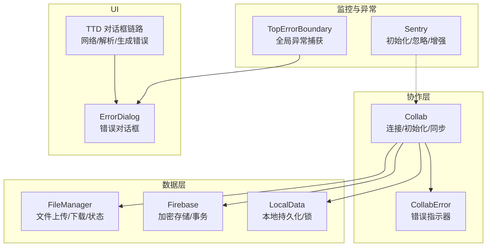
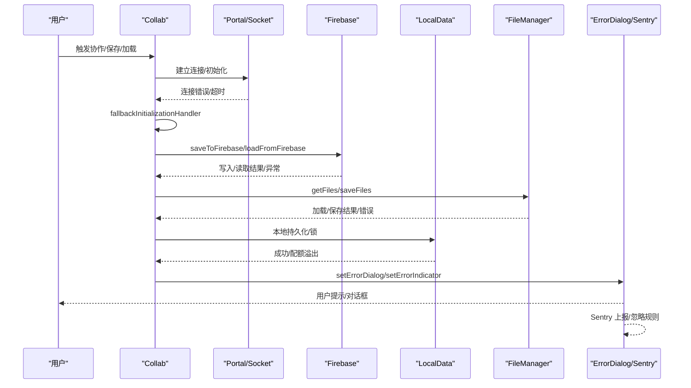
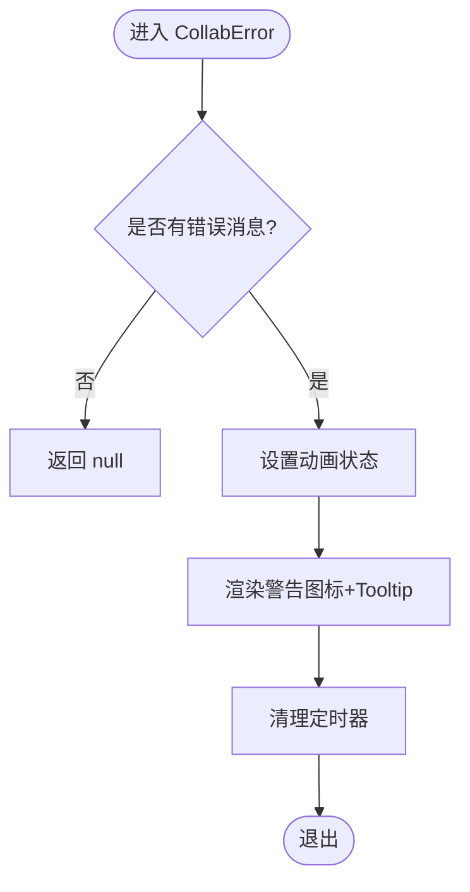
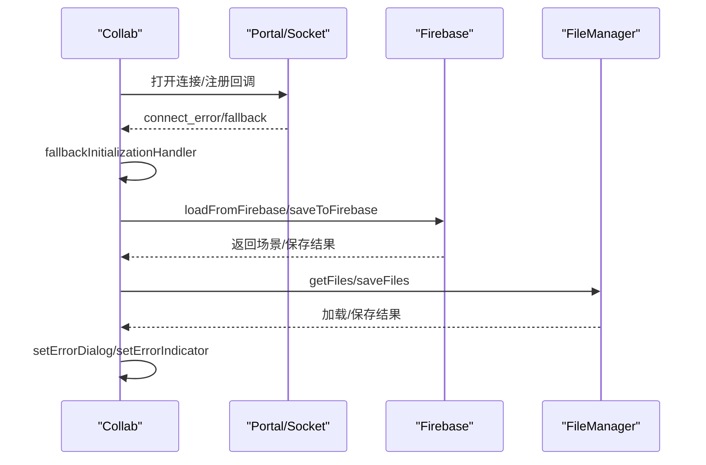
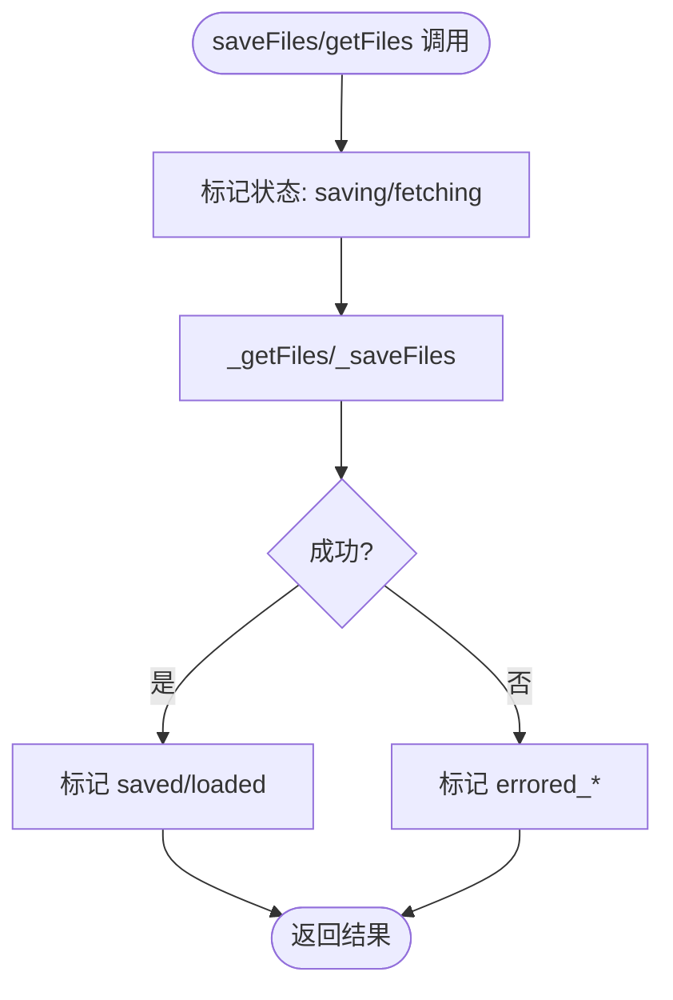
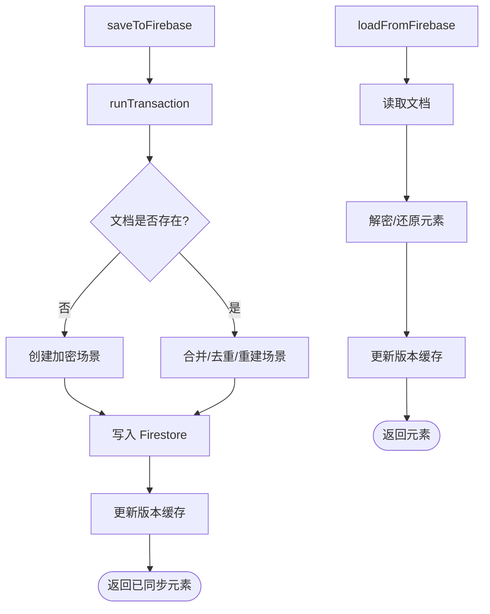
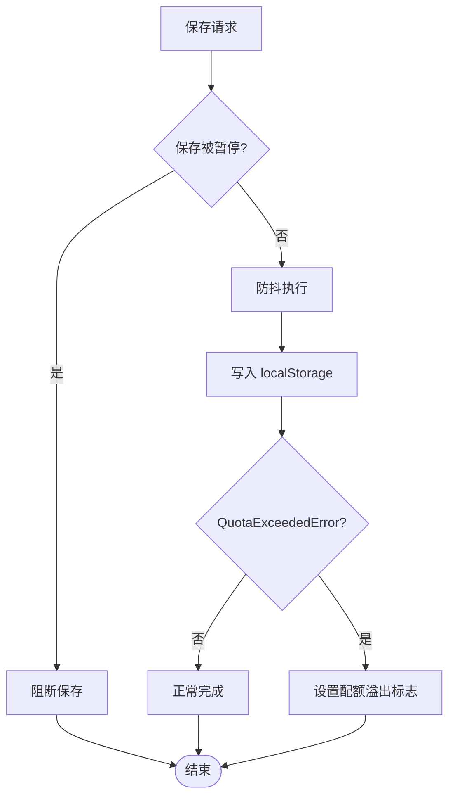
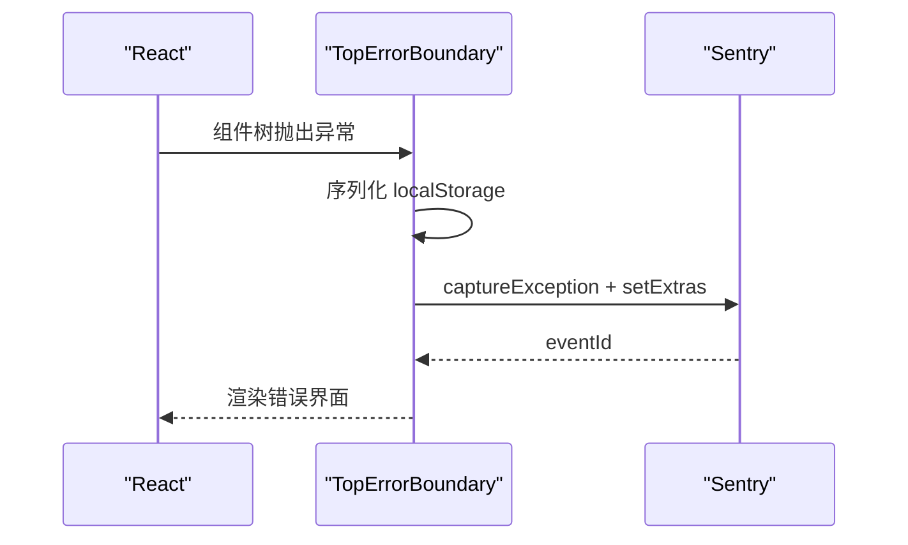
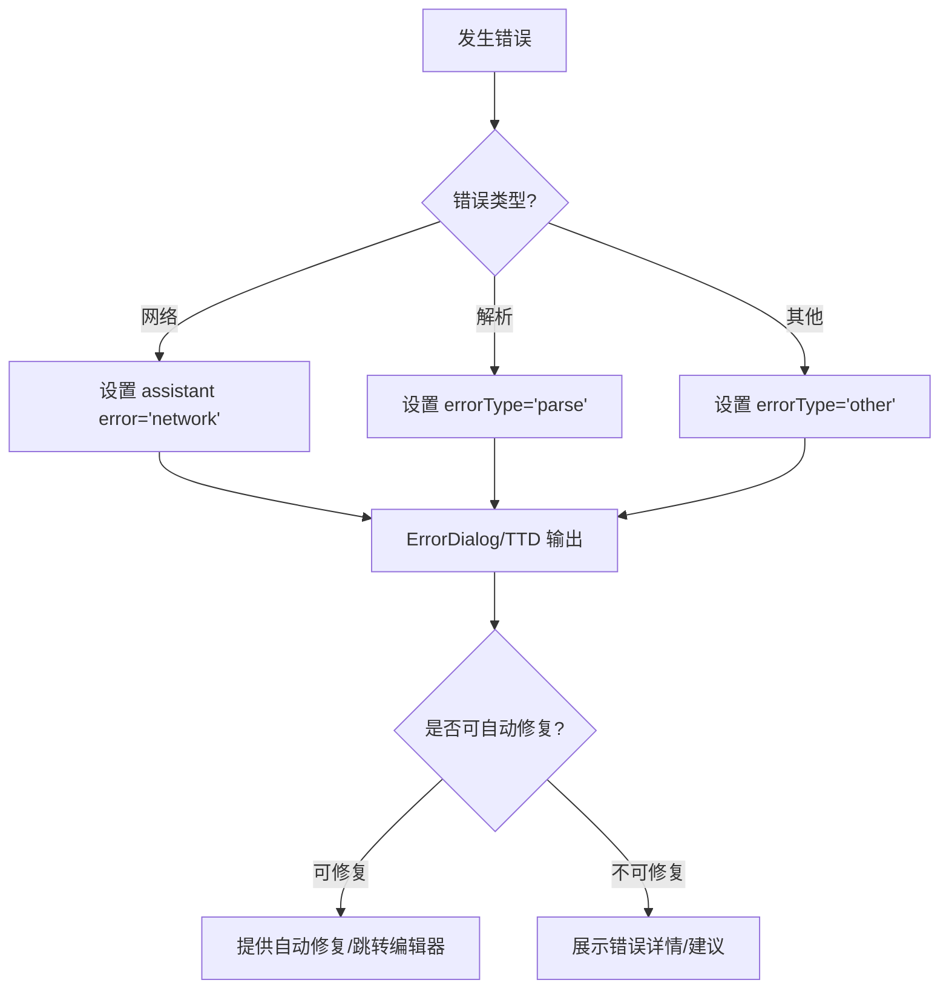
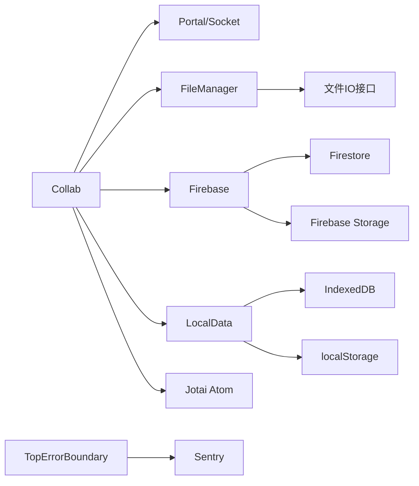

# 错误处理与恢复

<cite>
**本文引用的文件**
- [Collab.tsx](file://excalidraw-app/collab/Collab.tsx)
- [CollabError.tsx](file://excalidraw-app/collab/CollabError.tsx)
- [TopErrorBoundary.tsx](file://excalidraw-app/components/TopErrorBoundary.tsx)
- [sentry.ts](file://excalidraw-app/sentry.ts)
- [firebase.ts](file://excalidraw-app/data/firebase.ts)
- [LocalData.ts](file://excalidraw-app/data/LocalData.ts)
- [FileManager.ts](file://excalidraw-app/data/FileManager.ts)
- [app_constants.ts](file://excalidraw-app/app_constants.ts)
- [App.tsx](file://excalidraw-app/App.tsx)
- [ErrorDialog.tsx](file://packages/excalidraw/components/ErrorDialog.tsx)
- [useTextGeneration.ts](file://packages/excalidraw/components/TTDDialog/hooks/useTextGeneration.ts)
- [TTDstreamFetch.test.ts](file://packages/excalidraw/components/TTDDialog/utils/TTDstreamFetch.test.ts)
- [TTDDialogOutput.tsx](file://packages/excalidraw/components/TTDDialog/TTDDialogOutput.tsx)
- [ChatMessage.tsx](file://packages/excalidraw/components/TTDDialog/Chat/ChatMessage.tsx)
- [TextToDiagram.tsx](file://packages/excalidraw/components/TTDDialog/TextToDiagram.tsx)
</cite>

## 目录
1. [简介](#简介)
2. [项目结构](#项目结构)
3. [核心组件](#核心组件)
4. [架构总览](#架构总览)
5. [详细组件分析](#详细组件分析)
6. [依赖关系分析](#依赖关系分析)
7. [性能考量](#性能考量)
8. [故障排查指南](#故障排查指南)
9. [结论](#结论)
10. [附录](#附录)

## 简介
本文件聚焦于协作系统中的错误处理与恢复机制，覆盖网络错误、认证失败、数据同步错误等场景。内容包含错误检测与分类、优先级处理、自动恢复策略（重连、数据恢复、状态修复）、用户友好提示与对话框、日志与监控、诊断工具、预防与降级策略以及开发者实现指南。

## 项目结构
围绕错误处理的关键模块分布如下：
- 协作层：Collab 负责连接、初始化、消息解密与场景同步；CollabError 提供错误指示器。
- 数据层：Firebase 存储读写与事务；LocalData 本地持久化；FileManager 统一文件上传/下载状态管理。
- 异常边界：TopErrorBoundary 捕获未处理异常并引导用户进行清理或反馈。
- 监控：Sentry 初始化与忽略规则、事件增强。
- UI 对话框：ErrorDialog 用于展示应用级错误；TTD 对话框链路包含网络/解析/生成错误的分类与修复建议。
- 常量：超时、事件、阈值等统一配置。

图表来源
- [Collab.tsx:132-706](file://excalidraw-app/collab/Collab.tsx#L132-L706)
- [CollabError.tsx:21-51](file://excalidraw-app/collab/CollabError.tsx#L21-L51)
- [FileManager.ts:22-226](file://excalidraw-app/data/FileManager.ts#L22-L226)
- [firebase.ts:187-272](file://excalidraw-app/data/firebase.ts#L187-L272)
- [LocalData.ts:117-228](file://excalidraw-app/data/LocalData.ts#L117-L228)
- [TopErrorBoundary.tsx:12-146](file://excalidraw-app/components/TopErrorBoundary.tsx#L12-L146)
- [sentry.ts:20-83](file://excalidraw-app/sentry.ts#L20-L83)
- [ErrorDialog.tsx](file://packages/excalidraw/components/ErrorDialog.tsx)

章节来源
- [Collab.tsx:132-706](file://excalidraw-app/collab/Collab.tsx#L132-L706)
- [CollabError.tsx:21-51](file://excalidraw-app/collab/CollabError.tsx#L21-L51)
- [FileManager.ts:22-226](file://excalidraw-app/data/FileManager.ts#L22-L226)
- [firebase.ts:187-272](file://excalidraw-app/data/firebase.ts#L187-L272)
- [LocalData.ts:117-228](file://excalidraw-app/data/LocalData.ts#L117-L228)
- [TopErrorBoundary.tsx:12-146](file://excalidraw-app/components/TopErrorBoundary.tsx#L12-L146)
- [sentry.ts:20-83](file://excalidraw-app/sentry.ts#L20-L83)
- [ErrorDialog.tsx](file://packages/excalidraw/components/ErrorDialog.tsx)

## 核心组件
- 协作错误指示器：通过 Jotai 原子暴露错误消息与动画触发，配合 Tooltip 展示警告图标。
- 协作主类：负责连接建立、初始化回退、场景版本控制、元素协调、图像文件拉取与状态修复、离线状态切换、停止协作与清理。
- 文件管理器：统一跟踪“保存中/已保存/加载中/错误”状态，避免重复处理，支持卸载前阻塞与状态修复。
- Firebase 存储：基于 Firestore 的事务写入与读取，结合 AES 加解密与 IV；提供文件上传/下载与缓存控制。
- 本地持久化：IndexedDB/LD 存储，带保存锁与防抖，处理配额溢出并上报状态。
- 全局异常边界：捕获未处理异常，上报 Sentry 并提供一键清空本地数据、打开 Issue 的交互。
- 监控：Sentry 初始化、环境识别、忽略列表、控制台错误增强、特性标志集成。
- 错误对话框：通用 ErrorDialog 用于展示应用级错误；TTD 链路包含网络/解析/生成错误的分类与自动修复入口。

章节来源
- [CollabError.tsx:16-19](file://excalidraw-app/collab/CollabError.tsx#L16-L19)
- [Collab.tsx:132-706](file://excalidraw-app/collab/Collab.tsx#L132-L706)
- [FileManager.ts:22-226](file://excalidraw-app/data/FileManager.ts#L22-L226)
- [firebase.ts:187-272](file://excalidraw-app/data/firebase.ts#L187-L272)
- [LocalData.ts:117-228](file://excalidraw-app/data/LocalData.ts#L117-L228)
- [TopErrorBoundary.tsx:12-146](file://excalidraw-app/components/TopErrorBoundary.tsx#L12-L146)
- [sentry.ts:20-83](file://excalidraw-app/sentry.ts#L20-L83)
- [ErrorDialog.tsx](file://packages/excalidraw/components/ErrorDialog.tsx)

## 架构总览
协作系统的错误处理贯穿“检测—分类—提示—恢复—记录—诊断”的闭环：

图表来源
- [Collab.tsx:512-536](file://excalidraw-app/collab/Collab.tsx#L512-L536)
- [Collab.tsx:708-753](file://excalidraw-app/collab/Collab.tsx#L708-L753)
- [firebase.ts:187-272](file://excalidraw-app/data/firebase.ts#L187-L272)
- [FileManager.ts:139-180](file://excalidraw-app/data/FileManager.ts#L139-L180)
- [LocalData.ts:117-165](file://excalidraw-app/data/LocalData.ts#L117-L165)
- [TopErrorBoundary.tsx:26-46](file://excalidraw-app/components/TopErrorBoundary.tsx#L26-L46)
- [sentry.ts:26-32](file://excalidraw-app/sentry.ts#L26-L32)

## 详细组件分析

### 协作错误指示器（CollabError）
- 状态：Jotai 原子维护 message 与 nonce，触发动画以提醒用户。
- 行为：当存在错误消息时渲染警告图标，Tooltip 显示具体信息；清理定时器避免内存泄漏。
- 用途：在协作面板右上角显示“摇晃”动画，提示用户关注错误。

图表来源
- [CollabError.tsx:21-51](file://excalidraw-app/collab/CollabError.tsx#L21-L51)

章节来源
- [CollabError.tsx:16-19](file://excalidraw-app/collab/CollabError.tsx#L16-L19)
- [CollabError.tsx:21-51](file://excalidraw-app/collab/CollabError.tsx#L21-L51)

### 协作主类（Collab）与错误分类
- 连接与初始化：
  - 使用 Socket.IO 客户端建立连接，设置 connect_error 回退处理器。
  - 若无房间链接则生成新房间并更新历史；否则重置场景。
  - 设置初始化超时，若未收到初始消息则回退到从 Firebase 拉取场景。
- 场景同步与解密：
  - 收到加密数据后使用解密函数与 IV 解码，失败时弹窗并返回无效响应。
  - 根据消息类型分派：INIT/UPDATE/MOUSE_LOCATION/USER_VISIBLE_SCENE_BOUNDS/IDLE_STATUS。
- 保存与恢复：
  - 保存到 Firebase 前进行元素去重与版本计算；若大小超限提示“过大”。
  - 停止协作时可选择保留远程状态或重置本地状态并清理文件存储。
- 离线与卸载：
  - 监听 online/offline 切换，更新 isOfflineAtom。
  - beforeunload 中保存未完成的文件并阻止卸载，确保数据不丢失。
- 错误提示与指示：
  - 保存失败时弹出对话框并设置错误指示器；对话框仅对特定错误提示一次。
  - 停止协作时重置错误指示器并清理状态。

图表来源
- [Collab.tsx:512-536](file://excalidraw-app/collab/Collab.tsx#L512-L536)
- [Collab.tsx:708-753](file://excalidraw-app/collab/Collab.tsx#L708-L753)
- [Collab.tsx:315-355](file://excalidraw-app/collab/Collab.tsx#L315-L355)
- [Collab.tsx:357-403](file://excalidraw-app/collab/Collab.tsx#L357-L403)

章节来源
- [Collab.tsx:132-706](file://excalidraw-app/collab/Collab.tsx#L132-L706)
- [Collab.tsx:315-355](file://excalidraw-app/collab/Collab.tsx#L315-L355)
- [Collab.tsx:357-403](file://excalidraw-app/collab/Collab.tsx#L357-L403)
- [Collab.tsx:512-536](file://excalidraw-app/collab/Collab.tsx#L512-L536)
- [Collab.tsx:708-753](file://excalidraw-app/collab/Collab.tsx#L708-L753)

### 文件管理器（FileManager）与状态修复
- 状态跟踪：
  - 维护 fetching/saving/saved/errored_fetch/errored_save 等映射，避免重复处理。
  - 提供 shouldPreventUnload 判断是否需要阻止卸载。
- 加载/保存流程：
  - getFiles：标记 loading，调用底层 getFiles，成功则标记 loaded，失败标记 error。
  - saveFiles：收集新增文件，标记 saving，调用底层 saveFiles，成功标记 saved，失败标记 errored_save。
- 状态修复：
  - updateStaleImageStatuses：将 errored_files 对应元素状态置为 error，避免 UI 卡住。

图表来源
- [FileManager.ts:92-137](file://excalidraw-app/data/FileManager.ts#L92-L137)
- [FileManager.ts:139-180](file://excalidraw-app/data/FileManager.ts#L139-L180)
- [FileManager.ts:272-297](file://excalidraw-app/data/FileManager.ts#L272-L297)

章节来源
- [FileManager.ts:22-226](file://excalidraw-app/data/FileManager.ts#L22-L226)
- [FileManager.ts:272-297](file://excalidraw-app/data/FileManager.ts#L272-L297)

### Firebase 存储与事务（加密场景）
- 写入流程：
  - 通过 runTransaction 读取/比较旧场景版本，合并/去重后重新加密写入。
  - 记录场景版本缓存，便于后续判断是否已保存。
- 读取流程：
  - 从 Firestore 读取密文，使用房间密钥解密并还原元素。
- 文件读写：
  - 上传文件时按前缀组织，下载时校验状态码并解压/解密。
- 大小限制：
  - encodeFilesForUpload 对单文件大小进行上限检查，超限抛错。

图表来源
- [firebase.ts:187-247](file://excalidraw-app/data/firebase.ts#L187-L247)
- [firebase.ts:249-272](file://excalidraw-app/data/firebase.ts#L249-L272)
- [firebase.ts:274-319](file://excalidraw-app/data/firebase.ts#L274-L319)
- [firebase.ts:228-238](file://excalidraw-app/data/firebase.ts#L228-L238)

章节来源
- [firebase.ts:187-272](file://excalidraw-app/data/firebase.ts#L187-L272)
- [firebase.ts:274-319](file://excalidraw-app/data/firebase.ts#L274-L319)

### 本地持久化与配额溢出（LocalData）
- 保存策略：
  - debounce 包装保存，避免频繁写入；暂停保存时通过锁机制阻断。
  - 本地存储失败时捕获异常，区分 QuotaExceededError 并设置状态位。
- 文件清理：
  - 清理超过 24 小时未使用的文件，降低占用。
- 配额溢出提示：
  - 通过原子状态在 UI 层提示“本地存储配额已满”。

图表来源
- [LocalData.ts:117-165](file://excalidraw-app/data/LocalData.ts#L117-L165)
- [LocalData.ts:73-109](file://excalidraw-app/data/LocalData.ts#L73-L109)

章节来源
- [LocalData.ts:117-228](file://excalidraw-app/data/LocalData.ts#L117-L228)

### 全局异常边界（TopErrorBoundary）与 Sentry
- 捕获未处理异常，序列化 localStorage，上报 Sentry 并生成事件 ID。
- 提供一键刷新、清空本地数据并刷新、打开 GitHub Issue 的交互。
- Sentry 配置：
  - 环境识别与 DSN 控制，忽略常见噪声错误（如 Safari 特定错误、IDB 关闭、服务工单加载失败、localStorage 配额）。
  - 控制台错误增强，注入堆栈帧，过滤第三方模块。

图表来源
- [TopErrorBoundary.tsx:26-46](file://excalidraw-app/components/TopErrorBoundary.tsx#L26-L46)
- [sentry.ts:14-32](file://excalidraw-app/sentry.ts#L14-L32)
- [sentry.ts:39-82](file://excalidraw-app/sentry.ts#L39-L82)

章节来源
- [TopErrorBoundary.tsx:12-146](file://excalidraw-app/components/TopErrorBoundary.tsx#L12-L146)
- [sentry.ts:20-83](file://excalidraw-app/sentry.ts#L20-L83)

### 错误对话框与用户提示
- 应用级错误：通过 ErrorDialog 展示 errorMessage 并允许关闭。
- 协作错误：通过 setErrorDialog 与 collabErrorIndicatorAtom 提示用户。
- TTD 对话框链路：
  - 网络错误：429 速率限制、其他网络错误分别标注类型。
  - 解析错误：Mermaid 解析失败，提供“AI 修复”“转到 Mermaid 编辑器”等操作。
  - 生成错误：统一封装错误消息并展示。

图表来源
- [ErrorDialog.tsx](file://packages/excalidraw/components/ErrorDialog.tsx)
- [useTextGeneration.ts:182-210](file://packages/excalidraw/components/TTDDialog/hooks/useTextGeneration.ts#L182-L210)
- [TTDDialogOutput.tsx:47-122](file://packages/excalidraw/components/TTDDialog/TTDDialogOutput.tsx#L47-L122)
- [ChatMessage.tsx:123-156](file://packages/excalidraw/components/TTDDialog/Chat/ChatMessage.tsx#L123-L156)
- [TextToDiagram.tsx:141-144](file://packages/excalidraw/components/TTDDialog/TextToDiagram.tsx#L141-L144)

章节来源
- [ErrorDialog.tsx](file://packages/excalidraw/components/ErrorDialog.tsx)
- [useTextGeneration.ts:182-210](file://packages/excalidraw/components/TTDDialog/hooks/useTextGeneration.ts#L182-L210)
- [TTDDialogOutput.tsx:47-122](file://packages/excalidraw/components/TTDDialog/TTDDialogOutput.tsx#L47-L122)
- [ChatMessage.tsx:123-156](file://packages/excalidraw/components/TTDDialog/Chat/ChatMessage.tsx#L123-L156)
- [TextToDiagram.tsx:141-144](file://packages/excalidraw/components/TTDDialog/TextToDiagram.tsx#L141-L144)

## 依赖关系分析
- 组件耦合：
  - Collab 依赖 Portal/Socket、FileManager、Firebase、LocalData、Jotai 原子。
  - FileManager 依赖底层 getFiles/saveFiles 实现与状态回调。
  - TopErrorBoundary 依赖 Sentry 与本地数据快照。
- 外部依赖：
  - Socket.IO 客户端、Firebase SDK、Sentry Browser。
- 循环依赖：
  - 未发现直接循环；各模块职责清晰，通过回调与原子通信。

图表来源
- [Collab.tsx:132-706](file://excalidraw-app/collab/Collab.tsx#L132-L706)
- [FileManager.ts:22-65](file://excalidraw-app/data/FileManager.ts#L22-L65)
- [firebase.ts:187-272](file://excalidraw-app/data/firebase.ts#L187-L272)
- [LocalData.ts:117-228](file://excalidraw-app/data/LocalData.ts#L117-L228)
- [TopErrorBoundary.tsx:12-146](file://excalidraw-app/components/TopErrorBoundary.tsx#L12-L146)
- [sentry.ts:20-83](file://excalidraw-app/sentry.ts#L20-L83)

章节来源
- [Collab.tsx:132-706](file://excalidraw-app/collab/Collab.tsx#L132-L706)
- [FileManager.ts:22-65](file://excalidraw-app/data/FileManager.ts#L22-L65)
- [firebase.ts:187-272](file://excalidraw-app/data/firebase.ts#L187-L272)
- [LocalData.ts:117-228](file://excalidraw-app/data/LocalData.ts#L117-L228)
- [TopErrorBoundary.tsx:12-146](file://excalidraw-app/components/TopErrorBoundary.tsx#L12-L146)
- [sentry.ts:20-83](file://excalidraw-app/sentry.ts#L20-L83)

## 性能考量
- 防抖与节流：
  - LocalData 保存使用防抖；图像加载使用节流，减少频繁 IO。
- 版本与缓存：
  - FirebaseSceneVersionCache 依据场景版本避免重复写入。
  - 文件缓存最大存活时间由常量控制，平衡新鲜度与带宽。
- 超时与回退：
  - INITIAL_SCENE_UPDATE_TIMEOUT 与 LOAD_IMAGES_TIMEOUT 限制等待时间，提升可用性。
- 状态最小化：
  - FileManager 仅跟踪必要状态，避免冗余计算与 UI 重绘。

章节来源
- [LocalData.ts:117-165](file://excalidraw-app/data/LocalData.ts#L117-L165)
- [FileManager.ts:79-90](file://excalidraw-app/data/FileManager.ts#L79-L90)
- [firebase.ts:118-129](file://excalidraw-app/data/firebase.ts#L118-L129)
- [app_constants.ts:1-62](file://excalidraw-app/app_constants.ts#L1-L62)

## 故障排查指南
- 网络错误
  - 现象：连接失败、初始化超时、加载/保存失败。
  - 排查：检查 WebSocket 服务器地址、防火墙、CDN 缓存；查看 Sentry 事件 ID 与忽略规则。
  - 恢复：启用 fallbackInitializationHandler，回退到 Firebase 拉取场景；重试保存。
- 认证失败
  - 现象：房间密钥无效、解密失败。
  - 排查：确认房间链接完整、密钥正确；检查解密流程与 IV。
  - 恢复：重新加入房间或生成新链接；清理本地状态后重试。
- 数据同步错误
  - 现象：场景不同步、元素冲突、版本不一致。
  - 排查：核对场景版本缓存、事务写入是否成功；检查 reconcile 结果。
  - 恢复：强制从 Firebase 拉取最新场景；手动触发全量同步。
- 文件错误
  - 现象：图片加载失败、上传失败、状态卡住。
  - 排查：检查文件大小限制、存储桶权限、网络状态；查看 FileManager 错误映射。
  - 恢复：重试加载/保存；将 errored 文件状态置为 error，允许用户重试。
- 本地存储问题
  - 现象：localStorage 报错、配额溢出。
  - 排查：清理过期文件、减少大对象存储；监控配额溢出标志。
  - 恢复：释放空间后重试；必要时清空本地数据并重启。
- 全局异常
  - 现象：页面崩溃。
  - 排查：查看 Sentry 事件、错误堆栈；对比本地快照。
  - 恢复：刷新页面；清空本地数据并重试；提交 Issue。

章节来源
- [Collab.tsx:512-536](file://excalidraw-app/collab/Collab.tsx#L512-L536)
- [Collab.tsx:708-753](file://excalidraw-app/collab/Collab.tsx#L708-L753)
- [Collab.tsx:448-467](file://excalidraw-app/collab/Collab.tsx#L448-L467)
- [firebase.ts:187-247](file://excalidraw-app/data/firebase.ts#L187-L247)
- [FileManager.ts:272-297](file://excalidraw-app/data/FileManager.ts#L272-L297)
- [LocalData.ts:102-113](file://excalidraw-app/data/LocalData.ts#L102-L113)
- [TopErrorBoundary.tsx:26-46](file://excalidraw-app/components/TopErrorBoundary.tsx#L26-L46)
- [sentry.ts:26-32](file://excalidraw-app/sentry.ts#L26-L32)

## 结论
该协作系统通过“状态化错误指示器 + 分层错误处理 + 文件状态机 + Firebase 事务 + Sentry 监控 + 全局异常边界”的组合，实现了对网络、认证、数据同步、文件与本地存储等多类错误的稳健处理。其自动恢复策略（回退初始化、版本缓存、状态修复、配额溢出提示）有效提升了用户体验；同时提供用户友好的错误提示与诊断工具，便于快速定位与修复问题。

## 附录
- 常用配置与阈值
  - 保存防抖间隔、初始场景超时、图像加载超时、全量同步间隔、文件上传大小限制、文件缓存有效期等。
- 开发者实现要点
  - 在业务层统一使用 setErrorDialog 与 collabErrorIndicatorAtom，避免分散提示。
  - 对外层 API 调用包裹 try/catch 并分类错误类型，必要时回退到 Firebase。
  - 使用 FileManager 统一文件状态，避免重复请求与状态错乱。
  - 对关键路径增加 Sentry 上报与忽略规则，减少噪音并保留关键错误。
  - 在 beforeunload 中保存未完成文件，必要时阻止卸载并提示用户。

章节来源
- [app_constants.ts:1-62](file://excalidraw-app/app_constants.ts#L1-L62)
- [Collab.tsx:315-355](file://excalidraw-app/collab/Collab.tsx#L315-L355)
- [Collab.tsx:291-313](file://excalidraw-app/collab/Collab.tsx#L291-L313)
- [FileManager.ts:139-180](file://excalidraw-app/data/FileManager.ts#L139-L180)
- [sentry.ts:26-32](file://excalidraw-app/sentry.ts#L26-L32)