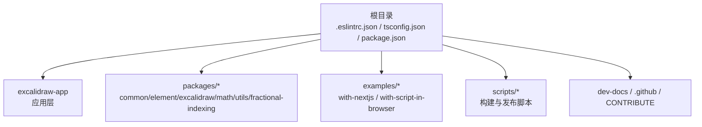
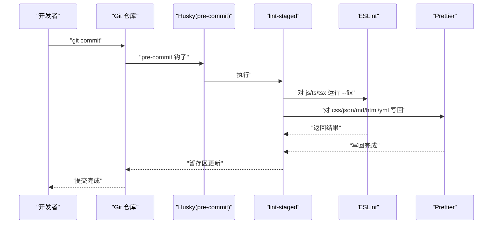
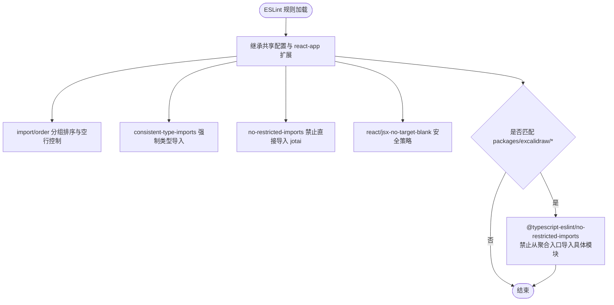
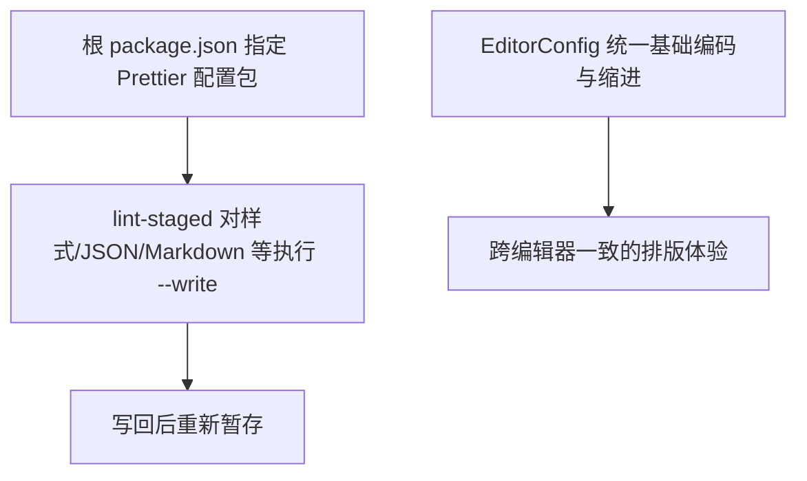
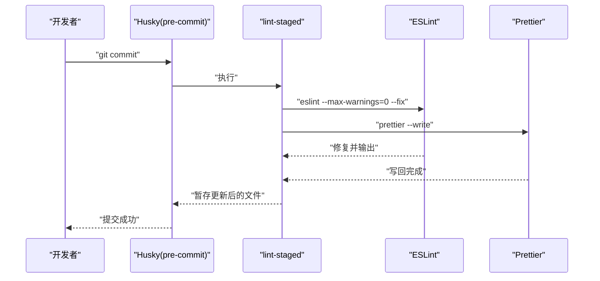
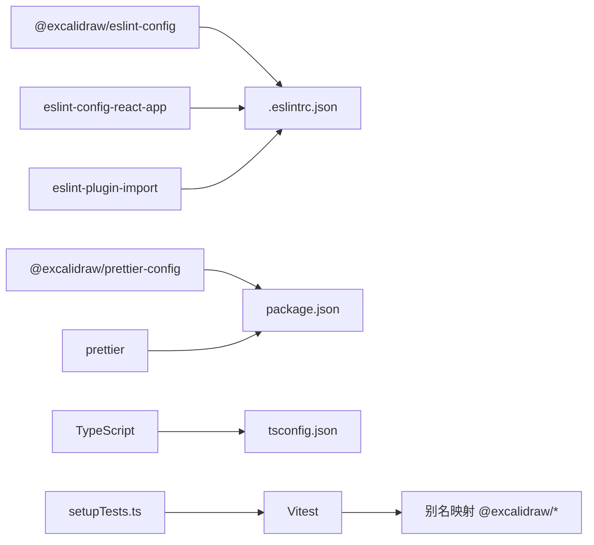

# 代码规范与质量

<cite>
**本文引用的文件**
- [.eslintrc.json](file://.eslintrc.json)
- [packages/eslintrc.base.json](file://packages/eslintrc.base.json)
- [tsconfig.json](file://tsconfig.json)
- [packages/tsconfig.base.json](file://packages/tsconfig.base.json)
- [package.json](file://package.json)
- [.lintstagedrc.js](file://.lintstagedrc.js)
- [.husky/pre-commit](file://.husky/pre-commit)
- [.editorconfig](file://.editorconfig)
- [vitest.config.mts](file://vitest.config.mts)
- [setupTests.ts](file://setupTests.ts)
- [excalidraw-app/package.json](file://excalidraw-app/package.json)
- [packages/common/package.json](file://packages/common/package.json)
</cite>

## 目录

1. [简介](#简介)
2. [项目结构](#项目结构)
3. [核心组件](#核心组件)
4. [架构总览](#架构总览)
5. [详细组件分析](#详细组件分析)
6. [依赖关系分析](#依赖关系分析)
7. [性能考量](#性能考量)
8. [故障排查指南](#故障排查指南)
9. [结论](#结论)
10. [附录](#附录)

## 简介

本文件系统性梳理本仓库的代码规范与质量保证体系，覆盖以下方面：

- ESLint 配置与规则：基础规则、插件扩展、覆盖范围与特殊限制
- Prettier 格式化标准：统一缩进、换行、空白处理等
- TypeScript 类型检查：严格模式、路径映射、声明生成策略
- 代码风格指南：命名约定、文件组织、注释规范
- Git 钩子与预提交流程：Husky、lint-staged 的配置与执行顺序
- 质量门禁与持续集成：本地脚本、CI 可复用检查项
- 常见问题与修复方法：典型 ESLint/Prettier/TS 问题定位与解决
- IDE 自动化：如何借助插件实现自动格式化与类型检查

## 项目结构

本项目采用 monorepo 结构，包含多个包（packages/_）、应用层（excalidraw-app）与示例工程（examples/_）。根目录集中管理 ESLint、TypeScript、测试与构建脚本；各包通过独立的 package.json 与构建脚本进行发布与类型生成。



**章节来源**

- [package.json:1-96](file://package.json#L1-L96)
- [tsconfig.json:1-39](file://tsconfig.json#L1-L39)
- [packages/tsconfig.base.json:1-29](file://packages/tsconfig.base.json#L1-L29)

## 核心组件

- ESLint 配置与规则
  - 继承官方共享配置与 react-app 扩展，启用 import/order 分组排序与类型导入一致性
  - 对特定包（如 excalidraw）设置额外导入限制，避免从聚合入口直接导入具体模块
  - 限制直接从 jotai 导入，强制通过应用层封装模块
- Prettier 格式化标准
  - 通过根目录 package.json 指定统一的 prettier 配置包，并在脚本中统一调用
  - EditorConfig 提供跨编辑器的基础编码与缩进约定
- TypeScript 类型检查
  - 严格模式开启，启用路径映射，支持 JSX 与声明生成
  - 各包独立生成类型声明并通过发布配置导出
- 测试与覆盖率
  - Vitest 配置别名映射到各包源码，设置覆盖率阈值与报告格式
  - setupTests.ts 注入 polyfill、mock 与全局环境，确保测试稳定性

**章节来源**

- [.eslintrc.json:1-65](file://.eslintrc.json#L1-L65)
- [packages/eslintrc.base.json:1-22](file://packages/eslintrc.base.json#L1-L22)
- [tsconfig.json:1-39](file://tsconfig.json#L1-L39)
- [packages/tsconfig.base.json:1-29](file://packages/tsconfig.base.json#L1-L29)
- [package.json:10-44](file://package.json#L10-L44)
- [vitest.config.mts:1-88](file://vitest.config.mts#L1-L88)
- [setupTests.ts:1-134](file://setupTests.ts#L1-L134)

## 架构总览

下图展示从开发者提交到质量门禁的整体流程：Husky 在 pre-commit 触发 lint-staged，分别对 JS/TS 文件运行 ESLint 并自动修复，对样式/JSON/Markdown 等运行 Prettier 写回；随后可选地触发本地测试与类型检查脚本。



**图表来源**

- [.husky/pre-commit:1-3](file://.husky/pre-commit#L1-L3)
- [.lintstagedrc.js:1-15](file://.lintstagedrc.js#L1-L15)

**章节来源**

- [.husky/pre-commit:1-3](file://.husky/pre-commit#L1-L3)
- [.lintstagedrc.js:1-15](file://.lintstagedrc.js#L1-L15)

## 详细组件分析

### ESLint 配置与规则

- 基础规则与扩展
  - 继承官方共享配置与 react-app 扩展，确保团队一致的规则基线
  - import/order：按内置、外部、内部、相对等分组排序，同组内保持空行，支持 @excalidraw 命名空间识别
  - consistent-type-imports：强制使用 type-imports，允许类型注解，修复风格为 separate-type-imports
  - no-restricted-imports：禁止直接从 jotai 导入，需改用 app 层封装模块
  - react/jsx-no-target-blank：链接打开新窗口时允许 referrer
- 包级覆盖规则
  - 对 packages/excalidraw 下的 TS/TSX 文件，限制从聚合入口导入，鼓励直接相对路径导入具体模块
  - 额外限制从 @excalidraw/excalidraw 导入非类型内容（仅允许类型导入），以保证包独立性



**图表来源**

- [.eslintrc.json:2-42](file://.eslintrc.json#L2-L42)
- [.eslintrc.json:43-63](file://.eslintrc.json#L43-L63)

**章节来源**

- [.eslintrc.json:1-65](file://.eslintrc.json#L1-L65)
- [packages/eslintrc.base.json:1-22](file://packages/eslintrc.base.json#L1-L22)

### Prettier 格式化标准

- 统一配置来源
  - 根目录 package.json 指定 prettier 使用官方共享配置包
  - 提供 prettier 脚本用于批量检查与写回
- 文件类型覆盖
  - lint-staged 对 css/scss/json/md/html/yml 统一执行 --write
- 编辑器基础约定
  - EditorConfig 统一字符集、换行符、缩进与尾随空白处理



**图表来源**

- [package.json:50](file://package.json#L50)
- [.lintstagedrc.js:13](file://.lintstagedrc.js#L13)
- [.editorconfig:1-13](file://.editorconfig#L1-L13)

**章节来源**

- [package.json:50](file://package.json#L50)
- [.lintstagedrc.js:1-15](file://.lintstagedrc.js#L1-L15)
- [.editorconfig:1-13](file://.editorconfig#L1-L13)

### TypeScript 类型检查与路径映射

- 严格模式与编译目标
  - 严格模式开启，跳过库检查，启用 ESNext 目标与 Node 解析
  - 支持 JSX、JSON 模块与隔离模块，不输出 JS，仅生成类型
- 路径映射
  - 通过 baseUrl 与 paths 将 @excalidraw/\* 映射到各包源码，便于统一导入
- 声明生成
  - 各包独立生成类型声明并通过发布配置导出对应 d.ts
- 别名与测试
  - Vitest 配置将 @excalidraw/\* 别名解析到源码，确保测试与构建一致

```mermaid
erDiagram
TS_CONFIG {
string target
boolean strict
boolean skipLibCheck
string module
string moduleResolution
boolean isolatedModules
boolean noEmit
string jsx
}
PATHS {
string "@excalidraw/common"
string "@excalidraw/excalidraw"
string "@excalidraw/element"
string "@excalidraw/math"
string "@excalidraw/utils"
string "@excalidraw/fractional-indexing"
}
TS_CONFIG ||--|| PATHS : "使用"
```

**图表来源**

- [tsconfig.json:2-34](file://tsconfig.json#L2-L34)
- [packages/tsconfig.base.json:2-26](file://packages/tsconfig.base.json#L2-L26)
- [vitest.config.mts:6-62](file://vitest.config.mts#L6-L62)

**章节来源**

- [tsconfig.json:1-39](file://tsconfig.json#L1-L39)
- [packages/tsconfig.base.json:1-29](file://packages/tsconfig.base.json#L1-L29)
- [vitest.config.mts:1-88](file://vitest.config.mts#L1-L88)

### Git 钩子与预提交流程

- Husky 配置
  - 通过 npm script 中的 prepare 安装钩子
  - pre-commit 钩子委托给 lint-staged
- lint-staged 行为
  - 对 JS/TS/TSX：过滤被忽略文件后执行 ESLint --fix
  - 对样式/JSON/Markdown 等：执行 Prettier --write
- 应用层与包层的 Prettier 配置
  - 应用层与各包均指向同一共享 Prettier 配置包，确保一致性



**图表来源**

- [package.json:82](file://package.json#L82)
- [.husky/pre-commit:1-3](file://.husky/pre-commit#L1-L3)
- [.lintstagedrc.js:1-15](file://.lintstagedrc.js#L1-L15)

**章节来源**

- [package.json:82](file://package.json#L82)
- [.husky/pre-commit:1-3](file://.husky/pre-commit#L1-L3)
- [.lintstagedrc.js:1-15](file://.lintstagedrc.js#L1-L15)
- [excalidraw-app/package.json:42](file://excalidraw-app/package.json#L42)
- [packages/common/package.json:55-58](file://packages/common/package.json#L55-L58)

### 代码风格指南

- 命名约定
  - 组件与模块使用清晰语义命名，避免缩写；常量使用大写与下划线组合
  - 路径映射统一使用 @excalidraw/\* 前缀，减少相对路径复杂度
- 文件组织结构
  - 包内遵循 src -> index.ts 或模块化拆分；公共工具与类型集中于 common
  - 示例工程与应用层分离，便于独立开发与验证
- 注释规范
  - 公共 API 与复杂逻辑建议添加注释；遵循 ESLint 规则，避免无意义注释
  - 使用 consistent-type-imports 保证类型导入与实现导入分离

**章节来源**

- [tsconfig.json:21-34](file://tsconfig.json#L21-L34)
- [packages/tsconfig.base.json:13-26](file://packages/tsconfig.base.json#L13-L26)
- [.eslintrc.json:21-28](file://.eslintrc.json#L21-L28)

### 质量门禁与持续集成

- 本地质量门禁
  - 脚本 test:code：基于 ESLint，最大警告数为 0
  - 脚本 test:other：基于 Prettier，检查差异
  - 脚本 test:typecheck：基于 tsc，执行类型检查
  - 脚本 fix:code 与 fix:other：分别修复代码与格式
- CI 可复用检查项
  - 建议在 CI 中复用上述脚本，确保每次提交前完成代码质量检查
  - 可结合覆盖率阈值与测试稳定性（Vitest）共同作为合并门禁

**章节来源**

- [package.json:69-78](file://package.json#L69-L78)
- [vitest.config.mts:74-85](file://vitest.config.mts#L74-L85)

### 常见问题与修复方法

- ESLint
  - import/no-anonymous-default-export：避免匿名默认导出，提升可读性
  - consistent-type-imports：将类型导入与实现导入分离，避免运行时副作用
  - no-restricted-imports：替换直接从 jotai 导入为 app 层封装模块
  - 包级限制：从 @excalidraw/excalidraw 导入仅限类型，避免破坏包独立性
- Prettier
  - 统一缩进与换行：遵循 EditorConfig 与 Prettier 配置，避免手动调整
  - Markdown/JSON 等文件：通过 lint-staged 自动写回，减少冲突
- TypeScript
  - 严格模式报错：优先修复类型错误而非放宽规则
  - 路径映射：确保 @excalidraw/\* 与实际目录一致，避免导入失败

**章节来源**

- [.eslintrc.json:19-41](file://.eslintrc.json#L19-L41)
- [packages/eslintrc.base.json:6-17](file://packages/eslintrc.base.json#L6-L17)
- [.lintstagedrc.js:8-13](file://.lintstagedrc.js#L8-L13)

### IDE 自动化与插件建议

- VS Code
  - 安装 ESLint 与 Prettier 插件，启用保存时格式化
  - 配置默认 formatter 为 Prettier，lint 任务为 ESLint
- WebStorm/IntelliJ
  - 启用 ESLint 与 Prettier 集成，设置保存时自动修复
- 共享配置
  - 通过根目录 package.json 指定的共享 Prettier 配置包，确保团队一致

**章节来源**

- [package.json:50](file://package.json#L50)
- [.editorconfig:1-13](file://.editorconfig#L1-L13)

## 依赖关系分析

- ESLint 与插件
  - 依赖 @excalidraw/eslint-config 与 eslint-config-react-app，提供团队统一规则
  - 依赖 eslint-plugin-import 实现 import/order 与 no-restricted-\* 等规则
- Prettier 与 EditorConfig
  - 依赖 @excalidraw/prettier-config 与 prettier，统一格式化策略
  - EditorConfig 提供跨编辑器基础约定
- TypeScript
  - 严格模式与路径映射由 tsconfig.json 控制，Vitest 通过别名映射到源码
- 测试与覆盖率
  - Vitest 配置别名与覆盖率阈值，setupTests.ts 提供测试环境 polyfill



**图表来源**

- [package.json:12-34](file://package.json#L12-L34)
- [.eslintrc.json:2](file://.eslintrc.json#L2)
- [tsconfig.json:2-20](file://tsconfig.json#L2-L20)
- [vitest.config.mts:6-62](file://vitest.config.mts#L6-L62)
- [setupTests.ts:1-134](file://setupTests.ts#L1-L134)

**章节来源**

- [package.json:12-34](file://package.json#L12-L34)
- [.eslintrc.json:2](file://.eslintrc.json#L2)
- [tsconfig.json:2-20](file://tsconfig.json#L2-L20)
- [vitest.config.mts:6-62](file://vitest.config.mts#L6-L62)
- [setupTests.ts:1-134](file://setupTests.ts#L1-L134)

## 性能考量

- 类型检查与构建
  - 严格模式与跳过库检查在保证质量的同时兼顾性能
  - 声明生成与别名映射减少重复计算与打包体积
- 测试稳定性
  - Vitest 并行钩子与覆盖率阈值有助于快速反馈与质量保障
- 格式化与检查
  - lint-staged 仅对变更文件执行，降低提交耗时

[本节为通用指导，无需列出章节来源]

## 故障排查指南

- ESLint 报错
  - 检查 import/order 是否符合分组与空行要求
  - 检查 consistent-type-imports 是否将类型导入与实现导入分离
  - 检查 no-restricted-imports 与包级限制是否违反
- Prettier 差异
  - 使用 yarn prettier --list-different 定位差异文件
  - 通过 yarn prettier --write 一键修复
- TypeScript 错误
  - 使用 yarn test:typecheck 快速定位类型问题
  - 检查 tsconfig.json 与 Vitest 别名映射是否正确
- 测试失败
  - 查看 setupTests.ts 中的 polyfill 与 mock 配置
  - 关注覆盖率阈值与报告格式，确保测试完整性

**章节来源**

- [package.json:69-78](file://package.json#L69-L78)
- [vitest.config.mts:74-85](file://vitest.config.mts#L74-L85)
- [setupTests.ts:1-134](file://setupTests.ts#L1-L134)

## 结论

本仓库通过统一的 ESLint、Prettier 与 TypeScript 配置，配合 Husky 与 lint-staged 的预提交流程，形成了完善的代码规范与质量保证体系。建议在日常开发中：

- 优先使用 IDE 插件自动格式化与类型检查
- 遵循 import/order 与类型导入分离规则
- 严格遵守包级导入限制，避免破坏包独立性
- 在 CI 中复用本地脚本，确保每次提交的质量门槛

[本节为总结性内容，无需列出章节来源]

## 附录

- 质量门禁清单
  - 通过 ESLint 检查且无新增警告
  - 通过 Prettier 差异检查
  - 通过 tsc 类型检查
  - 通过 Vitest 测试与覆盖率阈值
- 代码审查清单
  - 导入是否符合分组与限制规则
  - 类型导入与实现导入是否分离
  - 是否存在直接从 jotai 或聚合入口导入
  - 是否使用统一的路径映射与命名约定
  - 是否满足覆盖率与测试稳定性要求

[本节为通用指导，无需列出章节来源]
