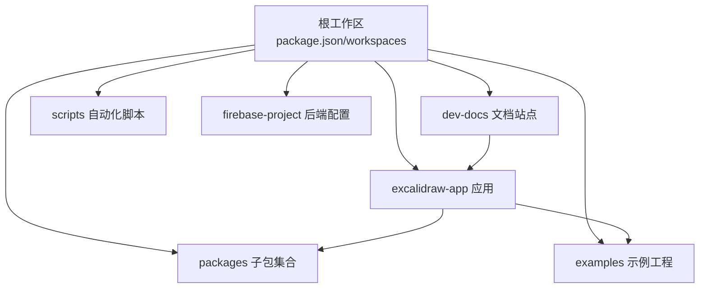
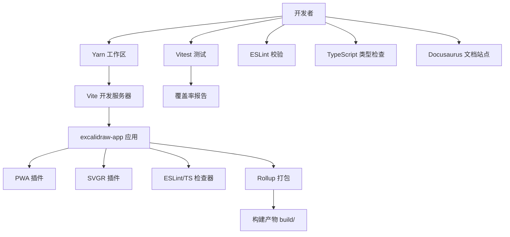
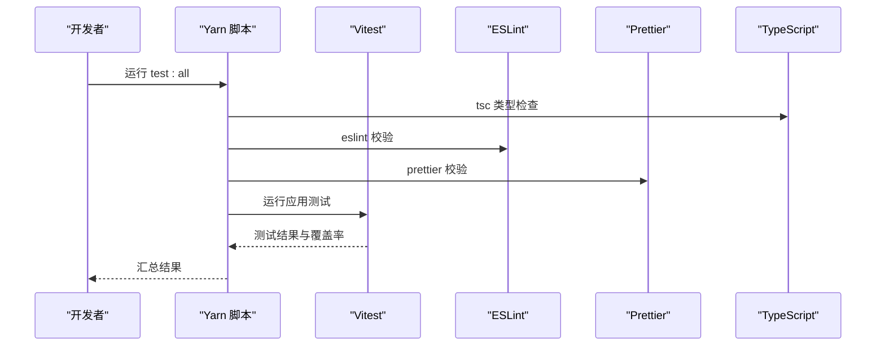
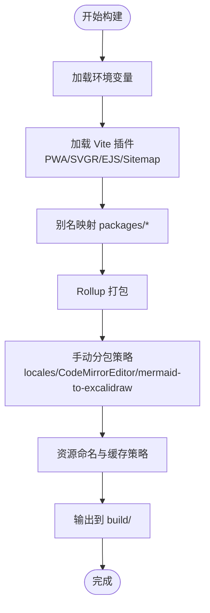
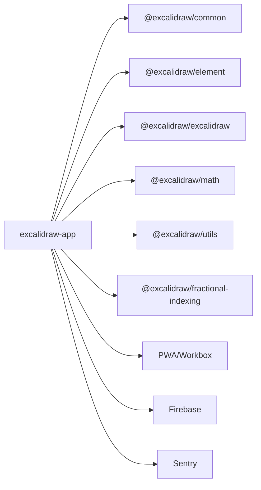

# 开发指南

<cite>
**本文引用的文件**
- [package.json](file://package.json)
- [README.md](file://README.md)
- [CONTRIBUTING.md](file://CONTRIBUTING.md)
- [.eslintrc.json](file://.eslintrc.json)
- [tsconfig.json](file://tsconfig.json)
- [vitest.config.mts](file://vitest.config.mts)
- [excalidraw-app/vite.config.mts](file://excalidraw-app/vite.config.mts)
- [excalidraw-app/package.json](file://excalidraw-app/package.json)
- [packages/eslintrc.base.json](file://packages/eslintrc.base.json)
- [packages/tsconfig.base.json](file://packages/tsconfig.base.json)
- [dev-docs/docusaurus.config.js](file://dev-docs/docusaurus.config.js)
- [dev-docs/src/pages/index.tsx](file://dev-docs/src/pages/index.tsx)
- [scripts/build-node.js](file://scripts/build-node.js)
- [scripts/build-version.js](file://scripts/build-version.js)
- [scripts/release.js](file://scripts/release.js)
- [scripts/updateChangelog.js](file://scripts/updateChangelog.js)
- [scripts/build-locales-coverage.js](file://scripts/build-locales-coverage.js)
- [scripts/locales-coverage-description.js](file://scripts/locales-coverage-description.js)
- [scripts/buildWasm.js](file://scripts/buildWasm.js)
- [scripts/buildUtils.js](file://scripts/buildUtils.js)
- [scripts/buildPackage.js](file://scripts/buildPackage.js)
- [scripts/buildBase.js](file://scripts/buildBase.js)
- [scripts/buildDocs.js](file://scripts/buildDocs.js)
- [scripts/wasm/woff2-vite-plugins.js](file://scripts/wasm/woff2-vite-plugins.js)
- [scripts/wasm/woff2-esbuild-plugins.js](file://scripts/wasm/woff2-esbuild-plugins.js)
- [excalidraw-app/App.tsx](file://excalidraw-app/App.tsx)
- [excalidraw-app/tests/MobileMenu.test.tsx](file://excalidraw-app/tests/MobileMenu.test.tsx)
- [excalidraw-app/tests/LanguageList.test.tsx](file://excalidraw-app/tests/LanguageList.test.tsx)
- [excalidraw-app/tests/collab.test.tsx](file://excalidraw-app/tests/collab.test.tsx)
- [excalidraw-app/data/FileManager.ts](file://excalidraw-app/data/FileManager.ts)
- [excalidraw-app/data/LocalData.ts](file://excalidraw-app/data/LocalData.ts)
- [excalidraw-app/data/locker.ts](file://excalidraw-app/data/Locker.ts)
- [excalidraw-app/data/TDTStorage.ts](file://excalidraw-app/data/TTDStorage.ts)
- [excalidraw-app/data/localStorage.ts](file://excalidraw-app/data/localStorage.ts)
- [excalidraw-app/data/tabSync.ts](file://excalidraw-app/data/tabSync.ts)
- [excalidraw-app/data/firebase.ts](file://excalidraw-app/data/firebase.ts)
- [excalidraw-app/data/index.ts](file://excalidraw-app/data/index.ts)
- [excalidraw-app/data/fileStatusStore.ts](file://excalidraw-app/data/fileStatusStore.ts)
- [excalidraw-app/app_language/language-detector.ts](file://excalidraw-app/app-language/language-detector.ts)
- [excalidraw-app/app_language/language-state.ts](file://excalidraw-app/app_language/language-state.ts)
- [excalidraw-app/app_language/LanguageList.tsx](file://excalidraw-app/app_language/LanguageList.tsx)
- [excalidraw-app/components/AppSidebar.tsx](file://excalidraw-app/components/AppSidebar.tsx)
- [excalidraw-app/components/AppMainMenu.tsx](file://excalidraw-app/components/AppMainMenu.tsx)
- [excalidraw-app/components/AppWelcomeScreen.tsx](file://excalidraw-app/components/AppWelcomeScreen.tsx)
- [excalidraw-app/components/AppFooter.tsx](file://excalidraw-app/components/AppFooter.tsx)
- [excalidraw-app/components/AI.tsx](file://excalidraw-app/components/AI.tsx)
- [excalidraw-app/components/DebugCanvas.tsx](file://excalidraw-app/components/DebugCanvas.tsx)
- [excalidraw-app/components/EncryptedIcon.tsx](file://excalidraw-app/components/EncryptedIcon.tsx)
- [excalidraw-app/components/ExportToExcalidrawPlus.tsx](file://excalidraw-app/components/ExportToExcalidrawPlus.tsx)
- [excalidraw-app/components/TopErrorBoundary.tsx](file://excalidraw-app/components/TopErrorBoundary.tsx)
- [excalidraw-app/collab/Collab.tsx](file://excalidraw-app/collab/Collab.tsx)
- [excalidraw-app/collab/CollabError.tsx](file://excalidraw-app/collab/CollabError.tsx)
- [excalidraw-app/collab/Portal.tsx](file://excalidraw-app/collab/Portal.tsx)
- [excalidraw-app/share/QRCode.tsx](file://excalidraw-app/share/QRCode.tsx)
- [excalidraw-app/share/ShareDialog.tsx](file://excalidraw-app/share/ShareDialog.tsx)
- [excalidraw-app/share/qrcode.chunk.ts](file://excalidraw-app/share/qrcode.chunk.ts)
- [excalidraw-app/sentry.ts](file://excalidraw-app/sentry.ts)
- [excalidraw-app/useHandleAppTheme.ts](file://excalidraw-app/useHandleAppTheme.ts)
- [excalidraw-app/global.d.ts](file://excalidraw-app/global.d.ts)
- [excalidraw-app/vite-env.d.ts](file://excalidraw-app/vite-env.d.ts)
- [excalidraw-app/app-jotai.ts](file://excalidraw-app/app-jotai.ts)
- [excalidraw-app/app_constants.ts](file://excalidraw-app/app_constants.ts)
- [excalidraw-app/bug-issue-template.js](file://excalidraw-app/bug-issue-template.js)
- [excalidraw-app/index.html](file://excalidraw-app/index.html)
- [excalidraw-app/index.scss](file://excalidraw-app/index.scss)
- [excalidraw-app/index.tsx](file://excalidraw-app/index.tsx)
- [excalidraw-app/package.json](file://excalidraw-app/package.json)
- [packages/common/src/index.ts](file://packages/common/src/index.ts)
- [packages/element/src/index.ts](file://packages/element/src/index.ts)
- [packages/excalidraw/index.tsx](file://packages/excalidraw/index.tsx)
- [packages/math/src/index.ts](file://packages/math/src/index.ts)
- [packages/utils/src/index.ts](file://packages/utils/src/index.ts)
- [packages/fractional-indexing/src/index.ts](file://packages/fractional-indexing/src/index.ts)
- [examples/with-nextjs/package.json](file://examples/with-nextjs/package.json)
- [examples/with-nextjs/src/app/page.tsx](file://examples/with-nextjs/src/app/page.tsx)
- [examples/with-nextjs/src/pages/excalidraw-in-pages.tsx](file://examples/with-nextjs/src/pages/excalidraw-in-pages.tsx)
- [examples/with-nextjs/src/excalidrawWrapper.tsx](file://examples/with-nextjs/src/excalidrawWrapper.tsx)
- [examples/with-nextjs/next.config.js](file://examples/with-nextjs/next.config.js)
- [examples/with-nextjs/tsconfig.json](file://examples/with-nextjs/tsconfig.json)
- [examples/with-nextjs/vercel.json](file://examples/with-nextjs/vercel.json)
- [examples/with-script-in-browser/package.json](file://examples/with-script-in-browser/package.json)
- [examples/with-script-in-browser/index.tsx](file://examples/with-script-in-browser/index.tsx)
- [examples/with-script-in-browser/vite.config.mts](file://examples/with-script-in-browser/vite.config.mts)
- [examples/with-script-in-browser/tsconfig.json](file://examples/with-script-in-browser/tsconfig.json)
- [examples/with-script-in-browser/initialData.tsx](file://examples/with-script-in-browser/initialData.tsx)
- [examples/with-script-in-browser/utils.ts](file://examples/with-script-in-browser/utils.ts)
- [examples/with-script-in-browser/components/ExampleApp.tsx](file://examples/with-script-in-browser/components/ExampleApp.tsx)
- [examples/with-script-in-browser/components/sidebar/ExampleSidebar.tsx](file://examples/with-script-in-browser/components/sidebar/ExampleSidebar.tsx)
- [examples/with-script-in-browser/components/CustomFooter.tsx](file://examples/with-script-in-browser/components/CustomFooter.tsx)
- [examples/with-script-in-browser/components/MobileFooter.tsx](file://examples/with-script-in-browser/components/MobileFooter.tsx)
- [examples/with-script-in-browser/public/index.html](file://examples/with-script-in-browser/public/index.html)
- [examples/with-script-in-browser/public/images/](file://examples/with-script-in-browser/public/images/)
- [Dockerfile](file://Dockerfile)
- [docker-compose.yml](file://docker-compose.yml)
- [firebase-project/firebase.json](file://firebase-project/firebase.json)
- [firebase-project/firestore.rules](file://firebase-project/firestore.rules)
- [firebase-project/storage.rules](file://firebase-project/storage.rules)
- [firebase-project/.firebaserc](file://firebase-project/.firebaserc)
- [firebase-project/firestore.indexes.json](file://firebase-project/firestore.indexes.json)
- [.gitignore](file://.gitignore)
- [.editorconfig](file://.editorconfig)
- [.eslintignore](file://.eslintignore)
- [.npmrc](file://.npmrc)
- [.lintstagedrc.js](file://.lintstagedrc.js)
- [.husky/_/husky](file://.husky/_/husky)
- [.gitattributes](file://.gitattributes)
- [vercel.json](file://vercel.json)
- [crowdin.yml](file://crowdin.yml)
- [setupTests.ts](file://setupTests.ts)
</cite>

## 目录
1. [简介](#简介)
2. [项目结构](#项目结构)
3. [核心组件](#核心组件)
4. [架构总览](#架构总览)
5. [详细组件分析](#详细组件分析)
6. [依赖关系分析](#依赖关系分析)
7. [性能考量](#性能考量)
8. [故障排查指南](#故障排查指南)
9. [结论](#结论)
10. [附录](#附录)

## 简介
本开发指南面向新贡献者与维护者，系统性说明开发环境搭建、代码规范、测试策略、构建与发布流程、Git 工作流与提交规范、调试与性能分析方法，以及贡献流程与代码审查要点。项目采用 Yarn 1 工作区（monorepo）组织多包与示例工程，前端应用基于 Vite + React + TypeScript，测试使用 Vitest + jsdom，ESLint/Prettier 统一代码风格，文档站点基于 Docusaurus。

## 项目结构
仓库采用 monorepo 结构，核心目录与职责如下：
- 根目录：根级脚本、配置与工作区定义；包含发布与本地化覆盖率等工具脚本。
- excalidraw-app：主应用（PWA），包含入口、主题、组件、协作与分享功能、数据层等。
- packages/*：各子包（common、element、excalidraw、math、utils、fractional-indexing），按模块拆分能力。
- examples/*：示例工程（Next.js 集成、浏览器直接引入等）。
- dev-docs：开发者文档站点（Docusaurus），用于贡献指南与开发文档。
- scripts/*：构建、版本、发布、本地化覆盖率等自动化脚本。
- firebase-project：Firebase 配置与规则（Firestore、存储、索引）。
- 其他：Docker、Vercel、Crowdin、.gitignore/.editorconfig 等。

图表来源
- [package.json:1-96](file://package.json#L1-L96)
- [excalidraw-app/package.json:1-58](file://excalidraw-app/package.json#L1-L58)

章节来源
- [package.json:1-96](file://package.json#L1-L96)
- [README.md:1-125](file://README.md#L1-L125)

## 核心组件
- 开发环境与包管理
  - 包管理器：Yarn 1.22.22（根配置声明）
  - Node.js 版本：>= 18（根 engines 与子包一致）
  - 工作区：excalidraw-app、packages/*、examples/*
- 构建与打包
  - Vite 5.x 作为开发服务器与打包工具
  - PWA 插件、SVG 转组件插件、EJS 模板、Sitemap、字体 WOFF2 优化
  - Rollup 手动分包策略（locales、CodeMirrorEditor、mermaid-to-excalidraw 等）
- 测试
  - Vitest + jsdom 环境，全局 setupFiles，覆盖率报告与阈值
  - ESLint + Prettier 校验与修复
  - 类型检查 tsc
- 代码规范
  - ESLint 规则扩展与自定义规则（import 排序、类型导入偏好、受限导入等）
  - TypeScript 基础配置与路径映射
- 文档与站点
  - Docusaurus 文档站点，支持搜索、侧边栏、主题定制
- 发布与版本
  - 版本号生成、变更日志更新、发布脚本（可打标签）

章节来源
- [package.json:46-48](file://package.json#L46-L48)
- [excalidraw-app/package.json:25-27](file://excalidraw-app/package.json#L25-L27)
- [excalidraw-app/vite.config.mts:1-319](file://excalidraw-app/vite.config.mts#L1-L319)
- [vitest.config.mts:1-88](file://vitest.config.mts#L1-L88)
- [.eslintrc.json:1-65](file://.eslintrc.json#L1-L65)
- [tsconfig.json:1-39](file://tsconfig.json#L1-L39)
- [dev-docs/docusaurus.config.js:1-179](file://dev-docs/docusaurus.config.js#L1-L179)

## 架构总览
下图展示从开发到构建的关键流程与组件交互：

图表来源
- [excalidraw-app/vite.config.mts:127-315](file://excalidraw-app/vite.config.mts#L127-L315)
- [vitest.config.mts:65-86](file://vitest.config.mts#L65-L86)
- [package.json:51-91](file://package.json#L51-L91)

## 详细组件分析

### 开发环境搭建
- Node.js 与包管理器
  - Node.js 版本要求：>= 18（根与子包一致）
  - 包管理器：yarn@1.22.22（根 packageManager）
- 安装与初始化
  - 使用 Yarn 安装根依赖与工作区包
  - 初始化 Husky 提交钩子
- 环境变量
  - Vite 支持加载根目录 .env* 变量，可通过环境变量控制 PWA、ESLint 覆盖层等行为
- 示例工程
  - Next.js 示例与浏览器直引示例均可独立启动与构建

章节来源
- [package.json:46-48](file://package.json#L46-L48)
- [package.json:4,82](file://package.json#L4,L82)
- [excalidraw-app/vite.config.mts:11-23](file://excalidraw-app/vite.config.mts#L11-L23)
- [examples/with-nextjs/package.json:1-200](file://examples/with-nextjs/package.json)
- [examples/with-script-in-browser/package.json:1-200](file://examples/with-script-in-browser/package.json)

### 代码规范与 ESLint 配置
- 规范来源
  - 根 ESLint 配置扩展了 @excalidraw/eslint-config 与 react-app
  - 导入顺序与分组、匿名默认导出限制、受限全局与导入、类型导入偏好等
  - 对特定包的导入限制（如禁止直接从 @excalidraw/excalidraw 的 barrel 导入）
- 子包 ESLint 基线
  - 子包覆盖规则限制从某包导入实现细节（仅允许类型导入）
- Prettier
  - 通过根配置统一格式化规则，提供一键修复命令

章节来源
- [.eslintrc.json:1-65](file://.eslintrc.json#L1-L65)
- [packages/eslintrc.base.json:1-22](file://packages/eslintrc.base.json#L1-L22)
- [package.json:50,77-78](file://package.json#L50,L77-L78)

### TypeScript 配置
- 根 tsconfig
  - 严格模式、ESNext 目标、React JSX、路径映射至 packages/* 子包入口
  - Vitest 全局类型与测试环境类型注入
- 子包 tsconfig
  - 声明文件输出、ESNext 模块解析、路径映射与 JSX 配置

章节来源
- [tsconfig.json:1-39](file://tsconfig.json#L1-L39)
- [packages/tsconfig.base.json:1-29](file://packages/tsconfig.base.json#L1-L29)

### 测试策略
- 单元测试与集成测试
  - Vitest + jsdom 环境，全局 setupFiles 注入
  - 并行 hooks 执行顺序以提升并发性能
  - 覆盖率报告（文本、JSON、HTML、LCov），阈值设定
- 端到端测试
  - 未在当前仓库发现 E2E 专用框架配置与脚本
- 质量门禁
  - ESLint 校验（带修复）、Prettier 校验、TypeScript 类型检查
  - 聚合脚本：test:all 串行运行类型检查、代码校验、其他校验与应用测试

图表来源
- [package.json:67-71](file://package.json#L67-L71)
- [vitest.config.mts:65-86](file://vitest.config.mts#L65-L86)

章节来源
- [vitest.config.mts:1-88](file://vitest.config.mts#L1-L88)
- [package.json:67-71](file://package.json#L67-L71)

### 构建流程与打包优化
- Vite 配置
  - 别名映射至 packages/* 子包源码，便于开发时热更新与调试
  - PWA：自动更新注册、Workbox 缓存策略（字体、locales、chunk 分离缓存）
  - Sitemap、SVG 转组件、EJS 模板、HTML 最小化
  - 字体资源命名与内联策略（禁用自动内联小资源）
- Rollup 手动分包
  - locales 与 en/percentages 单独分包，保证首屏与离线体验
  - CodeMirrorEditor 与 mermaid-to-excalidraw 独立 chunk，避免共享依赖被 hoist 导致懒加载失效
- 产物与预览
  - 构建产物输出至 build/，支持本地预览与生产服务

图表来源
- [excalidraw-app/vite.config.mts:11-319](file://excalidraw-app/vite.config.mts#L11-L319)

章节来源
- [excalidraw-app/vite.config.mts:1-319](file://excalidraw-app/vite.config.mts#L1-L319)

### Git 工作流、分支策略与提交规范
- 提交钩子
  - 通过 Husky 安装 pre-commit 钩子，结合 lint-staged 在暂存区运行 ESLint/Prettier
- 提交前检查
  - 建议在提交前执行：yarn test:code、yarn test:other、yarn test:typecheck
- 分支与发布
  - 发布脚本支持 --tag 参数（test/next/latest），配合变更日志更新脚本
- 本地化覆盖率
  - 提供本地化覆盖率统计与描述生成脚本

章节来源
- [package.json:82](file://package.json#L82)
- [.lintstagedrc.js:1-200](file://.lintstagedrc.js)
- [scripts/release.js:1-200](file://scripts/release.js)
- [scripts/updateChangelog.js:1-200](file://scripts/updateChangelog.js)
- [scripts/build-locales-coverage.js:1-200](file://scripts/build-locales-coverage.js)
- [scripts/locales-coverage-description.js:1-200](file://scripts/locales-coverage-description.js)

### 调试技巧、性能分析与问题排查
- 调试
  - Vite 开发服务器自动打开浏览器，端口可通过环境变量配置
  - PWA 开发模式可通过环境变量启用
  - ESLint/TS 检查器叠加在开发体验中，错误覆盖层可配置是否初始展开
- 性能分析
  - PWA Workbox 缓存策略针对字体、locales、chunk 分别设置缓存与过期时间
  - 字体资源命名与分目录，利于缓存命中与 CDN 加速
- 问题排查
  - 若构建后字体未生效或缓存异常，检查字体资源命名与 Workbox 预缓存忽略列表
  - 若 locales 导致首屏变慢，确认 manualChunks 是否正确分离 en/percentages 与其它语言包
  - 若 ESLint 报错频繁，检查 lint-staged 配置与根 ESLint 规则

章节来源
- [excalidraw-app/vite.config.mts:16-23](file://excalidraw-app/vite.config.mts#L16-L23)
- [excalidraw-app/vite.config.mts:147-147](file://excalidraw-app/vite.config.mts#L147-L147)
- [excalidraw-app/vite.config.mts:150-221](file://excalidraw-app/vite.config.mts#L150-L221)

### 贡献流程、代码审查与发布流程
- 贡献入口
  - 开发者文档站点提供入门与贡献指南链接
- 代码审查
  - 通过 PR 提交，遵循 ESLint/Prettier/类型检查与测试通过的门禁
- 发布流程
  - 使用 release 脚本并指定标签（test/next/latest），随后更新变更日志

章节来源
- [dev-docs/src/pages/index.tsx:18-21](file://dev-docs/src/pages/index.tsx#L18-L21)
- [scripts/release.js:1-200](file://scripts/release.js)
- [scripts/updateChangelog.js:1-200](file://scripts/updateChangelog.js)

## 依赖关系分析
- 组件耦合与内聚
  - 主应用通过别名映射依赖 packages/* 子包，保持高内聚低耦合
  - 子包通过基础 tsconfig 与路径映射统一对外接口
- 外部依赖与集成点
  - PWA、Firebase、Sentry、CodeMirror/Lezer（通过手动分包隔离）
  - Vercel、Crowdin（部署与翻译平台）
- 循环依赖规避
  - 通过手动分包与受限导入规则降低循环依赖风险

图表来源
- [excalidraw-app/vite.config.mts:24-86](file://excalidraw-app/vite.config.mts#L24-L86)
- [tsconfig.json:21-34](file://tsconfig.json#L21-L34)
- [packages/tsconfig.base.json:13-26](file://packages/tsconfig.base.json#L13-L26)

章节来源
- [excalidraw-app/vite.config.mts:24-86](file://excalidraw-app/vite.config.mts#L24-L86)
- [tsconfig.json:21-34](file://tsconfig.json#L21-L34)
- [packages/tsconfig.base.json:13-26](file://packages/tsconfig.base.json#L13-L26)

## 性能考量
- 资源缓存与分发
  - 字体、locales、chunk 分离缓存，延长缓存周期，减少首屏与离线加载时间
- 代码分割
  - 通过 manualChunks 将大体积依赖（如 CodeMirror）独立打包，提升懒加载效率
- 构建产物体积
  - 关闭自动内联小资源，结合 CDN 与缓存策略，平衡网络与存储成本

章节来源
- [excalidraw-app/vite.config.mts:87-126](file://excalidraw-app/vite.config.mts#L87-L126)
- [excalidraw-app/vite.config.mts:150-221](file://excalidraw-app/vite.config.mts#L150-L221)

## 故障排查指南
- 构建失败
  - 检查 Node 版本与 Yarn 版本是否满足要求
  - 清理 node_modules 与构建产物后重装依赖
- 测试失败
  - 使用 test:code/test:other/test:typecheck 快速定位问题
  - 使用 test:coverage 查看覆盖率与缺失点
- ESLint 报错
  - 使用 yarn fix:code 或 yarn fix 进行自动修复
- PWA 缓存异常
  - 检查 Workbox 预缓存忽略列表与缓存名称空间
- 文档站点问题
  - 确认 Docusaurus 配置与环境变量（如 IS_PREACT）设置

章节来源
- [package.json:89-91](file://package.json#L89-L91)
- [package.json:77-78](file://package.json#L77-L78)
- [excalidraw-app/vite.config.mts:150-221](file://excalidraw-app/vite.config.mts#L150-L221)
- [dev-docs/docusaurus.config.js:7,144-175](file://dev-docs/docusaurus.config.js#L7,L144-L175)

## 结论
本指南提供了从环境搭建到构建发布、从代码规范到测试与性能优化的完整开发路径。建议新贡献者先完成环境准备与基础脚本验证，再逐步熟悉各子包职责与主应用架构，最后参与测试与发布流程，确保高质量交付。

## 附录
- 常用脚本
  - 启动开发：yarn start（在 excalidraw-app 工作区）
  - 构建应用：yarn build（在 excalidraw-app 工作区）
  - 构建所有包：yarn build:packages
  - 运行测试：yarn test 或 yarn test:all
  - 修复代码：yarn fix
  - 清理：yarn clean-install
- 示例工程
  - Next.js 示例：yarn start（在 examples/with-nextjs 工作区）
  - 浏览器直引示例：yarn start（在 examples/with-script-in-browser 工作区）
- 发布与版本
  - 版本生成：yarn build:version（在 excalidraw-app 工作区）
  - 发布：yarn release 或 yarn release:tag（test/next/latest）

章节来源
- [package.json:51-91](file://package.json#L51-L91)
- [excalidraw-app/package.json:43-52](file://excalidraw-app/package.json#L43-L52)
- [scripts/build-version.js:1-200](file://scripts/build-version.js)
- [scripts/release.js:1-200](file://scripts/release.js)