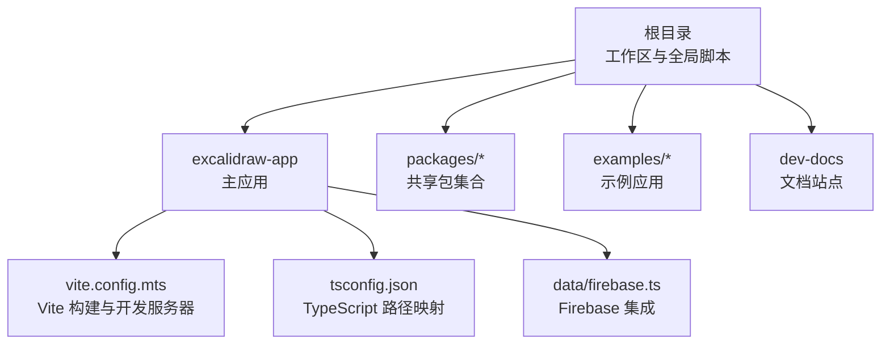
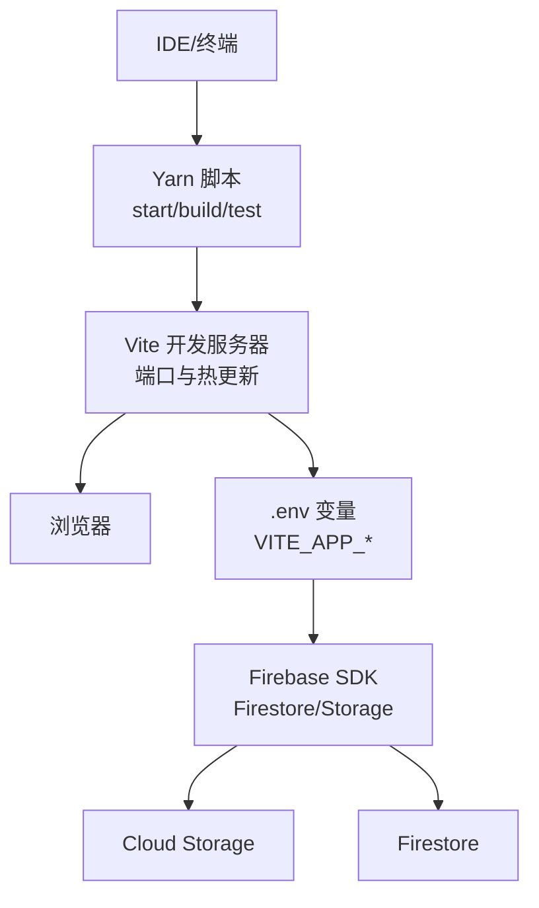
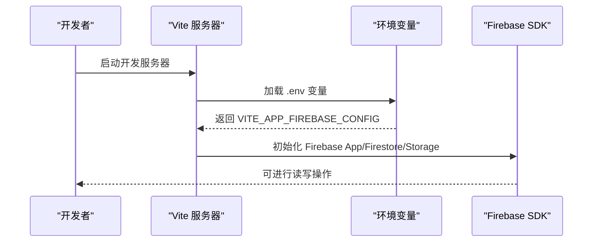
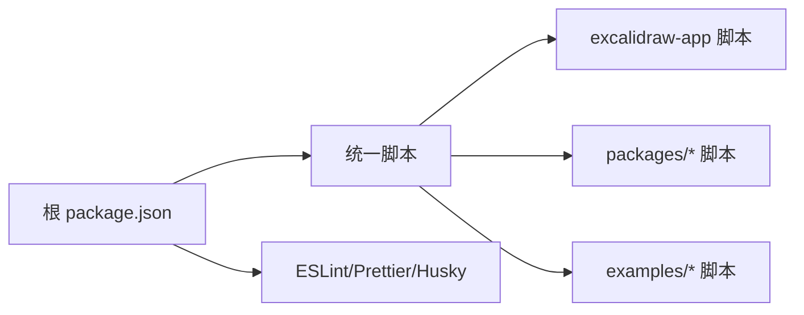

# 开发环境搭建

<cite>
**本文档引用的文件**
- [package.json](file://package.json)
- [excalidraw-app/package.json](file://excalidraw-app/package.json)
- [tsconfig.json](file://tsconfig.json)
- [excalidraw-app/vite.config.mts](file://excalidraw-app/vite.config.mts)
- [.eslintrc.json](file://.eslintrc.json)
- [.editorconfig](file://.editorconfig)
- [.husky/_.husky.sh](file://.husky/_.husky.sh)
- [excalidraw-app/data/firebase.ts](file://excalidraw-app/data/firebase.ts)
- [dev-docs/docusaurus.config.js](file://dev-docs/docusaurus.config.js)
- [dev-docs/package.json](file://dev-docs/package.json)
</cite>

## 目录
1. [简介](#简介)
2. [项目结构](#项目结构)
3. [核心组件](#核心组件)
4. [架构总览](#架构总览)
5. [详细组件分析](#详细组件分析)
6. [依赖关系分析](#依赖关系分析)
7. [性能考虑](#性能考虑)
8. [故障排除指南](#故障排除指南)
9. [结论](#结论)
10. [附录](#附录)

## 简介
本指南面向首次参与 Excalidraw 开发的贡献者与集成开发者，提供从零到一的开发环境搭建步骤。内容覆盖 Node.js 版本要求、Yarn 包管理器配置、依赖安装、TypeScript 与 Vite 的配置要点、开发服务器启动流程、IDE 推荐配置（VS Code 扩展、ESLint、Prettier），以及环境变量、Firebase 开发配置与本地数据库连接等实践建议。同时包含常见问题排查与解决方案，帮助快速定位并解决端口冲突、依赖版本不兼容等问题。

## 项目结构
该仓库采用多包工作区（monorepo）结构，根目录通过 Yarn 工作区管理多个子包与示例应用。核心模块包括：
- 根级 package.json：定义工作区、脚本与全局依赖
- excalidraw-app：主应用，包含 Vite 配置、TypeScript 路径映射、Firebase 集成
- packages/*：共享包（common、element、excalidraw、math、utils 等）
- examples/*：示例应用（Next.js、浏览器脚本）
- dev-docs：开发者文档站点（Docusaurus）

图表来源
- [package.json:1-96](file://package.json#L1-L96)
- [excalidraw-app/vite.config.mts:1-319](file://excalidraw-app/vite.config.mts#L1-L319)
- [tsconfig.json:1-39](file://tsconfig.json#L1-L39)
- [excalidraw-app/data/firebase.ts:1-320](file://excalidraw-app/data/firebase.ts#L1-L320)

章节来源
- [package.json:1-96](file://package.json#L1-L96)
- [excalidraw-app/package.json:1-58](file://excalidraw-app/package.json#L1-L58)

## 核心组件
- Node.js 与包管理器
  - Node.js 版本要求：根目录与各子包均声明 Node >= 18.0.0，建议使用 LTS 版本以获得稳定支持与长期维护。
  - 包管理器：项目指定使用 Yarn v1.22.22（packageManager 字段），请确保本地安装对应版本。
- TypeScript
  - 全局 tsconfig.json 定义严格模式、ESNext 目标、React JSX 支持与路径别名映射，覆盖 packages 与 excalidraw-app。
  - 各子包通过相对路径与别名实现模块化导入，便于跨包复用。
- Vite
  - 主应用使用 Vite 作为构建工具与开发服务器，支持热更新、插件生态与 PWA。
  - 通过环境变量加载与路径别名，实现开发态与生产态的灵活配置。
- Firebase
  - 应用通过 VITE_APP_FIREBASE_CONFIG 注入 Firebase 配置，实现 Firestore 与 Cloud Storage 的读写与加密存储。
- 文档站点
  - dev-docs 使用 Docusaurus，提供文档浏览与搜索能力；可通过脚本在 3003 端口启动。

章节来源
- [package.json:46-48](file://package.json#L46-L48)
- [excalidraw-app/package.json:25-27](file://excalidraw-app/package.json#L25-L27)
- [tsconfig.json:1-39](file://tsconfig.json#L1-L39)
- [excalidraw-app/vite.config.mts:1-319](file://excalidraw-app/vite.config.mts#L1-L319)
- [excalidraw-app/data/firebase.ts:44-54](file://excalidraw-app/data/firebase.ts#L44-L54)
- [dev-docs/docusaurus.config.js:7](file://dev-docs/docusaurus.config.js#L7)
- [dev-docs/package.json:7](file://dev-docs/package.json#L7)

## 架构总览
下图展示开发环境的关键交互：IDE/终端 -> Yarn 脚本 -> Vite 开发服务器 -> 浏览器；同时 Firebase 配置由环境变量注入，用于 Firestore 与 Storage 的读写。

图表来源
- [excalidraw-app/vite.config.mts:11-23](file://excalidraw-app/vite.config.mts#L11-L23)
- [excalidraw-app/data/firebase.ts:44-54](file://excalidraw-app/data/firebase.ts#L44-L54)

## 详细组件分析

### Node.js 与包管理器
- 版本要求
  - 根目录 engines 指定 Node >= 18.0.0；excalidraw-app 亦声明相同要求。
  - 建议使用 Node LTS 版本，以获得更稳定的依赖解析与构建体验。
- 包管理器
  - package.json 指定 packageManager: yarn@1.22.22，请确保本地安装对应版本。
  - 使用 Yarn v1（classic）以保持与 lockfile 与脚本的兼容性。

章节来源
- [package.json:46-48](file://package.json#L46-L48)
- [excalidraw-app/package.json:25-27](file://excalidraw-app/package.json#L25-L27)

### TypeScript 配置
- 编译选项
  - 目标与模块：ESNext，模块解析 node，严格模式开启。
  - JSX：使用 react-jsx，配合 React 19。
  - 路径映射：通过 baseUrl 与 paths 将 @excalidraw/* 映射到各包源码入口。
- 覆盖范围
  - tsconfig.json include 覆盖 packages 与 excalidraw-app，排除 examples、dist、types、tests 等目录。

章节来源
- [tsconfig.json:1-39](file://tsconfig.json#L1-L39)

### Vite 构建与开发服务器
- 开发服务器
  - 端口：默认 3000，可通过 VITE_APP_PORT 环境变量覆盖。
  - 自动打开浏览器：open: true。
  - 环境变量目录：envDir 指向父目录，使 .env 文件位于根目录。
- 插件生态
  - React、SVGR、EJS、PWA、Checker、Sitemap、HTML 插件等。
  - Checker 可按环境变量开关 ESLint 检查与错误覆盖层显示。
- 构建产物
  - 输出目录 build，Rollup 手动分包策略优化缓存与首屏加载。
  - 字体资源单独命名与缓存策略，提升离线可用性。

章节来源
- [excalidraw-app/vite.config.mts:11-23](file://excalidraw-app/vite.config.mts#L11-L23)
- [excalidraw-app/vite.config.mts:127-315](file://excalidraw-app/vite.config.mts#L127-L315)

### IDE 配置（VS Code）
- 推荐扩展
  - ESLint：与项目规则联动，实时提示。
  - Prettier：统一格式化风格。
  - EditorConfig：遵循项目缩进与换行规范。
  - TypeScript Importer：辅助类型导入排序与修复。
- 规则与格式化
  - .editorconfig 统一缩进、换行与尾随空白处理。
  - .eslintrc.json 使用 @excalidraw/eslint-config 与 react-app 预设，结合 import/order 与类型导入偏好。

章节来源
- [.editorconfig:1-13](file://.editorconfig#L1-L13)
- [.eslintrc.json:1-65](file://.eslintrc.json#L1-L65)

### 环境变量与 Firebase 配置
- 环境变量加载
  - Vite 通过 loadEnv(mode, envDir) 加载 .env 文件，键前缀为 VITE_APP_。
  - 常用变量：VITE_APP_PORT（开发端口）、VITE_APP_FIREBASE_CONFIG（Firebase 配置）、VITE_APP_ENABLE_ESLINT、VITE_APP_COLLAPSE_OVERLAY、VITE_APP_ENABLE_PWA。
- Firebase 配置注入
  - 通过 import.meta.env.VITE_APP_FIREBASE_CONFIG 注入 JSON 配置，初始化 Firebase App、Firestore 与 Storage。
  - 提供保存/加载场景数据与文件的封装函数，支持加密与解密。

图表来源
- [excalidraw-app/vite.config.mts:11-23](file://excalidraw-app/vite.config.mts#L11-L23)
- [excalidraw-app/data/firebase.ts:44-54](file://excalidraw-app/data/firebase.ts#L44-L54)

章节来源
- [excalidraw-app/vite.config.mts:11-23](file://excalidraw-app/vite.config.mts#L11-L23)
- [excalidraw-app/data/firebase.ts:44-54](file://excalidraw-app/data/firebase.ts#L44-L54)

### 本地数据库与文件存储
- Firestore
  - 通过 getFirestore 初始化客户端，使用事务读写 scenes 集合，实现安全并发。
- Cloud Storage
  - 通过 getStorage 上传二进制文件，支持缓存控制与媒体下载。
- 本地开发建议
  - 在本地运行时，可使用 Firebase Emulator Suite 进行离线开发与测试，减少对线上服务的依赖。
  - 将 Firebase 配置放入 .env.local 并确保被 Vite 正确加载。

章节来源
- [excalidraw-app/data/firebase.ts:67-79](file://excalidraw-app/data/firebase.ts#L67-L79)
- [excalidraw-app/data/firebase.ts:145-172](file://excalidraw-app/data/firebase.ts#L145-L172)
- [excalidraw-app/data/firebase.ts:249-272](file://excalidraw-app/data/firebase.ts#L249-L272)

### 文档站点（dev-docs）
- 启动与端口
  - Docusaurus 脚本提供 start:3003，便于与主应用区分端口。
- 环境变量
  - 通过 docusaurus2-dotenv 插件启用系统变量，IS_PREACT=false 以避免预设差异。
- 类型检查
  - 提供 typecheck 脚本，使用 TypeScript 进行类型校验。

章节来源
- [dev-docs/package.json:5-16](file://dev-docs/package.json#L5-L16)
- [dev-docs/docusaurus.config.js:7](file://dev-docs/docusaurus.config.js#L7)

## 依赖关系分析
- 工作区与脚本
  - 根 package.json 定义 workspaces 与统一脚本，如 start、build、test、fix 等。
  - 子包通过 yarn --cwd 指令调用各自脚本，保证隔离与一致性。
- 依赖版本约束
  - 根与子包均声明 Node >= 18，TypeScript 与 Vite 版本固定，建议保持一致以避免构建差异。
- ESLint 与 Prettier
  - 使用 @excalidraw/eslint-config 与 @excalidraw/prettier-config，确保团队风格一致。
  - .lintstagedrc.js 与 husky 预提交钩子配合，自动格式化与静态检查。

图表来源
- [package.json:50-91](file://package.json#L50-L91)
- [.husky/_.husky.sh:1-32](file://.husky/_.husky.sh#L1-L32)

章节来源
- [package.json:50-91](file://package.json#L50-L91)
- [.husky/_.husky.sh:1-32](file://.husky/_.husky.sh#L1-L32)

## 性能考虑
- Vite 与 Rollup
  - 通过手动分包策略将 locales、CodeMirrorEditor 等拆分为独立 chunk，提升缓存命中率与懒加载效率。
  - 字体资源单独命名与缓存策略，减少重复下载。
- PWA 与缓存
  - PWA 插件配置多种缓存策略（CacheFirst、StaleWhileRevalidate），针对字体、语言包与动态 chunk 进行差异化缓存。
- TypeScript 严格模式
  - 严格类型检查有助于早期发现潜在性能与兼容性问题。

章节来源
- [excalidraw-app/vite.config.mts:103-122](file://excalidraw-app/vite.config.mts#L103-L122)
- [excalidraw-app/vite.config.mts:170-220](file://excalidraw-app/vite.config.mts#L170-L220)

## 故障排除指南
- 端口冲突
  - 症状：开发服务器无法启动或报端口占用。
  - 处理：修改 .env 中 VITE_APP_PORT 或关闭占用端口的进程；确认文档站点未与主应用共用端口。
- 依赖版本不兼容
  - 症状：安装后构建失败或运行时报错。
  - 处理：确保 Node 版本满足 >= 18；使用指定的 Yarn v1.22.22；执行 clean-install 清理 node_modules 后重新安装。
- Firebase 配置无效
  - 症状：Firebase 初始化失败或读写异常。
  - 处理：检查 VITE_APP_FIREBASE_CONFIG 是否为有效 JSON；确认已正确放置于 .env；如需离线开发，使用 Firebase Emulator Suite。
- ESLint/格式化冲突
  - 症状：编辑器频繁提示或提交失败。
  - 处理：执行 yarn fix:code 与 yarn fix:other；检查 .eslintrc.json 与 Prettier 配置是否生效；确认 VS Code 扩展已启用。
- PWA/缓存问题
  - 症状：页面更新后缓存未刷新。
  - 处理：清理浏览器缓存或禁用 PWA 缓存；检查 PWA 配置中的缓存策略与最大文件大小限制。

章节来源
- [excalidraw-app/vite.config.mts:11-23](file://excalidraw-app/vite.config.mts#L11-L23)
- [package.json:90-91](file://package.json#L90-L91)
- [excalidraw-app/data/firebase.ts:44-54](file://excalidraw-app/data/firebase.ts#L44-L54)
- [.eslintrc.json:1-65](file://.eslintrc.json#L1-L65)

## 结论
通过遵循本指南，您可以快速完成 Excalidraw 开发环境的搭建与配置。建议始终使用 Node LTS 与指定版本的 Yarn，严格遵守 TypeScript 与 ESLint/Prettier 规范，并通过环境变量与 Firebase 配置实现可移植的开发体验。遇到问题时，优先检查端口、依赖版本与 Firebase 配置，结合本指南的排障步骤逐一验证。

## 附录
- 快速开始清单
  - 安装 Node.js（>= 18，建议 LTS）
  - 安装 Yarn v1.22.22
  - 在根目录执行依赖安装与初始化
  - 创建 .env 并配置 VITE_APP_PORT 与 VITE_APP_FIREBASE_CONFIG
  - 运行 yarn start 启动开发服务器
  - 如需文档站点，使用 dev-docs 的脚本在 3003 端口启动