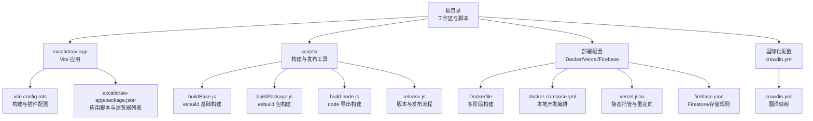
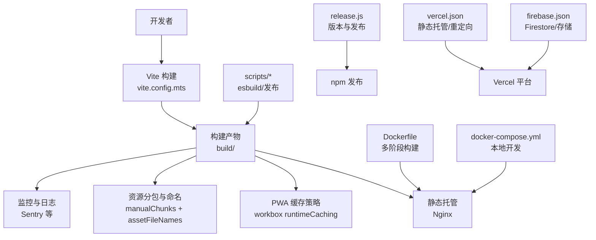
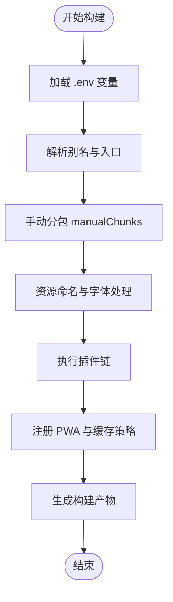
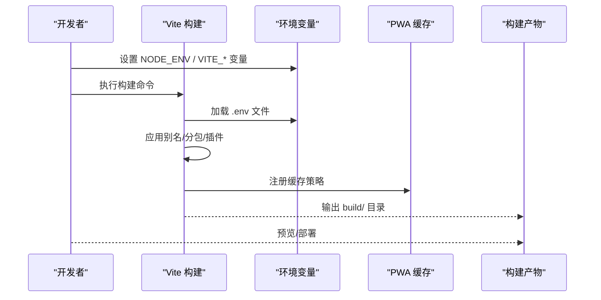
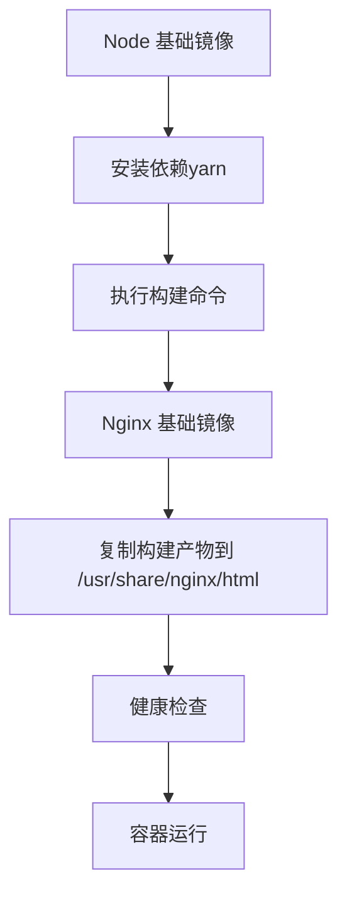
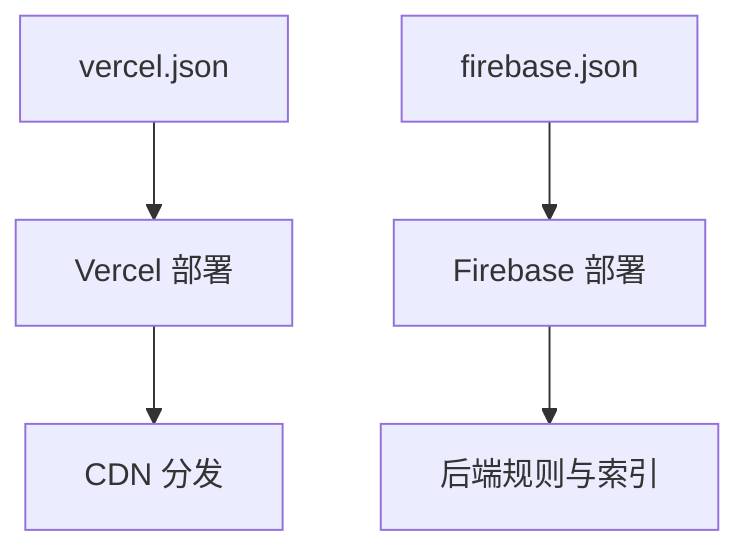
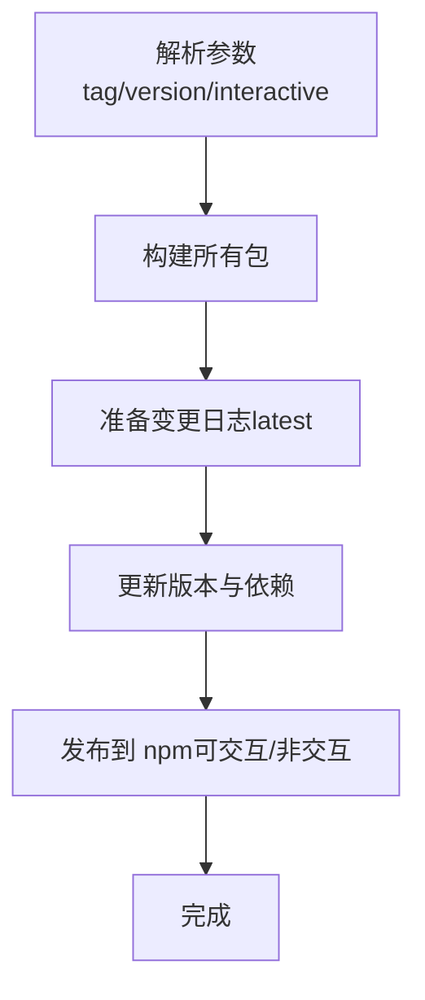
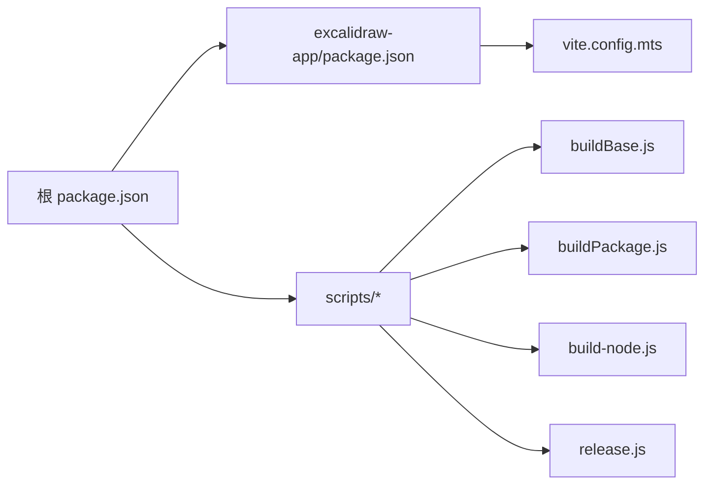

# 构建与部署

<cite>
**本文引用的文件**
- [package.json](file://package.json)
- [excalidraw-app/vite.config.mts](file://excalidraw-app/vite.config.mts)
- [excalidraw-app/package.json](file://excalidraw-app/package.json)
- [Dockerfile](file://Dockerfile)
- [docker-compose.yml](file://docker-compose.yml)
- [vercel.json](file://vercel.json)
- [firebase-project/firebase.json](file://firebase-project/firebase.json)
- [scripts/buildBase.js](file://scripts/buildBase.js)
- [scripts/buildPackage.js](file://scripts/buildPackage.js)
- [scripts/build-node.js](file://scripts/build-node.js)
- [scripts/release.js](file://scripts/release.js)
- [crowdin.yml](file://crowdin.yml)
</cite>

## 目录

1. [简介](#简介)
2. [项目结构](#项目结构)
3. [核心组件](#核心组件)
4. [架构总览](#架构总览)
5. [详细组件分析](#详细组件分析)
6. [依赖关系分析](#依赖关系分析)
7. [性能考量](#性能考量)
8. [故障排查指南](#故障排查指南)
9. [结论](#结论)
10. [附录](#附录)

## 简介

本指南面向 Excalidraw 的构建与部署流程，覆盖 Vite 构建配置、打包优化策略、产物分析方法、多环境构建（开发/测试/生产）、容器化与云平台部署、Firebase 静态托管与 CDN 配置、版本管理与发布回滚策略、以及 CI/CD 流水线与自动化测试建议。内容基于仓库中现有配置文件进行系统性梳理与可视化呈现，帮助开发者在不同环境下稳定、高效地交付应用。

## 项目结构

该仓库采用多包工作区（monorepo）组织方式，核心前端应用位于 excalidraw-app，构建与发布脚本集中在根目录 scripts 中，部署相关配置分布在根目录与示例工程中。关键目录与职责如下：

- 根 package.json：定义工作区、全局依赖与统一脚本命令
- excalidraw-app：Vite 前端应用，包含构建配置与运行脚本
- scripts：构建与发布工具链（esbuild、版本生成、发布流程）
- 部署配置：Dockerfile、docker-compose.yml、vercel.json、firebase.json
- 国际化：crowdin.yml 指定翻译源与目标

图表来源

- [package.json:1-96](file://package.json#L1-L96)
- [excalidraw-app/vite.config.mts:1-319](file://excalidraw-app/vite.config.mts#L1-L319)
- [excalidraw-app/package.json:1-58](file://excalidraw-app/package.json#L1-L58)
- [scripts/buildBase.js:1-55](file://scripts/buildBase.js#L1-L55)
- [scripts/buildPackage.js:1-130](file://scripts/buildPackage.js#L1-L130)
- [scripts/build-node.js:1-41](file://scripts/build-node.js#L1-L41)
- [scripts/release.js:1-246](file://scripts/release.js#L1-L246)
- [Dockerfile:1-21](file://Dockerfile#L1-L21)
- [docker-compose.yml:1-24](file://docker-compose.yml#L1-L24)
- [vercel.json:1-71](file://vercel.json#L1-L71)
- [firebase-project/firebase.json:1-10](file://firebase-project/firebase.json#L1-L10)
- [crowdin.yml:1-4](file://crowdin.yml#L1-L4)

章节来源

- [package.json:1-96](file://package.json#L1-L96)
- [excalidraw-app/vite.config.mts:1-319](file://excalidraw-app/vite.config.mts#L1-L319)
- [excalidraw-app/package.json:1-58](file://excalidraw-app/package.json#L1-L58)
- [scripts/buildBase.js:1-55](file://scripts/buildBase.js#L1-L55)
- [scripts/buildPackage.js:1-130](file://scripts/buildPackage.js#L1-L130)
- [scripts/build-node.js:1-41](file://scripts/build-node.js#L1-L41)
- [scripts/release.js:1-246](file://scripts/release.js#L1-L246)
- [Dockerfile:1-21](file://Dockerfile#L1-L21)
- [docker-compose.yml:1-24](file://docker-compose.yml#L1-L24)
- [vercel.json:1-71](file://vercel.json#L1-L71)
- [firebase-project/firebase.json:1-10](file://firebase-project/firebase.json#L1-L10)
- [crowdin.yml:1-4](file://crowdin.yml#L1-L4)

## 核心组件

- Vite 构建配置与插件体系：集中于 vite.config.mts，涵盖别名解析、分包策略、PWA 缓存、Sitemap、SVG 转组件等
- 应用脚本与浏览器兼容：excalidraw-app/package.json 提供构建、预览、服务启动脚本与 browserslist
- 多阶段构建与发布：scripts 下的 esbuild 脚本负责基础与包构建；release.js 实现版本号生成、依赖同步与发布
- 容器化与本地编排：Dockerfile 多阶段构建 + Nginx 提供静态托管；docker-compose 支持本地开发联调
- 云平台部署：vercel.json 配置静态输出目录、安全头、重定向与安装命令；firebase.json 指定 Firestore/存储规则
- 国际化：crowdin.yml 映射英文源与各语言翻译文件

章节来源

- [excalidraw-app/vite.config.mts:1-319](file://excalidraw-app/vite.config.mts#L1-L319)
- [excalidraw-app/package.json:1-58](file://excalidraw-app/package.json#L1-L58)
- [scripts/buildBase.js:1-55](file://scripts/buildBase.js#L1-L55)
- [scripts/buildPackage.js:1-130](file://scripts/buildPackage.js#L1-L130)
- [scripts/release.js:1-246](file://scripts/release.js#L1-L246)
- [Dockerfile:1-21](file://Dockerfile#L1-L21)
- [docker-compose.yml:1-24](file://docker-compose.yml#L1-L24)
- [vercel.json:1-71](file://vercel.json#L1-L71)
- [firebase-project/firebase.json:1-10](file://firebase-project/firebase.json#L1-L10)
- [crowdin.yml:1-4](file://crowdin.yml#L1-L4)

## 架构总览

下图展示从代码到产物再到部署的关键路径，包括 Vite 构建、esbuild 辅助构建、容器化与云平台部署。

图表来源

- [excalidraw-app/vite.config.mts:87-126](file://excalidraw-app/vite.config.mts#L87-L126)
- [excalidraw-app/vite.config.mts:150-220](file://excalidraw-app/vite.config.mts#L150-L220)
- [scripts/buildPackage.js:59-86](file://scripts/buildPackage.js#L59-L86)
- [scripts/release.js:214-225](file://scripts/release.js#L214-L225)
- [Dockerfile:1-21](file://Dockerfile#L1-L21)
- [docker-compose.yml:1-24](file://docker-compose.yml#L1-L24)
- [vercel.json:68-70](file://vercel.json#L68-L70)
- [firebase-project/firebase.json:1-10](file://firebase-project/firebase.json#L1-L10)

## 详细组件分析

### Vite 构建配置与优化策略

- 别名与解析：通过 alias 将 @excalidraw/\* 映射到 packages 子包源码，提升开发体验与类型推断
- 分包与缓存：manualChunks 将 locales、CodeMirror/Lezer、Mermaid-to-Excalidraw 等拆分为独立 chunk，便于按需加载与缓存；assetFileNames 对 woff2 字体进行专门命名，利于 CDN 缓存
- Source Map：开启 sourcemap 以支持调试与错误追踪
- 插件生态：React、SVGR、EJS、HTML 压缩、PWA、Sitemap、类型检查等插件协同工作
- PWA 缓存策略：workbox runtimeCaching 针对字体、locales、chunk 等设置 CacheFirst/StaleWhileRevalidate，控制过期时间与缓存条目上限
- Sitemap：自动生成站点地图，改善 SEO

图表来源

- [excalidraw-app/vite.config.mts:11-319](file://excalidraw-app/vite.config.mts#L11-L319)
- [excalidraw-app/vite.config.mts:87-126](file://excalidraw-app/vite.config.mts#L87-L126)
- [excalidraw-app/vite.config.mts:150-220](file://excalidraw-app/vite.config.mts#L150-L220)

章节来源

- [excalidraw-app/vite.config.mts:1-319](file://excalidraw-app/vite.config.mts#L1-L319)

### 多环境构建流程（开发/测试/生产）

- 开发环境：本地启动时通过 Vite server 提供热更新与自动打开浏览器；可启用 ESLint 检查与 PWA 开发模式
- 测试环境：可通过环境变量控制功能开关（如 PWA、ESLint 覆盖），并使用预览模式验证构建结果
- 生产环境：构建时注入 Git SHA 与跟踪开关，产物输出至 build/，配合 PWA 缓存与静态托管

图表来源

- [excalidraw-app/vite.config.mts:11-319](file://excalidraw-app/vite.config.mts#L11-L319)
- [excalidraw-app/package.json:43-52](file://excalidraw-app/package.json#L43-L52)

章节来源

- [excalidraw-app/vite.config.mts:11-319](file://excalidraw-app/vite.config.mts#L11-L319)
- [excalidraw-app/package.json:43-52](file://excalidraw-app/package.json#L43-L52)

### Docker 容器化部署

- 多阶段构建：第一阶段使用 Node 安装依赖并执行构建；第二阶段基于 Nginx 镜像，复制构建产物至 /usr/share/nginx/html
- 健康检查：通过健康检查确保容器可用
- 本地开发：docker-compose 将宿主机代码挂载到容器，结合 Nginx 提供本地预览

图表来源

- [Dockerfile:1-21](file://Dockerfile#L1-L21)
- [docker-compose.yml:1-24](file://docker-compose.yml#L1-L24)

章节来源

- [Dockerfile:1-21](file://Dockerfile#L1-L21)
- [docker-compose.yml:1-24](file://docker-compose.yml#L1-L24)

### Kubernetes 部署策略（通用指导）

- Pod 与 Deployment：使用 Nginx 镜像承载静态资源，暴露 80 端口
- Service：ClusterIP 或 LoadBalancer，根据集群网络策略选择
- ConfigMap/Secret：通过环境变量或挂载卷注入运行时配置
- Ingress：配置域名与 TLS，实现外部访问
- HPA/资源限制：根据流量与资源占用设置副本数与资源配额
- 健康检查：使用 HTTP GET / 作为存活/就绪探针

（本节为通用实践说明，不直接对应具体源文件）

### 云平台部署（Vercel 与 Firebase）

- Vercel 静态托管：通过 vercel.json 指定输出目录、安全头、重定向与安装命令；支持字体与特定资源的长缓存策略
- Firebase：通过 firebase.json 指定 Firestore 规则与索引、存储规则，用于后端数据治理

图表来源

- [vercel.json:1-71](file://vercel.json#L1-L71)
- [firebase-project/firebase.json:1-10](file://firebase-project/firebase.json#L1-L10)

章节来源

- [vercel.json:1-71](file://vercel.json#L1-L71)
- [firebase-project/firebase.json:1-10](file://firebase-project/firebase.json#L1-L10)

### 版本管理、发布与回滚策略

- 版本生成：release.js 读取当前提交哈希，生成带哈希的版本号；支持 latest/next/test 标签
- 依赖同步：统一更新多个包的版本与相互依赖版本
- 发布流程：可交互或非交互模式，最终调用 npm publish
- 回滚策略：基于标签与版本号，可快速回退到上一稳定版本；建议保留最近 N 个版本镜像与构建产物

图表来源

- [scripts/release.js:31-95](file://scripts/release.js#L31-L95)
- [scripts/release.js:174-188](file://scripts/release.js#L174-L188)
- [scripts/release.js:214-225](file://scripts/release.js#L214-L225)

章节来源

- [scripts/release.js:1-246](file://scripts/release.js#L1-L246)

### CI/CD 配置与自动化测试（建议）

- 构建与测试：在 CI 中复用根 package.json 的测试与构建脚本，确保类型检查、代码规范与单元测试通过
- 构建产物校验：在 CI 中执行构建并生成报告，确保产物完整性
- 部署流水线：根据目标平台（Vercel/Docker/Firebase）配置相应步骤，结合环境变量与密钥管理
- 自动化测试：结合 Vitest 与 E2E 测试框架，在 PR 中触发测试与构建

（本节为通用实践说明，不直接对应具体源文件）

### 性能优化与缓存策略

- 代码分割：利用 manualChunks 将大体积依赖拆分，减少首屏体积
- 资源命名：woff2 字体与静态资源采用稳定命名，提升 CDN 缓存命中率
- PWA 缓存：针对字体、locales、chunk 使用 CacheFirst/StaleWhileRevalidate，延长缓存周期
- Source Map：生产环境可按需关闭以减小体积，同时保留必要的调试信息
- 浏览器兼容：通过 browserslist 控制目标范围，避免不必要的 polyfill

章节来源

- [excalidraw-app/vite.config.mts:87-126](file://excalidraw-app/vite.config.mts#L87-L126)
- [excalidraw-app/vite.config.mts:150-220](file://excalidraw-app/vite.config.mts#L150-L220)
- [excalidraw-app/package.json:6-24](file://excalidraw-app/package.json#L6-L24)

### 监控与日志（建议）

- 错误上报：集成 Sentry 等前端错误监控，收集异常堆栈与上下文
- 性能指标：记录首屏时间、TTFB、缓存命中率等关键指标
- 日志采集：统一日志格式与采集，结合可观测性平台进行聚合分析

（本节为通用实践说明，不直接对应具体源文件）

## 依赖关系分析

- 工作区与脚本：根 package.json 统一管理工作区与脚本，调用 excalidraw-app 内部脚本
- 构建链路：Vite 为主导，scripts 中的 esbuild 脚本用于特定场景（如包构建与 Node 导出）
- 发布链路：release.js 串联构建、版本更新与发布

图表来源

- [package.json:1-96](file://package.json#L1-L96)
- [excalidraw-app/package.json:1-58](file://excalidraw-app/package.json#L1-L58)
- [scripts/buildBase.js:1-55](file://scripts/buildBase.js#L1-L55)
- [scripts/buildPackage.js:1-130](file://scripts/buildPackage.js#L1-L130)
- [scripts/build-node.js:1-41](file://scripts/build-node.js#L1-L41)
- [scripts/release.js:1-246](file://scripts/release.js#L1-L246)
- [excalidraw-app/vite.config.mts:1-319](file://excalidraw-app/vite.config.mts#L1-L319)

章节来源

- [package.json:1-96](file://package.json#L1-L96)
- [excalidraw-app/package.json:1-58](file://excalidraw-app/package.json#L1-L58)
- [scripts/buildBase.js:1-55](file://scripts/buildBase.js#L1-L55)
- [scripts/buildPackage.js:1-130](file://scripts/buildPackage.js#L1-L130)
- [scripts/build-node.js:1-41](file://scripts/build-node.js#L1-L41)
- [scripts/release.js:1-246](file://scripts/release.js#L1-L246)
- [excalidraw-app/vite.config.mts:1-319](file://excalidraw-app/vite.config.mts#L1-L319)

## 性能考量

- 分包与懒加载：合理拆分 chunk，避免单体 bundle 过大
- 资源内联策略：根据资源大小与使用频率调整内联阈值
- 缓存策略：针对字体、locales、chunk 设置不同缓存策略与过期时间
- Source Map：生产环境谨慎启用，平衡调试需求与体积
- 浏览器兼容：缩小目标范围，减少转译与 polyfill

（本节为通用指导，已在“性能优化与缓存策略”章节给出具体配置参考）

## 故障排查指南

- 构建失败
  - 检查 Node 版本是否满足 engines 要求
  - 确认工作区安装状态与锁文件一致性
  - 查看 Vite 插件报错与别名解析问题
- PWA 缓存异常
  - 核对 workbox globIgnores 与 runtimeCaching 条目
  - 清理浏览器缓存或使用无痕模式验证
- 静态托管问题
  - 确认 vercel.json 输出目录与安装命令正确
  - 检查重定向与安全头配置
- 容器化问题
  - 确认构建产物已复制到 Nginx 目录
  - 查看健康检查与端口映射
- 发布问题
  - 检查 npm 发布权限与标签
  - 确认版本号与依赖同步逻辑

章节来源

- [excalidraw-app/package.json:25-27](file://excalidraw-app/package.json#L25-L27)
- [excalidraw-app/vite.config.mts:150-220](file://excalidraw-app/vite.config.mts#L150-L220)
- [vercel.json:68-70](file://vercel.json#L68-L70)
- [Dockerfile:16-21](file://Dockerfile#L16-L21)
- [scripts/release.js:214-225](file://scripts/release.js#L214-L225)

## 结论

本指南基于仓库现有配置，系统梳理了 Vite 构建、分包与缓存策略、容器化与云平台部署、版本管理与发布流程。建议在实际落地时结合团队规范补充 CI/CD 与监控方案，并持续评估性能与用户体验。

## 附录

- 国际化：通过 crowdin.yml 指定翻译源与目标路径，确保多语言资源同步
- 示例工程：examples 下包含 Next.js 与浏览器脚本示例，可参考其 Vite 配置与部署方式

章节来源

- [crowdin.yml:1-4](file://crowdin.yml#L1-L4)
