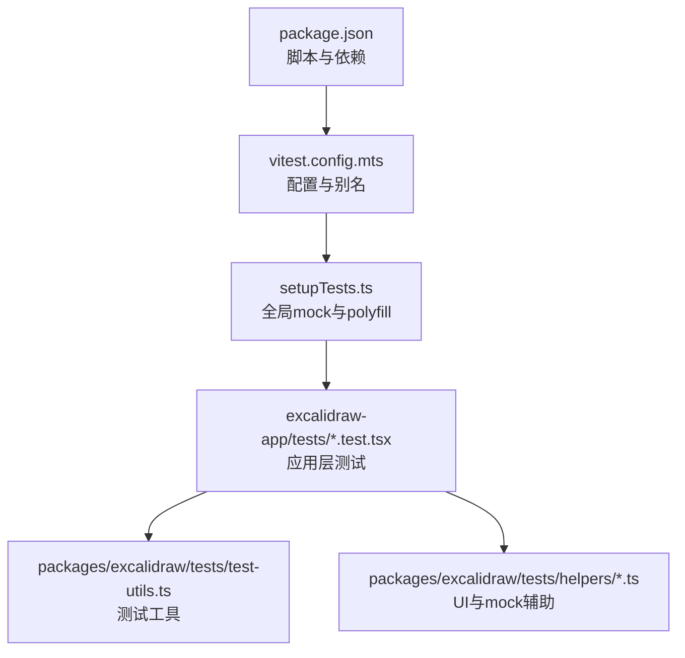
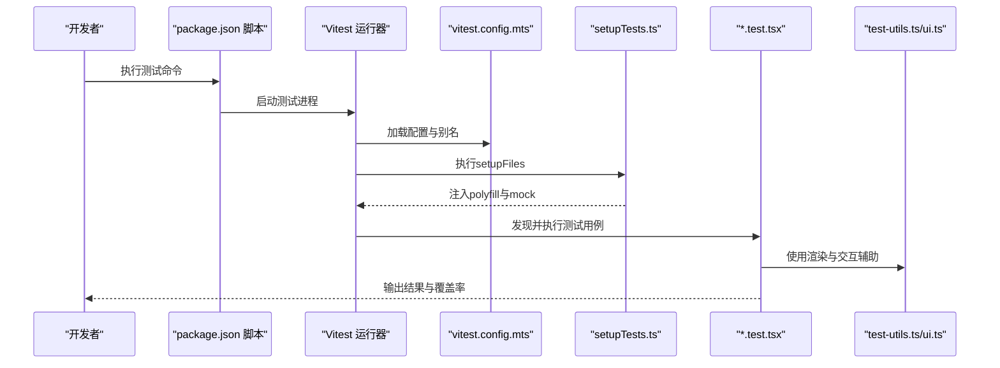
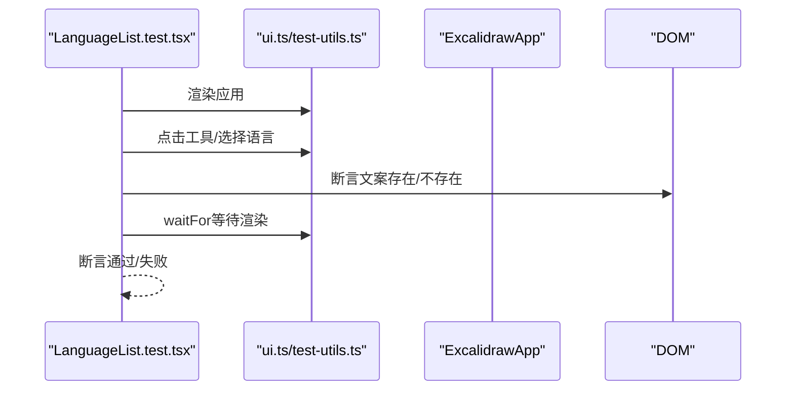
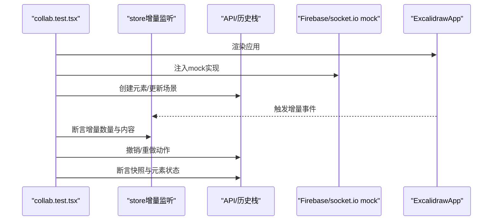
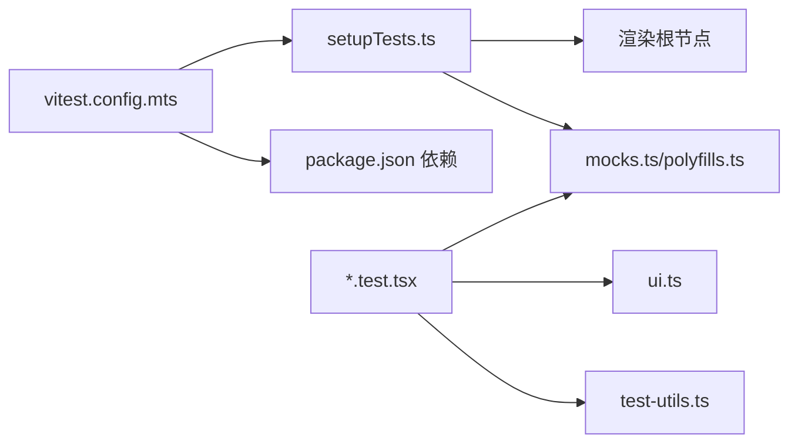

# 测试策略与实践

<cite>
**本文引用的文件**
- [vitest.config.mts](file://vitest.config.mts)
- [setupTests.ts](file://setupTests.ts)
- [package.json](file://package.json)
- [LanguageList.test.tsx](file://excalidraw-app/tests/LanguageList.test.tsx)
- [MobileMenu.test.tsx](file://excalidraw-app/tests/MobileMenu.test.tsx)
- [collab.test.tsx](file://excalidraw-app/tests/collab.test.tsx)
- [test-utils.ts](file://packages/excalidraw/tests/test-utils.ts)
- [ui.ts](file://packages/excalidraw/tests/helpers/ui.ts)
- [mocks.ts](file://packages/excalidraw/tests/helpers/mocks.ts)
- [polyfills.ts](file://packages/excalidraw/tests/helpers/polyfills.ts)
</cite>

## 目录

1. [引言](#引言)
2. [项目结构](#项目结构)
3. [核心组件](#核心组件)
4. [架构总览](#架构总览)
5. [详细组件分析](#详细组件分析)
6. [依赖关系分析](#依赖关系分析)
7. [性能考量](#性能考量)
8. [故障排查指南](#故障排查指南)
9. [结论](#结论)
10. [附录](#附录)

## 引言

本指南面向 Excalidraw 项目的测试体系，系统阐述基于 Vitest 的测试策略与实践，覆盖配置与环境、模拟数据准备、单元测试（组件、Hook、工具函数）、集成测试、端到端测试、覆盖率要求、最佳实践、运行与报告、调试方法，以及性能测试、内存泄漏检测与浏览器兼容性测试建议。内容以仓库现有配置与测试文件为依据，确保可操作与可落地。

## 项目结构

- 测试运行器：Vitest（版本与覆盖率插件）
- 测试环境：jsdom（DOM 与 Web API 模拟）
- 全局设置：setupTests.ts（Canvas、IndexedDB、matchMedia、字体加载、渲染根节点等）
- 别名解析：通过 vitest.config.mts 为 monorepo 包建立别名映射
- 脚本入口：package.json 中提供测试命令（全量、应用测试、覆盖率、UI）

图表来源

- [package.json:51-91](file://package.json#L51-L91)
- [vitest.config.mts:5-87](file://vitest.config.mts#L5-L87)
- [setupTests.ts:1-134](file://setupTests.ts#L1-L134)

章节来源

- [package.json:51-91](file://package.json#L51-L91)
- [vitest.config.mts:5-87](file://vitest.config.mts#L5-L87)
- [setupTests.ts:1-134](file://setupTests.ts#L1-L134)

## 核心组件

- Vitest 配置与别名
  - 通过别名将@excalidraw/\*包映射到 packages 下的源码路径，便于在测试中直接导入模块。
  - 钩子执行顺序设为并行，提升测试启动效率。
  - 启用全局模式、jsdom 环境、覆盖率报告（文本、JSON、HTML、LCOV）。
  - 覆盖率阈值：行、分支、函数、语句均设定为约 60–70%，并关闭“忽略空行”以避免统计偏差。
- 全局测试设置
  - Canvas 与字体：引入 canvas-mock 与自定义 FontFace 实现，保证绘图与字体加载逻辑可测。
  - IndexedDB：使用 fake-indexeddb/auto 自动注入，避免真实存储影响。
  - matchMedia：提供媒体查询监听能力，适配响应式 UI。
  - setPointerCapture：为指针事件兼容性做必要 mock。
  - EXCALIDRAW_ASSET_PATH：指定资源路径，支持本地字体文件读取。
  - 渲染根节点：在 DOM 中插入#root 容器，满足 React 渲染需求。
  - 控制台告警增强：对 React act()警告进行捕获与高亮，提示测试需包裹状态更新。
- 测试工具与辅助
  - test-utils：封装 render、fireEvent、waitFor 等常用方法，统一测试入口。
  - ui：提供 UI 交互辅助（如点击工具、选择语言等），简化断言。
  - mocks：集中管理 mock 行为，例如节流动画帧控制。
  - polyfills：提供测试所需 polyfill 集合，确保跨浏览器一致性。

章节来源

- [vitest.config.mts:5-87](file://vitest.config.mts#L5-L87)
- [setupTests.ts:1-134](file://setupTests.ts#L1-L134)
- [test-utils.ts](file://packages/excalidraw/tests/test-utils.ts)
- [ui.ts](file://packages/excalidraw/tests/helpers/ui.ts)
- [mocks.ts](file://packages/excalidraw/tests/helpers/mocks.ts)
- [polyfills.ts](file://packages/excalidraw/tests/helpers/polyfills.ts)

## 架构总览

下图展示从测试命令到具体测试用例的执行链路，以及全局设置与别名解析的作用范围。

图表来源

- [package.json:67-76](file://package.json#L67-L76)
- [vitest.config.mts:65-86](file://vitest.config.mts#L65-L86)
- [setupTests.ts:1-134](file://setupTests.ts#L1-L134)
- [test-utils.ts](file://packages/excalidraw/tests/test-utils.ts)
- [ui.ts](file://packages/excalidraw/tests/helpers/ui.ts)

## 详细组件分析

### 组件测试：语言切换与移动端界面

- 语言切换测试要点
  - 通过 UI 辅助选择语言，断言不同语言下界面文案变化。
  - 使用 waitFor 等待异步渲染完成，确保断言稳定。
- 移动端界面测试要点
  - 使用 mockBoundingClientRect 设置视口尺寸，验证表单因子识别与欢迎屏显示逻辑。
  - 截图快照用于回归验证，确保 UI 一致性。

图表来源

- [LanguageList.test.tsx:12-34](file://excalidraw-app/tests/LanguageList.test.tsx#L12-L34)
- [ui.ts](file://packages/excalidraw/tests/helpers/ui.ts)
- [test-utils.ts](file://packages/excalidraw/tests/test-utils.ts)

章节来源

- [LanguageList.test.tsx:12-34](file://excalidraw-app/tests/LanguageList.test.tsx#L12-L34)
- [MobileMenu.test.tsx:10-36](file://excalidraw-app/tests/MobileMenu.test.tsx#L10-L36)

### 协作场景集成测试：批量更新与撤销重做

- 场景目标
  - 验证批量远程更新时仍产生正确的临时增量与持久增量数量。
  - 在强制删除元素后仍能正确撤销/重做。
- 关键 mock
  - crypto.getRandomValues 与 subtle 接口，确保加密相关逻辑可预测。
  - Firebase 与 socket.io 客户端 mock，隔离外部依赖。
- 断言策略
  - 监听 store 增量事件，统计 durable 与 ephemeral 增量数量。
  - 使用 API 与历史栈断言，验证快照与元素状态一致性。

图表来源

- [collab.test.tsx:17-252](file://excalidraw-app/tests/collab.test.tsx#L17-L252)

章节来源

- [collab.test.tsx:17-252](file://excalidraw-app/tests/collab.test.tsx#L17-L252)

### Hook 测试与工具函数测试

- Hook 测试建议
  - 使用 renderHook 与 act 包装状态更新，确保副作用同步。
  - 对外部依赖（如网络、存储）进行 mock，保证测试确定性。
- 工具函数测试建议
  - 针对纯函数与边界条件编写用例，覆盖正常、异常与边界输入。
  - 使用快照或结构化断言验证输出稳定性。

（本小节为通用指导，不直接分析具体文件）

### 端到端测试流程

- 建议采用 Cypress 或 Playwright 进行端到端验证，覆盖用户完整工作流（登录、协作、导出等）。
- 与单元/集成测试配合，形成“自底向上”的测试金字塔。

（本小节为通用指导，不直接分析具体文件）

## 依赖关系分析

- 配置依赖
  - vitest.config.mts 依赖 jsdom 与别名映射，确保测试环境与模块解析一致。
  - setupTests.ts 依赖 polyfill 与 mock 库，提供稳定的运行时环境。
- 测试依赖
  - 应用测试依赖 test-utils 与 helpers，统一交互与断言方式。
  - 协作测试依赖 store 事件与 API，强调对外部服务的 mock 隔离。

图表来源

- [vitest.config.mts:5-87](file://vitest.config.mts#L5-L87)
- [setupTests.ts:1-134](file://setupTests.ts#L1-L134)
- [test-utils.ts](file://packages/excalidraw/tests/test-utils.ts)
- [ui.ts](file://packages/excalidraw/tests/helpers/ui.ts)
- [mocks.ts](file://packages/excalidraw/tests/helpers/mocks.ts)
- [polyfills.ts](file://packages/excalidraw/tests/helpers/polyfills.ts)

章节来源

- [vitest.config.mts:5-87](file://vitest.config.mts#L5-L87)
- [setupTests.ts:1-134](file://setupTests.ts#L1-L134)

## 性能考量

- 测试并发与启动速度
  - 钩子并行执行可减少启动时间；若存在共享状态，需谨慎避免竞态。
- 覆盖率阈值
  - 当前阈值约为 60–70%，建议结合业务关键路径逐步提升，避免为达标而写无意义用例。
- 异步与批处理
  - 对批量更新与微任务队列进行监控，确保断言在所有副作用完成后执行（参考协作测试中的增量监听）。

（本节为通用指导，不直接分析具体文件）

## 故障排查指南

- 常见问题与定位
  - React act()警告：全局设置已增强控制台输出，测试中出现该警告会高亮当前测试名称，提示需用 act 包裹状态更新。
  - DOM/Canvas 相关报错：确认 setupTests.ts 中的 polyfill 与 mock 是否生效。
  - 外部依赖不稳定：协作测试展示了如何对 Firebase 与 socket.io 进行 mock，建议在类似场景复用此策略。
- 调试建议
  - 使用 Vitest UI（脚本提供）查看测试状态与覆盖率。
  - 对复杂异步流程使用 waitFor 与增量监听，避免过早断言。
  - 截图快照用于 UI 回归，发现问题后对比差异。

章节来源

- [setupTests.ts:117-133](file://setupTests.ts#L117-L133)
- [collab.test.tsx:30-64](file://excalidraw-app/tests/collab.test.tsx#L30-L64)
- [package.json:76](file://package.json#L76)

## 结论

本项目以 Vitest 为核心，结合 jsdom 与丰富的 mock/polyfill 策略，构建了稳定且高效的前端测试体系。通过统一的测试工具与辅助模块，测试用例能够聚焦业务逻辑与交互体验。建议持续完善端到端测试与性能测试，配合覆盖率阈值与最佳实践，进一步提升质量与可维护性。

## 附录

### 测试运行与报告

- 常用命令
  - 全量测试：yarn test:all
  - 应用测试：yarn test:app
  - 更新快照：yarn test:update
  - 覆盖率：yarn test:coverage 或 yarn test:coverage:watch
  - UI 模式：yarn test:ui
- 报告格式
  - 文本、JSON、HTML、LCOV 四种格式，便于 CI 与本地查看。

章节来源

- [package.json:67-76](file://package.json#L67-L76)

### 覆盖率要求与阈值

- 报告器：text、json-summary、json、html、lcovonly
- 阈值：lines≈60、branches≈70、functions≈63、statements≈60
- 特性：关闭忽略空行，避免统计偏差

章节来源

- [vitest.config.mts:74-85](file://vitest.config.mts#L74-L85)

### 最佳实践清单

- 用例设计
  - 优先覆盖关键路径与边界条件；对 UI 与交互使用快照与结构化断言结合。
- Mock 策略
  - 尽可能隔离外部依赖；对随机性（如 crypto）进行可控 mock。
- 异步处理
  - 使用 act 包裹状态更新；使用 waitFor 等待副作用完成。
- 可观测性
  - 保留 act()告警日志；对复杂流程增加增量监听与事件断言。

章节来源

- [collab.test.tsx:17-252](file://excalidraw-app/tests/collab.test.tsx#L17-L252)
- [setupTests.ts:117-133](file://setupTests.ts#L117-L133)
