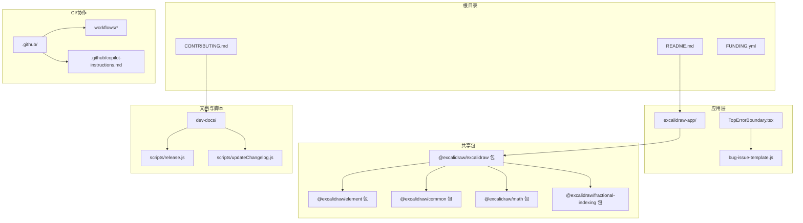
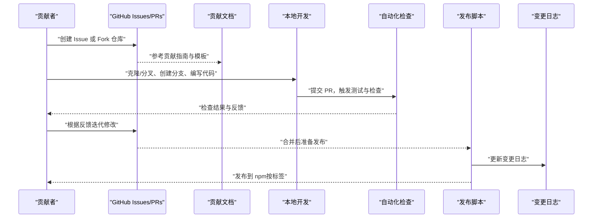
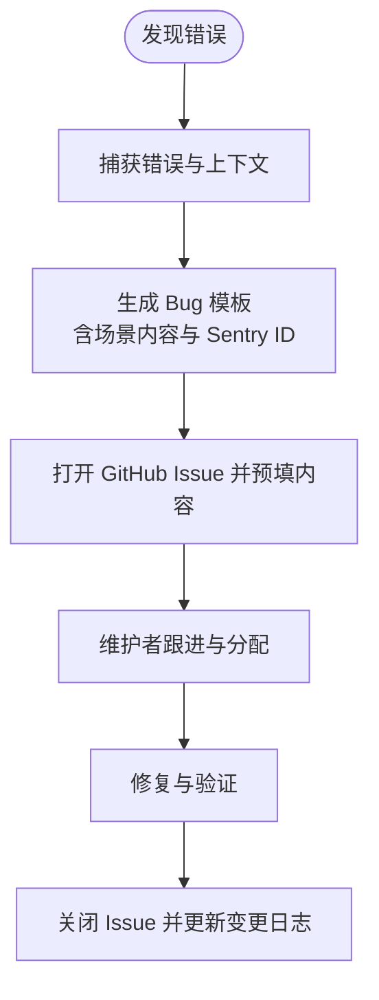
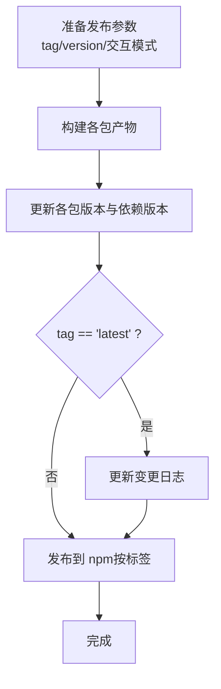
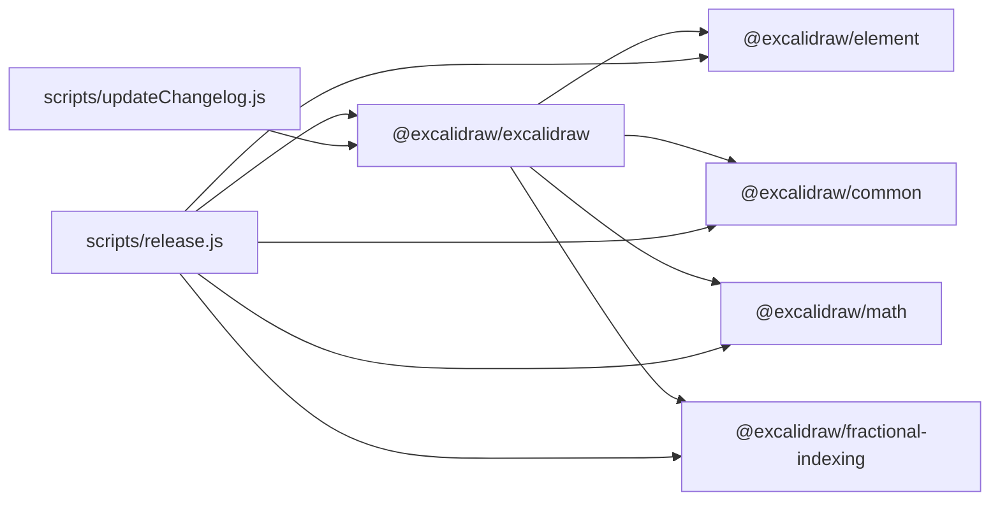

# 贡献流程

<cite>
**本文引用的文件**
- [CONTRIBUTING.md](file://CONTRIBUTING.md)
- [README.md](file://README.md)
- [.github/copilot-instructions.md](file://.github/copilot-instructions.md)
- [dev-docs/docs/introduction/contributing.mdx](file://dev-docs/docs/introduction/contributing.mdx)
- [dev-docs/docs/introduction/get-started.mdx](file://dev-docs/docs/introduction/get-started.mdx)
- [excalidraw-app/bug-issue-template.js](file://excalidraw-app/bug-issue-template.js)
- [excalidraw-app/components/TopErrorBoundary.tsx](file://excalidraw-app/components/TopErrorBoundary.tsx)
- [scripts/release.js](file://scripts/release.js)
- [scripts/updateChangelog.js](file://scripts/updateChangelog.js)
- [.github/FUNDING.yml](file://.github/FUNDING.yml)
</cite>

## 目录
1. [简介](#简介)
2. [项目结构](#项目结构)
3. [核心组件](#核心组件)
4. [架构总览](#架构总览)
5. [详细组件分析](#详细组件分析)
6. [依赖关系分析](#依赖关系分析)
7. [性能考量](#性能考量)
8. [故障排查指南](#故障排查指南)
9. [结论](#结论)
10. [附录](#附录)

## 简介
本指南面向所有希望为 Excalidraw 做出贡献的开发者与社区成员，系统阐述 GitHub 工作流、分支策略、Pull Request（PR）流程、Issue 创建规范、Bug 报告模板与功能请求流程、代码审查与合并要求、发布周期与版本管理、变更日志维护，以及新贡献者的入门路径、文档与翻译贡献方式、设计贡献入口、行为准则与沟通渠道等。

## 项目结构
仓库采用多包（monorepo）组织方式，核心应用位于 excalidraw-app，多个共享包位于 packages，开发文档位于 dev-docs，发布与变更日志脚本位于 scripts，GitHub 相关工作流与协作规范位于 .github。

图表来源
- [README.md](file://README.md)
- [CONTRIBUTING.md](file://CONTRIBUTING.md)
- [dev-docs/docs/introduction/contributing.mdx](file://dev-docs/docs/introduction/contributing.mdx)
- [excalidraw-app/components/TopErrorBoundary.tsx](file://excalidraw-app/components/TopErrorBoundary.tsx)
- [excalidraw-app/bug-issue-template.js](file://excalidraw-app/bug-issue-template.js)
- [scripts/release.js](file://scripts/release.js)
- [scripts/updateChangelog.js](file://scripts/updateChangelog.js)
- [.github/FUNDING.yml](file://.github/FUNDING.yml)
- [.github/copilot-instructions.md](file://.github/copilot-instructions.md)

章节来源
- [README.md](file://README.md)
- [CONTRIBUTING.md](file://CONTRIBUTING.md)
- [dev-docs/docs/introduction/contributing.mdx](file://dev-docs/docs/introduction/contributing.mdx)

## 核心组件
- 贡献入口与导航：根 README 提供贡献入口与社区链接；CONTRIBUTING.md 指向在线文档。
- 开发者文档：dev-docs 提供贡献指南、入门与 API 文档，涵盖设置、PR 规范、测试与翻译流程。
- 错误上报与模板：应用层错误边界在捕获异常时可一键打开 Bug 报告，并使用 bug-issue-template 生成标准化内容。
- 发布与变更日志：release.js 统一构建与发布各包，updateChangelog.js 自动汇总提交记录生成变更日志。
- 协作规范：.github/copilot-instructions.md 提供通用编码风格与最佳实践，指导 AI 辅助开发。

章节来源
- [README.md](file://README.md)
- [CONTRIBUTING.md](file://CONTRIBUTING.md)
- [dev-docs/docs/introduction/contributing.mdx](file://dev-docs/docs/introduction/contributing.mdx)
- [excalidraw-app/components/TopErrorBoundary.tsx](file://excalidraw-app/components/TopErrorBoundary.tsx)
- [excalidraw-app/bug-issue-template.js](file://excalidraw-app/bug-issue-template.js)
- [scripts/release.js](file://scripts/release.js)
- [scripts/updateChangelog.js](file://scripts/updateChangelog.js)
- [.github/copilot-instructions.md](file://.github/copilot-instructions.md)

## 架构总览
下图展示从“问题发现”到“发布”的端到端流程，包括 Issue 规范、PR 工作流、测试与审查、发布与变更日志更新。

图表来源
- [dev-docs/docs/introduction/contributing.mdx](file://dev-docs/docs/introduction/contributing.mdx)
- [scripts/release.js](file://scripts/release.js)
- [scripts/updateChangelog.js](file://scripts/updateChangelog.js)

## 详细组件分析

### GitHub 工作流与分支策略
- 分支建议
  - 使用特性分支进行开发，避免直接在主分支提交。
  - 保持主分支与上游仓库同步，推荐配置上游并定期同步。
- PR 流程
  - 提交前先运行自动化测试与 Lint。
  - PR 需包含清晰标题与描述，必要时关联 Issue。
  - 维护者审核后方可合并。

章节来源
- [dev-docs/docs/introduction/contributing.mdx](file://dev-docs/docs/introduction/contributing.mdx)

### Pull Request 规范与标题约定
- 标题需以语义化前缀开头，常见类型包括：feat、fix、docs、style、refactor、perf、test、build、ci、chore、revert。
- 描述中应说明动机、改动范围与影响，附上截图或复现步骤（如适用）。

章节来源
- [dev-docs/docs/introduction/contributing.mdx](file://dev-docs/docs/introduction/contributing.mdx)

### Issue 创建规范与 Bug 报告模板
- 新建 Issue 前请先搜索是否已存在类似问题。
- Bug 报告应包含：环境信息、复现步骤、期望行为与实际行为、附加信息（如截图、链接）。
- 应用层错误边界支持一键打开 Bug 报告，并自动填充 Sentry 错误 ID 与场景内容模板。

图表来源
- [excalidraw-app/components/TopErrorBoundary.tsx](file://excalidraw-app/components/TopErrorBoundary.tsx)
- [excalidraw-app/bug-issue-template.js](file://excalidraw-app/bug-issue-template.js)

章节来源
- [excalidraw-app/components/TopErrorBoundary.tsx](file://excalidraw-app/components/TopErrorBoundary.tsx)
- [excalidraw-app/bug-issue-template.js](file://excalidraw-app/bug-issue-template.js)

### 功能请求（Feature Request）流程
- 在提交 PR 前先开 Issue 讨论需求背景与方案。
- 明确验收标准与风险评估，必要时提供原型或示例。
- 维护者确认后方可进入开发阶段。

章节来源
- [dev-docs/docs/introduction/contributing.mdx](file://dev-docs/docs/introduction/contributing.mdx)

### 代码审查流程与合并要求
- 审查要点：功能正确性、性能与可维护性、测试覆盖、兼容性与安全性。
- 合并前确保：通过自动化检查、无阻塞的审查意见、必要的文档与变更日志更新。
- 对于需要批准的检查项（如特定测试），等待维护者手动触发后再行合并。

章节来源
- [dev-docs/docs/introduction/contributing.mdx](file://dev-docs/docs/introduction/contributing.mdx)

### 测试与质量门禁
- 自动化测试会在 PR 中执行，贡献者需关注并修复失败项。
- 建议为新增功能与缺陷修复补充单元测试或集成测试，防止回归。
- 大型功能可在多浏览器环境下进行人工验证。

章节来源
- [dev-docs/docs/introduction/contributing.mdx](file://dev-docs/docs/introduction/contributing.mdx)

### 发布周期与版本管理
- 版本标签策略
  - test：用于快速预览与内部测试，版本号带短提交哈希后缀。
  - next：用于候选版本，版本号可带短提交哈希后缀。
  - latest：稳定发布，需显式指定版本号。
- 发布流程
  - 统一构建各包，更新各包 package.json 的版本与相互依赖版本。
  - 可交互或非交互模式发布到 npm，按标签区分通道。
- 变更日志
  - 仅在 latest 稳定发布时更新 CHANGELOG.md，自动汇总支持的提交类型（feat、fix、style、refactor、perf、build）。
  - 将“Unreleased”段落升级为新版本并附带日期。

图表来源
- [scripts/release.js](file://scripts/release.js)
- [scripts/updateChangelog.js](file://scripts/updateChangelog.js)

章节来源
- [scripts/release.js](file://scripts/release.js)
- [scripts/updateChangelog.js](file://scripts/updateChangelog.js)

### 新贡献者入门指南
- 找任务
  - 查看路线图，优先选择标记为“Easy”的任务。
  - 在对应 Issue 下评论认领，维护者会分配并引导你开始。
- 设置开发环境
  - 支持手动安装与在线沙盒两种方式，任选其一。
  - Fork 仓库后创建特性分支，保持与上游同步。
- 参与方式
  - 从简单问题入手，逐步深入复杂模块。
  - 积极在 Issue/PR 与社区频道交流，遵循协作规范。

章节来源
- [dev-docs/docs/introduction/contributing.mdx](file://dev-docs/docs/introduction/contributing.mdx)
- [dev-docs/docs/introduction/get-started.mdx](file://dev-docs/docs/introduction/get-started.mdx)

### 文档贡献与翻译贡献
- 文档贡献
  - 在 dev-docs 中完善开发者文档、API 说明与最佳实践。
  - 保持术语一致与示例可运行。
- 翻译贡献
  - 使用 Crowdin 进行翻译，达到阈值后在应用中生效。
  - 如需新增语言，请先开 Issue 协调初始化流程。

章节来源
- [dev-docs/docs/introduction/contributing.mdx](file://dev-docs/docs/introduction/contributing.mdx)

### 设计贡献
- 通过 Issue 讨论设计方向与实现细节。
- 提供草图、线框图或交互说明，便于评审与落地。

章节来源
- [dev-docs/docs/introduction/contributing.mdx](file://dev-docs/docs/introduction/contributing.mdx)

### 行为准则与沟通渠道
- 行为准则
  - 尊重与包容，禁止骚扰与歧视。
  - 基于事实与代码进行讨论，避免人身攻击。
- 沟通渠道
  - GitHub Discussions/Issues：问题与功能请求。
  - 社区频道：实时交流与求助。
  - 文档与路线图：了解项目方向与优先级。

章节来源
- [README.md](file://README.md)
- [dev-docs/docs/introduction/contributing.mdx](file://dev-docs/docs/introduction/contributing.mdx)

### 编码规范与最佳实践
- 通用沟通与代码风格
  - 简洁表达、优先代码、避免冗长解释。
  - 使用 TypeScript、函数式组件与 Hooks、CSS Modules。
  - 命名规范：PascalCase、camelCase、ALL_CAPS。
  - 错误处理：异步操作使用 try/catch、React 添加错误边界、记录上下文信息。
  - 测试：修复问题后运行测试，必要时补充用例。
  - 数学相关使用 Point 类型，避免手写坐标对象。

章节来源
- [.github/copilot-instructions.md](file://.github/copilot-instructions.md)

## 依赖关系分析
- 包间依赖
  - @excalidraw/excalidraw 作为核心包，依赖 element、common、math、fractional-indexing 等。
  - 发布脚本统一更新各包版本与相互依赖版本，保证一致性。
- 文档与脚本耦合
  - 贡献文档驱动 PR 流程与测试要求。
  - 变更日志脚本依赖 Git 提交历史与语义化类型。

图表来源
- [scripts/release.js](file://scripts/release.js)
- [scripts/updateChangelog.js](file://scripts/updateChangelog.js)

章节来源
- [scripts/release.js](file://scripts/release.js)
- [scripts/updateChangelog.js](file://scripts/updateChangelog.js)

## 性能考量
- 代码审查时关注性能回归与内存占用。
- 优先不可变数据与更高效的算法，减少不必要的重渲染。
- 在 PR 中附上性能指标或基准测试结果（如适用）。

章节来源
- [.github/copilot-instructions.md](file://.github/copilot-instructions.md)

## 故障排查指南
- PR 检查长时间处于“等待批准”
  - 某些检查（如 lint、test）需要维护者手动触发，等待批准后会显示状态。
- 错误报告
  - 使用错误边界一键打开 Bug 报告，自动填充 Sentry ID 与场景内容模板，提高诊断效率。
- 发布失败
  - 检查标签与版本参数是否符合要求，确认各包构建产物与权限。
  - 若为 latest 发布，确保已更新变更日志且版本号合法。

章节来源
- [dev-docs/docs/introduction/contributing.mdx](file://dev-docs/docs/introduction/contributing.mdx)
- [excalidraw-app/components/TopErrorBoundary.tsx](file://excalidraw-app/components/TopErrorBoundary.tsx)
- [excalidraw-app/bug-issue-template.js](file://excalidraw-app/bug-issue-template.js)
- [scripts/release.js](file://scripts/release.js)

## 结论
本指南总结了 Excalidraw 的贡献流程与发布机制，强调以 Issue 为入口、以 PR 为核心、以测试与审查为保障的质量闭环。通过统一的分支策略、标题约定与变更日志维护，确保发布节奏可控、版本演进透明。欢迎新老贡献者加入，共同打造开放、协作、高质量的开源项目。

## 附录
- 资源与链接
  - 贡献指南与入门：参见 dev-docs 文档。
  - 路线图：在项目主页查看路线图与优先级。
  - 社区支持：Discord、GitHub Discussions、博客与赞助渠道。
- 赞助与支持
  - 通过 Open Collective 支持项目持续发展。

章节来源
- [README.md](file://README.md)
- [.github/FUNDING.yml](file://.github/FUNDING.yml)