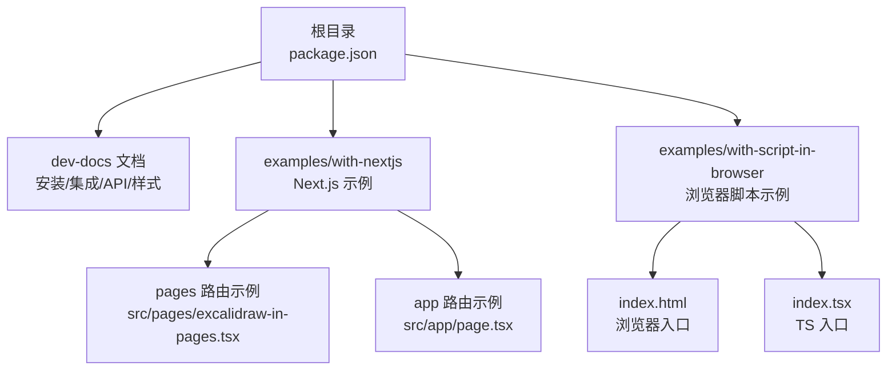
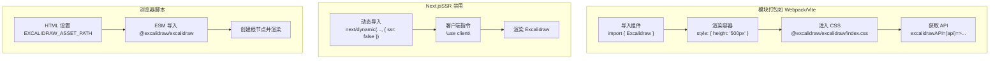
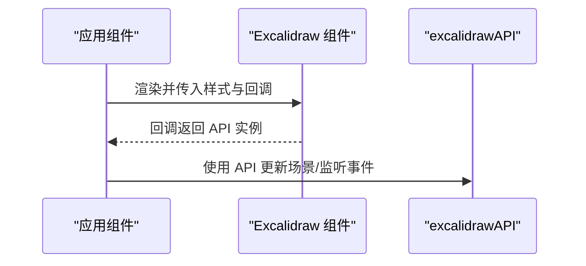
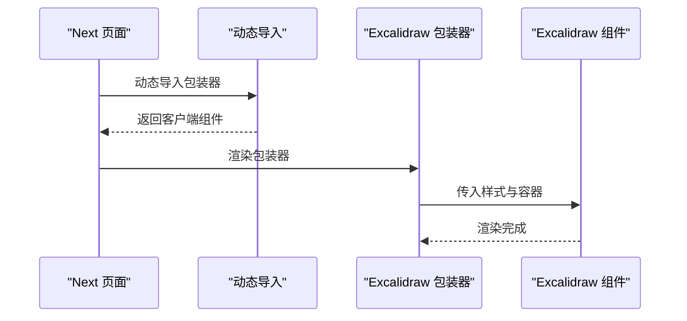
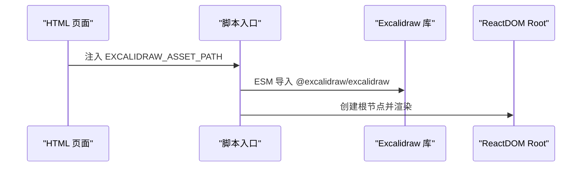
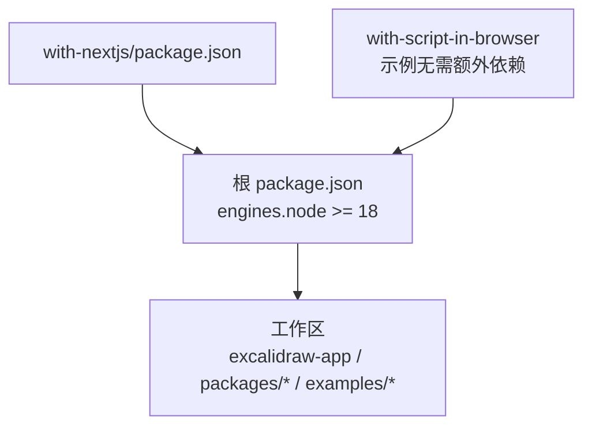

# 快速开始

<cite>
**本文引用的文件**
- [dev-docs 文档：安装与集成](file://dev-docs/docs/@excalidraw/excalidraw/installation.mdx)
- [dev-docs 文档：集成指南](file://dev-docs/docs/@excalidraw/excalidraw/integration.mdx)
- [dev-docs 文档：自定义样式](file://dev-docs/docs/@excalidraw/excalidraw/customizing-styles.mdx)
- [dev-docs 文档：API 属性 - 初始数据](file://dev-docs/docs/@excalidraw/excalidraw/api/props/initialdata.mdx)
- [dev-docs 文档：API 属性 - UI 选项](file://dev-docs/docs/@excalidraw/excalidraw/api/props/ui-options.mdx)
- [dev-docs 文档：API - Excalidraw API](file://dev-docs/docs/@excalidraw/excalidraw/api/props/excalidraw-api.mdx)
- [Next.js 示例：页面路由](file://examples/with-nextjs/src/pages/excalidraw-in-pages.tsx)
- [Next.js 示例：应用路由](file://examples/with-nextjs/src/app/page.tsx)
- [Next.js 包配置](file://examples/with-nextjs/package.json)
- [浏览器脚本示例：HTML 入口](file://examples/with-script-in-browser/index.html)
- [浏览器脚本示例：TS 入口](file://examples/with-script-in-browser/index.tsx)
- [Monorepo 根包配置](file://package.json)
</cite>

## 目录

1. [简介](#简介)
2. [项目结构](#项目结构)
3. [核心组件](#核心组件)
4. [架构总览](#架构总览)
5. [详细组件分析](#详细组件分析)
6. [依赖关系分析](#依赖关系分析)
7. [性能考虑](#性能考虑)
8. [故障排查指南](#故障排查指南)
9. [结论](#结论)
10. [附录](#附录)

## 简介

本指南面向希望在项目中快速集成 Excalidraw 的开发者，覆盖环境要求、安装步骤、三种主流集成方式（React 组件、Next.js、浏览器脚本）以及常见配置项与定制化建议。文档以仓库内官方文档与示例为基础，提供从零到一的可运行路径，并给出验证安装成功的最小示例。

## 项目结构

该仓库采用 Monorepo 结构，包含官方文档站点、示例工程与核心包源码。与“快速开始”直接相关的关键位置如下：

- 官方文档：位于 dev-docs/docs/@excalidraw/excalidraw 下，包含安装、集成、API 与样式等主题文档
- 示例工程：
  - with-nextjs：演示 Next.js（pages 与 app 路由）集成
  - with-script-in-browser：演示浏览器原生脚本集成
- 根级 package.json：定义工作区与 Node 版本要求

图表来源

- [Monorepo 根包配置:1-96](file://package.json#L1-L96)
- [Next.js 示例：页面路由:1-24](file://examples/with-nextjs/src/pages/excalidraw-in-pages.tsx#L1-L24)
- [Next.js 示例：应用路由:1-28](file://examples/with-nextjs/src/app/page.tsx#L1-L28)
- [浏览器脚本示例：HTML 入口:1-32](file://examples/with-script-in-browser/index.html#L1-L32)
- [浏览器脚本示例：TS 入口:1-30](file://examples/with-script-in-browser/index.tsx#L1-L30)

章节来源

- [Monorepo 根包配置:1-96](file://package.json#L1-L96)

## 核心组件

- Excalidraw 组件：作为 React 组件被导入使用，支持通过回调属性获取 API 实例，以便后续操作场景、工具栏、历史记录等
- API 回调：通过 excalidrawAPI 属性接收 Excalidraw 提供的 API 对象，用于更新场景、监听变更、控制工具等
- 初始数据：initialData 支持传入元素、应用状态、滚动定位、库条目与文件等，便于挂载时加载已有内容
- UI 选项：UIOptions 可控制画布动作按钮、停靠侧边栏断点、欢迎屏与工具可见性等

章节来源

- [dev-docs 文档：API - Excalidraw API:1-450](file://dev-docs/docs/@excalidraw/excalidraw/api/props/excalidraw-api.mdx#L1-L450)
- [dev-docs 文档：API 属性 - 初始数据:1-56](file://dev-docs/docs/@excalidraw/excalidraw/api/props/initialdata.mdx#L1-L56)
- [dev-docs 文档：API 属性 - UI 选项:1-82](file://dev-docs/docs/@excalidraw/excalidraw/api/props/ui-options.mdx#L1-L82)

## 架构总览

下图展示了三种集成方式的高层流程：模块打包（Webpack/Vite）、Next.js 动态导入、浏览器脚本直连。

图表来源

- [dev-docs 文档：集成指南:1-241](file://dev-docs/docs/@excalidraw/excalidraw/integration.mdx#L1-L241)
- [dev-docs 文档：安装与集成:1-56](file://dev-docs/docs/@excalidraw/excalidraw/installation.mdx#L1-L56)
- [浏览器脚本示例：HTML 入口:1-32](file://examples/with-script-in-browser/index.html#L1-L32)
- [浏览器脚本示例：TS 入口:1-30](file://examples/with-script-in-browser/index.tsx#L1-L30)

## 详细组件分析

### 安装与环境要求

- 包管理器：支持 npm/yarn
- 依赖：react、react-dom 与 @excalidraw/excalidraw
- 自托管字体：若需自托管字体资源，需复制字体目录至静态资源目录，并设置 window.EXCALIDRAW_ASSET_PATH 指向该路径；Next.js 中可通过 next/script 在 beforeInteractive 策略下注入
- 容器尺寸：Excalidraw 将占满父容器宽高，请确保容器非零尺寸

章节来源

- [dev-docs 文档：安装与集成:1-56](file://dev-docs/docs/@excalidraw/excalidraw/installation.mdx#L1-L56)

### React 组件集成（模块打包）

- 导入组件与样式
- 在容器中渲染 Excalidraw，并设置高度等样式
- 通过 excalidrawAPI 获取 API 实例，进行后续操作（如更新场景、监听变更）

图表来源

- [dev-docs 文档：集成指南:1-241](file://dev-docs/docs/@excalidraw/excalidraw/integration.mdx#L1-L241)
- [dev-docs 文档：API - Excalidraw API:1-450](file://dev-docs/docs/@excalidraw/excalidraw/api/props/excalidraw-api.mdx#L1-L450)

章节来源

- [dev-docs 文档：集成指南:1-241](file://dev-docs/docs/@excalidraw/excalidraw/integration.mdx#L1-L241)

### Next.js 集成（SSR 禁用）

- 由于不支持服务端渲染，需使用 next/dynamic 并禁用 SSR
- pages 路由与 app 路由均可通过动态导入包装器组件的方式使用
- Next.js 中可通过 next/script 注入 EXCALIDRAW_ASSET_PATH

图表来源

- [dev-docs 文档：集成指南:33-131](file://dev-docs/docs/@excalidraw/excalidraw/integration.mdx#L33-L131)
- [Next.js 示例：页面路由:1-24](file://examples/with-nextjs/src/pages/excalidraw-in-pages.tsx#L1-L24)
- [Next.js 示例：应用路由:1-28](file://examples/with-nextjs/src/app/page.tsx#L1-L28)

章节来源

- [dev-docs 文档：集成指南:33-131](file://dev-docs/docs/@excalidraw/excalidraw/integration.mdx#L33-L131)
- [Next.js 示例：页面路由:1-24](file://examples/with-nextjs/src/pages/excalidraw-in-pages.tsx#L1-L24)
- [Next.js 示例：应用路由:1-28](file://examples/with-nextjs/src/app/page.tsx#L1-L28)
- [Next.js 包配置:1-27](file://examples/with-nextjs/package.json#L1-L27)

### 浏览器脚本集成

- 在 HTML 中设置 window.EXCALIDRAW_ASSET_PATH 指向字体资源路径
- 通过 ESM 导入 @excalidraw/excalidraw 并创建根节点渲染
- 可结合 import map 或 CDN 引入 React 依赖

图表来源

- [dev-docs 文档：集成指南:159-241](file://dev-docs/docs/@excalidraw/excalidraw/integration.mdx#L159-L241)
- [浏览器脚本示例：HTML 入口:1-32](file://examples/with-script-in-browser/index.html#L1-L32)
- [浏览器脚本示例：TS 入口:1-30](file://examples/with-script-in-browser/index.tsx#L1-L30)

章节来源

- [dev-docs 文档：集成指南:159-241](file://dev-docs/docs/@excalidraw/excalidraw/integration.mdx#L159-L241)
- [浏览器脚本示例：HTML 入口:1-32](file://examples/with-script-in-browser/index.html#L1-L32)
- [浏览器脚本示例：TS 入口:1-30](file://examples/with-script-in-browser/index.tsx#L1-L30)

### 基础集成清单（三步验证）

- React/Vite/Webpack：导入组件、引入样式、渲染容器
- Next.js：动态导入禁用 SSR、注入资产路径、渲染组件
- 浏览器：设置 EXCALIDRAW_ASSET_PATH、ESM 导入库、创建根节点

章节来源

- [dev-docs 文档：安装与集成:1-56](file://dev-docs/docs/@excalidraw/excalidraw/installation.mdx#L1-L56)
- [dev-docs 文档：集成指南:1-241](file://dev-docs/docs/@excalidraw/excalidraw/integration.mdx#L1-L241)

### 常见配置与初始数据

- 初始数据（initialData）：可传入 elements、appState、scrollToContent、libraryItems、files 等，实现挂载即有内容
- UI 选项（UIOptions）：控制画布动作按钮、停靠侧边栏断点、欢迎屏与工具可见性
- 主题与样式：通过 CSS 变量覆盖主色系，支持明暗模式变量

章节来源

- [dev-docs 文档：API 属性 - 初始数据:1-56](file://dev-docs/docs/@excalidraw/excalidraw/api/props/initialdata.mdx#L1-L56)
- [dev-docs 文档：API 属性 - UI 选项:1-82](file://dev-docs/docs/@excalidraw/excalidraw/api/props/ui-options.mdx#L1-L82)
- [dev-docs 文档：自定义样式:1-50](file://dev-docs/docs/@excalidraw/excalidraw/customizing-styles.mdx#L1-L50)

### API 使用要点

- 获取 API：通过 excalidrawAPI 回调保存实例
- 常用能力：更新场景、更新库、添加文件、重置场景、获取元素、历史记录、滚动到内容、刷新坐标、吐司提示、切换侧栏、订阅变更与指针事件等
- 注意：Ref 支持已移除，ready/readyPromise 已废弃

章节来源

- [dev-docs 文档：API - Excalidraw API:1-450](file://dev-docs/docs/@excalidraw/excalidraw/api/props/excalidraw-api.mdx#L1-L450)

## 依赖关系分析

- Node 版本要求：根级 engines 指定 Node >= 18
- 工作区：monorepo 包含 excalidraw-app、packages/_、examples/_
- Next.js 示例：依赖 next、react、react-dom，构建时会复制字体资源到 public

图表来源

- [Monorepo 根包配置:1-96](file://package.json#L1-L96)
- [Next.js 包配置:1-27](file://examples/with-nextjs/package.json#L1-L27)

章节来源

- [Monorepo 根包配置:1-96](file://package.json#L1-L96)
- [Next.js 包配置:1-27](file://examples/with-nextjs/package.json#L1-L27)

## 性能考虑

- 合理设置容器尺寸，避免 0 尺寸导致渲染异常
- 仅在需要时调用刷新 API（如容器位置变化但非窗口滚动或容器尺寸变化）
- 控制导出与库更新频率，避免频繁触发大对象更新
- 在 Next.js 中禁用 SSR 以减少服务端开销

## 故障排查指南

- 安装失败或版本冲突
  - 确认 Node 版本满足要求（>= 18）
  - 使用 npm/yarn 安装依赖，保持 react 与 react-dom 版本一致
- 字体加载失败
  - 若自托管字体，确保复制字体目录并正确设置 window.EXCALIDRAW_ASSET_PATH
  - Next.js 中通过 next/script 在 beforeInteractive 注入
- SSR 报错
  - Next.js 必须使用动态导入并禁用 SSR（ssr: false）
  - app 路由需添加 “use client” 指令
- 容器无显示
  - 确保容器具有非零高度与宽度
- Preact 兼容
  - 如使用 Preact，需设置环境变量以启用 Preact 构建，并在 Vite 中通过 define 使 process.env.IS_PREACT 可用

章节来源

- [dev-docs 文档：安装与集成:1-56](file://dev-docs/docs/@excalidraw/excalidraw/installation.mdx#L1-L56)
- [dev-docs 文档：集成指南:138-157](file://dev-docs/docs/@excalidraw/excalidraw/integration.mdx#L138-L157)
- [Next.js 示例：应用路由:1-28](file://examples/with-nextjs/src/app/page.tsx#L1-L28)

## 结论

通过本指南，你可以基于 React/Vite、Next.js 或浏览器脚本三种方式快速集成 Excalidraw。建议先按“基础集成清单”完成最小可用示例，再根据需求逐步接入初始数据、UI 选项与 API 能力，并按“故障排查指南”处理常见问题。

## 附录

- 最小可运行示例参考
  - React/Vite：导入组件、引入样式、渲染容器、设置高度
  - Next.js：动态导入 + 禁用 SSR、注入资产路径、渲染组件
  - 浏览器：设置 EXCALIDRAW_ASSET_PATH、ESM 导入库、创建根节点
- 进一步阅读
  - 初始数据与 UI 选项：参见对应 API 文档
  - 样式定制：通过 CSS 变量覆盖主色系
