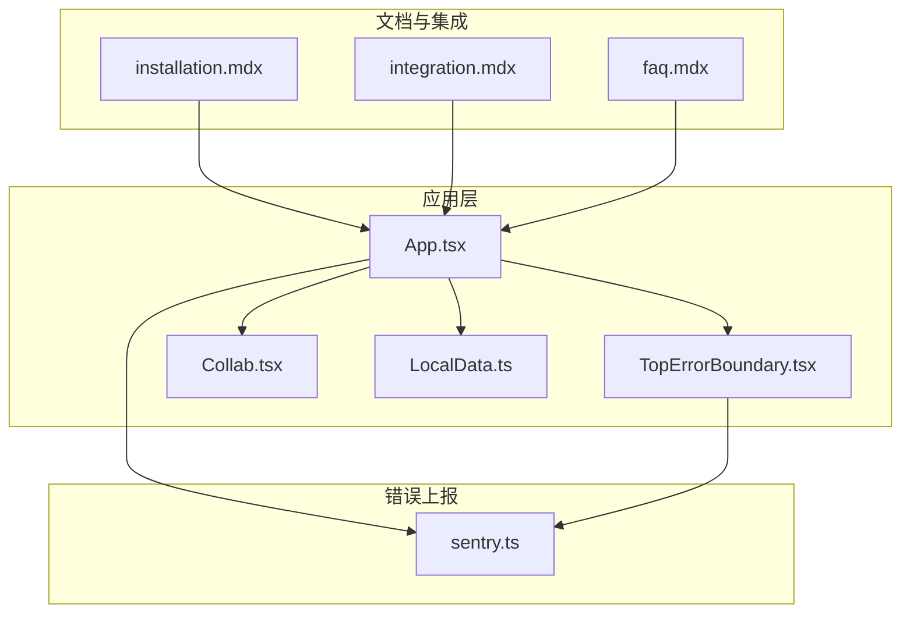
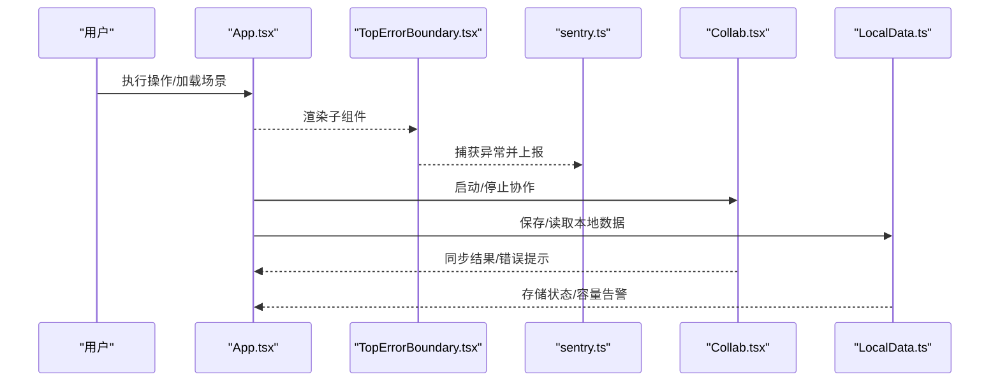
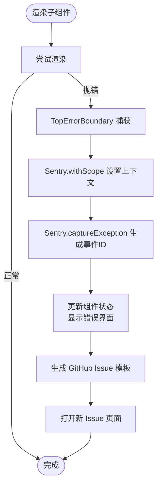
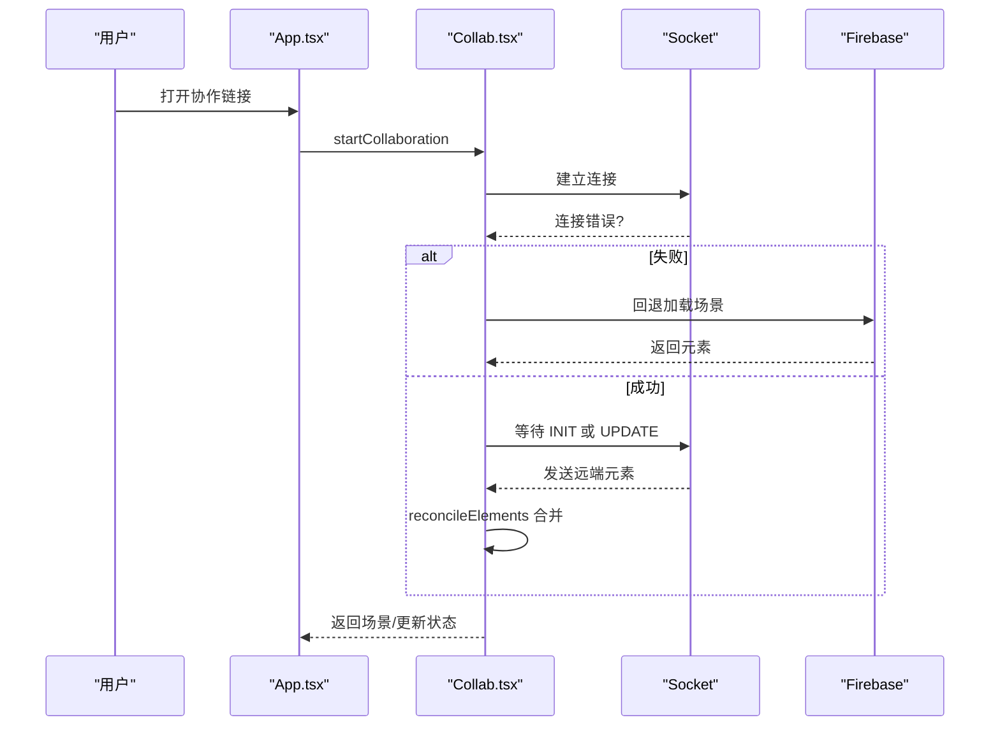
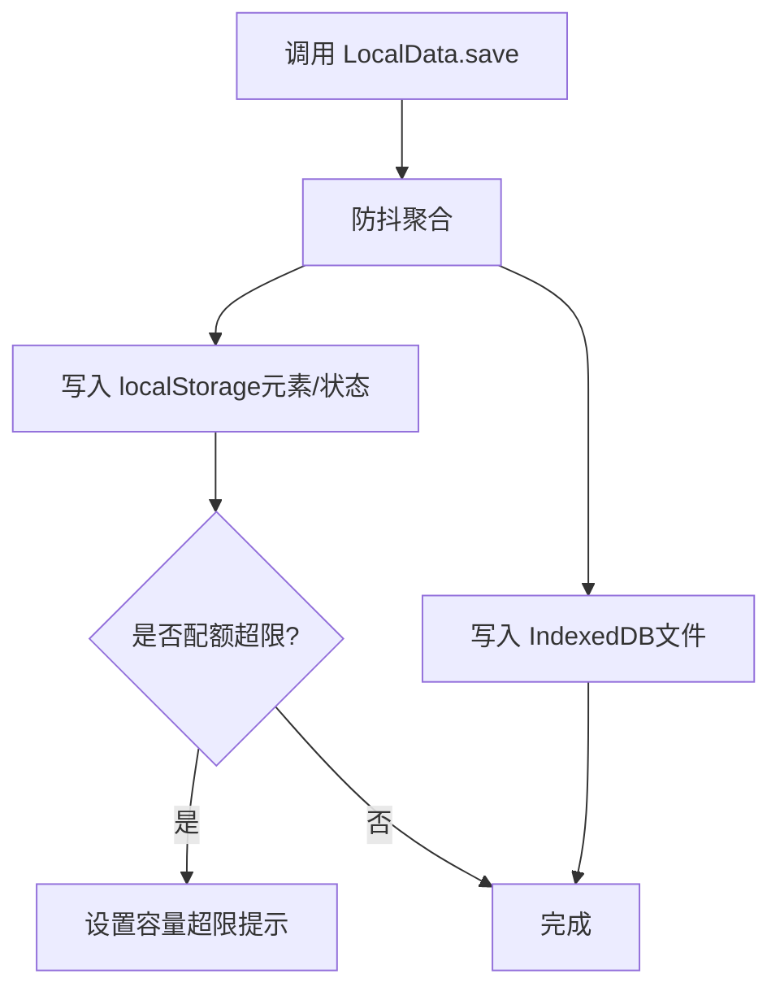
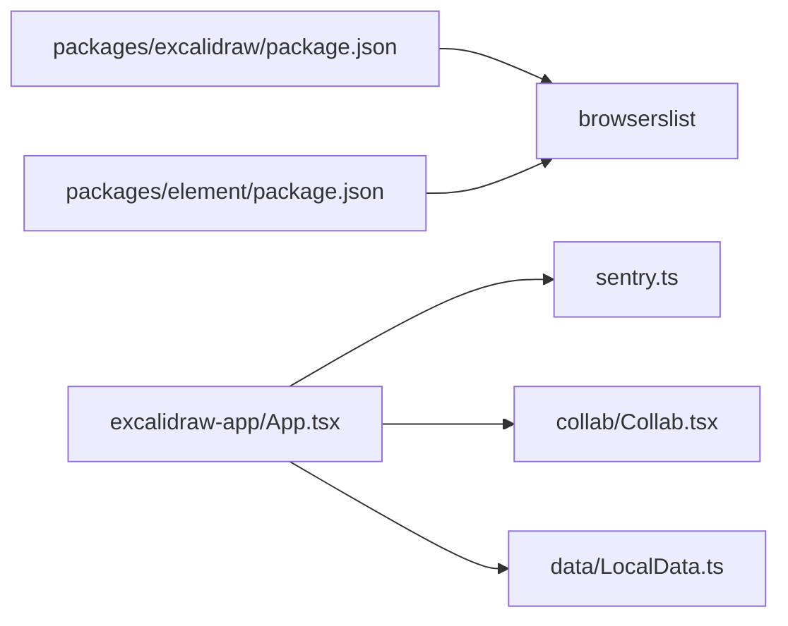

# 故障排除与常见问题

<cite>
**本文引用的文件**
- [README.md](file://README.md)
- [faq.mdx](file://dev-docs/docs/@excalidraw/excalidraw/faq.mdx)
- [installation.mdx](file://dev-docs/docs/@excalidraw/excalidraw/installation.mdx)
- [integration.mdx](file://dev-docs/docs/@excalidraw/excalidraw/integration.mdx)
- [App.tsx](file://excalidraw-app/App.tsx)
- [TopErrorBoundary.tsx](file://excalidraw-app/components/TopErrorBoundary.tsx)
- [sentry.ts](file://excalidraw-app/sentry.ts)
- [Collab.tsx](file://excalidraw-app/collab/Collab.tsx)
- [LocalData.ts](file://excalidraw-app/data/LocalData.ts)
- [bug-issue-template.js](file://excalidraw-app/bug-issue-template.js)
- [package.json（excalidraw 包）](file://packages/excalidraw/package.json)
- [package.json（element 包）](file://packages/element/package.json)
</cite>

## 目录

1. [简介](#简介)
2. [项目结构](#项目结构)
3. [核心组件](#核心组件)
4. [架构总览](#架构总览)
5. [详细组件分析](#详细组件分析)
6. [依赖关系分析](#依赖关系分析)
7. [性能考虑](#性能考虑)
8. [故障排除指南](#故障排除指南)
9. [结论](#结论)
10. [附录](#附录)

## 简介

本文件面向使用者与技术支持团队，提供系统性的故障排除与常见问题解答。内容覆盖安装与集成问题、性能问题、兼容性问题、错误信息解读、调试与日志收集、以及开发与生产环境的差异化调试策略。文档同时给出可操作的诊断步骤、可视化图示与标准化处理流程，帮助快速定位与解决问题。

## 项目结构

该仓库包含应用层（excalidraw-app）、文档（dev-docs）、示例（examples）与多个包（packages）。与故障排除直接相关的模块包括：

- 应用入口与错误边界：App.tsx、TopErrorBoundary.tsx
- 错误上报与过滤：sentry.ts
- 协作与网络：Collab.tsx
- 本地存储与容量告警：LocalData.ts
- 安装与集成指引：installation.mdx、integration.mdx、faq.mdx
- 浏览器兼容性范围：各包 package.json 的 browserslist 配置

**图表来源**

- [App.tsx:1-120](file://excalidraw-app/App.tsx#L1-L120)
- [TopErrorBoundary.tsx:1-60](file://excalidraw-app/components/TopErrorBoundary.tsx#L1-L60)
- [sentry.ts:1-40](file://excalidraw-app/sentry.ts#L1-L40)
- [Collab.tsx:1-120](file://excalidraw-app/collab/Collab.tsx#L1-L120)
- [LocalData.ts:1-60](file://excalidraw-app/data/LocalData.ts#L1-L60)
- [installation.mdx:1-40](file://dev-docs/docs/@excalidraw/excalidraw/installation.mdx#L1-L40)
- [integration.mdx:1-60](file://dev-docs/docs/@excalidraw/excalidraw/integration.mdx#L1-L60)
- [faq.mdx:1-40](file://dev-docs/docs/@excalidraw/excalidraw/faq.mdx#L1-L40)

**章节来源**

- [README.md:1-125](file://README.md#L1-L125)
- [installation.mdx:1-56](file://dev-docs/docs/@excalidraw/excalidraw/installation.mdx#L1-L56)
- [integration.mdx:1-241](file://dev-docs/docs/@excalidraw/excalidraw/integration.mdx#L1-L241)
- [faq.mdx:1-47](file://dev-docs/docs/@excalidraw/excalidraw/faq.mdx#L1-L47)

## 核心组件

- 错误边界与用户引导：TopErrorBoundary 捕获未处理异常，生成 Sentry 事件 ID，并提供一键打开 Issue 的模板与场景内容导出。
- 错误上报与过滤：sentry.ts 初始化 Sentry，按环境启用/禁用，忽略已知噪声，注入 ConsoleError 作为异常源。
- 协作与网络：Collab.tsx 负责协作房间建立、元素同步、图片文件拉取、离线状态与错误提示。
- 本地存储与容量告警：LocalData.ts 将元素与文件持久化到 localStorage 与 IndexedDB，监控配额超限并触发 UI 提示。
- 安装与集成：installation.mdx/integration.mdx 提供安装、字体自托管、尺寸设置、Next.js/SSR 注意事项、Preact/Vite 环境变量等。
- 兼容性范围：各包 package.json 的 browserslist 指明受支持的浏览器版本范围。

**章节来源**

- [TopErrorBoundary.tsx:1-147](file://excalidraw-app/components/TopErrorBoundary.tsx#L1-L147)
- [sentry.ts:1-95](file://excalidraw-app/sentry.ts#L1-L95)
- [Collab.tsx:1-200](file://excalidraw-app/collab/Collab.tsx#L1-L200)
- [LocalData.ts:1-120](file://excalidraw-app/data/LocalData.ts#L1-L120)
- [installation.mdx:1-56](file://dev-docs/docs/@excalidraw/excalidraw/installation.mdx#L1-L56)
- [integration.mdx:1-241](file://dev-docs/docs/@excalidraw/excalidraw/integration.mdx#L1-L241)
- [package.json（excalidraw 包）:55-70](file://packages/excalidraw/package.json#L55-L70)
- [package.json（element 包）:49-70](file://packages/element/package.json#L49-L70)

## 架构总览

下图展示从用户交互到错误上报与协作的关键路径，以及本地存储与网络请求的交互。

**图表来源**

- [App.tsx:370-800](file://excalidraw-app/App.tsx#L370-L800)
- [TopErrorBoundary.tsx:26-73](file://excalidraw-app/components/TopErrorBoundary.tsx#L26-L73)
- [sentry.ts:20-82](file://excalidraw-app/sentry.ts#L20-L82)
- [Collab.tsx:470-706](file://excalidraw-app/collab/Collab.tsx#L470-L706)
- [LocalData.ts:117-228](file://excalidraw-app/data/LocalData.ts#L117-L228)

## 详细组件分析

### 错误边界与错误上报

- 错误边界职责
  - 捕获子树异常，记录组件栈与 localStorage 快照，生成 Sentry 事件 ID。
  - 提供“刷新页面”“清空画布并重载”“打开 GitHub Issue 模板”的快捷操作。
- 错误上报策略
  - 按环境启用/禁用 Sentry；忽略特定噪声（如 Safari 特定错误、IndexedDB 关闭、动态导入失败、localStorage 配额超限、私密模式等）。
  - 将 console.error 作为异常源注入，便于关联控制台日志。
- Bug 模板
  - 自动填充 Sentry 事件 ID 与场景内容，减少重复信息收集成本。

**图表来源**

- [TopErrorBoundary.tsx:26-73](file://excalidraw-app/components/TopErrorBoundary.tsx#L26-L73)
- [sentry.ts:39-82](file://excalidraw-app/sentry.ts#L39-L82)
- [bug-issue-template.js:1-12](file://excalidraw-app/bug-issue-template.js#L1-L12)

**章节来源**

- [TopErrorBoundary.tsx:1-147](file://excalidraw-app/components/TopErrorBoundary.tsx#L1-L147)
- [sentry.ts:1-95](file://excalidraw-app/sentry.ts#L1-L95)
- [bug-issue-template.js:1-12](file://excalidraw-app/bug-issue-template.js#L1-L12)

### 协作与网络

- 房间初始化与回退机制
  - 建立 Socket 连接后监听连接错误，若失败则回退到从 Firebase 加载场景。
  - 支持加入已有房间或新建房间，必要时重置本地场景并保存初始状态。
- 元素同步与冲突解决
  - 使用版本号与 reconcile 策略合并远端元素，避免广播刚收到的场景。
- 图片文件管理
  - 按需拉取未初始化或过期的图片文件，更新状态并回填到画布。
- 错误提示与离线状态
  - 统一通过对话框与指示器提示错误；根据在线/离线状态切换 UI。

**图表来源**

- [Collab.tsx:512-706](file://excalidraw-app/collab/Collab.tsx#L512-L706)
- [App.tsx:328-372](file://excalidraw-app/App.tsx#L328-L372)

**章节来源**

- [Collab.tsx:1-800](file://excalidraw-app/collab/Collab.tsx#L1-L800)
- [App.tsx:216-372](file://excalidraw-app/App.tsx#L216-L372)

### 本地存储与容量告警

- 存储策略
  - 元素与应用状态写入 localStorage；图片文件写入 IndexedDB（idb-keyval）。
  - 通过防抖批量保存，减少频繁写入；隐藏页或被锁定时暂停保存。
- 容量超限处理
  - 捕获 QuotaExceededError 并通过全局原子状态提示用户清理空间。
  - 对未使用的图片文件进行清理（超过一定时间未被访问）。
- 文件状态跟踪
  - 统一维护文件加载/错误/已加载状态，避免重复拉取。

**图表来源**

- [LocalData.ts:117-228](file://excalidraw-app/data/LocalData.ts#L117-L228)

**章节来源**

- [LocalData.ts:1-278](file://excalidraw-app/data/LocalData.ts#L1-L278)

### 安装与集成问题排查

- 安装与字体自托管
  - 若自托管字体，请确保将字体目录复制到静态资源根目录，并设置 EXCALIDRAW_ASSET_PATH 指向同一路径。
  - Next.js 中可通过脚本动态设置 window.EXCALIDRAW_ASSET_PATH。
- 尺寸问题
  - Excalidraw 会占满容器宽高，请确认父容器具有非零尺寸。
- SSR 与 Next.js
  - 由于不支持服务端渲染，需使用动态导入并关闭 SSR；App Router 需要 “use client” 指令。
- Preact 与 Vite
  - 需设置环境变量以选择 Preact 构建；Vite 默认移除环境变量，需在配置中显式注入。
- 浏览器指纹与文本渲染
  - Brave 的“激进反指纹”会破坏 measureText 导致文本元素异常，需关闭该设置。

**章节来源**

- [installation.mdx:1-56](file://dev-docs/docs/@excalidraw/excalidraw/installation.mdx#L1-L56)
- [integration.mdx:33-157](file://dev-docs/docs/@excalidraw/excalidraw/integration.mdx#L33-L157)
- [faq.mdx:7-29](file://dev-docs/docs/@excalidraw/excalidraw/faq.mdx#L7-L29)

## 依赖关系分析

- 浏览器兼容性
  - excaidraw 包与 element 包的 browserslist 明确了最低版本要求，部分旧版浏览器（如 Edge 低版本、Safari 低版本、某些安卓浏览器）不在支持范围内。
- 第三方依赖
  - 错误上报依赖 Sentry；协作依赖 Socket.IO；文件存储依赖 IndexedDB；UI 状态依赖 Jotai；打包工具链包含 esbuild、sass 等。

**图表来源**

- [package.json（excalidraw 包）:55-70](file://packages/excalidraw/package.json#L55-L70)
- [package.json（element 包）:49-70](file://packages/element/package.json#L49-L70)
- [App.tsx:1-120](file://excalidraw-app/App.tsx#L1-L120)
- [sentry.ts:1-40](file://excalidraw-app/sentry.ts#L1-L40)
- [Collab.tsx:1-120](file://excalidraw-app/collab/Collab.tsx#L1-L120)
- [LocalData.ts:1-60](file://excalidraw-app/data/LocalData.ts#L1-L60)

**章节来源**

- [package.json（excalidraw 包）:55-70](file://packages/excalidraw/package.json#L55-L70)
- [package.json（element 包）:49-70](file://packages/element/package.json#L49-L70)

## 性能考虑

- 渲染节流与防抖
  - 应用层开启渲染节流开关；对保存、同步、可见区域变化等操作使用防抖/节流，降低主线程压力。
- 图片加载与缓存
  - 仅在需要时拉取图片；对未使用且过期的图片进行清理；统一状态跟踪避免重复请求。
- 本地存储策略
  - 批量写入、隐藏页暂停、容量超限告警，避免频繁 I/O 与崩溃。
- 协作同步
  - 使用版本号与 reconcile 合并，避免广播刚收到的场景；对长列表与大文件上传设置上限与错误处理。

**章节来源**

- [App.tsx:155-156](file://excalidraw-app/App.tsx#L155-L156)
- [Collab.tsx:420-446](file://excalidraw-app/collab/Collab.tsx#L420-L446)
- [LocalData.ts:117-228](file://excalidraw-app/data/LocalData.ts#L117-L228)

## 故障排除指南

### 通用诊断流程

- 快速自检
  - 确认容器尺寸非零；检查字体自托管路径与 EXCALIDRAW_ASSET_PATH 是否正确；确认浏览器指纹设置未阻断 measureText。
  - 在 Next.js 中确认已动态导入且关闭 SSR；Preact/Vite 已设置 IS_PREACT 环境变量。
- 日志与上报
  - 打开浏览器控制台，查看 Sentry 事件 ID；复制错误详情与场景内容，创建 GitHub Issue。
  - 如为协作问题，检查在线/离线状态、房间链接有效性与 Socket 连接日志。
- 数据与存储
  - 若出现“容量超限”提示，清理不必要的图片或本地数据；观察文件状态是否持续停留在错误/加载中。
- 回归验证
  - 在无网络或弱网环境下测试协作与本地保存行为；验证不同浏览器版本下的兼容性。

**章节来源**

- [faq.mdx:7-29](file://dev-docs/docs/@excalidraw/excalidraw/faq.mdx#L7-L29)
- [installation.mdx:19-51](file://dev-docs/docs/@excalidraw/excalidraw/installation.mdx#L19-L51)
- [integration.mdx:33-157](file://dev-docs/docs/@excalidraw/excalidraw/integration.mdx#L33-L157)
- [TopErrorBoundary.tsx:55-73](file://excalidraw-app/components/TopErrorBoundary.tsx#L55-L73)
- [sentry.ts:26-32](file://excalidraw-app/sentry.ts#L26-L32)
- [LocalData.ts:102-113](file://excalidraw-app/data/LocalData.ts#L102-L113)

### 常见问题与解决方案

- 文本元素显示异常（Brave 抖动/空白）

  - 现象：启用“激进反指纹”后文本不可见或渲染异常。
  - 解决：关闭“激进反指纹”，或在设置中降级为“阻止指纹”。
  - 参考：[FAQ 文档:7-29](file://dev-docs/docs/@excalidraw/excalidraw/faq.mdx#L7-L29)

- ReferenceError: process is not defined（Vite/Preact）

  - 现象：构建时报错找不到 process。
  - 解决：在 Vite 配置中注入 define: { "process.env.IS_PREACT": JSON.stringify("true") }；或在 Preact 环境下设置该变量。
  - 参考：[FAQ 文档:32-42](file://dev-docs/docs/@excalidraw/excalidraw/faq.mdx#L32-L42)

- Next.js 服务端渲染导致白屏或报错

  - 现象：SSR 渲染失败或客户端水合不一致。
  - 解决：使用动态导入关闭 SSR；App Router 添加 “use client” 指令。
  - 参考：[集成文档:33-131](file://dev-docs/docs/@excalidraw/excalidraw/integration.mdx#L33-L131)

- 字体无法加载或显示异常

  - 现象：默认 CDN 下载失败或自托管路径不正确。
  - 解决：复制字体目录至静态资源根目录，设置 EXCALIDRAW_ASSET_PATH；Next.js 动态设置。
  - 参考：[安装文档:19-47](file://dev-docs/docs/@excalidraw/excalidraw/installation.mdx#L19-L47)

- 协作保存失败或大小超限

  - 现象：保存到 Firebase 失败，提示大小超限。
  - 解决：精简场景元素与图片；分批保存；检查房间链接有效性。
  - 参考：[协作实现:332-354](file://excalidraw-app/collab/Collab.tsx#L332-L354)

- 本地存储配额超限

  - 现象：QuotaExceededError 触发，提示容量不足。
  - 解决：清理未使用图片与本地数据；避免一次性写入大量文件。
  - 参考：[本地存储:102-113](file://excalidraw-app/data/LocalData.ts#L102-L113)

- 离线/弱网环境协作异常
  - 现象：Socket 连接失败或初始化超时。
  - 解决：启用回退机制（从 Firebase 加载场景）；在网络恢复后重试。
  - 参考：[协作实现:512-565](file://excalidraw-app/collab/Collab.tsx#L512-L565)

### 开发与生产调试策略

- 开发环境
  - 启用可视化调试面板；保留 Sentry 控制台输出；使用 Feature Flags 辅助定位问题。
- 生产环境
  - 通过 Sentry 事件 ID 快速定位堆栈；忽略已知噪声；关注容量超限与 IndexedDB 异常。
- 用户反馈收集
  - 使用错误边界提供的模板自动填充事件 ID 与场景快照，提升问题复现效率。

**章节来源**

- [sentry.ts:11-32](file://excalidraw-app/sentry.ts#L11-L32)
- [TopErrorBoundary.tsx:55-73](file://excalidraw-app/components/TopErrorBoundary.tsx#L55-L73)
- [bug-issue-template.js:1-12](file://excalidraw-app/bug-issue-template.js#L1-L12)

### 性能优化建议

- 减少重绘与重排：合理拆分组件，避免不必要的全量更新。
- 图片优化：压缩与懒加载；及时清理未使用图片。
- 存储优化：批量写入、去抖动、隐藏页暂停保存。
- 协作优化：版本号合并、节流广播、限制单次传输大小。

**章节来源**

- [App.tsx:560-617](file://excalidraw-app/App.tsx#L560-L617)
- [Collab.tsx:789-800](file://excalidraw-app/collab/Collab.tsx#L789-L800)
- [LocalData.ts:117-147](file://excalidraw-app/data/LocalData.ts#L117-L147)

### 内存泄漏检测

- 症状识别：长时间使用后内存持续增长、页面卡顿、CPU 占用升高。
- 排查要点：
  - 检查是否存在未释放的事件监听器（如 beforeunload、visibilitychange、pointermove）。
  - 确认协作组件在卸载时正确销毁 Socket 与定时器。
  - 避免在回调中持有对 DOM 或画布元素的强引用。
- 建议工具：浏览器性能面板与内存快照对比。

**章节来源**

- [Collab.tsx:260-279](file://excalidraw-app/collab/Collab.tsx#L260-L279)
- [App.tsx:635-651](file://excalidraw-app/App.tsx#L635-L651)

### 浏览器兼容性问题

- 不支持的浏览器
  - 某些旧版浏览器（如低版本 Edge/Safari/安卓内置浏览器）不在 browserslist 支持范围内。
- 表现与对策
  - 若出现功能缺失或崩溃，优先升级浏览器；在兼容性矩阵内进行回归测试。
- 参考
  - [excalidraw 包 browserslist:55-70](file://packages/excalidraw/package.json#L55-L70)
  - [element 包 browserslist:49-70](file://packages/element/package.json#L49-L70)

**章节来源**

- [package.json（excalidraw 包）:55-70](file://packages/excalidraw/package.json#L55-L70)
- [package.json（element 包）:49-70](file://packages/element/package.json#L49-L70)

## 结论

通过错误边界与 Sentry 的组合、协作与存储模块的健壮设计、以及完善的安装与集成指引，Excalidraw 在复杂使用场景下具备较强的稳定性与可观测性。建议在开发与生产环境中遵循本文提供的诊断流程与优化建议，结合浏览器兼容性矩阵与容量告警机制，持续提升用户体验与系统可靠性。

## 附录

### 标准化问题处理流程

- 步骤
  - 复现并记录现象与操作步骤
  - 收集控制台日志与 Sentry 事件 ID
  - 检查容器尺寸、字体路径、SSR 设置、Preact/Vite 环境变量
  - 验证协作网络与本地存储状态
  - 使用模板创建 Issue 并附上场景快照
- 输出
  - 事件 ID、浏览器与版本、操作系统、网络状态、最小复现步骤、截图/录屏

**章节来源**

- [TopErrorBoundary.tsx:55-73](file://excalidraw-app/components/TopErrorBoundary.tsx#L55-L73)
- [bug-issue-template.js:1-12](file://excalidraw-app/bug-issue-template.js#L1-L12)
