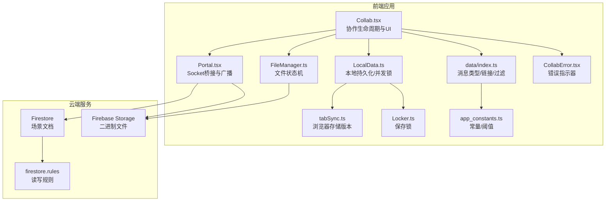
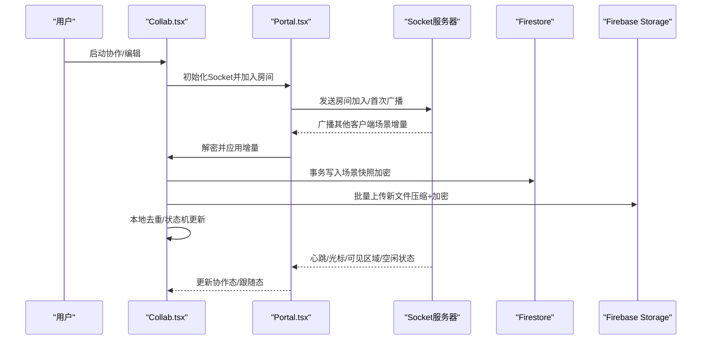
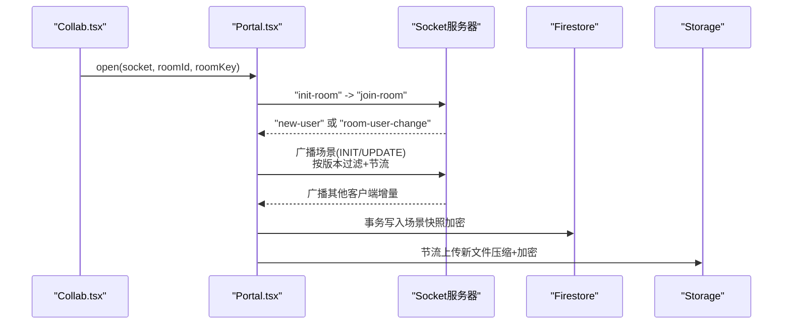
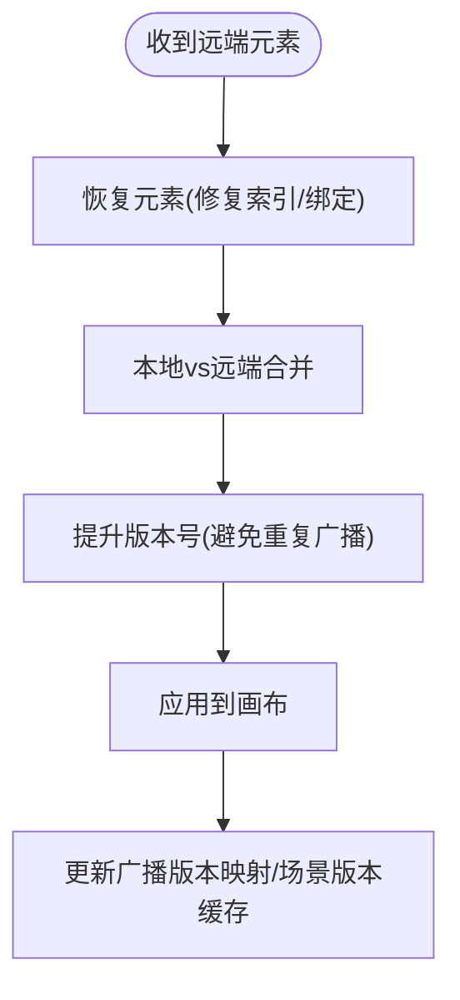
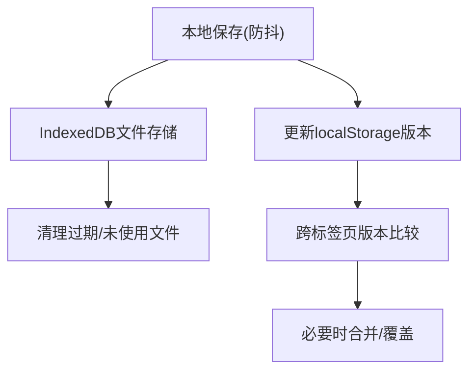
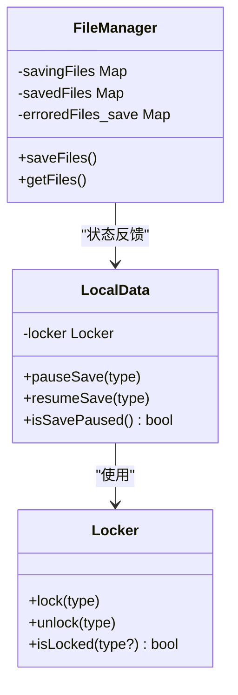
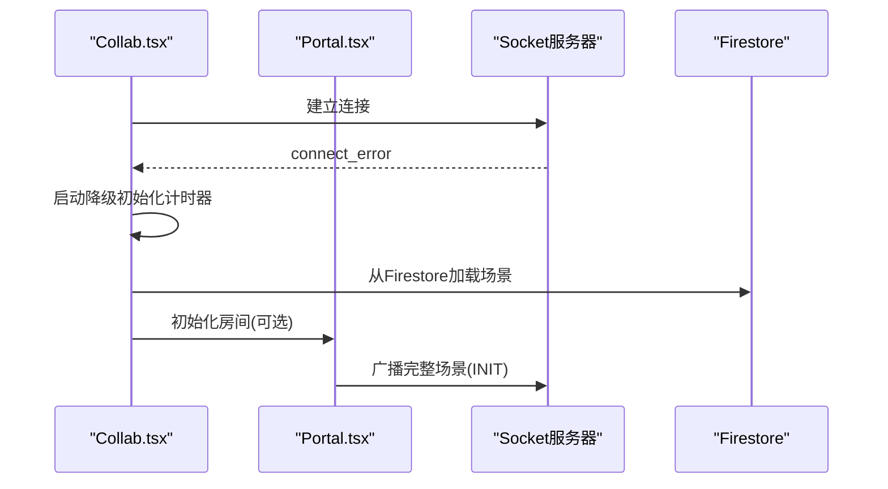
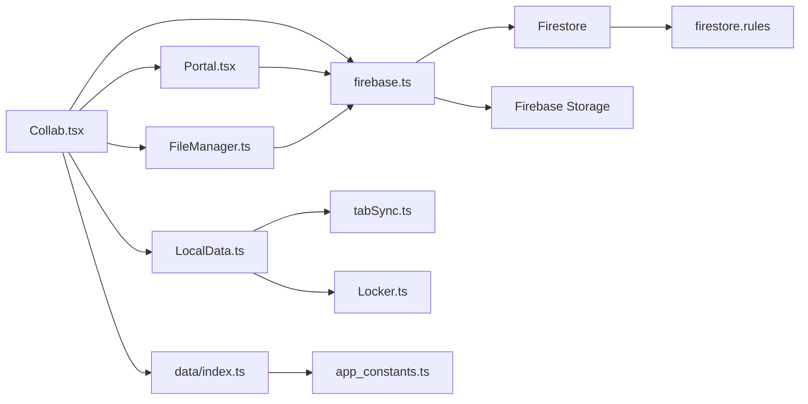

# 云端同步机制

<cite>
**本文引用的文件**
- [excalidraw-app/data/firebase.ts](file://excalidraw-app/data/firebase.ts)
- [excalidraw-app/collab/Collab.tsx](file://excalidraw-app/collab/Collab.tsx)
- [excalidraw-app/collab/Portal.tsx](file://excalidraw-app/collab/Portal.tsx)
- [excalidraw-app/data/index.ts](file://excalidraw-app/data/index.ts)
- [excalidraw-app/data/LocalData.ts](file://excalidraw-app/data/LocalData.ts)
- [excalidraw-app/data/tabSync.ts](file://excalidraw-app/data/tabSync.ts)
- [excalidraw-app/data/FileManager.ts](file://excalidraw-app/data/FileManager.ts)
- [excalidraw-app/data/Locker.ts](file://excalidraw-app/data/Locker.ts)
- [excalidraw-app/app_constants.ts](file://excalidraw-app/app_constants.ts)
- [firebase-project/firestore.rules](file://firebase-project/firestore.rules)
- [excalidraw-app/collab/CollabError.tsx](file://excalidraw-app/collab/CollabError.tsx)
</cite>

## 目录

1. [引言](#引言)
2. [项目结构](#项目结构)
3. [核心组件](#核心组件)
4. [架构总览](#架构总览)
5. [详细组件分析](#详细组件分析)
6. [依赖关系分析](#依赖关系分析)
7. [性能考量](#性能考量)
8. [故障排查指南](#故障排查指南)
9. [结论](#结论)
10. [附录](#附录)

## 引言

本文件系统性梳理基于 Firebase 的云端同步机制，覆盖 WebSocket 连接管理、数据冲突解决与版本控制、分布式状态同步算法（CRDT 思想）、数据迁移与增量同步、离线缓存、同步锁与并发控制、事务处理、网络异常与重连策略、数据恢复方案、性能优化与带宽控制、同步延迟管理，以及数据安全传输、加密存储与访问权限控制等主题。文档以代码为依据，结合可视化图示帮助读者快速理解端到端流程。

## 项目结构

围绕“协作编辑 + 云端同步”的核心路径，主要涉及以下模块：

- 协作入口与生命周期：Collab.tsx
- 通信桥接：Portal.tsx（封装 Socket 事件、加解密、广播）
- 云端存储：firebase.ts（Firestore 场景 + Firebase Storage 文件）
- 数据模型与过滤：data/index.ts（可同步元素、消息类型、链接生成）
- 本地持久化与并发控制：LocalData.ts、tabSync.ts、Locker.ts
- 文件管理与状态机：FileManager.ts
- 常量与阈值：app_constants.ts
- 安全规则：firestore.rules
- 错误指示器：CollabError.tsx

**图表来源**

- [excalidraw-app/collab/Collab.tsx:132-204](file://excalidraw-app/collab/Collab.tsx#L132-L204)
- [excalidraw-app/collab/Portal.tsx:25-83](file://excalidraw-app/collab/Portal.tsx#L25-L83)
- [excalidraw-app/data/firebase.ts:83-320](file://excalidraw-app/data/firebase.ts#L83-L320)
- [excalidraw-app/data/index.ts:58-164](file://excalidraw-app/data/index.ts#L58-L164)
- [excalidraw-app/data/LocalData.ts:117-228](file://excalidraw-app/data/LocalData.ts#L117-L228)
- [excalidraw-app/data/tabSync.ts:1-40](file://excalidraw-app/data/tabSync.ts#L1-L40)
- [excalidraw-app/data/FileManager.ts:22-226](file://excalidraw-app/data/FileManager.ts#L22-L226)
- [excalidraw-app/app_constants.ts:1-62](file://excalidraw-app/app_constants.ts#L1-L62)
- [firebase-project/firestore.rules:1-11](file://firebase-project/firestore.rules#L1-L11)

**章节来源**

- [excalidraw-app/collab/Collab.tsx:132-204](file://excalidraw-app/collab/Collab.tsx#L132-L204)
- [excalidraw-app/collab/Portal.tsx:25-83](file://excalidraw-app/collab/Portal.tsx#L25-L83)
- [excalidraw-app/data/firebase.ts:83-320](file://excalidraw-app/data/firebase.ts#L83-L320)
- [excalidraw-app/data/index.ts:58-164](file://excalidraw-app/data/index.ts#L58-L164)
- [excalidraw-app/data/LocalData.ts:117-228](file://excalidraw-app/data/LocalData.ts#L117-L228)
- [excalidraw-app/data/tabSync.ts:1-40](file://excalidraw-app/data/tabSync.ts#L1-L40)
- [excalidraw-app/data/FileManager.ts:22-226](file://excalidraw-app/data/FileManager.ts#L22-L226)
- [excalidraw-app/app_constants.ts:1-62](file://excalidraw-app/app_constants.ts#L1-L62)
- [firebase-project/firestore.rules:1-11](file://firebase-project/firestore.rules#L1-L11)

## 核心组件

- 协作控制器（Collab）：负责启动/停止协作、初始化 Socket、监听网络状态、触发保存、加载远程场景、处理错误与提示。
- Socket 桥接（Portal）：封装 Socket 事件、房间加入、广播消息（含加解密）、节流上传文件、跟踪已广播元素版本。
- 云端存储（Firebase）：Firestore 存储场景（加密），Firebase Storage 存储二进制文件；提供保存/加载、事务写入、版本缓存。
- 数据模型与过滤（data/index.ts）：定义可同步元素、消息类型枚举、协作链接生成与解析、后端导入导出辅助。
- 本地持久化（LocalData）：debounce 写入 localStorage、IndexedDB 文件存储、保存锁（Locker）与浏览器存储版本（tabSync）。
- 文件管理（FileManager）：文件状态机（加载中/已加载/错误/保存中）、去重与幂等、批量上传与错误回退。
- 常量（app_constants.ts）：超时、阈值、事件名、前缀、最大文件大小等。
- 规则（firestore.rules）：基础读写规则（开发环境示例）。

**章节来源**

- [excalidraw-app/collab/Collab.tsx:132-204](file://excalidraw-app/collab/Collab.tsx#L132-L204)
- [excalidraw-app/collab/Portal.tsx:25-83](file://excalidraw-app/collab/Portal.tsx#L25-L83)
- [excalidraw-app/data/firebase.ts:83-320](file://excalidraw-app/data/firebase.ts#L83-L320)
- [excalidraw-app/data/index.ts:58-164](file://excalidraw-app/data/index.ts#L58-L164)
- [excalidraw-app/data/LocalData.ts:117-228](file://excalidraw-app/data/LocalData.ts#L117-L228)
- [excalidraw-app/data/FileManager.ts:22-226](file://excalidraw-app/data/FileManager.ts#L22-L226)
- [excalidraw-app/app_constants.ts:1-62](file://excalidraw-app/app_constants.ts#L1-L62)
- [firebase-project/firestore.rules:1-11](file://firebase-project/firestore.rules#L1-L11)

## 架构总览

整体采用“WebSocket 实时广播 + Firestore 场景 + Firebase Storage 文件”的混合架构。Socket 负责高频、低延迟的增量更新；Firestore 负责最终一致的场景快照；Storage 负责图片等二进制资源的加密压缩存储与按需拉取。

**图表来源**

- [excalidraw-app/collab/Collab.tsx:508-706](file://excalidraw-app/collab/Collab.tsx#L508-L706)
- [excalidraw-app/collab/Portal.tsx:37-102](file://excalidraw-app/collab/Portal.tsx#L37-L102)
- [excalidraw-app/data/firebase.ts:187-247](file://excalidraw-app/data/firebase.ts#L187-L247)

## 详细组件分析

### WebSocket 连接管理与广播

- 连接建立：Collab 动态加载 Socket 客户端，指定传输协议优先级，监听连接错误并降级初始化。
- 房间加入：Portal 监听“init-room”事件后发送“join-room”，随后在有新用户时主动广播完整场景。
- 广播策略：Portal 对场景广播进行节流与按版本过滤，仅发送自上次广播以来变更或新增的可同步元素，降低带宽。
- 加解密：所有广播数据先 JSON 序列化再加密，接收端解密后按子类型分发（场景初始化/更新、鼠标位置、可见区域、空闲状态）。

**图表来源**

- [excalidraw-app/collab/Collab.tsx:508-706](file://excalidraw-app/collab/Collab.tsx#L508-L706)
- [excalidraw-app/collab/Portal.tsx:37-102](file://excalidraw-app/collab/Portal.tsx#L37-L102)
- [excalidraw-app/data/firebase.ts:187-247](file://excalidraw-app/data/firebase.ts#L187-L247)

**章节来源**

- [excalidraw-app/collab/Collab.tsx:508-706](file://excalidraw-app/collab/Collab.tsx#L508-L706)
- [excalidraw-app/collab/Portal.tsx:142-183](file://excalidraw-app/collab/Portal.tsx#L142-L183)
- [excalidraw-app/app_constants.ts:16-35](file://excalidraw-app/app_constants.ts#L16-L35)

### 数据冲突解决与版本控制

- 元素版本：每个元素具备版本号与版本随机数，用于区分同 ID 的重复元素与确定合并顺序。
- 本地-远端合并：Collab 在收到远端场景后，先恢复（修复索引/绑定等），再调用合并算法，最后提升版本号，避免广播刚收到的场景。
- 版本缓存：Portal 维护“已广播版本映射”，Firebase 层通过 WeakMap 缓存 Socket 到场景版本映射，用于判断是否已保存。
- 可同步元素过滤：仅对非删除且非极小元素进行同步，减少噪声。

**图表来源**

- [excalidraw-app/collab/Collab.tsx:755-787](file://excalidraw-app/collab/Collab.tsx#L755-L787)
- [excalidraw-app/collab/Portal.tsx:173-178](file://excalidraw-app/collab/Portal.tsx#L173-L178)
- [excalidraw-app/data/firebase.ts:118-129](file://excalidraw-app/data/firebase.ts#L118-L129)

**章节来源**

- [excalidraw-app/collab/Collab.tsx:755-787](file://excalidraw-app/collab/Collab.tsx#L755-L787)
- [excalidraw-app/data/index.ts:46-63](file://excalidraw-app/data/index.ts#L46-L63)
- [excalidraw-app/data/firebase.ts:118-129](file://excalidraw-app/data/firebase.ts#L118-L129)

### 分布式状态同步算法与一致性

- 算法思想：采用“操作/元素版本 + 合并函数”的思路，确保多端并发修改后能收敛到一致状态。本地恢复后再合并，避免因索引不一致导致的分歧。
- 一致性保障：通过 Firestore 事务写入场景快照，保证场景的一致性与原子性；Socket 广播作为近实时增量补充。
- CRDT 关系：代码未直接实现 CRDT 类型，但通过“版本号 + 合并 + 恢复”达到 CRDT 的无冲突合并效果，满足协作一致性需求。

**章节来源**

- [excalidraw-app/collab/Collab.tsx:755-787](file://excalidraw-app/collab/Collab.tsx#L755-L787)
- [excalidraw-app/data/firebase.ts:206-238](file://excalidraw-app/data/firebase.ts#L206-L238)

### 数据迁移策略、增量同步与离线缓存

- 数据迁移：本地库从 localStorage 迁移到 IndexedDB，提供适配器与一次性迁移逻辑，避免丢失历史数据。
- 增量同步：Portal 仅广播自上次广播以来版本变化或新增的元素；定期全量同步（常量控制）防止消息丢失导致的漂移。
- 离线缓存：LocalStorage 存放元素与应用状态；IndexedDB 存放图片；文件清理策略按“最近使用时间”与“未使用天数”淘汰。
- 浏览器标签页版本：通过 localStorage 时间戳标记不同标签页的数据版本，避免互相覆盖。

**图表来源**

- [excalidraw-app/data/LocalData.ts:73-109](file://excalidraw-app/data/LocalData.ts#L73-L109)
- [excalidraw-app/data/LocalData.ts:53-71](file://excalidraw-app/data/LocalData.ts#L53-L71)
- [excalidraw-app/data/tabSync.ts:12-25](file://excalidraw-app/data/tabSync.ts#L12-L25)

**章节来源**

- [excalidraw-app/data/LocalData.ts:229-277](file://excalidraw-app/data/LocalData.ts#L229-L277)
- [excalidraw-app/data/LocalData.ts:53-71](file://excalidraw-app/data/LocalData.ts#L53-L71)
- [excalidraw-app/data/tabSync.ts:12-25](file://excalidraw-app/data/tabSync.ts#L12-L25)

### 同步锁机制、并发控制与事务处理

- 保存锁：LocalData 使用 Locker 对“协作保存”加锁，页面隐藏或存在保存锁时暂停本地保存，避免竞态。
- 事务写入：Firebase 场景保存使用 Firestore 事务，先读取旧快照，计算合并结果，再原子性写入，失败自动重试。
- 文件上传幂等：FileManager 维护“保存中/已保存/错误”状态，避免重复上传与覆盖。

**图表来源**

- [excalidraw-app/data/Locker.ts:1-19](file://excalidraw-app/data/Locker.ts#L1-L19)
- [excalidraw-app/data/LocalData.ts:153-165](file://excalidraw-app/data/LocalData.ts#L153-L165)
- [excalidraw-app/data/FileManager.ts:22-65](file://excalidraw-app/data/FileManager.ts#L22-L65)

**章节来源**

- [excalidraw-app/data/Locker.ts:1-19](file://excalidraw-app/data/Locker.ts#L1-L19)
- [excalidraw-app/data/LocalData.ts:153-165](file://excalidraw-app/data/LocalData.ts#L153-L165)
- [excalidraw-app/data/FileManager.ts:92-137](file://excalidraw-app/data/FileManager.ts#L92-L137)
- [excalidraw-app/data/firebase.ts:206-238](file://excalidraw-app/data/firebase.ts#L206-L238)

### 网络异常处理、重连策略与数据恢复

- 连接错误降级：Socket 连接错误时触发“首次场景初始化”降级流程，尝试从 Firestore 加载场景。
- 初始化超时：若长时间未收到“场景初始化”，定时器触发降级加载，确保进入房间后能尽快同步。
- 断线重连：Socket 重新连接后，Portal 会再次广播完整场景（新用户加入时），保证状态一致。
- 数据恢复：Collab 在停止协作或卸载前，确保将当前场景写入 Firestore，并根据需要重置本地状态。

**图表来源**

- [excalidraw-app/collab/Collab.tsx:512-565](file://excalidraw-app/collab/Collab.tsx#L512-L565)
- [excalidraw-app/collab/Collab.tsx:716-753](file://excalidraw-app/collab/Collab.tsx#L716-L753)
- [excalidraw-app/collab/Portal.tsx:49-55](file://excalidraw-app/collab/Portal.tsx#L49-L55)

**章节来源**

- [excalidraw-app/collab/Collab.tsx:512-565](file://excalidraw-app/collab/Collab.tsx#L512-L565)
- [excalidraw-app/collab/Collab.tsx:716-753](file://excalidraw-app/collab/Collab.tsx#L716-L753)
- [excalidraw-app/collab/Portal.tsx:49-55](file://excalidraw-app/collab/Portal.tsx#L49-L55)

### 性能优化、带宽控制与同步延迟管理

- 增量广播：Portal 仅广播版本变化或新增元素，显著降低带宽占用。
- 节流上传：文件上传按固定间隔节流，避免频繁 IO 抖动。
- 防抖保存：本地保存使用防抖，减少磁盘写入频率。
- 定期全量同步：周期性全量广播，补偿丢包或服务器重启导致的漂移。
- 帧率同步：光标同步按固定时间片节流，维持约 30fps。

**章节来源**

- [excalidraw-app/collab/Portal.tsx:142-183](file://excalidraw-app/collab/Portal.tsx#L142-L183)
- [excalidraw-app/data/FileManager.ts:104-140](file://excalidraw-app/data/FileManager.ts#L104-L140)
- [excalidraw-app/data/LocalData.ts:118-134](file://excalidraw-app/data/LocalData.ts#L118-L134)
- [excalidraw-app/app_constants.ts:2-9](file://excalidraw-app/app_constants.ts#L2-L9)

### 数据安全传输、加密存储与访问权限控制

- 传输加密：Socket 广播数据在发送前进行 AES 加密，接收端解密后处理。
- 场景加密：Firestore 场景文档包含初始化向量与密文，仅持有房间密钥方可解密。
- 文件加密：文件上传前压缩并加密，下载时解密并解压。
- 访问控制：Firestore 规则示例允许读写（开发环境），实际部署应限制到房间密钥持有者；Storage 通过签名 URL 控制访问。
- 密钥管理：房间密钥由客户端生成并通过链接传递，避免泄露至服务器。

**章节来源**

- [excalidraw-app/data/firebase.ts:93-116](file://excalidraw-app/data/firebase.ts#L93-L116)
- [excalidraw-app/data/firebase.ts:174-185](file://excalidraw-app/data/firebase.ts#L174-L185)
- [excalidraw-app/data/index.ts:148-157](file://excalidraw-app/data/index.ts#L148-L157)
- [firebase-project/firestore.rules:1-11](file://firebase-project/firestore.rules#L1-L11)

## 依赖关系分析

**图表来源**

- [excalidraw-app/collab/Collab.tsx:132-204](file://excalidraw-app/collab/Collab.tsx#L132-L204)
- [excalidraw-app/collab/Portal.tsx:25-83](file://excalidraw-app/collab/Portal.tsx#L25-L83)
- [excalidraw-app/data/FileManager.ts:22-65](file://excalidraw-app/data/FileManager.ts#L22-L65)
- [excalidraw-app/data/LocalData.ts:117-228](file://excalidraw-app/data/LocalData.ts#L117-L228)
- [excalidraw-app/data/firebase.ts:83-320](file://excalidraw-app/data/firebase.ts#L83-L320)
- [excalidraw-app/data/index.ts:58-164](file://excalidraw-app/data/index.ts#L58-L164)
- [excalidraw-app/app_constants.ts:1-62](file://excalidraw-app/app_constants.ts#L1-L62)
- [firebase-project/firestore.rules:1-11](file://firebase-project/firestore.rules#L1-L11)

**章节来源**

- [excalidraw-app/collab/Collab.tsx:132-204](file://excalidraw-app/collab/Collab.tsx#L132-L204)
- [excalidraw-app/collab/Portal.tsx:25-83](file://excalidraw-app/collab/Portal.tsx#L25-L83)
- [excalidraw-app/data/FileManager.ts:22-65](file://excalidraw-app/data/FileManager.ts#L22-L65)
- [excalidraw-app/data/LocalData.ts:117-228](file://excalidraw-app/data/LocalData.ts#L117-L228)
- [excalidraw-app/data/firebase.ts:83-320](file://excalidraw-app/data/firebase.ts#L83-L320)
- [excalidraw-app/data/index.ts:58-164](file://excalidraw-app/data/index.ts#L58-L164)
- [excalidraw-app/app_constants.ts:1-62](file://excalidraw-app/app_constants.ts#L1-L62)
- [firebase-project/firestore.rules:1-11](file://firebase-project/firestore.rules#L1-L11)

## 性能考量

- 带宽优化：仅广播增量元素，定期全量补偿；文件上传节流与去重。
- CPU 优化：本地保存防抖、Socket 广播节流、帧率同步。
- 存储优化：图片按最近使用时间清理，避免无限增长；IndexedDB 与 localStorage 分层存储。
- 事务写入：Firestore 事务减少写冲突与回滚成本。

[本节为通用指导，无需特定文件引用]

## 故障排查指南

- 协作保存失败：检查错误提示与尺寸限制，确认网络与存储可用性；查看错误指示器与日志。
- 文件加载失败：检查文件 ID 是否在错误集合中，确认 Storage 访问与解密密钥正确。
- Socket 连接失败：观察“connect_error”与降级初始化流程；确认服务器可达与链接参数正确。
- 本地保存被暂停：页面隐藏或存在保存锁时会暂停保存，恢复后自动继续。

**章节来源**

- [excalidraw-app/collab/Collab.tsx:315-355](file://excalidraw-app/collab/Collab.tsx#L315-L355)
- [excalidraw-app/collab/Collab.tsx:420-446](file://excalidraw-app/collab/Collab.tsx#L420-L446)
- [excalidraw-app/collab/Collab.tsx:512-565](file://excalidraw-app/collab/Collab.tsx#L512-L565)
- [excalidraw-app/collab/CollabError.tsx:16-34](file://excalidraw-app/collab/CollabError.tsx#L16-L34)

## 结论

该同步机制以 Socket 为骨干，结合 Firestore 事务与 Firebase Storage，实现了低延迟、高可靠、可扩展的协作编辑能力。通过版本控制与合并算法、增量广播与节流上传、本地去重与清理策略，兼顾了性能与一致性。配合严格的加解密与访问控制，保障了数据安全。未来可在以下方面持续演进：引入更细粒度的 CRDT 类型、增强断线重连与补偿策略、扩展权限模型与审计日志。

[本节为总结性内容，无需特定文件引用]

## 附录

- 常量与阈值参考：超时、事件名、前缀、最大文件大小等。
- 安全规则：开发环境示例规则，生产需细化到房间密钥持有者。

**章节来源**

- [excalidraw-app/app_constants.ts:1-62](file://excalidraw-app/app_constants.ts#L1-L62)
- [firebase-project/firestore.rules:1-11](file://firebase-project/firestore.rules#L1-L11)
