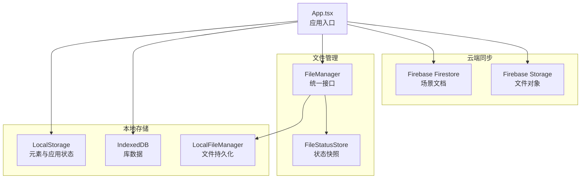
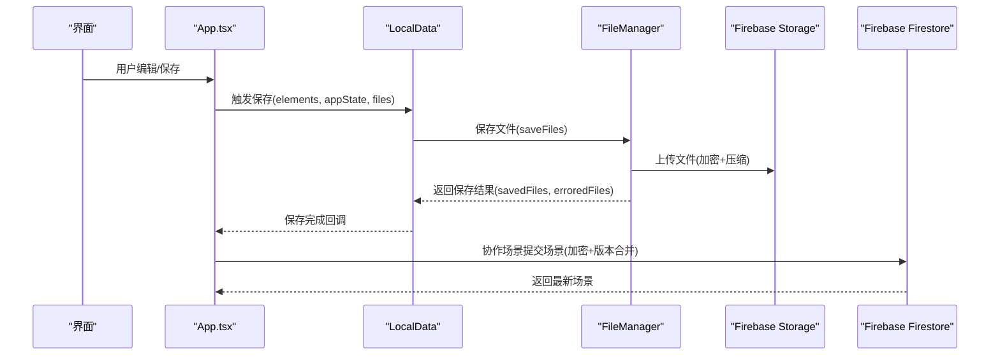
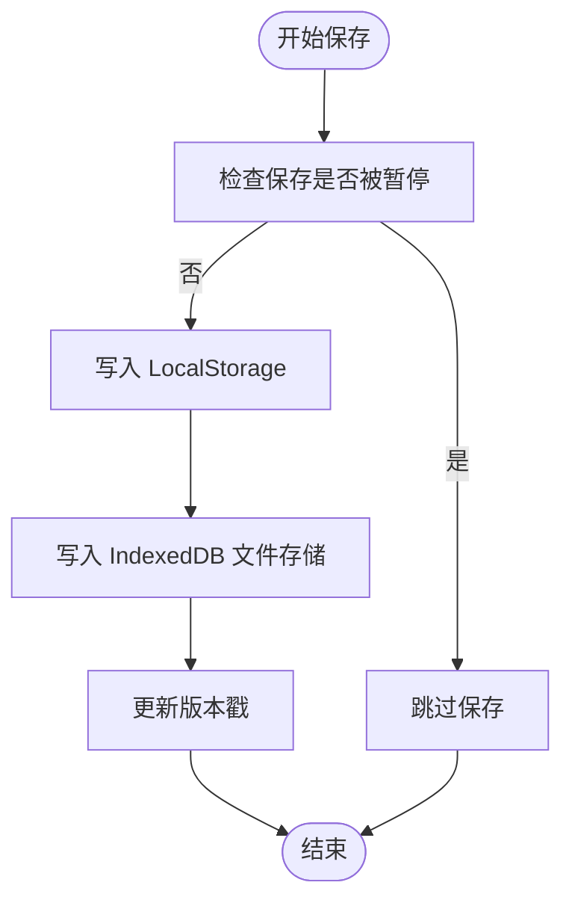
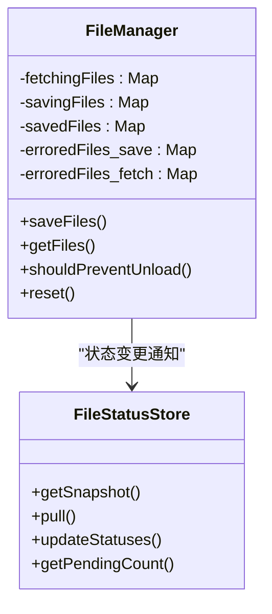
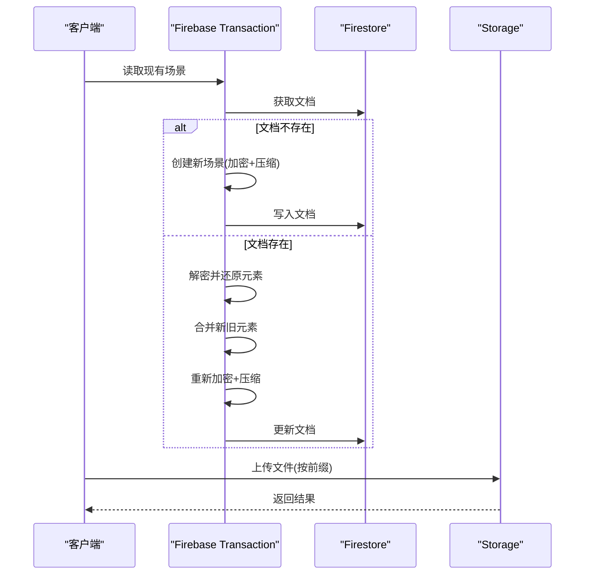
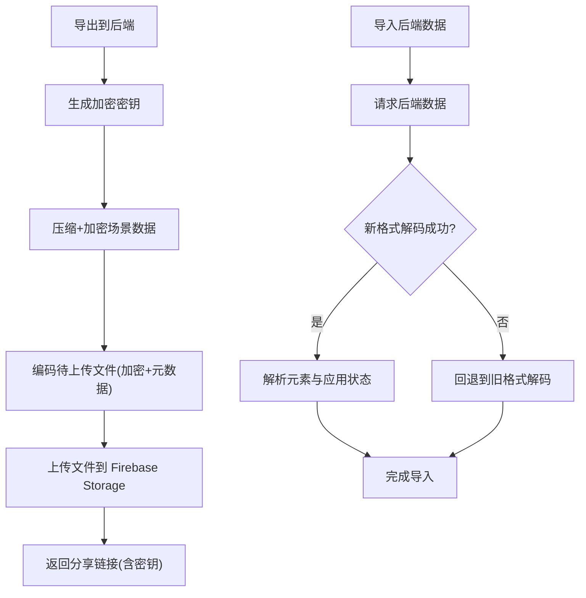
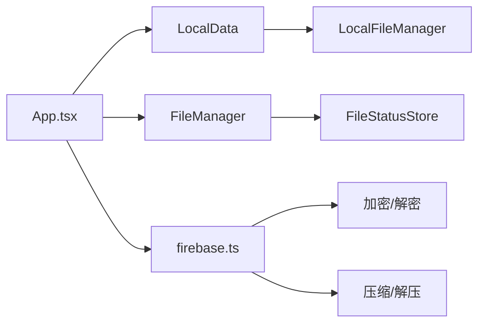

# 数据存储系统

<cite>
**本文引用的文件**
- [excalidraw-app/data/index.ts](file://excalidraw-app/data/index.ts)
- [excalidraw-app/data/LocalData.ts](file://excalidraw-app/data/LocalData.ts)
- [excalidraw-app/data/localStorage.ts](file://excalidraw-app/data/localStorage.ts)
- [excalidraw-app/data/firebase.ts](file://excalidraw-app/data/firebase.ts)
- [excalidraw-app/data/FileManager.ts](file://excalidraw-app/data/FileManager.ts)
- [excalidraw-app/data/fileStatusStore.ts](file://excalidraw-app/data/fileStatusStore.ts)
- [excalidraw-app/data/locker.ts](file://excalidraw-app/data/locker.ts)
- [excalidraw-app/data/tabsync.ts](file://excalidraw-app/data/tabSync.ts)
- [excalidraw-app/app_constants.ts](file://excalidraw-app/app_constants.ts)
- [excalidraw-app/App.tsx](file://excalidraw-app/App.tsx)
</cite>

## 目录
1. [简介](#简介)
2. [项目结构](#项目结构)
3. [核心组件](#核心组件)
4. [架构总览](#架构总览)
5. [详细组件分析](#详细组件分析)
6. [依赖关系分析](#依赖关系分析)
7. [性能考量](#性能考量)
8. [故障排查指南](#故障排查指南)
9. [结论](#结论)
10. [附录](#附录)

## 简介
本文件面向开发者与架构师，系统性梳理本项目的“数据存储系统”。内容覆盖：
- 本地存储策略：IndexedDB 使用、LocalStorage 配置与缓存机制
- 云端同步机制：Firebase 集成、数据迁移与版本管理
- 文件管理系统：图片上传、文件状态跟踪与存储配额管理
- 数据序列化、反序列化与完整性校验
- 备份、恢复与迁移流程
- 性能优化、存储限制处理与错误恢复
- 数据安全、隐私保护与访问控制

## 项目结构
围绕数据存储的关键模块分布如下：
- 本地存储层：LocalStorage（轻量状态）与 IndexedDB（大文件/库）
- 文件管理器：统一抽象的文件读写与状态跟踪
- 云端同步：Firebase Firestore 存储场景、Firebase Storage 存储文件
- 应用入口：在应用启动时加载本地数据、建立同步与错误处理

图表来源
- [excalidraw-app/App.tsx:110-135](file://excalidraw-app/App.tsx#L110-L135)
- [excalidraw-app/data/LocalData.ts:49-228](file://excalidraw-app/data/LocalData.ts#L49-L228)
- [excalidraw-app/data/FileManager.ts:22-226](file://excalidraw-app/data/FileManager.ts#L22-L226)
- [excalidraw-app/data/firebase.ts:83-320](file://excalidraw-app/data/firebase.ts#L83-L320)

章节来源
- [excalidraw-app/App.tsx:110-135](file://excalidraw-app/App.tsx#L110-L135)
- [excalidraw-app/data/LocalData.ts:49-228](file://excalidraw-app/data/LocalData.ts#L49-L228)
- [excalidraw-app/data/FileManager.ts:22-226](file://excalidraw-app/data/FileManager.ts#L22-L226)
- [excalidraw-app/data/firebase.ts:83-320](file://excalidraw-app/data/firebase.ts#L83-L320)

## 核心组件
- 本地数据保存器：负责将元素与应用状态写入 LocalStorage，并通过 IndexedDB 持久化文件；支持保存暂停与去抖动
- 文件管理器：统一抽象文件的保存与读取，维护状态机与错误重试
- Firebase 同步：以 Firestore 存储场景，以 Storage 存储文件，支持加密、压缩与版本比较
- 文件状态存储：基于版本快照的状态存储，用于 UI 展示与统计
- 锁机制：用于保存暂停（如协作场景）
- 标签页同步：通过 LocalStorage 版本戳实现跨标签页一致性

章节来源
- [excalidraw-app/data/LocalData.ts:117-228](file://excalidraw-app/data/LocalData.ts#L117-L228)
- [excalidraw-app/data/FileManager.ts:22-226](file://excalidraw-app/data/FileManager.ts#L22-L226)
- [excalidraw-app/data/firebase.ts:131-320](file://excalidraw-app/data/firebase.ts#L131-L320)
- [excalidraw-app/data/fileStatusStore.ts:7-48](file://excalidraw-app/data/fileStatusStore.ts#L7-L48)
- [excalidraw-app/data/locker.ts:1-19](file://excalidraw-app/data/locker.ts#L1-L19)
- [excalidraw-app/data/tabsync.ts:12-25](file://excalidraw-app/data/tabsync.ts#L12-L25)

## 架构总览
整体采用“本地优先 + 云端同步”的混合架构：
- 元素与应用状态优先落盘到 LocalStorage，文件通过 IndexedDB 或云端存储
- 文件操作由 FileManager 统一调度，结合状态存储与锁机制
- 协作场景使用 Firebase Firestore 做场景版本合并，Firebase Storage 做文件分发
- 通过版本戳与快照实现跨标签页与跨会话的一致性

图表来源
- [excalidraw-app/App.tsx:110-135](file://excalidraw-app/App.tsx#L110-L135)
- [excalidraw-app/data/LocalData.ts:117-147](file://excalidraw-app/data/LocalData.ts#L117-L147)
- [excalidraw-app/data/FileManager.ts:92-137](file://excalidraw-app/data/FileManager.ts#L92-L137)
- [excalidraw-app/data/firebase.ts:145-172](file://excalidraw-app/data/firebase.ts#L145-L172)
- [excalidraw-app/data/firebase.ts:187-247](file://excalidraw-app/data/firebase.ts#L187-L247)

## 详细组件分析

### 本地存储策略：LocalStorage 与 IndexedDB
- LocalStorage 负责保存非敏感的轻量状态（如元素、应用状态），并在容量不足时进行错误上报
- IndexedDB 用于库数据与文件数据的持久化，避免 LocalStorage 的大小限制
- 保存过程包含去抖动与暂停逻辑，防止频繁写入与竞态
- 文件清理策略：对未使用的文件在一定时间后清理，释放空间

图表来源
- [excalidraw-app/data/LocalData.ts:117-165](file://excalidraw-app/data/LocalData.ts#L117-L165)
- [excalidraw-app/data/LocalData.ts:169-227](file://excalidraw-app/data/LocalData.ts#L169-L227)
- [excalidraw-app/data/tabsync.ts:17-25](file://excalidraw-app/data/tabsync.ts#L17-L25)

章节来源
- [excalidraw-app/data/LocalData.ts:73-109](file://excalidraw-app/data/LocalData.ts#L73-L109)
- [excalidraw-app/data/LocalData.ts:169-227](file://excalidraw-app/data/LocalData.ts#L169-L227)
- [excalidraw-app/data/tabsync.ts:12-25](file://excalidraw-app/data/tabsync.ts#L12-L25)

### 文件管理系统：上传、状态跟踪与配额
- FileManager 抽象了文件的保存与读取，内部维护“正在保存/已保存/错误/正在获取”等状态机
- 支持批量上传、错误聚合与 UI 状态反馈
- 文件编码：对单个文件进行压缩与加密，支持最大体积限制
- 状态存储：FileStatusStore 提供版本化的状态快照，便于 UI 统计与渲染

图表来源
- [excalidraw-app/data/FileManager.ts:22-226](file://excalidraw-app/data/FileManager.ts#L22-L226)
- [excalidraw-app/data/fileStatusStore.ts:7-48](file://excalidraw-app/data/fileStatusStore.ts#L7-L48)

章节来源
- [excalidraw-app/data/FileManager.ts:92-137](file://excalidraw-app/data/FileManager.ts#L92-L137)
- [excalidraw-app/data/FileManager.ts:139-180](file://excalidraw-app/data/FileManager.ts#L139-L180)
- [excalidraw-app/data/FileManager.ts:228-270](file://excalidraw-app/data/FileManager.ts#L228-L270)
- [excalidraw-app/data/fileStatusStore.ts:20-35](file://excalidraw-app/data/fileStatusStore.ts#L20-L35)

### 云端同步机制：Firebase 集成、版本管理与迁移
- 场景存储：Firestore 文档存储加密后的场景数据，使用事务保证一致性，并进行版本比较与元素合并
- 文件存储：Firebase Storage 以带前缀的路径存储文件，设置缓存策略
- 加密与压缩：场景与文件均采用加密与压缩，确保传输与存储安全
- 版本缓存：Socket 级别的场景版本缓存，避免重复保存

图表来源
- [excalidraw-app/data/firebase.ts:187-247](file://excalidraw-app/data/firebase.ts#L187-L247)
- [excalidraw-app/data/firebase.ts:145-172](file://excalidraw-app/data/firebase.ts#L145-L172)

章节来源
- [excalidraw-app/data/firebase.ts:83-147](file://excalidraw-app/data/firebase.ts#L83-L147)
- [excalidraw-app/data/firebase.ts:174-247](file://excalidraw-app/data/firebase.ts#L174-L247)
- [excalidraw-app/data/firebase.ts:249-272](file://excalidraw-app/data/firebase.ts#L249-L272)
- [excalidraw-app/data/firebase.ts:274-319](file://excalidraw-app/data/firebase.ts#L274-L319)

### 数据序列化、反序列化与完整性验证
- 场景序列化：将元素、应用状态与二进制文件序列化为数据库格式字符串
- 压缩与加密：对序列化结果进行压缩与加密，生成可传输的字节流
- 反序列化与恢复：从云端或本地读取后解密、解压并恢复元素
- 完整性校验：通过版本戳与快照对比，确保跨标签页与跨会话一致性

章节来源
- [excalidraw-app/data/index.ts:255-260](file://excalidraw-app/data/index.ts#L255-L260)
- [excalidraw-app/data/index.ts:215-236](file://excalidraw-app/data/index.ts#L215-L236)
- [excalidraw-app/data/firebase.ts:93-116](file://excalidraw-app/data/firebase.ts#L93-L116)
- [excalidraw-app/data/tabsync.ts:12-25](file://excalidraw-app/data/tabsync.ts#L12-L25)

### 备份、恢复与迁移流程
- 备份：导出到后端时生成分享链接（含密钥），同时上传文件至 Firebase Storage
- 恢复：导入后端数据时先尝试新格式解码，失败则回退到旧格式
- 迁移：库数据从 LocalStorage 迁移到 IndexedDB，完成后清理旧键

图表来源
- [excalidraw-app/data/index.ts:248-307](file://excalidraw-app/data/index.ts#L248-L307)
- [excalidraw-app/data/index.ts:170-242](file://excalidraw-app/data/index.ts#L170-L242)
- [excalidraw-app/data/LocalData.ts:258-277](file://excalidraw-app/data/LocalData.ts#L258-L277)

章节来源
- [excalidraw-app/data/index.ts:248-307](file://excalidraw-app/data/index.ts#L248-L307)
- [excalidraw-app/data/index.ts:170-242](file://excalidraw-app/data/index.ts#L170-L242)
- [excalidraw-app/data/LocalData.ts:258-277](file://excalidraw-app/data/LocalData.ts#L258-L277)

### 数据安全、隐私保护与访问控制
- 传输与存储加密：场景与文件均采用加密，密钥不随请求发送到后端
- 密钥管理：分享链接与协作房间分别生成独立密钥，密钥仅存在于前端哈希中
- 访问控制：Firebase 规则需在项目侧配置（仓库包含规则文件），确保最小权限
- 隐私保护：用户协作名单独存储于 LocalStorage，避免与场景数据耦合

章节来源
- [excalidraw-app/data/index.ts:148-164](file://excalidraw-app/data/index.ts#L148-L164)
- [excalidraw-app/data/index.ts:282-291](file://excalidraw-app/data/index.ts#L282-L291)
- [excalidraw-app/data/localStorage.ts:11-35](file://excalidraw-app/data/localStorage.ts#L11-L35)

## 依赖关系分析
- 组件内聚与耦合
  - LocalData 与 FileManager 高内聚，通过接口解耦文件存储后端
  - Firebase 模块独立封装初始化与事务，避免全局污染
  - FileStatusStore 作为纯状态存储，被 FileManager 与 UI 订阅
- 外部依赖
  - idb-keyval：IndexedDB 封装
  - Firebase SDK：Firestore 与 Storage
  - i18n：错误提示国际化

图表来源
- [excalidraw-app/App.tsx:110-135](file://excalidraw-app/App.tsx#L110-L135)
- [excalidraw-app/data/LocalData.ts:169-227](file://excalidraw-app/data/LocalData.ts#L169-L227)
- [excalidraw-app/data/FileManager.ts:22-65](file://excalidraw-app/data/FileManager.ts#L22-L65)
- [excalidraw-app/data/firebase.ts:104-116](file://excalidraw-app/data/firebase.ts#L104-L116)

章节来源
- [excalidraw-app/App.tsx:110-135](file://excalidraw-app/App.tsx#L110-L135)
- [excalidraw-app/data/LocalData.ts:169-227](file://excalidraw-app/data/LocalData.ts#L169-L227)
- [excalidraw-app/data/FileManager.ts:22-65](file://excalidraw-app/data/FileManager.ts#L22-L65)
- [excalidraw-app/data/firebase.ts:104-116](file://excalidraw-app/data/firebase.ts#L104-L116)

## 性能考量
- 去抖动保存：本地保存与文件保存均采用去抖动，降低写入频率
- 批量上传：文件上传采用 Promise.all 并发，提升吞吐
- 缓存策略：文件在 Firebase Storage 设置长缓存，减少重复下载
- 版本控制：场景版本缓存与快照对比，避免重复计算与网络往返
- 体积限制：文件上传最大体积限制，防止超限导致失败

章节来源
- [excalidraw-app/app_constants.ts:1-15](file://excalidraw-app/app_constants.ts#L1-L15)
- [excalidraw-app/data/FileManager.ts:157-174](file://excalidraw-app/data/FileManager.ts#L157-L174)
- [excalidraw-app/data/firebase.ts:161-163](file://excalidraw-app/data/firebase.ts#L161-L163)
- [excalidraw-app/data/FileManager.ts:255-261](file://excalidraw-app/data/FileManager.ts#L255-L261)

## 故障排查指南
- LocalStorage 容量不足
  - 现象：写入抛出配额错误，UI 显示配额告警
  - 排查：检查当前存储占用与阈值，清理无用文件
  - 参考：容量检测与告警状态原子
- 文件上传失败
  - 现象：部分文件保存失败，状态标记为 error
  - 排查：检查网络、体积限制与加密密钥；重试或清理缓存
- 云端场景不同步
  - 现象：协作场景未更新或冲突
  - 排查：确认版本戳、事务执行结果与合并逻辑
- 跨标签页不一致
  - 现象：一个标签页保存后其他标签页未感知
  - 排查：检查版本戳更新与快照拉取

章节来源
- [excalidraw-app/data/LocalData.ts:102-108](file://excalidraw-app/data/LocalData.ts#L102-L108)
- [excalidraw-app/data/FileManager.ts:115-136](file://excalidraw-app/data/FileManager.ts#L115-L136)
- [excalidraw-app/data/firebase.ts:206-238](file://excalidraw-app/data/firebase.ts#L206-L238)
- [excalidraw-app/data/tabsync.ts:12-25](file://excalidraw-app/data/tabsync.ts#L12-L25)

## 结论
本数据存储系统以“本地优先、云端增强”为核心设计，结合去抖动、并发上传、版本控制与状态快照，实现了高性能、高可靠的数据持久化与协作同步。通过严格的加密与密钥管理、清晰的文件状态跟踪与错误恢复机制，系统在复杂场景下仍能保持良好的用户体验与数据一致性。

## 附录
- 关键常量与配置
  - 保存去抖动间隔、文件上传最大体积、缓存有效期等
- 重要接口路径
  - 本地保存：[excalidraw-app/data/LocalData.ts:117-147](file://excalidraw-app/data/LocalData.ts#L117-L147)
  - 文件上传：[excalidraw-app/data/FileManager.ts:228-270](file://excalidraw-app/data/FileManager.ts#L228-L270)
  - 云端保存：[excalidraw-app/data/firebase.ts:187-247](file://excalidraw-app/data/firebase.ts#L187-L247)
  - 导入/导出：[excalidraw-app/data/index.ts:248-307](file://excalidraw-app/data/index.ts#L248-L307)

章节来源
- [excalidraw-app/app_constants.ts:1-62](file://excalidraw-app/app_constants.ts#L1-L62)
- [excalidraw-app/data/LocalData.ts:117-147](file://excalidraw-app/data/LocalData.ts#L117-L147)
- [excalidraw-app/data/FileManager.ts:228-270](file://excalidraw-app/data/FileManager.ts#L228-L270)
- [excalidraw-app/data/firebase.ts:187-247](file://excalidraw-app/data/firebase.ts#L187-L247)
- [excalidraw-app/data/index.ts:248-307](file://excalidraw-app/data/index.ts#L248-L307)