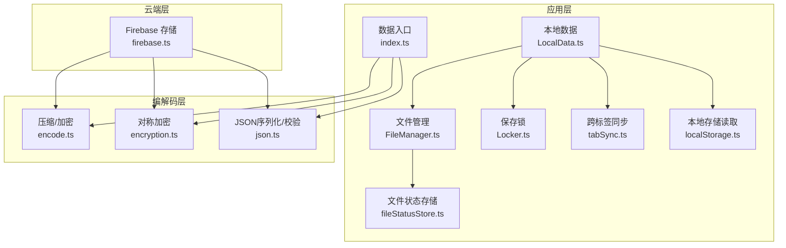
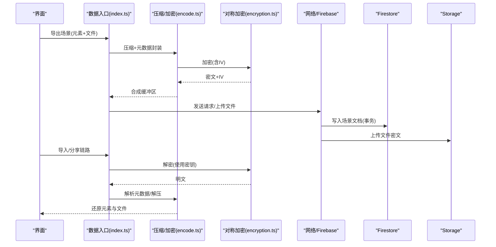
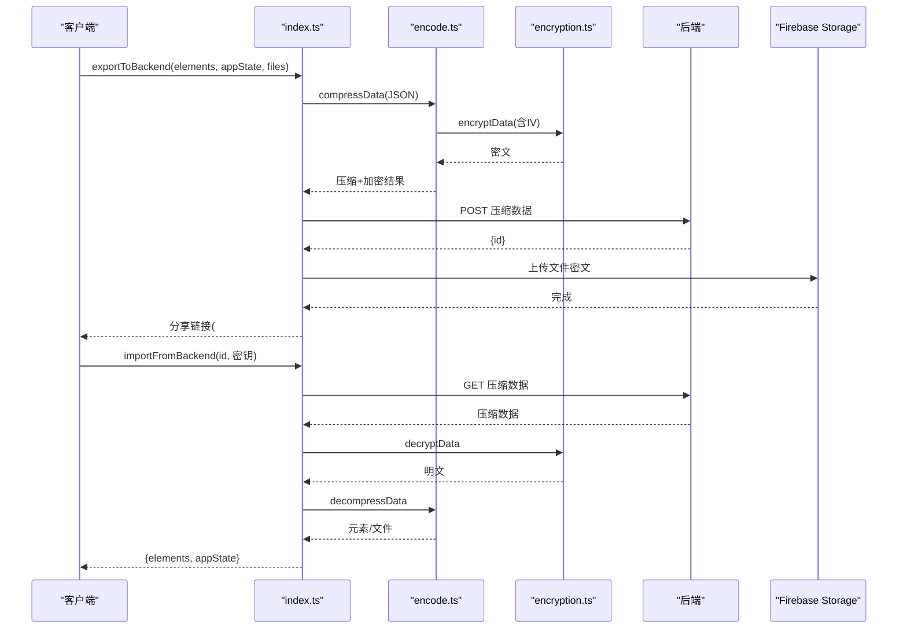
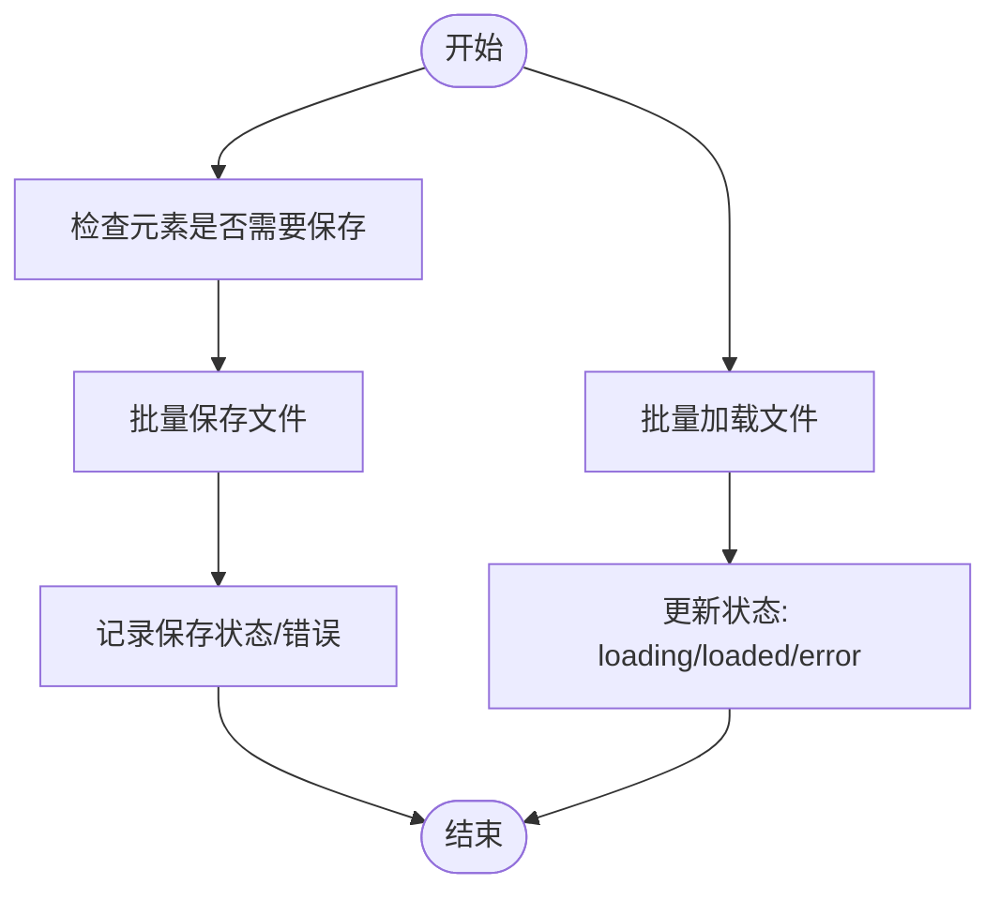
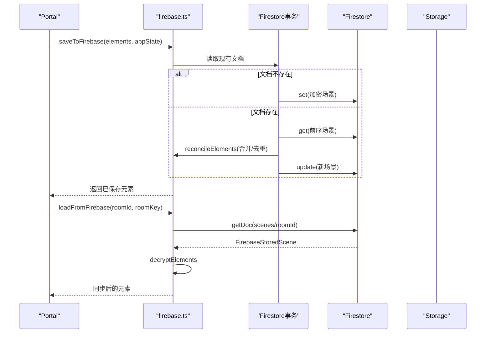
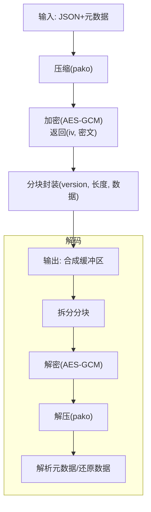
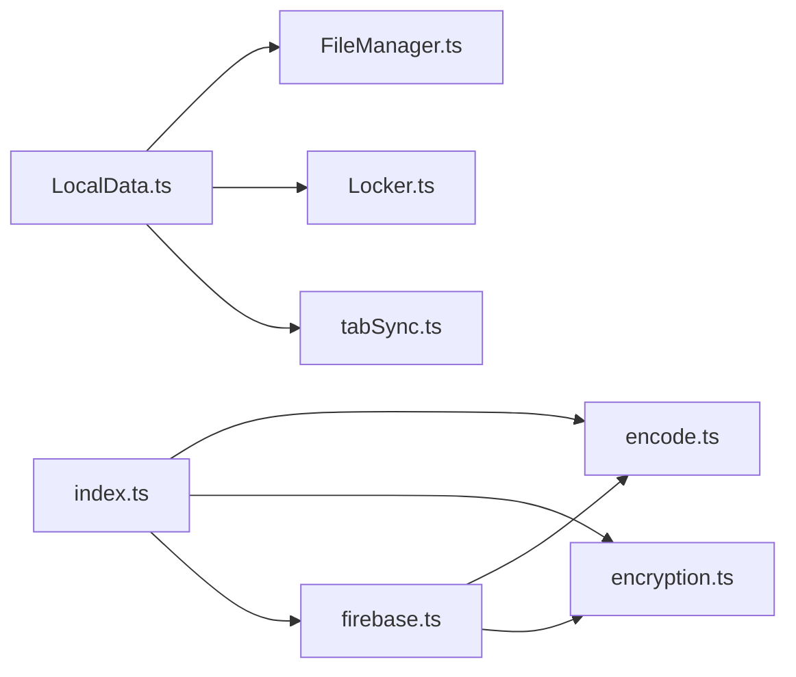

# 数据迁移与恢复

<cite>
**本文引用的文件**
- [excalidraw-app/data/index.ts](file://excalidraw-app/data/index.ts)
- [excalidraw-app/data/LocalData.ts](file://excalidraw-app/data/LocalData.ts)
- [excalidraw-app/data/FileManager.ts](file://excalidraw-app/data/FileManager.ts)
- [excalidraw-app/data/locker.ts](file://excalidraw-app/data/Locker.ts)
- [excalidraw-app/data/localStorage.ts](file://excalidraw-app/data/localStorage.ts)
- [excalidraw-app/data/firebase.ts](file://excalidraw-app/data/firebase.ts)
- [excalidraw-app/data/tabSync.ts](file://excalidraw-app/data/tabSync.ts)
- [excalidraw-app/data/fileStatusStore.ts](file://excalidraw-app/data/fileStatusStore.ts)
- [packages/excalidraw/data/encode.ts](file://packages/excalidraw/data/encode.ts)
- [packages/excalidraw/data/encryption.ts](file://packages/excalidraw/data/encryption.ts)
- [packages/excalidraw/data/json.ts](file://packages/excalidraw/data/json.ts)
</cite>

## 目录

1. [引言](#引言)
2. [项目结构](#项目结构)
3. [核心组件](#核心组件)
4. [架构总览](#架构总览)
5. [详细组件分析](#详细组件分析)
6. [依赖关系分析](#依赖关系分析)
7. [性能考量](#性能考量)
8. [故障排查指南](#故障排查指南)
9. [结论](#结论)
10. [附录](#附录)

## 引言

本技术文档聚焦于 Excalidraw 项目中的“数据迁移与恢复”能力，系统阐述数据格式演进与版本升级策略、向后兼容性保障、数据转换机制、从旧存储格式到新格式的迁移流程、数据映射与验证、回滚机制、灾难恢复（备份、快照与故障转移）、数据完整性校验与修复、批量迁移与断点续传、以及压缩、加密与隐私保护等主题。文档以代码为依据，结合可视化图示，帮助读者在不深入源码的情况下理解整体设计与实现要点。

## 项目结构

围绕数据迁移与恢复的关键模块主要分布在以下位置：

- 应用侧数据导出/导入与分享链接生成：excalidraw-app/data/index.ts
- 本地持久化（localStorage + IndexedDB）与库迁移适配器：excalidraw-app/data/LocalData.ts
- 文件管理与状态跟踪：excalidraw-app/data/FileManager.ts、excalidraw-app/data/fileStatusStore.ts
- 协作场景下的云端存储（Firebase Firestore/Storage）：excalidraw-app/data/firebase.ts
- 本地锁与保存暂停控制：excalidraw-app/data/Locker.ts
- 本地存储读取与容量统计：excalidraw-app/data/localStorage.ts
- 跨标签页状态同步：excalidraw-app/data/tabSync.ts
- 编解码与压缩/加密：packages/excalidraw/data/encode.ts、packages/excalidraw/data/encryption.ts
- JSON 序列化与校验：packages/excalidraw/data/json.ts



图表来源

- [excalidraw-app/data/index.ts:1-308](file://excalidraw-app/data/index.ts#L1-L308)
- [excalidraw-app/data/LocalData.ts:1-278](file://excalidraw-app/data/LocalData.ts#L1-L278)
- [excalidraw-app/data/FileManager.ts:1-297](file://excalidraw-app/data/FileManager.ts#L1-L297)
- [excalidraw-app/data/Locker.ts:1-19](file://excalidraw-app/data/Locker.ts#L1-L19)
- [excalidraw-app/data/localStorage.ts:1-101](file://excalidraw-app/data/localStorage.ts#L1-L101)
- [excalidraw-app/data/firebase.ts:1-320](file://excalidraw-app/data/firebase.ts#L1-L320)
- [excalidraw-app/data/tabSync.ts:1-40](file://excalidraw-app/data/tabSync.ts#L1-L40)
- [excalidraw-app/data/fileStatusStore.ts:1-49](file://excalidraw-app/data/fileStatusStore.ts#L1-L49)
- [packages/excalidraw/data/encode.ts:1-415](file://packages/excalidraw/data/encode.ts#L1-L415)
- [packages/excalidraw/data/encryption.ts:1-95](file://packages/excalidraw/data/encryption.ts#L1-L95)
- [packages/excalidraw/data/json.ts:1-160](file://packages/excalidraw/data/json.ts#L1-L160)

章节来源

- [excalidraw-app/data/index.ts:1-308](file://excalidraw-app/data/index.ts#L1-L308)
- [excalidraw-app/data/LocalData.ts:1-278](file://excalidraw-app/data/LocalData.ts#L1-L278)
- [excalidraw-app/data/FileManager.ts:1-297](file://excalidraw-app/data/FileManager.ts#L1-L297)
- [excalidraw-app/data/Locker.ts:1-19](file://excalidraw-app/data/Locker.ts#L1-L19)
- [excalidraw-app/data/localStorage.ts:1-101](file://excalidraw-app/data/localStorage.ts#L1-L101)
- [excalidraw-app/data/firebase.ts:1-320](file://excalidraw-app/data/firebase.ts#L1-L320)
- [excalidraw-app/data/tabSync.ts:1-40](file://excalidraw-app/data/tabSync.ts#L1-L40)
- [excalidraw-app/data/fileStatusStore.ts:1-49](file://excalidraw-app/data/fileStatusStore.ts#L1-L49)
- [packages/excalidraw/data/encode.ts:1-415](file://packages/excalidraw/data/encode.ts#L1-L415)
- [packages/excalidraw/data/encryption.ts:1-95](file://packages/excalidraw/data/encryption.ts#L1-L95)
- [packages/excalidraw/data/json.ts:1-160](file://packages/excalidraw/data/json.ts#L1-L160)

## 核心组件

- 数据导出/导入与分享链路：负责将场景元素、应用状态与二进制文件打包、压缩、加密并通过后端接口或 Firebase 进行传输与存储；同时支持旧格式解码回退。
- 本地持久化：将元素、应用状态与文件分别保存至 localStorage 与 IndexedDB，并通过锁机制与节流避免冲突与性能问题。
- 文件管理与状态跟踪：统一追踪文件保存/加载状态，支持批量上传、错误重试与 UI 状态反馈。
- 云端协作存储：基于 Firebase Firestore 与 Storage，提供事务性写入、元素去重与合并、文件解压解密下载。
- 编解码与加密：提供压缩（zlib/pako）、加密（AES-GCM）、元数据封装与版本标记，确保可迁移性与安全性。
- JSON 序列化与校验：定义数据类型、版本号与校验规则，保障导入/导出一致性。

章节来源

- [excalidraw-app/data/index.ts:202-308](file://excalidraw-app/data/index.ts#L202-L308)
- [excalidraw-app/data/LocalData.ts:117-228](file://excalidraw-app/data/LocalData.ts#L117-L228)
- [excalidraw-app/data/FileManager.ts:22-226](file://excalidraw-app/data/FileManager.ts#L22-L226)
- [excalidraw-app/data/firebase.ts:187-272](file://excalidraw-app/data/firebase.ts#L187-L272)
- [packages/excalidraw/data/encode.ts:322-412](file://packages/excalidraw/data/encode.ts#L322-L412)
- [packages/excalidraw/data/encryption.ts:50-94](file://packages/excalidraw/data/encryption.ts#L50-L94)
- [packages/excalidraw/data/json.ts:52-160](file://packages/excalidraw/data/json.ts#L52-L160)

## 架构总览

下图展示了从本地到云端的典型数据流转路径，包括压缩/加密、文件编码、云端存储与回读解码的全链路。



图表来源

- [excalidraw-app/data/index.ts:248-308](file://excalidraw-app/data/index.ts#L248-L308)
- [packages/excalidraw/data/encode.ts:322-412](file://packages/excalidraw/data/encode.ts#L322-L412)
- [packages/excalidraw/data/encryption.ts:50-94](file://packages/excalidraw/data/encryption.ts#L50-L94)
- [excalidraw-app/data/firebase.ts:187-272](file://excalidraw-app/data/firebase.ts#L187-L272)

## 详细组件分析

### 组件 A：数据导出/导入与分享链路（index.ts）

职责与特性

- 将元素、应用状态与二进制文件序列化为 JSON，再进行压缩与加密，通过 HTTP 接口上传；同时支持 Firebase 文件上传。
- 导入时优先尝试新格式解码，失败则回退到旧格式兼容逻辑。
- 生成分享链接，包含场景 ID 与加密密钥（作为 URL 哈希），避免明文泄露。

关键流程

- 导出：序列化 -> 压缩 -> 加密 -> 提交后端 -> 上传文件 -> 返回分享链接。
- 导入：拉取后端数据 -> 新格式解码 -> 失败回退旧格式 -> 还原元素与文件。



图表来源

- [excalidraw-app/data/index.ts:202-308](file://excalidraw-app/data/index.ts#L202-L308)
- [packages/excalidraw/data/encode.ts:322-412](file://packages/excalidraw/data/encode.ts#L322-L412)
- [packages/excalidraw/data/encryption.ts:50-94](file://packages/excalidraw/data/encryption.ts#L50-L94)

章节来源

- [excalidraw-app/data/index.ts:202-308](file://excalidraw-app/data/index.ts#L202-L308)

### 组件 B：本地持久化与库迁移（LocalData.ts）

职责与特性

- 将元素与应用状态写入 localStorage，文件存入 IndexedDB（idb-keyval），并维护版本戳以支持跨标签页同步。
- 提供保存暂停（锁）机制，避免页面隐藏或特定场景下的并发写入。
- 提供库数据的 localStorage 到 IndexedDB 迁移适配器，完成一次性迁移与清理。

```mermaid
classDiagram
class LocalData {
+save(elements, appState, files, onFilesSaved)
+flushSave()
+pauseSave(lockType)
+resumeSave(lockType)
+isSavePaused() bool
-_save(...)
}
class LocalFileManager {
+getFiles(ids)
+saveFiles({addedFiles})
+clearObsoleteFiles(opts)
}
class Locker {
+lock(lockType)
+unlock(lockType) bool
+isLocked(lockType?) bool
}
class LibraryLocalStorageMigrationAdapter {
+load()
+clear()
}
class LibraryIndexedDBAdapter {
+load()
+save(data)
}
LocalData --> LocalFileManager : "使用"
LocalData --> Locker : "持有"
LocalData --> LibraryIndexedDBAdapter : "写入库"
LibraryLocalStorageMigrationAdapter --> LibraryIndexedDBAdapter : "迁移"
```

图表来源

- [excalidraw-app/data/LocalData.ts:117-278](file://excalidraw-app/data/LocalData.ts#L117-L278)
- [excalidraw-app/data/Locker.ts:1-19](file://excalidraw-app/data/Locker.ts#L1-L19)

章节来源

- [excalidraw-app/data/LocalData.ts:117-278](file://excalidraw-app/data/LocalData.ts#L117-L278)
- [excalidraw-app/data/Locker.ts:1-19](file://excalidraw-app/data/Locker.ts#L1-L19)

### 组件 C：文件管理与状态跟踪（FileManager.ts）

职责与特性

- 统一追踪文件保存/加载状态，避免重复处理与竞态。
- 批量保存/加载文件，记录错误文件集合以便后续重试或提示。
- 对图片元素状态进行更新，支持“加载中/已加载/错误”三态反馈。



图表来源

- [excalidraw-app/data/FileManager.ts:92-180](file://excalidraw-app/data/FileManager.ts#L92-L180)
- [excalidraw-app/data/fileStatusStore.ts:7-48](file://excalidraw-app/data/fileStatusStore.ts#L7-L48)

章节来源

- [excalidraw-app/data/FileManager.ts:22-226](file://excalidraw-app/data/FileManager.ts#L22-L226)
- [excalidraw-app/data/fileStatusStore.ts:1-49](file://excalidraw-app/data/fileStatusStore.ts#L1-L49)

### 组件 D：云端协作存储（firebase.ts）

职责与特性

- 使用 Firebase Firestore 存储场景文档（AES-GCM 加密），支持事务性写入与版本比较。
- 使用 Firebase Storage 存储文件密文，按需下载并解压解密。
- 提供“是否已保存”的判断，避免重复写入。



图表来源

- [excalidraw-app/data/firebase.ts:187-272](file://excalidraw-app/data/firebase.ts#L187-L272)
- [excalidraw-app/data/firebase.ts:274-319](file://excalidraw-app/data/firebase.ts#L274-L319)

章节来源

- [excalidraw-app/data/firebase.ts:187-272](file://excalidraw-app/data/firebase.ts#L187-L272)
- [excalidraw-app/data/firebase.ts:274-319](file://excalidraw-app/data/firebase.ts#L274-L319)

### 组件 E：编解码与加密（encode.ts, encryption.ts）

职责与特性

- 压缩：采用 zlib/pako 进行内容压缩，支持版本化封装与分块拼接。
- 加密：AES-GCM 对内容与元数据进行加密，返回 IV 与密文，确保机密性与完整性。
- 版本标记：在元数据中记录版本信息，便于未来迁移与兼容处理。



图表来源

- [packages/excalidraw/data/encode.ts:322-412](file://packages/excalidraw/data/encode.ts#L322-L412)
- [packages/excalidraw/data/encryption.ts:50-94](file://packages/excalidraw/data/encryption.ts#L50-L94)

章节来源

- [packages/excalidraw/data/encode.ts:322-412](file://packages/excalidraw/data/encode.ts#L322-L412)
- [packages/excalidraw/data/encryption.ts:50-94](file://packages/excalidraw/data/encryption.ts#L50-L94)

### 组件 F：JSON 序列化与校验（json.ts）

职责与特性

- 定义导出/导入数据结构与版本号，提供序列化与反序列化工具。
- 校验导入数据的类型与字段，确保兼容性与健壮性。
- 支持库文件的导出/导入与版本判断。

章节来源

- [packages/excalidraw/data/json.ts:52-160](file://packages/excalidraw/data/json.ts#L52-L160)

## 依赖关系分析

- 模块耦合
  - index.ts 依赖 encode.ts 与 encryption.ts 进行数据打包与加解密；依赖 firebase.ts 进行云端文件上传。
  - LocalData.ts 依赖 FileManager.ts 进行文件存取，依赖 Locker.ts 进行保存控制，依赖 tabSync.ts 进行跨标签页版本同步。
  - firebase.ts 依赖 encode.ts 与 encryption.ts 进行云端数据的解压与解密。
- 外部依赖
  - pako 用于压缩/解压。
  - Web Crypto API 用于 AES-GCM 加解密与随机 IV 生成。
  - Firebase SDK 用于 Firestore 与 Storage 操作。
- 循环依赖
  - 未发现直接循环依赖；各模块职责清晰，通过函数调用与异步流程解耦。



图表来源

- [excalidraw-app/data/index.ts:1-308](file://excalidraw-app/data/index.ts#L1-L308)
- [excalidraw-app/data/LocalData.ts:1-278](file://excalidraw-app/data/LocalData.ts#L1-L278)
- [excalidraw-app/data/FileManager.ts:1-297](file://excalidraw-app/data/FileManager.ts#L1-L297)
- [excalidraw-app/data/Locker.ts:1-19](file://excalidraw-app/data/Locker.ts#L1-L19)
- [excalidraw-app/data/tabSync.ts:1-40](file://excalidraw-app/data/tabSync.ts#L1-L40)
- [excalidraw-app/data/firebase.ts:1-320](file://excalidraw-app/data/firebase.ts#L1-L320)
- [packages/excalidraw/data/encode.ts:1-415](file://packages/excalidraw/data/encode.ts#L1-L415)
- [packages/excalidraw/data/encryption.ts:1-95](file://packages/excalidraw/data/encryption.ts#L1-L95)

章节来源

- [excalidraw-app/data/index.ts:1-308](file://excalidraw-app/data/index.ts#L1-L308)
- [excalidraw-app/data/LocalData.ts:1-278](file://excalidraw-app/data/LocalData.ts#L1-L278)
- [excalidraw-app/data/FileManager.ts:1-297](file://excalidraw-app/data/FileManager.ts#L1-L297)
- [excalidraw-app/data/Locker.ts:1-19](file://excalidraw-app/data/Locker.ts#L1-L19)
- [excalidraw-app/data/tabSync.ts:1-40](file://excalidraw-app/data/tabSync.ts#L1-L40)
- [excalidraw-app/data/firebase.ts:1-320](file://excalidraw-app/data/firebase.ts#L1-L320)
- [packages/excalidraw/data/encode.ts:1-415](file://packages/excalidraw/data/encode.ts#L1-L415)
- [packages/excalidraw/data/encryption.ts:1-95](file://packages/excalidraw/data/encryption.ts#L1-L95)

## 性能考量

- 批量处理
  - FileManager 对文件保存/加载使用 Promise.all 并行处理，显著提升吞吐。
  - LocalData 对保存进行去抖动（debounce）以减少频繁写入。
- 状态追踪与 UI 反馈
  - FileStatusStore 提供版本化的快照与变更检测，降低渲染成本。
- 存储选择
  - 元素与应用状态写入 localStorage，文件写入 IndexedDB，兼顾容量与性能。
- 压缩与加密
  - 仅对大体量数据进行压缩，避免小数据的额外开销；AES-GCM 在浏览器端硬件加速可用时具备良好性能。
- 并发控制
  - Locker 与 isSavePaused 配合，避免页面隐藏或特定场景下的并发写入导致的冲突。

章节来源

- [excalidraw-app/data/FileManager.ts:213-223](file://excalidraw-app/data/FileManager.ts#L213-L223)
- [excalidraw-app/data/LocalData.ts:118-134](file://excalidraw-app/data/LocalData.ts#L118-L134)
- [excalidraw-app/data/fileStatusStore.ts:7-48](file://excalidraw-app/data/fileStatusStore.ts#L7-L48)
- [excalidraw-app/data/LocalData.ts:153-165](file://excalidraw-app/data/LocalData.ts#L153-L165)

## 故障排查指南

- 导入失败
  - 现象：导入后端数据报错或为空。
  - 排查：确认密钥正确、网络可达；查看新格式解码异常后是否触发旧格式回退。
  - 参考：[excalidraw-app/data/index.ts:202-242](file://excalidraw-app/data/index.ts#L202-L242)
- 云端保存未生效
  - 现象：协作场景未更新或重复写入。
  - 排查：检查 isSavedToFirebase 判断与版本缓存；确认事务执行成功。
  - 参考：[excalidraw-app/data/firebase.ts:131-143](file://excalidraw-app/data/firebase.ts#L131-L143)、[excalidraw-app/data/firebase.ts:206-238](file://excalidraw-app/data/firebase.ts#L206-L238)
- 文件加载错误
  - 现象：图片元素状态停留在“错误”。
  - 排查：检查 Firebase Storage 访问权限与文件是否存在；确认解压解密流程无异常。
  - 参考：[excalidraw-app/data/FileManager.ts:139-180](file://excalidraw-app/data/FileManager.ts#L139-L180)、[excalidraw-app/data/firebase.ts:274-319](file://excalidraw-app/data/firebase.ts#L274-L319)
- 本地存储配额不足
  - 现象：localStorage 写入抛出 QuotaExceededError。
  - 排查：监控 localStorageQuotaExceededAtom 状态，清理非必要数据或降级到 IndexedDB。
  - 参考：[excalidraw-app/data/LocalData.ts:73-109](file://excalidraw-app/data/LocalData.ts#L73-L109)、[excalidraw-app/data/localStorage.ts:111-113](file://excalidraw-app/data/localStorage.ts#L111-L113)
- 跨标签页不同步
  - 现象：其他标签页未感知最新保存。
  - 排查：确认 updateBrowserStateVersion 与 isBrowserStorageStateNewer 逻辑正常。
  - 参考：[excalidraw-app/data/tabSync.ts:12-25](file://excalidraw-app/data/tabSync.ts#L12-L25)

章节来源

- [excalidraw-app/data/index.ts:202-242](file://excalidraw-app/data/index.ts#L202-L242)
- [excalidraw-app/data/firebase.ts:131-143](file://excalidraw-app/data/firebase.ts#L131-L143)
- [excalidraw-app/data/firebase.ts:206-238](file://excalidraw-app/data/firebase.ts#L206-L238)
- [excalidraw-app/data/FileManager.ts:139-180](file://excalidraw-app/data/FileManager.ts#L139-L180)
- [excalidraw-app/data/firebase.ts:274-319](file://excalidraw-app/data/firebase.ts#L274-L319)
- [excalidraw-app/data/LocalData.ts:73-109](file://excalidraw-app/data/LocalData.ts#L73-L109)
- [excalidraw-app/data/localStorage.ts:111-113](file://excalidraw-app/data/localStorage.ts#L111-L113)
- [excalidraw-app/data/tabSync.ts:12-25](file://excalidraw-app/data/tabSync.ts#L12-L25)

## 结论

本项目在数据迁移与恢复方面形成了“本地-云端一体化”的稳健方案：通过版本化元数据、压缩/加密与事务性写入，确保了数据演进的向后兼容与安全性；通过文件状态跟踪与跨标签页同步，提升了用户体验与可靠性。建议在生产环境中进一步完善断点续传、增量同步与更细粒度的错误恢复策略，以应对大规模场景与复杂网络环境。

## 附录

- 数据格式演进与版本升级策略
  - 在元数据中记录版本号（如文件编码版本、缓冲区版本），并在解码阶段进行版本校验与分支处理，确保新旧格式共存与平滑过渡。
  - 参考：[packages/excalidraw/data/encode.ts:150-158](file://packages/excalidraw/data/encode.ts#L150-L158)、[packages/excalidraw/data/encode.ts:255-291](file://packages/excalidraw/data/encode.ts#L255-L291)
- 向后兼容性保证与数据转换机制
  - 导入时优先尝试新格式解码，失败则回退旧格式（固定 IV 兼容），确保历史数据可读。
  - 参考：[excalidraw-app/data/index.ts:170-200](file://excalidraw-app/data/index.ts#L170-L200)、[excalidraw-app/data/index.ts:230-236](file://excalidraw-app/data/index.ts#L230-L236)
- 灾难恢复策略
  - 云端事务写入与文件独立存储，支持故障转移与重试；本地库迁移适配器提供一次性迁移路径。
  - 参考：[excalidraw-app/data/firebase.ts:206-238](file://excalidraw-app/data/firebase.ts#L206-L238)、[excalidraw-app/data/LocalData.ts:258-277](file://excalidraw-app/data/LocalData.ts#L258-L277)
- 数据完整性检查、校验与修复
  - AES-GCM 内置完整性校验；JSON 结构校验与类型检查；文件状态错误集合用于定位与修复。
  - 参考：[packages/excalidraw/data/encryption.ts:66-78](file://packages/excalidraw/data/encryption.ts#L66-L78)、[packages/excalidraw/data/json.ts:115-135](file://packages/excalidraw/data/json.ts#L115-L135)、[excalidraw-app/data/FileManager.ts:139-180](file://excalidraw-app/data/FileManager.ts#L139-L180)
- 批量迁移、断点续传与并发处理
  - 批量保存/加载使用 Promise.all；保存去抖动；文件状态跟踪避免重复处理；协作场景通过版本缓存避免重复写入。
  - 参考：[excalidraw-app/data/FileManager.ts:213-223](file://excalidraw-app/data/FileManager.ts#L213-L223)、[excalidraw-app/data/LocalData.ts:118-134](file://excalidraw-app/data/LocalData.ts#L118-L134)、[excalidraw-app/data/firebase.ts:118-129](file://excalidraw-app/data/firebase.ts#L118-L129)
- 数据压缩、加密与隐私保护
  - 内容压缩与 AES-GCM 加密，密钥通过 URL 哈希传递，避免明文泄露；文件元数据包含 MIME 类型与时间戳。
  - 参考：[packages/excalidraw/data/encode.ts:322-354](file://packages/excalidraw/data/encode.ts#L322-L354)、[packages/excalidraw/data/encryption.ts:50-94](file://packages/excalidraw/data/encryption.ts#L50-L94)、[excalidraw-app/data/index.ts:282-291](file://excalidraw-app/data/index.ts#L282-L291)
