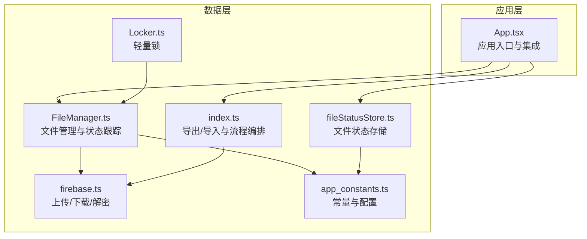
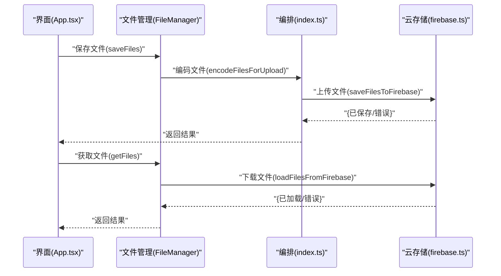
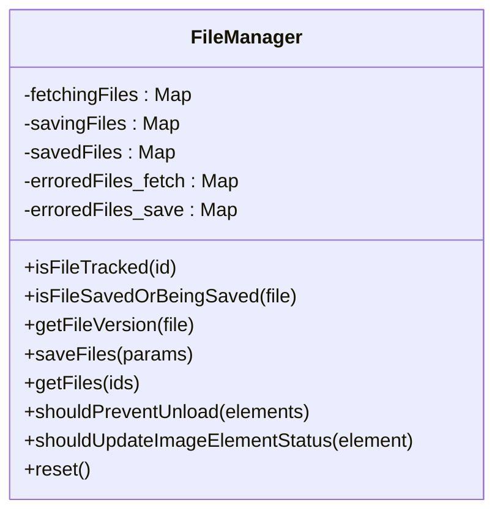
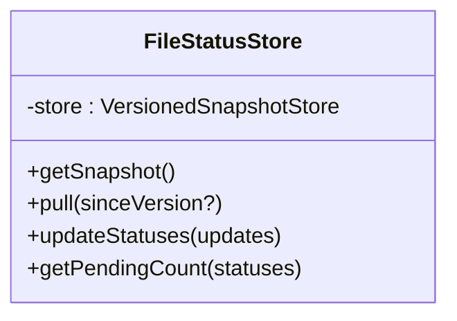
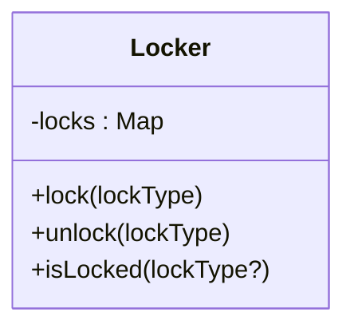
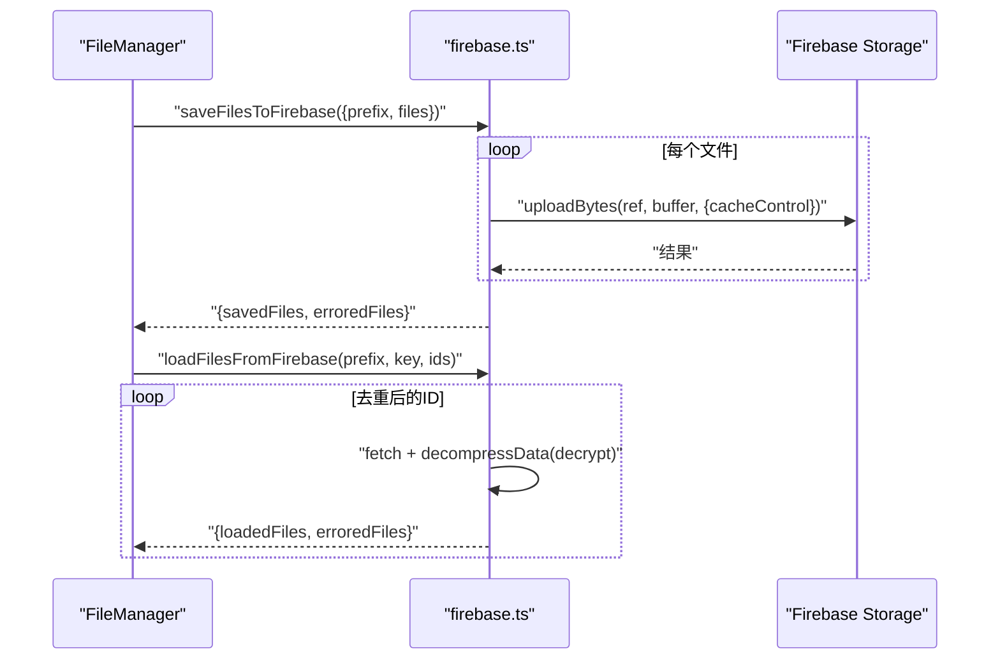
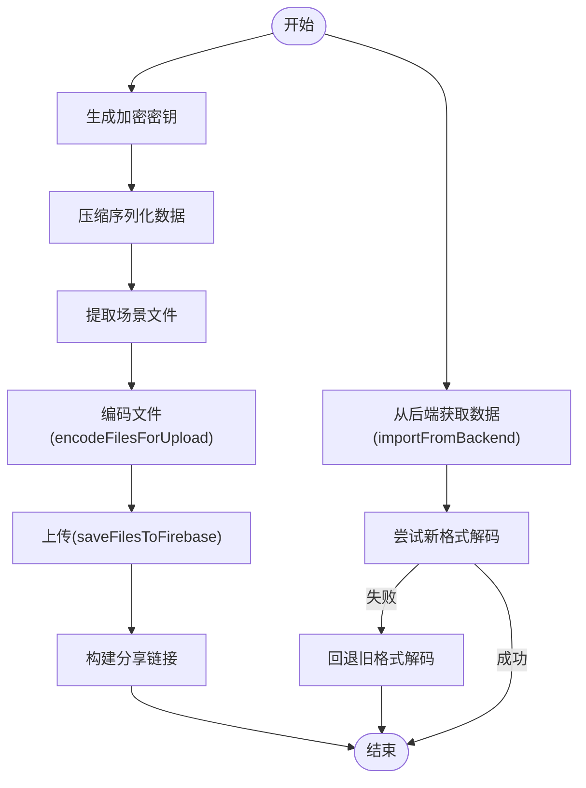
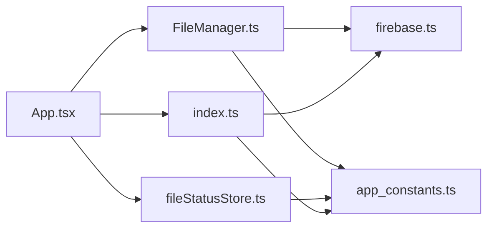
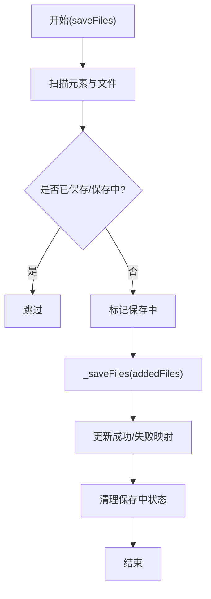
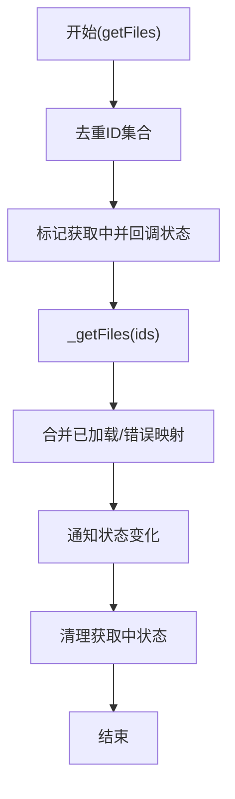

# 文件管理系统

<cite>
**本文引用的文件**
- [excalidraw-app/data/FileManager.ts](file://excalidraw-app/data/FileManager.ts)
- [excalidraw-app/data/Locker.ts](file://excalidraw-app/data/Locker.ts)
- [excalidraw-app/data/fileStatusStore.ts](file://excalidraw-app/data/fileStatusStore.ts)
- [excalidraw-app/data/firebase.ts](file://excalidraw-app/data/firebase.ts)
- [excalidraw-app/data/index.ts](file://excalidraw-app/data/index.ts)
- [excalidraw-app/app_constants.ts](file://excalidraw-app/app_constants.ts)
- [excalidraw-app/App.tsx](file://excalidraw-app/App.tsx)
</cite>

## 目录
1. [简介](#简介)
2. [项目结构](#项目结构)
3. [核心组件](#核心组件)
4. [架构总览](#架构总览)
5. [详细组件分析](#详细组件分析)
6. [依赖关系分析](#依赖关系分析)
7. [性能考量](#性能考量)
8. [故障排查指南](#故障排查指南)
9. [结论](#结论)
10. [附录](#附录)

## 简介
本文件管理系统围绕“文件上传、下载与持久化”展开，覆盖以下能力：
- 文件格式与大小限制：基于压缩与加密后的二进制文件，统一以二进制形式上传与存储，最大单文件大小受配置约束。
- 类型验证与状态跟踪：通过元素与文件版本关联，确保仅对未保存或正在保存的文件进行处理；同时维护加载/已加载/错误三种状态。
- 并发与锁机制：使用轻量级锁避免重复操作；在上传/下载阶段通过集合去重，减少重复请求。
- 清理策略：提供重置接口清空状态；结合缓存控制与过期时间策略，降低无效占用。
- 预览与缓存：通过状态存储与缓存头控制，提升加载效率。
- 安全与访问控制：端到端压缩与解压、密钥传递、后端/前端一致性校验。
- 迁移与恢复：本地存储适配器与版本快照存储，便于迁移与回滚。

## 项目结构
该系统的核心位于应用层的数据模块，主要文件如下：
- 文件管理与状态：FileManager.ts、fileStatusStore.ts
- 锁机制：Locker.ts
- 存储与网络：firebase.ts（上传/下载）、index.ts（导出/导入流程）
- 常量与配置：app_constants.ts
- 应用入口与集成：App.tsx

图表来源
- [excalidraw-app/App.tsx:110-120](file://excalidraw-app/App.tsx#L110-L120)
- [excalidraw-app/data/FileManager.ts:22-65](file://excalidraw-app/data/FileManager.ts#L22-L65)
- [excalidraw-app/data/fileStatusStore.ts:7-35](file://excalidraw-app/data/fileStatusStore.ts#L7-L35)
- [excalidraw-app/data/Locker.ts:1-19](file://excalidraw-app/data/Locker.ts#L1-L19)
- [excalidraw-app/data/index.ts:38-39](file://excalidraw-app/data/index.ts#L38-L39)
- [excalidraw-app/data/firebase.ts:145-172](file://excalidraw-app/data/firebase.ts#L145-L172)
- [excalidraw-app/app_constants.ts:11-14](file://excalidraw-app/app_constants.ts#L11-L14)

章节来源
- [excalidraw-app/App.tsx:110-120](file://excalidraw-app/App.tsx#L110-L120)
- [excalidraw-app/data/FileManager.ts:22-65](file://excalidraw-app/data/FileManager.ts#L22-L65)
- [excalidraw-app/data/fileStatusStore.ts:7-35](file://excalidraw-app/data/fileStatusStore.ts#L7-L35)
- [excalidraw-app/data/Locker.ts:1-19](file://excalidraw-app/data/Locker.ts#L1-L19)
- [excalidraw-app/data/index.ts:38-39](file://excalidraw-app/data/index.ts#L38-L39)
- [excalidraw-app/data/firebase.ts:145-172](file://excalidraw-app/data/firebase.ts#L145-L172)
- [excalidraw-app/app_constants.ts:11-14](file://excalidraw-app/app_constants.ts#L11-L14)

## 核心组件
- 文件管理器（FileManager）：负责文件保存与获取的生命周期管理，维护“正在获取/保存/已保存/错误”四类状态映射，并在卸载前阻止逻辑中考虑“正在保存”的文件。
- 文件状态存储（FileStatusStore）：基于版本化快照存储文件加载状态，提供批量更新与统计查询。
- 轻量锁（Locker）：以字符串键为粒度的互斥锁，用于防止并发重复操作。
- Firebase 适配（firebase.ts）：封装上传/下载、解密与解压流程，支持缓存头设置与错误收集。
- 导出/导入编排（index.ts）：生成加密密钥、压缩序列化数据、调用上传与后端交互。
- 常量与配置（app_constants.ts）：定义最大上传字节、缓存过期秒数等全局参数。

章节来源
- [excalidraw-app/data/FileManager.ts:22-226](file://excalidraw-app/data/FileManager.ts#L22-L226)
- [excalidraw-app/data/fileStatusStore.ts:7-48](file://excalidraw-app/data/fileStatusStore.ts#L7-L48)
- [excalidraw-app/data/Locker.ts:1-19](file://excalidraw-app/data/Locker.ts#L1-L19)
- [excalidraw-app/data/firebase.ts:145-319](file://excalidraw-app/data/firebase.ts#L145-L319)
- [excalidraw-app/data/index.ts:248-307](file://excalidraw-app/data/index.ts#L248-L307)
- [excalidraw-app/app_constants.ts:11-14](file://excalidraw-app/app_constants.ts#L11-L14)

## 架构总览
文件管理的整体流程由“导出/导入编排”驱动，核心步骤如下：
- 导出：生成加密密钥，压缩序列化数据，提取场景中的文件，编码并上传至云端，随后返回可分享链接。
- 下载：根据文件ID从云端拉取二进制数据，解密与解压，组装为可加载的文件对象。

图表来源
- [excalidraw-app/App.tsx:110-120](file://excalidraw-app/App.tsx#L110-L120)
- [excalidraw-app/data/FileManager.ts:92-180](file://excalidraw-app/data/FileManager.ts#L92-L180)
- [excalidraw-app/data/index.ts:248-307](file://excalidraw-app/data/index.ts#L248-L307)
- [excalidraw-app/data/firebase.ts:145-172](file://excalidraw-app/data/firebase.ts#L145-L172)
- [excalidraw-app/data/firebase.ts:274-319](file://excalidraw-app/data/firebase.ts#L274-L319)

## 详细组件分析

### 文件管理器（FileManager）
职责与行为
- 状态管理：维护“获取中/保存中/已保存/获取错误/保存错误”五类映射，用于判断文件是否被跟踪以及是否需要重试。
- 保存流程：遍历场景元素，筛选初始化且未处于“已保存/保存中”的文件，标记保存中并调用底层保存接口；最终更新成功/失败映射并清理保存中状态。
- 获取流程：对传入ID集合去重，标记获取中并触发状态回调；调用底层获取接口，更新已保存与错误映射，并通知状态变化；最后清理获取中状态。
- 卸载保护：若存在“保存中”的文件，则阻止页面卸载，确保未完成的保存不会丢失。
- 元素状态更新：当某图片元素的文件已保存且状态为“待定”，则将其状态更新为“已加载”。

图表来源
- [excalidraw-app/data/FileManager.ts:22-226](file://excalidraw-app/data/FileManager.ts#L22-L226)

章节来源
- [excalidraw-app/data/FileManager.ts:22-226](file://excalidraw-app/data/FileManager.ts#L22-L226)

### 文件状态存储（FileStatusStore）
职责与行为
- 版本化快照：基于版本化存储器维护文件ID到状态的映射，支持增量更新与拉取。
- 批量更新：接收状态变更数组，去重并合并，仅在发生变更时更新。
- 统计查询：计算“待处理/总数”，便于 UI 展示进度。

图表来源
- [excalidraw-app/data/fileStatusStore.ts:7-48](file://excalidraw-app/data/fileStatusStore.ts#L7-L48)

章节来源
- [excalidraw-app/data/fileStatusStore.ts:7-48](file://excalidraw-app/data/fileStatusStore.ts#L7-L48)

### 轻量锁（Locker）
职责与行为
- 锁定/解锁：以字符串键为单位加锁与解锁，提供是否存在锁的查询。
- 并发控制：用于避免重复提交或重复下载同一资源。

图表来源
- [excalidraw-app/data/Locker.ts:1-19](file://excalidraw-app/data/Locker.ts#L1-L19)

章节来源
- [excalidraw-app/data/Locker.ts:1-19](file://excalidraw-app/data/Locker.ts#L1-L19)

### 云存储适配（firebase.ts）
职责与行为
- 上传：对每个文件异步上传，设置缓存头，聚合成功/失败列表。
- 下载：按文件ID去重并发拉取，解密与解压，组装为文件对象；错误收集为Map。
- 缓存控制：通过设置缓存头控制 CDN/浏览器缓存时长。
- 加密/解密：与导出/导入流程配合，保证端到端安全。

图表来源
- [excalidraw-app/data/firebase.ts:145-172](file://excalidraw-app/data/firebase.ts#L145-L172)
- [excalidraw-app/data/firebase.ts:274-319](file://excalidraw-app/data/firebase.ts#L274-L319)

章节来源
- [excalidraw-app/data/firebase.ts:145-172](file://excalidraw-app/data/firebase.ts#L145-L172)
- [excalidraw-app/data/firebase.ts:274-319](file://excalidraw-app/data/firebase.ts#L274-L319)

### 导出/导入编排（index.ts）
职责与行为
- 导出：生成加密密钥，压缩序列化数据，提取场景文件，编码并上传，返回分享链接。
- 导入：从后端获取数据，尝试新格式解码，失败则回退到旧格式。
- 参数：使用全局常量控制最大上传字节数。

图表来源
- [excalidraw-app/data/index.ts:248-307](file://excalidraw-app/data/index.ts#L248-L307)
- [excalidraw-app/data/index.ts:202-242](file://excalidraw-app/data/index.ts#L202-L242)
- [excalidraw-app/data/index.ts:38-39](file://excalidraw-app/data/index.ts#L38-L39)

章节来源
- [excalidraw-app/data/index.ts:248-307](file://excalidraw-app/data/index.ts#L248-L307)
- [excalidraw-app/data/index.ts:202-242](file://excalidraw-app/data/index.ts#L202-L242)
- [excalidraw-app/data/index.ts:38-39](file://excalidraw-app/data/index.ts#L38-L39)

### 应用集成（App.tsx）
职责与行为
- 集成文件管理与状态存储，调用导出/导入流程，处理分享对话框与错误提示。
- 与文件管理器协作，更新过期图片状态，确保 UI 与状态一致。

章节来源
- [excalidraw-app/App.tsx:110-120](file://excalidraw-app/App.tsx#L110-L120)
- [excalidraw-app/App.tsx:118](file://excalidraw-app/App.tsx#L118)

## 依赖关系分析
- FileManager 依赖：
  - firebase.ts 的上传/下载能力
  - fileStatusStore 的状态更新
  - app_constants 的最大上传字节与缓存控制
- index.ts 作为编排层，串联压缩、加密、上传与后端交互。
- Locker 提供轻量并发控制，避免重复任务。
- App.tsx 作为入口，协调 UI 与数据层。

图表来源
- [excalidraw-app/App.tsx:110-120](file://excalidraw-app/App.tsx#L110-L120)
- [excalidraw-app/data/FileManager.ts:45-65](file://excalidraw-app/data/FileManager.ts#L45-L65)
- [excalidraw-app/data/fileStatusStore.ts:7-10](file://excalidraw-app/data/fileStatusStore.ts#L7-L10)
- [excalidraw-app/data/index.ts:38-39](file://excalidraw-app/data/index.ts#L38-L39)
- [excalidraw-app/data/firebase.ts:145-172](file://excalidraw-app/data/firebase.ts#L145-L172)
- [excalidraw-app/app_constants.ts:11-14](file://excalidraw-app/app_constants.ts#L11-L14)

章节来源
- [excalidraw-app/App.tsx:110-120](file://excalidraw-app/App.tsx#L110-L120)
- [excalidraw-app/data/FileManager.ts:45-65](file://excalidraw-app/data/FileManager.ts#L45-L65)
- [excalidraw-app/data/fileStatusStore.ts:7-10](file://excalidraw-app/data/fileStatusStore.ts#L7-L10)
- [excalidraw-app/data/index.ts:38-39](file://excalidraw-app/data/index.ts#L38-L39)
- [excalidraw-app/data/firebase.ts:145-172](file://excalidraw-app/data/firebase.ts#L145-L172)
- [excalidraw-app/app_constants.ts:11-14](file://excalidraw-app/app_constants.ts#L11-L14)

## 性能考量
- 并发优化：下载阶段对文件ID去重并发拉取，减少重复请求；上传阶段批量异步上传，聚合结果。
- 缓存策略：上传时设置缓存头，延长CDN/浏览器缓存时间，降低重复下载成本。
- 状态更新：状态存储采用版本化快照，批量更新避免频繁渲染。
- 大小限制：通过全局常量限制单文件大小，防止超大文件拖慢整体性能。
- 压缩与加密：在上传前进行压缩与加密，减小体积并保障传输安全。

章节来源
- [excalidraw-app/data/firebase.ts:157-171](file://excalidraw-app/data/firebase.ts#L157-L171)
- [excalidraw-app/data/firebase.ts:282-316](file://excalidraw-app/data/firebase.ts#L282-L316)
- [excalidraw-app/app_constants.ts:11-14](file://excalidraw-app/app_constants.ts#L11-L14)
- [excalidraw-app/data/fileStatusStore.ts:20-35](file://excalidraw-app/data/fileStatusStore.ts#L20-L35)

## 故障排查指南
常见问题与定位建议
- 上传失败
  - 检查是否超过最大上传字节限制。
  - 查看上传聚合结果中的错误列表，确认具体失败ID。
- 下载失败
  - 确认文件ID是否正确，检查错误映射。
  - 核对解密密钥与元数据是否匹配。
- 状态异常
  - 使用状态存储的批量更新接口核对当前状态映射。
  - 若出现长时间“加载中”，检查是否有重复任务未清理。
- 卸载被阻止
  - 检查是否存在“保存中”的文件，等待保存完成或重试。

章节来源
- [excalidraw-app/data/FileManager.ts:115-136](file://excalidraw-app/data/FileManager.ts#L115-L136)
- [excalidraw-app/data/firebase.ts:157-171](file://excalidraw-app/data/firebase.ts#L157-L171)
- [excalidraw-app/data/firebase.ts:282-316](file://excalidraw-app/data/firebase.ts#L282-L316)
- [excalidraw-app/data/fileStatusStore.ts:20-35](file://excalidraw-app/data/fileStatusStore.ts#L20-L35)

## 结论
该文件管理系统通过“状态跟踪+并发控制+云存储适配+版本化状态存储”的组合，实现了稳定、可扩展的文件上传、下载与持久化能力。配合缓存头与大小限制，兼顾性能与可靠性；通过端到端加密与密钥管理，保障数据安全。未来可在以下方面进一步完善：
- 增加文件类型白名单与内容检测（如病毒扫描）。
- 引入更细粒度的重试与断点续传策略。
- 提供文件清理与空间监控的可视化工具。

## 附录

### 关键流程图：保存文件（saveFiles）

图表来源
- [excalidraw-app/data/FileManager.ts:92-137](file://excalidraw-app/data/FileManager.ts#L92-L137)

### 关键流程图：获取文件（getFiles）

图表来源
- [excalidraw-app/data/FileManager.ts:139-180](file://excalidraw-app/data/FileManager.ts#L139-L180)