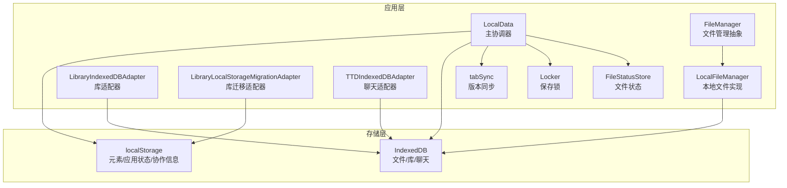
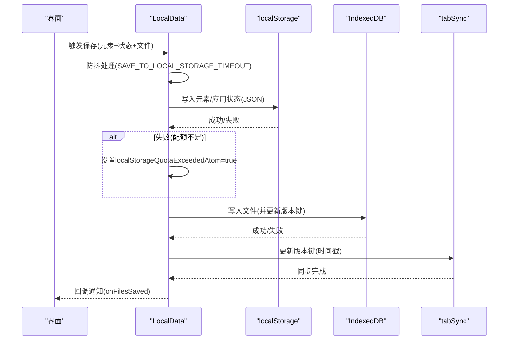
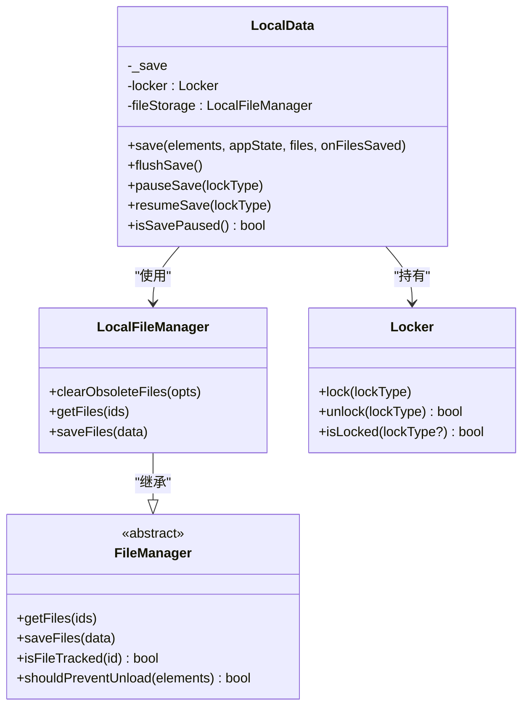
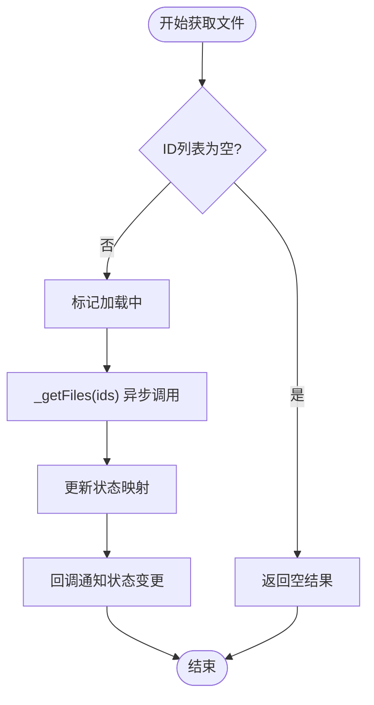
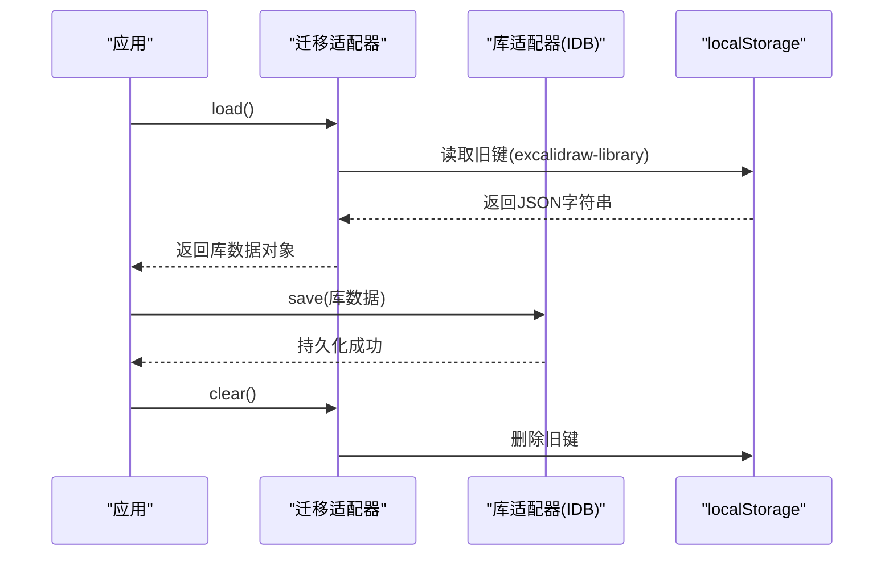
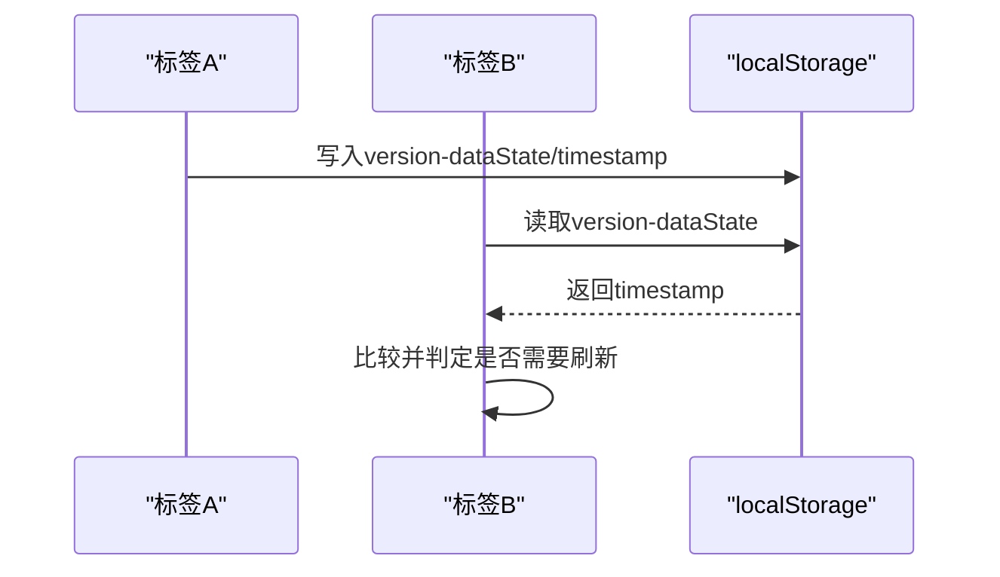
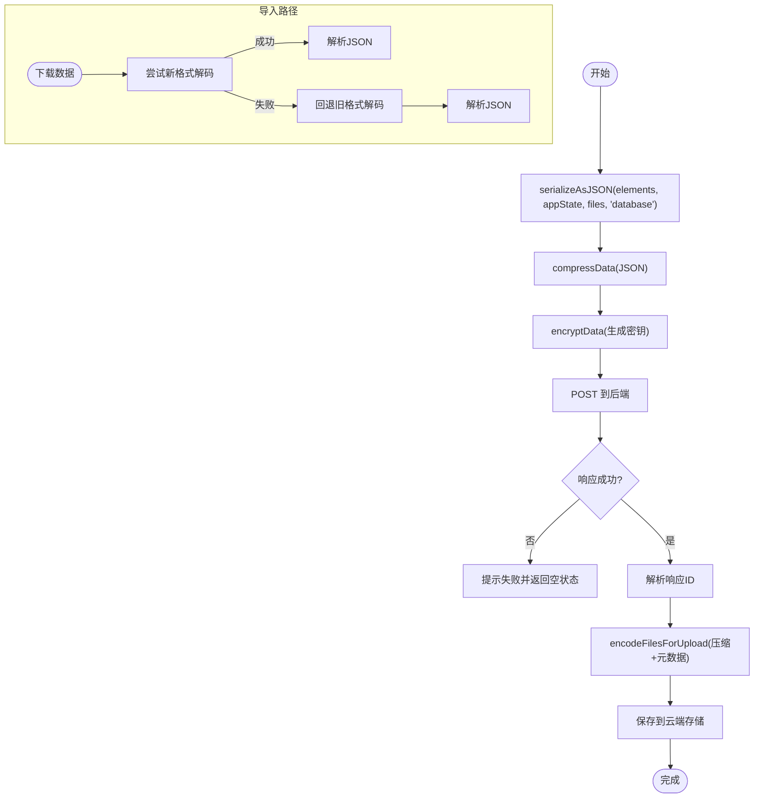
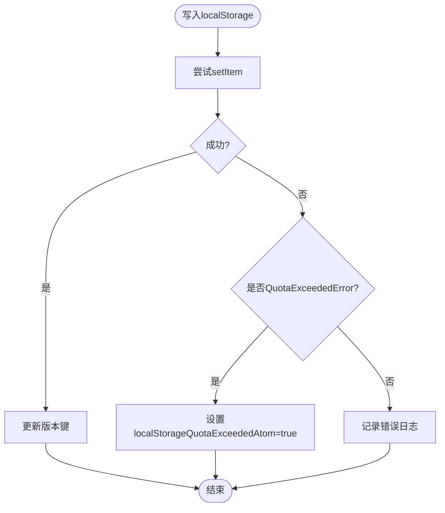
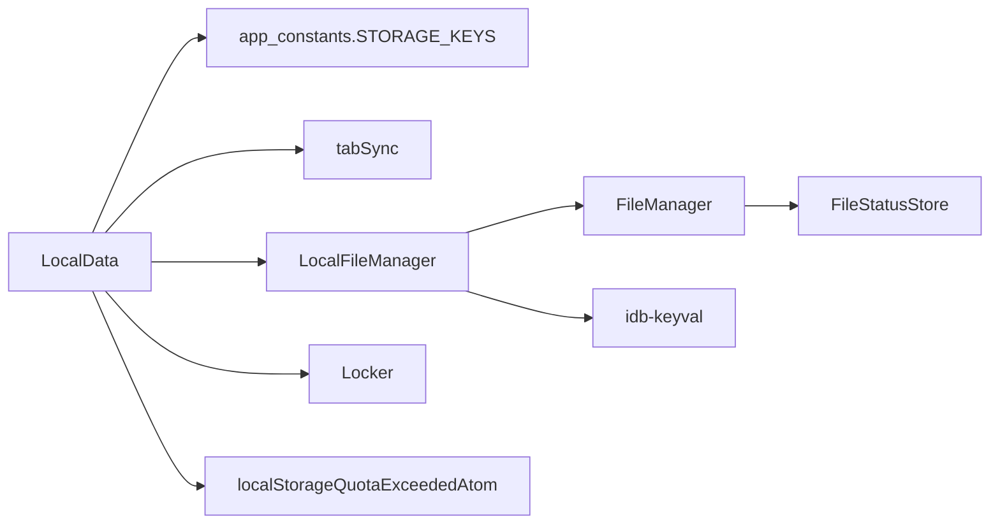

# 本地存储策略

<cite>
**本文档引用的文件**
- [excalidraw-app/data/localStorage.ts](file://excalidraw-app/data/localStorage.ts)
- [excalidraw-app/data/LocalData.ts](file://excalidraw-app/data/LocalData.ts)
- [excalidraw-app/data/index.ts](file://excalidraw-app/data/index.ts)
- [excalidraw-app/data/TTDStorage.ts](file://excalidraw-app/data/TTDStorage.ts)
- [excalidraw-app/data/FileManager.ts](file://excalidraw-app/data/FileManager.ts)
- [excalidraw-app/data/tabSync.ts](file://excalidraw-app/data/tabSync.ts)
- [excalidraw-app/data/Locker.ts](file://excalidraw-app/data/Locker.ts)
- [excalidraw-app/data/fileStatusStore.ts](file://excalidraw-app/data/fileStatusStore.ts)
- [excalidraw-app/app_constants.ts](file://excalidraw-app/app_constants.ts)
</cite>

## 目录

1. [简介](#简介)
2. [项目结构](#项目结构)
3. [核心组件](#核心组件)
4. [架构总览](#架构总览)
5. [详细组件分析](#详细组件分析)
6. [依赖关系分析](#依赖关系分析)
7. [性能考量](#性能考量)
8. [故障排查指南](#故障排查指南)
9. [结论](#结论)
10. [附录](#附录)

## 简介

本文件系统性阐述 Excalidraw 在浏览器端的本地存储策略，涵盖以下关键主题：

- 数据分层存储：元素数据与应用状态使用 localStorage；二进制文件与库数据使用 IndexedDB；聊天记录使用 IndexedDB。
- 存储容量管理：通过配额检查、错误处理与清理策略控制存储占用。
- 性能优化：防抖保存、并发控制、版本同步与增量更新。
- 序列化与反序列化：统一的 JSON 序列化与压缩/解压流程。
- 版本管理与兼容：版本键、迁移适配器与降级策略。
- 安全与完整性：加密导出、错误隔离与备份恢复建议。

## 项目结构

围绕本地存储的相关模块分布如下：

- localStorage.ts：协作用户名与基础导入/导出逻辑（基于 localStorage）。
- LocalData.ts：主存储协调器，负责元素与应用状态的 localStorage 写入、IndexedDB 文件存储、库数据适配器与迁移。
- FileManager.ts：文件管理抽象类，定义获取/保存文件的接口契约与状态跟踪。
- TTDStorage.ts：TTD 聊天记录的 IndexedDB 适配器。
- tabSync.ts：跨标签页版本同步（localStorage 键值）。
- Locker.ts：保存锁，避免在特定场景下重复写入。
- fileStatusStore.ts：文件加载状态的快照存储与版本化更新。
- app_constants.ts：存储键名、版本键、超时与配额等常量。

图表来源

- [excalidraw-app/data/LocalData.ts:117-228](file://excalidraw-app/data/LocalData.ts#L117-L228)
- [excalidraw-app/data/localStorage.ts:37-74](file://excalidraw-app/data/localStorage.ts#L37-L74)
- [excalidraw-app/data/TTDStorage.ts:11-51](file://excalidraw-app/data/TTDStorage.ts#L11-L51)
- [excalidraw-app/data/FileManager.ts:22-226](file://excalidraw-app/data/FileManager.ts#L22-L226)
- [excalidraw-app/data/tabSync.ts:12-25](file://excalidraw-app/data/tabSync.ts#L12-L25)
- [excalidraw-app/data/Locker.ts:1-19](file://excalidraw-app/data/Locker.ts#L1-L19)
- [excalidraw-app/data/fileStatusStore.ts:7-48](file://excalidraw-app/data/fileStatusStore.ts#L7-L48)

章节来源

- [excalidraw-app/data/LocalData.ts:1-278](file://excalidraw-app/data/LocalData.ts#L1-L278)
- [excalidraw-app/data/localStorage.ts:1-101](file://excalidraw-app/data/localStorage.ts#L1-L101)
- [excalidraw-app/data/TTDStorage.ts:1-52](file://excalidraw-app/data/TTDStorage.ts#L1-L52)
- [excalidraw-app/data/FileManager.ts:1-297](file://excalidraw-app/data/FileManager.ts#L1-L297)
- [excalidraw-app/data/tabSync.ts:1-40](file://excalidraw-app/data/tabSync.ts#L1-L40)
- [excalidraw-app/data/Locker.ts:1-19](file://excalidraw-app/data/Locker.ts#L1-L19)
- [excalidraw-app/data/fileStatusStore.ts:1-49](file://excalidraw-app/data/fileStatusStore.ts#L1-L49)
- [excalidraw-app/app_constants.ts:39-53](file://excalidraw-app/app_constants.ts#L39-L53)

## 核心组件

- LocalData：主协调器，封装元素与应用状态的 localStorage 写入、IndexedDB 文件存储、库数据适配器与迁移、保存锁与防抖。
- FileManager：文件管理抽象类，定义获取/保存文件的接口契约与状态跟踪。
- LocalFileManager：FileManager 的本地实现，结合 IndexedDB 存储与清理策略。
- LibraryIndexedDBAdapter：库数据的 IndexedDB 读写适配器。
- LibraryLocalStorageMigrationAdapter：库数据从 localStorage 迁移到 IndexedDB 的迁移适配器。
- TTDIndexedDBAdapter：TTD 聊天记录的 IndexedDB 读写适配器。
- tabSync：通过 localStorage 键值进行跨标签页版本同步。
- Locker：保存锁，用于暂停/恢复保存。
- FileStatusStore：文件加载状态的快照存储与版本化更新。
- localStorage 工具：协作用户名与基础导入/导出逻辑。

章节来源

- [excalidraw-app/data/LocalData.ts:117-228](file://excalidraw-app/data/LocalData.ts#L117-L228)
- [excalidraw-app/data/FileManager.ts:22-226](file://excalidraw-app/data/FileManager.ts#L22-L226)
- [excalidraw-app/data/TTDStorage.ts:11-51](file://excalidraw-app/data/TTDStorage.ts#L11-L51)
- [excalidraw-app/data/tabSync.ts:12-25](file://excalidraw-app/data/tabSync.ts#L12-L25)
- [excalidraw-app/data/Locker.ts:1-19](file://excalidraw-app/data/Locker.ts#L1-L19)
- [excalidraw-app/data/fileStatusStore.ts:7-48](file://excalidraw-app/data/fileStatusStore.ts#L7-L48)
- [excalidraw-app/data/localStorage.ts:11-35](file://excalidraw-app/data/localStorage.ts#L11-L35)

## 架构总览

本地存储采用“分层策略”：

- 元素数据与应用状态：以 JSON 字符串形式存储于 localStorage，便于快速读取与跨标签页共享。
- 二进制文件与库数据：以对象形式存储于 IndexedDB，支持大体量数据与复杂查询。
- 聊天记录：独立的 IndexedDB 存储，便于长期保留与检索。
- 版本同步：通过 localStorage 中的版本键实现跨标签页一致性。
- 保存控制：使用防抖与保存锁，避免频繁写入与竞态。

图表来源

- [excalidraw-app/data/LocalData.ts:117-151](file://excalidraw-app/data/LocalData.ts#L117-L151)
- [excalidraw-app/data/localStorage.ts:90-108](file://excalidraw-app/data/localStorage.ts#L90-L108)
- [excalidraw-app/data/tabSync.ts:17-25](file://excalidraw-app/data/tabSync.ts#L17-L25)

章节来源

- [excalidraw-app/data/LocalData.ts:73-109](file://excalidraw-app/data/LocalData.ts#L73-L109)
- [excalidraw-app/app_constants.ts:2-4](file://excalidraw-app/app_constants.ts#L2-L4)

## 详细组件分析

### LocalData 组件分析

职责与流程：

- 防抖保存：将保存操作合并为一次执行，减少频繁写入。
- 元素与应用状态写入：序列化后写入 localStorage，并更新版本键。
- 文件存储：委托 LocalFileManager 将二进制文件写入 IndexedDB。
- 保存锁：在页面隐藏或锁定期间暂停保存。
- 配额检测：捕获 QuotaExceededError 并设置全局状态位。

图表来源

- [excalidraw-app/data/LocalData.ts:117-228](file://excalidraw-app/data/LocalData.ts#L117-L228)
- [excalidraw-app/data/FileManager.ts:22-226](file://excalidraw-app/data/FileManager.ts#L22-L226)
- [excalidraw-app/data/Locker.ts:1-19](file://excalidraw-app/data/Locker.ts#L1-L19)

章节来源

- [excalidraw-app/data/LocalData.ts:117-228](file://excalidraw-app/data/LocalData.ts#L117-L228)

### 文件管理与状态跟踪

FileManager 抽象类定义了文件获取/保存的契约，并维护状态映射：

- 正在获取/保存/已保存/错误状态。
- 提供 shouldPreventUnload 判断是否阻止卸载。
- 提供 shouldUpdateImageElementStatus 辅助更新元素状态。

图表来源

- [excalidraw-app/data/FileManager.ts:139-180](file://excalidraw-app/data/FileManager.ts#L139-L180)

章节来源

- [excalidraw-app/data/FileManager.ts:22-226](file://excalidraw-app/data/FileManager.ts#L22-L226)

### 库数据与迁移策略

- LibraryIndexedDBAdapter：以键值对形式持久化库数据，支持异步读写。
- LibraryLocalStorageMigrationAdapter：从旧的 localStorage 键读取库数据并清理旧键，确保平滑迁移。

图表来源

- [excalidraw-app/data/LocalData.ts:229-277](file://excalidraw-app/data/LocalData.ts#L229-L277)
- [excalidraw-app/app_constants.ts:48-53](file://excalidraw-app/app_constants.ts#L48-L53)

章节来源

- [excalidraw-app/data/LocalData.ts:229-277](file://excalidraw-app/data/LocalData.ts#L229-L277)

### 跨标签页版本同步

通过 localStorage 中的时间戳键实现版本同步：

- updateBrowserStateVersion：写入当前时间戳。
- isBrowserStorageStateNewer：比较本地与存储版本，决定是否触发刷新。

图表来源

- [excalidraw-app/data/tabSync.ts:12-25](file://excalidraw-app/data/tabSync.ts#L12-L25)

章节来源

- [excalidraw-app/data/tabSync.ts:1-40](file://excalidraw-app/data/tabSync.ts#L1-L40)

### 序列化与反序列化流程

- 导出到后端：先将元素、应用状态与文件序列化为 JSON，再进行压缩与加密，最后上传。
- 导入数据：从后端下载数据后，先尝试新格式解码，失败则回退到旧格式。
- localStorage 读写：元素与应用状态以 JSON 字符串形式存储，库数据通过适配器读写。

图表来源

- [excalidraw-app/data/index.ts:248-307](file://excalidraw-app/data/index.ts#L248-L307)
- [excalidraw-app/data/index.ts:202-242](file://excalidraw-app/data/index.ts#L202-L242)

章节来源

- [excalidraw-app/data/index.ts:1-308](file://excalidraw-app/data/index.ts#L1-L308)

### 存储配额检查与错误处理

- 配额检查：捕获 QuotaExceededError 并设置全局状态位，避免重复告警。
- 错误处理：对 localStorage 读写与 IndexedDB 操作均进行 try/catch 包裹，保证健壮性。
- 清理策略：LocalFileManager 对未使用的文件进行清理，降低存储压力。

图表来源

- [excalidraw-app/data/LocalData.ts:111-113](file://excalidraw-app/data/LocalData.ts#L111-L113)
- [excalidraw-app/data/LocalData.ts:102-108](file://excalidraw-app/data/LocalData.ts#L102-L108)

章节来源

- [excalidraw-app/data/LocalData.ts:73-109](file://excalidraw-app/data/LocalData.ts#L73-L109)

## 依赖关系分析

- LocalData 依赖：
  - localStorage 常量与键名（STORAGE_KEYS）
  - tabSync 版本同步
  - Locker 保存锁
  - FileManager/LocalFileManager 文件存储
  - Jotai 状态（localStorageQuotaExceededAtom）
- FileManager 依赖：
  - idb-keyval（get/set/getMany/setMany）
  - 版本化状态（FileStatusStore）

图表来源

- [excalidraw-app/data/LocalData.ts:42-47](file://excalidraw-app/data/LocalData.ts#L42-L47)
- [excalidraw-app/app_constants.ts:39-53](file://excalidraw-app/app_constants.ts#L39-L53)
- [excalidraw-app/data/FileManager.ts:22-27](file://excalidraw-app/data/FileManager.ts#L22-L27)

章节来源

- [excalidraw-app/data/LocalData.ts:1-278](file://excalidraw-app/data/LocalData.ts#L1-L278)
- [excalidraw-app/data/FileManager.ts:1-297](file://excalidraw-app/data/FileManager.ts#L1-L297)
- [excalidraw-app/app_constants.ts:1-62](file://excalidraw-app/app_constants.ts#L1-L62)

## 性能考量

- 防抖保存：SAVE_TO_LOCAL_STORAGE_TIMEOUT 控制保存频率，减少写入开销。
- 保存锁：页面隐藏或锁定时暂停保存，避免无意义写入。
- 版本同步：仅在必要时触发刷新，降低跨标签页通信成本。
- 文件清理：定期清理未使用且过期的文件，控制存储增长。
- 压缩与加密：导出前压缩与加密，减小传输体积与提升安全性。

最佳实践建议：

- 使用防抖与批量写入，避免高频 localStorage 写入。
- 对大文件采用 IndexedDB 分片存储与懒加载策略。
- 定期清理过期文件与库数据，保持存储健康。
- 在网络不稳定时，优先使用本地状态，失败时回退到旧版本。

章节来源

- [excalidraw-app/app_constants.ts:2-4](file://excalidraw-app/app_constants.ts#L2-L4)
- [excalidraw-app/data/LocalData.ts:54-70](file://excalidraw-app/data/LocalData.ts#L54-L70)
- [excalidraw-app/data/index.ts:248-307](file://excalidraw-app/data/index.ts#L248-L307)

## 故障排查指南

常见问题与处理：

- 配额不足（QuotaExceededError）：系统会设置全局状态位并停止进一步写入，需清理或降载数据。
- 读写失败：对 localStorage 与 IndexedDB 的操作均进行错误捕获，检查浏览器隐私模式或存储权限。
- 跨标签页不同步：确认版本键是否正确更新与读取。
- 文件加载失败：检查文件状态映射与错误集合，必要时重试或回退。

章节来源

- [excalidraw-app/data/LocalData.ts:111-113](file://excalidraw-app/data/LocalData.ts#L111-L113)
- [excalidraw-app/data/tabSync.ts:12-25](file://excalidraw-app/data/tabSync.ts#L12-L25)
- [excalidraw-app/data/fileStatusStore.ts:20-35](file://excalidraw-app/data/fileStatusStore.ts#L20-L35)

## 结论

Excalidraw 的本地存储策略通过“分层存储 + 防抖 + 锁定 + 版本同步 + 迁移适配”的组合，实现了在浏览器端的高效、稳定与可扩展的数据持久化。该策略兼顾了性能与可靠性，同时为未来的大规模数据与更复杂的场景预留了扩展空间。

## 附录

- 存储键名与版本键：见 STORAGE_KEYS 常量定义。
- 超时与配额：见 app_constants 中的 SAVE_TO_LOCAL_STORAGE_TIMEOUT、FILE_UPLOAD_MAX_BYTES 等。
- 协作用户名与基础导入/导出：见 localStorage 工具函数。

章节来源

- [excalidraw-app/app_constants.ts:39-53](file://excalidraw-app/app_constants.ts#L39-L53)
- [excalidraw-app/data/localStorage.ts:11-35](file://excalidraw-app/data/localStorage.ts#L11-L35)
