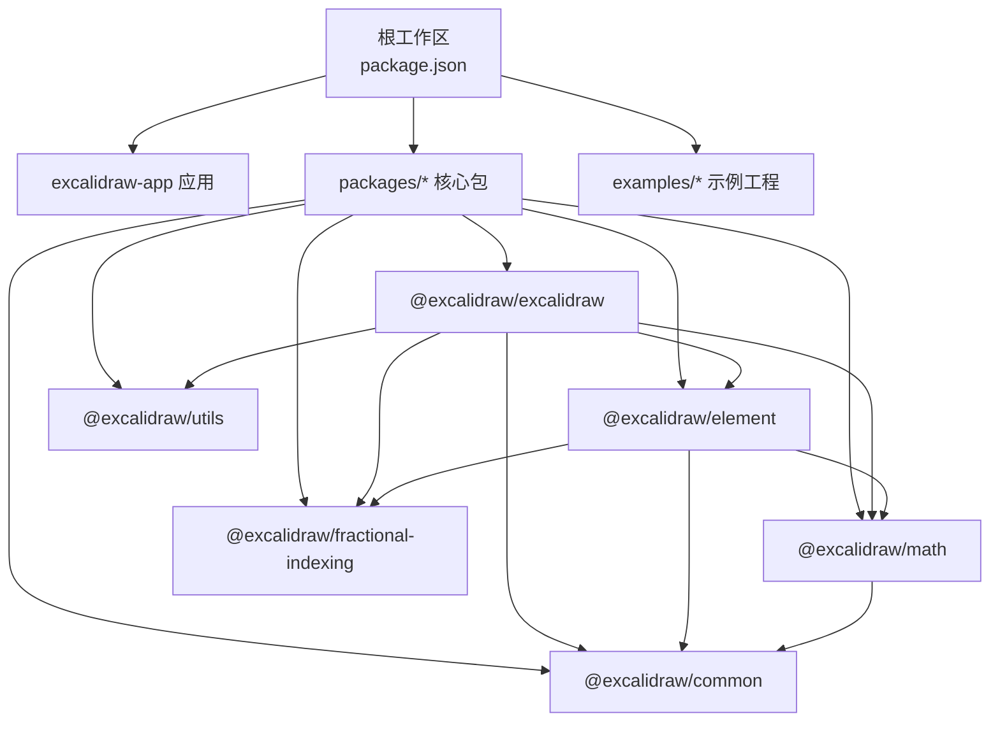
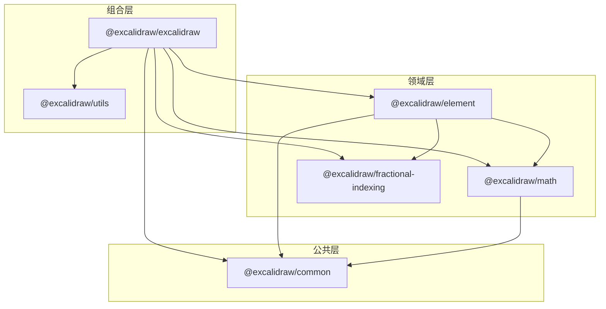
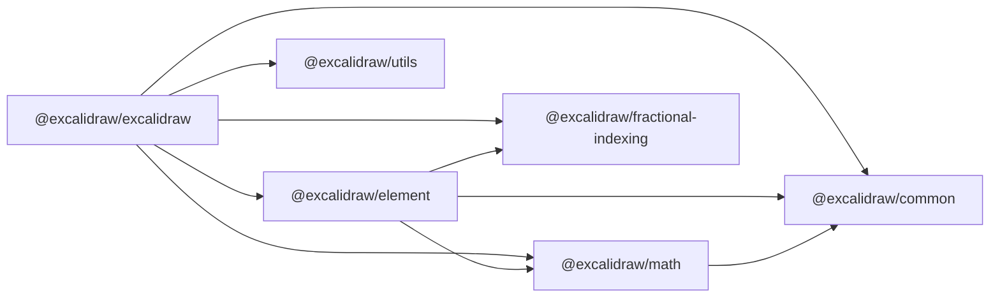
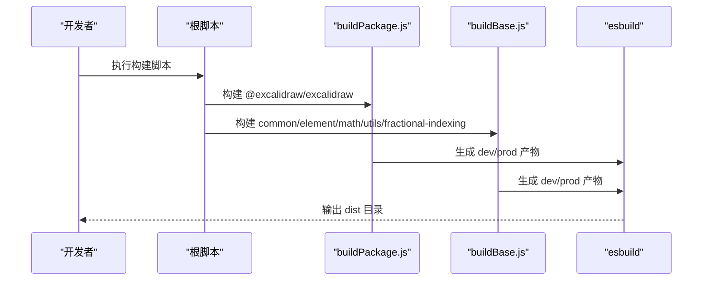

# Monorepo 架构设计

<cite>
**本文档引用的文件**
- [package.json](file://package.json)
- [tsconfig.base.json](file://packages/tsconfig.base.json)
- [buildPackage.js](file://scripts/buildPackage.js)
- [buildBase.js](file://scripts/buildBase.js)
- [@excalidraw/excalidraw/package.json](file://packages/excalidraw/package.json)
- [@excalidraw/element/package.json](file://packages/element/package.json)
- [@excalidraw/common/package.json](file://packages/common/package.json)
- [@excalidraw/math/package.json](file://packages/math/package.json)
- [@excalidraw/utils/package.json](file://packages/utils/package.json)
- [@excalidraw/fractional-indexing/package.json](file://packages/fractional-indexing/package.json)
- [packages/excalidraw/index.tsx](file://packages/excalidraw/index.tsx)
- [packages/element/src/index.ts](file://packages/element/src/index.ts)
- [packages/common/src/index.ts](file://packages/common/src/index.ts)
- [packages/math/src/index.ts](file://packages/math/src/index.ts)
- [packages/utils/src/index.ts](file://packages/utils/src/index.ts)
</cite>

## 目录

1. [简介](#简介)
2. [项目结构](#项目结构)
3. [核心组件](#核心组件)
4. [架构总览](#架构总览)
5. [详细组件分析](#详细组件分析)
6. [依赖关系分析](#依赖关系分析)
7. [性能考虑](#性能考虑)
8. [故障排除指南](#故障排除指南)
9. [结论](#结论)
10. [附录](#附录)

## 简介

本文件系统性阐述 Excalidraw 的 Monorepo 架构设计与组织方式，重点覆盖以下方面：

- 工作空间配置与包管理策略
- 包之间的依赖关系与导入路径规则
- 构建系统的实现与优化
- 各包的职责边界与复用机制
- 版本管理与发布流程
- 实践建议与最佳实践

通过本指南，开发者可以快速理解如何在该 Monorepo 中进行多包协同开发、构建与维护。

## 项目结构

Excalidraw 采用 Yarn Workspaces 管理多包，根目录的 package.json 定义了工作空间范围，涵盖应用层、核心包与示例工程。各包位于 packages 目录下，遵循“按功能域分包”的组织原则，确保高内聚、低耦合。

图表来源

- [package.json:5-9](file://package.json#L5-L9)
- [@excalidraw/excalidraw/package.json:80-117](file://packages/excalidraw/package.json#L80-L117)
- [@excalidraw/element/package.json:65-69](file://packages/element/package.json#L65-L69)
- [@excalidraw/math/package.json:63-65](file://packages/math/package.json#L63-L65)

章节来源

- [package.json:1-96](file://package.json#L1-L96)

## 核心组件

本节聚焦三个核心包的职责与边界：

- @excalidraw/common：提供通用工具函数、常量、事件总线等基础能力，是所有包的共同依赖。
- @excalidraw/element：负责元素模型、元素操作（增删改查、碰撞检测、布局、排序等）以及元素相关的算法与工具。
- @excalidraw/excalidraw：作为 React 组件库，整合 UI、状态管理与业务逻辑，依赖 common、element、math、utils 等包。

章节来源

- [@excalidraw/common/package.json:1-66](file://packages/common/package.json#L1-L66)
- [@excalidraw/element/package.json:1-71](file://packages/element/package.json#L1-L71)
- [@excalidraw/excalidraw/package.json:1-141](file://packages/excalidraw/package.json#L1-L141)

## 架构总览

整体架构以“公共能力下沉、业务能力上浮”为核心思想。common 作为基础设施，element 聚焦元素域逻辑，math 提供几何与向量运算，utils 提供导出与边界计算等实用工具；excalidraw 作为组合层，将上述能力封装为可复用的 React 组件。

图表来源

- [@excalidraw/excalidraw/package.json:80-117](file://packages/excalidraw/package.json#L80-L117)
- [@excalidraw/element/package.json:65-69](file://packages/element/package.json#L65-L69)
- [@excalidraw/math/package.json:63-65](file://packages/math/package.json#L63-L65)

## 详细组件分析

### @excalidraw/excalidraw（React 组件库）

- 职责：提供完整的可嵌入式 React 组件，包含应用初始化、状态管理、UI 组件与交互逻辑。
- 关键特性：
  - 通过 exports 字段暴露多入口与类型声明，支持按需导入与开发/生产环境差异化打包。
  - 依赖 common、element、math、utils、fractional-indexing 等包，形成稳定的依赖闭环。
  - 使用 esbuild 进行 ESM 打包，区分开发与生产环境，生成带/不带 sourcemap 的产物。
- 典型使用场景：在 Next.js、Vite 或浏览器脚本中直接引入组件并传入初始数据与回调。

章节来源

- [@excalidraw/excalidraw/package.json:8-34](file://packages/excalidraw/package.json#L8-L34)
- [@excalidraw/excalidraw/package.json:72-75](file://packages/excalidraw/package.json#L72-L75)
- [packages/excalidraw/index.tsx:1-200](file://packages/excalidraw/index.tsx#L1-L200)

### @excalidraw/element（元素处理逻辑）

- 职责：元素模型定义、元素集合操作、元素可见性过滤、版本哈希、对齐/分布/分组/绑定等。
- 关键特性：
  - 暴露大量工具函数与子模块（如 align、binding、bounds、collision、sortElements 等），便于按需导入。
  - 依赖 common、math、fractional-indexing，强调与数学与索引能力的协作。
- 典型使用场景：在编辑器中进行元素选择、变换、布局与版本控制。

章节来源

- [@excalidraw/element/package.json:65-69](file://packages/element/package.json#L65-L69)
- [packages/element/src/index.ts:1-103](file://packages/element/src/index.ts#L1-L103)

### @excalidraw/common（通用工具与常量）

- 职责：提供二叉堆、队列、颜色、键盘、点集、URL 处理、事件总线、版本快照存储等通用能力。
- 关键特性：
  - 作为最底层依赖，被其他所有包依赖，避免循环依赖。
  - 类型声明与运行时代码分离，保证类型安全与最小化运行时开销。
- 典型使用场景：为 element、excalidraw 等提供统一的工具与常量。

章节来源

- [@excalidraw/common/package.json:59-61](file://packages/common/package.json#L59-L61)
- [packages/common/src/index.ts:1-18](file://packages/common/src/index.ts#L1-L18)

### @excalidraw/math（几何与向量运算）

- 职责：提供角度、曲线、椭圆、直线、点、多边形、矩形、线段、三角形、向量、范围与工具函数。
- 关键特性：
  - 与 element 的 bounds、collision、transform 等模块紧密配合。
  - 依赖 common，保持与通用工具的一致性。
- 典型使用场景：元素边界计算、碰撞检测、几何变换。

章节来源

- [@excalidraw/math/package.json:63-65](file://packages/math/package.json#L63-L65)
- [packages/math/src/index.ts:1-14](file://packages/math/src/index.ts#L1-L14)

### @excalidraw/utils（实用工具）

- 职责：导出工具、边界计算、与 element 的公共边界计算集成。
- 关键特性：
  - 与 element 的 getCommonBounds 协作，提供跨包一致的边界计算能力。
- 典型使用场景：导出、缩略图、画布裁剪等需要边界信息的场景。

章节来源

- [@excalidraw/utils/package.json:50-60](file://packages/utils/package.json#L50-L60)
- [packages/utils/src/index.ts:1-5](file://packages/utils/src/index.ts#L1-L5)

### @excalidraw/fractional-indexing（分式索引）

- 职责：提供生成排序字符串的能力，用于元素层级与顺序管理。
- 关键特性：
  - 作为独立包被 element 依赖，避免在 element 内部重复实现。
- 典型使用场景：元素 z-index 计算与层级插入。

章节来源

- [@excalidraw/fractional-indexing/package.json:31-44](file://packages/fractional-indexing/package.json#L31-L44)

## 依赖关系分析

- 依赖方向：excalidraw → common、element、math、utils、fractional-indexing；element → common、math、fractional-indexing；math → common。
- 导入路径规则：通过 tsconfig.base.json 的 paths 映射，统一使用 @excalidraw/\* 命名空间，提升可读性与可维护性。
- 构建策略：各包使用 esbuild 进行 ESM 打包，区分开发/生产环境，外部依赖通过 external 配置，避免重复打包。

图表来源

- [@excalidraw/excalidraw/package.json:80-117](file://packages/excalidraw/package.json#L80-L117)
- [@excalidraw/element/package.json:65-69](file://packages/element/package.json#L65-L69)
- [@excalidraw/math/package.json:63-65](file://packages/math/package.json#L63-L65)

章节来源

- [tsconfig.base.json:13-26](file://packages/tsconfig.base.json#L13-L26)
- [buildPackage.js:74-86](file://scripts/buildPackage.js#L74-L86)
- [buildBase.js:13-22](file://scripts/buildBase.js#L13-L22)

## 性能考虑

- 分块与拆包：esbuild 启用 splitting，将入口与 chunk 分离，减少首屏体积与提升缓存命中率。
- 外部化依赖：通过 external 将 common、element、math、utils、fractional-indexing 设为外部依赖，避免重复打包，降低产物体积。
- 环境区分：开发环境启用 sourcemap 与非压缩，生产环境启用压缩与无 sourcemap，平衡调试体验与运行性能。
- 样式处理：通过 esbuild-sass-plugin 预编译相对路径的 Sass，减少运行时解析成本。

章节来源

- [buildPackage.js:60-86](file://scripts/buildPackage.js#L60-L86)
- [buildBase.js:5-22](file://scripts/buildBase.js#L5-L22)

## 故障排除指南

- 构建失败（找不到模块或路径错误）
  - 检查 tsconfig.base.json 的 paths 映射是否正确，确保 @excalidraw/\* 命名空间与实际目录一致。
  - 确认包的 exports 字段与入口文件存在，避免运行时无法解析入口。
- 运行时错误（循环依赖或未定义的变量）
  - 避免在 common 中引入上层包（如 excalidraw），保持 common 的纯净性。
  - 在 esbuild 配置中确认 external 列表包含所有应外部化的包，防止重复打包。
- 开发体验问题（Source Map 不生效或调试困难）
  - 确保开发环境构建开启 sourcemap，并检查 define 中的环境变量注入是否正确。

章节来源

- [tsconfig.base.json:13-26](file://packages/tsconfig.base.json#L13-L26)
- [buildPackage.js:88-106](file://scripts/buildPackage.js#L88-L106)
- [buildBase.js:24-42](file://scripts/buildBase.js#L24-L42)

## 结论

Excalidraw 的 Monorepo 通过清晰的分层与严格的依赖边界，实现了代码复用、版本统一与构建优化。common 作为基础设施，element 聚焦元素域逻辑，math 提供几何能力，utils 与 fractional-indexing 作为支撑模块，excalidraw 作为组合层对外提供完整能力。借助 Yarn Workspaces、tsconfig paths 与 esbuild，团队可以在多包环境下高效协作并保持一致的开发体验。

## 附录

### 工作空间与脚本

- 工作空间：根 package.json 的 workspaces 字段定义了应用、核心包与示例工程的范围。
- 常用脚本：提供统一的构建、测试与清理命令，便于在根目录一键执行多包任务。

章节来源

- [package.json:5-9](file://package.json#L5-L9)
- [package.json:51-91](file://package.json#L51-L91)

### 构建流程概览

图表来源

- [package.json:55-60](file://package.json#L55-L60)
- [buildPackage.js:108-125](file://scripts/buildPackage.js#L108-L125)
- [buildBase.js:44-50](file://scripts/buildBase.js#L44-L50)
