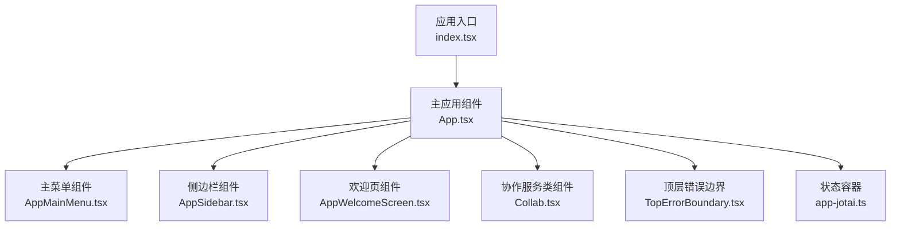
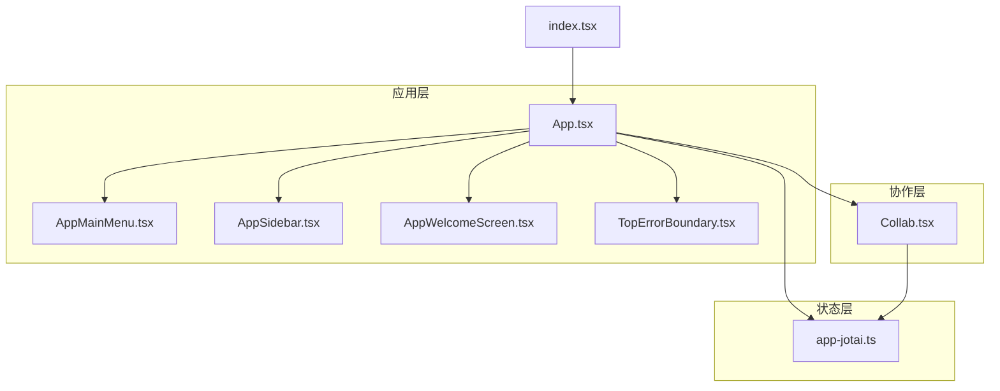
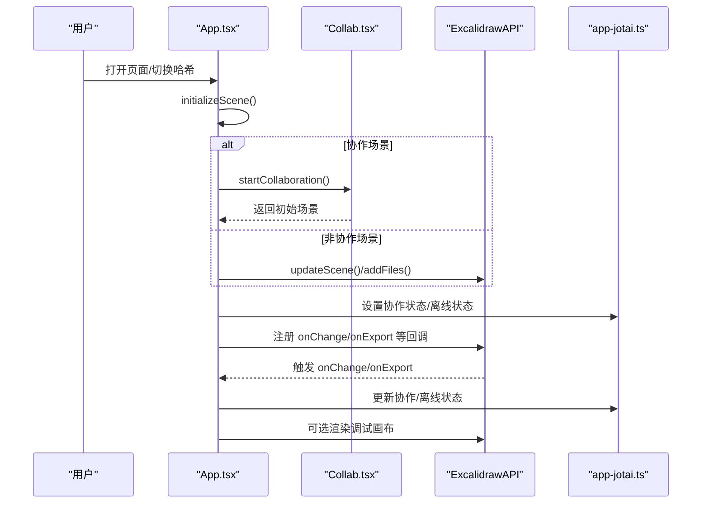
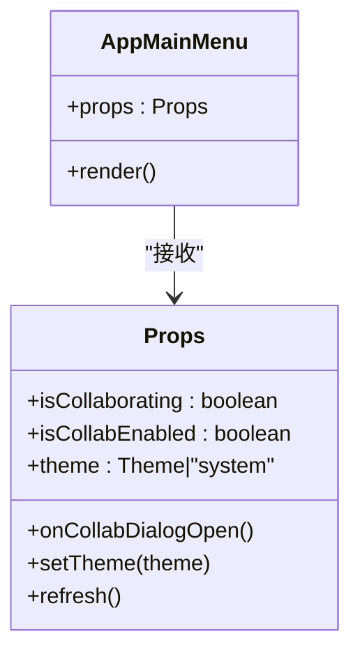
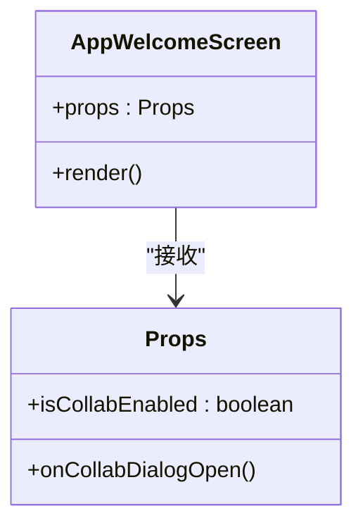
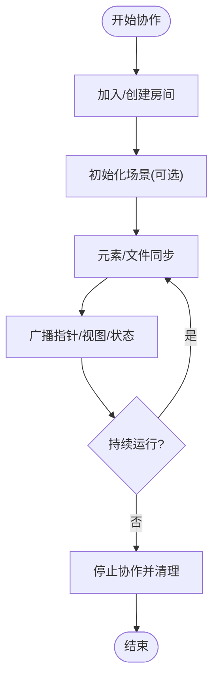
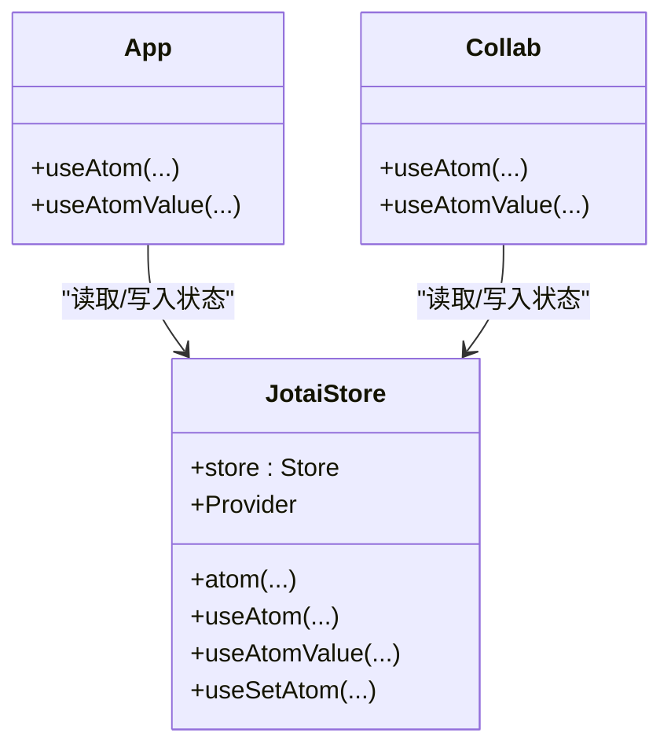
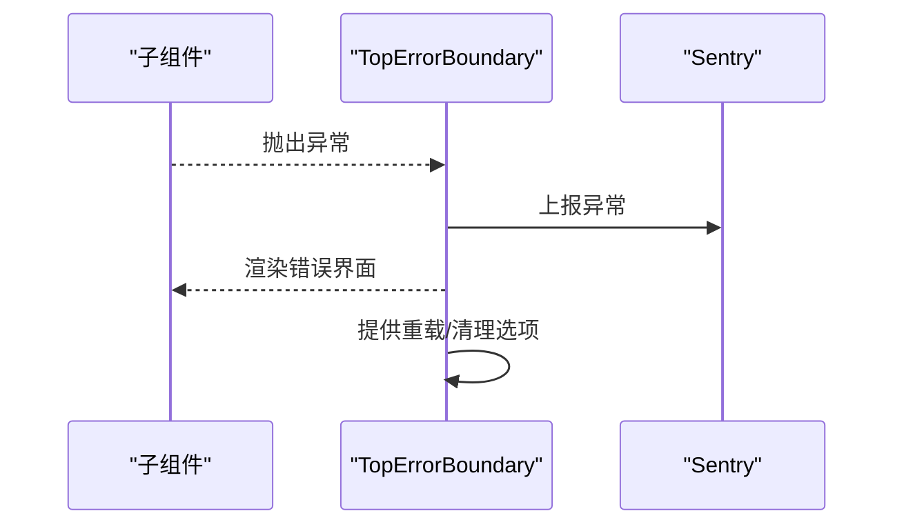
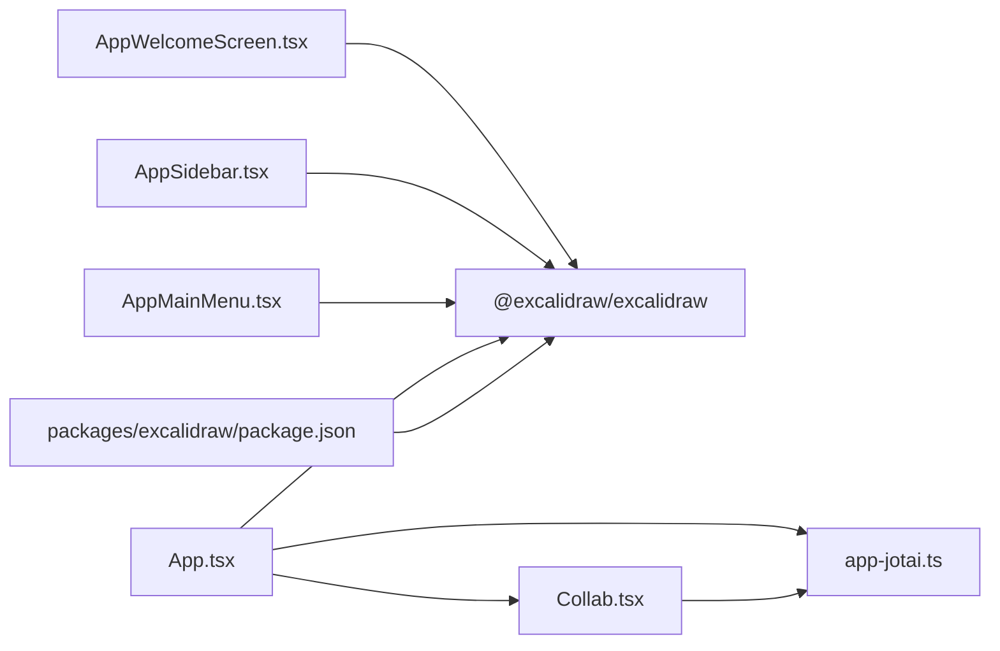

# React 组件系统

<cite>
**本文引用的文件**
- [excalidraw-app/App.tsx](file://excalidraw-app/App.tsx)
- [excalidraw-app/index.tsx](file://excalidraw-app/index.tsx)
- [excalidraw-app/components/AppSidebar.tsx](file://excalidraw-app/components/AppSidebar.tsx)
- [excalidraw-app/components/AppMainMenu.tsx](file://excalidraw-app/components/AppMainMenu.tsx)
- [excalidraw-app/components/AppWelcomeScreen.tsx](file://excalidraw-app/components/AppWelcomeScreen.tsx)
- [excalidraw-app/collab/Collab.tsx](file://excalidraw-app/collab/Collab.tsx)
- [excalidraw-app/app-jotai.ts](file://excalidraw-app/app-jotai.ts)
- [excalidraw-app/components/TopErrorBoundary.tsx](file://excalidraw-app/components/TopErrorBoundary.tsx)
- [packages/excalidraw/package.json](file://packages/excalidraw/package.json)
- [packages/excalidraw/types.ts](file://packages/excalidraw/types.ts)
</cite>

## 目录

1. [简介](#简介)
2. [项目结构](#项目结构)
3. [核心组件](#核心组件)
4. [架构总览](#架构总览)
5. [组件详解](#组件详解)
6. [依赖关系分析](#依赖关系分析)
7. [性能与内存管理](#性能与内存管理)
8. [故障排查指南](#故障排查指南)
9. [结论](#结论)
10. [附录：最佳实践与扩展建议](#附录最佳实践与扩展建议)

## 简介

本文件面向希望深入理解并扩展 Excalidraw React 组件系统的开发者，系统性梳理应用层主组件与子组件的架构设计原则、组件层次结构、组件间通信机制（含状态提升、事件处理、跨模块共享状态）、生命周期管理、性能优化策略与内存管理，并给出可复用 UI 组件的实现建议与扩展实践。

## 项目结构

应用入口通过根节点渲染主应用组件，主应用组件负责初始化场景、加载数据、绑定协作与本地存储、处理导出与调试等职责；同时，应用层封装了菜单、侧边栏、欢迎页、错误边界等子组件，形成清晰的分层结构。



图表来源

- [excalidraw-app/index.tsx:1-18](file://excalidraw-app/index.tsx#L1-L18)
- [excalidraw-app/App.tsx:1-1288](file://excalidraw-app/App.tsx#L1-L1288)
- [excalidraw-app/components/AppMainMenu.tsx:1-93](file://excalidraw-app/components/AppMainMenu.tsx#L1-L93)
- [excalidraw-app/components/AppSidebar.tsx:1-80](file://excalidraw-app/components/AppSidebar.tsx#L1-L80)
- [excalidraw-app/components/AppWelcomeScreen.tsx:1-83](file://excalidraw-app/components/AppWelcomeScreen.tsx#L1-L83)
- [excalidraw-app/collab/Collab.tsx:1-1052](file://excalidraw-app/collab/Collab.tsx#L1-L1052)
- [excalidraw-app/app-jotai.ts:1-38](file://excalidraw-app/app-jotai.ts#L1-L38)
- [excalidraw-app/components/TopErrorBoundary.tsx:1-147](file://excalidraw-app/components/TopErrorBoundary.tsx#L1-L147)

章节来源

- [excalidraw-app/index.tsx:1-18](file://excalidraw-app/index.tsx#L1-L18)
- [excalidraw-app/App.tsx:1-1288](file://excalidraw-app/App.tsx#L1-L1288)

## 核心组件

- 主应用组件（App.tsx）：负责初始化场景、监听路由/窗口事件、协调本地存储与协作、处理导出与调试、注入自定义统计组件等。
- 菜单组件（AppMainMenu.tsx）：基于通用菜单组件封装，提供加载/保存/导出/协作/主题切换/语言选择等能力。
- 侧边栏组件（AppSidebar.tsx）：基于通用侧边栏组件封装，提供评论与演示相关促销内容。
- 欢迎页组件（AppWelcomeScreen.tsx）：基于通用欢迎页组件封装，提供加载场景、帮助、协作触发等入口。
- 协作服务（Collab.tsx）：以类组件形式封装协作逻辑，包含房间建立、元素同步、光标与视图广播、离线检测、文件管理等。
- 状态容器（app-jotai.ts）：基于 jotai 提供全局原子状态与 Provider，用于跨组件共享协作状态、离线状态等。
- 错误边界（TopErrorBoundary.tsx）：顶层错误捕获，上报 Sentry 并提供重载与清理本地存储的能力。

章节来源

- [excalidraw-app/components/AppMainMenu.tsx:1-93](file://excalidraw-app/components/AppMainMenu.tsx#L1-L93)
- [excalidraw-app/components/AppSidebar.tsx:1-80](file://excalidraw-app/components/AppSidebar.tsx#L1-L80)
- [excalidraw-app/components/AppWelcomeScreen.tsx:1-83](file://excalidraw-app/components/AppWelcomeScreen.tsx#L1-L83)
- [excalidraw-app/collab/Collab.tsx:1-1052](file://excalidraw-app/collab/Collab.tsx#L1-L1052)
- [excalidraw-app/app-jotai.ts:1-38](file://excalidraw-app/app-jotai.ts#L1-L38)
- [excalidraw-app/components/TopErrorBoundary.tsx:1-147](file://excalidraw-app/components/TopErrorBoundary.tsx#L1-L147)

## 架构总览

下图展示应用层主组件与子组件之间的交互关系，以及与协作服务、状态容器、错误边界的集成方式。



图表来源

- [excalidraw-app/App.tsx:1-1288](file://excalidraw-app/App.tsx#L1-L1288)
- [excalidraw-app/components/AppMainMenu.tsx:1-93](file://excalidraw-app/components/AppMainMenu.tsx#L1-L93)
- [excalidraw-app/components/AppSidebar.tsx:1-80](file://excalidraw-app/components/AppSidebar.tsx#L1-L80)
- [excalidraw-app/components/AppWelcomeScreen.tsx:1-83](file://excalidraw-app/components/AppWelcomeScreen.tsx#L1-L83)
- [excalidraw-app/collab/Collab.tsx:1-1052](file://excalidraw-app/collab/Collab.tsx#L1-L1052)
- [excalidraw-app/app-jotai.ts:1-38](file://excalidraw-app/app-jotai.ts#L1-L38)
- [excalidraw-app/components/TopErrorBoundary.tsx:1-147](file://excalidraw-app/components/TopErrorBoundary.tsx#L1-L147)
- [excalidraw-app/index.tsx:1-18](file://excalidraw-app/index.tsx#L1-L18)

## 组件详解

### 主应用组件（App.tsx）

- 设计模式与职责
  - 场景初始化：解析 URL/哈希参数，决定是否从外部后端或本地恢复场景，并在协作模式下与协作服务对接。
  - 数据加载：根据场景类型加载图片文件，支持协作与非协作两种路径。
  - 事件处理：监听哈希变化、可见性/焦点/卸载事件，按需同步浏览器存储与本地持久化。
  - 导出与调试：拦截导出流程等待图片加载完成，渲染可视化调试画布。
  - 自定义统计：通过渲染函数注入自定义统计组件。
- Props 传递与状态提升
  - 将协作开关、主题、语言等状态通过 props 向子组件传递，实现状态提升与统一控制。
  - 使用自定义 Hook 获取编辑器接口与主题状态，避免在子组件中直接访问底层 API。
- 生命周期管理
  - 在挂载时注册事件监听，在卸载时移除监听，确保无泄漏。
  - 在可见性变化与聚焦时触发同步，减少不必要的写入。
- 性能优化
  - 使用防抖与节流处理高频事件（如可见性变化）。
  - 对热路径进行条件短路判断，避免重复计算。
  - 开启渲染节流常量以降低渲染压力。
- 内存管理
  - 在卸载与协作停止时清理定时器、取消异步任务队列。
  - 清理文件状态与协作参与者映射，防止内存泄漏。



图表来源

- [excalidraw-app/App.tsx:216-372](file://excalidraw-app/App.tsx#L216-L372)
- [excalidraw-app/collab/Collab.tsx:471-706](file://excalidraw-app/collab/Collab.tsx#L471-L706)
- [excalidraw-app/app-jotai.ts:13-38](file://excalidraw-app/app-jotai.ts#L13-L38)

章节来源

- [excalidraw-app/App.tsx:1-1288](file://excalidraw-app/App.tsx#L1-L1288)

### 菜单组件（AppMainMenu.tsx）

- 设计要点
  - 基于通用菜单组件，提供加载/保存/导出/协作触发/命令面板/搜索/帮助/清空画布等默认项。
  - 支持主题切换、语言列表、社交链接、Plus 入口等扩展项。
  - 通过 props 接收协作状态与刷新回调，实现与主应用的状态联动。
- 组件复用
  - 使用 React.memo 包装，减少不必要重渲染。
  - 将行为通过回调传入，保持组件无状态与高内聚。



图表来源

- [excalidraw-app/components/AppMainMenu.tsx:18-92](file://excalidraw-app/components/AppMainMenu.tsx#L18-L92)

章节来源

- [excalidraw-app/components/AppMainMenu.tsx:1-93](file://excalidraw-app/components/AppMainMenu.tsx#L1-L93)

### 侧边栏组件（AppSidebar.tsx）

- 设计要点
  - 基于通用侧边栏组件，提供评论与演示两个标签页。
  - 根据当前主题动态切换促销图片资源。
  - 提供外链跳转按钮，引导用户订阅 Plus。
- 组件复用
  - 通过 DefaultSidebar/Sidebar.TabTrigger/Sidebar.Tab 组合，遵循通用 UI 结构，便于替换与扩展。

```mermaid
classDiagram
class AppSidebar {
+render()
}
AppSidebar --> "DefaultSidebar" : "组合"
AppSidebar --> "Sidebar.TabTrigger" : "组合"
AppSidebar --> "Sidebar.Tab" : "组合"
```

图表来源

- [excalidraw-app/components/AppSidebar.tsx:11-79](file://excalidraw-app/components/AppSidebar.tsx#L11-L79)

章节来源

- [excalidraw-app/components/AppSidebar.tsx:1-80](file://excalidraw-app/components/AppSidebar.tsx#L1-L80)

### 欢迎页组件（AppWelcomeScreen.tsx）

- 设计要点
  - 基于通用欢迎页组件，提供菜单提示、工具栏提示、帮助提示与中心区域入口。
  - 中心区域包含加载场景、帮助、协作触发与登录/注册入口。
  - 根据用户登录状态动态渲染标题内容与链接。
- 组件复用
  - 通过 WelcomeScreen.Hints 与 WelcomeScreen.Center 的子组件组合，形成一致的欢迎页体验。



图表来源

- [excalidraw-app/components/AppWelcomeScreen.tsx:9-82](file://excalidraw-app/components/AppWelcomeScreen.tsx#L9-L82)

章节来源

- [excalidraw-app/components/AppWelcomeScreen.tsx:1-83](file://excalidraw-app/components/AppWelcomeScreen.tsx#L1-L83)

### 协作服务（Collab.tsx）

- 设计要点
  - 以类组件封装协作逻辑，包含房间建立、元素同步、光标与视图广播、离线检测、文件管理等。
  - 通过 Portal 与 Socket 通信，使用 AES 解密数据，保证传输安全。
  - 通过 app-jotai 提供协作 API 与状态原子，供主应用读取与更新。
- 生命周期管理
  - 在挂载时注册网络与系统事件监听，在卸载时清理定时器与监听器。
  - 在协作停止时清理文件跟踪与参与者映射，恢复本地保存。
- 性能与可靠性
  - 使用节流与批量更新减少广播频率。
  - 在连接失败时回退到房间初始化流程，保证可用性。



图表来源

- [excalidraw-app/collab/Collab.tsx:471-706](file://excalidraw-app/collab/Collab.tsx#L471-L706)
- [excalidraw-app/collab/Collab.tsx:357-403](file://excalidraw-app/collab/Collab.tsx#L357-L403)

章节来源

- [excalidraw-app/collab/Collab.tsx:1-1052](file://excalidraw-app/collab/Collab.tsx#L1-L1052)

### 状态容器（app-jotai.ts）

- 设计要点
  - 基于 jotai 创建全局 store，提供 Provider、useAtom、useAtomValue、useSetAtom 等钩子。
  - 提供 useAtomWithInitialValue，确保在首次渲染时设置初始值，避免副作用。
  - 将协作 API、协作状态、离线状态等以原子形式暴露，供主应用与协作服务使用。
- 组件间通信
  - 主应用通过 atoms 读取协作状态与离线状态，协作服务通过 atoms 写入状态。
  - 通过 Provider 在根节点注入 store，保证全树可访问。



图表来源

- [excalidraw-app/app-jotai.ts:13-38](file://excalidraw-app/app-jotai.ts#L13-L38)
- [excalidraw-app/App.tsx:84-90](file://excalidraw-app/App.tsx#L84-L90)
- [excalidraw-app/collab/Collab.tsx:98-100](file://excalidraw-app/collab/Collab.tsx#L98-L100)

章节来源

- [excalidraw-app/app-jotai.ts:1-38](file://excalidraw-app/app-jotai.ts#L1-L38)

### 错误边界（TopErrorBoundary.tsx）

- 设计要点
  - 捕获子树异常，上报 Sentry 并生成事件 ID。
  - 提供一键重载与清理本地存储的能力，辅助问题定位与恢复。
- 最佳实践
  - 将错误边界置于应用根部，确保全局异常可控。
  - 在生产环境启用 Sentry，开发环境可关闭或降级。



图表来源

- [excalidraw-app/components/TopErrorBoundary.tsx:26-46](file://excalidraw-app/components/TopErrorBoundary.tsx#L26-L46)
- [excalidraw-app/components/TopErrorBoundary.tsx:75-145](file://excalidraw-app/components/TopErrorBoundary.tsx#L75-L145)

章节来源

- [excalidraw-app/components/TopErrorBoundary.tsx:1-147](file://excalidraw-app/components/TopErrorBoundary.tsx#L1-L147)

## 依赖关系分析

- 应用层对通用包的依赖
  - 主应用组件通过 @excalidraw/excalidraw 导入核心组件与类型，实现与通用编辑器的解耦。
  - 子组件同样依赖通用组件库，保证 UI 一致性与可维护性。
- 状态与协作
  - app-jotai 作为全局状态容器，被主应用与协作服务共同使用。
  - 协作服务通过 atoms 暴露协作 API，主应用通过 atoms 读取协作状态。
- 外部依赖
  - 包声明显示 @excalidraw/excalidraw 为 peerDependencies，确保宿主应用版本兼容。



图表来源

- [packages/excalidraw/package.json:76-117](file://packages/excalidraw/package.json#L76-L117)
- [excalidraw-app/App.tsx:1-1288](file://excalidraw-app/App.tsx#L1-L1288)
- [excalidraw-app/components/AppMainMenu.tsx:1-93](file://excalidraw-app/components/AppMainMenu.tsx#L1-L93)
- [excalidraw-app/components/AppSidebar.tsx:1-80](file://excalidraw-app/components/AppSidebar.tsx#L1-L80)
- [excalidraw-app/components/AppWelcomeScreen.tsx:1-83](file://excalidraw-app/components/AppWelcomeScreen.tsx#L1-L83)
- [excalidraw-app/collab/Collab.tsx:1-1052](file://excalidraw-app/collab/Collab.tsx#L1-L1052)
- [excalidraw-app/app-jotai.ts:1-38](file://excalidraw-app/app-jotai.ts#L1-L38)

章节来源

- [packages/excalidraw/package.json:1-141](file://packages/excalidraw/package.json#L1-L141)

## 性能与内存管理

- 性能优化
  - 渲染节流：主应用开启渲染节流常量，降低复杂场景下的渲染压力。
  - 防抖与节流：对可见性变化、同步操作进行防抖，对高频事件进行节流。
  - 条件短路：在热路径上进行条件判断，避免重复计算与无效更新。
- 内存管理
  - 协作停止与卸载时清理定时器、取消异步任务队列、重置文件跟踪与参与者映射。
  - 在协作停止时重置本地文件存储，避免残留大对象占用内存。
- 事件监听
  - 在挂载时注册事件监听，在卸载时统一移除，防止内存泄漏。

章节来源

- [excalidraw-app/App.tsx:155-676](file://excalidraw-app/App.tsx#L155-L676)
- [excalidraw-app/collab/Collab.tsx:256-279](file://excalidraw-app/collab/Collab.tsx#L256-L279)
- [excalidraw-app/collab/Collab.tsx:357-403](file://excalidraw-app/collab/Collab.tsx#L357-L403)

## 故障排查指南

- 异常捕获与上报
  - 使用顶层错误边界捕获异常，自动上报 Sentry 并提供重载与清理本地存储的入口。
- 协作异常
  - 协作服务在保存失败时弹出错误对话框并设置错误指示器，支持离线状态检测与回退初始化。
- 导出异常
  - 导出拦截器在导出前等待图片加载完成，若发生错误则抛出并记录设备信息，便于定位问题。

章节来源

- [excalidraw-app/components/TopErrorBoundary.tsx:1-147](file://excalidraw-app/components/TopErrorBoundary.tsx#L1-L147)
- [excalidraw-app/collab/Collab.tsx:315-355](file://excalidraw-app/collab/Collab.tsx#L315-L355)
- [excalidraw-app/App.tsx:734-772](file://excalidraw-app/App.tsx#L734-L772)

## 结论

该 React 组件系统通过清晰的分层与职责划分，结合状态提升、事件处理与全局状态容器，实现了可扩展、可维护且高性能的编辑器应用。主应用组件承担场景初始化与数据协调，子组件专注于各自 UI 与交互，协作服务独立处理实时通信与状态同步，错误边界保障整体稳定性。开发者可在现有组件基础上，通过 props 传递、回调注入与状态原子扩展新的功能与定制需求。

## 附录：最佳实践与扩展建议

- 组件设计
  - 使用受控组件：将可编辑属性通过 props 传入，由父组件统一管理状态，子组件只负责渲染与回调触发。
  - 使用非受控组件：对于临时状态或一次性输入，使用 ref 或内部状态，避免过度提升状态。
- 组件组合
  - 优先使用组合而非继承，通过默认组件与 TabTrigger/Tab 等组合形成可替换的 UI 结构。
  - 将行为通过回调注入，保持组件无状态与高内聚，便于测试与复用。
- 状态管理
  - 将跨组件共享的状态放入 app-jotai 原子，避免深层 props 传递与重复渲染。
  - 使用 useAtomWithInitialValue 确保初始值在首次渲染时正确设置。
- 事件处理
  - 在主应用中集中处理高频事件（可见性/焦点/卸载），并在协作服务中进行必要的去抖与节流。
- 性能优化
  - 对热路径进行条件短路与最小化计算，必要时使用 React.memo 与 useMemo/useCallback。
  - 在协作停止与卸载时清理定时器与监听器，避免内存泄漏。
- 扩展建议
  - 新增 UI 组件时，参考 AppMainMenu/AppSidebar/AppWelcomeScreen 的组合方式，确保与通用组件库一致。
  - 新增业务逻辑时，优先考虑通过回调与 atoms 与主应用/协作服务解耦，避免紧耦合。
