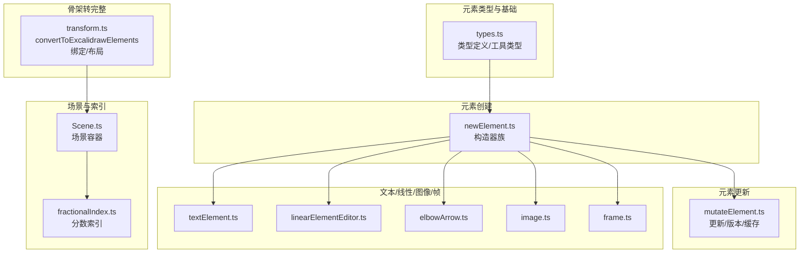
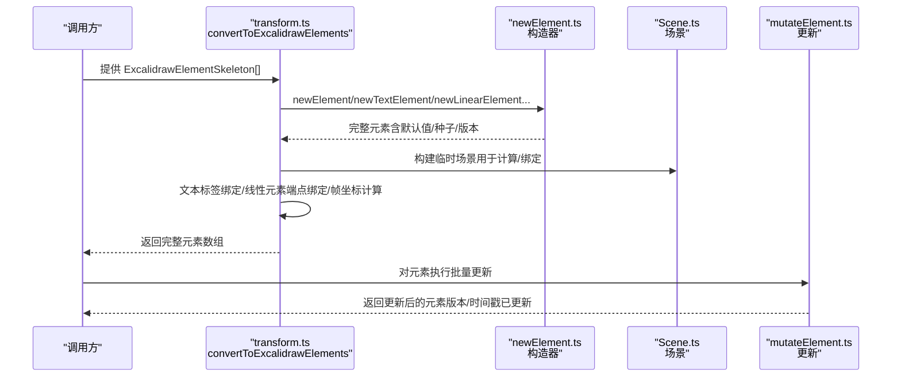
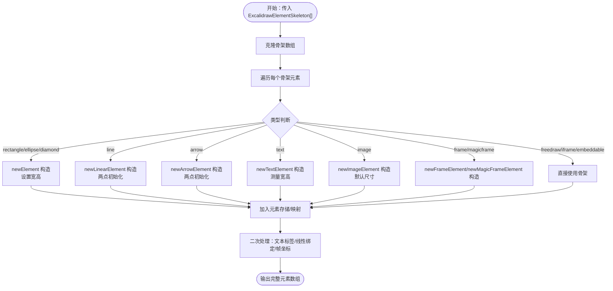
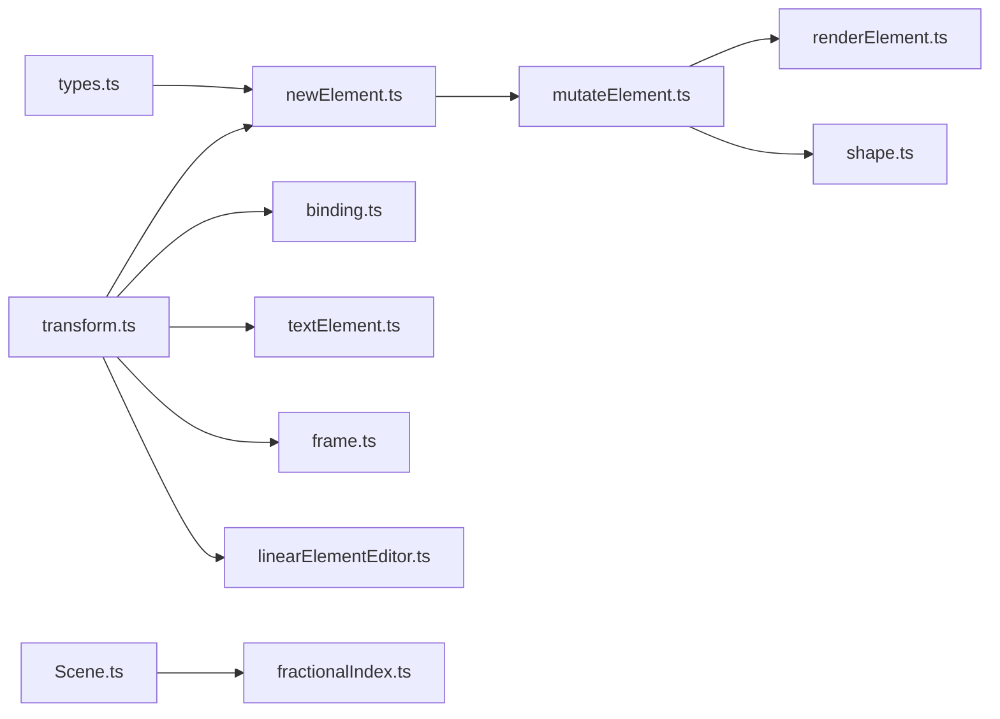

# 元素系统设计

<cite>
**本文引用的文件**   
- [packages/element/src/types.ts](file://packages/element/src/types.ts)
- [packages/element/src/index.ts](file://packages/element/src/index.ts)
- [packages/element/src/newElement.ts](file://packages/element/src/newElement.ts)
- [packages/element/src/mutateElement.ts](file://packages/element/src/mutateElement.ts)
- [packages/element/src/transform.ts](file://packages/element/src/transform.ts)
- [packages/element/src/comparisons.ts](file://packages/element/src/comparisons.ts)
- [packages/element/src/bounds.ts](file://packages/element/src/bounds.ts)
- [packages/element/src/textElement.ts](file://packages/element/src/textElement.ts)
- [packages/element/src/textMeasurements.ts](file://packages/element/src/textMeasurements.ts)
- [packages/element/src/textWrapping.ts](file://packages/element/src/textWrapping.ts)
- [packages/element/src/binding.ts](file://packages/element/src/binding.ts)
- [packages/element/src/frame.ts](file://packages/element/src/frame.ts)
- [packages/element/src/image.ts](file://packages/element/src/image.ts)
- [packages/element/src/linearElementEditor.ts](file://packages/element/src/linearElementEditor.ts)
- [packages/element/src/elbowArrow.ts](file://packages/element/src/elbowArrow.ts)
- [packages/element/src/typeChecks.ts](file://packages/element/src/typeChecks.ts)
- [packages/element/src/sizeHelpers.ts](file://packages/element/src/sizeHelpers.ts)
- [packages/element/src/sortElements.ts](file://packages/element/src/sortElements.ts)
- [packages/element/src/zindex.ts](file://packages/element/src/zindex.ts)
- [packages/element/src/renderElement.ts](file://packages/element/src/renderElement.ts)
- [packages/element/src/Scene.ts](file://packages/element/src/Scene.ts)
- [packages/element/src/fractionalIndex.ts](file://packages/element/src/fractionalIndex.ts)
- [packages/element/src/delta.ts](file://packages/element/src/delta.ts)
- [packages/element/src/distance.ts](file://packages/element/src/distance.ts)
- [packages/element/src/collision.ts](file://packages/element/src/collision.ts)
- [packages/element/src/resizeElements.ts](file://packages/element/src/resizeElements.ts)
- [packages/element/src/resizeTest.ts](file://packages/element/src/resizeTest.ts)
- [packages/element/src/selection.ts](file://packages/element/src/selection.ts)
- [packages/element/src/groups.ts](file://packages/element/src/groups.ts)
- [packages/element/src/showSelectedShapeActions.ts](file://packages/element/src/showSelectedShapeActions.ts)
- [packages/element/src/positionElementsOnGrid.ts](file://packages/element/src/positionElementsOnGrid.ts)
- [packages/element/src/store.ts](file://packages/element/src/store.ts)
- [packages/element/src/utils.ts](file://packages/element/src/utils.ts)
- [packages/element/src/shape.ts](file://packages/element/src/shape.ts)
- [packages/element/src/transformHandles.ts](file://packages/element/src/transformHandles.ts)
- [packages/element/src/elementLink.ts](file://packages/element/src/elementLink.ts)
- [packages/element/src/embeddable.ts](file://packages/element/src/embeddable.ts)
- [packages/element/src/flowchart.ts](file://packages/element/src/flowchart.ts)
- [packages/element/src/heading.ts](file://packages/element/src/heading.ts)
- [packages/element/src/align.ts](file://packages/element/src/align.ts)
- [packages/element/src/distribute.ts](file://packages/element/src/distribute.ts)
- [packages/element/src/dragElements.ts](file://packages/element/src/dragElements.ts)
- [packages/element/src/duplicate.ts](file://packages/element/src/duplicate.ts)
- [packages/element/src/sortElements.ts](file://packages/element/src/sortElements.ts)
- [packages/element/src/zindex.ts](file://packages/element/src/zindex.ts)
- [packages/element/src/Scene.ts](file://packages/element/src/Scene.ts)
- [packages/element/src/fractionalIndex.ts](file://packages/element/src/fractionalIndex.ts)
- [packages/element/src/delta.ts](file://packages/element/src/delta.ts)
- [packages/element/src/distance.ts](file://packages/element/src/distance.ts)
- [packages/element/src/collision.ts](file://packages/element/src/collision.ts)
- [packages/element/src/resizeElements.ts](file://packages/element/src/resizeElements.ts)
- [packages/element/src/resizeTest.ts](file://packages/element/src/resizeTest.ts)
- [packages/element/src/selection.ts](file://packages/element/src/selection.ts)
- [packages/element/src/groups.ts](file://packages/element/src/groups.ts)
- [packages/element/src/showSelectedShapeActions.ts](file://packages/element/src/showSelectedShapeActions.ts)
- [packages/element/src/positionElementsOnGrid.ts](file://packages/element/src/positionElementsOnGrid.ts)
- [packages/element/src/store.ts](file://packages/element/src/store.ts)
- [packages/element/src/utils.ts](file://packages/element/src/utils.ts)
- [packages/element/src/shape.ts](file://packages/element/src/shape.ts)
- [packages/element/src/transformHandles.ts](file://packages/element/src/transformHandles.ts)
- [packages/element/src/elementLink.ts](file://packages/element/src/elementLink.ts)
- [packages/element/src/embeddable.ts](file://packages/element/src/embeddable.ts)
- [packages/element/src/flowchart.ts](file://packages/element/src/flowchart.ts)
- [packages/element/src/heading.ts](file://packages/element/src/heading.ts)
- [packages/element/src/align.ts](file://packages/element/src/align.ts)
- [packages/element/src/distribute.ts](file://packages/element/src/distribute.ts)
- [packages/element/src/dragElements.ts](file://packages/element/src/dragElements.ts)
- [packages/element/src/duplicate.ts](file://packages/element/src/duplicate.ts)
</cite>

## 目录
1. [引言](#引言)
2. [项目结构](#项目结构)
3. [核心组件](#核心组件)
4. [架构总览](#架构总览)
5. [详细组件分析](#详细组件分析)
6. [依赖分析](#依赖分析)
7. [性能考量](#性能考量)
8. [故障排查指南](#故障排查指南)
9. [结论](#结论)
10. [附录](#附录)

## 引言
本文件面向 Excalidraw 的“元素系统”设计，系统性阐述 ExcalidrawElement 类型体系、元素属性与验证机制、元素操作 API 设计、序列化与反序列化流程，以及扩展自定义元素类型的实践指南。目标是帮助开发者在不深入阅读全部源码的前提下，快速理解并高效使用或扩展元素系统。

## 项目结构
元素系统主要位于 packages/element 包中，采用按功能域分层的模块化组织方式：
- types.ts：定义元素类型、属性枚举、映射与工具类型
- newElement.ts：元素构造器族（newElement、newTextElement、newLinearElement 等）
- mutateElement.ts：元素更新与版本管理
- transform.ts：骨架元素到完整元素的转换（convertToExcalidrawElements）及绑定逻辑
- 子模块：按功能拆分（如 textElement、bounds、binding、frame、image、linearElementEditor、elbowArrow、typeChecks、sizeHelpers、sortElements、zindex、renderElement、Scene、fractionalIndex、delta、distance、collision、resizeElements、resizeTest、selection、groups、showSelectedShapeActions、positionElementsOnGrid、store、utils、shape、transformHandles、elementLink、embeddable、flowchart、heading、align、distribute、dragElements、duplicate 等）



图表来源
- [packages/element/src/types.ts](file://packages/element/src/types.ts)
- [packages/element/src/newElement.ts](file://packages/element/src/newElement.ts)
- [packages/element/src/mutateElement.ts](file://packages/element/src/mutateElement.ts)
- [packages/element/src/transform.ts](file://packages/element/src/transform.ts)
- [packages/element/src/Scene.ts](file://packages/element/src/Scene.ts)
- [packages/element/src/fractionalIndex.ts](file://packages/element/src/fractionalIndex.ts)
- [packages/element/src/textElement.ts](file://packages/element/src/textElement.ts)
- [packages/element/src/linearElementEditor.ts](file://packages/element/src/linearElementEditor.ts)
- [packages/element/src/elbowArrow.ts](file://packages/element/src/elbowArrow.ts)
- [packages/element/src/image.ts](file://packages/element/src/image.ts)
- [packages/element/src/frame.ts](file://packages/element/src/frame.ts)

章节来源
- [packages/element/src/index.ts](file://packages/element/src/index.ts)
- [packages/element/src/types.ts](file://packages/element/src/types.ts)

## 核心组件
- 元素类型体系
  - 基类属性：位置、尺寸、旋转、描边/填充、透明度、粗糙度、圆角、版本号、索引、组/帧归属、边界元素、锁定、链接等
  - 具体元素类型：通用图形（矩形/菱形/椭圆）、文本、线性元素（折线/箭头）、自由绘制、图片、帧（普通/魔法）、内嵌/iframe
  - 工具类型：只读包装、非删除元素、有序元素、元素映射等
- 属性验证与默认值
  - 构造器对关键字段进行默认值注入与范围检查
  - 文本测量、自动换行、容器绑定等运行时校验
- 操作 API
  - 创建：newElement、newTextElement、newLinearElement、newArrowElement、newImageElement、newFrameElement、newMagicFrameElement、newFreeDrawElement
  - 修改：mutateElement（批量更新、版本号/时间戳更新、缓存失效）
  - 查询：getNonDeletedElements、getVisibleElements、hashElementsVersion、isNonDeletedElement
  - 绑定/布局：bindTextToContainer、bindLinearElementToElement、convertToExcalidrawElements
- 序列化与反序列化
  - ExcalidrawElement 为 JSON 可序列化，包含协作/持久化所需元信息（版本、版本随机数、索引）
  - 骨架元素（ExcalidrawElementSkeleton）简化创建流程，通过转换函数生成完整元素

章节来源
- [packages/element/src/types.ts](file://packages/element/src/types.ts)
- [packages/element/src/newElement.ts](file://packages/element/src/newElement.ts)
- [packages/element/src/mutateElement.ts](file://packages/element/src/mutateElement.ts)
- [packages/element/src/transform.ts](file://packages/element/src/transform.ts)
- [packages/element/src/index.ts](file://packages/element/src/index.ts)

## 架构总览
元素系统围绕“类型安全 + 运行时校验 + 场景管理 + 协作一致性”展开，核心流程如下：



图表来源
- [packages/element/src/transform.ts](file://packages/element/src/transform.ts)
- [packages/element/src/newElement.ts](file://packages/element/src/newElement.ts)
- [packages/element/src/mutateElement.ts](file://packages/element/src/mutateElement.ts)
- [packages/element/src/Scene.ts](file://packages/element/src/Scene.ts)

## 详细组件分析

### 类型体系与继承关系
- 基类 _ExcalidrawElementBase：统一的几何、样式、行为与协作字段
- 具体元素类型：通过 type 字段区分；部分类型带有专属属性（如 points、startBinding、endBinding、fileId、name 等）
- 工具联合类型：ExcalidrawElement、ExcalidrawGenericElement、ExcalidrawLinearElement、ExcalidrawTextElement、ExcalidrawImageElement、ExcalidrawFrameLikeElement 等
- 映射与过滤：ElementsMap、NonDeletedSceneElementsMap、Ordered、NonDeleted 等

```mermaid
classDiagram
class _ExcalidrawElementBase {
+id : string
+x : number
+y : number
+width : number
+height : number
+angle : Radians
+strokeColor : string
+backgroundColor : string
+fillStyle : FillStyle
+strokeWidth : number
+strokeStyle : StrokeStyle
+roughness : number
+opacity : number
+roundness : null|{type,value?}
+seed : number
+version : number
+versionNonce : number
+index : FractionalIndex|null
+isDeleted : boolean
+groupIds : string[]
+frameId : string|null
+boundElements : BoundElement[]|null
+updated : number
+link : string|null
+locked : boolean
+customData : Record<string,any>
}
class ExcalidrawGenericElement
class ExcalidrawTextElement
class ExcalidrawLinearElement
class ExcalidrawArrowElement
class ExcalidrawFreeDrawElement
class ExcalidrawImageElement
class ExcalidrawFrameElement
class ExcalidrawMagicFrameElement
class ExcalidrawIframeElement
class ExcalidrawEmbeddableElement
_ExcalidrawElementBase <|-- ExcalidrawGenericElement
_ExcalidrawElementBase <|-- ExcalidrawTextElement
_ExcalidrawElementBase <|-- ExcalidrawLinearElement
_ExcalidrawElementBase <|-- ExcalidrawFreeDrawElement
_ExcalidrawElementBase <|-- ExcalidrawImageElement
_ExcalidrawElementBase <|-- ExcalidrawFrameElement
_ExcalidrawElementBase <|-- ExcalidrawMagicFrameElement
_ExcalidrawElementBase <|-- ExcalidrawIframeElement
_ExcalidrawElementBase <|-- ExcalidrawEmbeddableElement
```

图表来源
- [packages/element/src/types.ts](file://packages/element/src/types.ts)

章节来源
- [packages/element/src/types.ts](file://packages/element/src/types.ts)

### 元素属性定义与验证机制
- 几何属性：x/y/width/height/angle，用于定位与渲染
- 样式属性：strokeColor、backgroundColor、fillStyle、strokeWidth、strokeStyle、roughness、opacity、roundness
- 行为属性：seed（稳定形状生成）、version/versionNonce（协作/持久化）、index（分数索引排序）、isDeleted、groupIds、frameId、boundElements、updated、link、locked、customData
- 默认值与校验：
  - 构造器注入默认值（如默认字体、对齐、圆角、锁定状态等）
  - 大尺寸/大坐标的异常日志提示
  - 文本测量与自动换行、容器绑定、线性元素端点绑定、帧坐标计算均在运行时完成

章节来源
- [packages/element/src/types.ts](file://packages/element/src/types.ts)
- [packages/element/src/newElement.ts](file://packages/element/src/newElement.ts)
- [packages/element/src/textMeasurements.ts](file://packages/element/src/textMeasurements.ts)
- [packages/element/src/textWrapping.ts](file://packages/element/src/textWrapping.ts)
- [packages/element/src/binding.ts](file://packages/element/src/binding.ts)
- [packages/element/src/frame.ts](file://packages/element/src/frame.ts)
- [packages/element/src/linearElementEditor.ts](file://packages/element/src/linearElementEditor.ts)

### 元素操作 API 设计
- 创建
  - newElement：通用图形元素
  - newTextElement：文本元素（含自动换行、容器绑定）
  - newLinearElement/newArrowElement：线性/箭头元素（支持折线/肘形/曲线）
  - newImageElement：图片元素（含裁剪、缩放、HSLA 调节）
  - newFrameElement/newMagicFrameElement：帧元素
  - newFreeDrawElement：自由绘制元素
- 修改
  - mutateElement：批量更新、版本号/随机数更新、时间戳更新、缓存失效（形状/文本画布）
  - newElementWith：轻量更新（返回新对象）
  - bumpVersion：仅提升版本号/随机数/时间戳
- 查询
  - getNonDeletedElements、getVisibleElements、isNonDeletedElement
  - hashElementsVersion：基于 versionNonce 的哈希，用于协作一致性
- 绑定/布局
  - bindTextToContainer：文本标签绑定
  - bindLinearElementToElement：线性元素端点绑定
  - convertToExcalidrawElements：骨架元素到完整元素的转换与绑定



图表来源
- [packages/element/src/transform.ts](file://packages/element/src/transform.ts)
- [packages/element/src/newElement.ts](file://packages/element/src/newElement.ts)
- [packages/element/src/textElement.ts](file://packages/element/src/textElement.ts)
- [packages/element/src/binding.ts](file://packages/element/src/binding.ts)
- [packages/element/src/frame.ts](file://packages/element/src/frame.ts)

章节来源
- [packages/element/src/newElement.ts](file://packages/element/src/newElement.ts)
- [packages/element/src/mutateElement.ts](file://packages/element/src/mutateElement.ts)
- [packages/element/src/transform.ts](file://packages/element/src/transform.ts)
- [packages/element/src/index.ts](file://packages/element/src/index.ts)

### 序列化与反序列化
- JSON 可序列化：ExcalidrawElement 为纯数据结构，不含计算属性
- 协作/持久化：version、versionNonce、index、updated 等字段确保并发一致性与顺序
- 骨架到完整：ExcalidrawElementSkeleton 用于简化创建，转换后补齐所有必要字段并建立绑定关系
- 兼容性：保留 customData 以承载扩展数据；对历史数据的向后兼容通过默认值与可选字段保障

章节来源
- [packages/element/src/types.ts](file://packages/element/src/types.ts)
- [packages/element/src/transform.ts](file://packages/element/src/transform.ts)

### 自定义元素类型开发指南
- 设计原则
  - 新增类型需遵循统一基类字段约定，避免引入不可序列化/不可共享的状态
  - 通过 type 字段标识类型，保持与现有类型体系一致
  - 若涉及复杂几何/渲染，参考现有元素（如线性/箭头/自由绘制/图片/文本）的实现模式
- 实现步骤
  1) 在类型定义中新增元素接口，并将其纳入 ExcalidrawElement 联合类型
  2) 在 newElement.ts 中添加对应的构造器（参考现有构造器的默认值注入与校验）
  3) 如需文本/绑定/布局能力，补充相应逻辑（参考 textElement、binding、frame 等模块）
  4) 在 comparisons.ts 中补充类型判定函数（如 hasStrokeColor、canChangeRoundness 等），以便 UI/工具栏适配
  5) 在 transform.ts 中完善 convertToExcalidrawElements 的分支处理
  6) 在 mutateElement.ts 中确认更新流程与缓存失效策略
  7) 编写单元测试覆盖创建、更新、绑定、序列化等场景
- 示例路径
  - 新增类型接口与联合类型：[packages/element/src/types.ts](file://packages/element/src/types.ts)
  - 构造器实现：[packages/element/src/newElement.ts](file://packages/element/src/newElement.ts)
  - 类型判定：[packages/element/src/comparisons.ts](file://packages/element/src/comparisons.ts)
  - 转换流程：[packages/element/src/transform.ts](file://packages/element/src/transform.ts)
  - 更新与缓存：[packages/element/src/mutateElement.ts](file://packages/element/src/mutateElement.ts)

章节来源
- [packages/element/src/types.ts](file://packages/element/src/types.ts)
- [packages/element/src/newElement.ts](file://packages/element/src/newElement.ts)
- [packages/element/src/comparisons.ts](file://packages/element/src/comparisons.ts)
- [packages/element/src/transform.ts](file://packages/element/src/transform.ts)
- [packages/element/src/mutateElement.ts](file://packages/element/src/mutateElement.ts)

## 依赖分析
- 内聚性
  - 各功能模块职责清晰：类型定义集中于 types.ts；创建/更新/查询/转换分别由对应模块承担
- 耦合度
  - newElement.ts 依赖 common 的默认值与工具；mutateElement.ts 依赖 shape 缓存与渲染缓存；transform.ts 依赖 Scene 与绑定/文本模块
- 关键依赖链
  - types.ts → newElement.ts → mutateElement.ts → renderElement.ts/shape.ts
  - transform.ts → newElement.ts/binding.ts/textElement.ts/frame.ts/linearElementEditor.ts
  - Scene.ts → fractionalIndex.ts → 排序/索引管理



图表来源
- [packages/element/src/types.ts](file://packages/element/src/types.ts)
- [packages/element/src/newElement.ts](file://packages/element/src/newElement.ts)
- [packages/element/src/mutateElement.ts](file://packages/element/src/mutateElement.ts)
- [packages/element/src/renderElement.ts](file://packages/element/src/renderElement.ts)
- [packages/element/src/shape.ts](file://packages/element/src/shape.ts)
- [packages/element/src/transform.ts](file://packages/element/src/transform.ts)
- [packages/element/src/binding.ts](file://packages/element/src/binding.ts)
- [packages/element/src/textElement.ts](file://packages/element/src/textElement.ts)
- [packages/element/src/frame.ts](file://packages/element/src/frame.ts)
- [packages/element/src/linearElementEditor.ts](file://packages/element/src/linearElementEditor.ts)
- [packages/element/src/Scene.ts](file://packages/element/src/Scene.ts)
- [packages/element/src/fractionalIndex.ts](file://packages/element/src/fractionalIndex.ts)

章节来源
- [packages/element/src/index.ts](file://packages/element/src/index.ts)

## 性能考量
- 版本与索引
  - version/versionNonce 用于协作一致性，避免不必要的重绘
  - 分数索引（fractionalIndex）用于多玩家场景下的顺序同步
- 缓存与增量更新
  - mutateElement 对 points/groupIds/scale 等字段进行细粒度比较，减少不必要更新
  - 形状缓存与文本画布缓存按需失效，降低渲染成本
- 尺寸与可见性
  - getVisibleElements 过滤不可见元素，减少渲染负担
  - isInvisiblySmallElement 辅助剔除微小元素

章节来源
- [packages/element/src/mutateElement.ts](file://packages/element/src/mutateElement.ts)
- [packages/element/src/sizeHelpers.ts](file://packages/element/src/sizeHelpers.ts)
- [packages/element/src/index.ts](file://packages/element/src/index.ts)
- [packages/element/src/fractionalIndex.ts](file://packages/element/src/fractionalIndex.ts)

## 故障排查指南
- 常见问题
  - 元素重复 ID：转换过程中检测并报错，检查骨架元素是否提供唯一 id 或允许重新生成
  - 绑定元素缺失：start/end 绑定的目标不存在会记录错误日志，确认目标元素 id 正确
  - 帧坐标异常：若手动提供了帧的 x/y/width/height，系统会给出提示，建议移除以让系统自动计算
  - 文本测量异常：检查字体、字号、行高与文本内容，确保 normalize/measure 流程正确
- 定位手段
  - 使用 getNonDeletedElements/getVisibleElements 快速过滤
  - 使用 hashElementsVersion 检查协作一致性
  - 逐步缩小范围：先检查转换流程，再检查绑定/布局，最后检查更新与缓存

章节来源
- [packages/element/src/transform.ts](file://packages/element/src/transform.ts)
- [packages/element/src/index.ts](file://packages/element/src/index.ts)

## 结论
Excalidraw 的元素系统以类型安全为核心，结合运行时校验、场景管理与协作一致性设计，形成了可扩展、可维护且高性能的元素体系。通过标准化的创建/更新/查询/转换 API，开发者可以高效地扩展自定义元素类型，并在保持系统稳定性的前提下满足多样化需求。

## 附录
- 相关工具与常量
  - 比较与判定：comparisons.ts
  - 边界与碰撞：bounds.ts、collision.ts、distance.ts
  - 文本测量与换行：textMeasurements.ts、textWrapping.ts
  - 绑定与帧：binding.ts、frame.ts
  - 线性元素编辑：linearElementEditor.ts、elbowArrow.ts
  - 排序与层级：sortElements.ts、zindex.ts
  - 渲染与缓存：renderElement.ts、shape.ts
  - 场景与索引：Scene.ts、fractionalIndex.ts
  - 其他实用模块：align.ts、distribute.ts、dragElements.ts、duplicate.ts、positionElementsOnGrid.ts、store.ts、utils.ts、transformHandles.ts、elementLink.ts、embeddable.ts、flowchart.ts、heading.ts、delta.ts、resizeElements.ts、resizeTest.ts、selection.ts、groups.ts、showSelectedShapeActions.ts