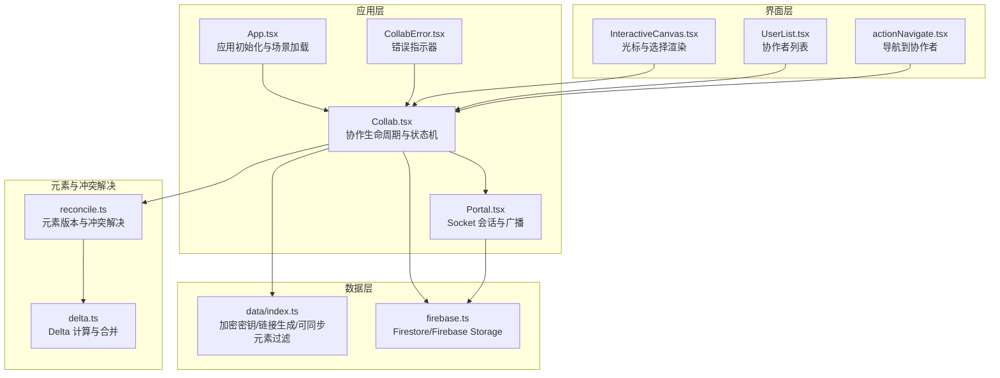
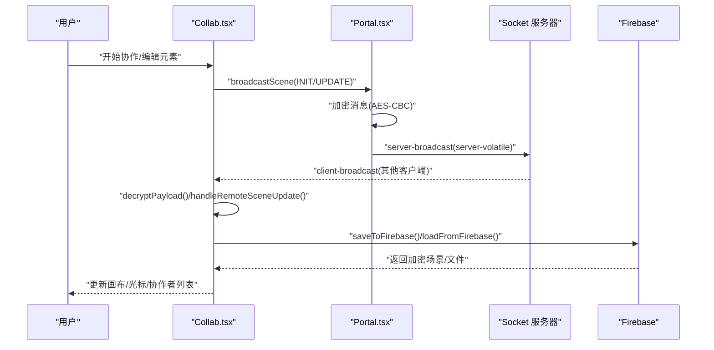
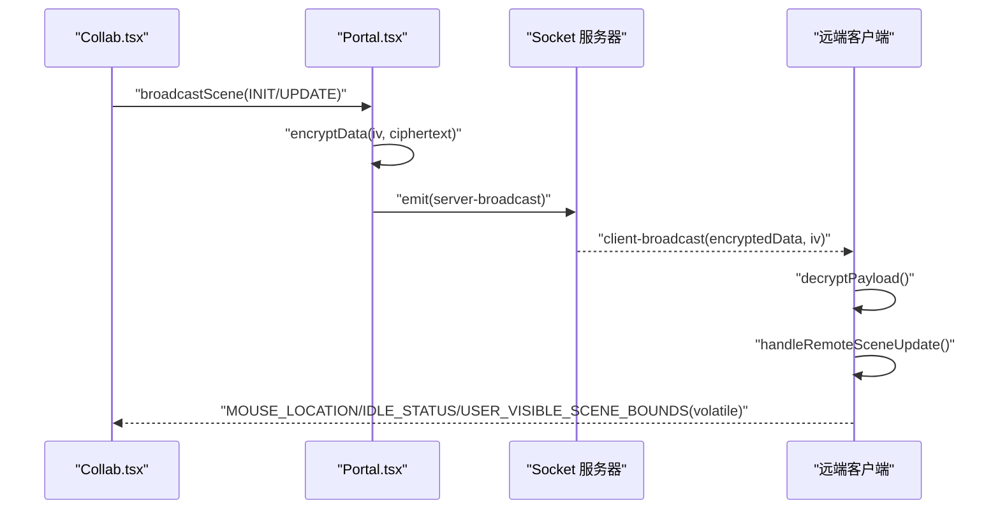
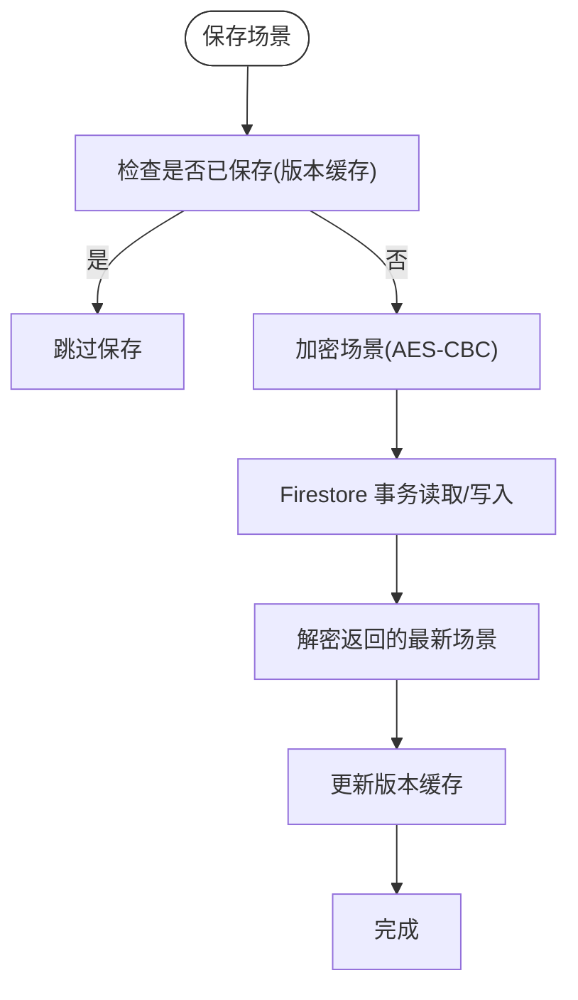
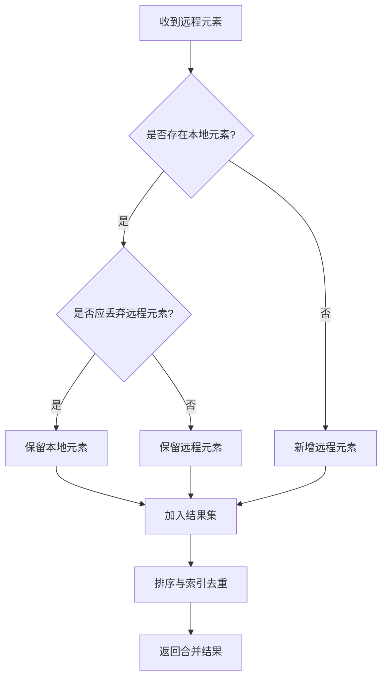
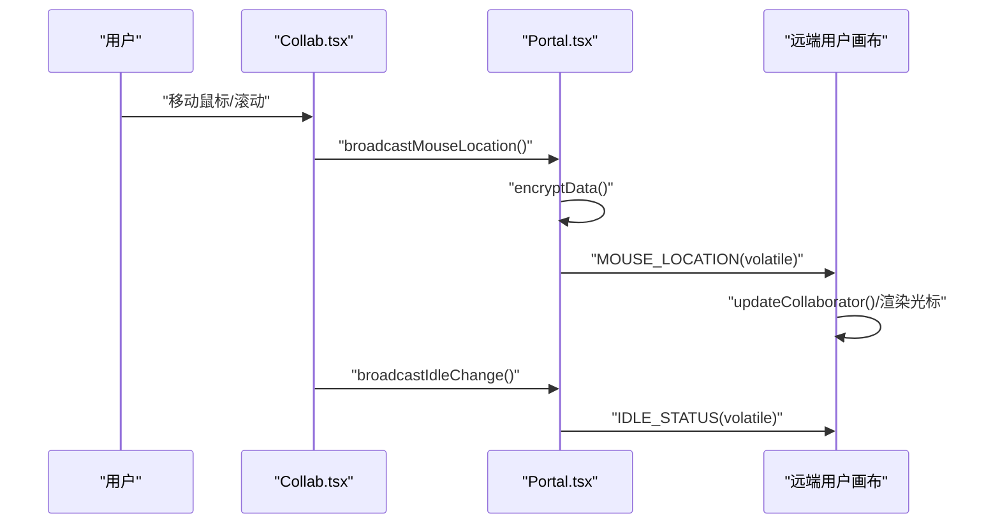
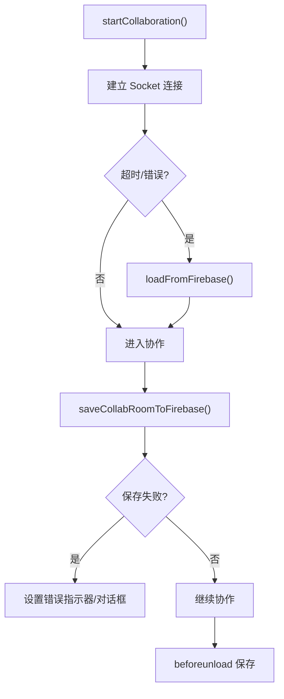
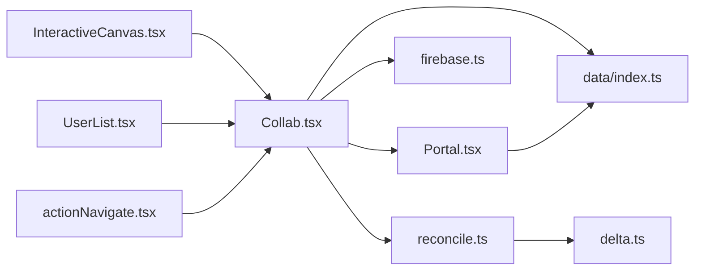

# 协作机制架构

<cite>
**本文引用的文件**
- [Collab.tsx](file://excalidraw-app/collab/Collab.tsx)
- [Portal.tsx](file://excalidraw-app/collab/Portal.tsx)
- [firebase.ts](file://excalidraw-app/data/firebase.ts)
- [index.ts](file://excalidraw-app/data/index.ts)
- [app_constants.ts](file://excalidraw-app/app_constants.ts)
- [reconcile.ts](file://packages/excalidraw/data/reconcile.ts)
- [delta.ts](file://packages/element/src/delta.ts)
- [App.tsx](file://excalidraw-app/App.tsx)
- [InteractiveCanvas.tsx](file://packages/excalidraw/components/canvases/InteractiveCanvas.tsx)
- [UserList.tsx](file://packages/excalidraw/components/UserList.tsx)
- [actionNavigate.tsx](file://packages/excalidraw/actions/actionNavigate.tsx)
- [CollabError.tsx](file://excalidraw-app/collab/CollabError.tsx)
</cite>

## 目录
1. [简介](#简介)
2. [项目结构](#项目结构)
3. [核心组件](#核心组件)
4. [架构总览](#架构总览)
5. [详细组件分析](#详细组件分析)
6. [依赖关系分析](#依赖关系分析)
7. [性能考量](#性能考量)
8. [故障排查指南](#故障排查指南)
9. [结论](#结论)
10. [附录](#附录)

## 简介
本文件面向开发者与技术文档读者，系统性解析 Excalidraw 实时协作机制的架构设计与实现细节。内容涵盖 WebSocket 通信协议、Firebase 集成、状态同步与冲突解决、用户光标与在线状态管理、权限与安全、错误处理与恢复策略，并提供扩展与性能优化建议。

## 项目结构
协作相关代码主要分布在以下模块：
- 应用层协作入口与生命周期管理：excalidraw-app/collab/Collab.tsx
- 通信通道封装与广播：excalidraw-app/collab/Portal.tsx
- 数据持久化与加密：excalidraw-app/data/firebase.ts、excalidraw-app/data/index.ts
- 元素版本与冲突解决：packages/excalidraw/data/reconcile.ts、packages/element/src/delta.ts
- 应用初始化与场景加载：excalidraw-app/App.tsx
- 用户界面与光标渲染：packages/excalidraw/components/canvases/InteractiveCanvas.tsx、packages/excalidraw/components/UserList.tsx
- 导航到协作者：packages/excalidraw/actions/actionNavigate.tsx
- 错误指示器：excalidraw-app/collab/CollabError.tsx
- 常量与事件定义：excalidraw-app/app_constants.ts

**图表来源**
- [Collab.tsx:132-280](file://excalidraw-app/collab/Collab.tsx#L132-L280)
- [Portal.tsx:25-83](file://excalidraw-app/collab/Portal.tsx#L25-L83)
- [firebase.ts:1-80](file://excalidraw-app/data/firebase.ts#L1-L80)
- [index.ts:68-164](file://excalidraw-app/data/index.ts#L68-L164)
- [reconcile.ts:73-119](file://packages/excalidraw/data/reconcile.ts#L73-L119)
- [delta.ts:75-200](file://packages/element/src/delta.ts#L75-L200)
- [App.tsx:328-372](file://excalidraw-app/App.tsx#L328-L372)
- [InteractiveCanvas.tsx:107-143](file://packages/excalidraw/components/canvases/InteractiveCanvas.tsx#L107-L143)
- [UserList.tsx:112-119](file://packages/excalidraw/components/UserList.tsx#L112-L119)
- [actionNavigate.tsx:21-44](file://packages/excalidraw/actions/actionNavigate.tsx#L21-L44)
- [CollabError.tsx:16-34](file://excalidraw-app/collab/CollabError.tsx#L16-L34)

**章节来源**
- [Collab.tsx:1-120](file://excalidraw-app/collab/Collab.tsx#L1-L120)
- [Portal.tsx:1-40](file://excalidraw-app/collab/Portal.tsx#L1-L40)
- [firebase.ts:1-40](file://excalidraw-app/data/firebase.ts#L1-L40)
- [index.ts:1-40](file://excalidraw-app/data/index.ts#L1-L40)
- [app_constants.ts:1-35](file://excalidraw-app/app_constants.ts#L1-L35)

## 核心组件
- 协作主控制器（Collab）
  - 负责协作生命周期：启动/停止、房间初始化、场景加载与保存、错误处理、离线状态切换。
  - 维护协作者集合与在线状态，处理鼠标位置、视口边界、空闲状态广播与接收。
  - 通过 Portal 进行 Socket 广播与文件上传。
- 通信门户（Portal）
  - 封装 Socket 会话，负责加密消息发送、按需广播场景更新、文件上传队列与状态回写。
  - 维护已广播元素版本映射，避免重复传输。
- Firebase 持久化
  - Firestore 存储加密后的场景快照；Firebase Storage 存储二进制文件。
  - 提供事务式保存、版本缓存与加载、文件解压与解密。
- 冲突解决与状态同步
  - 基于元素版本号与版本随机数的确定性冲突解决策略。
  - 通过增量广播与定期全量同步保证收敛一致性。
- 界面与交互
  - 光标与选区可视化、协作者列表、导航到协作者动作、错误提示。

**章节来源**
- [Collab.tsx:132-280](file://excalidraw-app/collab/Collab.tsx#L132-L280)
- [Portal.tsx:25-83](file://excalidraw-app/collab/Portal.tsx#L25-L83)
- [firebase.ts:187-247](file://excalidraw-app/data/firebase.ts#L187-L247)
- [reconcile.ts:73-119](file://packages/excalidraw/data/reconcile.ts#L73-L119)
- [InteractiveCanvas.tsx:107-143](file://packages/excalidraw/components/canvases/InteractiveCanvas.tsx#L107-L143)

## 架构总览
协作系统采用“Socket 通信 + Firebase 持久化 + 元素版本冲突解决”的混合架构：
- 通信层：Socket.IO 客户端，支持 WebSocket 与轮询回退；消息以 AES-CBC 加密并携带 IV。
- 存储层：Firestore 存放加密场景快照；Firebase Storage 存放压缩加密的二进制文件。
- 同步层：基于元素版本号与版本随机数的确定性冲突解决；按需增量广播 + 定期全量同步。
- 界面层：渲染协作者光标、选区与用户名；提供“跟随协作者”导航能力。

**图表来源**
- [Collab.tsx:568-706](file://excalidraw-app/collab/Collab.tsx#L568-L706)
- [Portal.tsx:85-102](file://excalidraw-app/collab/Portal.tsx#L85-L102)
- [firebase.ts:187-247](file://excalidraw-app/data/firebase.ts#L187-L247)

## 详细组件分析

### WebSocket 通信协议与事件流
- 事件与子类型
  - 服务器事件：server-broadcast、server-volatile-broadcast、user-follow、user-follow-room-change
  - 子类型：SCENE_INIT、SCENE_UPDATE、MOUSE_LOCATION、IDLE_STATUS、USER_VISIBLE_SCENE_BOUNDS
- 消息流程
  - 初始化：首次入房或断线重连后，服务端触发 init-room，客户端加入房间并广播自身 INIT。
  - 场景更新：本地元素变更经 Portal 增量广播，远端解密后进行冲突解决与渲染。
  - 光标与视口：移动端/高频率事件使用 volatile 广播，降低带宽占用。
- 加密与完整性
  - 所有消息在 Portal 中加密并附带 IV，解密失败则返回无效响应类型。

**图表来源**
- [Portal.tsx:85-102](file://excalidraw-app/collab/Portal.tsx#L85-L102)
- [Collab.tsx:568-706](file://excalidraw-app/collab/Collab.tsx#L568-L706)
- [app_constants.ts:16-30](file://excalidraw-app/app_constants.ts#L16-L30)

**章节来源**
- [Portal.tsx:25-83](file://excalidraw-app/collab/Portal.tsx#L25-L83)
- [Collab.tsx:568-706](file://excalidraw-app/collab/Collab.tsx#L568-L706)
- [app_constants.ts:16-30](file://excalidraw-app/app_constants.ts#L16-L30)

### Firebase 集成与数据持久化
- 场景存储
  - 使用 Firestore 文档存储加密场景：包含场景版本号、IV 与密文。
  - 保存采用事务：先读取旧快照，与本地元素进行冲突解决，再写入新快照。
  - 版本缓存：弱引用缓存每个 Socket 对应的场景版本，用于去重判断。
- 文件存储
  - Firebase Storage 以压缩+加密形式存储二进制文件，支持并发上传与错误收集。
  - 下载时解压并解密，返回 DataURL 供画布使用。
- 加密与密钥
  - 房间密钥由客户端生成并通过 URL hash 传递，不暴露给服务器。
  - 加密算法为 AES-CBC，IV 固定长度，确保兼容性。

**图表来源**
- [firebase.ts:187-247](file://excalidraw-app/data/firebase.ts#L187-L247)
- [firebase.ts:118-129](file://excalidraw-app/data/firebase.ts#L118-L129)

**章节来源**
- [firebase.ts:187-247](file://excalidraw-app/data/firebase.ts#L187-L247)
- [firebase.ts:274-320](file://excalidraw-app/data/firebase.ts#L274-L320)

### 冲突解决与状态同步机制
- 冲突解决策略
  - 基于元素版本号与版本随机数的确定性规则：若本地元素正在编辑或版本更高，则保留本地；否则保留远程。
  - 处理顺序：先处理远程元素，再补全本地未覆盖项；最后对索引进行去重与校验。
- 元素版本与索引
  - 元素版本随修改递增；版本随机数用于同版本冲突的稳定仲裁。
  - 同步分数组合索引，保证排序一致性与绑定关系正确。
- 增量与全量同步
  - Portal 维护已广播版本映射，仅广播变化元素；每 20 秒进行一次全量同步以防漂移。

**图表来源**
- [reconcile.ts:73-119](file://packages/excalidraw/data/reconcile.ts#L73-L119)
- [Collab.tsx:755-787](file://excalidraw-app/collab/Collab.tsx#L755-L787)

**章节来源**
- [reconcile.ts:23-44](file://packages/excalidraw/data/reconcile.ts#L23-L44)
- [reconcile.ts:73-119](file://packages/excalidraw/data/reconcile.ts#L73-L119)
- [Collab.tsx:755-787](file://excalidraw-app/collab/Collab.tsx#L755-L787)

### 用户光标同步与在线状态管理
- 光标同步
  - 高频事件（鼠标移动/按键）使用 volatile 广播，包含指针坐标、按钮状态、用户名与当前选中元素。
  - 本地渲染：InteractiveCanvas 将场景坐标转为视口坐标，绘制协作者光标与选区。
- 在线状态
  - 基于可见性与指针移动事件检测活跃/空闲/离开状态，定时上报 IDLE_STATUS。
  - 用户列表展示协作者头像、名称与状态；支持“跟随协作者”导航到其视口范围。

**图表来源**
- [Collab.tsx:831-867](file://excalidraw-app/collab/Collab.tsx#L831-L867)
- [Portal.tsx:202-224](file://excalidraw-app/collab/Portal.tsx#L202-L224)
- [InteractiveCanvas.tsx:107-143](file://packages/excalidraw/components/canvases/InteractiveCanvas.tsx#L107-L143)

**章节来源**
- [Collab.tsx:831-912](file://excalidraw-app/collab/Collab.tsx#L831-L912)
- [Portal.tsx:185-224](file://excalidraw-app/collab/Portal.tsx#L185-L224)
- [InteractiveCanvas.tsx:107-143](file://packages/excalidraw/components/canvases/InteractiveCanvas.tsx#L107-L143)
- [UserList.tsx:112-119](file://packages/excalidraw/components/UserList.tsx#L112-L119)
- [actionNavigate.tsx:21-44](file://packages/excalidraw/actions/actionNavigate.tsx#L21-L44)

### 权限控制与安全
- 房间密钥
  - 房间密钥由客户端生成并通过 URL hash 传递，不参与服务器逻辑，仅用于加解密。
- 加密与完整性
  - 所有传输与存储均采用对称加密；解密失败返回无效响应类型，避免渲染错误数据。
- 文件访问
  - 文件下载使用预签名 URL 从 Firebase Storage 获取，解压与解密后注入画布。

**章节来源**
- [index.ts:148-164](file://excalidraw-app/data/index.ts#L148-L164)
- [Portal.tsx:85-102](file://excalidraw-app/collab/Portal.tsx#L85-L102)
- [firebase.ts:274-320](file://excalidraw-app/data/firebase.ts#L274-L320)

### 协作错误处理与恢复策略
- 连接与初始化
  - Socket 初始化超时触发回退：若未在限定时间内收到初始场景，自动尝试从 Firebase 加载。
  - connect_error 事件触发回退初始化流程，保证在无服务端广播时也能恢复场景。
- 保存失败
  - 保存到 Firebase 失败时弹出错误对话框并设置错误指示器；根据错误类型区分大小限制与一般失败。
- 离线与卸载
  - 监听 online/offline 事件更新全局离线状态；beforeunload 时强制保存未保存的场景与文件。
- 错误指示器
  - 通过 Jotai 状态驱动 UI 动画提示，支持短暂抖动动画提醒用户注意。

**图表来源**
- [Collab.tsx:512-566](file://excalidraw-app/collab/Collab.tsx#L512-L566)
- [Collab.tsx:315-355](file://excalidraw-app/collab/Collab.tsx#L315-L355)
- [CollabError.tsx:25-34](file://excalidraw-app/collab/CollabError.tsx#L25-L34)

**章节来源**
- [Collab.tsx:512-566](file://excalidraw-app/collab/Collab.tsx#L512-L566)
- [Collab.tsx:315-355](file://excalidraw-app/collab/Collab.tsx#L315-L355)
- [CollabError.tsx:16-34](file://excalidraw-app/collab/CollabError.tsx#L16-L34)

## 依赖关系分析
- 组件耦合
  - Collab 依赖 Portal 进行 Socket 通信与广播；依赖 Firebase 进行持久化；依赖 reconcile 进行冲突解决。
  - Portal 依赖数据层工具进行加密与文件上传；依赖常量定义事件与子类型。
- 外部依赖
  - Socket.IO 客户端、Firebase SDK、Lodash throttle。
- 循环依赖
  - 未发现直接循环依赖；各模块职责清晰，通过接口与回调解耦。

**图表来源**
- [Collab.tsx:1-120](file://excalidraw-app/collab/Collab.tsx#L1-L120)
- [Portal.tsx:1-40](file://excalidraw-app/collab/Portal.tsx#L1-L40)
- [firebase.ts:1-40](file://excalidraw-app/data/firebase.ts#L1-L40)
- [index.ts:1-40](file://excalidraw-app/data/index.ts#L1-L40)
- [reconcile.ts:1-20](file://packages/excalidraw/data/reconcile.ts#L1-L20)
- [delta.ts:1-65](file://packages/element/src/delta.ts#L1-L65)
- [InteractiveCanvas.tsx:107-143](file://packages/excalidraw/components/canvases/InteractiveCanvas.tsx#L107-L143)
- [UserList.tsx:112-119](file://packages/excalidraw/components/UserList.tsx#L112-L119)
- [actionNavigate.tsx:21-44](file://packages/excalidraw/actions/actionNavigate.tsx#L21-L44)

**章节来源**
- [Collab.tsx:1-120](file://excalidraw-app/collab/Collab.tsx#L1-L120)
- [Portal.tsx:1-40](file://excalidraw-app/collab/Portal.tsx#L1-L40)
- [firebase.ts:1-40](file://excalidraw-app/data/firebase.ts#L1-L40)
- [index.ts:1-40](file://excalidraw-app/data/index.ts#L1-L40)

## 性能考量
- 带宽优化
  - 增量广播：Portal 维护元素版本映射，仅传输变化元素；volatile 事件用于高频但可丢失的数据。
  - 定期全量同步：每 20 秒广播一次完整场景，防止网络抖动导致的分歧。
- CPU 与渲染
  - 使用节流与请求动画帧（throttleRAF）控制光标与视口广播频率。
  - 冲突解决与索引校验在后台节流执行，避免主线程阻塞。
- 存储与 I/O
  - 文件上传批量节流，减少频繁 IO；下载并发拉取并异步注入画布。
- 缓存与去重
  - 版本缓存避免重复保存；删除元素在一定时间窗口内仍视为可同步，平衡一致性与带宽。

[本节为通用性能指导，无需特定文件引用]

## 故障排查指南
- 无法进入房间
  - 检查 Socket 连接是否超时；确认 connect_error 是否触发回退初始化。
  - 核对房间密钥长度与格式（固定长度），避免无效密钥导致解密失败。
- 场景不同步或闪烁
  - 查看增量广播是否生效（版本映射）；确认定期全量同步是否触发。
  - 检查冲突解决日志与元素版本号变化。
- 光标/视口不同步
  - 确认 volatile 事件是否被正确发送与接收；检查本地坐标到视口坐标的转换。
- 文件加载失败
  - 检查 Firebase Storage 下载 URL 与权限；确认解压/解密流程是否抛错。
- 错误提示与离线状态
  - 观察错误指示器动画；确认 online/offline 事件监听是否正常。

**章节来源**
- [Collab.tsx:512-566](file://excalidraw-app/collab/Collab.tsx#L512-L566)
- [Collab.tsx:315-355](file://excalidraw-app/collab/Collab.tsx#L315-L355)
- [CollabError.tsx:25-34](file://excalidraw-app/collab/CollabError.tsx#L25-L34)

## 结论
Excalidraw 的协作机制通过“Socket 通信 + Firebase 持久化 + 元素版本冲突解决”实现了高可用、低延迟且可恢复的实时协作体验。系统在安全性（端到端加密）、一致性（确定性冲突解决）、性能（增量广播与节流）与可用性（回退初始化与错误指示）方面均有明确设计与实现。开发者可在现有架构上扩展更多协作特性（如白板权限、批注与语音）并持续优化性能与稳定性。

[本节为总结性内容，无需特定文件引用]

## 附录
- 关键常量与阈值
  - 初始场景等待超时、文件上传/图片加载/全量同步间隔、光标同步频率等。
- 场景加载流程
  - 应用初始化时根据房间链接调用协作 API，拉取远程场景并与本地状态进行冲突解决与合并。

**章节来源**
- [app_constants.ts:1-62](file://excalidraw-app/app_constants.ts#L1-L62)
- [App.tsx:328-372](file://excalidraw-app/App.tsx#L328-L372)