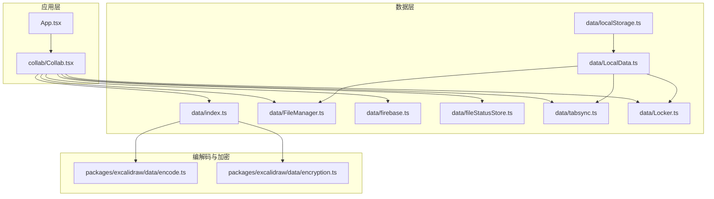
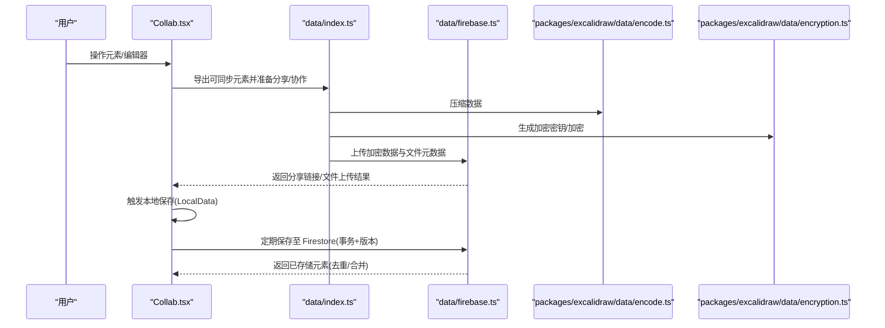
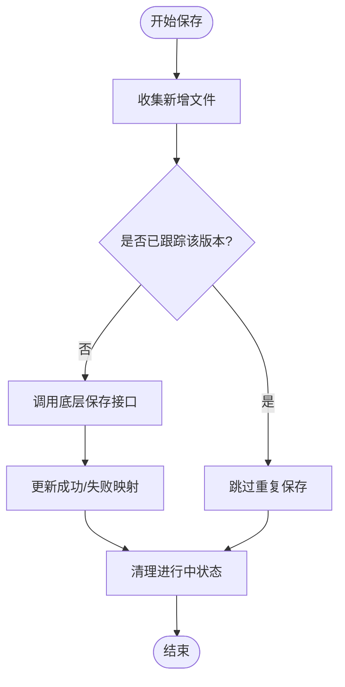
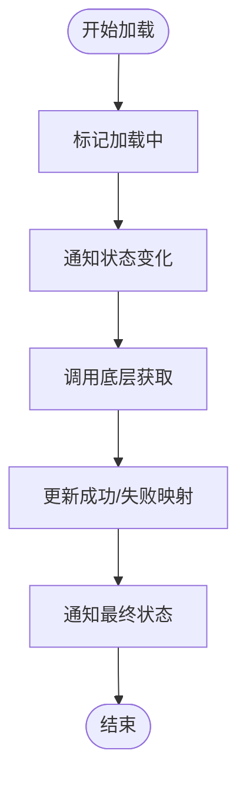
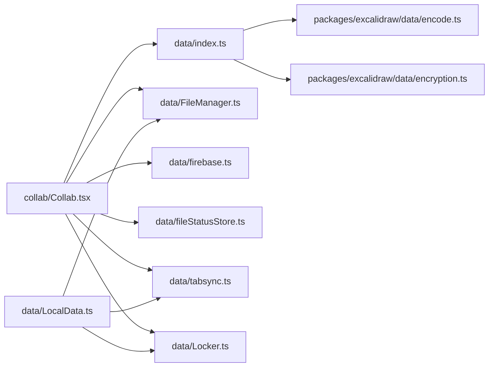

# 数据流管理

<cite>
**本文引用的文件**
- [excalidraw-app/data/index.ts](file://excalidraw-app/data/index.ts)
- [excalidraw-app/data/LocalData.ts](file://excalidraw-app/data/LocalData.ts)
- [excalidraw-app/data/localStorage.ts](file://excalidraw-app/data/localStorage.ts)
- [excalidraw-app/data/FileManager.ts](file://excalidraw-app/data/FileManager.ts)
- [excalidraw-app/data/tabsync.ts](file://excalidraw-app/data/tabSync.ts)
- [excalidraw-app/data/firebase.ts](file://excalidraw-app/data/firebase.ts)
- [excalidraw-app/data/fileStatusStore.ts](file://excalidraw-app/data/fileStatusStore.ts)
- [excalidraw-app/data/Locker.ts](file://excalidraw-app/data/Locker.ts)
- [excalidraw-app/app_constants.ts](file://excalidraw-app/app_constants.ts)
- [packages/excalidraw/data/encode.ts](file://packages/excalidraw/data/encode.ts)
- [packages/excalidraw/data/encryption.ts](file://packages/excalidraw/data/encryption.ts)
- [excalidraw-app/collab/Collab.tsx](file://excalidraw-app/collab/Collab.tsx)
- [excalidraw-app/sentry.ts](file://excalidraw-app/sentry.ts)
</cite>

## 目录

1. [简介](#简介)
2. [项目结构](#项目结构)
3. [核心组件](#核心组件)
4. [架构总览](#架构总览)
5. [详细组件分析](#详细组件分析)
6. [依赖关系分析](#依赖关系分析)
7. [性能考量](#性能考量)
8. [故障排查指南](#故障排查指南)
9. [结论](#结论)
10. [附录](#附录)

## 简介

本文件系统性梳理 Excalidraw 的数据流管理，覆盖从用户输入到状态更新、本地持久化、文件上传与访问、以及协同同步与冲突处理的全链路。重点解析本地存储策略（localStorage 与 IndexedDB 的分工与配合）、文件管理的数据流（压缩/加密/上传/下载）、以及基于 Firebase 的云端同步与版本一致性保障。同时提供优化策略与性能监控建议，帮助开发者理解并改进数据处理效率。

## 项目结构

围绕“数据流”的关键模块分布如下：

- 应用入口与协作：App.tsx、collab/Collab.tsx
- 数据层与工具：data/index.ts、data/LocalData.ts、data/localStorage.ts、data/FileManager.ts、data/firebase.ts、data/fileStatusStore.ts、data/tabsync.ts、data/Locker.ts
- 编解码与加密：packages/excalidraw/data/encode.ts、packages/excalidraw/data/encryption.ts
- 常量与配置：app_constants.ts
- 错误监控：sentry.ts

图表来源

- [excalidraw-app/App.tsx:1-200](file://excalidraw-app/App.tsx#L1-L200)
- [excalidraw-app/collab/Collab.tsx:1-800](file://excalidraw-app/collab/Collab.tsx#L1-L800)
- [excalidraw-app/data/index.ts:1-308](file://excalidraw-app/data/index.ts#L1-L308)
- [excalidraw-app/data/LocalData.ts:1-278](file://excalidraw-app/data/LocalData.ts#L1-L278)
- [excalidraw-app/data/localStorage.ts:1-101](file://excalidraw-app/data/localStorage.ts#L1-L101)
- [excalidraw-app/data/FileManager.ts:1-297](file://excalidraw-app/data/FileManager.ts#L1-L297)
- [excalidraw-app/data/firebase.ts:1-320](file://excalidraw-app/data/firebase.ts#L1-L320)
- [excalidraw-app/data/fileStatusStore.ts:1-49](file://excalidraw-app/data/fileStatusStore.ts#L1-L49)
- [excalidraw-app/data/tabsync.ts:1-40](file://excalidraw-app/data/tabsync.ts#L1-L40)
- [excalidraw-app/data/Locker.ts:1-19](file://excalidraw-app/data/Locker.ts#L1-L19)
- [packages/excalidraw/data/encode.ts:1-415](file://packages/excalidraw/data/encode.ts#L1-L415)
- [packages/excalidraw/data/encryption.ts:1-95](file://packages/excalidraw/data/encryption.ts#L1-L95)

章节来源

- [excalidraw-app/App.tsx:1-200](file://excalidraw-app/App.tsx#L1-L200)
- [excalidraw-app/collab/Collab.tsx:1-800](file://excalidraw-app/collab/Collab.tsx#L1-L800)

## 核心组件

- 数据导出/导入与分享链接：负责生成分享链接、压缩/加密场景数据、上传文件、解密/解压后导入。
- 本地数据保存：封装 localStorage 与 IndexedDB 的写入、去抖、并发控制与错误处理。
- 文件管理器：统一追踪文件加载/保存状态，避免重复请求与竞态，支持批量上传与错误回退。
- 协作同步：通过 WebSocket 接收远端场景，使用 Firebase Firestore/Storage 存储加密场景与图片，版本号与合并策略保证一致性。
- 版本与标签页同步：通过 localStorage 时间戳标记浏览器内版本，跨标签页检测新旧状态。
- 加密与压缩：统一采用 AES-GCM 对称加密与 zlib 压缩，确保传输与存储安全与体积。
- 锁机制：协作期间暂停本地保存，避免冲突。

章节来源

- [excalidraw-app/data/index.ts:248-308](file://excalidraw-app/data/index.ts#L248-L308)
- [excalidraw-app/data/LocalData.ts:117-228](file://excalidraw-app/data/LocalData.ts#L117-L228)
- [excalidraw-app/data/FileManager.ts:22-226](file://excalidraw-app/data/FileManager.ts#L22-L226)
- [excalidraw-app/data/firebase.ts:187-247](file://excalidraw-app/data/firebase.ts#L187-L247)
- [excalidraw-app/data/tabsync.ts:12-25](file://excalidraw-app/data/tabsync.ts#L12-L25)
- [packages/excalidraw/data/encryption.ts:12-30](file://packages/excalidraw/data/encryption.ts#L12-L30)
- [packages/excalidraw/data/encode.ts:322-354](file://packages/excalidraw/data/encode.ts#L322-L354)

## 架构总览

下图展示从用户操作到状态落盘与云端同步的关键路径，以及文件上传/下载的分支流程。

图表来源

- [excalidraw-app/collab/Collab.tsx:708-753](file://excalidraw-app/collab/Collab.tsx#L708-L753)
- [excalidraw-app/data/index.ts:248-308](file://excalidraw-app/data/index.ts#L248-L308)
- [excalidraw-app/data/firebase.ts:187-247](file://excalidraw-app/data/firebase.ts#L187-L247)
- [packages/excalidraw/data/encode.ts:322-354](file://packages/excalidraw/data/encode.ts#L322-L354)
- [packages/excalidraw/data/encryption.ts:50-78](file://packages/excalidraw/data/encryption.ts#L50-L78)

## 详细组件分析

### 数据导出与分享链接（data/index.ts）

- 功能要点
  - 生成分享链接：随机房间 ID 与密钥，拼接哈希参数。
  - 导出到后端：序列化场景与文件，压缩并加密，上传二进制负载；同时将图片按密钥加密并上传 Firebase Storage。
  - 导入后端：拉取加密负载，尝试新格式解密/解压，失败则回退到旧格式。
  - 同步可传播元素：过滤不可见或已删除但超时的元素，减少传输与存储开销。
- 关键流程
  - 导出：压缩 -> 加密 -> 发送到后端 -> 上传文件 -> 生成带密钥的分享链接。
  - 导入：从后端获取 -> 解密/解压 -> 反序列化 -> 还原元素状态。
- 复杂度与性能
  - 压缩/加密为 O(n) 线性处理，受元素数量与文件大小影响。
  - 上传采用批量处理，结合最大文件大小限制，避免单次请求过大。

章节来源

- [excalidraw-app/data/index.ts:68-164](file://excalidraw-app/data/index.ts#L68-L164)
- [excalidraw-app/data/index.ts:202-242](file://excalidraw-app/data/index.ts#L202-L242)
- [excalidraw-app/data/index.ts:248-308](file://excalidraw-app/data/index.ts#L248-L308)

### 本地数据保存（data/LocalData.ts）

- 设计原则
  - 分层存储：元素与应用状态写入 localStorage；二进制文件写入 IndexedDB（idb-keyval）。
  - 去抖与节流：保存操作去抖，降低频繁写入对主线程与磁盘的压力。
  - 并发控制：协作期间暂停本地保存，避免与云端保存冲突。
  - 清理策略：定期清理未使用的文件，基于 lastRetrieved 与当前画布文件集合。
- 关键流程
  - 保存：先写 localStorage，再异步写 IndexedDB 文件；更新版本戳以触发跨标签页同步。
  - 读取：优先从 IndexedDB 读取文件，命中则刷新 lastRetrieved 并回写。
  - 错误处理：捕获配额超限等异常，必要时切换 UI 提示。
- 与协作的关系
  - 通过 Locker 在协作期间暂停保存，退出协作后恢复。

章节来源

- [excalidraw-app/data/LocalData.ts:73-109](file://excalidraw-app/data/LocalData.ts#L73-L109)
- [excalidraw-app/data/LocalData.ts:117-165](file://excalidraw-app/data/LocalData.ts#L117-L165)
- [excalidraw-app/data/LocalData.ts:169-227](file://excalidraw-app/data/LocalData.ts#L169-L227)

### 文件管理器（data/FileManager.ts）

- 职责
  - 统一追踪文件状态：加载中/已加载/错误/保存中/已保存/保存错误。
  - 避免重复：同一版本文件不重复保存/加载。
  - 批量上传：对新增文件进行压缩与加密，按最大字节限制分组上传。
  - 状态回推：通过回调通知 UI 更新文件状态。
- 流程图（保存文件）

图表来源

- [excalidraw-app/data/FileManager.ts:92-137](file://excalidraw-app/data/FileManager.ts#L92-L137)

- 流程图（加载文件）

图表来源

- [excalidraw-app/data/FileManager.ts:139-180](file://excalidraw-app/data/FileManager.ts#L139-L180)

章节来源

- [excalidraw-app/data/FileManager.ts:22-226](file://excalidraw-app/data/FileManager.ts#L22-L226)

### 协作同步与冲突处理（collab/Collab.tsx + data/firebase.ts）

- 场景保存
  - 使用 Firestore 事务读取/写入，计算场景版本，对齐双方差异后写回。
  - 保存前检查是否已保存（版本一致），避免冗余写入。
- 图片同步
  - 通过 Firebase Storage 上传/下载图片，按房间前缀隔离，设置缓存时间。
  - 下载后解密/解压，还原为 DataURL 写入编辑器。
- 版本与合并
  - 使用 getSceneVersion 作为版本号，reconcileElements 合并差异，bumpElementVersions 提升版本。
- 用户体验
  - 加载图片采用节流，避免频繁网络请求。
  - 保存前检查文件保存状态与云端保存状态，必要时阻止卸载。

章节来源

- [excalidraw-app/collab/Collab.tsx:708-753](file://excalidraw-app/collab/Collab.tsx#L708-L753)
- [excalidraw-app/collab/Collab.tsx:789-800](file://excalidraw-app/collab/Collab.tsx#L789-L800)
- [excalidraw-app/data/firebase.ts:187-247](file://excalidraw-app/data/firebase.ts#L187-L247)
- [excalidraw-app/data/firebase.ts:274-319](file://excalidraw-app/data/firebase.ts#L274-L319)

### 编解码与加密（packages/excalidraw/data/encode.ts + encryption.ts）

- 压缩与加密
  - compressData：将元数据与内容拼接后压缩，再 AES-GCM 加密，返回包含编码元信息、IV 与密文的缓冲区。
  - decompressData：解密后解压，分离元数据与内容，供上层使用。
- 对称加密
  - generateEncryptionKey：生成随机密钥（JWK 字符串或 CryptoKey）。
  - encryptData/decryptData：AES-GCM 加密/解密，自动处理 IV。
- 性能与兼容
  - 使用 pako 进行 zlib 压缩，兼容浏览器端 ArrayBuffer/Uint8Array/Blob/字符串输入。

章节来源

- [packages/excalidraw/data/encode.ts:322-412](file://packages/excalidraw/data/encode.ts#L322-L412)
- [packages/excalidraw/data/encryption.ts:50-94](file://packages/excalidraw/data/encryption.ts#L50-L94)

### 本地存储策略与跨标签页同步（data/LocalData.ts + data/tabsync.ts + data/localStorage.ts）

- 存储分工
  - localStorage：存放非二进制的元素与应用状态，容量小但读写快。
  - IndexedDB：存放二进制文件，容量大，适合图片等大对象。
- 版本与同步
  - 通过 localStorage 中的时间戳记录版本，跨标签页比较新旧，触发重新加载。
  - 本地保存时更新版本戳，触发其他标签页的版本检查。
- 用户名与主题等轻量数据
  - 通过 localStorage 管理协作用户名、主题偏好等。

章节来源

- [excalidraw-app/data/LocalData.ts:73-109](file://excalidraw-app/data/LocalData.ts#L73-L109)
- [excalidraw-app/data/tabsync.ts:12-25](file://excalidraw-app/data/tabsync.ts#L12-L25)
- [excalidraw-app/data/localStorage.ts:37-74](file://excalidraw-app/data/localStorage.ts#L37-L74)

### 文件状态管理（data/fileStatusStore.ts）

- 作用
  - 维护文件加载状态快照，支持按版本拉取增量更新，减少 UI 重绘。
  - 提供统计：计算待处理文件数与总数，辅助 UI 展示。
- 使用
  - FileManager 在加载/保存过程中调用 updateStatuses，FileStatusStore 将状态变更写入内部快照。

章节来源

- [excalidraw-app/data/fileStatusStore.ts:20-35](file://excalidraw-app/data/fileStatusStore.ts#L20-L35)

### 锁机制（data/Locker.ts）

- 用途
  - 协作期间暂停本地保存，避免与云端保存产生竞态。
  - 支持多类型锁，协作锁释放后恢复本地保存。
- 行为
  - lock/unlock/isLocked 提供细粒度控制。

章节来源

- [excalidraw-app/data/Locker.ts:1-19](file://excalidraw-app/data/Locker.ts#L1-L19)

## 依赖关系分析

- 组件耦合
  - Collab 依赖 data/index.ts（分享/导入）、data/firebase.ts（云端保存/加载）、data/FileManager.ts（文件上传/下载）、data/fileStatusStore.ts（状态通知）、data/tabsync.ts（跨标签页检测）、data/Locker.ts（保存暂停）。
  - LocalData 依赖 FileManager、tabSync、Locker，并通过 localStorage 与 IndexedDB 实现持久化。
  - data/index.ts 依赖 packages/excalidraw/data/encode.ts 与 encryption.ts 进行压缩与加密。
- 外部依赖
  - Firebase SDK（Firestore/Storage）、idb-keyval（IndexedDB 访问）、pako（zlib 压缩）。

图表来源

- [excalidraw-app/collab/Collab.tsx:1-800](file://excalidraw-app/collab/Collab.tsx#L1-L800)
- [excalidraw-app/data/index.ts:1-308](file://excalidraw-app/data/index.ts#L1-L308)
- [excalidraw-app/data/LocalData.ts:1-278](file://excalidraw-app/data/LocalData.ts#L1-L278)
- [packages/excalidraw/data/encode.ts:1-415](file://packages/excalidraw/data/encode.ts#L1-L415)
- [packages/excalidraw/data/encryption.ts:1-95](file://packages/excalidraw/data/encryption.ts#L1-L95)

## 性能考量

- 去抖与节流
  - 本地保存去抖（常量定义于 app_constants.ts），减少频繁写入。
  - 图片加载采用节流，避免高频网络请求。
- 压缩与加密
  - 压缩率与 CPU 开销成正比，建议对大文件优先启用压缩。
  - AES-GCM 为现代浏览器内置算法，性能稳定。
- 存储策略
  - localStorage 仅存小数据，大文件走 IndexedDB，避免阻塞 UI。
  - 文件清理策略基于 lastRetrieved 与当前画布使用情况，降低磁盘占用。
- 云端同步
  - Firestore 事务写入，版本号校验避免重复写入。
  - 图片上传设置缓存时间，提升后续访问速度。

章节来源

- [excalidraw-app/app_constants.ts:1-62](file://excalidraw-app/app_constants.ts#L1-L62)
- [excalidraw-app/data/LocalData.ts:117-134](file://excalidraw-app/data/LocalData.ts#L117-L134)
- [excalidraw-app/collab/Collab.tsx:789-800](file://excalidraw-app/collab/Collab.tsx#L789-L800)
- [excalidraw-app/data/firebase.ts:145-172](file://excalidraw-app/data/firebase.ts#L145-L172)

## 故障排查指南

- 本地存储配额超限
  - 现象：localStorage 写入抛出 QuotaExceededError。
  - 处理：捕获异常并提示用户，必要时清理无用数据或引导降级使用。
- 云端保存失败
  - 现象：保存到 Firestore 报错或超过大小限制。
  - 处理：根据错误消息提示用户，必要时拆分场景或清理大文件。
- 文件下载失败
  - 现象：从 Firebase Storage 下载返回非 2xx。
  - 处理：记录错误文件 ID，UI 显示错误状态并允许重试。
- 卸载阻止
  - 现象：存在未完成的保存或云端未同步，浏览器弹出确认。
  - 处理：在 beforeunload 中触发一次保存，若仍阻止则提示用户等待或放弃。

章节来源

- [excalidraw-app/data/LocalData.ts:111-113](file://excalidraw-app/data/LocalData.ts#L111-L113)
- [excalidraw-app/data/firebase.ts:145-172](file://excalidraw-app/data/firebase.ts#L145-L172)
- [excalidraw-app/collab/Collab.tsx:291-313](file://excalidraw-app/collab/Collab.tsx#L291-L313)

## 结论

Excalidraw 的数据流管理通过清晰的职责划分与严格的流程控制，实现了从本地到云端的可靠数据流转。localStorage 与 IndexedDB 的合理分工、文件状态的统一追踪、以及基于版本号的冲突合并，共同保障了用户体验与数据一致性。建议在实际开发中关注去抖与节流策略、压缩与加密的平衡、以及错误监控与用户提示的完善。

## 附录

- 常量与配置
  - 保存去抖间隔、图片加载与上传超时、同步周期、文件大小限制、版本键等均在 app_constants.ts 中集中管理。
- 错误监控
  - Sentry 初始化与忽略规则在 sentry.ts 中配置，有助于定位性能与稳定性问题。

章节来源

- [excalidraw-app/app_constants.ts:1-62](file://excalidraw-app/app_constants.ts#L1-L62)
- [excalidraw-app/sentry.ts:1-95](file://excalidraw-app/sentry.ts#L1-L95)
