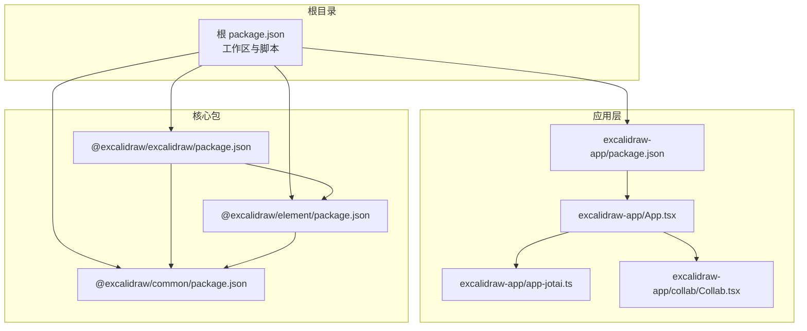
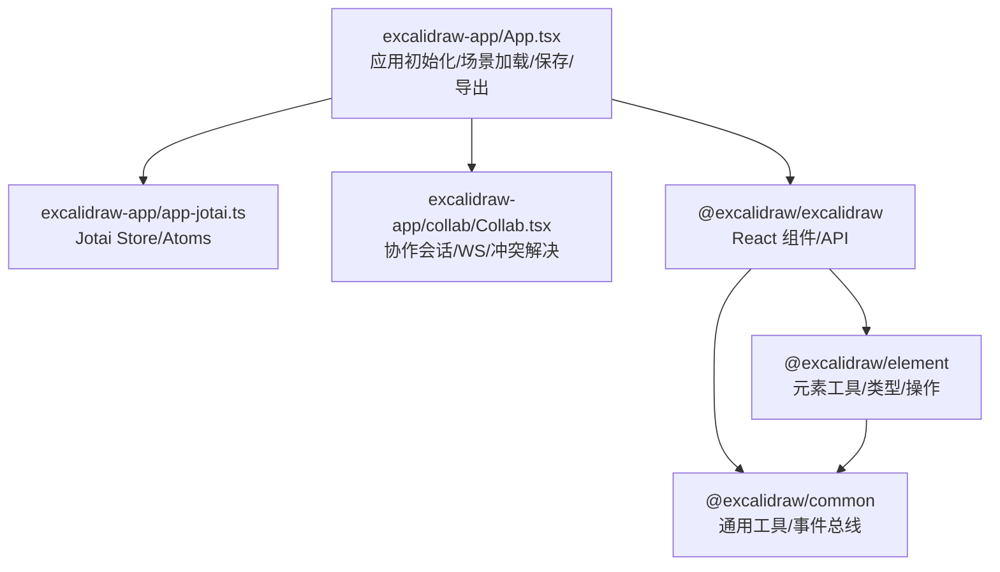
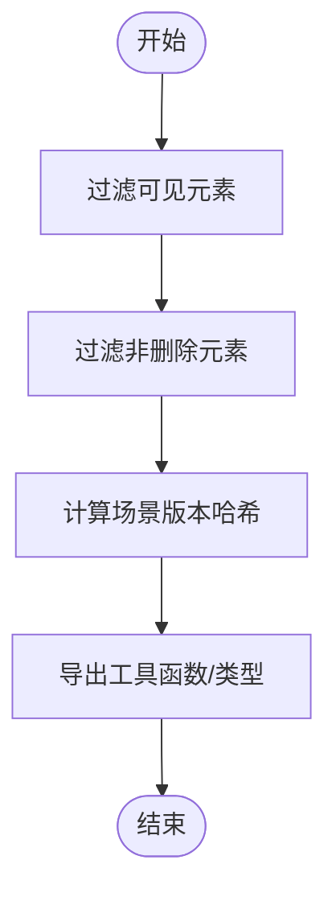
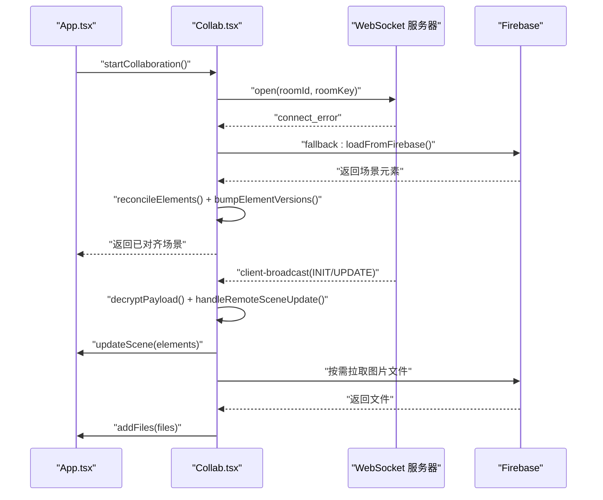
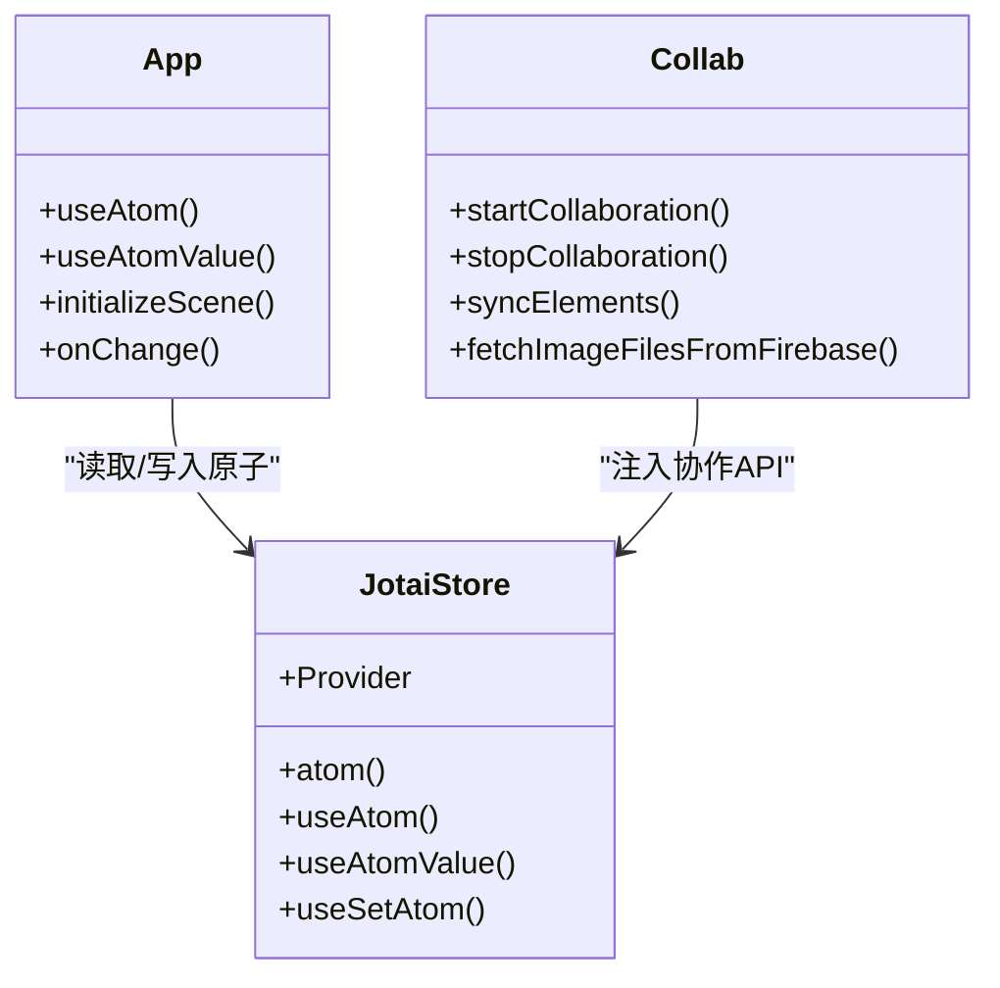
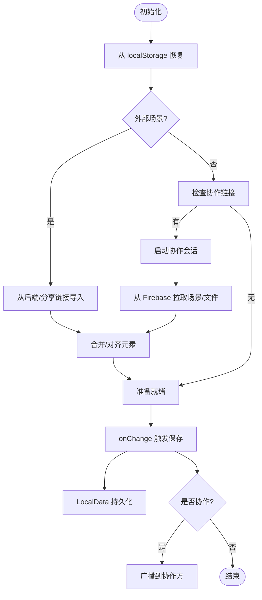
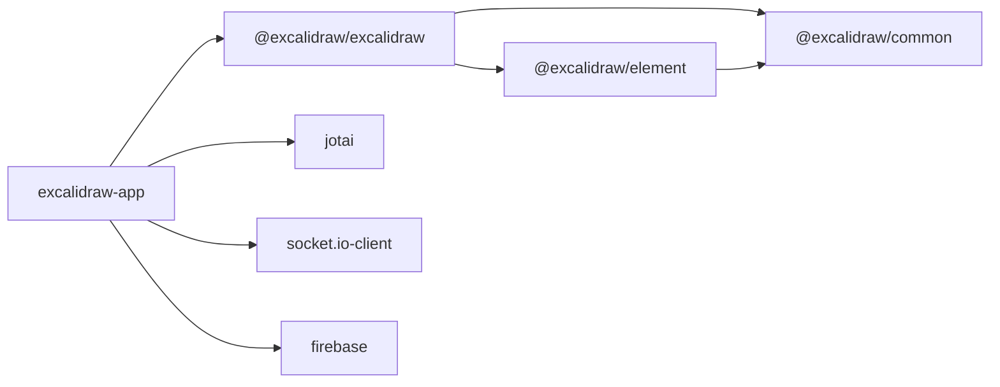

# 核心概念

<cite>
**本文引用的文件**
- [package.json](file://package.json)
- [packages/excalidraw/package.json](file://packages/excalidraw/package.json)
- [packages/element/package.json](file://packages/element/package.json)
- [packages/common/package.json](file://packages/common/package.json)
- [excalidraw-app/package.json](file://excalidraw-app/package.json)
- [packages/element/src/index.ts](file://packages/element/src/index.ts)
- [packages/common/src/index.ts](file://packages/common/src/index.ts)
- [excalidraw-app/App.tsx](file://excalidraw-app/App.tsx)
- [excalidraw-app/app-jotai.ts](file://excalidraw-app/app-jotai.ts)
- [excalidraw-app/collab/Collab.tsx](file://excalidraw-app/collab/Collab.tsx)
</cite>

## 目录

1. [简介](#简介)
2. [项目结构](#项目结构)
3. [核心组件](#核心组件)
4. [架构总览](#架构总览)
5. [详细组件分析](#详细组件分析)
6. [依赖关系分析](#依赖关系分析)
7. [性能考量](#性能考量)
8. [故障排查指南](#故障排查指南)
9. [结论](#结论)
10. [附录](#附录)

## 简介

本文件面向希望深入理解 Excalidraw 核心概念与架构的开发者，围绕以下主题展开：Monorepo 设计与包组织、React 组件系统与状态管理（Jotai）、元素系统与类型体系、实时协作（WebSocket、冲突解决、状态同步）、数据流与本地/云端存储策略。文档以循序渐进的方式呈现，既适合初学者快速建立整体认知，也便于资深开发者进行深度扩展与定制。

## 项目结构

Excalidraw 采用 Yarn Workspaces + 多包 Monorepo 结构，核心包位于 packages 目录，应用层位于 excalidraw-app，示例位于 examples。根目录的 package.json 定义了工作区范围与构建脚本；各子包通过独立的 package.json 管理导出与依赖。

- 工作区范围与脚本
  - workspaces 指向 excalidraw-app、packages/_、examples/_
  - 提供统一的构建脚本，如 build:packages、build:excalidraw、build:element 等
- 包导出与入口
  - 各包通过 exports 字段声明开发/生产环境入口与类型导出，确保工具链与 IDE 能正确解析
- 应用层与示例
  - excalidraw-app 作为主应用，集成协作、本地存储、云端同步等能力
  - examples 提供不同集成方式的示例（Next.js、浏览器直连）

图表来源

- [package.json:1-96](file://package.json#L1-L96)
- [excalidraw-app/package.json:1-58](file://excalidraw-app/package.json#L1-L58)
- [packages/excalidraw/package.json:1-141](file://packages/excalidraw/package.json#L1-L141)
- [packages/element/package.json:1-71](file://packages/element/package.json#L1-L71)
- [packages/common/package.json:1-66](file://packages/common/package.json#L1-L66)

章节来源

- [package.json:1-96](file://package.json#L1-L96)
- [excalidraw-app/package.json:1-58](file://excalidraw-app/package.json#L1-L58)
- [packages/excalidraw/package.json:1-141](file://packages/excalidraw/package.json#L1-L141)
- [packages/element/package.json:1-71](file://packages/element/package.json#L1-L71)
- [packages/common/package.json:1-66](file://packages/common/package.json#L1-L66)

## 核心组件

本节聚焦三个核心包的职责与边界：

- @excalidraw/common
  - 职责：通用常量、工具函数、事件总线、颜色处理、版本快照存储等基础能力
  - 导出：二进制堆、边界计算、颜色、键值、点集、队列、URL、通用工具、事件总线、编辑器接口、版本化快照存储等
- @excalidraw/element
  - 职责：元素相关逻辑与工具，包含对元素集合的筛选、排序、比较、碰撞检测、绑定、渲染、变换、文本处理、帧/分组/索引等
  - 导出：对 element 子模块的聚合导出，如 align、binding、bounds、collision、comparisons、containerCache、cropElement、delta、distance、distribute、dragElements、duplicate、elbowArrow、elementLink、embeddable、flowchart、fractionalIndex、frame、groups、heading、image、linearElementEditor、mutateElement、newElement、positionElementsOnGrid、renderElement、resizeElements、resizeTest、Scene、selection、shape、showSelectedShapeActions、sizeHelpers、sortElements、store、textElement、textMeasurements、textWrapping、transform、transformHandles、typeChecks、utils、zindex、arrows/helpers、arrowheads 等
- @excalidraw/excalidraw
  - 职责：作为 React 组件库，封装画布、UI、API、状态管理、数据恢复、导入导出、国际化、分析埋点等
  - 依赖：@excalidraw/common、@excalidraw/element、@excalidraw/math、@excalidraw/fractional-indexing 等，并使用 jotai 作为状态管理

章节来源

- [packages/common/src/index.ts:1-18](file://packages/common/src/index.ts#L1-L18)
- [packages/element/src/index.ts:1-103](file://packages/element/src/index.ts#L1-L103)
- [packages/excalidraw/package.json:80-117](file://packages/excalidraw/package.json#L80-L117)

## 架构总览

下图展示了应用层如何组合核心包与协作模块，以及状态管理与数据流的关键节点。

图表来源

- [excalidraw-app/App.tsx:1-1288](file://excalidraw-app/App.tsx#L1-L1288)
- [excalidraw-app/app-jotai.ts:1-38](file://excalidraw-app/app-jotai.ts#L1-L38)
- [excalidraw-app/collab/Collab.tsx:1-1052](file://excalidraw-app/collab/Collab.tsx#L1-L1052)
- [packages/excalidraw/package.json:80-117](file://packages/excalidraw/package.json#L80-L117)
- [packages/element/package.json:65-69](file://packages/element/package.json#L65-L69)
- [packages/common/package.json:59-61](file://packages/common/package.json#L59-L61)

## 详细组件分析

### 元素系统与类型体系

- 元素集合工具
  - 提供对元素集合的可见性过滤、非删除过滤、版本哈希、字符串哈希等工具函数
  - 用于场景版本计算与一致性校验
- 元素操作与算法
  - 导出大量子模块，覆盖对齐、绑定、边界、碰撞、比较、容器缓存、裁剪、增量更新、距离、分布、拖拽、复制、肘形箭头、元素链接、可嵌入、流程图、分数索引、帧、分组、标题、图像、线性编辑器、变更、新建、网格对齐、渲染、缩放、测试、场景、选择、形状、显示选中形状操作、尺寸辅助、排序、存储、文本、测量、换行、变换、变换手柄、类型检查、工具、Z-index、箭头辅助、箭头头等
- 设计要点
  - 将元素相关的复杂逻辑拆分为细粒度模块，提升内聚性与可维护性
  - 通过工具函数与类型约束保证元素状态的一致性与可追踪性

图表来源

- [packages/element/src/index.ts:15-51](file://packages/element/src/index.ts#L15-L51)

章节来源

- [packages/element/src/index.ts:1-103](file://packages/element/src/index.ts#L1-L103)

### 实时协作系统（WebSocket、冲突解决、状态同步）

- 协作生命周期
  - 初始化：生成房间 ID/Key，打开 Socket 连接，监听连接错误回退到从 Firebase 加载场景
  - 场景同步：接收远端广播，解密后根据类型处理（INIT/UPDATE/MOUSE_LOCATION/USER_VISIBLE_SCENE_BOUNDS/IDLE_STATUS），执行元素对齐与版本更新
  - 文件同步：按需从 Firebase 拉取图片文件，更新状态并注入到画布
  - 停止协作：保存当前可同步元素到 Firebase，清理 Socket、重置协作状态
- 冲突解决
  - 使用 reconcileElements 对远端与本地元素进行合并，随后 bumpElementVersions 提升版本，避免重复广播
  - 通过 getSceneVersion 记录最近广播/接收的场景版本，防止回环广播
- 状态同步
  - 用户指针位置、鼠标按键、选中元素、用户空闲状态、远端视口边界等通过 Socket 广播，协作方实时更新

图表来源

- [excalidraw-app/App.tsx:328-372](file://excalidraw-app/App.tsx#L328-L372)
- [excalidraw-app/collab/Collab.tsx:508-706](file://excalidraw-app/collab/Collab.tsx#L508-L706)
- [excalidraw-app/collab/Collab.tsx:755-787](file://excalidraw-app/collab/Collab.tsx#L755-L787)

章节来源

- [excalidraw-app/collab/Collab.tsx:1-1052](file://excalidraw-app/collab/Collab.tsx#L1-L1052)
- [excalidraw-app/App.tsx:328-372](file://excalidraw-app/App.tsx#L328-L372)

### React 组件系统与状态管理（Jotai）

- 状态模型
  - 使用 Jotai 原子（atom）与 Provider 管理应用级状态，如协作 API、是否协作中、离线状态、分享对话框状态等
  - 自定义 hook useAtomWithInitialValue 在挂载时设置初始值，确保状态在渲染前就绪
- 组件交互
  - App.tsx 通过 useAtom/useAtomValue 获取协作与错误状态，控制 UI 行为
  - Collab.tsx 将协作 API 注入全局 Store，供 App.tsx 读取并调用协作能力
- 数据流
  - 本地状态（Jotai）与外部状态（Socket/Firebase）双向同步，onChange 回调中根据是否协作决定同步路径

图表来源

- [excalidraw-app/app-jotai.ts:1-38](file://excalidraw-app/app-jotai.ts#L1-L38)
- [excalidraw-app/App.tsx:83-151](file://excalidraw-app/App.tsx#L83-L151)
- [excalidraw-app/collab/Collab.tsx:98-127](file://excalidraw-app/collab/Collab.tsx#L98-L127)

章节来源

- [excalidraw-app/app-jotai.ts:1-38](file://excalidraw-app/app-jotai.ts#L1-L38)
- [excalidraw-app/App.tsx:83-151](file://excalidraw-app/App.tsx#L83-L151)
- [excalidraw-app/collab/Collab.tsx:98-127](file://excalidraw-app/collab/Collab.tsx#L98-L127)

### 数据流管理、本地存储与云端同步

- 场景初始化与恢复
  - 从 localStorage 恢复元素与应用状态，支持从后端或分享链接导入，必要时提示覆盖
  - 协作场景下，先启动协作，再对齐远端元素并恢复本地主题等偏好
- 本地存储策略
  - LocalData 负责元素与文件的持久化，支持保存暂停/恢复、清理过期文件、跨标签页版本同步
  - 图片文件按需从 IndexedDB 或 Firebase 加载，避免阻塞主流程
- 云端同步
  - Firebase 用于存储共享场景与文件，协作时优先从 Firebase 拉取最新场景
  - 退出协作时，将当前可同步元素保存至 Firebase，并清理 Socket 与协作状态

图表来源

- [excalidraw-app/App.tsx:216-372](file://excalidraw-app/App.tsx#L216-L372)
- [excalidraw-app/App.tsx:441-521](file://excalidraw-app/App.tsx#L441-L521)
- [excalidraw-app/collab/Collab.tsx:315-355](file://excalidraw-app/collab/Collab.tsx#L315-L355)

章节来源

- [excalidraw-app/App.tsx:216-372](file://excalidraw-app/App.tsx#L216-L372)
- [excalidraw-app/App.tsx:441-521](file://excalidraw-app/App.tsx#L441-L521)
- [excalidraw-app/collab/Collab.tsx:315-355](file://excalidraw-app/collab/Collab.tsx#L315-L355)

## 依赖关系分析

- 包依赖
  - @excalidraw/excalidraw 依赖 @excalidraw/common、@excalidraw/element、@excalidraw/math、@excalidraw/fractional-indexing 等
  - @excalidraw/element 依赖 @excalidraw/common、@excalidraw/math、@excalidraw/fractional-indexing
  - @excalidraw/common 依赖 tinycolor2
- 应用层依赖
  - excalidraw-app 依赖 @excalidraw/excalidraw、jotai、socket.io-client、firebase 等

图表来源

- [packages/excalidraw/package.json:80-117](file://packages/excalidraw/package.json#L80-L117)
- [packages/element/package.json:65-69](file://packages/element/package.json#L65-L69)
- [packages/common/package.json:59-61](file://packages/common/package.json#L59-L61)
- [excalidraw-app/package.json:28-41](file://excalidraw-app/package.json#L28-L41)

章节来源

- [packages/excalidraw/package.json:80-117](file://packages/excalidraw/package.json#L80-L117)
- [packages/element/package.json:65-69](file://packages/element/package.json#L65-L69)
- [packages/common/package.json:59-61](file://packages/common/package.json#L59-L61)
- [excalidraw-app/package.json:28-41](file://excalidraw-app/package.json#L28-L41)

## 性能考量

- 渲染节流与批量更新
  - 使用 throttleRAF 与批量更新减少高频事件（滚动、指针移动）对渲染的影响
- 图像懒加载与状态更新
  - 仅在需要时从 Firebase 拉取图片，避免阻塞主流程；对失败/过期图片进行重试与状态更新
- 版本与广播去重
  - 通过 getSceneVersion 与 bumpElementVersions 避免重复广播与回环
- 本地存储与跨标签页同步
  - 使用版本号判断本地/浏览器状态的新旧，仅在必要时同步，降低写入频率

章节来源

- [excalidraw-app/collab/Collab.tsx:217-222](file://excalidraw-app/collab/Collab.tsx#L217-L222)
- [excalidraw-app/App.tsx:441-521](file://excalidraw-app/App.tsx#L441-L521)
- [excalidraw-app/collab/Collab.tsx:755-787](file://excalidraw-app/collab/Collab.tsx#L755-L787)

## 故障排查指南

- 协作初始化失败
  - 若 WebSocket 连接报错，自动回退到从 Firebase 加载场景；检查 VITE_APP_WS_SERVER_URL 配置与网络连通性
- 解密失败
  - 收到无效响应或解密异常时，弹窗提示并记录错误；确认房间 Key 正确且加密参数一致
- 保存失败
  - Firebase 保存失败可能因大小超限或网络问题；根据错误提示调整内容或重试
- 离线/在线切换
  - 监听 online/offline 事件更新 isOfflineAtom，协作期间保持离线状态下的本地行为

章节来源

- [excalidraw-app/collab/Collab.tsx:512-536](file://excalidraw-app/collab/Collab.tsx#L512-L536)
- [excalidraw-app/collab/Collab.tsx:448-467](file://excalidraw-app/collab/Collab.tsx#L448-L467)
- [excalidraw-app/collab/Collab.tsx:331-355](file://excalidraw-app/collab/Collab.tsx#L331-L355)
- [excalidraw-app/collab/Collab.tsx:256-258](file://excalidraw-app/collab/Collab.tsx#L256-L258)

## 结论

Excalidraw 的核心在于清晰的 Monorepo 分层与职责划分：@excalidraw/common 提供通用能力，@excalidraw/element 聚焦元素逻辑，@excalidraw/excalidraw 承担 UI 与 API，excalidraw-app 负责应用编排与协作。Jotai 作为轻量状态管理器贯穿应用层，配合 WebSocket 与 Firebase 实现高效、可靠的实时协作与数据同步。该架构既保证了可维护性，也为二次开发与扩展提供了稳定基座。

## 附录

- 关键实现路径参考
  - 元素工具与类型导出：[packages/element/src/index.ts:1-103](file://packages/element/src/index.ts#L1-L103)
  - 通用工具导出：[packages/common/src/index.ts:1-18](file://packages/common/src/index.ts#L1-L18)
  - 应用初始化与场景加载：[excalidraw-app/App.tsx:216-372](file://excalidraw-app/App.tsx#L216-L372)
  - 协作生命周期与冲突解决：[excalidraw-app/collab/Collab.tsx:471-706](file://excalidraw-app/collab/Collab.tsx#L471-L706)
  - Jotai Store 与自定义 Hook：[excalidraw-app/app-jotai.ts:1-38](file://excalidraw-app/app-jotai.ts#L1-L38)
