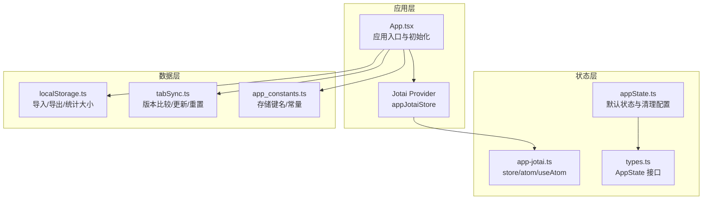
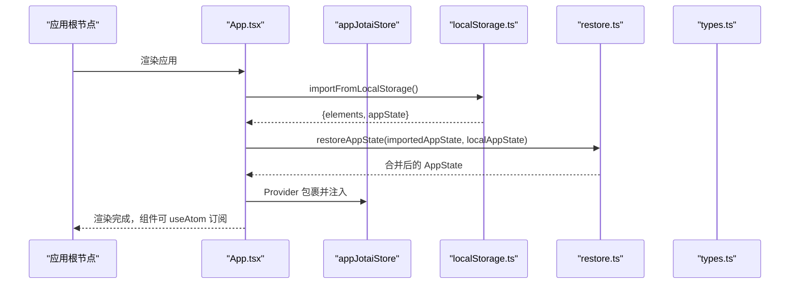
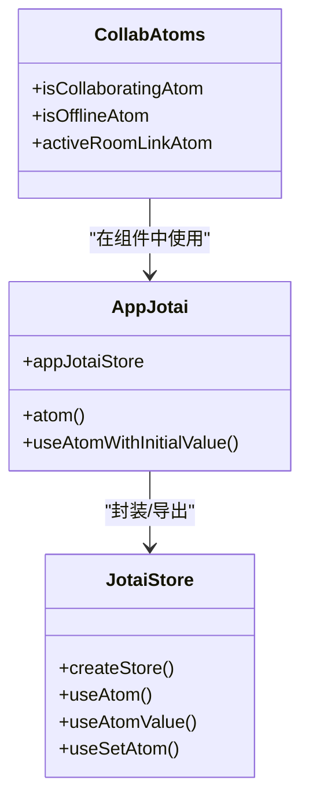
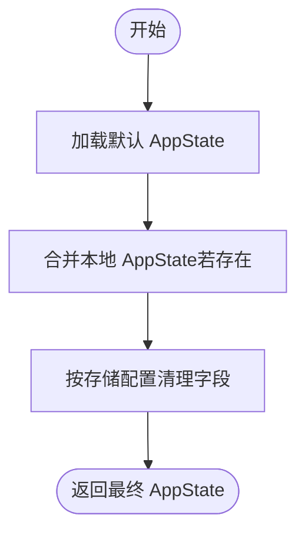
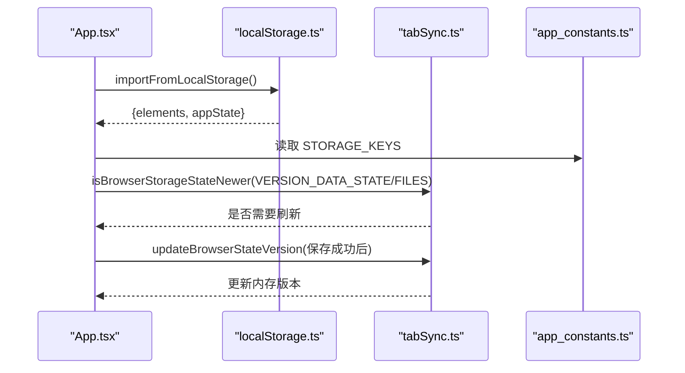
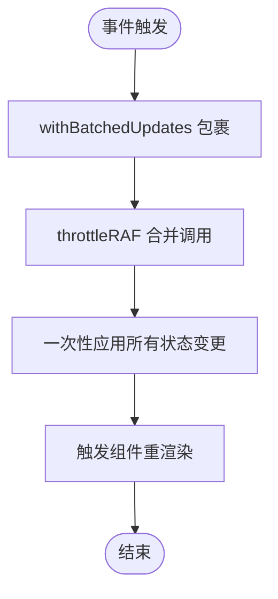
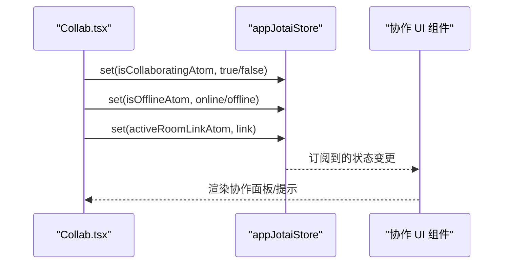
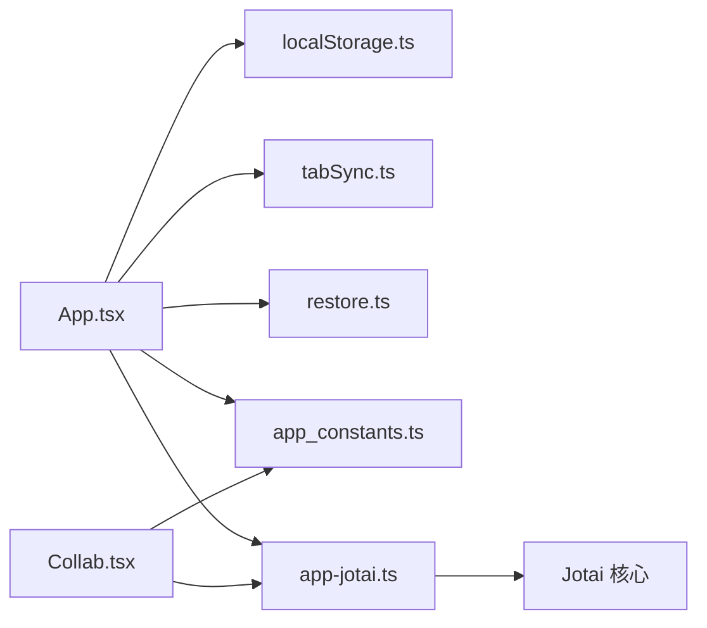

# 状态管理机制

<cite>
**本文引用的文件**
- [app-jotai.ts](file://excalidraw-app/app-jotai.ts)
- [App.tsx](file://excalidraw-app/App.tsx)
- [appState.ts](file://packages/excalidraw/appState.ts)
- [types.ts](file://packages/excalidraw/types.ts)
- [localStorage.ts](file://excalidraw-app/data/localStorage.ts)
- [tabSync.ts](file://excalidraw-app/data/tabSync.ts)
- [app_constants.ts](file://excalidraw-app/app_constants.ts)
- [Collab.tsx](file://excalidraw-app/collab/Collab.tsx)
- [reactUtils.ts](file://packages/excalidraw/reactUtils.ts)
- [restore.ts](file://packages/excalidraw/data/restore.ts)
</cite>

## 目录

1. [简介](#简介)
2. [项目结构](#项目结构)
3. [核心组件](#核心组件)
4. [架构总览](#架构总览)
5. [详细组件分析](#详细组件分析)
6. [依赖关系分析](#依赖关系分析)
7. [性能考量](#性能考量)
8. [故障排查指南](#故障排查指南)
9. [结论](#结论)

## 简介

本文件系统性梳理 Excalidraw 在前端应用中的状态管理机制，重点围绕 Jotai 状态库的使用与设计思想展开，涵盖原子（atom）概念、订阅与更新机制；应用状态组织结构（AppState 接口、字段语义与转换逻辑）；本地状态管理策略（localStorage 同步、跨 Tab 共享与持久化）；状态更新触发时机、批量更新与性能优化；以及调试技巧与常见问题解决方案。

## 项目结构

Excalidraw 将状态管理集中在应用入口与数据层：

- 应用入口通过 Provider 提供全局状态上下文，并在初始化阶段从本地存储恢复场景与状态。
- 数据层负责与浏览器存储交互、跨标签页同步版本、协作状态等。
- 类型层定义了完整的 AppState 结构，用于约束状态字段与默认值。

**图表来源**

- [App.tsx:216-247](file://excalidraw-app/App.tsx#L216-L247)
- [app-jotai.ts:1-38](file://excalidraw-app/app-jotai.ts#L1-L38)
- [appState.ts:22-137](file://packages/excalidraw/appState.ts#L22-L137)
- [types.ts:281-479](file://packages/excalidraw/types.ts#L281-L479)
- [localStorage.ts:37-74](file://excalidraw-app/data/localStorage.ts#L37-L74)
- [tabSync.ts:1-39](file://excalidraw-app/data/tabSync.ts#L1-L39)
- [app_constants.ts:39-53](file://excalidraw-app/app_constants.ts#L39-L53)

**章节来源**

- [App.tsx:216-247](file://excalidraw-app/App.tsx#L216-L247)
- [app-jotai.ts:1-38](file://excalidraw-app/app-jotai.ts#L1-L38)
- [appState.ts:22-137](file://packages/excalidraw/appState.ts#L22-L137)
- [types.ts:281-479](file://packages/excalidraw/types.ts#L281-L479)
- [localStorage.ts:37-74](file://excalidraw-app/data/localStorage.ts#L37-L74)
- [tabSync.ts:1-39](file://excalidraw-app/data/tabSync.ts#L1-L39)
- [app_constants.ts:39-53](file://excalidraw-app/app_constants.ts#L39-L53)

## 核心组件

- Jotai Store 与 Atom 工具
  - 创建全局 store 并导出 atom/useAtom/useAtomValue/useSetAtom，统一状态读写入口。
  - 提供 useAtomWithInitialValue，在挂载时仅设置一次初始值，避免重复写入。
- AppState 默认值与清理
  - getDefaultAppState 定义完整默认状态树。
  - clearAppStateForLocalStorage/cleanAppStateForExport/clearAppStateForDatabase 控制不同存储介质的字段保留策略。
- 本地存储与跨标签页同步
  - localStorage.ts 负责从 localStorage 导入元素与状态，计算存储体积。
  - tabSync.ts 维护内存中的版本时间戳，与 localStorage 版本键进行比较，决定是否需要刷新。
- 初始化与恢复流程
  - App.tsx 在启动时调用 importFromLocalStorage 恢复本地数据，结合 restoreAppState 合并默认值与本地值。
  - 使用 isBrowserStorageStateNewer 周期性检测外部变化，按需加载文件与图片。

**章节来源**

- [app-jotai.ts:1-38](file://excalidraw-app/app-jotai.ts#L1-L38)
- [appState.ts:22-137](file://packages/excalidraw/appState.ts#L22-L137)
- [appState.ts:293-303](file://packages/excalidraw/appState.ts#L293-L303)
- [localStorage.ts:37-74](file://excalidraw-app/data/localStorage.ts#L37-L74)
- [tabSync.ts:1-39](file://excalidraw-app/data/tabSync.ts#L1-L39)
- [App.tsx:216-247](file://excalidraw-app/App.tsx#L216-L247)

## 架构总览

下图展示应用启动到状态可用的关键路径：入口组件初始化、从本地恢复、构建默认状态、合并与清理、Provider 注入、组件订阅与渲染。

**图表来源**

- [App.tsx:216-247](file://excalidraw-app/App.tsx#L216-L247)
- [localStorage.ts:37-74](file://excalidraw-app/data/localStorage.ts#L37-L74)
- [restore.ts:1013-1057](file://packages/excalidraw/data/restore.ts#L1013-L1057)
- [types.ts:281-479](file://packages/excalidraw/types.ts#L281-L479)

## 详细组件分析

### Jotai 状态库使用与设计理念

- 设计理念
  - 以原子为最小状态单元，支持细粒度订阅与组合，便于按需渲染与性能优化。
  - 通过 Provider 注入全局 store，组件使用 useAtom/useAtomValue 获取与更新状态。
- 实现要点
  - appJotaiStore 作为单一 store，集中管理所有 atom。
  - useAtomWithInitialValue 在首次挂载时设置初始值，避免重复写入导致的不必要渲染。
- 适用场景
  - 协作状态（如 isCollaboratingAtom）、UI 状态（如 isOfflineAtom）、临时状态（如 activeRoomLinkAtom）等。

**图表来源**

- [app-jotai.ts:1-38](file://excalidraw-app/app-jotai.ts#L1-L38)
- [Collab.tsx:98-110](file://excalidraw-app/collab/Collab.tsx#L98-L110)

**章节来源**

- [app-jotai.ts:1-38](file://excalidraw-app/app-jotai.ts#L1-L38)
- [Collab.tsx:98-110](file://excalidraw-app/collab/Collab.tsx#L98-L110)

### AppState 接口与状态组织

- 字段概览
  - 视图与工具：zoom、scrollX/Y、activeTool、openDialog/openSidebar/openMenu、theme、viewModeEnabled、zenModeEnabled 等。
  - 选择与编辑：selectedElementIds、selectedGroupIds、editingGroupId、selectionElement、multiElement、newElement、resizingElement、editingTextElement 等。
  - 绑定与吸附：isBindingEnabled、bindingPreference、isMidpointSnappingEnabled、suggestedBinding、snapLines 等。
  - 图像与遮罩：isCropping/croppingElementId、isMasking/maskingElementId、maskingPoints/maskingMode/selectedMaskPointIndex 等。
  - 协作与提示：collaborators、userToFollow/followedBy、toast、stats、errorMessage 等。
- 默认值与清理策略
  - getDefaultAppState 提供完整默认树。
  - APP_STATE_STORAGE_CONF 决定不同存储介质（浏览器/导出/服务端）应保留的字段集合，确保导出与网络传输的数据最小化且安全。

**图表来源**

- [appState.ts:22-137](file://packages/excalidraw/appState.ts#L22-L137)
- [appState.ts:143-267](file://packages/excalidraw/appState.ts#L143-L267)
- [restore.ts:1013-1057](file://packages/excalidraw/data/restore.ts#L1013-L1057)

**章节来源**

- [types.ts:281-479](file://packages/excalidraw/types.ts#L281-L479)
- [appState.ts:22-137](file://packages/excalidraw/appState.ts#L22-L137)
- [appState.ts:143-267](file://packages/excalidraw/appState.ts#L143-L267)
- [restore.ts:1013-1057](file://packages/excalidraw/data/restore.ts#L1013-L1057)

### 本地状态管理策略：localStorage 同步、跨 Tab 共享与持久化

- 导入与恢复
  - importFromLocalStorage 从 localStorage 读取元素与状态，结合 getDefaultAppState 与 clearAppStateForLocalStorage 进行合并与清理。
  - restore.restoreAppState 支持从导入数据、本地数据或默认值三者中选择最优值，保证兼容性与一致性。
- 存储体积监控
  - getElementsStorageSize/getTotalStorageSize 提供元素与总体积统计，便于用户了解占用情况。
- 跨标签页同步
  - LOCAL_STATE_VERSIONS 维护当前标签页内存中的版本时间戳。
  - isBrowserStorageStateNewer 与 updateBrowserStateVersion/ resetBrowserStateVersions 通过版本键（localStorage）判断与更新，实现跨标签页状态同步与冲突处理。
- 常量与键名
  - STORAGE_KEYS 定义了元素、状态、协作、主题、调试、文件版本等键名，确保一致性。

**图表来源**

- [App.tsx:216-247](file://excalidraw-app/App.tsx#L216-L247)
- [App.tsx:587-617](file://excalidraw-app/App.tsx#L587-L617)
- [localStorage.ts:37-74](file://excalidraw-app/data/localStorage.ts#L37-L74)
- [tabSync.ts:1-39](file://excalidraw-app/data/tabSync.ts#L1-L39)
- [app_constants.ts:39-53](file://excalidraw-app/app_constants.ts#L39-L53)

**章节来源**

- [localStorage.ts:37-74](file://excalidraw-app/data/localStorage.ts#L37-L74)
- [tabSync.ts:1-39](file://excalidraw-app/data/tabSync.ts#L1-L39)
- [app_constants.ts:39-53](file://excalidraw-app/app_constants.ts#L39-L53)
- [App.tsx:587-617](file://excalidraw-app/App.tsx#L587-L617)

### 状态更新触发时机、批量更新与性能优化

- 批量更新
  - withBatchedUpdates 与 withBatchedUpdatesThrottled 将多次状态更新合并为一次批处理，减少渲染次数。
  - isRenderThrottlingEnabled 判定是否启用渲染节流（React >= 18），避免过量重绘。
- 协作场景下的增量更新
  - 单元测试验证：即使远程更新被批处理，仍能产生预期数量的“瞬态增量”（ephemeral increments），保证 UI 反馈及时。
- 选择性渲染
  - InteractiveCanvas 仅从 AppState 中抽取与画布渲染相关的关键字段，降低无关字段变更引发的重渲染。

**图表来源**

- [reactUtils.ts:10-32](file://packages/excalidraw/reactUtils.ts#L10-L32)
- [reactUtils.ts:34-62](file://packages/excalidraw/reactUtils.ts#L34-L62)
- [InteractiveCanvas.tsx:232-266](file://packages/excalidraw/components/Canvases/InteractiveCanvas.tsx#L232-L266)

**章节来源**

- [reactUtils.ts:10-32](file://packages/excalidraw/reactUtils.ts#L10-L32)
- [reactUtils.ts:34-62](file://packages/excalidraw/reactUtils.ts#L34-L62)
- [InteractiveCanvas.tsx:232-266](file://packages/excalidraw/components/Canvases/InteractiveCanvas.tsx#L232-L266)

### 协作状态与 UI 状态原子

- 协作相关原子
  - isCollaboratingAtom/isOfflineAtom/collabAPIAtom/activeRoomLinkAtom 等，用于控制协作 UI 与行为。
- 状态写入
  - Collab 组件通过 appJotaiStore.set 直接写入协作状态，确保与实时会话同步。
- 与 Provider 的配合
  - App.tsx 通过 Provider 注入 store，使协作组件可在任意层级访问与更新协作状态。

**图表来源**

- [Collab.tsx:98-110](file://excalidraw-app/collab/Collab.tsx#L98-L110)
- [Collab.tsx:256-285](file://excalidraw-app/collab/Collab.tsx#L256-L285)

**章节来源**

- [Collab.tsx:98-110](file://excalidraw-app/collab/Collab.tsx#L98-L110)
- [Collab.tsx:256-285](file://excalidraw-app/collab/Collab.tsx#L256-L285)

## 依赖关系分析

- 组件耦合
  - App.tsx 依赖 localStorage.ts、tabSync.ts、restore.ts、appState.ts、app_constants.ts，形成“初始化—恢复—注入”的闭环。
  - Collab.tsx 依赖 appJotai.ts 与 app_constants.ts，管理协作状态与常量。
- 外部依赖
  - Jotai 提供原子与 Provider；React 的 unstable_batchedUpdates 与节流工具用于性能优化。
- 循环依赖风险
  - 当前模块划分清晰，未见直接循环依赖迹象；各模块职责明确，通过常量与类型文件解耦。

**图表来源**

- [App.tsx:216-247](file://excalidraw-app/App.tsx#L216-L247)
- [localStorage.ts:37-74](file://excalidraw-app/data/localStorage.ts#L37-L74)
- [tabSync.ts:1-39](file://excalidraw-app/data/tabSync.ts#L1-L39)
- [restore.ts:1013-1057](file://packages/excalidraw/data/restore.ts#L1013-L1057)
- [app_constants.ts:39-53](file://excalidraw-app/app_constants.ts#L39-L53)
- [app-jotai.ts:1-38](file://excalidraw-app/app-jotai.ts#L1-L38)
- [Collab.tsx:98-110](file://excalidraw-app/collab/Collab.tsx#L98-L110)

**章节来源**

- [App.tsx:216-247](file://excalidraw-app/App.tsx#L216-L247)
- [Collab.tsx:98-110](file://excalidraw-app/collab/Collab.tsx#L98-L110)
- [app-jotai.ts:1-38](file://excalidraw-app/app-jotai.ts#L1-L38)

## 性能考量

- 渲染节流与批处理
  - 使用 withBatchedUpdates 与 throttleRAF 合并频繁更新，避免抖动与过度渲染。
  - isRenderThrottlingEnabled 在低版本 React 下自动降级，保障稳定性。
- 状态切片与订阅范围
  - 仅订阅必要字段（如 InteractiveCanvas 仅取与渲染相关的 AppState 字段），降低无关变更带来的重渲染。
- 存储体积与同步频率
  - 通过 getElementsStorageSize/getTotalStorageSize 监控体积，避免超出浏览器限制。
  - SYNC_BROWSER_TABS_TIMEOUT 控制跨标签页同步轮询频率，平衡实时性与性能。

**章节来源**

- [reactUtils.ts:10-32](file://packages/excalidraw/reactUtils.ts#L10-L32)
- [reactUtils.ts:34-62](file://packages/excalidraw/reactUtils.ts#L34-L62)
- [localStorage.ts:76-100](file://excalidraw-app/data/localStorage.ts#L76-L100)
- [app_constants.ts](file://excalidraw-app/app_constants.ts#L7)

## 故障排查指南

- 本地存储不可用
  - 现象：localStorage 抛错或返回空数据。
  - 排查：检查浏览器隐私模式、存储配额、第三方 Cookie 禁用等。
  - 处理：代码中已包含 try/catch 保护，建议在 UI 层提示用户开启存储权限或清理缓存。
- 跨标签页状态未同步
  - 现象：修改一个标签页后另一个标签页未更新。
  - 排查：确认 isBrowserStorageStateNewer 返回值与 updateBrowserStateVersion 是否正常执行。
  - 处理：确保版本键存在且未被其他脚本覆盖；必要时调用 resetBrowserStateVersions 清理版本。
- 协作状态异常
  - 现象：协作开关无效或离线状态不正确。
  - 排查：检查 appJotaiStore.set 是否被调用；确认 isOfflineAtom 与 window.navigator.onLine 同步。
  - 处理：在组件卸载时移除事件监听，避免内存泄漏与状态错乱。
- 状态恢复冲突
  - 现象：导入数据与本地数据字段冲突。
  - 排查：restore.restoreAppState 的合并逻辑是否按预期工作。
  - 处理：优先采用导入数据，其次本地数据，最后默认值；必要时清理损坏的 localStorage 键。

**章节来源**

- [localStorage.ts:11-21](file://excalidraw-app/data/localStorage.ts#L11-L21)
- [tabSync.ts:12-25](file://excalidraw-app/data/tabSync.ts#L12-L25)
- [Collab.tsx:256-285](file://excalidraw-app/collab/Collab.tsx#L256-L285)
- [restore.ts:1013-1057](file://packages/excalidraw/data/restore.ts#L1013-L1057)

## 结论

Excalidraw 的状态管理以 Jotai 为核心，结合严格的 AppState 类型体系与本地存储策略，实现了高内聚、低耦合的状态组织与可靠的持久化能力。通过批量更新、渲染节流与字段切片订阅等手段，系统在复杂交互场景下仍保持良好性能。协作状态与跨标签页同步通过原子与版本键机制得到可靠保障。建议在扩展新状态时遵循现有模式：定义原子、提供默认值、控制存储清理、使用批处理与节流工具，并在 UI 层做好错误兜底与用户提示。
