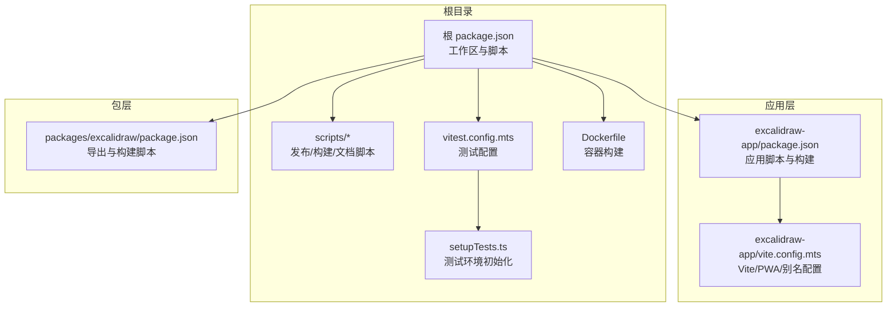
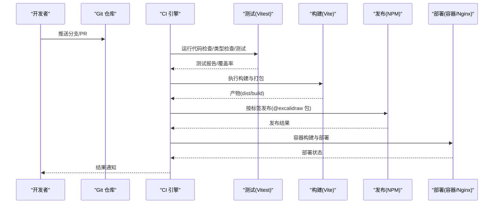
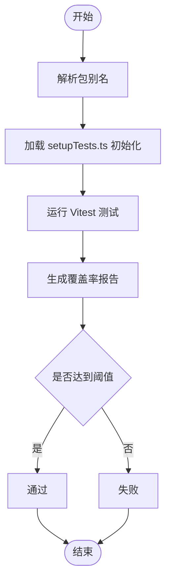
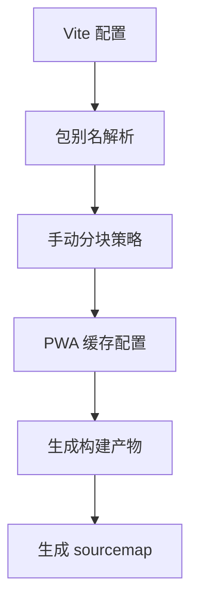
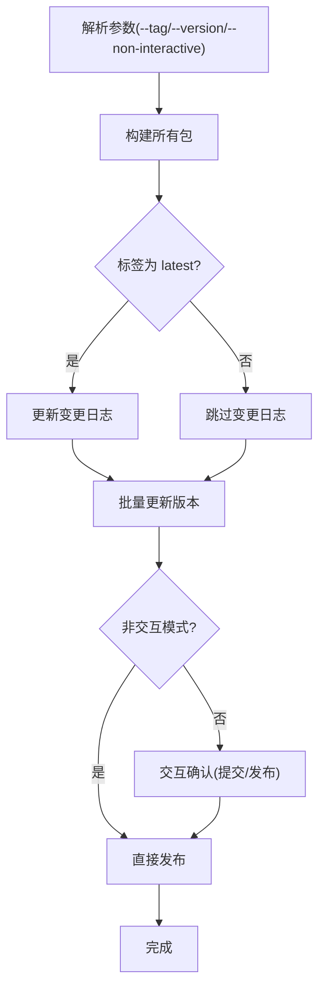
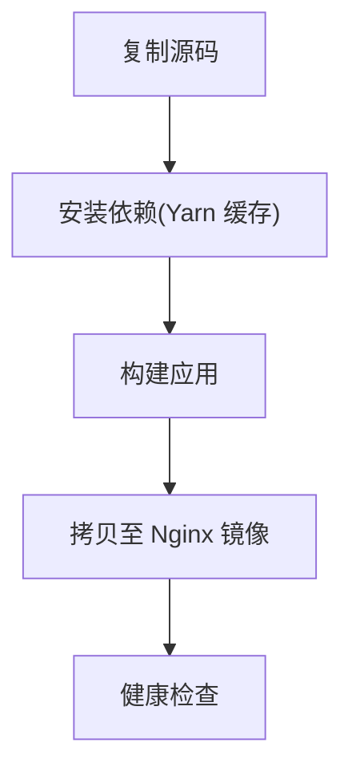
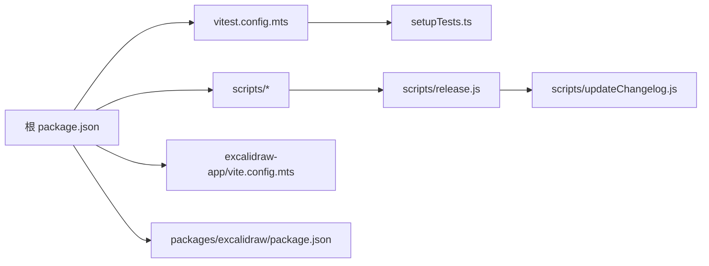

# CI/CD 流程

<cite>
**本文引用的文件**
- [package.json](file://package.json)
- [vitest.config.mts](file://vitest.config.mts)
- [setupTests.ts](file://setupTests.ts)
- [Dockerfile](file://Dockerfile)
- [excalidraw-app/package.json](file://excalidraw-app/package.json)
- [excalidraw-app/vite.config.mts](file://excalidraw-app/vite.config.mts)
- [scripts/release.js](file://scripts/release.js)
- [scripts/updateChangelog.js](file://scripts/updateChangelog.js)
- [scripts/buildDocs.js](file://scripts/buildDocs.js)
- [.github/copilot-instructions.md](file://.github/copilot-instructions.md)
</cite>

## 目录

1. [简介](#简介)
2. [项目结构](#项目结构)
3. [核心组件](#核心组件)
4. [架构总览](#架构总览)
5. [详细组件分析](#详细组件分析)
6. [依赖关系分析](#依赖关系分析)
7. [性能考量](#性能考量)
8. [故障排查指南](#故障排查指南)
9. [结论](#结论)
10. [附录](#附录)

## 简介

本指南面向开发团队，系统性讲解本仓库的持续集成与持续部署（CI/CD）实践，涵盖以下方面：

- GitHub Actions 工作流配置思路与建议
- 构建、测试与部署流水线设计
- 自动化测试体系：单元测试、类型检查、代码风格与覆盖率
- 发布管理：版本标记、变更日志生成、自动发布
- 代码质量与安全扫描配置建议
- 环境管理与部署策略：蓝绿与金丝雀发布思路
- 回滚机制与紧急修复流程
- 基于现有脚本与配置的最佳实践落地

说明：本仓库未包含实际的 GitHub Actions 工作流文件，但已具备完善的本地脚本与配置，可直接映射到 CI/CD 流水线。

## 项目结构

本仓库采用多包（monorepo）结构，核心目录与职责如下：

- 根级脚本与配置：用于构建、测试、发布与文档更新
- 应用层（excalidraw-app）：前端应用，Vite 构建与 PWA 配置
- 包层（packages/\*）：可发布的 NPM 包，统一版本与导出
- 示例与文档：示例工程与 Docusaurus 文档站点
- Firebase 与 Vercel：后端与托管配置（用于参考）

图表来源

- [package.json:1-96](file://package.json#L1-L96)
- [vitest.config.mts:1-88](file://vitest.config.mts#L1-L88)
- [setupTests.ts:1-134](file://setupTests.ts#L1-L134)
- [Dockerfile:1-21](file://Dockerfile#L1-L21)
- [excalidraw-app/package.json:1-58](file://excalidraw-app/package.json#L1-L58)
- [excalidraw-app/vite.config.mts:1-319](file://excalidraw-app/vite.config.mts#L1-L319)
- [packages/excalidraw/package.json:1-141](file://packages/excalidraw/package.json#L1-L141)

章节来源

- [package.json:1-96](file://package.json#L1-L96)
- [excalidraw-app/package.json:1-58](file://excalidraw-app/package.json#L1-L58)
- [packages/excalidraw/package.json:1-141](file://packages/excalidraw/package.json#L1-L141)

## 核心组件

- 测试与覆盖率：基于 Vitest 的单元测试与覆盖率配置，包含环境设置、别名与阈值
- 构建与打包：Vite 应用构建、PWA 缓存策略、字体与语言资源分块
- 发布与变更日志：统一版本更新、批量发布与变更日志生成
- 容器化：Docker 多阶段构建与 Nginx 部署
- 质量规范：ESLint、Prettier、TypeScript 类型检查

章节来源

- [vitest.config.mts:1-88](file://vitest.config.mts#L1-L88)
- [setupTests.ts:1-134](file://setupTests.ts#L1-L134)
- [excalidraw-app/vite.config.mts:1-319](file://excalidraw-app/vite.config.mts#L1-L319)
- [scripts/release.js:1-246](file://scripts/release.js#L1-L246)
- [scripts/updateChangelog.js:1-107](file://scripts/updateChangelog.js#L1-L107)
- [Dockerfile:1-21](file://Dockerfile#L1-L21)
- [package.json:67-80](file://package.json#L67-L80)

## 架构总览

下图展示从代码提交到产物发布的典型流水线，映射到仓库中的脚本与配置：

图表来源

- [package.json:67-80](file://package.json#L67-L80)
- [excalidraw-app/vite.config.mts:1-319](file://excalidraw-app/vite.config.mts#L1-L319)
- [scripts/release.js:174-225](file://scripts/release.js#L174-L225)
- [Dockerfile:1-21](file://Dockerfile#L1-L21)

## 详细组件分析

### 测试与覆盖率（Vitest）

- 环境与别名：通过 Vitest 别名解析包内模块，确保测试可定位内部实现；全局环境使用 jsdom
- 设置文件：集中注入 polyfill、Mock 与全局行为，保证快照与渲染一致性
- 覆盖率：启用多种格式输出，设定行/分支/函数/语句阈值，便于持续监控质量

图表来源

- [vitest.config.mts:65-86](file://vitest.config.mts#L65-L86)
- [setupTests.ts:1-134](file://setupTests.ts#L1-L134)

章节来源

- [vitest.config.mts:1-88](file://vitest.config.mts#L1-L88)
- [setupTests.ts:1-134](file://setupTests.ts#L1-L134)

### 构建与打包（Vite + PWA）

- 别名与解析：将 @excalidraw/\* 映射到各包源码，便于开发调试与测试
- 分块策略：按功能拆分 chunk（如 CodeMirror、Mermaid、字体与语言资源），提升缓存命中
- PWA 缓存：Workbox 预缓存与运行时缓存策略，优化离线与首屏体验
- 源码映射：开启 sourcemap 便于问题定位

图表来源

- [excalidraw-app/vite.config.mts:24-126](file://excalidraw-app/vite.config.mts#L24-L126)
- [excalidraw-app/vite.config.mts:150-221](file://excalidraw-app/vite.config.mts#L150-L221)

章节来源

- [excalidraw-app/vite.config.mts:1-319](file://excalidraw-app/vite.config.mts#L1-L319)

### 发布管理（版本标记、变更日志、自动发布）

- 统一版本：在发布前批量更新各包版本，保持依赖一致
- 变更日志：基于 Git 提交信息生成 CHANGELOG，支持类型过滤与 PR 链接
- 发布标签：支持 test/next/latest 标签，稳定版需指定版本号
- 交互与非交互：支持交互式确认与 CI 非交互模式

图表来源

- [scripts/release.js:31-95](file://scripts/release.js#L31-L95)
- [scripts/release.js:174-245](file://scripts/release.js#L174-L245)
- [scripts/updateChangelog.js:25-104](file://scripts/updateChangelog.js#L25-L104)

章节来源

- [scripts/release.js:1-246](file://scripts/release.js#L1-L246)
- [scripts/updateChangelog.js:1-107](file://scripts/updateChangelog.js#L1-L107)

### 容器化与部署

- 多阶段构建：Node 基础镜像安装依赖并构建，Nginx 镜像仅承载静态产物
- 缓存与平台：利用 Yarn 缓存与交叉编译参数，提升构建稳定性
- 健康检查：容器健康探针确保服务可用

图表来源

- [Dockerfile:1-21](file://Dockerfile#L1-L21)

章节来源

- [Dockerfile:1-21](file://Dockerfile#L1-L21)

### 文档构建触发

- 基于 Git diff 判断是否需要重新构建文档，若存在文档变更则触发构建步骤

章节来源

- [scripts/buildDocs.js:1-21](file://scripts/buildDocs.js#L1-L21)

### 代码质量与安全扫描（建议）

- ESLint：在 CI 中执行，限制告警数量，确保代码风格一致
- Prettier：校验格式，避免格式分歧
- TypeScript：类型检查，防止潜在错误
- 依赖审计：定期执行 NPM/Yarn 安全审计
- 依赖升级：结合安全扫描结果进行升级与锁定

章节来源

- [package.json:69-71](file://package.json#L69-L71)
- [package.json:78-79](file://package.json#L78-L79)
- [.github/copilot-instructions.md:38-46](file://.github/copilot-instructions.md#L38-L46)

### 部署策略与回滚（建议）

- 蓝绿部署：准备两套环境，切换流量后回滚
- 金丝雀发布：逐步扩大流量比例，观察指标后全量
- 回滚机制：记录发布版本与哈希，出现问题快速回退至上一稳定版本
- 紧急修复：隔离修复分支，小步快跑合并，快速验证与发布

[本节为概念性说明，不直接分析具体文件]

## 依赖关系分析

- 根脚本驱动：根 package.json 的脚本统一调度各子包构建与测试
- 测试依赖：Vitest 配置依赖 setupTests.ts 的全局注入
- 构建依赖：Vite 配置依赖包别名，确保开发与测试一致
- 发布依赖：release 脚本依赖 updateChangelog 与各包 package.json 版本

图表来源

- [package.json:51-91](file://package.json#L51-L91)
- [vitest.config.mts:1-88](file://vitest.config.mts#L1-L88)
- [setupTests.ts:1-134](file://setupTests.ts#L1-L134)
- [excalidraw-app/vite.config.mts:1-319](file://excalidraw-app/vite.config.mts#L1-L319)
- [scripts/release.js:1-246](file://scripts/release.js#L1-L246)
- [scripts/updateChangelog.js:1-107](file://scripts/updateChangelog.js#L1-L107)
- [packages/excalidraw/package.json:74](file://packages/excalidraw/package.json#L74)

章节来源

- [package.json:1-96](file://package.json#L1-L96)

## 性能考量

- 构建性能：合理分块与缓存，减少重复构建时间
- 测试性能：并行钩子顺序配置，缩短测试总时长
- 覆盖率阈值：适度提高阈值以保证关键路径被覆盖
- 容器构建：利用缓存与交叉编译，降低镜像构建时间

[本节提供通用建议，不直接分析具体文件]

## 故障排查指南

- 测试失败：检查 setupTests.ts 注入项与 Mock 行为，确认快照一致性
- 构建失败：核对 Vite 别名与手动分块规则，确保资源路径正确
- 发布失败：确认标签与版本参数，检查 NPM 发布权限与网络状况
- 文档构建：确认 diff 判断逻辑与触发条件

章节来源

- [setupTests.ts:1-134](file://setupTests.ts#L1-L134)
- [excalidraw-app/vite.config.mts:1-319](file://excalidraw-app/vite.config.mts#L1-L319)
- [scripts/release.js:31-95](file://scripts/release.js#L31-L95)
- [scripts/buildDocs.js:1-21](file://scripts/buildDocs.js#L1-L21)

## 结论

本仓库已具备完善的本地脚本与配置，可直接映射到 CI/CD 流水线。建议在 CI 中按“检查-测试-构建-发布-部署”的顺序串联各阶段，并结合质量与安全扫描，形成闭环。发布流程可通过标签与版本参数灵活控制，配合变更日志与容器化部署，实现稳定高效的交付。

[本节为总结性内容，不直接分析具体文件]

## 附录

- 质量规范参考：项目内 Copilot 指南明确了 TypeScript、React、命名约定与错误处理等标准
- 关键脚本入口：
  - 测试：根脚本中 test:all、test:code、test:typecheck、test:coverage
  - 构建：根脚本中 build:packages、build:app、build:app:docker
  - 发布：根脚本中 release、release:test、release:next、release:latest

章节来源

- [.github/copilot-instructions.md:1-46](file://.github/copilot-instructions.md#L1-L46)
- [package.json:67-87](file://package.json#L67-L87)
