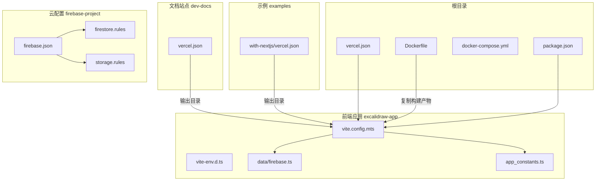
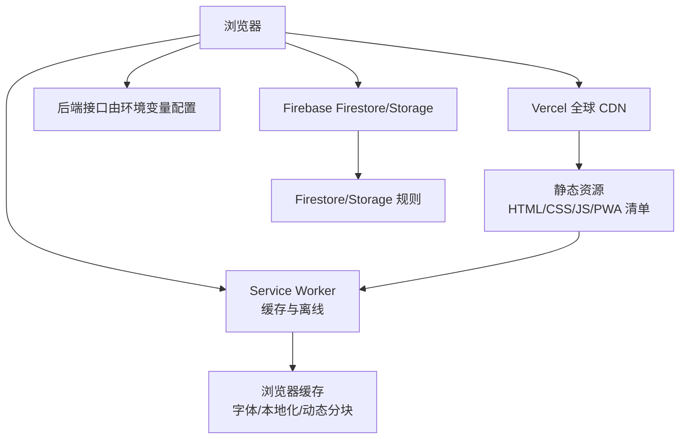
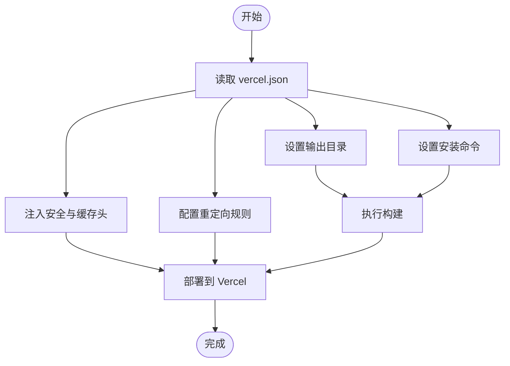
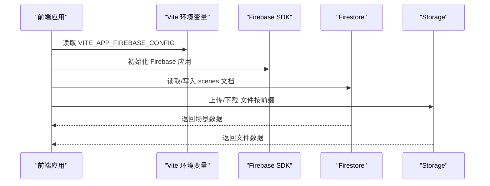
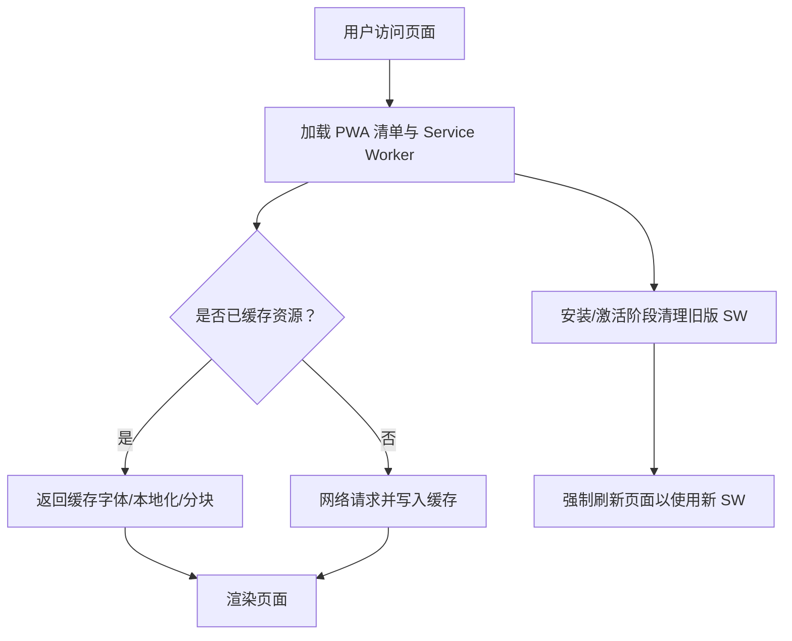
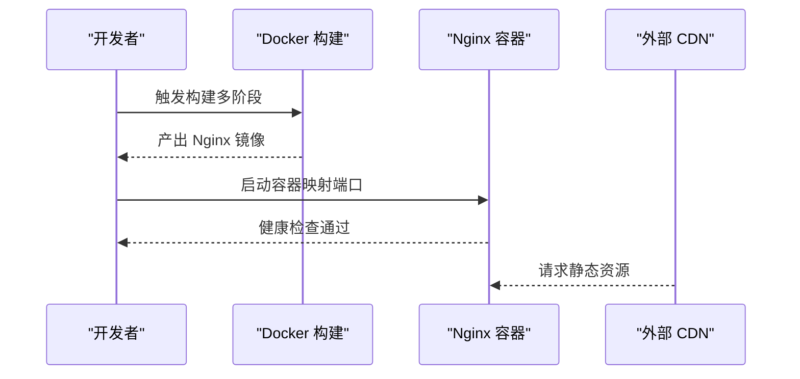
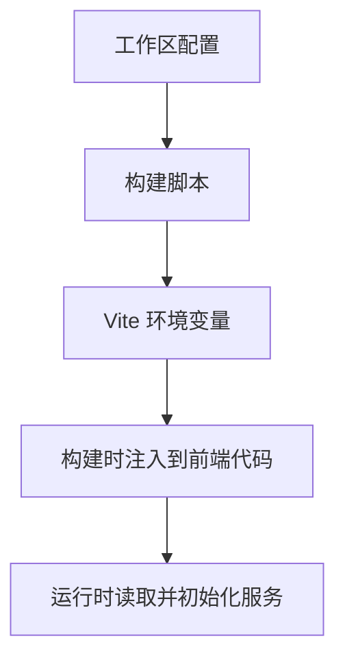
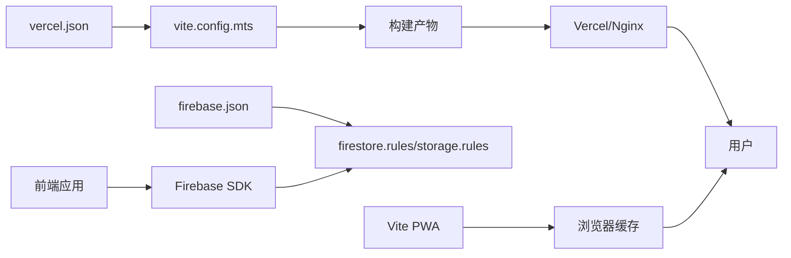

# 云平台部署

<cite>
**本文引用的文件**
- [vercel.json](file://vercel.json)
- [dev-docs/vercel.json](file://dev-docs/vercel.json)
- [examples/with-nextjs/vercel.json](file://examples/with-nextjs/vercel.json)
- [Dockerfile](file://Dockerfile)
- [docker-compose.yml](file://docker-compose.yml)
- [package.json](file://package.json)
- [excalidraw-app/package.json](file://excalidraw-app/package.json)
- [excalidraw-app/vite.config.mts](file://excalidraw-app/vite.config.mts)
- [excalidraw-app/vite-env.d.ts](file://excalidraw-app/vite-env.d.ts)
- [excalidraw-app/data/firebase.ts](file://excalidraw-app/data/firebase.ts)
- [excalidraw-app/app_constants.ts](file://excalidraw-app/app_constants.ts)
- [firebase-project/firebase.json](file://firebase-project/firebase.json)
- [firebase-project/firestore.rules](file://firebase-project/firestore.rules)
- [firebase-project/storage.rules](file://firebase-project/storage.rules)
- [public/service-worker.js](file://public/service-worker.js)
</cite>

## 目录
1. [简介](#简介)
2. [项目结构](#项目结构)
3. [核心组件](#核心组件)
4. [架构总览](#架构总览)
5. [详细组件分析](#详细组件分析)
6. [依赖关系分析](#依赖关系分析)
7. [性能考虑](#性能考虑)
8. [故障排查指南](#故障排查指南)
9. [结论](#结论)
10. [附录](#附录)

## 简介
本指南面向云平台部署实践，围绕以下目标展开：Vercel 静态站点部署与配置（含安全头、缓存与重定向）、Firebase 配置（Firestore 规则、存储规则与认证思路）、Service Worker 注册与 PWA 缓存策略（离线与渐进式功能）、CDN 与全球加速、无服务器/云函数使用场景、成本优化与性能调优、以及运维部署与监控建议。文档基于仓库中的实际配置文件进行解析与总结，帮助读者在不同云平台上实现稳定、高效、可维护的部署。

## 项目结构
该仓库采用多包工作区结构，前端应用位于 excalidraw-app，文档站点位于 dev-docs，示例项目位于 examples，云配置集中在 firebase-project 与根目录的 vercel.json。构建与运行通过 Vite 进行，生产环境可通过 Vercel 或 Docker/Nginx 托管。

图表来源
- [vercel.json:1-71](file://vercel.json#L1-L71)
- [dev-docs/vercel.json:1-5](file://dev-docs/vercel.json#L1-L5)
- [examples/with-nextjs/vercel.json:1-4](file://examples/with-nextjs/vercel.json#L1-L4)
- [Dockerfile:1-21](file://Dockerfile#L1-L21)
- [excalidraw-app/vite.config.mts:1-319](file://excalidraw-app/vite.config.mts#L1-L319)
- [excalidraw-app/vite-env.d.ts:1-50](file://excalidraw-app/vite-env.d.ts#L1-L50)
- [excalidraw-app/data/firebase.ts:1-320](file://excalidraw-app/data/firebase.ts#L1-L320)
- [excalidraw-app/app_constants.ts:1-62](file://excalidraw-app/app_constants.ts#L1-L62)
- [firebase-project/firebase.json:1-10](file://firebase-project/firebase.json#L1-L10)
- [firebase-project/firestore.rules:1-11](file://firebase-project/firestore.rules#L1-L11)
- [firebase-project/storage.rules:1-12](file://firebase-project/storage.rules#L1-L12)

章节来源
- [vercel.json:1-71](file://vercel.json#L1-L71)
- [dev-docs/vercel.json:1-5](file://dev-docs/vercel.json#L1-L5)
- [examples/with-nextjs/vercel.json:1-4](file://examples/with-nextjs/vercel.json#L1-L4)
- [Dockerfile:1-21](file://Dockerfile#L1-L21)
- [docker-compose.yml:1-24](file://docker-compose.yml#L1-L24)
- [package.json:1-96](file://package.json#L1-L96)
- [excalidraw-app/package.json:1-58](file://excalidraw-app/package.json#L1-L58)
- [excalidraw-app/vite.config.mts:1-319](file://excalidraw-app/vite.config.mts#L1-L319)
- [excalidraw-app/vite-env.d.ts:1-50](file://excalidraw-app/vite-env.d.ts#L1-L50)
- [excalidraw-app/data/firebase.ts:1-320](file://excalidraw-app/data/firebase.ts#L1-L320)
- [excalidraw-app/app_constants.ts:1-62](file://excalidraw-app/app_constants.ts#L1-L62)
- [firebase-project/firebase.json:1-10](file://firebase-project/firebase.json#L1-L10)
- [firebase-project/firestore.rules:1-11](file://firebase-project/firestore.rules#L1-L11)
- [firebase-project/storage.rules:1-12](file://firebase-project/storage.rules#L1-L12)

## 核心组件
- Vercel 部署配置：定义静态站点输出目录、安装命令、安全与缓存头、跨域与重定向规则。
- 构建与打包：Vite 配置包含 PWA 插件、Sitemap、手动分包、字体与本地化资源缓存策略。
- Firebase 集成：初始化与读写 Firestore、上传下载 Firebase Storage，并通过规则控制访问。
- Service Worker 与 PWA：Vite PWA 提供自动更新、缓存策略与清单；自定义旧版 SW 清理逻辑。
- 容器化部署：Docker 多阶段构建与 Nginx 镜像，docker-compose 支持开发联调。
- 环境变量：通过 Vite 环境变量注入后端地址、Firebase 配置、Sentry 开关等。

章节来源
- [vercel.json:1-71](file://vercel.json#L1-L71)
- [excalidraw-app/vite.config.mts:150-311](file://excalidraw-app/vite.config.mts#L150-L311)
- [excalidraw-app/data/firebase.ts:44-79](file://excalidraw-app/data/firebase.ts#L44-L79)
- [public/service-worker.js:1-21](file://public/service-worker.js#L1-L21)
- [Dockerfile:1-21](file://Dockerfile#L1-L21)
- [docker-compose.yml:1-24](file://docker-compose.yml#L1-L24)
- [excalidraw-app/vite-env.d.ts:1-50](file://excalidraw-app/vite-env.d.ts#L1-L50)

## 架构总览
下图展示从浏览器到 Vercel/容器化托管、再到 Firebase 的典型请求链路，以及 PWA 缓存与 Service Worker 的作用点。

图表来源
- [vercel.json:1-71](file://vercel.json#L1-L71)
- [excalidraw-app/vite.config.mts:150-311](file://excalidraw-app/vite.config.mts#L150-L311)
- [excalidraw-app/data/firebase.ts:44-79](file://excalidraw-app/data/firebase.ts#L44-L79)
- [excalidraw-app/vite-env.d.ts:1-50](file://excalidraw-app/vite-env.d.ts#L1-L50)

## 详细组件分析

### Vercel 部署配置
- 输出目录与安装命令：确保构建产物路径与安装脚本正确，避免 CI/CD 报错。
- 安全与缓存头：统一设置安全响应头，针对 woff2 字体与特定资源设置长期缓存与跨域许可。
- 跨域与重定向：限制特定来源的跨域访问，为历史路径或第三方入口提供重定向。
- 与 Next.js 示例：示例项目的 vercel.json 展示了最小化输出目录配置。

图表来源
- [vercel.json:1-71](file://vercel.json#L1-L71)
- [dev-docs/vercel.json:1-5](file://dev-docs/vercel.json#L1-L5)
- [examples/with-nextjs/vercel.json:1-4](file://examples/with-nextjs/vercel.json#L1-L4)

章节来源
- [vercel.json:1-71](file://vercel.json#L1-L71)
- [dev-docs/vercel.json:1-5](file://dev-docs/vercel.json#L1-L5)
- [examples/with-nextjs/vercel.json:1-4](file://examples/with-nextjs/vercel.json#L1-L4)

### Firebase 配置
- 配置入口：firebase.json 指定 Firestore 规则与索引、Storage 规则文件位置。
- Firestore 规则：允许读写，列表查询默认关闭，避免误删他人数据。
- Storage 规则：按房间与分享链接前缀开放读写，便于协作与分享场景。
- 应用集成：前端通过 Vite 环境变量注入 Firebase 配置，初始化应用并读写 Firestore/Storage。

图表来源
- [firebase-project/firebase.json:1-10](file://firebase-project/firebase.json#L1-L10)
- [firebase-project/firestore.rules:1-11](file://firebase-project/firestore.rules#L1-L11)
- [firebase-project/storage.rules:1-12](file://firebase-project/storage.rules#L1-L12)
- [excalidraw-app/data/firebase.ts:44-79](file://excalidraw-app/data/firebase.ts#L44-L79)
- [excalidraw-app/app_constants.ts:32-35](file://excalidraw-app/app_constants.ts#L32-L35)

章节来源
- [firebase-project/firebase.json:1-10](file://firebase-project/firebase.json#L1-L10)
- [firebase-project/firestore.rules:1-11](file://firebase-project/firestore.rules#L1-L11)
- [firebase-project/storage.rules:1-12](file://firebase-project/storage.rules#L1-L12)
- [excalidraw-app/data/firebase.ts:44-79](file://excalidraw-app/data/firebase.ts#L44-L79)
- [excalidraw-app/app_constants.ts:32-35](file://excalidraw-app/app_constants.ts#L32-L35)

### Service Worker 与 PWA 缓存策略
- 自动清理旧版 SW：通过自定义 SW 在安装/激活阶段卸载旧版本并刷新页面，确保迁移至新策略。
- PWA 策略：Vite PWA 提供自动更新、Workbox 缓存策略与清单；排除字体、本地化与动态分块以提升缓存命中与首屏性能。
- 缓存分类：字体、本地化、动态分块分别设置不同缓存策略与过期时间，兼顾性能与更新需求。

图表来源
- [public/service-worker.js:1-21](file://public/service-worker.js#L1-L21)
- [excalidraw-app/vite.config.mts:150-311](file://excalidraw-app/vite.config.mts#L150-L311)

章节来源
- [public/service-worker.js:1-21](file://public/service-worker.js#L1-L21)
- [excalidraw-app/vite.config.mts:150-311](file://excalidraw-app/vite.config.mts#L150-L311)

### 容器化与 Docker 部署
- 多阶段构建：先在 Node 基础镜像中安装依赖与构建，再将产物复制到 Nginx 镜像，减小体积并提升安全性。
- 健康检查：Nginx 容器内置健康检查，便于编排系统进行探活。
- docker-compose：开发模式挂载源码与依赖，便于热更新与调试。

图表来源
- [Dockerfile:1-21](file://Dockerfile#L1-L21)
- [docker-compose.yml:1-24](file://docker-compose.yml#L1-L24)

章节来源
- [Dockerfile:1-21](file://Dockerfile#L1-L21)
- [docker-compose.yml:1-24](file://docker-compose.yml#L1-L24)

### 环境变量与后端集成
- Vite 环境变量：通过 VITE_ 前缀注入后端地址、Firebase 配置、Sentry 开关、PWA 开关、Git SHA 等。
- 构建脚本：应用层脚本在构建时注入 Git SHA，便于追踪发布版本。
- 工作区管理：根 package.json 管理多包工作区与统一脚本。

图表来源
- [excalidraw-app/vite-env.d.ts:1-50](file://excalidraw-app/vite-env.d.ts#L1-L50)
- [excalidraw-app/package.json:43-52](file://excalidraw-app/package.json#L43-L52)
- [package.json:50-91](file://package.json#L50-L91)

章节来源
- [excalidraw-app/vite-env.d.ts:1-50](file://excalidraw-app/vite-env.d.ts#L1-L50)
- [excalidraw-app/package.json:43-52](file://excalidraw-app/package.json#L43-L52)
- [package.json:50-91](file://package.json#L50-L91)

## 依赖关系分析
- Vercel 配置与构建：vercel.json 决定输出目录与安装命令，需与 vite.config.mts 的 outDir 保持一致。
- Firebase 规则与应用：firebase.json 指向规则文件，应用通过初始化配置读写数据。
- PWA 与缓存：Vite PWA 插件与 Workbox 策略共同决定缓存行为，需与字体/本地化资源分包策略协同。
- 容器化：Dockerfile 将构建产物复制到 Nginx，docker-compose 提供开发联调。

图表来源
- [vercel.json:1-71](file://vercel.json#L1-L71)
- [excalidraw-app/vite.config.mts:87-126](file://excalidraw-app/vite.config.mts#L87-L126)
- [firebase-project/firebase.json:1-10](file://firebase-project/firebase.json#L1-L10)
- [firebase-project/firestore.rules:1-11](file://firebase-project/firestore.rules#L1-L11)
- [firebase-project/storage.rules:1-12](file://firebase-project/storage.rules#L1-L12)
- [excalidraw-app/data/firebase.ts:44-79](file://excalidraw-app/data/firebase.ts#L44-L79)

章节来源
- [vercel.json:1-71](file://vercel.json#L1-L71)
- [excalidraw-app/vite.config.mts:87-126](file://excalidraw-app/vite.config.mts#L87-L126)
- [firebase-project/firebase.json:1-10](file://firebase-project/firebase.json#L1-L10)
- [firebase-project/firestore.rules:1-11](file://firebase-project/firestore.rules#L1-L11)
- [firebase-project/storage.rules:1-12](file://firebase-project/storage.rules#L1-L12)
- [excalidraw-app/data/firebase.ts:44-79](file://excalidraw-app/data/firebase.ts#L44-L79)

## 性能考虑
- 静态资源缓存：Vercel 默认缓存策略配合字体与本地化资源的长缓存头，减少重复下载。
- 分包与懒加载：Vite 手动分包将本地化与编辑器模块拆分，结合 Workbox 的 CacheFirst/ StaleWhileRevalidate，平衡首屏与更新。
- 字体与媒体：woff2 字体设置长期缓存，媒体文件按最大缓存时间写入，降低带宽消耗。
- 构建优化：开启 sourcemap 便于调试，同时注意生产环境的体积与加载时间权衡。

章节来源
- [vercel.json:26-50](file://vercel.json#L26-L50)
- [excalidraw-app/vite.config.mts:99-121](file://excalidraw-app/vite.config.mts#L99-L121)
- [excalidraw-app/data/firebase.ts:160-172](file://excalidraw-app/data/firebase.ts#L160-L172)

## 故障排查指南
- Vercel 部署失败：核对输出目录与安装命令是否与构建脚本一致，确认 CI 日志中的安装与构建步骤。
- CORS 问题：检查 vercel.json 中的跨域头与特定资源的跨域许可，确保仅放行可信域名。
- PWA 不生效：确认 PWA 清单与 Service Worker 注册流程，清理旧版 SW 并刷新页面。
- Firebase 权限错误：核对 firestore.rules 与 storage.rules 的匹配路径，确保房间与分享链接前缀正确。
- 容器启动异常：查看 Nginx 健康检查日志，确认构建产物已复制到正确路径。

章节来源
- [vercel.json:1-71](file://vercel.json#L1-L71)
- [public/service-worker.js:1-21](file://public/service-worker.js#L1-L21)
- [firebase-project/firestore.rules:1-11](file://firebase-project/firestore.rules#L1-L11)
- [firebase-project/storage.rules:1-12](file://firebase-project/storage.rules#L1-L12)
- [Dockerfile:16-21](file://Dockerfile#L16-L21)

## 结论
本指南基于仓库中的实际配置，梳理了 Vercel 部署、Firebase 集成、PWA 与缓存策略、容器化与环境变量的关键要点。通过统一的构建与部署配置、严格的缓存与安全头策略、以及清晰的云规则与容器化流程，可在不同云平台上实现高性能、可维护的静态站点与协作应用部署。

## 附录
- 无服务器/云函数使用场景建议
  - 事件驱动任务：如导入导出、批量处理、通知发送等，可使用云函数在触发时执行。
  - 认证与授权：通过云函数实现自定义登录、权限校验与审计日志。
  - 数据同步：在 Firestore/Storage 变更时触发云函数进行索引更新或数据转换。
  - 成本优化：按需触发、冷启动优化、资源池复用与超时控制。
- 运维与监控建议
  - 构建与部署：CI/CD 中加入构建产物校验与缓存命中率统计。
  - 性能监控：记录首屏时间、TTFB、缓存命中率与错误率。
  - 安全审计：定期审查 CORS 与跨域策略、Firebase 规则变更与访问日志。
  - 健康检查：容器与服务端均启用健康检查，结合告警策略。