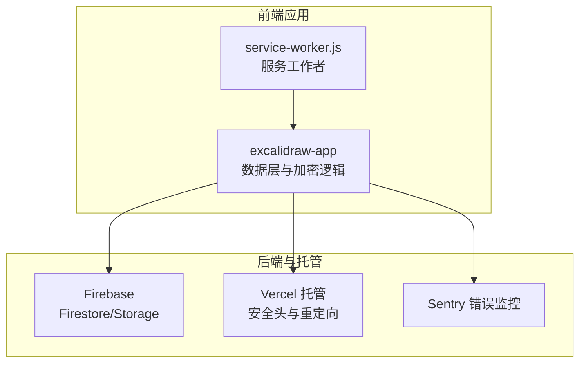
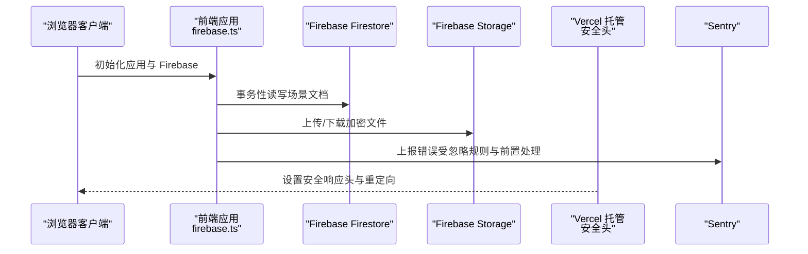
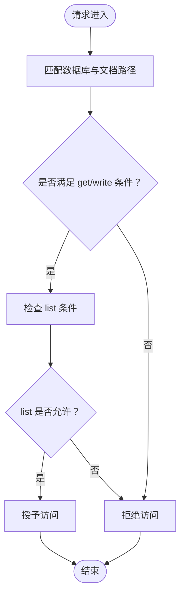
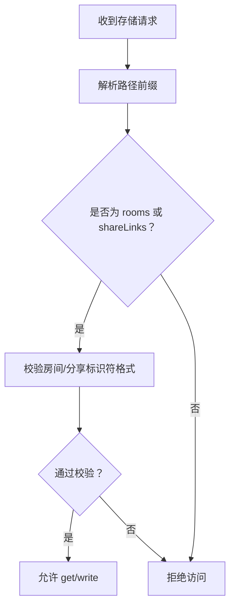
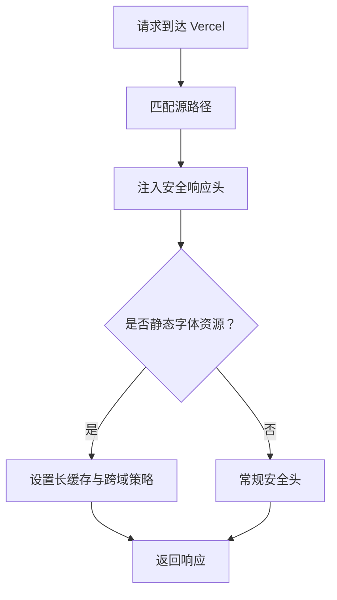
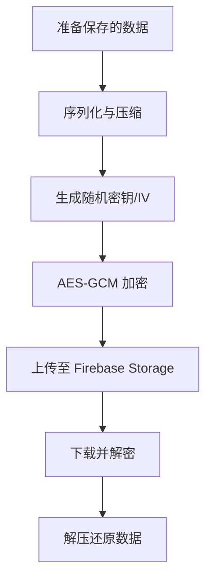
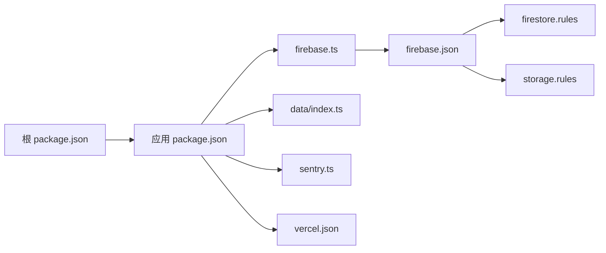

# 安全配置

<cite>
**本文引用的文件**
- [firebase.json](file://firebase-project/firebase.json)
- [firestore.rules](file://firebase-project/firestore.rules)
- [storage.rules](file://firebase-project/storage.rules)
- [firebase.ts](file://excalidraw-app/data/firebase.ts)
- [app_constants.ts](file://excalidraw-app/app_constants.ts)
- [index.ts](file://excalidraw-app/data/index.ts)
- [sentry.ts](file://excalidraw-app/sentry.ts)
- [vercel.json](file://vercel.json)
- [service-worker.js](file://public/service-worker.js)
- [package.json（应用）](file://excalidraw-app/package.json)
- [package.json（根）](file://package.json)
</cite>

## 目录

1. [简介](#简介)
2. [项目结构](#项目结构)
3. [核心组件](#核心组件)
4. [架构总览](#架构总览)
5. [详细组件分析](#详细组件分析)
6. [依赖关系分析](#依赖关系分析)
7. [性能考量](#性能考量)
8. [故障排查指南](#故障排查指南)
9. [结论](#结论)
10. [附录](#附录)

## 简介

本指南面向安全团队与工程团队，系统梳理本仓库在 Firebase 与前端托管平台上的安全配置现状，并结合代码实现提出可落地的加固建议。内容覆盖：

- Firestore 数据库规则与访问控制
- Firebase Storage 安全规则与 CORS 配置
- HTTPS 强制与安全响应头（含 HSTS、CSP、X-Frame-Options）
- 身份认证与授权（当前以链接分享密钥为主）
- 数据加密与隐私保护（传输与端到端存储加密）
- 安全审计与漏洞扫描流程
- 安全事件响应与应急处置预案

## 项目结构

本项目采用多包工作区与前端应用分离的组织方式，安全相关的关键位置如下：

- Firebase 配置：firebase-project 目录下的规则与配置文件
- 前端应用：excalidraw-app 中的 Firebase SDK 初始化、数据读写与加密逻辑
- 托管与安全头：vercel.json 中的响应头与重定向策略
- 错误监控：Sentry 集成与过滤策略



图表来源

- [firebase.ts:10-80](file://excalidraw-app/data/firebase.ts#L10-80)
- [firebase.json:1-10](file://firebase-project/firebase.json#L1-L10)
- [vercel.json:1-71](file://vercel.json#L1-L71)
- [sentry.ts:1-95](file://excalidraw-app/sentry.ts#L1-L95)
- [service-worker.js:1-21](file://public/service-worker.js#L1-L21)

章节来源

- [firebase.json:1-10](file://firebase-project/firebase.json#L1-L10)
- [vercel.json:1-71](file://vercel.json#L1-L71)
- [package.json（应用）:1-58](file://excalidraw-app/package.json#L1-L58)
- [package.json（根）:1-96](file://package.json#L1-L96)

## 核心组件

- Firebase 配置与规则
  - Firestore 规则：允许读取与写入，列表查询默认关闭
  - Storage 规则：按路径前缀开放协作与分享链接文件访问
  - Firebase 项目配置：绑定规则与索引文件
- 前端数据层与加密
  - Firebase SDK 初始化与懒加载
  - 场景与文件的加解密、压缩与上传
  - 协作房间密钥生成与链接拼装
- 托管安全头与重定向
  - Access-Control-Allow-Origin、X-Content-Type-Options、Referrer-Policy 等
  - 静态资源缓存与字体资源跨域策略
- 错误监控与日志
  - Sentry 初始化、环境映射、忽略规则与前置处理器

章节来源

- [firestore.rules:1-11](file://firebase-project/firestore.rules#L1-L11)
- [storage.rules:1-12](file://firebase-project/storage.rules#L1-L12)
- [firebase.json:1-10](file://firebase-project/firebase.json#L1-L10)
- [firebase.ts:10-80](file://excalidraw-app/data/firebase.ts#L10-80)
- [index.ts:68-164](file://excalidraw-app/data/index.ts#L68-L164)
- [vercel.json:1-71](file://vercel.json#L1-L71)
- [sentry.ts:1-95](file://excalidraw-app/sentry.ts#L1-L95)

## 架构总览

下图展示前端应用如何通过 Firebase 与托管平台进行数据与安全交互。



图表来源

- [firebase.ts:60-80](file://excalidraw-app/data/firebase.ts#L60-L80)
- [firebase.ts:187-247](file://excalidraw-app/data/firebase.ts#L187-L247)
- [firebase.ts:274-319](file://excalidraw-app/data/firebase.ts#L274-L319)
- [vercel.json:1-71](file://vercel.json#L1-L71)
- [sentry.ts:20-82](file://excalidraw-app/sentry.ts#L20-L82)

## 详细组件分析

### Firestore 数据库规则与访问控制

- 当前规则要点
  - 允许任意 get 与 write
  - 列表查询默认关闭
- 风险与建议
  - 任意写入可能带来数据篡改风险；建议引入基于身份的条件表达式与最小权限原则
  - 对敏感集合增加鉴权条件，如仅允许拥有者或特定角色写入
  - 列表查询关闭可降低枚举攻击面，但需评估业务需求后再放宽



图表来源

- [firestore.rules:3-8](file://firebase-project/firestore.rules#L3-L8)

章节来源

- [firestore.rules:1-11](file://firebase-project/firestore.rules#L1-L11)

### Firebase Storage 安全规则与 CORS

- 当前规则要点
  - 按路径前缀开放协作房间与分享链接文件的 get/write
- 风险与建议
  - 建议对路径中的房间 ID 与分享 ID 进行长度与字符集校验，防止越权访问
  - 限制文件类型与大小，结合前端上传限制形成双保险
  - 明确 CORS 策略，避免通配符跨域暴露



图表来源

- [storage.rules:4-9](file://firebase-project/storage.rules#L4-L9)

章节来源

- [storage.rules:1-12](file://firebase-project/storage.rules#L1-L12)
- [firebase.json:6-8](file://firebase-project/firebase.json#L6-L8)

### HTTPS 强制与安全响应头（含 HSTS、CSP、X-Frame-Options）

- 当前托管配置要点
  - 设置 Access-Control-Allow-Origin、X-Content-Type-Options、Referrer-Policy 等
  - 字体资源与静态资源的缓存与跨域策略
- 建议
  - 引入 HSTS 与 CSP，减少中间人攻击与 XSS 风险
  - 将 X-Frame-Options 替换为 Content-Security-Policy 的 frame-ancestors
  - 对动态资源启用严格的 CORS 策略



图表来源

- [vercel.json:3-51](file://vercel.json#L3-L51)

章节来源

- [vercel.json:1-71](file://vercel.json#L1-L71)

### 身份认证与授权（当前以链接分享密钥为主）

- 当前实现要点
  - 协作房间密钥由前端随机生成，作为分享链接的一部分
  - 密钥长度与字符集校验在前端完成
- 建议
  - 引入基于 Firebase Authentication 的用户会话与角色体系
  - 对分享链接增加过期时间与访问次数限制
  - 使用更安全的密钥派生与随机数生成器

```mermaid
sequenceDiagram
participant U as "用户"
participant Gen as "前端密钥生成"
participant Link as "分享链接"
participant Load as "接收方加载"
U->>Gen : 请求生成房间与密钥
Gen-->>U : 返回 roomId 与 roomKey
U->>Link : 生成带哈希的分享链接
Load->>Load : 解析哈希并校验密钥格式
Load-->>U : 加载并解密内容
```

图表来源

- [index.ts:148-164](file://excalidraw-app/data/index.ts#L148-L164)
- [index.ts:138-146](file://excalidraw-app/data/index.ts#L138-L146)

章节来源

- [index.ts:68-164](file://excalidraw-app/data/index.ts#L68-L164)
- [app_constants.ts:32-35](file://excalidraw-app/app_constants.ts#L32-L35)

### 数据加密与隐私保护（传输与存储）

- 传输加密
  - 前端通过 HTTPS 与 Firebase 通信，确保传输链路安全
- 存储加密与隐私
  - 前端使用对称加密算法对场景与文件进行加解密
  - 文件上传前压缩并加密，下载时解密与解压
  - 房间密钥用于端到端保护，不存储在服务器



图表来源

- [firebase.ts:93-102](file://excalidraw-app/data/firebase.ts#L93-L102)
- [firebase.ts:104-116](file://excalidraw-app/data/firebase.ts#L104-L116)
- [index.ts:253-260](file://excalidraw-app/data/index.ts#L253-L260)
- [index.ts:288-291](file://excalidraw-app/data/index.ts#L288-L291)

章节来源

- [firebase.ts:93-116](file://excalidraw-app/data/firebase.ts#L93-L116)
- [index.ts:253-291](file://excalidraw-app/data/index.ts#L253-L291)

### 错误监控与日志（Sentry）

- 当前配置要点
  - 基于环境映射初始化，忽略常见噪声错误
  - 前置处理将 URL 去噪并注入异常栈帧
- 建议
  - 在生产环境开启敏感信息脱敏
  - 结合特征开关控制采样率，平衡性能与可观测性

章节来源

- [sentry.ts:1-95](file://excalidraw-app/sentry.ts#L1-L95)

### 服务工作者与缓存策略

- 当前策略
  - 自销毁旧版服务工作者，确保迁移平滑
- 建议
  - 明确缓存失效策略，避免陈旧资源被长期缓存
  - 对关键脚本启用子资源完整性（SRI）

章节来源

- [service-worker.js:1-21](file://public/service-worker.js#L1-L21)

## 依赖关系分析

- 前端应用依赖 Firebase SDK 与 Sentry，分别负责数据持久化与错误监控
- Firebase 规则与托管安全头共同构成边界安全防线
- 工作区与包管理工具版本要求保证构建与运行环境一致性



图表来源

- [package.json（根）:1-96](file://package.json#L1-L96)
- [package.json（应用）:1-58](file://excalidraw-app/package.json#L1-L58)
- [firebase.ts:10-80](file://excalidraw-app/data/firebase.ts#L10-80)
- [index.ts:1-30](file://excalidraw-app/data/index.ts#L1-L30)
- [sentry.ts:1-95](file://excalidraw-app/sentry.ts#L1-L95)
- [firebase.json:1-10](file://firebase-project/firebase.json#L1-L10)
- [firestore.rules:1-11](file://firebase-project/firestore.rules#L1-L11)
- [storage.rules:1-12](file://firebase-project/storage.rules#L1-L12)
- [vercel.json:1-71](file://vercel.json#L1-L71)

章节来源

- [package.json（根）:1-96](file://package.json#L1-L96)
- [package.json（应用）:1-58](file://excalidraw-app/package.json#L1-L58)

## 性能考量

- 缓存策略
  - 静态资源与字体文件设置长缓存，提升加载性能
- 上传与下载
  - 前端对文件进行压缩与分块上传，结合并发控制
- 加密开销
  - AES-GCM 加解密与压缩在移动端可能带来 CPU 压力，建议异步执行与进度反馈

## 故障排查指南

- Firebase 访问被拒
  - 检查 Firestore 与 Storage 规则是否与路径匹配
  - 确认前端环境变量中 Firebase 配置正确
- 下载失败或解密异常
  - 核对房间密钥是否一致且未被截断
  - 检查文件是否完整上传与缓存
- 托管安全头生效问题
  - 确认请求路径与 vercel.json 中的匹配规则
  - 排查代理或 CDN 对响应头的覆盖
- 错误上报缺失
  - 检查 Sentry 环境映射与禁用标志位
  - 查看前置处理是否移除了关键上下文

章节来源

- [firebase.ts:274-319](file://excalidraw-app/data/firebase.ts#L274-L319)
- [vercel.json:1-71](file://vercel.json#L1-L71)
- [sentry.ts:11-82](file://excalidraw-app/sentry.ts#L11-L82)

## 结论

本项目在前端侧实现了端到端的场景与文件加密，在托管侧设置了基础安全响应头。建议进一步完善：

- 强化 Firestore 与 Storage 的基于身份的访问控制
- 引入更强的 CORS 与 CSP 策略
- 建立基于 Firebase Authentication 的用户与角色体系
- 完善安全审计与漏洞扫描流程，制定事件响应预案

## 附录

- 安全审计清单
  - 规则审查：逐条核对 Firestore/Storage 规则的最小权限原则
  - 配置审查：确认 Firebase 项目与托管平台的安全头与重定向策略
  - 代码审查：检查密钥生成、加密参数与错误处理
  - 测试验证：模拟越权访问、暴力破解与异常流量
- 漏洞扫描流程
  - 依赖扫描：定期扫描第三方依赖的安全公告
  - 静态分析：对前端加密与密钥处理逻辑进行静态扫描
  - 动态测试：对 API 与前端交互进行渗透测试
- 应急预案
  - 快速降级：临时收紧规则或关闭匿名写入
  - 限流与封禁：对异常 IP 与请求模式实施限流
  - 数据回滚：保留备份与版本快照，支持快速回滚
  - 通知与复盘：按 SLA 发布事件通告并组织复盘
